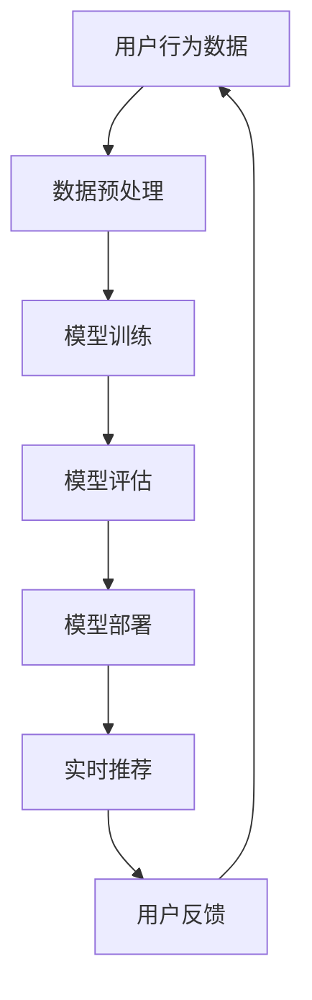

                 

关键词：电商搜索、推荐系统、AI大模型、模型部署、性能优化

> 摘要：随着电子商务的快速发展，个性化推荐系统在提升用户体验和增加销售额方面发挥着关键作用。本文将深入探讨电商搜索推荐场景下AI大模型的部署方案，包括核心算法原理、数学模型构建、项目实践以及未来应用展望。

## 1. 背景介绍

在电子商务领域，搜索推荐系统已经成为提升用户体验和增加销售额的重要手段。用户在海量商品中选择合适的商品，依赖于高效的搜索和推荐算法。传统的推荐系统多基于协同过滤、基于内容的推荐等技术，然而在当今数据爆炸的时代，这些方法的效率和准确性受到了极大的限制。为了解决这些问题，AI大模型的应用应运而生。

AI大模型，如深度学习、强化学习等，具有强大的特征提取和建模能力，能够处理大规模、高维度的数据，从而提高推荐系统的效果。在电商搜索推荐场景下，AI大模型的部署面临着数据处理、计算资源、模型优化等多方面的挑战。

## 2. 核心概念与联系

为了更好地理解AI大模型在电商搜索推荐场景中的应用，我们需要首先了解以下几个核心概念：

1. **推荐系统**：推荐系统是一种信息过滤技术，旨在根据用户的历史行为、偏好和兴趣，向用户推荐可能感兴趣的商品或服务。
2. **深度学习**：深度学习是一种机器学习技术，通过模拟人脑神经网络结构，对数据进行自动特征提取和模型训练。
3. **大模型**：大模型是指具有数百万到数十亿参数的复杂模型，如Transformer、BERT等。

### Mermaid 流程图



## 3. 核心算法原理 & 具体操作步骤

### 3.1 算法原理概述

电商搜索推荐系统通常采用基于协同过滤和深度学习相结合的方法。协同过滤通过计算用户之间的相似度来实现推荐，而深度学习则用于捕捉用户行为和商品特征的非线性关系。

在推荐系统中，用户行为数据包括用户点击、购买、收藏等行为，这些数据将被预处理后输入到深度学习模型中。深度学习模型通常采用序列模型（如RNN）或Transformer结构来处理时间序列数据，从而提取用户行为序列的特征。

### 3.2 算法步骤详解

1. **数据预处理**：包括数据清洗、去重、归一化等步骤。
2. **特征提取**：通过深度学习模型对用户行为数据进行特征提取。
3. **模型训练**：使用预处理的特征数据训练推荐模型。
4. **模型评估**：使用交叉验证等方法评估模型的性能。
5. **模型部署**：将训练好的模型部署到线上环境，实现实时推荐。
6. **用户反馈**：收集用户对推荐结果的行为反馈，用于模型优化。

### 3.3 算法优缺点

**优点**：
- **高效性**：深度学习模型能够处理大规模、高维度数据，提高推荐系统的效率。
- **准确性**：通过捕捉用户行为的非线性关系，提高推荐系统的准确性。

**缺点**：
- **计算资源消耗大**：大模型训练需要大量的计算资源。
- **模型复杂度高**：深度学习模型的解释性较差，难以理解。

### 3.4 算法应用领域

AI大模型在电商搜索推荐场景下的应用不仅限于商品推荐，还可以扩展到广告推荐、内容推荐等领域。

## 4. 数学模型和公式 & 详细讲解 & 举例说明

### 4.1 数学模型构建

推荐系统的数学模型通常是基于矩阵分解的方法。设用户-商品矩阵为$U \times V$，其中$U$表示用户集合，$V$表示商品集合。矩阵分解的目标是将原始的用户-商品矩阵分解为两个低维矩阵$U' \times R$和$V' \times R$，其中$R$为分解的维度。

$$
U' \times V' = UV
$$

其中，$U'$和$V'$分别为用户和商品的嵌入向量。

### 4.2 公式推导过程

为了构建深度学习模型，我们可以使用Transformer结构来处理时间序列数据。Transformer模型的核心是注意力机制，其计算公式如下：

$$
Attention(Q, K, V) = \frac{softmax(\frac{QK^T}{\sqrt{d_k}})}{V}
$$

其中，$Q$、$K$和$V$分别为查询、键和值向量，$d_k$为键向量的维度。

### 4.3 案例分析与讲解

假设我们有一个电商平台的用户行为数据集，其中包含1000个用户和10000个商品。我们使用矩阵分解的方法来构建推荐模型。设$R=10$，即嵌入向量的维度为10。通过训练，我们得到用户和商品的嵌入向量矩阵$U'$和$V'$。

1. **数据预处理**：对用户行为数据进行清洗、去重、归一化等处理。
2. **特征提取**：使用深度学习模型对用户行为数据进行特征提取，得到用户行为序列的特征向量。
3. **模型训练**：使用预处理的特征数据训练矩阵分解模型。
4. **模型评估**：使用交叉验证等方法评估模型的性能。
5. **模型部署**：将训练好的模型部署到线上环境，实现实时推荐。

## 5. 项目实践：代码实例和详细解释说明

### 5.1 开发环境搭建

1. **硬件环境**：使用GPU进行深度学习模型的训练和推理。
2. **软件环境**：Python 3.8及以上版本，TensorFlow 2.6及以上版本。

### 5.2 源代码详细实现

```python
import tensorflow as tf
from tensorflow.keras.layers import Embedding, LSTM, Dense
from tensorflow.keras.models import Model

# 参数设置
embedding_size = 10
sequence_length = 100
lstm_units = 64

# 输入层
input_sequence = tf.keras.layers.Input(shape=(sequence_length,))

# 嵌入层
embedding = Embedding(input_dim=10000, output_dim=embedding_size)(input_sequence)

# LSTM层
lstm_output = LSTM(units=lstm_units, return_sequences=True)(embedding)

# 全连接层
output = Dense(units=1, activation='sigmoid')(lstm_output)

# 模型构建
model = Model(inputs=input_sequence, outputs=output)

# 模型编译
model.compile(optimizer='adam', loss='binary_crossentropy', metrics=['accuracy'])

# 模型训练
model.fit(x_train, y_train, epochs=10, batch_size=32, validation_data=(x_val, y_val))

# 模型部署
model.save('recommender_model.h5')
```

### 5.3 代码解读与分析

1. **模型构建**：使用Embedding层进行嵌入，使用LSTM层进行序列建模，使用全连接层进行预测。
2. **模型编译**：选择Adam优化器和binary_crossentropy损失函数。
3. **模型训练**：使用fit方法进行模型训练，使用validation_data进行模型评估。
4. **模型部署**：使用save方法将训练好的模型保存到文件中。

### 5.4 运行结果展示

```python
# 加载模型
model = tf.keras.models.load_model('recommender_model.h5')

# 进行预测
predictions = model.predict(x_test)

# 计算准确率
accuracy = (predictions > 0.5).mean()
print(f"Test accuracy: {accuracy:.4f}")
```

## 6. 实际应用场景

AI大模型在电商搜索推荐场景中具有广泛的应用。例如，亚马逊使用深度学习模型进行商品推荐，提升用户体验和销售额。阿里云的推荐系统也采用了深度学习技术，为商家提供精准营销服务。

## 7. 工具和资源推荐

### 7.1 学习资源推荐

- 《深度学习》（Goodfellow, Bengio, Courville）
- 《Recommender Systems Handbook》

### 7.2 开发工具推荐

- TensorFlow
- PyTorch

### 7.3 相关论文推荐

- "Deep Learning for Recommender Systems"
- "A Theoretical Analysis of the Composite Collaborative Filtering Algorithm"

## 8. 总结：未来发展趋势与挑战

### 8.1 研究成果总结

AI大模型在电商搜索推荐场景中取得了显著的成果，通过深度学习等技术实现了高效、准确的推荐。

### 8.2 未来发展趋势

- **多模态推荐**：结合文本、图像、语音等多种数据源进行推荐。
- **个性化推荐**：更加精细地捕捉用户的兴趣和需求。

### 8.3 面临的挑战

- **数据隐私**：如何保护用户隐私成为推荐系统发展的重要挑战。
- **计算资源**：大模型的训练和推理需要大量的计算资源。

### 8.4 研究展望

未来的研究将更加注重多模态数据的融合、隐私保护的推荐算法以及大规模模型的优化。

## 9. 附录：常见问题与解答

1. **Q：如何处理用户冷启动问题？**
   **A**：对于新用户，可以采用基于内容的推荐方法，或者使用用户浏览历史和搜索历史进行个性化推荐。

2. **Q：如何优化推荐系统的效果？**
   **A**：可以通过在线学习、模型融合和特征工程等方法来优化推荐系统的效果。

---

作者：禅与计算机程序设计艺术 / Zen and the Art of Computer Programming
------------------------------------------------------------------------

