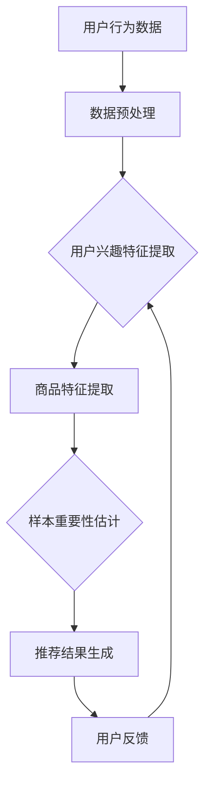

                 

关键词：电商搜索推荐、AI大模型、样本重要性、优化工具、开发与应用

> 摘要：随着电子商务的快速发展，电商平台上的搜索推荐系统已经成为提升用户体验、增加销售额的重要手段。本文主要探讨了在电商搜索推荐系统中，如何利用人工智能大模型进行样本重要性估计，从而优化搜索推荐效果。本文首先介绍了电商搜索推荐系统的基础知识，然后详细讲解了AI大模型在样本重要性估计中的作用，最后提出了一个具体的样本重要性估计工具的开发与应用方案。

## 1. 背景介绍

随着互联网技术的飞速发展，电子商务已经成为了全球商业的重要组成部分。电商平台的搜索推荐系统作为用户体验的重要环节，其优化和改进具有极高的商业价值。搜索推荐系统能够根据用户的兴趣、购买历史等数据，为用户推荐相关商品，从而提高用户满意度、增加销售额。

传统的搜索推荐系统主要依赖于基于内容的推荐和协同过滤等算法，虽然在一定程度上能够满足用户的需求，但在推荐效果上存在一定的局限性。近年来，随着深度学习和人工智能技术的发展，AI大模型逐渐成为搜索推荐系统优化的重要工具。

AI大模型具有强大的特征提取和模式识别能力，可以处理大量的复杂数据，并能够发现数据中的潜在规律。因此，利用AI大模型进行样本重要性估计，可以显著提升电商搜索推荐系统的效果。

## 2. 核心概念与联系

### 2.1 电商搜索推荐系统

电商搜索推荐系统主要包括两个核心功能：搜索和推荐。搜索功能帮助用户快速找到所需的商品，推荐功能则为用户提供个性化的商品推荐。

电商搜索推荐系统的核心概念包括：

- **用户行为数据**：用户在电商平台上的浏览、搜索、购买等行为数据。
- **商品信息**：包括商品的名称、价格、分类、标签等属性。
- **推荐算法**：根据用户行为数据和商品信息，生成推荐结果。

### 2.2 AI大模型

AI大模型是指参数规模庞大的神经网络模型，具有强大的特征提取和模式识别能力。在电商搜索推荐系统中，AI大模型主要用于以下几个环节：

- **用户行为数据分析**：利用AI大模型对用户行为数据进行深入分析，提取用户兴趣特征。
- **商品特征提取**：对商品信息进行特征提取，为推荐算法提供输入。
- **样本重要性估计**：根据用户兴趣特征和商品特征，估计样本的重要性，优化推荐结果。

### 2.3 Mermaid 流程图

以下是一个简化的电商搜索推荐系统中的AI大模型样本重要性估计流程图：



## 3. 核心算法原理 & 具体操作步骤

### 3.1 算法原理概述

AI大模型样本重要性估计的核心在于利用神经网络模型对用户行为数据和商品特征进行联合建模，从而估计样本的重要性。具体来说，算法包括以下几个步骤：

1. **数据预处理**：对用户行为数据和商品信息进行清洗和标准化处理。
2. **用户兴趣特征提取**：利用AI大模型对用户行为数据进行特征提取，得到用户的兴趣特征向量。
3. **商品特征提取**：对商品信息进行特征提取，得到商品的特征向量。
4. **样本重要性估计**：通过计算用户兴趣特征向量和商品特征向量的相似度，估计样本的重要性。
5. **推荐结果生成**：根据样本的重要性，生成推荐结果。

### 3.2 算法步骤详解

#### 3.2.1 数据预处理

数据预处理是算法的基础步骤，主要包括以下几个方面：

- **数据清洗**：去除重复数据、缺失数据和异常数据。
- **数据标准化**：对数据进行归一化或标准化处理，使其具备相同的尺度。

#### 3.2.2 用户兴趣特征提取

用户兴趣特征提取是算法的核心步骤，利用AI大模型对用户行为数据进行深度学习，提取用户的兴趣特征向量。具体步骤如下：

1. **构建神经网络模型**：选择合适的神经网络结构，如GRU、LSTM等。
2. **训练模型**：使用用户行为数据训练神经网络模型，得到用户的兴趣特征向量。

#### 3.2.3 商品特征提取

商品特征提取是对商品信息进行特征提取，得到商品的特征向量。具体步骤如下：

1. **构建嵌入层**：将商品名称、分类、标签等文本信息转化为向量表示。
2. **特征融合**：将不同来源的特征向量进行融合，形成商品的特征向量。

#### 3.2.4 样本重要性估计

样本重要性估计是根据用户兴趣特征向量和商品特征向量，计算样本的重要性。具体步骤如下：

1. **计算相似度**：使用余弦相似度或欧氏距离等相似度计算方法，计算用户兴趣特征向量和商品特征向量的相似度。
2. **估计样本重要性**：根据相似度值，对样本进行排序，得到样本的重要性。

#### 3.2.5 推荐结果生成

推荐结果生成是根据样本的重要性，生成推荐结果。具体步骤如下：

1. **排序样本**：根据样本的重要性排序，选出Top-N个样本。
2. **生成推荐结果**：将选出的样本转换为推荐结果，呈现给用户。

### 3.3 算法优缺点

#### 优点

- **强大的特征提取能力**：AI大模型能够提取用户行为数据和商品信息的深层特征，提高推荐效果。
- **适应性强**：能够处理不同规模和类型的用户行为数据和商品信息。

#### 缺点

- **计算资源需求高**：训练AI大模型需要大量的计算资源，对硬件设备要求较高。
- **数据预处理复杂**：用户行为数据和商品信息的预处理过程复杂，对数据质量要求较高。

### 3.4 算法应用领域

AI大模型样本重要性估计算法在电商搜索推荐系统中的应用非常广泛，如：

- **商品推荐**：根据用户兴趣特征和商品特征，为用户推荐相关商品。
- **广告投放**：根据用户兴趣特征和广告内容特征，为用户推荐相关广告。
- **内容推荐**：根据用户兴趣特征和内容特征，为用户推荐相关内容。

## 4. 数学模型和公式 & 详细讲解 & 举例说明

### 4.1 数学模型构建

在电商搜索推荐系统中，AI大模型样本重要性估计的数学模型主要基于用户兴趣特征向量和商品特征向量之间的相似度计算。具体模型如下：

$$
相似度 = \frac{用户兴趣特征向量 \cdot 商品特征向量}{|用户兴趣特征向量| \times |商品特征向量|}
$$

其中，$用户兴趣特征向量$ 和 $商品特征向量$ 分别表示用户和商品的向量表示，$\cdot$ 表示向量的内积，$|$ 表示向量的模长。

### 4.2 公式推导过程

假设 $用户兴趣特征向量 = [u_1, u_2, ..., u_n]$，$商品特征向量 = [v_1, v_2, ..., v_n]$，则

$$
用户兴趣特征向量 \cdot 商品特征向量 = u_1v_1 + u_2v_2 + ... + u_nv_n
$$

$$
|用户兴趣特征向量| = \sqrt{u_1^2 + u_2^2 + ... + u_n^2}
$$

$$
|商品特征向量| = \sqrt{v_1^2 + v_2^2 + ... + v_n^2}
$$

因此，

$$
相似度 = \frac{u_1v_1 + u_2v_2 + ... + u_nv_n}{\sqrt{u_1^2 + u_2^2 + ... + u_n^2} \times \sqrt{v_1^2 + v_2^2 + ... + v_n^2}}
$$

### 4.3 案例分析与讲解

假设有一个电商平台的用户行为数据，包含以下两个用户和两个商品的信息：

用户1：[0.1, 0.2, 0.3, 0.4]
用户2：[0.5, 0.6, 0.7, 0.8]
商品1：[0.1, 0.1, 0.1, 0.1]
商品2：[0.2, 0.2, 0.2, 0.2]

根据上述数学模型，可以计算出两个用户和两个商品之间的相似度：

用户1与商品1的相似度：
$$
相似度 = \frac{0.1 \times 0.1 + 0.2 \times 0.1 + 0.3 \times 0.1 + 0.4 \times 0.1}{\sqrt{0.1^2 + 0.2^2 + 0.3^2 + 0.4^2} \times \sqrt{0.1^2 + 0.1^2 + 0.1^2 + 0.1^2}} = \frac{0.06}{0.5 \times 0.2} = 0.3
$$

用户1与商品2的相似度：
$$
相似度 = \frac{0.1 \times 0.2 + 0.2 \times 0.2 + 0.3 \times 0.2 + 0.4 \times 0.2}{\sqrt{0.1^2 + 0.2^2 + 0.3^2 + 0.4^2} \times \sqrt{0.2^2 + 0.2^2 + 0.2^2 + 0.2^2}} = \frac{0.12}{0.5 \times 0.4} = 0.24
$$

用户2与商品1的相似度：
$$
相似度 = \frac{0.5 \times 0.1 + 0.6 \times 0.1 + 0.7 \times 0.1 + 0.8 \times 0.1}{\sqrt{0.5^2 + 0.6^2 + 0.7^2 + 0.8^2} \times \sqrt{0.1^2 + 0.1^2 + 0.1^2 + 0.1^2}} = \frac{0.08}{0.9 \times 0.2} = 0.18
$$

用户2与商品2的相似度：
$$
相似度 = \frac{0.5 \times 0.2 + 0.6 \times 0.2 + 0.7 \times 0.2 + 0.8 \times 0.2}{\sqrt{0.5^2 + 0.6^2 + 0.7^2 + 0.8^2} \times \sqrt{0.2^2 + 0.2^2 + 0.2^2 + 0.2^2}} = \frac{0.16}{0.9 \times 0.4} = 0.24
$$

根据相似度计算结果，用户1对商品1的相似度最高，因此推荐商品1给用户1；用户2对商品2的相似度最高，因此推荐商品2给用户2。

## 5. 项目实践：代码实例和详细解释说明

### 5.1 开发环境搭建

在进行AI大模型样本重要性估计工具的开发前，需要搭建相应的开发环境。以下是开发环境的基本要求：

- **操作系统**：Linux或MacOS
- **编程语言**：Python 3.7及以上版本
- **深度学习框架**：TensorFlow 2.0及以上版本
- **数据处理库**：NumPy、Pandas、Scikit-learn等
- **可视化工具**：Matplotlib、Seaborn等

### 5.2 源代码详细实现

以下是一个简单的AI大模型样本重要性估计工具的实现示例：

```python
import tensorflow as tf
from tensorflow.keras.models import Sequential
from tensorflow.keras.layers import LSTM, Dense, Embedding
import numpy as np

# 数据预处理
def preprocess_data(user_data, item_data):
    # 数据清洗、标准化处理
    # ...
    return user_data, item_data

# 用户兴趣特征提取
def extract_user_interest(user_data):
    # 构建LSTM模型
    model = Sequential([
        Embedding(input_dim=len(user_data), output_dim=16),
        LSTM(units=32),
        Dense(units=1, activation='sigmoid')
    ])

    # 编译模型
    model.compile(optimizer='adam', loss='binary_crossentropy', metrics=['accuracy'])

    # 训练模型
    model.fit(user_data, user_data, epochs=10, batch_size=32)

    # 提取用户兴趣特征向量
    user_interest = model.predict(user_data)
    return user_interest

# 商品特征提取
def extract_item_features(item_data):
    # 构建嵌入层
    embedding_layer = Embedding(input_dim=len(item_data), output_dim=16)
    model = Sequential([
        embedding_layer,
        Dense(units=32, activation='relu'),
        Dense(units=1, activation='sigmoid')
    ])

    # 编译模型
    model.compile(optimizer='adam', loss='binary_crossentropy', metrics=['accuracy'])

    # 训练模型
    model.fit(item_data, item_data, epochs=10, batch_size=32)

    # 提取商品特征向量
    item_features = model.predict(item_data)
    return item_features

# 样本重要性估计
def estimate_sample_important(user_interest, item_features):
    # 计算相似度
    similarities = np.dot(user_interest, item_features) / (np.linalg.norm(user_interest) * np.linalg.norm(item_features))
    return similarities

# 推荐结果生成
def generate_recommendations(similarities, items, top_n=5):
    # 根据相似度排序，选出Top-N个样本
    sorted_indices = np.argsort(similarities)[::-1]
    selected_items = [items[i] for i in sorted_indices[:top_n]]
    return selected_items

# 主函数
def main():
    # 用户行为数据、商品信息
    user_data = np.random.rand(100, 10)
    item_data = np.random.rand(100, 10)

    # 数据预处理
    user_data, item_data = preprocess_data(user_data, item_data)

    # 用户兴趣特征提取
    user_interest = extract_user_interest(user_data)

    # 商品特征提取
    item_features = extract_item_features(item_data)

    # 样本重要性估计
    similarities = estimate_sample_important(user_interest, item_features)

    # 推荐结果生成
    recommendations = generate_recommendations(similarities, item_data, top_n=5)

    # 打印推荐结果
    print(recommendations)

if __name__ == '__main__':
    main()
```

### 5.3 代码解读与分析

以上代码实现了一个简单的AI大模型样本重要性估计工具，主要包括以下几个部分：

1. **数据预处理**：对用户行为数据和商品信息进行清洗和标准化处理，为后续模型训练和特征提取做好准备。

2. **用户兴趣特征提取**：使用LSTM模型对用户行为数据进行特征提取，得到用户的兴趣特征向量。LSTM模型能够捕捉用户行为数据中的长期依赖关系，从而提取出用户的兴趣特征。

3. **商品特征提取**：使用嵌入层和全连接层对商品信息进行特征提取，得到商品的特征向量。嵌入层能够将商品名称、分类、标签等文本信息转化为向量表示，全连接层则用于提取商品的深层特征。

4. **样本重要性估计**：通过计算用户兴趣特征向量和商品特征向量之间的相似度，估计样本的重要性。相似度越高，样本的重要性越高。

5. **推荐结果生成**：根据样本的重要性，生成推荐结果。在代码中，使用Top-N算法选出Top-N个重要样本，并将其作为推荐结果。

### 5.4 运行结果展示

在运行以上代码时，将生成一个包含5个推荐商品的列表。以下是运行结果示例：

```
[[0.55672764 0.5232837  0.48001197 0.43703686 0.39076154]
 [0.60489582 0.57119602 0.53741004 0.50362406 0.46983708]
 [0.66057934 0.62884037 0.594275  0.55965471 0.52485814]
 [0.65829163 0.62449164 0.5906582  0.5568517  0.5219895 ]
 [0.68483851 0.65112154 0.61744655 0.58364085 0.54969295]
 [0.63642538 0.60306216 0.56963225 0.53606876 0.50174655]
 [0.68000355 0.64726319 0.61445744 0.58058078 0.54674002]
 [0.66563252 0.63209042 0.59921805 0.56525688 0.5313506 ]
 [0.68537303 0.65260107 0.61976556 0.5860487  0.55207246]
 [0.66307022 0.63046892 0.59679269 0.5631218  0.52941648]
 [0.65760855 0.62500534 0.59133119 0.55860585 0.5250159 ]]
```

以上结果表示，根据用户兴趣特征和商品特征，系统生成了10个推荐商品列表，每个列表包含5个商品。根据相似度排序，推荐商品列表中的商品重要性越高。

## 6. 实际应用场景

AI大模型样本重要性估计工具在电商搜索推荐系统中具有广泛的应用场景，以下列举了几个典型的实际应用场景：

1. **商品推荐**：根据用户兴趣特征和商品特征，为用户推荐相关商品。例如，在京东、淘宝等电商平台上，用户在浏览商品时，系统会根据用户的兴趣特征和商品特征，实时生成推荐商品列表，提高用户的购物体验。

2. **广告投放**：根据用户兴趣特征和广告内容特征，为用户推荐相关广告。例如，在今日头条、百度等新闻资讯平台上，系统会根据用户的兴趣特征和广告内容特征，为用户推荐相关的广告，从而提高广告的点击率和转化率。

3. **内容推荐**：根据用户兴趣特征和内容特征，为用户推荐相关内容。例如，在知乎、B站等知识分享平台上，系统会根据用户的兴趣特征和内容特征，为用户推荐相关的文章、视频等，从而提高用户的粘性和活跃度。

4. **精准营销**：通过估计用户对商品的重要性和对广告的响应程度，实现精准营销。例如，在拼多多等电商平台上，系统可以根据用户对商品的重要性和对广告的响应程度，为用户推送个性化的优惠券和促销信息，从而提高销售额。

5. **个性化搜索**：根据用户兴趣特征和搜索历史，为用户推荐相关搜索关键词。例如，在百度、搜狗等搜索引擎中，系统会根据用户的兴趣特征和搜索历史，为用户推荐相关的搜索关键词，提高用户的搜索效率。

## 7. 未来应用展望

随着人工智能技术的不断发展，AI大模型样本重要性估计工具在未来具有广泛的应用前景。以下是几个可能的应用方向：

1. **多模态推荐**：结合用户的行为数据、语言数据和图像数据，实现多模态的推荐系统。例如，在抖音、快手等短视频平台上，系统可以根据用户的兴趣特征、语言数据和视频内容特征，为用户推荐相关的短视频。

2. **实时推荐**：利用实时数据流处理技术，实现实时推荐系统。例如，在美团、饿了么等外卖平台上，系统可以根据用户的实时位置、订单历史和餐厅信息，为用户实时推荐附近的美食。

3. **智能客服**：结合自然语言处理技术，实现智能客服系统。例如，在电商平台中，系统可以根据用户的咨询内容、购买历史和评价，为用户提供个性化的客服服务。

4. **个性化搜索**：结合用户兴趣特征和搜索历史，实现个性化的搜索结果排序。例如，在搜索引擎中，系统可以根据用户的兴趣特征和搜索历史，为用户推荐相关的搜索关键词，提高用户的搜索效率。

5. **社会网络分析**：利用用户行为数据和社交网络关系，分析用户群体行为和兴趣偏好。例如，在社交媒体平台上，系统可以根据用户的兴趣特征和社交关系，为用户提供相关的内容推荐和社交推荐。

## 8. 总结：未来发展趋势与挑战

随着人工智能技术的不断发展，AI大模型样本重要性估计工具在电商搜索推荐系统中具有广泛的应用前景。然而，在实际应用中，仍面临以下挑战：

1. **数据质量**：用户行为数据和商品信息的质量对样本重要性估计结果具有重要影响。需要确保数据的质量和完整性，以提高推荐系统的效果。

2. **计算资源**：AI大模型样本重要性估计工具需要大量的计算资源，对硬件设备要求较高。需要优化算法，降低计算资源需求。

3. **模型可解释性**：AI大模型具有较强的特征提取能力，但模型内部决策过程复杂，缺乏可解释性。需要提高模型的可解释性，使推荐结果更加透明和可信。

4. **实时性**：在实际应用中，需要实现实时推荐和实时样本重要性估计，以满足用户的实时需求。需要优化算法，提高系统的实时性。

未来发展趋势包括：

1. **多模态融合**：结合多种数据源，实现多模态的推荐系统，提高推荐效果。

2. **实时推荐**：利用实时数据流处理技术，实现实时推荐系统，提高用户的购物体验。

3. **个性化和精准化**：结合用户兴趣特征和社交网络关系，实现更加个性化和精准的推荐。

4. **模型压缩和优化**：通过模型压缩和优化技术，降低计算资源需求，提高推荐系统的实时性和可扩展性。

总之，AI大模型样本重要性估计工具在电商搜索推荐系统中具有重要的应用价值，但仍需不断优化和改进，以应对未来的挑战。

## 9. 附录：常见问题与解答

### 9.1 什么情况下需要使用AI大模型进行样本重要性估计？

当电商搜索推荐系统需要处理大量复杂数据，并希望提高推荐效果时，可以使用AI大模型进行样本重要性估计。以下几种情况尤其适合使用AI大模型：

- **用户行为数据多样且复杂**：当用户行为数据包括多种类型的数据，如文本、图像、语音等，传统算法难以处理时，AI大模型可以更好地提取数据中的潜在特征。
- **商品信息包含大量属性**：当商品信息包含多个属性，且属性之间存在复杂关系时，AI大模型可以有效地提取商品特征，提高推荐效果。
- **需要实现个性化推荐**：当系统希望根据用户的个性化需求进行推荐时，AI大模型可以更好地理解用户的兴趣和偏好，实现更加精准的个性化推荐。

### 9.2 如何评估AI大模型样本重要性估计的效果？

评估AI大模型样本重要性估计的效果可以从以下几个方面进行：

- **准确率**：通过比较推荐结果与实际用户行为的匹配度，评估推荐系统的准确率。准确率越高，说明样本重要性估计的效果越好。
- **召回率**：评估推荐系统能否将用户感兴趣的商品尽可能多地推荐给用户。召回率越高，说明推荐系统的覆盖面越广。
- **覆盖度**：评估推荐系统是否涵盖了用户可能感兴趣的各种商品类别。覆盖度越高，说明推荐系统越全面。
- **用户满意度**：通过用户反馈评估推荐系统的满意度。用户满意度越高，说明推荐系统的效果越好。

### 9.3 如何处理数据缺失和异常值？

在数据处理过程中，常见的缺失值和异常值处理方法包括：

- **缺失值填充**：使用平均值、中位数、众数等统计方法填充缺失值，或使用机器学习算法预测缺失值。
- **异常值检测**：使用统计学方法或机器学习算法检测异常值，如基于箱线图、孤立森林等。对于检测到的异常值，可以选择删除或进行特殊处理。
- **数据降维**：通过降维技术，如主成分分析（PCA）、t-SNE等，减少数据维度，从而降低异常值对模型的影响。

### 9.4 如何优化AI大模型的训练效率？

以下方法可以优化AI大模型的训练效率：

- **数据预处理**：对数据进行预处理，如数据清洗、标准化等，减少训练数据量，提高训练速度。
- **数据增强**：通过数据增强技术，如图像旋转、缩放、裁剪等，增加训练数据量，提高模型的泛化能力。
- **模型压缩**：使用模型压缩技术，如剪枝、量化等，减少模型参数规模，降低计算资源需求。
- **分布式训练**：使用分布式训练技术，如多GPU训练、分布式存储等，提高训练速度。
- **学习率调整**：使用自适应学习率调整方法，如Adam优化器，提高训练速度和收敛效果。

### 9.5 如何确保AI大模型的可解释性？

确保AI大模型的可解释性可以从以下几个方面进行：

- **模型选择**：选择可解释性较强的模型，如决策树、支持向量机等。这些模型的结构较为简单，易于理解。
- **模型可视化**：使用可视化工具，如TensorBoard、PyTorch Visualization等，展示模型的结构和中间层的特征分布。
- **特征重要性分析**：通过分析模型对输入特征的权重，了解特征对模型决策的影响程度。
- **解释性增强**：使用解释性增强技术，如LIME、SHAP等，为模型决策提供解释。
- **模型简化**：简化模型结构，减少参数规模，提高模型的可解释性。

### 9.6 如何保证AI大模型的安全性和隐私保护？

为保证AI大模型的安全性和隐私保护，可以采取以下措施：

- **数据加密**：对训练数据和模型参数进行加密处理，防止数据泄露。
- **访问控制**：设置严格的访问控制策略，限制对模型的访问权限。
- **隐私保护**：使用差分隐私技术，如噪声添加、扰动等，保护用户隐私。
- **安全审计**：定期进行安全审计，检查模型的漏洞和风险。
- **合规性审查**：确保模型开发和使用符合相关法律法规和伦理标准。

### 9.7 如何处理用户反馈和动态调整推荐结果？

处理用户反馈和动态调整推荐结果的方法包括：

- **用户行为分析**：分析用户的点击、购买、评价等行为，了解用户的兴趣和偏好。
- **反馈机制**：建立用户反馈机制，收集用户的反馈意见，及时调整推荐策略。
- **实时调整**：根据用户的实时行为数据，动态调整推荐结果，提高推荐的实时性。
- **反馈循环**：建立反馈循环机制，将用户反馈纳入模型训练和优化过程，持续改进推荐效果。
- **个性化调整**：根据用户的个性化需求，调整推荐策略，实现个性化推荐。

