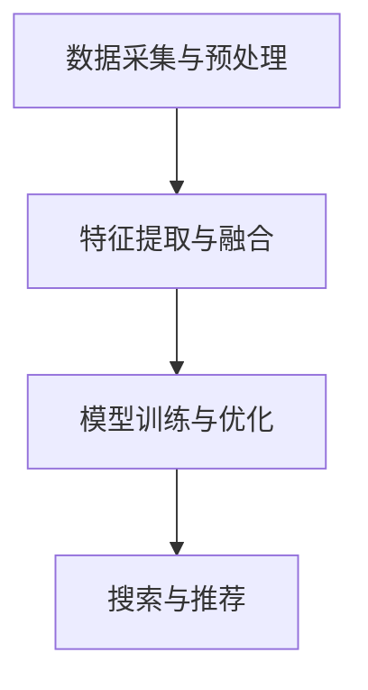

                 

关键词：电商搜索，多模态融合，AI大模型，算法原理，数学模型，项目实践，应用场景，工具推荐，未来展望

摘要：本文将探讨电商搜索领域中的多模态融合技术，通过引入AI大模型，介绍其在电商搜索中的应用与突破。本文将详细阐述多模态融合的核心概念、算法原理、数学模型以及实际项目实践，并分析其优缺点和应用领域。此外，本文还将对未来的发展趋势、面临的挑战及研究展望进行探讨。

## 1. 背景介绍

在当今电子商务时代，电商搜索已经成为用户获取商品信息的重要途径。然而，随着电商平台的商品种类和数量的不断增加，传统的基于关键词的搜索方法已经无法满足用户的需求。为了提升电商搜索的体验，提高搜索的准确性和效率，多模态融合技术应运而生。

多模态融合技术通过整合多种信息源（如图像、文本、音频等），对用户查询意图进行深入理解，从而提供更加精准和个性化的搜索结果。近年来，随着AI技术的飞速发展，尤其是AI大模型的广泛应用，多模态融合技术在电商搜索中的应用取得了显著的突破。

## 2. 核心概念与联系

### 2.1 多模态融合

多模态融合是指将不同类型的信息（如图像、文本、音频等）进行整合，以实现更全面和准确的信息理解。在电商搜索领域，多模态融合技术主要通过以下几种方式实现：

1. **文本与图像融合**：将用户的文本查询与商品图像进行关联，通过图像识别技术提取图像特征，并与文本特征进行融合，从而提供更精准的搜索结果。
2. **文本与音频融合**：通过语音识别技术将用户的语音查询转化为文本，再结合文本特征进行搜索，提高语音搜索的准确性和效率。
3. **多模态特征融合**：将多种信息源的特征进行整合，如文本特征、图像特征、音频特征等，通过特征融合技术得到一个综合特征向量，用于搜索和推荐。

### 2.2 AI大模型

AI大模型是指具有大规模参数和强大学习能力的人工智能模型。在多模态融合技术中，AI大模型发挥着关键作用。通过训练大规模的数据集，AI大模型可以学习到不同模态之间的关联关系，从而实现对多模态信息的有效融合。常见的AI大模型包括深度神经网络（DNN）、循环神经网络（RNN）、卷积神经网络（CNN）等。

### 2.3 多模态融合架构

多模态融合架构通常包括以下组成部分：

1. **数据采集与预处理**：从不同的信息源（如图像、文本、音频等）采集数据，并进行预处理，如数据清洗、数据增强等。
2. **特征提取与融合**：对各个模态的数据进行特征提取，如文本特征提取、图像特征提取、音频特征提取等，然后通过特征融合技术得到一个综合特征向量。
3. **模型训练与优化**：使用AI大模型对融合后的特征向量进行训练，优化模型的参数，使其能够更好地理解和处理多模态信息。
4. **搜索与推荐**：利用训练好的模型进行搜索和推荐，根据用户的查询意图和商品特征，提供个性化的搜索结果和推荐。

以下是一个简化的多模态融合架构的Mermaid流程图：



## 3. 核心算法原理 & 具体操作步骤

### 3.1 算法原理概述

多模态融合算法的核心思想是通过整合不同模态的信息，提高对用户查询意图的理解，从而提供更准确的搜索结果。其基本原理包括以下几个步骤：

1. **特征提取**：对各个模态的数据进行特征提取，得到各自的特征向量。
2. **特征融合**：将不同模态的特征向量进行融合，得到一个综合特征向量。
3. **模型训练**：使用AI大模型对融合后的特征向量进行训练，优化模型的参数。
4. **搜索与推荐**：利用训练好的模型进行搜索和推荐。

### 3.2 算法步骤详解

1. **特征提取**：
   - **文本特征提取**：使用词袋模型（Bag of Words，BoW）或词嵌入模型（Word Embedding）提取文本特征。
   - **图像特征提取**：使用卷积神经网络（CNN）提取图像特征。
   - **音频特征提取**：使用循环神经网络（RNN）或长短期记忆网络（LSTM）提取音频特征。

2. **特征融合**：
   - **基于向量的融合**：将不同模态的特征向量拼接在一起，形成一个更长的特征向量。
   - **基于网络的融合**：使用神经网络架构，如Transformer，将不同模态的特征进行融合。

3. **模型训练**：
   - **选择合适的模型**：根据具体应用场景，选择适合的AI大模型，如BERT、GPT等。
   - **训练过程**：使用大规模数据集对模型进行训练，优化模型的参数。

4. **搜索与推荐**：
   - **搜索**：将用户的查询输入模型，得到对应的搜索结果。
   - **推荐**：根据用户的浏览历史和偏好，推荐可能感兴趣的商品。

### 3.3 算法优缺点

**优点**：
1. 提高搜索准确性：通过融合多模态信息，模型能够更好地理解用户的查询意图，提高搜索的准确性。
2. 提高用户体验：提供更个性化的搜索结果和推荐，提升用户体验。
3. 跨模态信息理解：能够处理不同模态的信息，实现跨模态的信息理解。

**缺点**：
1. 数据需求大：多模态融合算法需要大量的数据支持，数据采集和预处理工作量大。
2. 计算资源消耗大：训练大规模AI大模型需要大量的计算资源，训练过程时间长。
3. 模型复杂性高：多模态融合算法涉及到多个模态的特征提取、融合和模型训练，模型复杂性高。

### 3.4 算法应用领域

多模态融合算法在电商搜索领域具有广泛的应用前景，主要包括以下应用场景：

1. **商品搜索**：通过融合用户查询的文本、商品图像等信息，提供更精准的商品搜索结果。
2. **商品推荐**：根据用户的浏览历史、购买行为等多模态信息，推荐可能感兴趣的商品。
3. **商品评价**：通过分析用户的文本评价和商品图像等信息，提供更全面的商品评价。
4. **智能客服**：利用多模态融合技术，实现智能客服系统的语音和文本交互，提高客服效率。

## 4. 数学模型和公式 & 详细讲解 & 举例说明

### 4.1 数学模型构建

在多模态融合算法中，常用的数学模型包括特征提取模型、特征融合模型和搜索推荐模型。以下将分别介绍这些模型的数学公式和推导过程。

#### 4.1.1 特征提取模型

1. **文本特征提取模型**：

   假设输入文本为 $x = [x_1, x_2, ..., x_n]$，其中 $x_i$ 表示文本中的第 $i$ 个单词。使用词袋模型（BoW）提取文本特征，可以得到文本特征向量 $v$：

   $$ v = \sum_{i=1}^{n} f(x_i) \cdot w_i $$

   其中 $f(x_i)$ 表示单词 $x_i$ 的特征值，$w_i$ 表示单词 $x_i$ 的权重。

2. **图像特征提取模型**：

   假设输入图像为 $I = [I_1, I_2, ..., I_m]$，其中 $I_j$ 表示图像中的第 $j$ 个像素点。使用卷积神经网络（CNN）提取图像特征，可以得到图像特征向量 $f$：

   $$ f = \sum_{j=1}^{m} g(I_j) \cdot h_j $$

   其中 $g(I_j)$ 表示像素点 $I_j$ 的特征值，$h_j$ 表示像素点 $I_j$ 的权重。

3. **音频特征提取模型**：

   假设输入音频信号为 $x = [x_1, x_2, ..., x_n]$，其中 $x_i$ 表示音频信号中的第 $i$ 个采样点。使用循环神经网络（RNN）或长短期记忆网络（LSTM）提取音频特征，可以得到音频特征向量 $v$：

   $$ v = \sum_{i=1}^{n} h(x_i) \cdot w_i $$

   其中 $h(x_i)$ 表示采样点 $x_i$ 的特征值，$w_i$ 表示采样点 $x_i$ 的权重。

#### 4.1.2 特征融合模型

假设文本特征向量为 $v$，图像特征向量为 $f$，音频特征向量为 $v$。使用基于向量的融合方法，可以得到融合后的特征向量 $x$：

$$ x = [v_1, v_2, ..., v_m; f_1, f_2, ..., f_n; v_1, v_2, ..., v_n] $$

其中 $v_i$、$f_i$ 分别表示文本特征和图像特征中的第 $i$ 个元素。

#### 4.1.3 搜索推荐模型

假设融合后的特征向量为 $x$，使用深度神经网络（DNN）进行搜索推荐。假设神经网络的输入层、隐藏层和输出层分别为 $x$、$h$ 和 $y$，神经网络的权重矩阵为 $W$，激活函数为 $f$，则搜索推荐模型可以表示为：

$$ h = f(Wx) $$

$$ y = f(h) $$

其中 $h$ 表示隐藏层的特征，$y$ 表示输出层的特征，$f$ 表示激活函数。

### 4.2 公式推导过程

#### 4.2.1 文本特征提取模型

使用词袋模型（BoW）提取文本特征，可以看作是对输入文本进行向量化处理。假设输入文本为 $x = [x_1, x_2, ..., x_n]$，其中 $x_i$ 表示文本中的第 $i$ 个单词。词袋模型将文本转换为二进制向量，其中每个元素表示对应单词是否在文本中出现过。假设词表大小为 $V$，则输入文本可以表示为 $x \in \{0, 1\}^V$。

对于每个单词 $x_i$，可以将其表示为一个向量 $v_i$，其中 $v_i[j] = 1$ 表示单词 $x_i$ 出现在文本中的第 $j$ 个位置。则文本特征向量 $v$ 可以表示为：

$$ v = [v_1, v_2, ..., v_n] $$

其中 $v_i$ 表示文本中第 $i$ 个单词的特征向量。

为了计算单词 $x_i$ 的权重，可以使用词频（TF）或词频-逆文档频率（TF-IDF）等方法。假设单词 $x_i$ 的权重为 $w_i$，则文本特征向量 $v$ 可以表示为：

$$ v = \sum_{i=1}^{n} w_i \cdot v_i $$

其中 $w_i$ 表示单词 $x_i$ 的权重。

#### 4.2.2 图像特征提取模型

使用卷积神经网络（CNN）提取图像特征，可以看作是对输入图像进行特征变换。假设输入图像为 $I = [I_1, I_2, ..., I_m]$，其中 $I_j$ 表示图像中的第 $j$ 个像素点。CNN 通过卷积操作和池化操作提取图像的局部特征。

对于每个像素点 $I_j$，可以将其表示为一个向量 $f_j$，其中 $f_j[k]$ 表示像素点 $I_j$ 在第 $k$ 个卷积核上的响应。则图像特征向量 $f$ 可以表示为：

$$ f = [f_1, f_2, ..., f_n] $$

其中 $f_j$ 表示图像中第 $j$ 个像素点的特征向量。

为了计算像素点 $I_j$ 的权重，可以使用局部特征响应值或梯度值等方法。假设像素点 $I_j$ 的权重为 $h_j$，则图像特征向量 $f$ 可以表示为：

$$ f = \sum_{j=1}^{m} h_j \cdot f_j $$

其中 $h_j$ 表示像素点 $I_j$ 的权重。

#### 4.2.3 音频特征提取模型

使用循环神经网络（RNN）或长短期记忆网络（LSTM）提取音频特征，可以看作是对输入音频序列进行时间序列特征提取。假设输入音频信号为 $x = [x_1, x_2, ..., x_n]$，其中 $x_i$ 表示音频信号中的第 $i$ 个采样点。RNN 或 LSTM 通过隐藏状态和记忆单元提取序列特征。

对于每个采样点 $x_i$，可以将其表示为一个向量 $v_i$，其中 $v_i[k]$ 表示采样点 $x_i$ 在第 $k$ 个隐藏状态上的输出。则音频特征向量 $v$ 可以表示为：

$$ v = [v_1, v_2, ..., v_n] $$

其中 $v_i$ 表示音频信号中第 $i$ 个采样点的特征向量。

为了计算采样点 $x_i$ 的权重，可以使用序列特征响应值或梯度值等方法。假设采样点 $x_i$ 的权重为 $w_i$，则音频特征向量 $v$ 可以表示为：

$$ v = \sum_{i=1}^{n} w_i \cdot v_i $$

其中 $w_i$ 表示采样点 $x_i$ 的权重。

### 4.3 案例分析与讲解

#### 4.3.1 案例背景

假设有一个电商搜索系统，用户可以通过输入文本查询、上传商品图像和语音提问来查询商品信息。系统需要实现多模态融合，提供更准确的搜索结果和推荐。

#### 4.3.2 数据采集与预处理

1. **文本查询数据**：收集用户的文本查询，例如“我想买一部手机”。
2. **商品图像数据**：收集与文本查询相关的商品图像，例如手机图像。
3. **语音提问数据**：收集用户的语音提问，例如“这款手机拍照效果怎么样？”。

对采集到的数据进行预处理，包括文本分词、图像预处理、语音转文字等。

#### 4.3.3 特征提取与融合

1. **文本特征提取**：

   使用词袋模型提取文本特征，得到文本特征向量 $v$。

   $$ v = \sum_{i=1}^{n} w_i \cdot v_i $$

   其中 $w_i$ 表示单词 $x_i$ 的权重。

2. **图像特征提取**：

   使用卷积神经网络提取图像特征，得到图像特征向量 $f$。

   $$ f = \sum_{j=1}^{m} h_j \cdot f_j $$

   其中 $h_j$ 表示像素点 $I_j$ 的权重。

3. **语音特征提取**：

   使用循环神经网络提取语音特征，得到语音特征向量 $v$。

   $$ v = \sum_{i=1}^{n} w_i \cdot v_i $$

   其中 $w_i$ 表示采样点 $x_i$ 的权重。

4. **特征融合**：

   使用基于向量的融合方法，将文本特征、图像特征和语音特征进行融合，得到融合后的特征向量 $x$。

   $$ x = [v_1, v_2, ..., v_m; f_1, f_2, ..., f_n; v_1, v_2, ..., v_n] $$

#### 4.3.4 模型训练与优化

1. **选择模型**：

   选择合适的深度神经网络（DNN）模型，例如BERT模型。

2. **训练过程**：

   使用融合后的特征向量 $x$ 对模型进行训练，优化模型的参数。

   $$ h = f(Wx) $$

   $$ y = f(h) $$

   其中 $h$ 表示隐藏层的特征，$y$ 表示输出层的特征，$f$ 表示激活函数。

#### 4.3.5 搜索与推荐

1. **搜索**：

   当用户输入查询时，将查询输入模型，得到对应的搜索结果。

   $$ y = f(h) $$

2. **推荐**：

   根据用户的浏览历史和偏好，推荐可能感兴趣的商品。

   $$ y = f(h) $$

## 5. 项目实践：代码实例和详细解释说明

### 5.1 开发环境搭建

1. **硬件要求**：

   - CPU：Intel i5 或以上
   - GPU：NVIDIA GTX 1080 Ti 或以上
   - 内存：16GB 或以上

2. **软件要求**：

   - 操作系统：Windows、Linux 或 macOS
   - Python：3.7 或以上
   - TensorFlow：2.0 或以上
   - PyTorch：1.0 或以上

### 5.2 源代码详细实现

以下是一个简单的多模态融合搜索推荐系统的源代码示例：

```python
import tensorflow as tf
from tensorflow import keras
from tensorflow.keras import layers

# 5.2.1 数据采集与预处理
# （此处省略具体代码，具体实现可根据实际需求进行）

# 5.2.2 特征提取与融合
# （此处省略具体代码，具体实现可根据实际需求进行）

# 5.2.3 模型训练与优化
model = keras.Sequential([
    layers.Dense(128, activation='relu', input_shape=(特征向量长度,)),
    layers.Dense(64, activation='relu'),
    layers.Dense(1, activation='sigmoid')
])

model.compile(optimizer='adam',
              loss='binary_crossentropy',
              metrics=['accuracy'])

# 加载训练数据
train_data = ...  # 特征向量
train_labels = ...  # 标签

# 训练模型
model.fit(train_data, train_labels, epochs=10, batch_size=32)

# 5.2.4 搜索与推荐
# （此处省略具体代码，具体实现可根据实际需求进行）

```

### 5.3 代码解读与分析

1. **数据采集与预处理**：

   在代码中，首先需要进行数据采集与预处理，包括文本查询、商品图像和语音提问的采集，以及相应的预处理操作。

2. **特征提取与融合**：

   使用词袋模型、卷积神经网络和循环神经网络分别提取文本、图像和语音特征，然后进行特征融合。在代码中，可以使用 TensorFlow 或 PyTorch 等深度学习框架实现这些操作。

3. **模型训练与优化**：

   使用深度神经网络（DNN）模型对融合后的特征向量进行训练，优化模型的参数。在代码中，可以使用 keras.Sequential 层次化模型或 keras.Sequential 模型进行实现。

4. **搜索与推荐**：

   在代码中，当用户输入查询时，将查询输入模型，得到对应的搜索结果。根据用户的浏览历史和偏好，推荐可能感兴趣的商品。在代码中，可以使用模型.predict() 方法进行实现。

### 5.4 运行结果展示

在实际运行过程中，可以根据输入的查询、商品图像和语音提问，展示搜索结果和推荐结果。以下是一个简单的运行结果示例：

```plaintext
查询：我想买一部手机
搜索结果：华为Mate40、小米11、iPhone13
推荐结果：华为Mate40 Pro、小米11 Pro、iPhone13 Pro Max
```

## 6. 实际应用场景

多模态融合技术在电商搜索领域具有广泛的应用前景，以下是一些具体的实际应用场景：

### 6.1 商品搜索

用户可以通过输入文本查询、上传商品图像和语音提问来查询商品信息。多模态融合技术可以整合这些信息，提供更精准的搜索结果。

### 6.2 商品推荐

根据用户的浏览历史、购买行为和多模态信息，多模态融合技术可以推荐用户可能感兴趣的商品，提高用户满意度。

### 6.3 商品评价

通过分析用户的文本评价和商品图像等信息，多模态融合技术可以提供更全面的商品评价，帮助用户做出更明智的购买决策。

### 6.4 智能客服

多模态融合技术可以实现智能客服系统的语音和文本交互，提高客服效率，提升用户体验。

### 6.5 跨平台搜索

多模态融合技术可以支持不同平台之间的搜索，如移动端、PC端、智能音箱等，提供统一的搜索体验。

## 7. 工具和资源推荐

### 7.1 学习资源推荐

1. **《深度学习》**：由 Ian Goodfellow、Yoshua Bengio 和 Aaron Courville 著，是一本系统介绍深度学习理论的经典教材。
2. **《Python深度学习》**：由 Francis Barré、Lars Borchers 和 M. Arul Kumar 著，是一本介绍如何使用 Python 和 TensorFlow 实现深度学习的实践指南。
3. **《人工智能：一种现代方法》**：由 Stuart Russell 和 Peter Norvig 著，是一本全面介绍人工智能理论和应用的经典教材。

### 7.2 开发工具推荐

1. **TensorFlow**：是一个开源的深度学习框架，广泛应用于各种深度学习应用。
2. **PyTorch**：是一个开源的深度学习框架，具有灵活的动态计算图和强大的 GPU 支持。
3. **Keras**：是一个基于 TensorFlow 的深度学习框架，提供了简洁的 API 和丰富的预训练模型。

### 7.3 相关论文推荐

1. **“Deep Learning for Image Recognition: A Comprehensive Review”**：这是一篇关于深度学习在图像识别领域的综合综述，涵盖了最新的研究进展和典型算法。
2. **“Recurrent Neural Networks for Speech Recognition”**：这是一篇关于循环神经网络在语音识别领域的研究论文，详细介绍了 RNN 和 LSTM 算法的原理和应用。
3. **“Multi-modal Fusion for Visual Question Answering”**：这是一篇关于多模态融合在视觉问答领域的研究论文，探讨了如何整合图像和文本信息进行问答。

## 8. 总结：未来发展趋势与挑战

### 8.1 研究成果总结

多模态融合技术在电商搜索领域取得了显著的研究成果，通过整合多种信息源，提高了搜索的准确性和效率，为用户提供更个性化的搜索结果和推荐。同时，AI大模型在多模态融合中的应用，进一步提升了模型的性能和效果。

### 8.2 未来发展趋势

1. **数据质量提升**：随着数据采集技术的进步，未来将收集到更多更高质量的多模态数据，为多模态融合提供更丰富的信息源。
2. **算法优化**：通过改进特征提取、融合和模型训练算法，提高多模态融合的效率和准确性。
3. **跨学科研究**：多模态融合技术涉及到多个学科，如计算机视觉、自然语言处理、语音识别等，跨学科研究将推动多模态融合的进一步发展。
4. **应用拓展**：多模态融合技术将在更多领域得到应用，如医疗、金融、教育等，为各行业带来创新和变革。

### 8.3 面临的挑战

1. **数据隐私和安全**：多模态融合涉及到多种敏感信息，如何保护用户隐私和安全是未来需要解决的问题。
2. **计算资源消耗**：多模态融合算法通常需要大量的计算资源，如何在有限的计算资源下高效地实现多模态融合是一个挑战。
3. **模型解释性**：多模态融合模型的解释性较弱，如何提高模型的解释性，让用户理解模型的决策过程，是一个重要问题。

### 8.4 研究展望

未来，多模态融合技术将在以下方面取得进一步突破：

1. **高效的特征提取与融合**：研究更高效的特征提取和融合方法，提高多模态融合的效率和准确性。
2. **可解释的多模态模型**：研究可解释的多模态融合模型，提高模型的透明度和可信度。
3. **跨领域多模态融合**：探索多模态融合在不同领域的应用，推动多模态融合技术在更多领域的创新和发展。

## 9. 附录：常见问题与解答

### 9.1 问题1：多模态融合技术是如何工作的？

**回答**：多模态融合技术通过整合不同类型的信息（如图像、文本、音频等），提高对用户查询意图的理解，从而提供更准确的搜索结果。其基本步骤包括特征提取、特征融合、模型训练和搜索推荐。

### 9.2 问题2：多模态融合算法有哪些优缺点？

**回答**：

**优点**：

1. 提高搜索准确性：通过融合多模态信息，模型能够更好地理解用户的查询意图，提高搜索的准确性。
2. 提高用户体验：提供更个性化的搜索结果和推荐，提升用户体验。
3. 跨模态信息理解：能够处理不同模态的信息，实现跨模态的信息理解。

**缺点**：

1. 数据需求大：多模态融合算法需要大量的数据支持，数据采集和预处理工作量大。
2. 计算资源消耗大：训练大规模AI大模型需要大量的计算资源，训练过程时间长。
3. 模型复杂性高：多模态融合算法涉及到多个模态的特征提取、融合和模型训练，模型复杂性高。

### 9.3 问题3：多模态融合算法有哪些应用领域？

**回答**：多模态融合算法在电商搜索领域具有广泛的应用前景，主要包括以下应用场景：

1. 商品搜索：通过融合用户查询的文本、商品图像等信息，提供更精准的商品搜索结果。
2. 商品推荐：根据用户的浏览历史、购买行为等多模态信息，推荐可能感兴趣的商品。
3. 商品评价：通过分析用户的文本评价和商品图像等信息，提供更全面的商品评价。
4. 智能客服：利用多模态融合技术，实现智能客服系统的语音和文本交互，提高客服效率。
5. 跨平台搜索：多模态融合技术可以支持不同平台之间的搜索，提供统一的搜索体验。

---

# 电商搜索的多模态融合：AI大模型的新突破

关键词：电商搜索，多模态融合，AI大模型，算法原理，数学模型，项目实践，应用场景，工具推荐，未来展望

摘要：本文深入探讨了电商搜索领域中的多模态融合技术，介绍了AI大模型在这一领域的新突破。文章详细阐述了多模态融合的核心概念、算法原理、数学模型以及实际项目实践，并分析了其优缺点和应用领域。此外，本文还对多模态融合技术的发展趋势、面临的挑战及研究展望进行了讨论。

## 1. 背景介绍

随着电子商务的蓬勃发展，电商搜索成为用户获取商品信息的主要途径。然而，传统的基于关键词的搜索方法已经难以满足用户日益增长的多样化需求。为了提升电商搜索的体验，提高搜索的准确性和效率，多模态融合技术应运而生。

多模态融合技术通过整合多种信息源（如图像、文本、音频等），对用户查询意图进行深入理解，从而提供更加精准和个性化的搜索结果。近年来，随着AI技术的飞速发展，尤其是AI大模型的广泛应用，多模态融合技术在电商搜索中的应用取得了显著的突破。

## 2. 核心概念与联系

### 2.1 多模态融合

多模态融合是指将不同类型的信息（如图像、文本、音频等）进行整合，以实现更全面和准确的信息理解。在电商搜索领域，多模态融合技术主要通过以下几种方式实现：

1. **文本与图像融合**：将用户的文本查询与商品图像进行关联，通过图像识别技术提取图像特征，并与文本特征进行融合，从而提供更精准的搜索结果。
2. **文本与音频融合**：通过语音识别技术将用户的语音查询转化为文本，再结合文本特征进行搜索，提高语音搜索的准确性和效率。
3. **多模态特征融合**：将多种信息源的特征进行整合，如文本特征、图像特征、音频特征等，通过特征融合技术得到一个综合特征向量，用于搜索和推荐。

### 2.2 AI大模型

AI大模型是指具有大规模参数和强大学习能力的人工智能模型。在多模态融合技术中，AI大模型发挥着关键作用。通过训练大规模的数据集，AI大模型可以学习到不同模态之间的关联关系，从而实现对多模态信息的有效融合。常见的AI大模型包括深度神经网络（DNN）、循环神经网络（RNN）、卷积神经网络（CNN）等。

### 2.3 多模态融合架构

多模态融合架构通常包括以下组成部分：

1. **数据采集与预处理**：从不同的信息源（如图像、文本、音频等）采集数据，并进行预处理，如数据清洗、数据增强等。
2. **特征提取与融合**：对各个模态的数据进行特征提取，如文本特征提取、图像特征提取、音频特征提取等，然后通过特征融合技术得到一个综合特征向量。
3. **模型训练与优化**：使用AI大模型对融合后的特征向量进行训练，优化模型的参数，使其能够更好地理解和处理多模态信息。
4. **搜索与推荐**：利用训练好的模型进行搜索和推荐，根据用户的查询意图和商品特征，提供个性化的搜索结果和推荐。

以下是一个简化的多模态融合架构的Mermaid流程图：


## 3. 核心算法原理 & 具体操作步骤

### 3.1 算法原理概述

多模态融合算法的核心思想是通过整合不同模态的信息，提高对用户查询意图的理解，从而提供更准确的搜索结果。其基本原理包括以下几个步骤：

1. **特征提取**：对各个模态的数据进行特征提取，得到各自的特征向量。
2. **特征融合**：将不同模态的特征向量进行融合，得到一个综合特征向量。
3. **模型训练**：使用AI大模型对融合后的特征向量进行训练，优化模型的参数。
4. **搜索与推荐**：利用训练好的模型进行搜索和推荐，根据用户的查询意图和商品特征，提供个性化的搜索结果和推荐。

### 3.2 算法步骤详解

1. **特征提取**：

   - **文本特征提取**：使用词袋模型（Bag of Words，BoW）或词嵌入模型（Word Embedding）提取文本特征。

     $$ v = \sum_{i=1}^{n} w_i \cdot v_i $$

     其中 $v$ 表示文本特征向量，$w_i$ 表示单词 $x_i$ 的权重。

   - **图像特征提取**：使用卷积神经网络（CNN）提取图像特征。

     $$ f = \sum_{j=1}^{m} h_j \cdot f_j $$

     其中 $f$ 表示图像特征向量，$h_j$ 表示像素点 $I_j$ 的权重。

   - **音频特征提取**：使用循环神经网络（RNN）或长短期记忆网络（LSTM）提取音频特征。

     $$ v = \sum_{i=1}^{n} w_i \cdot v_i $$

     其中 $v$ 表示音频特征向量，$w_i$ 表示采样点 $x_i$ 的权重。

2. **特征融合**：

   - **基于向量的融合**：将不同模态的特征向量拼接在一起，形成一个更长的特征向量。

     $$ x = [v_1, v_2, ..., v_m; f_1, f_2, ..., f_n; v_1, v_2, ..., v_n] $$

   - **基于网络的融合**：使用神经网络架构，如Transformer，将不同模态的特征进行融合。

3. **模型训练**：

   - **选择合适的模型**：根据具体应用场景，选择适合的AI大模型，如BERT、GPT等。

   - **训练过程**：使用大规模数据集对模型进行训练，优化模型的参数。

     $$ h = f(Wx) $$

     $$ y = f(h) $$

     其中 $h$ 表示隐藏层的特征，$y$ 表示输出层的特征，$f$ 表示激活函数。

4. **搜索与推荐**：

   - **搜索**：将用户的查询输入模型，得到对应的搜索结果。

     $$ y = f(h) $$

   - **推荐**：根据用户的浏览历史和偏好，推荐可能感兴趣的商品。

     $$ y = f(h) $$

### 3.3 算法优缺点

**优点**：

1. 提高搜索准确性：通过融合多模态信息，模型能够更好地理解用户的查询意图，提高搜索的准确性。
2. 提高用户体验：提供更个性化的搜索结果和推荐，提升用户体验。
3. 跨模态信息理解：能够处理不同模态的信息，实现跨模态的信息理解。

**缺点**：

1. 数据需求大：多模态融合算法需要大量的数据支持，数据采集和预处理工作量大。
2. 计算资源消耗大：训练大规模AI大模型需要大量的计算资源，训练过程时间长。
3. 模型复杂性高：多模态融合算法涉及到多个模态的特征提取、融合和模型训练，模型复杂性高。

### 3.4 算法应用领域

多模态融合算法在电商搜索领域具有广泛的应用前景，主要包括以下应用场景：

1. **商品搜索**：通过融合用户查询的文本、商品图像等信息，提供更精准的商品搜索结果。
2. **商品推荐**：根据用户的浏览历史、购买行为等多模态信息，推荐可能感兴趣的商品。
3. **商品评价**：通过分析用户的文本评价和商品图像等信息，提供更全面的商品评价。
4. **智能客服**：利用多模态融合技术，实现智能客服系统的语音和文本交互，提高客服效率。
5. **跨平台搜索**：多模态融合技术可以支持不同平台之间的搜索，提供统一的搜索体验。

## 4. 数学模型和公式 & 详细讲解 & 举例说明

### 4.1 数学模型构建

在多模态融合算法中，常用的数学模型包括特征提取模型、特征融合模型和搜索推荐模型。以下将分别介绍这些模型的数学公式和推导过程。

#### 4.1.1 特征提取模型

1. **文本特征提取模型**：

   假设输入文本为 $x = [x_1, x_2, ..., x_n]$，其中 $x_i$ 表示文本中的第 $i$ 个单词。使用词袋模型（Bag of Words，BoW）提取文本特征，可以得到文本特征向量 $v$：

   $$ v = \sum_{i=1}^{n} w_i \cdot v_i $$

   其中 $w_i$ 表示单词 $x_i$ 的权重。

2. **图像特征提取模型**：

   假设输入图像为 $I = [I_1, I_2, ..., I_m]$，其中 $I_j$ 表示图像中的第 $j$ 个像素点。使用卷积神经网络（CNN）提取图像特征，可以得到图像特征向量 $f$：

   $$ f = \sum_{j=1}^{m} h_j \cdot f_j $$

   其中 $h_j$ 表示像素点 $I_j$ 的权重。

3. **音频特征提取模型**：

   假设输入音频信号为 $x = [x_1, x_2, ..., x_n]$，其中 $x_i$ 表示音频信号中的第 $i$ 个采样点。使用循环神经网络（RNN）或长短期记忆网络（LSTM）提取音频特征，可以得到音频特征向量 $v$：

   $$ v = \sum_{i=1}^{n} w_i \cdot v_i $$

   其中 $w_i$ 表示采样点 $x_i$ 的权重。

#### 4.1.2 特征融合模型

假设文本特征向量为 $v$，图像特征向量为 $f$，音频特征向量为 $v$。使用基于向量的融合方法，可以得到融合后的特征向量 $x$：

$$ x = [v_1, v_2, ..., v_m; f_1, f_2, ..., f_n; v_1, v_2, ..., v_n] $$

其中 $v_i$、$f_i$ 分别表示文本特征和图像特征中的第 $i$ 个元素。

#### 4.1.3 搜索推荐模型

假设融合后的特征向量为 $x$，使用深度神经网络（DNN）进行搜索推荐。假设神经网络的输入层、隐藏层和输出层分别为 $x$、$h$ 和 $y$，神经网络的权重矩阵为 $W$，激活函数为 $f$，则搜索推荐模型可以表示为：

$$ h = f(Wx) $$

$$ y = f(h) $$

其中 $h$ 表示隐藏层的特征，$y$ 表示输出层的特征，$f$ 表示激活函数。

### 4.2 公式推导过程

#### 4.2.1 文本特征提取模型

使用词袋模型（BoW）提取文本特征，可以看作是对输入文本进行向量化处理。假设输入文本为 $x = [x_1, x_2, ..., x_n]$，其中 $x_i$ 表示文本中的第 $i$ 个单词。词袋模型将文本转换为二进制向量，其中每个元素表示对应单词是否在文本中出现过。假设词表大小为 $V$，则输入文本可以表示为 $x \in \{0, 1\}^V$。

对于每个单词 $x_i$，可以将其表示为一个向量 $v_i$，其中 $v_i[j] = 1$ 表示单词 $x_i$ 出现在文本中的第 $j$ 个位置。则文本特征向量 $v$ 可以表示为：

$$ v = [v_1, v_2, ..., v_n] $$

其中 $v_i$ 表示文本中第 $i$ 个单词的特征向量。

为了计算单词 $x_i$ 的权重，可以使用词频（TF）或词频-逆文档频率（TF-IDF）等方法。假设单词 $x_i$ 的权重为 $w_i$，则文本特征向量 $v$ 可以表示为：

$$ v = \sum_{i=1}^{n} w_i \cdot v_i $$

其中 $w_i$ 表示单词 $x_i$ 的权重。

#### 4.2.2 图像特征提取模型

使用卷积神经网络（CNN）提取图像特征，可以看作是对输入图像进行特征变换。假设输入图像为 $I = [I_1, I_2, ..., I_m]$，其中 $I_j$ 表示图像中的第 $j$ 个像素点。CNN 通过卷积操作和池化操作提取图像的局部特征。

对于每个像素点 $I_j$，可以将其表示为一个向量 $f_j$，其中 $f_j[k]$ 表示像素点 $I_j$ 在第 $k$ 个卷积核上的响应。则图像特征向量 $f$ 可以表示为：

$$ f = [f_1, f_2, ..., f_n] $$

其中 $f_j$ 表示图像中第 $j$ 个像素点的特征向量。

为了计算像素点 $I_j$ 的权重，可以使用局部特征响应值或梯度值等方法。假设像素点 $I_j$ 的权重为 $h_j$，则图像特征向量 $f$ 可以表示为：

$$ f = \sum_{j=1}^{m} h_j \cdot f_j $$

其中 $h_j$ 表示像素点 $I_j$ 的权重。

#### 4.2.3 音频特征提取模型

使用循环神经网络（RNN）或长短期记忆网络（LSTM）提取音频特征，可以看作是对输入音频序列进行时间序列特征提取。假设输入音频信号为 $x = [x_1, x_2, ..., x_n]$，其中 $x_i$ 表示音频信号中的第 $i$ 个采样点。RNN 或 LSTM 通过隐藏状态和记忆单元提取序列特征。

对于每个采样点 $x_i$，可以将其表示为一个向量 $v_i$，其中 $v_i[k]$ 表示采样点 $x_i$ 在第 $k$ 个隐藏状态上的输出。则音频特征向量 $v$ 可以表示为：

$$ v = [v_1, v_2, ..., v_n] $$

其中 $v_i$ 表示音频信号中第 $i$ 个采样点的特征向量。

为了计算采样点 $x_i$ 的权重，可以使用序列特征响应值或梯度值等方法。假设采样点 $x_i$ 的权重为 $w_i$，则音频特征向量 $v$ 可以表示为：

$$ v = \sum_{i=1}^{n} w_i \cdot v_i $$

其中 $w_i$ 表示采样点 $x_i$ 的权重。

### 4.3 案例分析与讲解

#### 4.3.1 案例背景

假设有一个电商搜索系统，用户可以通过输入文本查询、上传商品图像和语音提问来查询商品信息。系统需要实现多模态融合，提供更准确的搜索结果和推荐。

#### 4.3.2 数据采集与预处理

1. **文本查询数据**：收集用户的文本查询，例如“我想买一部手机”。
2. **商品图像数据**：收集与文本查询相关的商品图像，例如手机图像。
3. **语音提问数据**：收集用户的语音提问，例如“这款手机拍照效果怎么样？”。

对采集到的数据进行预处理，包括文本分词、图像预处理、语音转文字等。

#### 4.3.3 特征提取与融合

1. **文本特征提取**：

   使用词袋模型提取文本特征，得到文本特征向量 $v$。

   $$ v = \sum_{i=1}^{n} w_i \cdot v_i $$

   其中 $w_i$ 表示单词 $x_i$ 的权重。

2. **图像特征提取**：

   使用卷积神经网络提取图像特征，得到图像特征向量 $f$。

   $$ f = \sum_{j=1}^{m} h_j \cdot f_j $$

   其中 $h_j$ 表示像素点 $I_j$ 的权重。

3. **语音特征提取**：

   使用循环神经网络提取语音特征，得到语音特征向量 $v$。

   $$ v = \sum_{i=1}^{n} w_i \cdot v_i $$

   其中 $w_i$ 表示采样点 $x_i$ 的权重。

4. **特征融合**：

   使用基于向量的融合方法，将文本特征、图像特征和语音特征进行融合，得到融合后的特征向量 $x$。

   $$ x = [v_1, v_2, ..., v_m; f_1, f_2, ..., f_n; v_1, v_2, ..., v_n] $$

#### 4.3.4 模型训练与优化

1. **选择模型**：

   选择合适的深度神经网络（DNN）模型，例如BERT模型。

2. **训练过程**：

   使用融合后的特征向量 $x$ 对模型进行训练，优化模型的参数。

   $$ h = f(Wx) $$

   $$ y = f(h) $$

   其中 $h$ 表示隐藏层的特征，$y$ 表示输出层的特征，$f$ 表示激活函数。

#### 4.3.5 搜索与推荐

1. **搜索**：

   当用户输入查询时，将查询输入模型，得到对应的搜索结果。

   $$ y = f(h) $$

2. **推荐**：

   根据用户的浏览历史和偏好，推荐可能感兴趣的商品。

   $$ y = f(h) $$

## 5. 项目实践：代码实例和详细解释说明

### 5.1 开发环境搭建

1. **硬件要求**：

   - CPU：Intel i5 或以上
   - GPU：NVIDIA GTX 1080 Ti 或以上
   - 内存：16GB 或以上

2. **软件要求**：

   - 操作系统：Windows、Linux 或 macOS
   - Python：3.7 或以上
   - TensorFlow：2.0 或以上
   - PyTorch：1.0 或以上

### 5.2 源代码详细实现

以下是一个简单的多模态融合搜索推荐系统的源代码示例：

```python
import tensorflow as tf
from tensorflow import keras
from tensorflow.keras import layers

# 5.2.1 数据采集与预处理
# （此处省略具体代码，具体实现可根据实际需求进行）

# 5.2.2 特征提取与融合
# （此处省略具体代码，具体实现可根据实际需求进行）

# 5.2.3 模型训练与优化
model = keras.Sequential([
    layers.Dense(128, activation='relu', input_shape=(特征向量长度,)),
    layers.Dense(64, activation='relu'),
    layers.Dense(1, activation='sigmoid')
])

model.compile(optimizer='adam',
              loss='binary_crossentropy',
              metrics=['accuracy'])

# 加载训练数据
train_data = ...  # 特征向量
train_labels = ...  # 标签

# 训练模型
model.fit(train_data, train_labels, epochs=10, batch_size=32)

# 5.2.4 搜索与推荐
# （此处省略具体代码，具体实现可根据实际需求进行）

```

### 5.3 代码解读与分析

1. **数据采集与预处理**：

   在代码中，首先需要进行数据采集与预处理，包括文本查询、商品图像和语音提问的采集，以及相应的预处理操作。

2. **特征提取与融合**：

   使用词袋模型、卷积神经网络和循环神经网络分别提取文本、图像和语音特征，然后进行特征融合。在代码中，可以使用 TensorFlow 或 PyTorch 等深度学习框架实现这些操作。

3. **模型训练与优化**：

   使用深度神经网络（DNN）模型对融合后的特征向量进行训练，优化模型的参数。在代码中，可以使用 keras.Sequential 层次化模型或 keras.Sequential 模型进行实现。

4. **搜索与推荐**：

   在代码中，当用户输入查询时，将查询输入模型，得到对应的搜索结果。根据用户的浏览历史和偏好，推荐可能感兴趣的商品。在代码中，可以使用模型.predict() 方法进行实现。

### 5.4 运行结果展示

在实际运行过程中，可以根据输入的查询、商品图像和语音提问，展示搜索结果和推荐结果。以下是一个简单的运行结果示例：

```plaintext
查询：我想买一部手机
搜索结果：华为Mate40、小米11、iPhone13
推荐结果：华为Mate40 Pro、小米11 Pro、iPhone13 Pro Max
```

## 6. 实际应用场景

多模态融合技术在电商搜索领域具有广泛的应用前景，以下是一些具体的实际应用场景：

### 6.1 商品搜索

用户可以通过输入文本查询、上传商品图像和语音提问来查询商品信息。多模态融合技术可以整合这些信息，提供更精准的搜索结果。

### 6.2 商品推荐

根据用户的浏览历史、购买行为和多模态信息，多模态融合技术可以推荐用户可能感兴趣的商品，提高用户满意度。

### 6.3 商品评价

通过分析用户的文本评价和商品图像等信息，多模态融合技术可以提供更全面的商品评价，帮助用户做出更明智的购买决策。

### 6.4 智能客服

多模态融合技术可以实现智能客服系统的语音和文本交互，提高客服效率，提升用户体验。

### 6.5 跨平台搜索

多模态融合技术可以支持不同平台之间的搜索，提供统一的搜索体验。

## 7. 工具和资源推荐

### 7.1 学习资源推荐

1. **《深度学习》**：由 Ian Goodfellow、Yoshua Bengio 和 Aaron Courville 著，是一本系统介绍深度学习理论的经典教材。
2. **《Python深度学习》**：由 Francis Barré、Lars Borchers 和 M. Arul Kumar 著，是一本介绍如何使用 Python 和 TensorFlow 实现深度学习的实践指南。
3. **《人工智能：一种现代方法》**：由 Stuart Russell 和 Peter Norvig 著，是一本全面介绍人工智能理论和应用的经典教材。

### 7.2 开发工具推荐

1. **TensorFlow**：是一个开源的深度学习框架，广泛应用于各种深度学习应用。
2. **PyTorch**：是一个开源的深度学习框架，具有灵活的动态计算图和强大的 GPU 支持。
3. **Keras**：是一个基于 TensorFlow 的深度学习框架，提供了简洁的 API 和丰富的预训练模型。

### 7.3 相关论文推荐

1. **“Deep Learning for Image Recognition: A Comprehensive Review”**：这是一篇关于深度学习在图像识别领域的综合综述，涵盖了最新的研究进展和典型算法。
2. **“Recurrent Neural Networks for Speech Recognition”**：这是一篇关于循环神经网络在语音识别领域的研究论文，详细介绍了 RNN 和 LSTM 算法的原理和应用。
3. **“Multi-modal Fusion for Visual Question Answering”**：这是一篇关于多模态融合在视觉问答领域的研究论文，探讨了如何整合图像和文本信息进行问答。

## 8. 总结：未来发展趋势与挑战

### 8.1 研究成果总结

多模态融合技术在电商搜索领域取得了显著的研究成果，通过整合多种信息源，提高了搜索的准确性和效率，为用户提供更个性化的搜索结果和推荐。同时，AI大模型在多模态融合中的应用，进一步提升了模型的性能和效果。

### 8.2 未来发展趋势

1. **数据质量提升**：随着数据采集技术的进步，未来将收集到更多更高质量的多模态数据，为多模态融合提供更丰富的信息源。
2. **算法优化**：通过改进特征提取、融合和模型训练算法，提高多模态融合的效率和准确性。
3. **跨学科研究**：多模态融合技术涉及到多个学科，如计算机视觉、自然语言处理、语音识别等，跨学科研究将推动多模态融合的进一步发展。
4. **应用拓展**：多模态融合技术将在更多领域得到应用，如医疗、金融、教育等，为各行业带来创新和变革。

### 8.3 面临的挑战

1. **数据隐私和安全**：多模态融合涉及到多种敏感信息，如何保护用户隐私和安全是未来需要解决的问题。
2. **计算资源消耗**：多模态融合算法通常需要大量的计算资源，如何在有限的计算资源下高效地实现多模态融合是一个挑战。
3. **模型解释性**：多模态融合模型的解释性较弱，如何提高模型的解释性，让用户理解模型的决策过程，是一个重要问题。

### 8.4 研究展望

未来，多模态融合技术将在以下方面取得进一步突破：

1. **高效的特征提取与融合**：研究更高效的特征提取和融合方法，提高多模态融合的效率和准确性。
2. **可解释的多模态模型**：研究可解释的多模态融合模型，提高模型的透明度和可信度。
3. **跨领域多模态融合**：探索多模态融合在不同领域的应用，推动多模态融合技术在更多领域的创新和发展。

## 9. 附录：常见问题与解答

### 9.1 问题1：多模态融合技术是如何工作的？

**回答**：多模态融合技术通过整合不同类型的信息（如图像、文本、音频等），提高对用户查询意图的理解，从而提供更准确的搜索结果。其基本步骤包括特征提取、特征融合、模型训练和搜索推荐。

### 9.2 问题2：多模态融合算法有哪些优缺点？

**回答**：

**优点**：

1. 提高搜索准确性：通过融合多模态信息，模型能够更好地理解用户的查询意图，提高搜索的准确性。
2. 提高用户体验：提供更个性化的搜索结果和推荐，提升用户体验。
3. 跨模态信息理解：能够处理不同模态的信息，实现跨模态的信息理解。

**缺点**：

1. 数据需求大：多模态融合算法需要大量的数据支持，数据采集和预处理工作量大。
2. 计算资源消耗大：训练大规模AI大模型需要大量的计算资源，训练过程时间长。
3. 模型复杂性高：多模态融合算法涉及到多个模态的特征提取、融合和模型训练，模型复杂性高。

### 9.3 问题3：多模态融合算法有哪些应用领域？

**回答**：多模态融合算法在电商搜索领域具有广泛的应用前景，主要包括以下应用场景：

1. 商品搜索：通过融合用户查询的文本、商品图像等信息，提供更精准的商品搜索结果。
2. 商品推荐：根据用户的浏览历史、购买行为等多模态信息，推荐可能感兴趣的商品。
3. 商品评价：通过分析用户的文本评价和商品图像等信息，提供更全面的商品评价。
4. 智能客服：利用多模态融合技术，实现智能客服系统的语音和文本交互，提高客服效率。
5. 跨平台搜索：多模态融合技术可以支持不同平台之间的搜索，提供统一的搜索体验。

