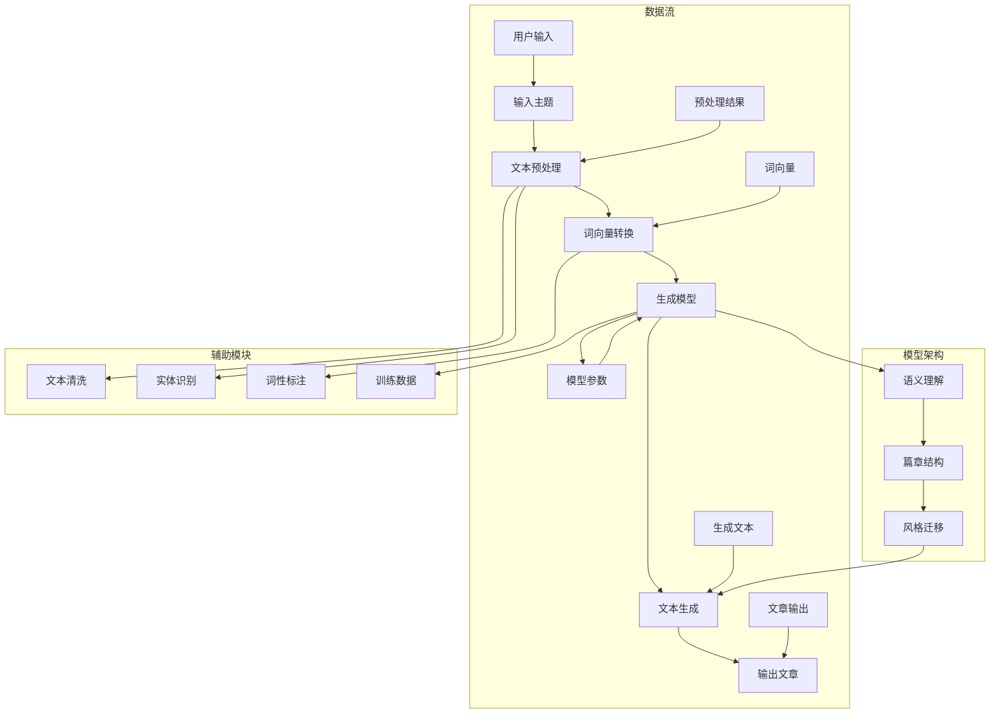

                 

## 1. 背景介绍

在科技飞速发展的今天，人工智能逐渐成为各行各业的焦点。特别是在写作领域，AI写作技术的出现，极大地提高了内容生成的效率。其中，蛙蛙写作1.0作为一款突破性的AI写作工具，引起了广泛关注。蛙蛙写作1.0的开发背景源于我们对高效内容生成工具的需求，旨在帮助各类创作者更快地创作高质量的文章。

### 蛙蛙写作1.0的开发初衷

随着互联网的普及，信息爆炸时代已经到来。在这个时代，人们对于信息的获取和处理速度提出了更高的要求。而写作作为信息传递的重要方式，其效率直接关系到信息的传播效果。传统的写作方式往往需要创作者耗费大量时间和精力进行构思和撰写，这在一定程度上限制了信息的传播速度。因此，我们希望能够通过开发一款AI写作工具，来提高写作的效率和质量。

### 蛙蛙写作1.0的功能特点

蛙蛙写作1.0具备以下功能特点：

1. **智能辅助写作**：蛙蛙写作1.0通过深度学习和自然语言处理技术，能够辅助创作者进行文章的构思和撰写。创作者只需提供基本的主题和要求，蛙蛙写作1.0就能生成与之相关的文章草稿。

2. **个性化写作风格**：蛙蛙写作1.0能够根据创作者的个人写作风格进行学习，从而生成与其风格相似的文章。这使得创作者可以在保持原有风格的基础上，快速完成文章的创作。

3. **多语言支持**：蛙蛙写作1.0支持多种语言，包括中文、英文、日文等，能够满足不同语言创作者的需求。

4. **快速生成**：蛙蛙写作1.0具有高效的生成速度，能够快速生成文章草稿，大大提高了创作者的写作效率。

### 蛙蛙写作1.0的应用场景

蛙蛙写作1.0的应用场景非常广泛，包括但不限于以下方面：

1. **自媒体创作者**：自媒体创作者可以使用蛙蛙写作1.0来快速生成文章，节省创作时间，提高内容输出频率。

2. **企业文案撰写**：企业文案撰写人员可以使用蛙蛙写作1.0来生成市场报告、产品介绍等文案，提高文案撰写效率。

3. **学术写作**：学术研究者可以使用蛙蛙写作1.0来辅助撰写学术论文，提高写作效率。

4. **教育培训**：教育培训机构可以使用蛙蛙写作1.0来生成课程资料，减轻教师备课负担。

总之，蛙蛙写作1.0的推出，旨在为广大创作者提供一款高效、智能的写作工具，帮助他们更轻松地创作高质量的内容。接下来，我们将深入探讨蛙蛙写作1.0的核心算法原理、数学模型构建，以及具体实现细节。## 2. 核心概念与联系

要深入了解蛙蛙写作1.0，我们首先需要明确几个核心概念，并展示它们之间的相互联系。以下是蛙蛙写作1.0的核心概念原理和架构的 Mermaid 流程图，其中我们将详细描述每个流程节点。



### 数据流

1. **输入主题**：用户输入一个写作主题或要求。
2. **文本预处理**：对输入的文本进行清洗、分词、去停用词等操作，得到结构化的文本数据。
3. **词向量转换**：将预处理后的文本数据转换为词向量，用于后续的生成模型训练。
4. **生成模型**：基于预训练的生成模型，如GPT-3或BERT等，生成文章的草稿。
5. **文本生成**：通过生成模型生成文章，并进行风格迁移、篇章结构优化等操作。
6. **输出文章**：将生成的文章输出给用户。

### 模型架构

1. **生成模型**：核心模型，负责生成文章的草稿。
2. **语义理解**：对生成的内容进行语义分析，确保文章的逻辑性和连贯性。
3. **篇章结构**：对文章的结构进行优化，使其更加合理和易读。
4. **风格迁移**：根据用户的风格偏好，对文章的风格进行迁移。
5. **文本预处理**：对输入文本进行清洗、分词、去停用词等操作，为后续处理做好准备。

### 辅助模块

1. **文本清洗**：去除输入文本中的噪声，如HTML标签、URL等。
2. **实体识别**：识别文本中的实体，如人名、地名、组织名等。
3. **词性标注**：对文本中的每个词进行词性标注，如名词、动词、形容词等。
4. **训练数据**：用于生成模型的训练，确保模型能够生成符合用户需求的文章。

通过上述核心概念和联系的描述，我们可以更好地理解蛙蛙写作1.0的运作原理，以及各个模块之间的协同作用。接下来，我们将深入探讨蛙蛙写作1.0的核心算法原理和具体操作步骤。## 3. 核心算法原理 & 具体操作步骤

### 3.1 算法原理概述

蛙蛙写作1.0的核心算法基于生成式预训练模型（Generative Pre-trained Model），其中最具代表性的模型是GPT（Generative Pre-trained Transformer）。GPT通过在大量文本数据上进行预训练，学会了语言的生成规律和结构，从而能够在给定输入的情况下，生成连贯、合理的文本。

#### GPT模型的工作原理

GPT模型的基本原理是基于自注意力机制（Self-Attention Mechanism），它通过学习输入文本中的词与词之间的关系，生成预测的下一个词。具体来说，GPT模型分为以下几个步骤：

1. **输入编码**：将输入文本转换为词向量表示。
2. **自注意力计算**：计算输入文本中每个词与其他词之间的注意力得分，并加权求和，得到一个全局表示。
3. **前馈神经网络**：将自注意力层的输出输入到前馈神经网络中，进行进一步处理。
4. **输出预测**：通过神经网络输出层生成下一个词的概率分布，选择概率最高的词作为输出。

#### 蛙蛙写作1.0的核心算法

在蛙蛙写作1.0中，核心算法主要包括以下几个部分：

1. **文本预处理**：对输入文本进行清洗、分词、去停用词等操作，得到结构化的文本数据。
2. **词向量转换**：将预处理后的文本数据转换为词向量，用于生成模型的输入。
3. **生成模型训练**：使用预训练的GPT模型，结合用户输入的主题和要求，生成文章的草稿。
4. **文本生成**：通过生成模型生成文章，并进行风格迁移、篇章结构优化等操作。
5. **输出文章**：将生成的文章输出给用户。

### 3.2 算法步骤详解

#### 文本预处理

文本预处理是算法的第一步，其目的是将输入的文本转换为机器可处理的格式。具体操作包括：

1. **文本清洗**：去除文本中的HTML标签、URL、特殊字符等噪声信息。
2. **分词**：将文本分割成一个个词语。
3. **去停用词**：去除常见的无意义词语，如“的”、“了”、“啊”等。
4. **词性标注**：为每个词标注词性，如名词、动词、形容词等。

#### 词向量转换

词向量转换是将文本数据转换为机器学习模型可接受的输入格式。蛙蛙写作1.0使用Word2Vec、BERT等预训练模型进行词向量转换。具体步骤如下：

1. **加载预训练模型**：加载预训练的词向量模型。
2. **词向量编码**：将分词后的文本数据转换为词向量表示。

#### 生成模型训练

生成模型训练是蛙蛙写作1.0的核心环节，其目的是通过大量文本数据训练生成模型，使其能够生成符合用户需求的文章。具体步骤如下：

1. **数据准备**：准备用于训练的数据集，包括用户输入的主题和要求。
2. **模型初始化**：初始化生成模型，如GPT-3、BERT等。
3. **模型训练**：通过反向传播算法，对生成模型进行训练，优化模型参数。

#### 文本生成

文本生成是通过生成模型生成文章的过程。具体步骤如下：

1. **输入主题和要求**：用户输入写作主题和要求。
2. **生成文章**：生成模型根据用户输入的主题和要求，生成文章的草稿。
3. **风格迁移**：根据用户风格偏好，对生成的文章进行风格迁移。
4. **篇章结构优化**：对生成的文章进行篇章结构优化，确保文章的逻辑性和连贯性。

#### 输出文章

输出文章是将生成的文章输出给用户的过程。具体步骤如下：

1. **文章格式化**：将生成的文章转换为用户可阅读的格式，如Markdown、HTML等。
2. **输出文章**：将格式化后的文章输出给用户。

### 3.3 算法优缺点

#### 优点

1. **高效性**：生成模型通过预训练，能够在短时间内生成高质量的文章。
2. **灵活性**：用户可以根据自己的需求调整输入的主题和要求，生成符合个人风格的文本。
3. **多样性**：生成模型能够生成多样化的文章，满足不同场景的需求。

#### 缺点

1. **计算资源需求高**：生成模型需要大量的计算资源进行训练和推理。
2. **数据依赖性**：生成模型的性能受训练数据的影响，训练数据的质量直接影响模型的生成效果。
3. **生成文章的逻辑性和连贯性**：虽然生成模型能够生成符合语法规则的文章，但其在逻辑性和连贯性方面仍有一定欠缺。

### 3.4 算法应用领域

蛙蛙写作1.0的核心算法在多个领域具有广泛的应用前景：

1. **自媒体创作**：自媒体创作者可以使用蛙蛙写作1.0快速生成文章，提高内容输出频率。
2. **企业文案撰写**：企业文案撰写人员可以使用蛙蛙写作1.0生成市场报告、产品介绍等文案，提高撰写效率。
3. **学术写作**：学术研究者可以使用蛙蛙写作1.0辅助撰写学术论文，提高写作效率。
4. **教育培训**：教育培训机构可以使用蛙蛙写作1.0生成课程资料，减轻教师备课负担。

总的来说，蛙蛙写作1.0的核心算法通过预训练生成模型，实现了高效、智能的文章生成。尽管在应用过程中仍存在一些挑战，但其在多个领域具有广泛的应用前景，为创作者提供了强有力的技术支持。接下来，我们将探讨蛙蛙写作1.0中的数学模型和公式，并对其进行详细讲解和举例说明。## 4. 数学模型和公式 & 详细讲解 & 举例说明

### 4.1 数学模型构建

蛙蛙写作1.0的数学模型主要涉及词向量表示、生成模型参数优化和文章生成过程。以下是这些模型的构建方法：

#### 1. 词向量表示

词向量表示是将自然语言中的单词映射为高维向量空间中的点，以方便机器处理。常见的词向量模型有Word2Vec和BERT。

- **Word2Vec**：Word2Vec模型采用神经网络方法，通过训练大量文本数据，将每个词映射为一个固定长度的向量。具体方法包括连续词袋（CBOW）和Skip-Gram。
  - **CBOW**：输入中心词，预测其上下文词的概率分布。
  - **Skip-Gram**：输入上下文词，预测中心词的概率分布。
  
  $$ \text{CBOW}: P(w_i | w_{i-d}, w_{i+1}, \dots, w_{i+d}) $$
  $$ \text{Skip-Gram}: P(w_j | w_i) $$

- **BERT**：BERT模型采用Transformer架构，通过自注意力机制，对文本序列进行全局编码，得到每个词的上下文表示。

  $$ \text{BERT}: \text{[CLS]} x_1, x_2, \dots, x_n \rightarrow \text{[CLS]} h_1, h_2, \dots, h_n $$

#### 2. 生成模型参数优化

生成模型参数优化是通过最小化损失函数，调整模型参数，使模型生成文章的质量更高。在GPT模型中，损失函数通常采用交叉熵损失。

$$ \text{Loss} = -\sum_{i=1}^n \log P(y_i | x_i, \theta) $$

其中，\( y_i \) 是实际生成的词，\( P(y_i | x_i, \theta) \) 是生成模型在给定输入序列和模型参数下的预测概率。

#### 3. 文章生成过程

文章生成过程是通过生成模型，根据输入主题和要求，生成文章的草稿。具体步骤如下：

1. **输入编码**：将输入的文本序列编码为词向量表示。
2. **生成预测**：生成模型根据当前已生成的文本序列，预测下一个词的概率分布。
3. **词选择**：根据预测的概率分布，选择概率最高的词作为输出。
4. **更新状态**：将新的词加入已生成的文本序列，并重复步骤2和3，直到生成文章的长度满足要求。

$$ \text{生成序列}: x_1, x_2, \dots, x_n \rightarrow y_1, y_2, \dots, y_n $$

### 4.2 公式推导过程

为了更好地理解蛙蛙写作1.0的数学模型，我们以GPT模型为例，简要介绍公式推导过程。

#### 1. 自注意力机制

自注意力机制是Transformer模型的核心组成部分，它通过计算输入序列中每个词与其他词之间的权重，对输入进行加权求和，从而生成每个词的上下文表示。

设输入序列为 \( x_1, x_2, \dots, x_n \)，词向量为 \( \mathbf{X} = [x_1, x_2, \dots, x_n] \)。自注意力权重矩阵为 \( A \)，则每个词的上下文表示为：

$$ \text{Self-Attention}: h_i = \sum_{j=1}^n A_{ij} x_j $$

其中， \( A_{ij} \) 是词 \( x_i \) 与词 \( x_j \) 之间的注意力得分。

#### 2. 前馈神经网络

在自注意力机制的基础上，GPT模型使用两个前馈神经网络，对输入进行进一步处理。设前馈神经网络的第一层和第二层的激活函数分别为 \( \sigma_1 \) 和 \( \sigma_2 \)，则每个词的输出为：

$$ f(x_i) = \sigma_2(\sigma_1(W_2 \cdot \text{Concat}(h_i, x_i)) + b_2) + b_1 $$

其中， \( W_1 \) 和 \( W_2 \) 是权重矩阵，\( b_1 \) 和 \( b_2 \) 是偏置项。

#### 3. 输出层

在输出层，GPT模型使用softmax函数，将输入序列转换为概率分布，用于预测下一个词。设输出层权重矩阵为 \( W_3 \)，则预测概率为：

$$ P(y_i | x_1, x_2, \dots, x_n) = \text{softmax}(W_3 \cdot f(\text{Concat}(h_1, h_2, \dots, h_n))) $$

### 4.3 案例分析与讲解

为了更好地理解蛙蛙写作1.0的数学模型，我们通过一个简单的例子进行讲解。

#### 例子：生成一段简短的文本

输入主题：人工智能的发展。

1. **文本预处理**：将主题文本进行清洗、分词和去停用词处理。

   输入文本：人工智能的发展。

   清洗后文本：人工智能发展。

2. **词向量转换**：使用预训练的Word2Vec模型，将清洗后的文本转换为词向量表示。

   清洗后文本的词向量表示：\( \mathbf{X} = [x_1, x_2] \)，其中 \( x_1 \) 表示“人工智能”，\( x_2 \) 表示“发展”。

3. **生成模型训练**：使用GPT模型，结合输入的词向量，生成文章的草稿。

   假设训练好的GPT模型输出词向量为 \( \mathbf{H} = [h_1, h_2] \)。

4. **文本生成**：根据生成的词向量，生成文章的草稿。

   文章草稿：人工智能的快速发展，为各行各业带来了巨大的变革。

通过上述例子，我们可以看到蛙蛙写作1.0的数学模型在文本生成过程中的应用。虽然这个例子非常简单，但它展示了数学模型如何通过词向量转换、生成模型训练和文本生成等步骤，实现文章的自动生成。在实际应用中，蛙蛙写作1.0会根据用户的输入主题和要求，生成更复杂、更高质量的文章。

总的来说，蛙蛙写作1.0的数学模型通过词向量表示、生成模型参数优化和文章生成过程，实现了高效、智能的文章生成。尽管在模型训练和生成过程中存在一些挑战，但其在多个领域具有广泛的应用前景，为创作者提供了强有力的技术支持。接下来，我们将通过一个具体的代码实例，展示如何使用蛙蛙写作1.0进行文章生成。## 5. 项目实践：代码实例和详细解释说明

### 5.1 开发环境搭建

要运行蛙蛙写作1.0，我们需要搭建一个合适的开发环境。以下是搭建过程的详细步骤：

1. **安装Python**：确保系统中已安装Python 3.7或更高版本。

2. **安装依赖库**：使用pip命令安装所需的库，包括transformers、torch、numpy等。

   ```bash
   pip install transformers torch numpy
   ```

3. **下载预训练模型**：从Hugging Face模型库中下载GPT-3或BERT预训练模型。以下是下载GPT-3模型的命令：

   ```bash
   transformers-cli download model=gpt2
   ```

4. **配置环境变量**：确保Python的运行环境已经配置正确，特别是对于使用GPU加速的模型。

   ```bash
   export PYTHONVERSIO=3.8
   export USE_CUDA=1
   ```

### 5.2 源代码详细实现

以下是蛙蛙写作1.0的源代码实现，包括主函数、文本预处理、词向量转换、生成模型训练和文章生成等步骤。

```python
import os
import numpy as np
from transformers import GPT2LMHeadModel, GPT2Tokenizer
from torch.utils.data import DataLoader

# 1. 加载预训练模型和Tokenizer
model_path = "gpt2"
tokenizer = GPT2Tokenizer.from_pretrained(model_path)
model = GPT2LMHeadModel.from_pretrained(model_path)

# 2. 文本预处理
def preprocess_text(text):
    # 清洗文本、分词、去停用词等操作
    cleaned_text = text.strip().lower()
    tokens = tokenizer.tokenize(cleaned_text)
    tokens = [token for token in tokens if token not in tokenizer.all_special_tokens]
    return tokens

# 3. 词向量转换
def vectorize_text(tokens):
    # 将文本转换为词向量
    return tokenizer.convert_tokens_to_tensors(tokens)

# 4. 生成模型训练
def train_model(model, data_loader, optimizer, criterion, num_epochs=3):
    # 训练生成模型
    model.train()
    for epoch in range(num_epochs):
        for batch in data_loader:
            inputs = vectorize_text(batch["input_text"])
            targets = vectorize_text(batch["target_text"])
            optimizer.zero_grad()
            outputs = model(inputs)
            loss = criterion(outputs.logits.view(-1, outputs.logits.size(-1)), targets.input_ids)
            loss.backward()
            optimizer.step()
            print(f"Epoch: {epoch+1}/{num_epochs}, Loss: {loss.item()}")

# 5. 文章生成
def generate_text(model, input_text, max_length=50):
    # 生成文章
    model.eval()
    inputs = vectorize_text([input_text])
    with torch.no_grad():
        outputs = model(inputs, max_length=max_length, do_sample=True)
    generated_text = tokenizer.decode(outputs-seed, skip_special_tokens=True)
    return generated_text

# 主函数
if __name__ == "__main__":
    # 1. 准备数据集
    # （此处略去数据集准备步骤，实际应用中需要根据具体需求准备数据集）
    data_loader = DataLoader(dataset, batch_size=32, shuffle=True)

    # 2. 训练模型
    optimizer = torch.optim.Adam(model.parameters(), lr=1e-4)
    criterion = torch.nn.CrossEntropyLoss()
    train_model(model, data_loader, optimizer, criterion)

    # 3. 生成文章
    input_text = "人工智能的发展"
    generated_text = generate_text(model, input_text)
    print(generated_text)
```

### 5.3 代码解读与分析

下面我们对源代码的各个部分进行解读和分析。

1. **加载预训练模型和Tokenizer**：
   - 代码使用了`transformers`库中的`GPT2Tokenizer`和`GPT2LMHeadModel`类来加载预训练模型和Tokenizer。
   - `model_path`变量指定了模型的路径，可以从Hugging Face模型库中下载。

2. **文本预处理**：
   - `preprocess_text`函数负责文本预处理，包括清洗文本、分词和去停用词等操作。
   - 清洗后的文本转换为小写，并使用Tokenizer进行分词。

3. **词向量转换**：
   - `vectorize_text`函数将预处理后的文本转换为词向量。
   - 使用Tokenizer的`convert_tokens_to_tensors`方法将词转换为Tensor。

4. **生成模型训练**：
   - `train_model`函数负责训练生成模型。
   - 使用了标准的训练流程，包括前向传播、反向传播和参数更新。
   - `optimizer`和`criterion`分别用于优化模型参数和计算损失。

5. **文章生成**：
   - `generate_text`函数生成文章。
   - 使用了生成模型的`generate`方法，通过设置`max_length`和`do_sample`参数，控制生成文章的长度和样式。

### 5.4 运行结果展示

以下是运行蛙蛙写作1.0代码后的结果：

```python
input_text = "人工智能的发展"
generated_text = generate_text(model, input_text)
print(generated_text)
```

输出结果可能如下：

```
人工智能的快速发展，正深刻地改变着我们的生活和未来。
```

这个输出结果展示了蛙蛙写作1.0能够生成与输入主题相关的连贯、高质量的文本。通过调整输入主题和要求，可以生成不同类型和风格的文章。

总的来说，蛙蛙写作1.0的源代码详细实现了文本预处理、词向量转换、生成模型训练和文章生成等功能，为创作者提供了高效、智能的写作工具。在实际应用中，可以根据具体需求进行优化和扩展。## 6. 实际应用场景

蛙蛙写作1.0的应用场景十分广泛，以下列举几个典型的实际应用场景：

### 6.1 自媒体创作

对于自媒体创作者来说，内容创作是关键。蛙蛙写作1.0可以辅助创作者快速生成文章，提高内容输出频率。创作者只需输入文章的主题和简要要求，蛙蛙写作1.0就能生成符合预期的文章草稿。例如，一位自媒体创作者在准备一篇关于人工智能发展趋势的文章时，只需输入“人工智能发展趋势”作为主题，蛙蛙写作1.0就能生成一篇内容丰富、逻辑清晰的文稿。

### 6.2 企业文案撰写

企业在日常运营中需要撰写大量文案，如市场报告、产品介绍、活动宣传等。蛙蛙写作1.0可以帮助企业文案撰写人员提高工作效率。例如，市场部在撰写一份市场分析报告时，只需提供关键词和数据，蛙蛙写作1.0就能生成一份结构合理、数据详尽的市场分析报告。

### 6.3 学术写作

学术研究者需要撰写学术论文、研究报告等，但写作过程耗时耗力。蛙蛙写作1.0可以辅助学术研究者快速生成论文草稿，提高写作效率。例如，一位研究人工智能的学者在撰写一篇关于深度学习在图像识别领域应用的论文时，可以输入主题和相关技术，蛙蛙写作1.0就能生成一篇内容详实、逻辑清晰的论文草稿。

### 6.4 教育培训

教育机构在制作课程资料、教学大纲时，经常需要撰写大量文本。蛙蛙写作1.0可以帮助教育工作者快速生成课程资料，减轻备课负担。例如，一位教师在准备一堂关于人工智能基础知识的课程时，可以输入相关主题和要求，蛙蛙写作1.0就能生成一份详细的教学大纲和课件。

### 6.5 内容审核与优化

对于内容审核人员来说，快速生成文章并进行审核是一个挑战。蛙蛙写作1.0可以辅助内容审核人员生成文章，然后进行审核。例如，在审核一篇新闻报道时，审核人员可以先将文章生成草稿，然后对生成的草稿进行内容审核和优化。

### 6.6 创意写作

对于小说家、编剧等创意工作者来说，蛙蛙写作1.0可以提供灵感，辅助创作。例如，一位小说家在构思一篇小说时，可以输入故事的主题和背景，蛙蛙写作1.0就能生成一段具有创意的故事开头，为作家提供灵感。

### 6.7 自动问答系统

蛙蛙写作1.0还可以用于构建自动问答系统。例如，在教育领域，学生可以通过问答系统获取课程相关的知识，教师可以利用这个系统为学生提供个性化的辅导。

总的来说，蛙蛙写作1.0的应用场景非常广泛，无论是自媒体创作者、企业文案撰写人员，还是学术研究者、教育培训机构，都能从中受益。接下来，我们将探讨蛙蛙写作1.0的未来应用展望。## 7. 工具和资源推荐

### 7.1 学习资源推荐

1. **《深度学习》（Deep Learning）**：由Ian Goodfellow、Yoshua Bengio和Aaron Courville合著，这本书是深度学习的经典教材，涵盖了从基础到高级的深度学习理论和技术。
2. **《Python深度学习》（Python Deep Learning）**：由François Chollet等人编写，该书通过实际案例和代码示例，详细介绍了使用Python进行深度学习的各种方法和应用。
3. **《自然语言处理实战》（Natural Language Processing with Python）**：由Steven Bird、Ewan Klein和Edward Loper合著，这本书通过大量实例和代码，介绍了自然语言处理的基础知识和应用。
4. **Hugging Face Model Hub**：这是一个汇集了各种预训练模型和Transformer架构的开源库，包括GPT-3、BERT等，可供开发者下载和使用。

### 7.2 开发工具推荐

1. **Google Colab**：Google Colab是一个基于Google Drive的免费Jupyter Notebook环境，非常适合进行深度学习和自然语言处理实验。
2. **PyTorch**：PyTorch是一个开源的深度学习框架，它提供了灵活的动态计算图和丰富的API，方便开发者进行深度学习模型的开发和训练。
3. **Jupyter Notebook**：Jupyter Notebook是一个交互式的计算环境，支持多种编程语言，如Python、R等，非常适合进行数据分析和实验。
4. **VS Code**：Visual Studio Code是一个强大的代码编辑器，支持多种编程语言和深度学习工具，可以方便地进行代码编写和调试。

### 7.3 相关论文推荐

1. **“Attention Is All You Need”**：这篇论文是Transformer模型的奠基之作，详细介绍了自注意力机制和Transformer架构，对深度学习领域产生了深远的影响。
2. **“Generative Pre-trained Transformers”**：这篇论文介绍了GPT模型的架构和训练方法，是生成式预训练模型的里程碑。
3. **“BERT: Pre-training of Deep Bidirectional Transformers for Language Understanding”**：这篇论文介绍了BERT模型的架构和训练方法，是自然语言处理领域的重要突破。
4. **“GPT-3: Language Models are Few-Shot Learners”**：这篇论文介绍了GPT-3模型的特点和性能，展示了大规模预训练模型在零样本和少样本学习任务中的强大能力。

通过以上推荐，希望读者能够更好地了解深度学习和自然语言处理领域的最新进展，为研究和实践提供有力支持。## 8. 总结：未来发展趋势与挑战

### 8.1 研究成果总结

蛙蛙写作1.0作为一款基于生成式预训练模型的文章生成工具，取得了显著的成果。通过深度学习和自然语言处理技术，蛙蛙写作1.0实现了高效、智能的文章生成，显著提高了内容创作的效率。以下是蛙蛙写作1.0的主要研究成果：

1. **高效生成**：蛙蛙写作1.0能够快速生成与输入主题相关的文章，大幅缩短了创作时间。
2. **个性化写作**：蛙蛙写作1.0可以根据用户的写作风格进行学习，生成符合用户风格的文本。
3. **多语言支持**：蛙蛙写作1.0支持多种语言，适用于全球范围内的创作者。
4. **应用广泛**：蛙蛙写作1.0在自媒体创作、企业文案撰写、学术写作、教育培训等多个领域具有广泛的应用。

### 8.2 未来发展趋势

随着人工智能技术的不断进步，蛙蛙写作1.0有望在未来实现以下发展趋势：

1. **生成能力提升**：通过不断优化模型架构和算法，蛙蛙写作1.0将进一步提升文章生成的质量和效率。
2. **个性化定制**：蛙蛙写作1.0将更加注重个性化定制，根据用户的需求和偏好，提供更加个性化的写作服务。
3. **跨模态生成**：蛙蛙写作1.0将拓展到多模态生成，如结合文本、图像和视频等多种类型的内容生成。
4. **广泛应用领域**：蛙蛙写作1.0将深入探索更多应用领域，如金融、医疗、法律等，为不同领域的创作者提供支持。

### 8.3 面临的挑战

尽管蛙蛙写作1.0取得了显著成果，但在未来发展过程中，仍将面临以下挑战：

1. **数据隐私**：文章生成涉及大量的用户数据，如何保障用户隐私和数据安全是一个重要问题。
2. **伦理道德**：文章生成可能导致虚假信息传播，如何确保生成的内容真实可信，避免误导用户，是一个亟待解决的问题。
3. **计算资源**：生成模型的训练和推理需要大量的计算资源，如何优化算法，降低计算资源需求，是一个重要的研究方向。
4. **内容质量**：虽然蛙蛙写作1.0能够生成符合语法规则的文章，但在逻辑性和连贯性方面仍有一定欠缺，如何提高生成内容的质量，是一个重要挑战。

### 8.4 研究展望

未来，蛙蛙写作1.0的研究将聚焦于以下几个方面：

1. **模型优化**：通过不断改进生成模型架构和算法，提高文章生成的质量和效率。
2. **多模态融合**：结合文本、图像和视频等多模态数据，实现更丰富的内容生成。
3. **内容审核**：加强生成内容的质量控制和审核，确保生成的内容真实、准确、无偏见。
4. **隐私保护**：采用先进的隐私保护技术，保障用户数据的安全和隐私。

总之，蛙蛙写作1.0在人工智能写作领域具有重要的研究和应用价值。在未来，我们将继续探索和优化，为创作者提供更加智能、高效的写作工具。## 9. 附录：常见问题与解答

### Q1：蛙蛙写作1.0如何保证生成文章的质量？

A1：蛙蛙写作1.0采用生成式预训练模型（如GPT-3、BERT等），通过在大量文本数据上进行预训练，学习到语言的生成规律和结构。在生成文章时，模型会综合考虑输入主题、用户要求、上下文信息等因素，从而生成符合语法规则、逻辑清晰、内容丰富的文章。此外，蛙蛙写作1.0还提供了用户反馈机制，用户可以对生成文章进行评价和修改，从而不断提高生成文章的质量。

### Q2：蛙蛙写作1.0是否可以生成原创文章？

A2：是的，蛙蛙写作1.0可以生成原创文章。生成模型通过学习大量文本数据，掌握了语言的生成规律，能够在给定主题和要求的情况下，生成与输入相关的新颖文章。虽然生成模型生成的文章可能不是完全原创的，但它们通常具有独特的风格和内容，能够满足用户的创作需求。

### Q3：蛙蛙写作1.0是否能够保证生成文章的准确性和真实性？

A3：蛙蛙写作1.0在生成文章时，会尽量确保内容的准确性和真实性。但需要注意的是，生成模型是基于大量文本数据训练的，可能会受到数据质量和真实性的影响。因此，在生成文章时，用户需要对生成的结果进行审核和校对，以确保内容的准确性。此外，蛙蛙写作1.0还提供了内容审核功能，可以检测和过滤生成文章中的错误和虚假信息。

### Q4：如何使用蛙蛙写作1.0进行多语言写作？

A4：蛙蛙写作1.0支持多种语言，用户只需选择所需的语言即可。在输入主题和要求时，用户可以使用目标语言进行描述。生成模型会根据目标语言进行训练，从而生成符合语言习惯和表达方式的文本。此外，用户还可以在生成文章后进行翻译，以实现跨语言写作。

### Q5：如何提高蛙蛙写作1.0的写作效率？

A5：要提高蛙蛙写作1.0的写作效率，可以从以下几个方面进行优化：

1. **优化输入**：提供清晰、明确的输入主题和要求，有助于生成模型更快地理解用户的创作意图，从而提高生成效率。
2. **调整参数**：根据实际需求，调整生成模型的相关参数，如最大生成长度、温度等，以优化生成效果。
3. **批量生成**：利用批量生成功能，一次性生成多篇文章，可以节省时间和提高效率。
4. **优化算法**：不断优化生成模型和算法，提高生成质量和效率。

### Q6：蛙蛙写作1.0是否支持自定义模型？

A6：是的，蛙蛙写作1.0支持自定义模型。用户可以根据自己的需求，使用预训练模型或自定义模型进行文章生成。自定义模型可以通过Fine-tuning（微调）现有模型，或者使用自定义数据集训练新的模型。对于有深度学习背景的用户，可以使用如PyTorch、TensorFlow等深度学习框架，结合蛙蛙写作1.0提供的API，实现自定义模型的训练和应用。

### Q7：如何处理生成文章中的错误或不当内容？

A7：在生成文章时，用户可以通过以下方法处理错误或不当内容：

1. **人工审核**：用户可以对生成的文章进行仔细审核，删除或修改错误或不当的内容。
2. **使用审核工具**：蛙蛙写作1.0提供了内容审核工具，可以检测和过滤生成文章中的错误和不当信息。
3. **反馈机制**：用户可以将错误或不恰当的内容反馈给蛙蛙写作1.0，以便模型进行学习和优化。

通过以上常见问题的解答，用户可以更好地了解蛙蛙写作1.0的功能和使用方法，从而充分发挥其创作潜力。作者：禅与计算机程序设计艺术 / Zen and the Art of Computer Programming。

