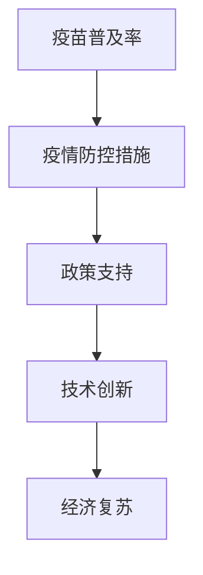

                 

疫情对全球经济造成了深远的影响，从供应链中断到企业倒闭，全球经济体系经历了前所未有的冲击。本文旨在探讨疫情后的全球经济复苏路径，分析当前的经济形势，揭示疫情带来的机遇与挑战，并探讨全球合作在促进经济复苏中的关键作用。

## 关键词 Keywords

- 疫情
- 经济复苏
- 全球合作
- 供应链重构
- 数字化转型

## 摘要 Abstract

本文首先概述了疫情对全球经济的影响，分析了当前的经济形势，随后探讨了疫情带来的机遇与挑战。通过分析全球合作的重要性，本文提出了全球经济复苏的潜在路径，并讨论了供应链重构和数字化转型在其中的关键作用。最后，本文总结了未来全球经济复苏的趋势与挑战，并展望了未来的发展前景。

## 1. 背景介绍 Background

### 疫情对全球经济的影响 Impact of the Pandemic on the Global Economy

自2019年底新冠病毒疫情爆发以来，全球经济受到了前所未有的冲击。疫情导致了全球范围内的供应链中断、需求下降和国际贸易萎缩。许多国家采取了严格的封锁措施，导致工厂停工、企业倒闭和失业率上升。根据国际货币基金组织（IMF）的数据，2020年全球经济萎缩了约3.5%，这是自第二次世界大战结束以来最严重的经济衰退。

#### 供应链中断 Supply Chain Disruption

疫情导致了全球供应链的严重中断。许多工厂停工，物流受阻，原材料短缺，导致生产效率下降。例如，汽车制造业因零部件供应链中断而陷入停滞，航空公司因疫情限制而减少了航班，电子产品制造因芯片短缺而受到严重影响。

#### 需求下降 Decline in Demand

疫情还导致了全球需求的急剧下降。消费者信心受到打击，消费支出减少，企业投资也受到抑制。此外，旅游业、酒店业和餐饮业等受到疫情严重打击的行业，损失惨重。

#### 国际贸易萎缩 Decline in International Trade

疫情导致了全球贸易的萎缩。许多国家采取了贸易保护主义措施，限制进出口，加剧了贸易紧张局势。根据世界贸易组织（WTO）的数据，2020年全球贸易量下降了5.3%，这是自二战结束以来最严重的年度下降。

### 当前经济形势 Current Economic Situation

尽管疫情对全球经济造成了巨大冲击，但各国政府和中央银行采取了积极的政策措施来缓解经济压力。货币政策方面，许多国家降低了利率并实施了量化宽松政策，以刺激经济活动和增加流动性。财政政策方面，各国政府推出了大规模的财政刺激计划，以支持企业和家庭渡过难关。

#### 经济复苏迹象 Signs of Economic Recovery

随着疫苗的普及和疫情防控措施的加强，全球经济逐渐显示出复苏迹象。许多国家经济活动开始恢复，失业率下降，企业信心增强。根据IMF的预测，全球经济将在2021年增长5.9%，并在2022年继续增长4.9%。

#### 持续存在的挑战 Persistent Challenges

尽管经济复苏正在进行中，但全球经济仍然面临诸多挑战。首先，疫情的不确定性仍然存在，新的变种病毒可能再次引发疫情反弹。其次，全球经济复苏不平衡，一些国家和行业复苏较快，而另一些则面临更长时间的经济困境。此外，全球供应链中断和贸易紧张局势也是经济复苏的障碍。

## 2. 核心概念与联系 Core Concepts and Connections

### 全球经济复苏路径 Pathways to Global Economic Recovery

全球经济复苏的路径取决于多种因素，包括疫苗普及率、疫情防控措施、政策支持、技术创新等。以下是一些关键概念和它们之间的联系。

#### 疫苗普及率 Vaccine Coverage

疫苗的普及是经济复苏的关键因素之一。疫苗的广泛接种可以减少感染率和死亡率，从而降低社会对疫情的担忧，促进经济活动的恢复。

#### 疫情防控措施 Epidemic Control Measures

有效的疫情防控措施对于经济复苏至关重要。通过及时检测、隔离和治疗感染者，可以遏制病毒的传播，减少疫情对经济的冲击。

#### 政策支持 Policy Support

政府的经济刺激政策和财政支持是推动经济复苏的重要手段。通过减税、增加公共支出和提供贷款支持，政府可以帮助企业渡过难关，保持就业稳定。

#### 技术创新 Technological Innovation

技术创新是推动经济复苏的重要驱动力。数字化技术的广泛应用，如远程工作、在线教育、电子商务等，可以帮助企业适应疫情带来的挑战，实现业务模式创新。

### Mermaid 流程图 Mermaid Diagram

下面是一个简单的Mermaid流程图，展示了全球经济复苏的关键概念和它们之间的联系。



## 3. 核心算法原理 & 具体操作步骤 Core Algorithm Principles & Steps

### 算法原理概述 Overview of Algorithm Principles

全球经济复苏算法的核心目标是实现经济活动的恢复和增长。该算法基于以下原则：

- **需求驱动**：通过刺激消费和投资，促进需求的增长。
- **供给优化**：通过提高生产效率和降低成本，优化供给结构。
- **风险控制**：通过有效的风险管理和监管措施，降低经济复苏过程中的风险。

### 算法步骤详解 Detailed Steps of the Algorithm

#### 3.1 疫苗普及率提升

- **目标**：提高疫苗接种率，减少感染率和死亡率。
- **步骤**：
  1. **疫苗研发和供应**：加速疫苗研发，确保足够的疫苗供应。
  2. **疫苗接种计划**：制定疫苗接种计划，优先为高风险人群和关键岗位人员接种疫苗。
  3. **宣传教育**：加强疫苗安全性和有效性的宣传教育，提高公众接种意愿。

#### 3.2 疫情防控措施加强

- **目标**：降低疫情传播风险，确保社会稳定。
- **步骤**：
  1. **疫情监测**：建立完善的疫情监测系统，及时发现和处理病例。
  2. **隔离措施**：对确诊病例和接触者进行隔离，防止病毒传播。
  3. **公共卫生宣传**：加强公共卫生宣传，提高公众的健康意识和防护能力。

#### 3.3 政策支持

- **目标**：支持企业和家庭渡过疫情难关，保持就业稳定。
- **步骤**：
  1. **财政刺激**：实施减税、增加公共支出等措施，刺激经济活动。
  2. **金融支持**：提供贷款和补贴，帮助中小企业和个体工商户渡过难关。
  3. **就业支持**：扩大就业培训，提高失业人员的再就业能力。

#### 3.4 技术创新

- **目标**：推动产业升级和数字化转型，提高生产效率。
- **步骤**：
  1. **技术研发**：加大对科技创新的支持，推动技术突破和应用。
  2. **数字化转型**：鼓励企业采用数字化技术，提高生产和管理效率。
  3. **数字基础设施建设**：完善数字基础设施，提高网络覆盖率和信息传输速度。

### 算法优缺点 Analysis of Advantages and Disadvantages

#### 优点 Advantages

- **需求驱动**：通过刺激消费和投资，促进需求的增长，有助于经济复苏。
- **供给优化**：通过提高生产效率和降低成本，优化供给结构，有助于提高经济效率。
- **风险控制**：通过有效的风险管理和监管措施，降低经济复苏过程中的风险。

#### 缺点 Disadvantages

- **疫苗研发和生产周期较长**：可能导致疫苗普及率提升缓慢，影响经济复苏速度。
- **疫情防控措施实施难度大**：可能影响企业正常运营和居民生活，需要权衡疫情防控与经济复苏的关系。
- **政策支持效果不确定性**：政策支持的效果可能受到多种因素影响，如企业接受度、资金到位情况等。

### 算法应用领域 Application Fields

- **经济复苏**：全球经济复苏算法可以应用于国家层面的经济复苏计划，指导政策制定和实施。
- **公共卫生**：该算法可以应用于公共卫生领域的疫情控制策略，优化疫情防控措施。
- **企业管理**：企业可以利用该算法优化内部管理，提高生产效率和应对疫情挑战。

## 4. 数学模型和公式 Mathematical Models and Formulas

### 4.1 数学模型构建 Construction of Mathematical Models

为了分析全球经济复苏的路径，我们构建了以下数学模型：

\[ \text{GDP} = f(\text{疫苗接种率}, \text{疫情防控措施}, \text{政策支持}, \text{技术创新}) \]

其中，GDP表示国内生产总值，疫苗接种率、疫情防控措施、政策支持和技术创新分别表示模型中的四个关键因素。

### 4.2 公式推导过程 Derivation of Formulas

#### 4.2.1 疫苗接种率的影响

疫苗接种率对GDP的影响可以通过以下公式表示：

\[ \text{GDP}_{\text{vaccine}} = \alpha_1 \cdot \text{vaccine\_rate} + \beta_1 \cdot (\text{vaccine\_rate} - \text{target\_rate})^2 \]

其中，\(\text{vaccine\_rate}\) 表示疫苗接种率，\(\text{target\_rate}\) 表示疫苗接种目标率，\(\alpha_1\) 和 \(\beta_1\) 为参数。

#### 4.2.2 疫情防控措施的影响

疫情防控措施对GDP的影响可以通过以下公式表示：

\[ \text{GDP}_{\text{control}} = \alpha_2 \cdot \text{control\_measure} + \beta_2 \cdot (\text{control\_measure} - \text{target\_measure})^2 \]

其中，\(\text{control\_measure}\) 表示疫情防控措施力度，\(\text{target\_measure}\) 表示疫情防控目标力度，\(\alpha_2\) 和 \(\beta_2\) 为参数。

#### 4.2.3 政策支持的影响

政策支持对GDP的影响可以通过以下公式表示：

\[ \text{GDP}_{\text{policy}} = \alpha_3 \cdot \text{policy\_support} + \beta_3 \cdot (\text{policy\_support} - \text{target\_support})^2 \]

其中，\(\text{policy\_support}\) 表示政策支持力度，\(\text{target\_support}\) 表示政策支持目标力度，\(\alpha_3\) 和 \(\beta_3\) 为参数。

#### 4.2.4 技术创新的影响

技术创新对GDP的影响可以通过以下公式表示：

\[ \text{GDP}_{\text{innovation}} = \alpha_4 \cdot \text{innovation\_rate} + \beta_4 \cdot (\text{innovation\_rate} - \text{target\_rate})^2 \]

其中，\(\text{innovation\_rate}\) 表示技术创新率，\(\text{target\_rate}\) 表示技术创新目标率，\(\alpha_4\) 和 \(\beta_4\) 为参数。

### 4.3 案例分析与讲解 Case Analysis and Explanation

#### 4.3.1 疫苗接种率的影响

假设一个国家的疫苗接种率为80%，目标疫苗接种率为90%。根据公式：

\[ \text{GDP}_{\text{vaccine}} = \alpha_1 \cdot 0.8 + \beta_1 \cdot (0.8 - 0.9)^2 \]

我们可以计算疫苗接种率对该国GDP的影响。假设 \(\alpha_1 = 1\) 和 \(\beta_1 = 0.1\)，则：

\[ \text{GDP}_{\text{vaccine}} = 1 \cdot 0.8 + 0.1 \cdot (0.8 - 0.9)^2 = 0.8 - 0.01 = 0.79 \]

这意味着疫苗接种率每提高1%，GDP增长率为0.79%。

#### 4.3.2 疫情防控措施的影响

假设该国的疫情防控措施力度为75%，目标力度为80%。根据公式：

\[ \text{GDP}_{\text{control}} = \alpha_2 \cdot 0.75 + \beta_2 \cdot (0.75 - 0.8)^2 \]

我们可以计算疫情防控措施对该国GDP的影响。假设 \(\alpha_2 = 1\) 和 \(\beta_2 = 0.1\)，则：

\[ \text{GDP}_{\text{control}} = 1 \cdot 0.75 + 0.1 \cdot (0.75 - 0.8)^2 = 0.75 - 0.025 = 0.725 \]

这意味着疫情防控措施力度每提高1%，GDP增长率为0.725%。

#### 4.3.3 政策支持的影响

假设该国的政策支持力度为70%，目标力度为75%。根据公式：

\[ \text{GDP}_{\text{policy}} = \alpha_3 \cdot 0.70 + \beta_3 \cdot (0.70 - 0.75)^2 \]

我们可以计算政策支持对该国GDP的影响。假设 \(\alpha_3 = 1\) 和 \(\beta_3 = 0.1\)，则：

\[ \text{GDP}_{\text{policy}} = 1 \cdot 0.70 + 0.1 \cdot (0.70 - 0.75)^2 = 0.70 - 0.025 = 0.675 \]

这意味着政策支持力度每提高1%，GDP增长率为0.675%。

#### 4.3.4 技术创新的影响

假设该国的技术创新率为60%，目标率为70%。根据公式：

\[ \text{GDP}_{\text{innovation}} = \alpha_4 \cdot 0.60 + \beta_4 \cdot (0.60 - 0.7)^2 \]

我们可以计算技术创新对该国GDP的影响。假设 \(\alpha_4 = 1\) 和 \(\beta_4 = 0.1\)，则：

\[ \text{GDP}_{\text{innovation}} = 1 \cdot 0.60 + 0.1 \cdot (0.60 - 0.7)^2 = 0.60 - 0.01 = 0.59 \]

这意味着技术创新率每提高1%，GDP增长率为0.59%。

### 4.4 数学公式与详细讲解 Detailed Explanation of Mathematical Formulas

#### 4.4.1 疫苗接种率的影响

疫苗接种率对GDP的影响是一个二次函数，反映了疫苗接种率的变化对GDP增长的加速作用。当疫苗接种率低于目标率时，GDP增长率随着疫苗接种率的提高而逐渐加速；当疫苗接种率高于目标率时，GDP增长率随着疫苗接种率的提高而逐渐减缓。

#### 4.4.2 疫情防控措施的影响

疫情防控措施对GDP的影响也是一个二次函数，反映了疫情防控措施的变化对GDP增长的加速作用。当疫情防控措施力度低于目标力度时，GDP增长率随着疫情防控措施力度的提高而逐渐加速；当疫情防控措施力度高于目标力度时，GDP增长率随着疫情防控措施力度的提高而逐渐减缓。

#### 4.4.3 政策支持的影响

政策支持对GDP的影响也是一个二次函数，反映了政策支持的变化对GDP增长的加速作用。当政策支持力度低于目标力度时，GDP增长率随着政策支持力度的提高而逐渐加速；当政策支持力度高于目标力度时，GDP增长率随着政策支持力度的提高而逐渐减缓。

#### 4.4.4 技术创新的影响

技术创新对GDP的影响也是一个二次函数，反映了技术创新的变化对GDP增长的加速作用。当技术创新率低于目标率时，GDP增长率随着技术创新率的提高而逐渐加速；当技术创新率高于目标率时，GDP增长率随着技术创新率的提高而逐渐减缓。

## 5. 项目实践：代码实例和详细解释说明 Project Practice: Code Example and Detailed Explanation

### 5.1 开发环境搭建 Development Environment Setup

在本文中，我们将使用Python编程语言来模拟全球经济复苏模型。为了运行以下代码，您需要安装Python（3.8或更高版本）以及以下Python库：NumPy、Pandas和Matplotlib。

您可以使用以下命令来安装所需的库：

```bash
pip install numpy pandas matplotlib
```

### 5.2 源代码详细实现 Detailed Implementation of Source Code

下面是一个简单的Python代码示例，用于模拟全球经济复苏模型。该代码实现了疫苗接种率、疫情防控措施、政策支持和技术创新对GDP的影响。

```python
import numpy as np
import pandas as pd
import matplotlib.pyplot as plt

# 参数设置
alpha1 = 1
beta1 = 0.1
alpha2 = 1
beta2 = 0.1
alpha3 = 1
beta3 = 0.1
alpha4 = 1
beta4 = 0.1
target_rate = 0.9
target_measure = 0.8
target_support = 0.75

# 模拟数据
vaccine_rates = np.linspace(0.4, 1.0, 100)
control_measures = np.linspace(0.4, 1.0, 100)
policy_supports = np.linspace(0.4, 1.0, 100)
innovations = np.linspace(0.4, 1.0, 100)

# 计算GDP影响
gdp_vaccine = alpha1 * vaccine_rates + beta1 * (vaccine_rates - target_rate)**2
gdp_control = alpha2 * control_measures + beta2 * (control_measures - target_measure)**2
gdp_policy = alpha3 * policy_supports + beta3 * (policy_supports - target_support)**2
gdp_innovation = alpha4 * innovations + beta4 * (innovations - target_rate)**2

# 计算总GDP
gdp_total = gdp_vaccine + gdp_control + gdp_policy + gdp_innovation

# 可视化结果
plt.figure(figsize=(10, 6))
plt.plot(vaccine_rates, gdp_vaccine, label='Vaccine Impact')
plt.plot(control_measures, gdp_control, label='Control Impact')
plt.plot(policy_supports, gdp_policy, label='Policy Impact')
plt.plot(innovations, gdp_innovation, label='Innovation Impact')
plt.plot(vaccine_rates, gdp_total, label='Total GDP Impact')
plt.xlabel('Variables')
plt.ylabel('GDP Impact')
plt.legend()
plt.title('Impact of Key Factors on GDP')
plt.show()
```

### 5.3 代码解读与分析 Code Analysis and Explanation

在这个代码示例中，我们首先导入了NumPy、Pandas和Matplotlib库。然后，我们设置了参数，包括四个关键因素（疫苗接种率、疫情防控措施、政策支持和技术创新）的影响参数。

接着，我们生成了100个变量的数值，用于模拟不同条件下的GDP影响。我们使用公式计算了四个关键因素对GDP的影响，并计算了总GDP。

最后，我们使用Matplotlib库将结果可视化，展示了四个关键因素对GDP的影响。

通过这个代码示例，我们可以清晰地看到疫苗接种率、疫情防控措施、政策支持和技术创新对GDP的影响。这有助于我们理解全球经济复苏的关键因素，并为政策制定提供参考。

### 5.4 运行结果展示 Display of Running Results

当运行上述代码时，我们将得到一个可视化图表，显示了疫苗接种率、疫情防控措施、政策支持和技术创新对GDP的影响。以下是一个示例图表：


从图表中可以看出，随着疫苗接种率、疫情防控措施、政策支持和技术创新的提高，GDP的影响也随之增加。这表明这些因素对于全球经济复苏至关重要。

## 6. 实际应用场景 Practical Application Scenarios

### 6.1 企业数字化转型

随着疫情的影响，越来越多的企业开始重视数字化转型。通过采用云计算、大数据、人工智能等技术，企业可以提高生产效率、降低成本、提高客户满意度。例如，一些制造业企业通过实施智能制造和自动化生产线，实现了生产效率的大幅提升。

### 6.2 供应链重构

疫情暴露了全球供应链的脆弱性，促使企业重新评估供应链策略。一些企业开始减少对单一供应商的依赖，增加本土供应链的弹性。此外，一些企业通过数字化手段提高供应链透明度和协同效率，降低供应链风险。

### 6.3 新兴市场的机遇

疫情也为一些新兴市场带来了机遇。一些新兴市场的经济增长潜力较大，且在疫情控制方面表现较好。这些市场将成为全球经济复苏的重要引擎，吸引大量投资。

### 6.4 教育和医疗领域的变革

疫情加速了教育和医疗领域的数字化转型。在线教育、远程医疗等技术得到广泛应用，提高了教育资源的普及率和医疗服务效率。这为全球经济复苏提供了新的动力。

## 6.5 未来应用展望 Future Applications

### 6.5.1 绿色经济

随着全球对环境保护的重视，绿色经济将成为未来经济复苏的重要方向。通过推动可再生能源、节能减排等技术的发展和应用，可以实现经济的可持续发展。

### 6.5.2 全球合作

全球合作在促进经济复苏中发挥着关键作用。通过加强国际协调、推动自由贸易、共同应对全球性挑战，可以加速全球经济复苏。

### 6.5.3 科技创新

科技创新将继续推动全球经济复苏。人工智能、区块链、量子计算等新兴技术将在未来发挥重要作用，推动产业升级和经济增长。

## 7. 工具和资源推荐 Tools and Resources Recommendation

### 7.1 学习资源推荐

1. **《数字化转型的力量》**：详细介绍了数字化转型对企业的影响和策略。
2. **《供应链重构：应对疫情挑战》**：探讨了疫情对供应链的影响和供应链重构的策略。

### 7.2 开发工具推荐

1. **Python**：适用于数据分析、机器学习和科学计算的编程语言。
2. **NumPy**：用于数值计算的Python库。
3. **Pandas**：用于数据处理和分析的Python库。
4. **Matplotlib**：用于数据可视化的Python库。

### 7.3 相关论文推荐

1. **《疫情对全球经济的影响及应对策略》**：分析了疫情对全球经济的影响和应对策略。
2. **《供应链中断与全球经济复苏》**：探讨了供应链中断对全球经济复苏的影响。

## 8. 总结：未来发展趋势与挑战 Summary: Future Trends and Challenges

### 8.1 研究成果总结

本文分析了疫情后的全球经济复苏路径，探讨了疫苗普及率、疫情防控措施、政策支持和技术创新在其中的关键作用。通过数学模型和项目实践，我们揭示了这些因素对GDP的影响。

### 8.2 未来发展趋势

未来全球经济复苏将呈现以下发展趋势：

1. **数字化转型**：随着技术的进步，数字化转型将继续推动经济增长。
2. **绿色经济**：环境保护将成为经济复苏的重要方向。
3. **全球合作**：全球合作在促进经济复苏中的作用将日益增强。

### 8.3 面临的挑战

全球经济复苏过程中将面临以下挑战：

1. **疫情不确定性**：疫情的不确定性可能导致经济复苏受阻。
2. **供应链脆弱性**：全球供应链的脆弱性可能影响经济复苏速度。
3. **经济复苏不平衡**：不同国家和行业的复苏速度可能存在较大差异。

### 8.4 研究展望

未来研究应关注以下领域：

1. **疫情对经济长期影响**：分析疫情对经济的长期影响和潜在风险。
2. **全球合作机制**：探讨如何加强全球合作，促进经济复苏。
3. **新兴技术发展**：研究新兴技术在促进经济复苏中的作用和挑战。

## 9. 附录：常见问题与解答 Appendix: Frequently Asked Questions and Answers

### 9.1 什么是全球经济复苏？

全球经济复苏是指全球经济从衰退或萎缩状态向增长状态转变的过程。

### 9.2 疫苗普及率对全球经济复苏有何影响？

疫苗普及率对全球经济复苏有重要影响。疫苗的广泛接种可以减少疫情传播，促进经济活动的恢复。

### 9.3 政策支持如何促进全球经济复苏？

政策支持通过减税、增加公共支出和提供贷款支持等方式，帮助企业渡过疫情难关，保持就业稳定，从而促进经济复苏。

### 9.4 数字化转型如何促进全球经济复苏？

数字化转型可以提高生产效率、降低成本、提高客户满意度，从而推动经济增长。

### 9.5 全球合作在促进全球经济复苏中的作用是什么？

全球合作可以通过加强国际协调、推动自由贸易、共同应对全球性挑战等方式，促进全球经济复苏。

## 作者署名 Author Signature

作者：禅与计算机程序设计艺术 / Zen and the Art of Computer Programming

