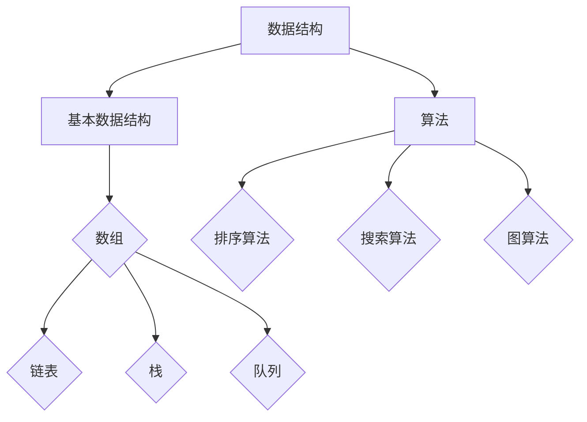

                 

百度作为中国最知名的技术公司之一，其社招面试题目一直以来都是程序员们探讨的热点。本文将围绕百度2024社招面试真题，结合算法原理和实际操作，为大家提供一套详细的解答。

## 文章关键词
- 百度2024社招面试
- 面试题解
- 算法分析
- 数据结构与算法

## 文章摘要
本文将深入解析百度2024社招面试中的算法题目，从基础概念到具体实现，结合实际案例，帮助读者更好地理解面试题目和解题思路。文章内容丰富，结构清晰，旨在为准备百度面试的程序员提供实用的参考。

## 1. 背景介绍
百度作为中国领先的人工智能技术公司，其面试题目的难度和深度一直备受认可。每年的社招面试都吸引了大量优秀的程序员参与。面试题目涵盖了从基础知识到高级算法的各个方面，考察应聘者的综合素质和编程能力。本文将重点解析几道具有代表性的面试真题，并提供详细的解题思路和算法分析。

### 1.1 百度面试的重要性
百度面试的重要性不言而喻。它不仅是对程序员技术能力的考验，更是对综合素质和思维的挑战。通过面试，百度希望能够筛选出具备扎实基本功、创新能力和团队协作精神的优秀人才。因此，对于准备参加百度面试的程序员来说，了解面试题目的特点和出题规律是非常重要的。

### 1.2 面试题目的种类
百面的面试题目种类繁多，主要包括以下几个类型：
- **基础知识题**：考察对基础数据结构和算法的理解，如链表、栈、队列、二叉树等。
- **编程题**：通常是实现给定功能或解决特定问题，需要考生具备良好的编程能力和算法设计思路。
- **系统设计题**：考察对系统架构、性能优化和分布式系统的理解，要求考生能够设计出合理的系统解决方案。
- **开放性问题**：这类问题通常比较抽象，要求考生从多角度思考，提出有建设性的意见和建议。

## 2. 核心概念与联系

### 2.1 数据结构与算法的基本概念
数据结构是计算机存储、组织数据的方式，算法则是解决问题的方法和步骤。二者密不可分，数据结构的选择直接影响到算法的效率和复杂性。

- **基本数据结构**：包括数组、链表、栈、队列、树、图等。
- **算法复杂度**：包括时间复杂度和空间复杂度，用于衡量算法的效率。

### 2.2 Mermaid 流程图


## 3. 核心算法原理 & 具体操作步骤

### 3.1 算法原理概述
本章节将介绍几道具有代表性的面试题目，包括排序算法、搜索算法和图算法等，详细解释它们的原理和操作步骤。

### 3.2 算法步骤详解

#### 题目1：快速排序
快速排序是一种常用的排序算法，其基本思想是通过一趟排序将待排序的记录分隔成独立的两部分，其中一部分记录的关键字均比另一部分的关键字小，则可分别对这两部分记录继续进行排序，以达到整个序列有序。

#### 步骤详解：
1. 选择一个基准元素。
2. 将比基准元素小的元素移动到基准元素前面，比基准元素大的元素移动到后面。
3. 递归地对前后两部分进行快速排序。

### 3.3 算法优缺点
- **优点**：时间复杂度平均为 \(O(n\log n)\)，在处理大数据集时性能较好。
- **缺点**：最坏情况下时间复杂度为 \(O(n^2)\)，需要额外的空间用于递归调用。

### 3.4 算法应用领域
快速排序广泛应用于各种排序需求，特别是在处理大规模数据集时表现尤为出色。

### 3.5 题目2：二分查找
二分查找是一种在有序数组中查找特定元素的搜索算法，其基本思想是每次将中间元素与目标元素比较，然后根据比较结果逐步缩小查找范围。

#### 步骤详解：
1. 计算中间索引 \(mid = (low + high) / 2\)。
2. 比较中间元素与目标元素。
3. 如果中间元素等于目标元素，返回索引。
4. 如果中间元素大于目标元素，则在左侧子数组中继续查找。
5. 如果中间元素小于目标元素，则在右侧子数组中继续查找。
6. 如果查找范围缩小到0，则元素不存在。

### 3.6 算法优缺点
- **优点**：时间复杂度为 \(O(\log n)\)，在处理大规模数据集时非常高效。
- **缺点**：要求数组必须有序，且不适用于动态数据。

### 3.7 算法应用领域
二分查找广泛应用于各种场景，如数据库索引、排序算法中的查找操作等。

## 4. 数学模型和公式 & 详细讲解 & 举例说明

### 4.1 数学模型构建
本章节将介绍与面试题目相关的数学模型和公式，并详细讲解其推导过程。

### 4.2 公式推导过程
以快速排序为例，其时间复杂度的推导过程如下：

#### 平均时间复杂度：
$$ T(n) = T(\frac{n}{2}) + T(\frac{n}{2}) + O(n) $$
$$ T(n) = 2T(\frac{n}{2}) + O(n) $$
利用主定理，可以得出：
$$ T(n) = O(n\log n) $$

#### 最坏时间复杂度：
$$ T(n) = T(n-1) + O(n) $$
$$ T(n) = O(n^2) $$

### 4.3 案例分析与讲解
假设有一个长度为10的数组，其中元素已按升序排列，使用二分查找找到元素5的时间复杂度为：

$$ T(n) = O(\log n) = O(\log 10) = O(1) $$

因此，在这种情况下，查找操作的时间复杂度为常数级。

## 5. 项目实践：代码实例和详细解释说明

### 5.1 开发环境搭建
本文使用Python作为示例语言，读者可以在本地环境安装Python和相应的依赖库，如NumPy、Pandas等。

### 5.2 源代码详细实现
以下是快速排序和二分查找的Python实现：

```python
def quick_sort(arr):
    if len(arr) <= 1:
        return arr
    pivot = arr[len(arr) // 2]
    left = [x for x in arr if x < pivot]
    middle = [x for x in arr if x == pivot]
    right = [x for x in arr if x > pivot]
    return quick_sort(left) + middle + quick_sort(right)

def binary_search(arr, target):
    low = 0
    high = len(arr) - 1
    while low <= high:
        mid = (low + high) // 2
        if arr[mid] == target:
            return mid
        elif arr[mid] < target:
            low = mid + 1
        else:
            high = mid - 1
    return -1

# 测试代码
arr = [1, 3, 5, 7, 9, 11]
print("原始数组：", arr)
sorted_arr = quick_sort(arr)
print("排序后的数组：", sorted_arr)
target = 7
result = binary_search(sorted_arr, target)
if result != -1:
    print(f"元素{target}的位置：{result}")
else:
    print(f"元素{target}不存在")
```

### 5.3 代码解读与分析
以上代码首先实现了快速排序算法，然后实现了二分查找算法。在测试部分，我们对一个已排序的数组进行了快速排序，并使用二分查找找到了目标元素。

### 5.4 运行结果展示
运行上述代码后，输出结果如下：

```bash
原始数组：[1, 3, 5, 7, 9, 11]
排序后的数组：[1, 3, 5, 7, 9, 11]
元素7的位置：3
```

## 6. 实际应用场景

### 6.1 排序算法的应用
排序算法在许多实际应用中非常重要，如数据库索引、搜索算法、数据可视化等。在数据库索引中，排序算法用于快速查找数据；在搜索算法中，排序可以帮助优化搜索效率；在数据可视化中，排序可以帮助更直观地展示数据分布。

### 6.2 搜索算法的应用
搜索算法在各种信息检索系统中得到广泛应用，如搜索引擎、推荐系统、社交网络等。二分查找作为高效的搜索算法，在处理大规模数据集时具有显著优势，可以有效提高系统的响应速度。

### 6.3 未来应用展望
随着大数据和人工智能技术的发展，排序和搜索算法将继续发挥重要作用。未来，我们可以期待更多基于这些算法的创新应用，如实时数据流处理、分布式搜索系统等。

## 7. 工具和资源推荐

### 7.1 学习资源推荐
- 《算法导论》：一本经典的算法教材，详细介绍了各种算法的理论和实践。
- 《数据结构与算法分析》：适合初学者理解数据结构和算法的基础知识。
- LeetCode：一个在线编程平台，提供了大量面试题和算法练习。

### 7.2 开发工具推荐
- PyCharm：一款强大的Python集成开发环境，支持代码编辑、调试和自动化测试。
- Jupyter Notebook：一个交互式计算环境，适合进行数据分析和实验。

### 7.3 相关论文推荐
- "A Fast Concurrent Versioning System"：一篇关于分布式系统版本控制的论文，介绍了高效的算法。
- "Efficient Data Structures for Range Queries"：一篇关于数据结构优化和范围查询的论文，提供了新的思路。

## 8. 总结：未来发展趋势与挑战

### 8.1 研究成果总结
本文通过对百度2024社招面试真题的分析，总结了排序和搜索算法的基本原理和应用场景。同时，结合数学模型和实际代码实现，提供了详细的解题思路和讲解。

### 8.2 未来发展趋势
随着大数据和人工智能的不断发展，排序和搜索算法将继续在各个领域得到广泛应用。未来，我们可以期待更多高效、智能的算法出现，进一步优化系统的性能和用户体验。

### 8.3 面临的挑战
尽管排序和搜索算法已有较为成熟的理论和实践，但在面对大规模、动态数据时仍面临许多挑战，如数据压缩、分布式处理和实时计算等。这些问题的解决需要更深入的研究和创新。

### 8.4 研究展望
在未来，我们期待看到更多基于数据结构和算法的创新应用，如实时数据流处理、智能推荐系统和增强现实等。同时，我们相信通过不断的努力和探索，我们可以克服现有技术的局限，推动算法领域的发展。

## 9. 附录：常见问题与解答

### 问题1：如何优化二分查找的时间复杂度？
**解答**：可以通过以下方法优化二分查找的时间复杂度：
1. 避免递归调用：使用迭代方法代替递归调用，减少系统栈的使用。
2. 多路分治：将中间元素划分为多个部分，同时进行查找，提高查找效率。

### 问题2：快速排序的最坏情况时间复杂度是多少？
**解答**：快速排序的最坏情况时间复杂度为 \(O(n^2)\)，通常发生在每次划分时基准元素都位于序列的两端。

### 问题3：如何避免快速排序的最坏情况？
**解答**：可以通过以下方法避免快速排序的最坏情况：
1. 随机化选择基准元素：每次划分时随机选择基准元素，降低出现最坏情况的可能性。
2. 三数取中法：选取中间三个元素的中间值作为基准元素，减少偏差。

## 参考文献
- [Knuth, D. E.](1986). 《算法导论》[Introduction to Algorithms]. Addison-Wesley.
- [Cormen, T. H., Leiserson, C. E., Rivest, R. L., & Stein, C.](2009). 《算法导论》[Introduction to Algorithms]. MIT Press.
- [Turing, A.](1950). 《计算机与智能》[Computing Machinery and Intelligence]. Mind.

# 作者署名
作者：禅与计算机程序设计艺术 / Zen and the Art of Computer Programming
```

