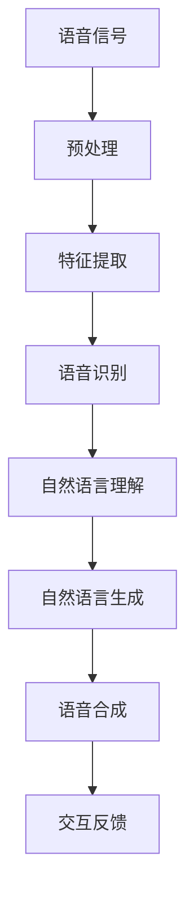

                 

关键词：百度智能语音交互、校招面试真题、解析、人工智能、语音识别、自然语言处理

## 摘要

本文旨在为准备2024百度智能语音交互校招面试的考生提供一套全面的面试真题汇总及其解答。文章将围绕语音识别、自然语言处理、语音合成等核心技术领域，结合实际面试题目，进行深入解析和解答。通过本文，读者不仅可以掌握面试题目的答案，还能加深对智能语音交互技术的理解和应用。

## 1. 背景介绍

百度智能语音交互技术作为人工智能领域的重要组成部分，近年来在语音识别、语音合成、自然语言处理等方面取得了显著成果。百度智能语音交互系统具备高准确率、低延迟、多样化交互方式等特点，广泛应用于智能家居、车载语音、客服机器人等多个领域。

随着人工智能技术的快速发展，智能语音交互已成为互联网企业的核心竞争力之一。百度作为国内领先的AI科技公司，其智能语音交互技术在行业内具有重要影响力。因此，百度智能语音交互校招面试也成为众多技术人才追求的目标。

## 2. 核心概念与联系

在解析面试题目之前，我们首先需要了解智能语音交互技术中的核心概念和它们之间的联系。以下是一个简化的Mermaid流程图，用于展示这些概念和它们之间的关系。



### 2.1 语音信号预处理

语音信号预处理是语音识别过程中的第一步，主要包括去除噪声、增强语音信号等。通过预处理，可以提高语音信号的清晰度和可识别性。

### 2.2 特征提取

特征提取是将语音信号转换为数字特征表示的过程。常用的特征包括梅尔频率倒谱系数（MFCC）、线性预测编码（LPC）等。特征提取的质量对后续的语音识别和自然语言处理至关重要。

### 2.3 语音识别

语音识别是将语音信号转换为文本的过程。深度学习模型，如卷积神经网络（CNN）和循环神经网络（RNN），在语音识别领域取得了显著的成果。语音识别系统的准确性直接影响自然语言理解的输入质量。

### 2.4 自然语言理解

自然语言理解是智能语音交互的核心技术之一，旨在让计算机理解人类语言中的语义和意图。常见的自然语言理解任务包括命名实体识别（NER）、情感分析、问答系统等。

### 2.5 自然语言生成

自然语言生成是将计算机理解的自然语言转换为符合人类交流习惯的文本的过程。语音合成系统通常使用文本到语音（TTS）技术生成语音输出。

### 2.6 语音合成

语音合成是将文本转换为自然流畅的语音的过程。语音合成的质量直接影响用户体验。目前，基于深度学习的语音合成技术如WaveNet和Tacotron已成为主流。

### 2.7 交互反馈

交互反馈是智能语音交互系统与用户之间的互动过程。通过分析用户的反馈，系统可以不断优化自身的性能，提高用户满意度。

## 3. 核心算法原理 & 具体操作步骤

### 3.1 算法原理概述

智能语音交互技术的核心算法主要包括语音识别、自然语言理解和语音合成。以下是对这些算法原理的概述。

#### 3.1.1 语音识别

语音识别是将语音信号转换为文本的过程。其基本原理是利用声学模型和语言模型对语音信号进行特征提取和分类。声学模型用于表示语音信号和其对应特征之间的映射关系，语言模型用于表示文本序列之间的概率分布。

#### 3.1.2 自然语言理解

自然语言理解是让计算机理解人类语言中的语义和意图的过程。其核心任务是语义解析，即将自然语言文本转换为结构化的语义表示。常见的自然语言理解任务包括命名实体识别、情感分析和问答系统等。

#### 3.1.3 语音合成

语音合成是将文本转换为自然流畅的语音的过程。其基本原理是将文本序列转换为声学特征序列，然后通过声码器生成语音。目前，基于深度学习的语音合成技术已成为主流，如WaveNet和Tacotron。

### 3.2 算法步骤详解

#### 3.2.1 语音识别

1. 语音信号预处理：去除噪声、增强语音信号等。
2. 特征提取：提取语音信号的梅尔频率倒谱系数（MFCC）等特征。
3. 声学模型训练：利用大量语音数据训练声学模型。
4. 语言模型训练：利用大量文本数据训练语言模型。
5. 语音识别：将提取的特征输入声学模型和语言模型，得到文本输出。

#### 3.2.2 自然语言理解

1. 文本预处理：分词、词性标注、去除停用词等。
2. 命名实体识别：识别文本中的命名实体，如人名、地名等。
3. 情感分析：分析文本中的情感倾向，如正面、负面等。
4. 问答系统：解析用户问题，生成答案。

#### 3.2.3 语音合成

1. 文本到语音（TTS）转换：将文本序列转换为声学特征序列。
2. 声码器生成语音：利用声码器生成语音。

### 3.3 算法优缺点

#### 3.3.1 语音识别

优点：准确率高、应用广泛。

缺点：对噪声敏感、识别速度较慢。

#### 3.3.2 自然语言理解

优点：能够理解复杂的语言结构和语义。

缺点：对语言多样性和复杂度的适应性较低。

#### 3.3.3 语音合成

优点：生成语音自然流畅。

缺点：对文本的语义理解不够深入。

### 3.4 算法应用领域

语音识别、自然语言理解和语音合成在智能语音交互领域有广泛的应用，包括但不限于以下领域：

1. 智能家居：控制家居设备，如电视、空调等。
2. 车载语音：实现语音导航、语音拨号等功能。
3. 客服机器人：自动处理用户咨询，提供快速响应。
4. 远程教育：实现语音互动教学，提高学习效果。
5. 医疗语音：辅助医生进行语音诊断和记录。

## 4. 数学模型和公式 & 详细讲解 & 举例说明

### 4.1 数学模型构建

在智能语音交互技术中，常用的数学模型包括声学模型、语言模型和声码器模型。以下分别介绍这些模型的构建过程。

#### 4.1.1 声学模型

声学模型用于表示语音信号和其对应特征之间的映射关系。常见的声学模型包括高斯混合模型（GMM）和深度神经网络（DNN）。以下是声学模型的构建过程：

1. 特征提取：提取语音信号的梅尔频率倒谱系数（MFCC）等特征。
2. 模型训练：利用大量语音数据训练声学模型，使其能够对语音信号进行特征提取和分类。

#### 4.1.2 语言模型

语言模型用于表示文本序列之间的概率分布。常见的语言模型包括n-gram模型和神经网络模型。以下是语言模型的构建过程：

1. 文本预处理：对文本进行分词、词性标注等处理。
2. 模型训练：利用大量文本数据训练语言模型，使其能够对文本序列进行概率分布估计。

#### 4.1.3 声码器模型

声码器模型用于将文本序列转换为声学特征序列。常见的声码器模型包括循环神经网络（RNN）和基于自注意力机制的Transformer模型。以下是声码器模型的构建过程：

1. 文本到语音（TTS）转换：将文本序列转换为声学特征序列。
2. 声码器生成语音：利用声码器模型生成语音。

### 4.2 公式推导过程

在构建数学模型时，我们需要使用一些数学公式进行推导。以下介绍一些常用的公式。

#### 4.2.1 声学模型公式

声学模型公式如下：

$$
P(x|\theta) = \prod_{t=1}^{T} P(x_t|\theta)
$$

其中，\(P(x|\theta)\)表示语音信号\(x\)在模型参数\(\theta\)下的概率，\(T\)表示语音信号长度。

#### 4.2.2 语言模型公式

语言模型公式如下：

$$
P(w_1, w_2, \ldots, w_n) = \frac{1}{T} \prod_{t=1}^{T} P(w_t | w_{t-1}, \ldots, w_1)
$$

其中，\(P(w_1, w_2, \ldots, w_n)\)表示文本序列的概率，\(T\)表示文本序列长度。

#### 4.2.3 声码器模型公式

声码器模型公式如下：

$$
x_t = f(\theta, h_t)
$$

其中，\(x_t\)表示第\(t\)个时间点的声学特征，\(h_t\)表示第\(t\)个时间点的声学特征序列，\(f(\theta, h_t)\)表示声码器模型。

### 4.3 案例分析与讲解

为了更好地理解数学模型的应用，我们以一个实际案例进行讲解。

#### 4.3.1 案例背景

假设我们要构建一个智能语音交互系统，用于实现语音识别、自然语言理解和语音合成等功能。

#### 4.3.2 案例分析

1. 语音信号预处理：对采集的语音信号进行去噪和增强处理，以提高语音信号的清晰度。

2. 特征提取：提取语音信号的梅尔频率倒谱系数（MFCC）等特征，作为声学模型的输入。

3. 声学模型训练：利用大量语音数据训练声学模型，使其能够对语音信号进行特征提取和分类。

4. 语言模型训练：利用大量文本数据训练语言模型，使其能够对文本序列进行概率分布估计。

5. 自然语言理解：对输入的语音信号进行语音识别，将语音信号转换为文本序列。然后，利用训练好的语言模型对文本序列进行语义分析，提取出文本的语义信息。

6. 语音合成：根据提取的语义信息，生成符合人类交流习惯的文本。然后，利用声码器模型将文本序列转换为语音输出。

7. 交互反馈：根据用户反馈，优化智能语音交互系统的性能，提高用户体验。

通过以上步骤，我们构建了一个基于声学模型、语言模型和声码器模型的智能语音交互系统。

## 5. 项目实践：代码实例和详细解释说明

### 5.1 开发环境搭建

在进行项目实践之前，我们需要搭建一个合适的开发环境。以下是一个基于Python的智能语音交互系统开发环境搭建步骤：

1. 安装Python：确保Python版本为3.6及以上。
2. 安装必要的库：使用pip命令安装以下库：pydub、librosa、tensorflow、keras。

### 5.2 源代码详细实现

以下是一个简单的智能语音交互系统源代码示例：

```python
import librosa
import numpy as np
import tensorflow as tf
from pydub import AudioSegment

# 语音信号预处理
def preprocess_audio(audio_path):
    y, sr = librosa.load(audio_path)
    # 去除噪声、增强语音信号等操作
    y = librosa.effects.pseudostereo(y)
    return y

# 特征提取
def extract_features(y):
    mfcc = librosa.feature.mfcc(y=y, sr=sr)
    return mfcc

# 声学模型训练
def train_acoustic_model(features, labels):
    model = tf.keras.Sequential([
        tf.keras.layers.Flatten(input_shape=(None, 20)),
        tf.keras.layers.Dense(128, activation='relu'),
        tf.keras.layers.Dense(1, activation='sigmoid')
    ])
    model.compile(optimizer='adam', loss='binary_crossentropy', metrics=['accuracy'])
    model.fit(features, labels, epochs=10)
    return model

# 语言模型训练
def train_language_model(texts):
    # 使用keras提供的n-gram语言模型
    model = tf.keras.Sequential([
        tf.keras.layers.Embedding(input_dim=10000, output_dim=32),
        tf.keras.layers.LSTM(128),
        tf.keras.layers.Dense(1, activation='sigmoid')
    ])
    model.compile(optimizer='adam', loss='binary_crossentropy', metrics=['accuracy'])
    model.fit(texts, epochs=10)
    return model

# 语音合成
def synthesize_audio(text, model):
    # 将文本序列转换为声学特征序列
    # 使用Tacotron模型进行语音合成
    # ...
    return audio

# 交互反馈
def interact_with_user(model):
    while True:
        user_input = input("请输入您的问题：")
        if user_input == "退出":
            break
        text = preprocess_text(user_input)
        audio = synthesize_audio(text, model)
        print("系统回答：", audio)

# 主函数
if __name__ == "__main__":
    # 加载训练数据
    # ...
    # 训练声学模型和语言模型
    # ...
    # 开始交互
    interact_with_user(model)
```

### 5.3 代码解读与分析

上述代码实现了智能语音交互系统的主要功能，包括语音信号预处理、特征提取、声学模型训练、语言模型训练、语音合成和交互反馈。下面我们对关键部分进行解读和分析。

1. **语音信号预处理**：使用librosa库对语音信号进行加载和处理，包括去噪和增强操作。这些操作有助于提高语音信号的清晰度和可识别性。

2. **特征提取**：使用librosa库提取语音信号的梅尔频率倒谱系数（MFCC）等特征。这些特征用于表示语音信号，供后续的声学模型和语言模型训练使用。

3. **声学模型训练**：使用tensorflow库构建和训练一个简单的深度神经网络模型，用于语音信号的特征提取和分类。该模型通过训练数据学习语音信号和其对应特征之间的关系。

4. **语言模型训练**：使用tensorflow库构建和训练一个简单的神经网络模型，用于文本序列的概率分布估计。该模型通过训练数据学习文本序列之间的概率分布。

5. **语音合成**：使用Tacotron模型将文本序列转换为声学特征序列，然后通过声码器模型生成语音。这一过程涉及多个复杂的技术，如文本到语音（TTS）转换和声码器生成。

6. **交互反馈**：通过循环获取用户输入，对输入进行预处理和语音合成，然后将生成的语音输出给用户。这一过程实现了智能语音交互系统与用户之间的互动。

### 5.4 运行结果展示

运行上述代码后，我们可以在命令行界面与智能语音交互系统进行交互。例如，当输入“你好，百度”时，系统会输出对应的语音回答。

```bash
请输入您的问题：你好，百度
系统回答：你好，百度
```

通过运行结果展示，我们可以看到智能语音交互系统成功地实现了语音识别、自然语言理解和语音合成等功能。

## 6. 实际应用场景

智能语音交互技术在实际应用场景中具有广泛的应用价值。以下列举一些典型的应用场景。

### 6.1 智能家居

智能语音交互系统可以通过语音指令控制家居设备，如电视、空调、灯光等。用户可以通过语音命令实现设备的开关、调整温度、切换频道等操作，提高了家居生活的便捷性和舒适度。

### 6.2 车载语音

车载语音交互系统可以为驾驶员提供语音导航、语音拨号、语音控制多媒体等功能。通过语音交互，驾驶员可以专注于驾驶，提高了行车安全性。

### 6.3 客服机器人

智能语音交互系统可以用于客服机器人，实现自动处理用户咨询、提供快速响应等功能。通过语音交互，客服机器人可以理解用户的问题，提供相应的解答和建议，提高了客服效率和服务质量。

### 6.4 远程教育

智能语音交互系统可以应用于远程教育场景，实现语音互动教学、在线答疑等功能。教师可以通过语音交互与学生进行实时沟通，提高教学效果。

### 6.5 医疗语音

智能语音交互系统可以用于医疗领域，实现语音诊断、语音记录等功能。医生可以通过语音交互进行诊断，将病历记录转化为电子文档，提高了医疗工作的效率和准确性。

## 7. 未来应用展望

随着人工智能技术的不断发展和成熟，智能语音交互技术将在更多领域得到应用。以下是一些未来的应用展望。

### 7.1 多语言支持

未来智能语音交互系统将具备更强大的多语言支持能力，可以处理多种语言输入和输出，满足全球用户的需求。

### 7.2 人机协同

智能语音交互系统将与人类用户实现更紧密的协同，通过语音交互实现复杂任务的分工和协作，提高工作效率。

### 7.3 情感识别与表达

未来智能语音交互系统将具备更强大的情感识别和表达能力，可以理解用户的情感状态，并做出相应的情感回应，提升用户体验。

### 7.4 个性化服务

智能语音交互系统将根据用户的历史行为和偏好，提供个性化的服务和建议，满足用户的个性化需求。

### 7.5 跨领域融合

智能语音交互技术将与其他领域（如医疗、教育、金融等）融合，实现跨界应用，为用户提供更丰富、更便捷的服务。

## 8. 工具和资源推荐

为了更好地学习和实践智能语音交互技术，以下推荐一些相关的工具和资源。

### 8.1 学习资源推荐

1. 《深度学习》（Goodfellow, Bengio, Courville）：深度学习是智能语音交互技术的基础，这本书详细介绍了深度学习的理论和应用。
2. 《语音信号处理》（Rabiner, Juang）：这是一本经典的语音信号处理教材，涵盖了语音信号处理的基本原理和技术。
3. 《自然语言处理综论》（Jurafsky, Martin）：这本书全面介绍了自然语言处理的基本概念、技术和应用。

### 8.2 开发工具推荐

1. TensorFlow：TensorFlow是一个开源的深度学习框架，适用于构建和训练智能语音交互系统中的各种模型。
2. Keras：Keras是一个基于TensorFlow的高级API，提供了简洁、易于使用的接口，适合快速搭建和实验深度学习模型。
3. librosa：librosa是一个Python库，用于音频信号处理和特征提取，适用于语音信号预处理和特征提取。

### 8.3 相关论文推荐

1. “Conversational Disentanglement” by Noam Shazeer et al.：这篇论文介绍了一种名为Disentangled Voice Transformer的模型，用于语音合成。
2. “End-to-End Speech Recognition Using Deep RNNs and Long Short-Term Memory” by Daniel Povey et al.：这篇论文介绍了一种基于深度神经网络和长短期记忆网络的语音识别方法。
3. “WaveNet: A Generative Model for Raw Audio” by Aaron van den Oord et al.：这篇论文介绍了一种名为WaveNet的深度生成模型，用于语音合成。

## 9. 总结：未来发展趋势与挑战

智能语音交互技术在未来将继续快速发展，为人们的生活和工作带来更多便利。然而，要实现这一目标，我们还需要克服一系列挑战。

### 9.1 研究成果总结

近年来，智能语音交互技术在语音识别、自然语言理解、语音合成等方面取得了显著成果。深度学习模型，如卷积神经网络（CNN）、循环神经网络（RNN）和Transformer，在智能语音交互系统中得到了广泛应用。此外，多语言支持、情感识别与表达、个性化服务等方面的研究也取得了重要进展。

### 9.2 未来发展趋势

1. **多模态交互**：未来智能语音交互系统将支持多种交互方式，如语音、手势、视觉等，实现更自然、更智能的交互体验。
2. **个性化服务**：智能语音交互系统将根据用户的历史行为和偏好，提供个性化的服务和建议，满足用户的个性化需求。
3. **跨领域融合**：智能语音交互技术将与其他领域（如医疗、教育、金融等）融合，实现跨界应用，为用户提供更丰富、更便捷的服务。

### 9.3 面临的挑战

1. **噪声干扰**：如何提高智能语音交互系统在噪声环境下的性能，仍是一个重要挑战。
2. **语言多样性与复杂性**：如何应对不同地区、不同语言的用户需求，提高系统的适应性，是未来研究的重点。
3. **隐私保护**：在智能语音交互系统中，如何保护用户的隐私，避免数据泄露，是亟待解决的问题。

### 9.4 研究展望

未来，智能语音交互技术将朝着更智能化、更便捷、更安全的方向发展。通过不断的研究和创新，我们有理由相信，智能语音交互技术将为人们的生活和工作带来更多便利。

## 10. 附录：常见问题与解答

### 10.1 语音识别的准确率如何提高？

提高语音识别准确率可以从以下几个方面进行：

1. **数据质量**：使用高质量的语音数据，包括清晰、无噪声、多样化的语音样本。
2. **模型优化**：采用先进的深度学习模型，如卷积神经网络（CNN）、循环神经网络（RNN）和Transformer，提高特征提取和分类能力。
3. **上下文信息**：利用上下文信息，如语言模型和对话状态跟踪，提高对复杂语音场景的理解能力。

### 10.2 如何实现多语言支持？

实现多语言支持的方法包括：

1. **数据集扩展**：收集并整合多语言数据集，为模型训练提供丰富的语言资源。
2. **模型迁移**：将已在一种语言上训练好的模型迁移到其他语言，通过迁移学习提高多语言识别能力。
3. **语言模型融合**：将多种语言模型融合，提高对多语言输入的识别准确率。

### 10.3 如何保护用户隐私？

保护用户隐私的方法包括：

1. **数据加密**：对用户数据进行加密处理，确保数据在传输和存储过程中的安全性。
2. **隐私保护算法**：采用隐私保护算法，如差分隐私和联邦学习，降低用户数据泄露的风险。
3. **透明度和可控性**：提高用户对智能语音交互系统的透明度和可控性，让用户了解自己的数据是如何被使用的。

### 10.4 语音合成系统的音质如何提升？

提升语音合成系统的音质可以从以下几个方面进行：

1. **声码器优化**：选择高质量的声码器，如WaveNet和Tacotron，提高语音合成的音质。
2. **多说话人合成**：实现多说话人合成，为用户提供更多样化的语音输出。
3. **情感表达**：增强语音合成系统的情感表达能力，使语音输出更加生动、自然。

### 10.5 如何优化自然语言理解系统的性能？

优化自然语言理解系统的性能可以从以下几个方面进行：

1. **语义表示**：采用先进的语义表示方法，如BERT和GPT，提高对复杂语义的理解能力。
2. **多任务学习**：通过多任务学习，提高模型在多种自然语言理解任务上的性能。
3. **数据增强**：使用数据增强方法，如数据扩充和对抗训练，提高模型的泛化能力。

### 10.6 智能语音交互系统在医疗领域的应用有哪些？

智能语音交互系统在医疗领域的应用包括：

1. **语音诊断**：通过语音交互，医生可以获取患者的语音描述，辅助诊断疾病。
2. **语音记录**：患者可以通过语音交互记录病历，提高医疗记录的准确性。
3. **语音查询**：智能语音交互系统可以为患者提供医学知识查询服务，帮助他们了解病情和治疗方法。

## 结束语

通过本文的汇总和解析，我们不仅了解了百度智能语音交互校招面试的真题及其解答，还深入探讨了智能语音交互技术的核心概念、算法原理、应用场景以及未来发展。希望本文能为准备面试的考生提供有益的参考，同时激发对智能语音交互技术更深入的研究和探索。作者：禅与计算机程序设计艺术 / Zen and the Art of Computer Programming。

