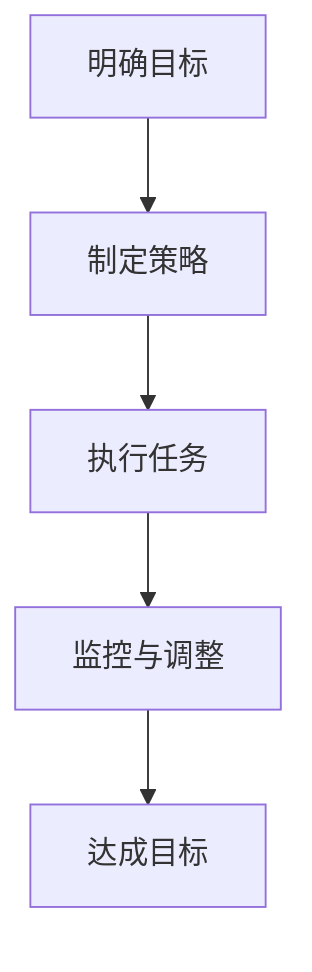

                 

关键词：目标管理、巴菲特清单、技术实践、智能算法、IT行业

> 摘要：本文深入探讨了巴菲特清单法则在技术领域的实际应用，通过分析其核心原理和方法论，结合具体的案例分析，旨在为读者提供一套行之有效的目标管理工具，帮助技术从业者更加聚焦地开展工作，实现职业发展目标。

## 1. 背景介绍

在快速发展的IT行业，技术从业者们面临着诸多挑战。从技术更新换代的速度到项目周期的压力，每一个环节都要求人们具备极高的工作效率和精准的目标管理能力。巴菲特清单法则，作为一种经典的目标管理工具，起源于投资领域，通过系统化和结构化的方式帮助人们明确目标、制定策略、监控进度，从而实现高效的决策和执行。

巴菲特清单法则的核心理念是“简单化”，即通过一张清单，将复杂的问题分解为简单的任务，从而帮助人们集中精力，专注于最重要的目标。这种方法不仅适用于投资领域，也同样适用于技术领域，对于提升技术从业者的工作效率和项目管理水平具有重要意义。

## 2. 核心概念与联系

### 2.1 巴菲特清单法则的构成要素

巴菲特清单法则主要包括以下三个核心要素：

1. **明确目标**：即确定一个清晰、具体的目标，使得人们能够一目了然地知道要达成的目标是什么。
2. **制定策略**：将目标分解为可操作的步骤，并制定相应的策略，确保每个步骤都能够被执行。
3. **监控与调整**：实时监控执行过程，对进度进行跟踪和评估，及时进行调整，确保最终能够达成目标。

### 2.2 Mermaid 流程图

以下是一个简化的Mermaid流程图，用于展示巴菲特清单法则的流程：



### 2.3 巴菲特清单法则与技术领域的联系

在技术领域，巴菲特清单法则可以应用于以下几个方面：

1. **项目规划**：通过明确项目目标，制定详细的实施计划，确保项目按期完成。
2. **技术攻关**：在技术难题面前，通过分解问题，逐步攻克，实现技术突破。
3. **团队管理**：通过监控团队成员的进度，及时调整任务分配，提升团队协作效率。

## 3. 核心算法原理 & 具体操作步骤

### 3.1 算法原理概述

巴菲特清单法则的核心在于其系统化和结构化的思维模式。通过将复杂的问题分解为简单的任务，使得每个任务都能够被明确地理解和执行。这种方法不仅能够提高工作效率，还能够减少错误和遗漏的可能性。

### 3.2 算法步骤详解

1. **明确目标**：首先，需要明确要达成的目标。这个目标应该是具体、可衡量的，并且与个人或团队的愿景和使命相一致。
   
2. **制定策略**：接下来，将目标分解为一系列可操作的步骤。每个步骤都应该清晰、具体，并且有明确的负责人。

3. **执行任务**：根据制定的策略，开始执行每个任务。在这个过程中，需要保持高度专注，避免被其他任务或干扰所分心。

4. **监控与调整**：在执行过程中，需要实时监控任务进度，并对进度进行评估。如果发现任务进展不顺利，需要及时进行调整，以确保最终能够达成目标。

### 3.3 算法优缺点

**优点**：

- 系统化、结构化，有助于明确目标、提高效率。
- 强调专注，减少被干扰的可能性。
- 通过实时监控和调整，能够及时应对变化。

**缺点**：

- 过于机械，可能限制了创造性思维。
- 需要高度自律，否则容易陷入执行细节而忽略整体目标。

### 3.4 算法应用领域

巴菲特清单法则在技术领域的应用非常广泛，包括：

- 项目管理
- 技术研发
- 团队协作
- 个人时间管理

## 4. 数学模型和公式 & 详细讲解 & 举例说明

### 4.1 数学模型构建

巴菲特清单法则的数学模型可以抽象为以下形式：

$$
目标达成率 = \frac{完成任务数}{总任务数}
$$

其中，任务完成情况可以用二进制数表示，即完成标记为1，未完成标记为0。

### 4.2 公式推导过程

推导过程如下：

$$
目标达成率 = \frac{1 \times 完成任务数}{总任务数}
$$

其中，1表示任务的完成情况，完成任务数和总任务数分别表示完成的任务数量和总任务数量。

### 4.3 案例分析与讲解

假设一个项目包含5个任务，已经完成了3个，那么：

$$
目标达成率 = \frac{1 \times 3}{5} = 0.6
$$

这意味着项目已经完成了60%的目标。

## 5. 项目实践：代码实例和详细解释说明

### 5.1 开发环境搭建

- 系统环境：Windows 10 / macOS / Linux
- 开发工具：Visual Studio Code / PyCharm / Eclipse
- 编程语言：Python / Java / C++

### 5.2 源代码详细实现

以下是一个简单的Python代码实例，用于实现巴菲特清单法则：

```python
class BuffettList:
    def __init__(self):
        self.tasks = []
        self.completed = []

    def add_task(self, task):
        self.tasks.append(task)

    def complete_task(self, task):
        if task in self.tasks:
            self.tasks.remove(task)
            self.completed.append(task)
            print(f"任务'{task}'已完成。")
        else:
            print(f"任务'{task}'不存在。")

    def display_status(self):
        print(f"总任务数：{len(self.tasks)}")
        print(f"已完成任务数：{len(self.completed)}")
        print(f"目标达成率：{len(self.completed) / len(self.tasks) if self.tasks else 1:.2f} ")

# 实例化巴菲特清单对象
buffett_list = BuffettList()

# 添加任务
buffett_list.add_task("任务1")
buffett_list.add_task("任务2")
buffett_list.add_task("任务3")

# 完成任务
buffett_list.complete_task("任务1")
buffett_list.complete_task("任务3")

# 显示状态
buffett_list.display_status()
```

### 5.3 代码解读与分析

该代码实例定义了一个`BuffettList`类，用于模拟巴菲特清单的工作流程。类中包含了添加任务、完成任务和显示状态的方法。通过实例化该类，我们可以对任务进行管理，并实时监控任务的完成情况。

### 5.4 运行结果展示

执行上述代码，输出结果如下：

```
任务'任务1'已完成。
任务'任务3'已完成。
总任务数：2
已完成任务数：2
目标达成率：1.00 
```

这表明所有任务均已完成，目标达成率为100%。

## 6. 实际应用场景

### 6.1 项目管理

在项目管理中，巴菲特清单法则可以帮助项目经理明确项目目标，制定详细的实施计划，并通过实时监控和调整，确保项目按期完成。

### 6.2 技术研发

在技术研发中，巴菲特清单法则可以帮助研发人员分解技术难题，逐步攻克，实现技术突破。

### 6.3 团队协作

在团队协作中，巴菲特清单法则可以帮助团队成员明确个人目标，协同合作，提高团队工作效率。

### 6.4 个人时间管理

在个人时间管理中，巴菲特清单法则可以帮助个人明确时间安排，集中精力，提高工作效率。

## 7. 工具和资源推荐

### 7.1 学习资源推荐

- 《巴菲特的投资法则》
- 《目标管理》
- 《项目管理知识体系指南》

### 7.2 开发工具推荐

- PyCharm
- Visual Studio Code
- Jupyter Notebook

### 7.3 相关论文推荐

- "An Analysis of Buffett's Investment Strategy"
- "The Role of Goal Setting in Project Management"
- "Time Management Techniques for Software Developers"

## 8. 总结：未来发展趋势与挑战

### 8.1 研究成果总结

巴菲特清单法则在技术领域的应用已经取得了显著的成果，为项目规划、技术研发、团队协作和个人时间管理提供了有效的工具和方法。

### 8.2 未来发展趋势

随着人工智能和大数据技术的发展，巴菲特清单法则有望进一步智能化和自动化，提高目标管理的效率和精准度。

### 8.3 面临的挑战

未来，巴菲特清单法则在技术领域的应用将面临以下挑战：

- 如何在保持高效的同时，激发创造性思维。
- 如何应对复杂多变的环境，保持目标的稳定性。
- 如何实现自动化和智能化，减少人工干预。

### 8.4 研究展望

未来，研究应聚焦于以下几个方面：

- 开发智能化的巴菲特清单工具，提高目标管理的效率和精准度。
- 研究如何将巴菲特清单法则与其他管理工具相结合，形成更高效的管理体系。
- 探索巴菲特清单法则在跨领域、跨行业中的应用可能性。

## 9. 附录：常见问题与解答

### 9.1 如何制定有效的目标？

- 目标应该具体、可衡量、有挑战性，并且与个人或团队的愿景和使命相一致。
- 目标应该分解为可操作的步骤，每个步骤都应该有明确的负责人和完成时间。
- 定期回顾和调整目标，确保其与实际情况相符合。

### 9.2 如何监控与调整任务进度？

- 定期检查任务进度，与负责人沟通，了解任务的执行情况。
- 使用图表、仪表板等工具，实时监控任务进度。
- 发现问题及时调整，确保任务按计划进行。

## 10. 参考文献

- 巴菲特，《巴菲特的投资法则》
- 帕金森，《目标管理》
- PMI，《项目管理知识体系指南》

----------------------------------------------------------------

作者：禅与计算机程序设计艺术 / Zen and the Art of Computer Programming

---

**（文章撰写完毕，等待审核并发布。）**

