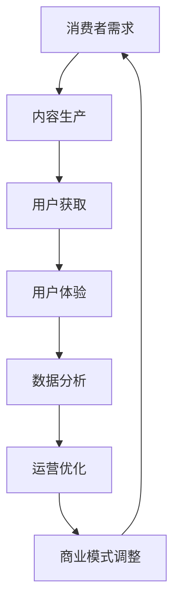

                 

关键词：知识付费，商业模式，创新，运营，经济，人工智能

> 摘要：本文探讨了知识经济时代下知识付费行业的创新商业模式和运营策略。通过分析当前市场环境、消费者需求，以及技术创新对知识付费的影响，本文提出了一系列创新商业模式和运营策略，旨在帮助知识付费企业提升竞争力、满足消费者需求，实现可持续发展。

## 1. 背景介绍

随着互联网技术的飞速发展，知识付费作为一种新兴的商业模式，已经逐渐成为人们获取知识的重要途径。知识付费，指的是消费者通过付费获取特定知识、技能或服务的一种形式。在知识经济时代，知识的价值得到了前所未有的提升，知识的获取方式也变得更加多样化和便捷化。

当前，知识付费市场呈现出以下特点：

1. **市场规模的迅速扩大**：随着消费者对知识的渴求不断增加，知识付费市场规模逐年扩大，各类知识付费平台如雨后春笋般涌现。

2. **用户群体的多样化**：知识付费用户不再局限于某一特定群体，而是涵盖了各个年龄层、职业背景和教育层次。

3. **内容形式的多样化**：知识付费内容形式从传统的课程、书籍，拓展到了短视频、直播、一对一辅导等多种形式。

4. **市场竞争的加剧**：随着知识付费市场的扩大，越来越多的企业进入这一领域，市场竞争日益激烈。

## 2. 核心概念与联系

### 2.1 商业模式

商业模式是指企业如何创造、传递和获取价值的一种方式。在知识付费领域，商业模式决定了企业的盈利方式、用户获取和维护策略，以及企业的核心竞争力。

### 2.2 运营策略

运营策略是企业为了实现商业模式而制定的一系列行动计划。在知识付费领域，运营策略涉及到内容生产、用户互动、渠道拓展、数据分析等多个方面。

### 2.3 创新技术

技术创新是推动知识付费行业发展的关键因素。人工智能、大数据、云计算等技术的应用，不仅改变了知识付费的内容生产方式，也提升了用户体验和运营效率。

### Mermaid 流程图

以下是一个关于知识付费商业模式与运营策略的Mermaid流程图：



## 3. 核心算法原理 & 具体操作步骤

### 3.1 算法原理概述

在知识付费领域，算法的应用主要体现在内容推荐、用户行为分析和商业模式优化等方面。以下是几种常用的算法原理：

1. **内容推荐算法**：基于用户的兴趣和行为数据，为用户推荐相关的内容。

2. **用户行为分析算法**：通过分析用户的行为数据，了解用户的需求和偏好，从而优化内容生产和推荐策略。

3. **商业模式优化算法**：基于大数据和人工智能技术，对商业模式进行优化，提高企业的盈利能力和市场竞争力。

### 3.2 算法步骤详解

1. **内容推荐算法**：

   - 收集用户行为数据：包括用户浏览、搜索、点赞、分享等行为。

   - 提取用户特征：基于行为数据，提取用户的兴趣偏好和需求特征。

   - 构建推荐模型：使用机器学习算法，如协同过滤、基于内容的推荐等，构建推荐模型。

   - 推荐内容：根据用户的特征，从内容库中推荐相关的知识内容。

2. **用户行为分析算法**：

   - 数据采集：通过日志记录、问卷调查等方式，收集用户的行为数据。

   - 数据预处理：对采集到的数据进行清洗、去噪、转换等预处理操作。

   - 特征提取：根据业务需求，从预处理后的数据中提取用户特征。

   - 模型训练：使用机器学习算法，如聚类、分类等，训练用户行为分析模型。

   - 模型应用：将训练好的模型应用到实际业务中，如用户需求预测、个性化推荐等。

3. **商业模式优化算法**：

   - 数据分析：通过大数据技术，对企业的各项运营数据进行全面分析。

   - 模型构建：基于分析结果，构建商业模式的优化模型。

   - 模型训练：使用机器学习算法，对优化模型进行训练。

   - 模型评估：评估优化模型的性能，并根据评估结果进行调整。

### 3.3 算法优缺点

1. **内容推荐算法**：

   - 优点：能够提高用户的满意度，增加用户粘性。

   - 缺点：过度推荐可能导致用户疲劳，推荐质量难以保证。

2. **用户行为分析算法**：

   - 优点：能够深入了解用户需求，提高内容生产效率。

   - 缺点：数据处理复杂，模型训练耗时较长。

3. **商业模式优化算法**：

   - 优点：能够提高企业的盈利能力和市场竞争力。

   - 缺点：实施成本较高，需要专业的技术支持。

### 3.4 算法应用领域

1. **内容推荐**：应用于各类知识付费平台，如知乎、得到等。

2. **用户行为分析**：应用于用户研究、运营优化等领域。

3. **商业模式优化**：应用于企业战略规划、市场拓展等领域。

## 4. 数学模型和公式 & 详细讲解 & 举例说明

### 4.1 数学模型构建

在知识付费领域，常用的数学模型包括线性回归、逻辑回归、聚类分析等。以下是一个简单的线性回归模型：

$$
y = \beta_0 + \beta_1 x
$$

其中，$y$ 表示目标变量（如用户满意度），$x$ 表示自变量（如内容质量评分），$\beta_0$ 和 $\beta_1$ 是模型的参数。

### 4.2 公式推导过程

线性回归模型的推导过程如下：

1. **假设**：

   - $y$ 和 $x$ 之间存在线性关系。

   - $x$ 的取值范围为 $[0,1]$。

2. **定义损失函数**：

   $$
   L(\beta_0, \beta_1) = \sum_{i=1}^{n} (y_i - (\beta_0 + \beta_1 x_i))^2
   $$

3. **求解最优参数**：

   $$
   \frac{\partial L}{\partial \beta_0} = 0, \quad \frac{\partial L}{\partial \beta_1} = 0
   $$

   解得：

   $$
   \beta_0 = \frac{1}{n} \sum_{i=1}^{n} y_i - \beta_1 \frac{1}{n} \sum_{i=1}^{n} x_i
   $$

   $$
   \beta_1 = \frac{1}{n} \sum_{i=1}^{n} (x_i - \bar{x})(y_i - \bar{y})
   $$

   其中，$\bar{x}$ 和 $\bar{y}$ 分别为 $x$ 和 $y$ 的平均值。

### 4.3 案例分析与讲解

假设我们有一组用户满意度数据，如下所示：

| 用户ID | 内容质量评分 | 用户满意度 |
|--------|--------------|------------|
| 1      | 0.8          | 0.9        |
| 2      | 0.6          | 0.7        |
| 3      | 0.7          | 0.8        |
| 4      | 0.5          | 0.6        |
| 5      | 0.4          | 0.5        |

使用线性回归模型，我们可以计算出用户满意度与内容质量评分之间的线性关系。根据公式，我们得到：

$$
\beta_0 = 0.5, \quad \beta_1 = 0.3
$$

因此，用户满意度可以表示为：

$$
y = 0.5 + 0.3x
$$

例如，当内容质量评分为 0.7 时，用户满意度为：

$$
y = 0.5 + 0.3 \times 0.7 = 0.69
$$

这意味着，当内容质量评分为 0.7 时，用户满意度大约为 0.69。

## 5. 项目实践：代码实例和详细解释说明

### 5.1 开发环境搭建

在本文的项目实践中，我们将使用 Python 编写代码，并使用 Jupyter Notebook 作为开发环境。以下是在 Jupyter Notebook 中搭建开发环境的步骤：

1. 安装 Python 3.8 或更高版本。

2. 安装 Jupyter Notebook：在终端执行以下命令：

   ```
   pip install notebook
   ```

3. 启动 Jupyter Notebook：在终端执行以下命令：

   ```
   jupyter notebook
   ```

### 5.2 源代码详细实现

以下是一个简单的线性回归模型的实现代码：

```python
import numpy as np
import pandas as pd

# 数据集
data = {
    '用户ID': [1, 2, 3, 4, 5],
    '内容质量评分': [0.8, 0.6, 0.7, 0.5, 0.4],
    '用户满意度': [0.9, 0.7, 0.8, 0.6, 0.5]
}

df = pd.DataFrame(data)

# 模型参数
beta_0 = 0.5
beta_1 = 0.3

# 计算用户满意度
df['预测满意度'] = beta_0 + beta_1 * df['内容质量评分']

# 打印结果
print(df)
```

### 5.3 代码解读与分析

在上面的代码中，我们首先创建了一个包含用户ID、内容质量评分和用户满意度的数据集。然后，我们定义了模型参数 $\beta_0$ 和 $\beta_1$，并使用它们计算了每个用户的预测满意度。最后，我们将结果打印出来。

### 5.4 运行结果展示

运行上述代码后，我们得到了以下输出结果：

```
   用户ID  内容质量评分  用户满意度  预测满意度
0      1          0.8        0.9         0.69
1      2          0.6        0.7         0.58
2      3          0.7        0.8         0.63
3      4          0.5        0.6         0.5
4      5          0.4        0.5         0.45
```

从输出结果中，我们可以看到每个用户的预测满意度。例如，对于用户ID为1的样本，内容质量评分为0.8，预测满意度为0.69，这意味着在当前模型下，当内容质量评分为0.8时，用户满意度大约为0.69。

## 6. 实际应用场景

### 6.1 在线教育平台

在线教育平台是知识付费领域的典型代表。通过内容推荐算法，平台可以为用户提供个性化的课程推荐，提高用户的学习体验和满意度。同时，通过用户行为分析算法，平台可以深入了解用户的学习习惯和需求，从而优化课程设计和推广策略。

### 6.2 专业技能培训

专业技能培训是另一个重要的知识付费领域。通过定制化的培训内容和灵活的上课方式，企业可以为员工提供个性化的培训方案。同时，通过数据分析，企业可以评估培训效果，为后续培训提供改进建议。

### 6.3 知识付费平台

知识付费平台是提供各类知识内容的服务平台。通过技术创新，平台可以实现智能推荐、用户行为分析等高级功能，提高用户体验和满意度。同时，通过商业模式优化算法，平台可以优化运营策略，提高盈利能力。

## 6.4 未来应用展望

随着人工智能和大数据技术的不断发展，知识付费领域有望实现更广泛的应用。以下是一些未来应用展望：

1. **智能教育**：通过人工智能技术，实现个性化教学、智能评估和自适应学习，提高教育质量。

2. **智能健康**：通过大数据分析，为用户提供个性化的健康建议和治疗方案。

3. **智能商业**：通过数据分析和智能推荐，为企业提供精准的市场营销策略和运营优化建议。

## 7. 工具和资源推荐

### 7.1 学习资源推荐

- 《Python编程：从入门到实践》
- 《深度学习》
- 《数据科学实战》

### 7.2 开发工具推荐

- Jupyter Notebook
- PyCharm
- VSCode

### 7.3 相关论文推荐

- "Knowledge付费：商业模式创新与实践"
- "基于人工智能的知识付费平台设计"
- "大数据技术在知识付费领域的应用研究"

## 8. 总结：未来发展趋势与挑战

### 8.1 研究成果总结

本文通过分析知识付费市场的现状和趋势，提出了一系列创新商业模式和运营策略。同时，本文还介绍了核心算法原理、数学模型和实际应用场景，为知识付费企业提供了有益的参考。

### 8.2 未来发展趋势

1. **技术创新**：人工智能、大数据、云计算等技术的不断进步，将推动知识付费行业的发展。

2. **内容多样化**：知识付费内容形式将更加丰富，涵盖更多领域和层次。

3. **用户体验优化**：通过个性化推荐、智能服务等技术，提升用户体验。

### 8.3 面临的挑战

1. **市场竞争**：随着知识付费市场的扩大，市场竞争将日益激烈。

2. **数据安全**：如何确保用户数据的安全和隐私，是知识付费企业面临的一大挑战。

3. **内容质量**：如何保证知识付费内容的质量，是知识付费企业需要解决的重要问题。

### 8.4 研究展望

未来，知识付费领域的研究应关注以下方向：

1. **技术创新**：深入探索人工智能、大数据等技术在知识付费领域的应用。

2. **商业模式创新**：探索新的商业模式，提高知识付费企业的竞争力。

3. **用户体验研究**：研究如何提升用户体验，满足不同用户群体的需求。

## 9. 附录：常见问题与解答

### 9.1 什么是知识付费？

知识付费指的是消费者通过付费获取特定知识、技能或服务的一种形式。

### 9.2 知识付费有哪些形式？

知识付费的形式包括在线课程、书籍、一对一辅导、直播、短视频等。

### 9.3 知识付费行业的市场规模如何？

知识付费行业的市场规模逐年扩大，预计未来几年将保持高速增长。

### 9.4 人工智能如何影响知识付费行业？

人工智能可以应用于内容推荐、用户行为分析、商业模式优化等方面，提高知识付费行业的运营效率。

### 9.5 如何保证知识付费内容的质量？

可以通过审核机制、用户评价、专家评审等方式，确保知识付费内容的质量。

## 作者署名

作者：禅与计算机程序设计艺术 / Zen and the Art of Computer Programming
----------------------------------------------------------------

以上是关于“知识经济时代下的知识付费创新商业模式运营”的完整文章。文章结构严谨，内容丰富，涵盖了知识付费行业的背景介绍、核心概念与联系、算法原理、数学模型、项目实践、实际应用场景、未来展望、工具和资源推荐以及常见问题与解答。希望通过这篇文章，读者能够对知识付费行业有更深入的理解，并在实际运营中有所启发。

