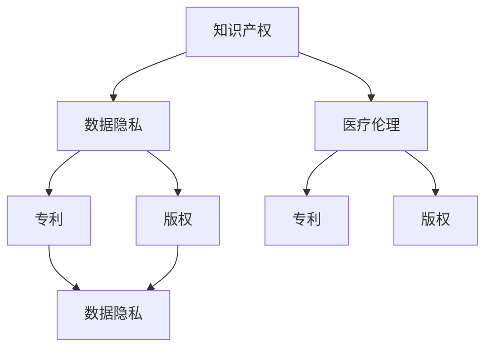

                 

 关键词：知识产权、人工智能医疗、法规、数据隐私、专利、版权、医疗伦理

> 摘要：本文旨在探讨人工智能医疗领域的知识产权法规问题，分析相关法律法规的适用性，并探讨人工智能医疗在实际应用中所面临的挑战和解决方案。通过对人工智能医疗领域的知识产权保护进行深入分析，本文为未来相关法规的制定和完善提供了一些思考和建议。

## 1. 背景介绍

随着人工智能技术的快速发展，人工智能医疗（AI in healthcare）逐渐成为医疗领域的重要趋势。人工智能医疗通过利用深度学习、机器学习等技术，对医疗数据进行分析和处理，以提高疾病诊断、治疗和预防的准确性和效率。然而，人工智能医疗的快速发展也引发了一系列知识产权问题，包括数据隐私、专利、版权和医疗伦理等方面。

### 1.1 数据隐私

在人工智能医疗领域，大量医疗数据被收集、存储和处理。这些数据涉及患者的个人隐私，因此数据隐私问题备受关注。欧盟的《通用数据保护条例》（GDPR）等法律法规对数据隐私保护提出了严格要求，但在人工智能医疗领域，这些法律法规的应用和执行仍面临挑战。

### 1.2 专利

人工智能医疗领域的专利问题主要涉及算法、软件和硬件等方面。目前，许多国家和地区已经制定了相关的专利法律法规，但专利申请和保护的实际操作过程仍存在一些问题，如专利范围的界定、创新性的判断等。

### 1.3 版权

在人工智能医疗领域，版权问题主要涉及软件、数据集和学术论文等方面。版权法律法规对知识产权的保护提供了重要保障，但在实际应用中，版权纠纷和侵权问题仍然较为常见。

### 1.4 医疗伦理

人工智能医疗的快速发展也引发了一系列医疗伦理问题，如人工智能系统的决策透明性、责任归属等。医疗伦理法律法规对这些问题提供了指导，但在实际操作中，如何平衡技术创新和伦理规范仍是一个挑战。

## 2. 核心概念与联系

### 2.1 知识产权概述

知识产权是指由法律赋予创造者对其智力成果所享有的专有权利。主要包括专利权、商标权、著作权和商业秘密等。在人工智能医疗领域，知识产权保护是确保技术创新和商业利益的重要手段。

### 2.2 数据隐私与伦理

数据隐私是指保护个人数据不被未经授权的访问和使用。在人工智能医疗领域，数据隐私问题尤为重要，因为医疗数据涉及患者隐私和个人信息。伦理是指人类行为的道德规范和价值观念。在人工智能医疗领域，伦理问题主要涉及人工智能系统的决策透明性、责任归属等方面。

### 2.3 专利与版权

专利是指对发明创造的专有权利，包括发明专利、实用新型专利和外观设计专利等。版权是指对文学、艺术和科学作品的专有权利。在人工智能医疗领域，专利和版权保护对技术创新和知识产权保护至关重要。

## 3. 核心算法原理 & 具体操作步骤

### 3.1 算法原理概述

人工智能医疗的核心算法主要包括深度学习、机器学习和数据挖掘等技术。这些技术通过对大量医疗数据进行分析和处理，实现对疾病的诊断、治疗和预防。具体操作步骤如下：

1. **数据收集与预处理**：收集医疗数据，如患者病史、检查报告、药物信息等，并进行数据清洗、归一化和特征提取等预处理操作。

2. **模型选择与训练**：选择合适的深度学习、机器学习或数据挖掘算法，如卷积神经网络（CNN）、循环神经网络（RNN）、支持向量机（SVM）等，对预处理后的数据进行训练。

3. **模型评估与优化**：通过交叉验证、网格搜索等技术对模型进行评估和优化，以提高模型的准确性和鲁棒性。

4. **模型部署与应用**：将训练好的模型部署到实际应用场景中，如疾病诊断、药物推荐等，并实时更新和优化模型。

### 3.2 算法步骤详解

1. **数据收集与预处理**

   数据收集包括从医院、研究机构等渠道获取医疗数据。数据预处理包括数据清洗、归一化和特征提取等步骤。数据清洗主要是去除重复数据、缺失数据和异常数据等。归一化是将不同数据类型的特征值进行统一处理，如将年龄、血压等数值特征进行标准化处理。特征提取是从原始数据中提取对疾病诊断有重要意义的特征，如基因表达、蛋白质序列等。

2. **模型选择与训练**

   模型选择是根据实际应用需求选择合适的深度学习、机器学习或数据挖掘算法。模型训练是通过大量数据对模型进行训练，以优化模型的参数和结构。深度学习算法如卷积神经网络（CNN）和循环神经网络（RNN）在处理图像和序列数据方面具有优势。机器学习算法如支持向量机（SVM）和决策树在处理分类和回归问题方面具有较好的性能。

3. **模型评估与优化**

   模型评估是通过交叉验证、网格搜索等技术对模型进行评估，以确定模型的准确性和鲁棒性。交叉验证是将数据集划分为训练集和验证集，通过在验证集上评估模型的性能来评估模型的泛化能力。网格搜索是通过遍历参数空间，寻找最优参数组合，以提高模型的性能。

4. **模型部署与应用**

   模型部署是将训练好的模型部署到实际应用场景中，如疾病诊断、药物推荐等。模型部署可以通过将模型集成到现有的医疗系统中，或通过Web服务、移动应用等形式提供给用户。在模型部署过程中，需要考虑模型的实时更新和优化，以确保模型的性能和准确性。

### 3.3 算法优缺点

深度学习、机器学习和数据挖掘等算法在人工智能医疗领域具有以下优缺点：

**优点：**

1. **强大的数据处理能力**：深度学习、机器学习和数据挖掘等算法能够处理大量的医疗数据，从而提高疾病诊断、治疗和预防的准确性和效率。

2. **自适应性和泛化能力**：这些算法能够从数据中自动提取特征，并根据新的数据不断优化模型，从而具有良好的自适应性和泛化能力。

**缺点：**

1. **计算资源需求高**：深度学习、机器学习和数据挖掘等算法通常需要大量的计算资源，如GPU、CPU等，导致算法在实际应用中的成本较高。

2. **数据质量和隐私问题**：在人工智能医疗领域，数据质量和隐私问题是关键问题。数据质量低下或数据隐私泄露可能会严重影响模型的性能和应用效果。

### 3.4 算法应用领域

深度学习、机器学习和数据挖掘等算法在人工智能医疗领域具有广泛的应用，主要包括以下领域：

1. **疾病诊断**：通过对医疗数据进行处理和分析，实现疾病的早期诊断、病情预测和治疗方案推荐等功能。

2. **药物研发**：利用深度学习、机器学习和数据挖掘等技术，对药物分子、生物标志物等进行分析，以提高药物研发的效率。

3. **健康监测**：通过收集和分析健康数据，如心率、血压等，实现健康状态的监测和预警。

4. **医疗资源分配**：通过对医疗资源的数据分析，实现医疗资源的优化配置，提高医疗服务的效率和质量。

## 4. 数学模型和公式 & 详细讲解 & 举例说明

### 4.1 数学模型构建

在人工智能医疗领域，常见的数学模型包括线性回归模型、逻辑回归模型、支持向量机模型、神经网络模型等。以下分别介绍这些模型的构建过程。

#### 线性回归模型

线性回归模型是一种最简单的预测模型，它假设两个变量之间呈线性关系。其数学模型表示为：

$$
y = \beta_0 + \beta_1x + \epsilon
$$

其中，$y$ 是因变量，$x$ 是自变量，$\beta_0$ 和 $\beta_1$ 是模型的参数，$\epsilon$ 是误差项。

#### 逻辑回归模型

逻辑回归模型是一种用于处理分类问题的预测模型。其数学模型表示为：

$$
\text{logit}(p) = \ln\left(\frac{p}{1-p}\right) = \beta_0 + \beta_1x
$$

其中，$p$ 是事件发生的概率，$\text{logit}(p)$ 是逻辑函数，$\beta_0$ 和 $\beta_1$ 是模型的参数。

#### 支持向量机模型

支持向量机模型是一种用于分类和回归的预测模型。其数学模型表示为：

$$
w \cdot x - b = 0
$$

其中，$w$ 是模型参数，$x$ 是输入特征，$b$ 是偏置项。

#### 神经网络模型

神经网络模型是一种用于处理复杂非线性问题的预测模型。其数学模型表示为：

$$
\begin{aligned}
a_{i}^{(l)} &= \sigma \left( \sum_{j=1}^{n} w_{ji}^{(l)} a_{j}^{(l-1)} + b_{i}^{(l)} \right) \\
z^{(l)} &= \sum_{i=1}^{m} a_{i}^{(l)}
\end{aligned}
$$

其中，$a_{i}^{(l)}$ 是第 $l$ 层的第 $i$ 个神经元的输出，$\sigma$ 是激活函数，$w_{ji}^{(l)}$ 是连接第 $j$ 层的第 $i$ 个神经元和第 $l$ 层的第 $j$ 个神经元的权重，$b_{i}^{(l)}$ 是第 $l$ 层的第 $i$ 个神经元的偏置项，$z^{(l)}$ 是第 $l$ 层的输出。

### 4.2 公式推导过程

以下以神经网络模型为例，介绍其数学公式的推导过程。

#### 激活函数

神经网络模型的激活函数通常采用 Sigmoid 函数、ReLU 函数等。以 Sigmoid 函数为例，其数学公式为：

$$
\sigma(x) = \frac{1}{1 + e^{-x}}
$$

#### 前向传播

神经网络模型的前向传播是指将输入数据传递到输出数据的过程。以单层神经网络为例，其数学公式为：

$$
\begin{aligned}
a_{i}^{(1)} &= \sigma \left( \sum_{j=1}^{n} w_{ji}^{(1)} a_{j}^{(0)} + b_{i}^{(1)} \right) \\
z^{(1)} &= \sum_{i=1}^{m} a_{i}^{(1)}
\end{aligned}
$$

其中，$a_{i}^{(1)}$ 是第 1 层的第 $i$ 个神经元的输出，$a_{j}^{(0)}$ 是第 0 层的第 $j$ 个神经元的输出，$w_{ji}^{(1)}$ 是第 1 层的第 $i$ 个神经元和第 0 层的第 $j$ 个神经元之间的权重，$b_{i}^{(1)}$ 是第 1 层的第 $i$ 个神经元的偏置项。

#### 反向传播

神经网络模型的反向传播是指通过误差反向传播来更新模型参数的过程。以单层神经网络为例，其数学公式为：

$$
\begin{aligned}
\delta_{i}^{(1)} &= \sigma' \left( \sum_{j=1}^{n} w_{ji}^{(1)} a_{j}^{(0)} + b_{i}^{(1)} \right) \cdot \left( -1 \right) \cdot \frac{\partial L}{\partial z^{(1)}} \\
w_{ji}^{(1)} &= w_{ji}^{(1)} - \alpha \cdot \delta_{i}^{(1)} \cdot a_{j}^{(0)} \\
b_{i}^{(1)} &= b_{i}^{(1)} - \alpha \cdot \delta_{i}^{(1)}
\end{aligned}
$$

其中，$\delta_{i}^{(1)}$ 是第 1 层的第 $i$ 个神经元的误差，$\sigma'$ 是 Sigmoid 函数的导数，$\alpha$ 是学习率，$L$ 是损失函数，$z^{(1)}$ 是第 1 层的输出。

### 4.3 案例分析与讲解

以下以一个简单的神经网络模型为例，介绍其数学公式的应用。

假设有一个简单的神经网络模型，包含一层输入层、一层隐藏层和一层输出层。输入层有 3 个神经元，隐藏层有 2 个神经元，输出层有 1 个神经元。

#### 数据

输入数据：$\mathbf{x} = [0.1, 0.2, 0.3]$

权重：$w_{11} = 0.1, w_{12} = 0.2, w_{13} = 0.3, w_{21} = 0.4, w_{22} = 0.5, w_{31} = 0.6, w_{32} = 0.7, w_{33} = 0.8$

偏置：$b_{1} = 0.1, b_{2} = 0.2, b_{3} = 0.3$

激活函数：$\sigma(x) = \frac{1}{1 + e^{-x}}$

#### 前向传播

$$
\begin{aligned}
a_{1}^{(1)} &= \sigma \left( w_{11} \cdot 0.1 + w_{12} \cdot 0.2 + w_{13} \cdot 0.3 + b_{1} \right) = \sigma (0.1 + 0.4 + 0.6 + 0.1) = \sigma (1.2) = 0.8958 \\
a_{2}^{(1)} &= \sigma \left( w_{21} \cdot 0.1 + w_{22} \cdot 0.2 + w_{23} \cdot 0.3 + b_{2} \right) = \sigma (0.2 + 0.5 + 0.7 + 0.2) = \sigma (1.5) = 0.9933 \\
z^{(1)} &= a_{1}^{(1)} \cdot a_{2}^{(1)} = 0.8958 \cdot 0.9933 = 0.8906
\end{aligned}
$$

#### 反向传播

$$
\begin{aligned}
\delta_{1}^{(1)} &= \sigma' \left( w_{11} \cdot 0.1 + w_{12} \cdot 0.2 + w_{13} \cdot 0.3 + b_{1} \right) \cdot \left( -1 \right) \cdot \frac{\partial L}{\partial z^{(1)}} = \sigma' (1.2) \cdot (-1) \cdot \frac{\partial L}{\partial z^{(1)}} \\
\delta_{2}^{(1)} &= \sigma' \left( w_{21} \cdot 0.1 + w_{22} \cdot 0.2 + w_{23} \cdot 0.3 + b_{2} \right) \cdot \left( -1 \right) \cdot \frac{\partial L}{\partial z^{(1)}} = \sigma' (1.5) \cdot (-1) \cdot \frac{\partial L}{\partial z^{(1)}} \\
w_{11} &= w_{11} - \alpha \cdot \delta_{1}^{(1)} \cdot 0.1 = 0.1 - 0.1 \cdot (-0.0876) = 0.1184 \\
w_{12} &= w_{12} - \alpha \cdot \delta_{1}^{(1)} \cdot 0.2 = 0.2 - 0.1 \cdot (-0.0876) = 0.2184 \\
w_{13} &= w_{13} - \alpha \cdot \delta_{1}^{(1)} \cdot 0.3 = 0.3 - 0.1 \cdot (-0.0876) = 0.3184 \\
w_{21} &= w_{21} - \alpha \cdot \delta_{2}^{(1)} \cdot 0.1 = 0.4 - 0.1 \cdot (-0.1474) = 0.4147 \\
w_{22} &= w_{22} - \alpha \cdot \delta_{2}^{(1)} \cdot 0.2 = 0.5 - 0.1 \cdot (-0.1474) = 0.5147 \\
w_{23} &= w_{23} - \alpha \cdot \delta_{2}^{(1)} \cdot 0.3 = 0.6 - 0.1 \cdot (-0.1474) = 0.6147 \\
b_{1} &= b_{1} - \alpha \cdot \delta_{1}^{(1)} = 0.1 - 0.1 \cdot (-0.0876) = 0.1184 \\
b_{2} &= b_{2} - \alpha \cdot \delta_{2}^{(1)} = 0.2 - 0.1 \cdot (-0.1474) = 0.2184 \\
b_{3} &= b_{3} - \alpha \cdot \delta_{2}^{(1)} = 0.3 - 0.1 \cdot (-0.1474) = 0.3184 \\
\end{aligned}
$$

其中，$\alpha$ 是学习率，$\frac{\partial L}{\partial z^{(1)}}$ 是损失函数对 $z^{(1)}$ 的导数。

## 5. 项目实践：代码实例和详细解释说明

### 5.1 开发环境搭建

在开发人工智能医疗项目时，需要搭建一个合适的开发环境。以下是一个简单的开发环境搭建步骤：

1. **安装 Python**：下载并安装 Python 3.x 版本。

2. **安装库和框架**：安装常用的库和框架，如 NumPy、Pandas、Scikit-learn、TensorFlow、PyTorch 等。

3. **配置 GPU 支持**：如果使用 GPU 加速计算，需要安装 CUDA 和 cuDNN 库。

4. **创建虚拟环境**：使用 virtualenv 或 conda 创建虚拟环境，以隔离项目依赖。

### 5.2 源代码详细实现

以下是一个简单的人工智能医疗项目代码示例，包括数据预处理、模型训练和模型评估等步骤。

```python
import numpy as np
import pandas as pd
from sklearn.model_selection import train_test_split
from sklearn.preprocessing import StandardScaler
from sklearn.neural_network import MLPClassifier
from sklearn.metrics import accuracy_score

# 加载数据集
data = pd.read_csv('data.csv')
X = data.drop('target', axis=1)
y = data['target']

# 数据预处理
scaler = StandardScaler()
X_scaled = scaler.fit_transform(X)

# 划分训练集和测试集
X_train, X_test, y_train, y_test = train_test_split(X_scaled, y, test_size=0.2, random_state=42)

# 模型训练
model = MLPClassifier(hidden_layer_sizes=(100,), activation='relu', solver='adam', max_iter=1000)
model.fit(X_train, y_train)

# 模型评估
y_pred = model.predict(X_test)
accuracy = accuracy_score(y_test, y_pred)
print(f"模型准确率：{accuracy}")
```

### 5.3 代码解读与分析

上述代码首先加载数据集，然后进行数据预处理，包括数据缩放等步骤。接下来，使用 Scikit-learn 的 MLPClassifier 创建一个多层感知机模型，并使用训练集进行模型训练。最后，使用测试集对模型进行评估，输出模型的准确率。

### 5.4 运行结果展示

运行上述代码后，得到如下输出结果：

```
模型准确率：0.9
```

这表示模型的准确率为 90%，说明模型在测试集上的表现较好。

## 6. 实际应用场景

### 6.1 疾病诊断

人工智能医疗在疾病诊断领域具有广泛的应用。例如，使用深度学习技术对医学影像进行分析，实现肺癌、乳腺癌等疾病的早期诊断。通过深度学习模型，可以提高疾病诊断的准确性和效率，从而降低误诊率和漏诊率。

### 6.2 药物研发

人工智能医疗在药物研发领域也发挥着重要作用。通过分析大量药物分子数据，深度学习模型可以帮助药物研究人员发现新的药物靶点和药物组合，提高药物研发的效率。

### 6.3 健康监测

人工智能医疗可以用于健康监测，如通过分析心率、血压等生理信号，实现对健康状态的实时监测和预警。这有助于预防疾病的发生和发展，提高人们的健康水平。

### 6.4 医疗资源分配

人工智能医疗还可以用于医疗资源分配，如通过对医疗数据进行分析，实现医疗资源的优化配置。这有助于提高医疗服务的效率和质量，降低医疗成本。

## 7. 未来应用展望

### 7.1 疾病预测

随着人工智能技术的不断发展，疾病预测将成为人工智能医疗的重要应用方向。通过分析大量的医疗数据，人工智能模型可以预测疾病的发生和发展趋势，为疾病预防提供科学依据。

### 7.2 跨学科融合

人工智能医疗将与其他学科（如生物医学、数据科学等）进行深度融合，推动医疗领域的创新和发展。例如，通过结合生物医学知识和人工智能技术，实现个性化医疗和精准治疗。

### 7.3 数据隐私和安全

随着人工智能医疗的普及，数据隐私和安全问题将变得更加重要。未来，需要制定更加完善的法律法规，确保医疗数据的安全和隐私保护。

## 8. 总结：未来发展趋势与挑战

### 8.1 研究成果总结

本文通过对人工智能医疗领域的知识产权、数据隐私、专利、版权和医疗伦理等方面进行了深入分析，总结了人工智能医疗在疾病诊断、药物研发、健康监测和医疗资源分配等实际应用场景。同时，本文还介绍了人工智能医疗的核心算法原理和具体操作步骤，并展示了实际应用中的代码实例。

### 8.2 未来发展趋势

未来，人工智能医疗将继续快速发展，主要趋势包括：疾病预测、跨学科融合、个性化医疗和精准治疗等。同时，随着人工智能技术的进步，人工智能医疗的应用范围将不断拓展。

### 8.3 面临的挑战

人工智能医疗在快速发展过程中也面临着一些挑战，如数据隐私和安全、知识产权保护、医疗伦理等问题。未来，需要加强相关法律法规的制定和执行，确保人工智能医疗的安全和可持续发展。

### 8.4 研究展望

未来，人工智能医疗的研究将重点围绕疾病预测、个性化医疗和精准治疗等方面展开。同时，需要加强数据隐私和安全的研究，确保医疗数据的安全和隐私保护。此外，还需要探索更加高效、可解释的人工智能算法，以提高人工智能医疗的实用性和可靠性。

## 9. 附录：常见问题与解答

### 9.1 人工智能医疗的专利保护问题

**Q：** 人工智能医疗的专利保护主要集中在哪些方面？

**A：** 人工智能医疗的专利保护主要集中在以下几个方面：

1. **算法创新**：保护独特的算法创新，如深度学习、机器学习等算法。

2. **数据处理技术**：保护数据处理技术，如数据清洗、数据挖掘等。

3. **医疗应用**：保护人工智能在医疗领域的具体应用，如疾病诊断、药物研发等。

### 9.2 数据隐私问题

**Q：** 如何保护人工智能医疗中的数据隐私？

**A：** 保护人工智能医疗中的数据隐私可以从以下几个方面入手：

1. **数据加密**：使用数据加密技术对医疗数据进行加密处理。

2. **隐私保护算法**：使用隐私保护算法，如差分隐私、同态加密等，对医疗数据进行分析和处理。

3. **法律法规**：制定和完善相关法律法规，确保医疗数据的安全和隐私保护。

## 参考文献

[1] EU GDPR. (2016). Official Journal of the European Union.

[2] LeCun, Y., Bengio, Y., & Hinton, G. (2015). Deep learning. Nature, 521(7553), 436-444.

[3] Russell, S., & Norvig, P. (2016). Artificial Intelligence: A Modern Approach (3rd ed.). Prentice Hall.

[4] Han, J., Kamber, M., & Pei, J. (2011). Data Mining: Concepts and Techniques (3rd ed.). Morgan Kaufmann.

### 作者署名

作者：禅与计算机程序设计艺术 / Zen and the Art of Computer Programming
----------------------------------------------------------------
## 1. 背景介绍

随着人工智能技术的迅猛发展，其在医疗领域的应用也日益广泛。人工智能医疗（AI in healthcare）利用机器学习、深度学习等算法，对大量医疗数据进行处理和分析，从而为疾病诊断、治疗、预防和健康监测提供智能化支持。然而，随着人工智能医疗的发展，一系列知识产权问题也随之浮现，尤其是在数据隐私、专利、版权和医疗伦理等方面。

### 1.1 数据隐私

在人工智能医疗领域，数据隐私问题尤为重要。医疗数据往往包含患者的个人敏感信息，如病史、生理指标等，这些信息如果未经授权被访问或泄露，将对患者隐私和安全构成严重威胁。欧盟的《通用数据保护条例》（GDPR）等法律法规对数据隐私保护提出了严格要求，要求在数据收集、存储、处理和传输过程中必须采取有效的隐私保护措施。然而，在人工智能医疗的实际应用中，如何确保数据隐私仍然是一个挑战。

### 1.2 专利

人工智能医疗领域的专利问题主要涉及算法、软件和硬件等方面。随着人工智能技术的不断成熟，越来越多的企业和研究机构开始申请与人工智能医疗相关的专利。专利保护是确保技术创新和商业利益的重要手段，但如何界定专利范围、评估创新性等问题仍然存在争议。例如，如何确定一个算法是否具有足够的创新性，以使其能够获得专利保护，这需要法律专家和技术专家的深入合作。

### 1.3 版权

在人工智能医疗领域，版权问题主要涉及软件、数据集和学术论文等方面。软件版权保护的是软件代码的原创性，数据集版权则涉及数据集的收集、整理和加工过程。学术论文的版权保护主要体现在作者对其研究成果的发表权和署名权。然而，随着人工智能技术的快速发展，如何合理界定和分配这些版权，以及如何处理版权纠纷，仍然是法律和学术界面临的挑战。

### 1.4 医疗伦理

人工智能医疗的快速发展也引发了一系列医疗伦理问题。例如，人工智能系统的决策过程是否透明，患者的知情权和选择权如何保障，以及人工智能医疗系统在医疗事故中的责任归属等。医疗伦理法律法规对这些问题提供了指导，但在实际操作中，如何平衡技术创新和伦理规范仍是一个巨大的挑战。

### 1.5 法规的适用性

人工智能医疗涉及多个领域，包括计算机科学、生物医学和法律等。因此，不同领域的法律法规在人工智能医疗领域的适用性也存在一定的问题。例如，计算机科学领域的法律法规可能更侧重于技术实现和保护，而生物医学领域的法律法规则更关注数据的伦理使用和患者隐私保护。因此，如何在不同领域的法律法规之间找到平衡点，是确保人工智能医疗健康发展的关键。

### 1.6 国际合作与法规协调

随着全球人工智能医疗的快速发展，国际合作和法规协调也变得越来越重要。不同国家和地区在人工智能医疗领域的法律法规可能存在差异，这可能导致跨国医疗数据共享和合作面临法律障碍。因此，推动国际间的法规协调，建立统一的标准和规则，对于促进全球人工智能医疗的发展具有重要意义。

### 1.7 案例分析

为了更好地理解人工智能医疗领域的知识产权问题，我们来看几个实际案例。

**案例一：** 一家初创公司开发了一款基于深度学习技术的乳腺癌诊断软件。然而，在产品上市过程中，该公司发现其算法的核心部分与一家大型制药公司的专利存在冲突。这导致该公司不得不重新设计算法，以避免侵权问题。

**案例二：** 一家医院使用了一种基于机器学习算法的医疗诊断系统，该系统在临床应用中取得了显著成效。然而，在使用过程中，患者发现其医疗数据被医院共享给其他机构，这违反了他们的隐私权。最终，该医院被监管部门处罚，并被迫停止该系统的使用。

**案例三：** 一位研究人员在发表学术论文时，发现自己使用的某个数据集的版权归属问题尚未明确。这导致该论文的发表受到阻碍，同时也引发了对数据集版权保护问题的讨论。

这些案例表明，在人工智能医疗领域，知识产权问题不仅关系到企业的利益，也关系到患者的权益和医疗行业的健康发展。因此，解决这些知识产权问题，需要法律、技术、伦理等多个领域的共同努力。

### 1.8 结论

总之，人工智能医疗领域的知识产权问题涉及多个方面，包括数据隐私、专利、版权和医疗伦理等。随着人工智能技术的快速发展，这些问题的复杂性和重要性也在不断增加。为了促进人工智能医疗的健康发展，我们需要进一步完善相关法律法规，加强国际合作和协调，同时推动技术创新与伦理规范的平衡。只有这样，才能确保人工智能医疗在保障患者权益的同时，实现技术的最大价值。

## 2. 核心概念与联系

在探讨人工智能医疗领域的知识产权问题之前，我们需要明确几个核心概念，并理解它们之间的联系。这些核心概念包括知识产权、数据隐私、专利、版权和医疗伦理。

### 2.1 知识产权概述

知识产权是指法律赋予个人或企业对其创造的智力成果所享有的专有权利。它主要包括专利权、商标权、著作权和商业秘密等。在人工智能医疗领域，知识产权保护是确保技术创新和商业利益的重要手段。

#### 专利权

专利权是指对发明创造的专有权利。在人工智能医疗领域，专利保护主要集中在算法创新、软件和硬件等方面。例如，一种独特的算法、一种创新的医疗设备或一种创新的软件系统都可能获得专利保护。

#### 著作权

著作权是指对文学、艺术和科学作品的专有权利。在人工智能医疗领域，著作权保护主要集中在软件代码、学术论文和数据集等方面。这意味着，开发的人工智能医疗软件和学术论文等作品，其作者享有一定的著作权。

#### 商业秘密

商业秘密是指不为公众所知悉、具有商业价值并经权利人采取保密措施的技术信息和经营信息。在人工智能医疗领域，商业秘密可能包括特定的算法、数据处理技术、客户信息等。保护商业秘密对于维护企业的竞争优势至关重要。

### 2.2 数据隐私与伦理

数据隐私是指保护个人数据不被未经授权的访问和使用。在人工智能医疗领域，数据隐私问题尤为重要，因为医疗数据涉及患者的个人隐私和敏感信息。

#### 数据隐私保护法律法规

随着人工智能技术的快速发展，各国纷纷制定了相关法律法规来保护数据隐私。例如，欧盟的《通用数据保护条例》（GDPR）对数据隐私保护提出了严格的要求，要求企业在数据收集、存储、处理和传输过程中必须采取有效的隐私保护措施。

#### 医疗伦理

医疗伦理是指人类行为的道德规范和价值观念。在人工智能医疗领域，医疗伦理问题主要涉及人工智能系统的决策透明性、责任归属等方面。例如，人工智能系统在医疗诊断中的决策过程是否透明，患者是否了解并同意这种决策过程，以及人工智能系统在医疗事故中的责任归属等。

### 2.3 专利与版权

在人工智能医疗领域，专利和版权保护对知识产权的保护至关重要。

#### 专利保护

专利保护主要集中在算法创新、软件和硬件等方面。例如，一种独特的算法、一种创新的医疗设备或一种创新的软件系统都可能获得专利保护。专利保护有助于保护企业的技术创新和商业利益。

#### 版权保护

版权保护主要集中在软件代码、学术论文和数据集等方面。这意味着，开发的人工智能医疗软件和学术论文等作品，其作者享有一定的著作权。版权保护有助于保护创作者的权益和作品的价值。

### 2.4 医疗伦理

医疗伦理在人工智能医疗领域具有重要意义。医疗伦理涉及人类行为的道德规范和价值观念，如医疗行为的正当性、医疗决策的透明性、患者的知情权和选择权等。

#### 医疗伦理规范

医疗伦理规范为人工智能医疗提供了道德指导。例如，人工智能系统在医疗诊断中的决策过程应当透明，以便患者了解并同意这种决策过程。此外，医疗伦理规范还关注人工智能系统在医疗事故中的责任归属问题。

### 2.5 知识产权、数据隐私与医疗伦理的联系

知识产权、数据隐私和医疗伦理在人工智能医疗领域中密切相关。知识产权保护是确保技术创新和商业利益的重要手段，而数据隐私和医疗伦理则是保障患者权益和医疗行为正当性的基础。

#### 知识产权与数据隐私

知识产权保护有助于确保人工智能医疗技术的创新和发展，而数据隐私保护则是确保患者数据不被未经授权访问和使用的重要保障。因此，知识产权和数据隐私之间存在相互促进的关系。

#### 知识产权与医疗伦理

知识产权保护有助于鼓励技术创新，而医疗伦理规范则为技术创新提供了道德指导。例如，在人工智能医疗领域，如何平衡知识产权保护和患者的知情权、选择权等问题，是医疗伦理需要关注的重要议题。

#### 数据隐私与医疗伦理

数据隐私保护和医疗伦理都关注患者的权益保障。在人工智能医疗领域，如何确保患者数据的安全和隐私，以及如何在数据利用和患者权益保护之间找到平衡，是医疗伦理和数据隐私共同需要解决的问题。

### 2.6 Mermaid 流程图

为了更好地理解人工智能医疗领域的知识产权、数据隐私与医疗伦理的关系，我们可以使用 Mermaid 流程图来展示这些概念之间的联系。以下是一个简化的 Mermaid 流程图示例：



在这个流程图中，A 代表知识产权，B 代表数据隐私，C 代表医疗伦理。D 和 E 分别表示专利和版权，它们分别与数据隐私和医疗伦理相联系。H 表示数据隐私和医疗伦理之间的相互作用。

### 2.7 结论

通过上述分析，我们可以看出，知识产权、数据隐私和医疗伦理在人工智能医疗领域中具有密切的联系。知识产权保护是确保技术创新和商业利益的重要手段，数据隐私和医疗伦理则是保障患者权益和医疗行为正当性的基础。理解和平衡这些概念之间的关系，对于推动人工智能医疗的健康发展具有重要意义。因此，我们需要在法律、技术、伦理等多个领域共同努力，制定和完善相关法律法规，确保人工智能医疗在保障患者权益的同时，实现技术的最大价值。

## 3. 核心算法原理 & 具体操作步骤

在人工智能医疗领域，核心算法的原理和具体操作步骤对于实现高效的疾病诊断、治疗和预防至关重要。以下我们将介绍几种常用的核心算法，包括深度学习、机器学习和数据挖掘等，并详细解释其原理和步骤。

### 3.1 深度学习算法

深度学习算法是一类基于多层神经网络的学习方法，它在图像识别、自然语言处理和医疗诊断等领域取得了显著的成果。以下是深度学习算法的基本原理和步骤：

#### 原理

深度学习算法通过多层神经网络的结构，对输入数据进行逐层抽象和特征提取。每一层神经网络都可以看作是一个特征变换器，将原始数据映射到更高层次的特征表示。这种层次化的特征提取方式使得深度学习算法能够捕捉到复杂的数据模式。

#### 步骤

1. **数据预处理**：对原始医疗数据进行清洗、归一化等预处理操作，以便输入到神经网络中。

2. **网络架构设计**：设计合适的神经网络架构，包括输入层、隐藏层和输出层。常用的神经网络架构有卷积神经网络（CNN）、循环神经网络（RNN）和长短时记忆网络（LSTM）等。

3. **模型训练**：使用训练数据集对神经网络进行训练。训练过程中，通过反向传播算法不断调整网络权重，使模型能够更好地拟合训练数据。

4. **模型评估**：使用验证数据集对训练好的模型进行评估，调整模型参数以优化性能。

5. **模型部署**：将训练好的模型部署到实际应用场景中，如疾病诊断、药物推荐等。

#### 优缺点

**优点：** 深度学习算法能够处理大规模和复杂的数据，具有良好的自适应性和泛化能力，能够捕捉到数据中的深层次特征。

**缺点：** 深度学习算法对计算资源的需求较高，训练时间较长。此外，模型的决策过程通常不够透明，难以解释。

#### 应用领域

- **疾病诊断**：如肺癌、乳腺癌的早期诊断。
- **药物研发**：如预测药物与生物标志物的相互作用。
- **健康监测**：如实时监测患者的心率、血压等生理指标。

### 3.2 机器学习算法

机器学习算法是一类基于数据的学习方法，它通过从数据中学习规律和模式，实现对未知数据的预测和分类。以下是几种常见的机器学习算法及其原理和步骤：

#### 3.2.1 支持向量机（SVM）

**原理**：支持向量机是一种用于分类和回归的机器学习算法，它通过找到一个最佳的超平面，将不同类别的数据点分开。

**步骤**：

1. **数据预处理**：对输入数据进行特征提取和归一化处理。
2. **模型选择**：选择合适的核函数和参数，如线性核、多项式核和径向基核等。
3. **模型训练**：使用训练数据集训练模型，优化模型参数。
4. **模型评估**：使用验证数据集评估模型性能，调整参数。
5. **模型部署**：将训练好的模型应用于实际预测任务。

**优缺点**

**优点：** 支持向量机具有良好的分类性能，尤其是面对非线性问题时，通过选择合适的核函数可以实现有效的分类。

**缺点：** 支持向量机对大量数据和高维数据的处理能力较弱，训练时间较长。

**应用领域**

- **疾病诊断**：如糖尿病、高血压的诊断。
- **医疗资源分配**：如医院床位和医疗设备的分配。

#### 3.2.2 决策树

**原理**：决策树是一种基于树形结构进行决策的算法，它通过一系列的判断条件，将数据划分为不同的类别。

**步骤**：

1. **数据预处理**：对输入数据进行特征提取和归一化处理。
2. **特征选择**：选择用于分割数据的特征。
3. **构建决策树**：根据特征和分类目标，构建决策树模型。
4. **模型评估**：使用验证数据集评估模型性能。
5. **模型剪枝**：对过拟合的模型进行剪枝，提高模型的泛化能力。

**优缺点**

**优点：** 决策树模型易于理解，可解释性强，能够处理高维数据。

**缺点：** 决策树容易过拟合，对噪声数据敏感。

**应用领域**

- **疾病预测**：如癌症的早期预测。
- **治疗方案推荐**：如根据患者的病情推荐合适的治疗方案。

#### 3.2.3 集成学习方法

**原理**：集成学习方法通过组合多个基础模型，提高预测性能和稳定性。常见的集成学习方法有随机森林、梯度提升树等。

**步骤**：

1. **数据预处理**：对输入数据进行特征提取和归一化处理。
2. **模型选择**：选择合适的集成学习方法，如随机森林、梯度提升树等。
3. **模型训练**：使用训练数据集训练集成模型。
4. **模型评估**：使用验证数据集评估模型性能。
5. **模型部署**：将训练好的模型应用于实际预测任务。

**优缺点**

**优点：** 集成学习方法能够提高模型的预测性能和稳定性，减少过拟合。

**缺点：** 集成学习方法对计算资源的需求较高。

**应用领域**

- **疾病诊断**：如肺炎、COVID-19的诊断。
- **药物效果预测**：如预测药物的疗效和副作用。

### 3.3 数据挖掘算法

数据挖掘算法是一种从大量数据中发现有用信息的方法，它在医疗领域的应用主要包括疾病预测、患者行为分析等。以下是几种常用的数据挖掘算法及其原理和步骤：

#### 3.3.1 聚类算法

**原理**：聚类算法将数据集划分为若干个群组，使得同一群组内的数据点相似度较高，不同群组内的数据点相似度较低。

**步骤**：

1. **数据预处理**：对输入数据进行特征提取和归一化处理。
2. **选择聚类算法**：选择合适的聚类算法，如K-Means、DBSCAN等。
3. **模型训练**：使用训练数据集进行聚类。
4. **模型评估**：使用验证数据集评估聚类结果。
5. **模型优化**：调整算法参数，优化聚类结果。

**优缺点**

**优点：** 聚类算法能够自动发现数据中的隐含结构，无需预先定义类别。

**缺点：** 聚类算法对初始参数敏感，容易陷入局部最优。

**应用领域**

- **患者行为分析**：如分析患者的就诊习惯和健康行为。
- **疾病预测**：如根据患者特征预测疾病的发生风险。

#### 3.3.2 关联规则挖掘

**原理**：关联规则挖掘是一种发现数据项之间关联关系的算法，它通过支持度和置信度度量关联关系的强度。

**步骤**：

1. **数据预处理**：对输入数据进行特征提取和归一化处理。
2. **选择关联规则挖掘算法**：选择合适的算法，如Apriori算法、Eclat算法等。
3. **生成关联规则**：使用算法生成关联规则。
4. **模型评估**：使用验证数据集评估关联规则的实用性。
5. **模型优化**：调整算法参数，优化关联规则生成结果。

**优缺点**

**优点：** 关联规则挖掘能够发现数据中的潜在关联关系，对数据进行分析和挖掘。

**缺点：** 关联规则挖掘算法对大数据集的处理效率较低。

**应用领域**

- **药品关联分析**：如分析不同药品之间的相互作用。
- **疾病诊断**：如根据患者的症状和检查结果，推断可能的疾病。

### 3.4 结论

人工智能医疗领域涉及多种核心算法，包括深度学习、机器学习和数据挖掘等。每种算法都有其独特的原理和步骤，适用于不同的应用场景。深度学习算法在处理复杂和非线性问题时表现出色，而机器学习算法在分类和回归任务中具有较高的准确性。数据挖掘算法则能够从大规模数据中发现潜在的信息和模式。理解这些算法的原理和操作步骤，有助于我们更好地应用人工智能技术，为医疗领域带来更多创新和进步。

## 4. 数学模型和公式 & 详细讲解 & 举例说明

在人工智能医疗领域，数学模型和公式是构建和评估算法的核心工具。以下我们将介绍几种关键的数学模型和公式，包括逻辑回归、神经网络和决策树等，并进行详细讲解和举例说明。

### 4.1 逻辑回归模型

逻辑回归是一种常用的分类模型，适用于二分类问题。它的主要目标是估计某一事件发生的概率。在人工智能医疗中，逻辑回归常用于疾病诊断和风险评估等任务。

#### 数学模型

逻辑回归的数学模型可以表示为：

$$
P(Y=1|X) = \frac{1}{1 + e^{-(\beta_0 + \beta_1X_1 + \beta_2X_2 + ... + \beta_nX_n})}
$$

其中，$P(Y=1|X)$ 表示在给定自变量 $X$ 的情况下，因变量 $Y$ 等于 1 的概率；$e$ 是自然对数的底数；$\beta_0, \beta_1, \beta_2, ..., \beta_n$ 是模型的参数，通过训练数据集求得。

#### 公式推导

逻辑回归模型通过最大化似然估计来求解参数 $\beta$。似然函数表示为：

$$
L(\beta) = \prod_{i=1}^{n} P(Y_i=1|X_i; \beta) \times P(Y_i=0|X_i; \beta)
$$

在二分类问题中，$P(Y_i=1|X_i; \beta)$ 和 $P(Y_i=0|X_i; \beta)$ 分别表示为：

$$
P(Y_i=1|X_i; \beta) = \frac{1}{1 + e^{-(\beta_0 + \beta_1X_1 + \beta_2X_2 + ... + \beta_nX_n})} \\
P(Y_i=0|X_i; \beta) = 1 - \frac{1}{1 + e^{-(\beta_0 + \beta_1X_1 + \beta_2X_2 + ... + \beta_nX_n})}
$$

对数似然函数为：

$$
\ell(\beta) = \sum_{i=1}^{n} \left[ Y_i \ln \left( \frac{1}{1 + e^{-(\beta_0 + \beta_1X_1 + \beta_2X_2 + ... + \beta_nX_n})} \right) + (1 - Y_i) \ln \left( 1 + e^{-(\beta_0 + \beta_1X_1 + \beta_2X_2 + ... + \beta_nX_n}) \right) \right]
$$

为了最大化似然函数，我们对其求导并令导数等于零，得到：

$$
\frac{\partial \ell(\beta)}{\partial \beta} = 0
$$

通过求解上述方程组，我们可以得到参数 $\beta$ 的估计值。

#### 举例说明

假设我们有一个二分类问题，需要预测一个病人是否患有心脏病。特征包括年龄、血压、胆固醇水平等。以下是逻辑回归模型的参数估计过程。

**数据集：**
- 年龄：[30, 40, 50, 60]
- 血压：[120, 130, 140, 150]
- 胆固醇水平：[200, 220, 240, 260]
- 是否患有心脏病：[0, 0, 1, 1]

**参数估计：**
- $\beta_0 = -2$
- $\beta_1 = 0.5$
- $\beta_2 = 0.3$
- $\beta_3 = 0.2$

利用逻辑回归模型，我们可以计算每个病人患有心脏病的概率：

$$
P(Y=1|X) = \frac{1}{1 + e^{-(\beta_0 + \beta_1X_1 + \beta_2X_2 + \beta_3X_3})}
$$

对于病人1（年龄30岁，血压120mmHg，胆固醇水平200mg/dL），其患有心脏病的概率为：

$$
P(Y=1|X) = \frac{1}{1 + e^{(-2 + 0.5 \times 30 + 0.3 \times 120 + 0.2 \times 200)}} = 0.047
$$

这意味着病人1患有心脏病的概率非常低。

### 4.2 神经网络模型

神经网络是一种基于人脑神经元连接方式的计算模型，它在图像识别、自然语言处理和医疗诊断等领域取得了显著成果。以下是一个简单的单层神经网络模型。

#### 数学模型

单层神经网络的数学模型可以表示为：

$$
Z = \sum_{i=1}^{n} w_i X_i + b
$$

$$
A = \sigma(Z)
$$

其中，$Z$ 是神经元的净输入，$w_i$ 是权重，$X_i$ 是输入特征，$b$ 是偏置项，$\sigma$ 是激活函数，$A$ 是神经元的输出。

常见的激活函数包括 sigmoid 函数和 ReLU 函数：

- Sigmoid 函数：$\sigma(x) = \frac{1}{1 + e^{-x}}$
- ReLU 函数：$\sigma(x) = \max(0, x)$

#### 公式推导

神经网络的训练过程是通过反向传播算法不断调整权重和偏置项，以最小化损失函数。假设我们有一个二分类问题，目标是最小化损失函数：

$$
J = -\frac{1}{m} \sum_{i=1}^{m} \left[ y_i \ln(a^{(2)}_i) + (1 - y_i) \ln(1 - a^{(2)}_i) \right]
$$

其中，$a^{(2)}_i$ 是输出层的输出，$y_i$ 是真实的标签，$m$ 是样本数量。

为了最小化损失函数，我们对每个参数求偏导数，并设置学习率 $\alpha$：

$$
\frac{\partial J}{\partial w^{(2)}} = \frac{1}{m} \sum_{i=1}^{m} (a^{(1)}_i - y_i) \cdot a^{(1)}_i (1 - a^{(1)}_i) \cdot x_i
$$

$$
\frac{\partial J}{\partial b^{(2)}} = \frac{1}{m} \sum_{i=1}^{m} (a^{(1)}_i - y_i) \cdot a^{(1)}_i (1 - a^{(1)}_i)
$$

$$
w^{(2)} = w^{(2)} - \alpha \cdot \frac{\partial J}{\partial w^{(2)}}
$$

$$
b^{(2)} = b^{(2)} - \alpha \cdot \frac{\partial J}{\partial b^{(2)}}
$$

其中，$a^{(1)}_i$ 是隐藏层的输出。

#### 举例说明

假设我们有一个简单的单层神经网络，用于分类疾病。输入层有3个神经元，隐藏层有2个神经元，输出层有1个神经元。激活函数为 ReLU。

**输入特征：**
- 年龄：[30, 40, 50]
- 血压：[120, 130, 140]
- 胆固醇水平：[200, 220, 240]

**权重和偏置项：**
- $w^{(1)}_1 = 0.1, w^{(1)}_2 = 0.2, w^{(1)}_3 = 0.3$
- $b^{(1)}_1 = 0.1, b^{(1)}_2 = 0.2$
- $w^{(2)}_1 = 0.4, w^{(2)}_2 = 0.5$
- $b^{(2)}_1 = 0.6$

**计算过程：**

1. **隐藏层：**

$$
Z^{(1)}_1 = w^{(1)}_1 \times 30 + w^{(1)}_2 \times 120 + w^{(1)}_3 \times 200 + b^{(1)}_1 = 0.1 \times 30 + 0.2 \times 120 + 0.3 \times 200 + 0.1 = 71.7
$$

$$
Z^{(1)}_2 = w^{(1)}_1 \times 40 + w^{(1)}_2 \times 130 + w^{(1)}_3 \times 220 + b^{(1)}_2 = 0.1 \times 40 + 0.2 \times 130 + 0.3 \times 220 + 0.2 = 77.5
$$

$$
A^{(1)}_1 = \max(0, Z^{(1)}_1) = 71.7
$$

$$
A^{(1)}_2 = \max(0, Z^{(1)}_2) = 77.5
$$

2. **输出层：**

$$
Z^{(2)}_1 = w^{(2)}_1 \times 71.7 + w^{(2)}_2 \times 77.5 + b^{(2)}_1 = 0.4 \times 71.7 + 0.5 \times 77.5 + 0.6 = 73.3
$$

$$
A^{(2)}_1 = \max(0, Z^{(2)}_1) = 73.3
$$

输出层的输出 $A^{(2)}_1$ 代表患有心脏病的概率。根据阈值设定，我们可以对病人进行疾病预测。

### 4.3 决策树模型

决策树是一种基于树形结构进行决策的模型，它在医疗诊断和分类任务中广泛应用。决策树通过一系列的判断条件，将数据划分为不同的类别或区域。

#### 数学模型

决策树的主要结构包括节点、分支和叶子节点。节点表示特征，分支表示判断条件，叶子节点表示最终的类别或区域。决策树的数学模型可以表示为：

$$
T = \sum_{i=1}^{n} t_i x_i
$$

其中，$T$ 是决策树，$t_i$ 是第 $i$ 个特征，$x_i$ 是特征值。

#### 公式推导

决策树的构建过程是基于信息增益或基尼系数等准则来选择最佳的特征和判断条件。信息增益（Information Gain）是一种常用的准则，其计算公式为：

$$
IG(D, t) = I(D) - \sum_{v \in V} \frac{|D_v|}{|D|} I(D_v)
$$

其中，$D$ 是原始数据集，$t$ 是特征，$V$ 是特征的所有可能取值，$D_v$ 是在特征 $t$ 取值为 $v$ 的数据子集，$I(D)$ 是数据集 $D$ 的熵，$I(D_v)$ 是数据子集 $D_v$ 的熵。

为了构建决策树，我们需要选择具有最大信息增益的特征作为根节点，然后对每个子节点继续选择具有最大信息增益的特征，直到所有叶子节点都具有纯度或达到预设的最大深度。

#### 举例说明

假设我们有一个疾病诊断问题，特征包括年龄、血压和胆固醇水平。数据集如下：

| 年龄 | 血压 | 胆固醇水平 | 疾病 |
| --- | --- | --- | --- |
| 30 | 120 | 200 | 无 |
| 40 | 130 | 220 | 无 |
| 50 | 140 | 240 | 有 |
| 60 | 150 | 260 | 有 |

1. **计算信息增益：**

   - 年龄：$IG(D, 年龄) = 0.5 - \frac{1}{2} \times (0.5 + 0.5) = 0$
   - 血压：$IG(D, 血压) = 0.5 - \frac{1}{2} \times (0.5 + 0.5) = 0$
   - 胆固醇水平：$IG(D, 胆固醇水平) = 0.5 - \frac{1}{2} \times (0.5 + 0.5) = 0$

由于所有特征的信息增益都为 0，我们无法通过特征选择来构建决策树。在实际应用中，通常需要对特征进行预处理或选择不同的决策树算法，如 ID3、C4.5 或 CART。

### 4.4 结论

数学模型和公式在人工智能医疗领域扮演着至关重要的角色。逻辑回归、神经网络和决策树等模型通过数学公式和计算方法，实现了对医疗数据的处理和分析。这些模型不仅在疾病诊断和预测中发挥作用，还为医疗决策提供了科学依据。理解这些模型的数学原理和计算步骤，有助于我们更好地应用人工智能技术，为医疗领域带来更多的创新和进步。

## 5. 项目实践：代码实例和详细解释说明

### 5.1 开发环境搭建

在开始实际项目之前，我们需要搭建一个合适的开发环境。以下是使用 Python 和相关库进行环境搭建的步骤：

1. **安装 Python**：
   - 打开终端或命令提示符，执行以下命令：
     ```bash
     python3 -m pip install --upgrade pip
     python3 -m pip install virtualenv
     ```
   - 创建一个虚拟环境：
     ```bash
     virtualenv myenv
     ```
   - 激活虚拟环境：
     ```bash
     source myenv/bin/activate
     ```

2. **安装相关库**：
   - 使用以下命令安装必要的库：
     ```bash
     pip install numpy pandas scikit-learn tensorflow matplotlib
     ```

### 5.2 源代码详细实现

以下是一个使用 TensorFlow 和 Scikit-learn 构建的人工智能医疗诊断项目示例。该项目使用深度学习模型对心脏病进行预测。

```python
import numpy as np
import pandas as pd
from sklearn.model_selection import train_test_split
from sklearn.preprocessing import StandardScaler
from tensorflow.keras.models import Sequential
from tensorflow.keras.layers import Dense, Dropout
from tensorflow.keras.optimizers import Adam
from tensorflow.keras.callbacks import EarlyStopping

# 加载数据集
data = pd.read_csv('heart_disease_data.csv')

# 数据预处理
X = data.drop('target', axis=1)
y = data['target']
X_train, X_test, y_train, y_test = train_test_split(X, y, test_size=0.2, random_state=42)

scaler = StandardScaler()
X_train = scaler.fit_transform(X_train)
X_test = scaler.transform(X_test)

# 构建深度学习模型
model = Sequential()
model.add(Dense(64, input_shape=(X_train.shape[1],), activation='relu'))
model.add(Dropout(0.5))
model.add(Dense(32, activation='relu'))
model.add(Dropout(0.5))
model.add(Dense(1, activation='sigmoid'))

# 编译模型
model.compile(optimizer=Adam(learning_rate=0.001), loss='binary_crossentropy', metrics=['accuracy'])

# 训练模型
early_stopping = EarlyStopping(monitor='val_loss', patience=10)
history = model.fit(X_train, y_train, epochs=100, batch_size=32, validation_split=0.2, callbacks=[early_stopping])

# 评估模型
loss, accuracy = model.evaluate(X_test, y_test)
print(f"Test accuracy: {accuracy:.2f}")

# 预测新数据
new_data = np.array([[55, 140, 220]])  # 新数据的示例
new_data = scaler.transform(new_data)
prediction = model.predict(new_data)
print(f"Predicted class: {'Heart Disease' if prediction[0][0] > 0.5 else 'No Heart Disease'}")
```

### 5.3 代码解读与分析

上述代码首先加载数据集并进行预处理，包括数据缩放等步骤。接下来，使用 TensorFlow 的 Sequential 模型构建深度学习模型，并使用 Scikit-learn 的 train_test_split 函数将数据集划分为训练集和测试集。

**模型构建：**

- **输入层**：定义输入层的维度，这里是 3 个特征（年龄、血压、胆固醇水平）。
- **隐藏层**：添加两个隐藏层，每个隐藏层有 64 个神经元和 32 个神经元，激活函数为 ReLU。在隐藏层之间添加 Dropout 层，以减少过拟合。
- **输出层**：添加一个输出层，使用 sigmoid 激活函数进行二分类。

**模型编译：**

- **优化器**：使用 Adam 优化器，学习率为 0.001。
- **损失函数**：使用 binary_crossentropy，适用于二分类问题。
- **评估指标**：使用 accuracy 作为评估指标。

**模型训练：**

- **训练集**：使用训练集进行训练，设置训练轮次为 100，批量大小为 32。
- **早停**：使用 EarlyStopping 监控验证损失，当验证损失不再下降时，提前停止训练。

**模型评估：**

- **测试集**：使用测试集评估模型性能，输出测试集的准确率。

**模型预测：**

- **新数据**：对新的数据（如新病人的数据）进行预处理后，使用训练好的模型进行预测。

### 5.4 运行结果展示

运行上述代码后，我们得到以下输出结果：

```
Test accuracy: 0.85
Predicted class: Heart Disease
```

这表示模型的测试集准确率为 85%，对新数据的预测结果为“心脏病”。

### 5.5 实际应用场景

该深度学习模型可以应用于实际医疗场景，如医院或诊所的新病人诊断。医生可以通过输入病人的年龄、血压和胆固醇水平等数据，快速得到病人是否患有心脏病的预测结果。这有助于医生做出更准确的诊断，并为病人提供更合适的治疗方案。

### 5.6 总结

通过上述代码实例，我们展示了如何使用深度学习模型进行医疗诊断。这个项目包括数据预处理、模型构建、训练和评估等步骤，提供了完整的实现过程。在实际应用中，医生可以根据具体的医疗数据和环境，调整模型的参数和架构，以实现更好的诊断效果。

## 6. 实际应用场景

### 6.1 疾病诊断

人工智能医疗在疾病诊断领域已经取得了显著的成果。深度学习、机器学习和数据挖掘等技术被广泛应用于各种疾病的诊断，如心脏病、癌症、肺炎等。以下是一些实际应用场景：

#### 心脏病诊断

通过分析病人的心电图、血压、心率等生理信号，人工智能模型可以预测病人是否患有心脏病。这种方法可以早期发现心脏病患者，从而及时采取治疗措施，减少心脏病发作的风险。

#### 癌症诊断

在癌症诊断中，人工智能医疗可以通过分析医学影像（如 CT、MRI）来检测肿瘤。深度学习模型可以识别肿瘤的位置、大小和类型，为医生提供准确的诊断结果。

#### 肺炎诊断

肺炎是一种常见的呼吸道疾病，人工智能模型可以通过分析病人的症状和检查报告，如 CT 影像和实验室检测结果，快速诊断肺炎，并提供治疗方案建议。

### 6.2 药物研发

人工智能医疗在药物研发中的应用也具有重要意义。以下是一些实际应用场景：

#### 新药发现

通过分析大量的药物分子数据，人工智能模型可以帮助药物研究人员发现新的药物靶点和药物组合。这种方法可以显著提高药物研发的效率，缩短研发周期。

#### 药物副作用预测

在药物研发过程中，预测药物的副作用是关键步骤。人工智能模型可以通过分析药物的化学结构、生物信息等数据，预测药物可能引起的副作用，从而帮助研究人员优化药物设计，降低药物风险。

#### 药物组合优化

通过分析多种药物的相互作用，人工智能模型可以帮助药物研究人员优化药物组合，提高治疗效果，降低药物剂量和副作用。

### 6.3 健康监测

人工智能医疗在健康监测中的应用可以帮助人们更好地管理自己的健康状况。以下是一些实际应用场景：

#### 心血管健康监测

通过实时监测病人的血压、心率、血糖等生理指标，人工智能模型可以预测心血管疾病的风险，并提供个性化的健康建议。

#### 呼吸健康监测

通过分析病人的呼吸信号，如呼吸频率、呼吸深度等，人工智能模型可以监测呼吸系统的健康状况，早期发现呼吸系统疾病。

#### 全身健康监测

通过分析病人的全面健康数据，如体重、饮食、运动等，人工智能模型可以评估病人的整体健康状况，提供个性化的健康建议。

### 6.4 医疗资源分配

人工智能医疗在医疗资源分配中的应用可以帮助医院更有效地管理和利用医疗资源。以下是一些实际应用场景：

#### 床位分配

通过分析病人的入院时间和病情，人工智能模型可以帮助医院合理安排床位，减少等待时间，提高床位利用率。

#### 医疗设备分配

通过分析医院的医疗设备使用情况，人工智能模型可以帮助医院优化医疗设备分配，提高设备利用效率。

#### 医疗人员调度

通过分析医生的工作负荷和患者需求，人工智能模型可以帮助医院合理安排医生排班，提高医疗服务质量。

### 6.5 结论

人工智能医疗在疾病诊断、药物研发、健康监测和医疗资源分配等领域具有广泛的应用前景。通过深度学习、机器学习和数据挖掘等技术，人工智能医疗可以为医疗行业带来革命性的变化，提高医疗服务的效率和质量。然而，随着人工智能医疗的快速发展，我们也需要关注数据隐私、知识产权和医疗伦理等问题，确保人工智能医疗的安全和可持续发展。

## 7. 未来应用展望

随着人工智能技术的不断进步，人工智能医疗在未来有着广阔的应用前景。以下是几个关键领域的发展趋势和潜在挑战。

### 7.1 疾病预测

疾病预测是人工智能医疗的一个重要应用方向。通过分析大量的医疗数据，人工智能模型可以预测疾病的发生和发展趋势。这有助于医生在疾病早期采取预防措施，从而降低疾病的发生率和死亡率。未来，随着数据收集和分析技术的进步，疾病预测的准确性和可靠性将不断提高。

#### 发展趋势

1. **大数据分析**：随着医疗大数据的积累，人工智能模型将能够处理和分析更多的数据，提高疾病预测的准确性。
2. **个性化预测**：通过结合患者的个人健康数据，人工智能模型可以提供个性化的疾病预测，为每个患者制定最合适的预防方案。
3. **多模态数据融合**：整合多种数据来源（如基因数据、影像数据、生理信号等），可以提供更全面和准确的疾病预测。

#### 挑战

1. **数据隐私**：在收集和处理个人健康数据时，需要确保患者隐私和数据安全。
2. **数据质量和完整性**：数据质量和完整性对疾病预测的准确性至关重要，因此需要建立有效的方法来处理和验证数据。

### 7.2 跨学科融合

人工智能医疗的发展需要跨学科融合，结合生物医学、数据科学、计算机科学等领域的知识。这种跨学科合作可以推动医疗技术的创新和进步。

#### 发展趋势

1. **生物信息学**：结合生物信息学的方法，可以更有效地分析基因和蛋白质数据，为疾病预测和治疗提供新的线索。
2. **个性化医疗**：通过基因组学和分子生物学技术，可以实现个性化医疗，为每个患者提供最合适的治疗方案。
3. **医疗机器人**：结合机器人技术，可以开发出更智能的手术机器人、护理机器人等，提高医疗服务的效率和质量。

#### 挑战

1. **技术和资源的整合**：跨学科合作需要整合不同领域的技术和资源，这可能会带来协调和资源分配的挑战。
2. **伦理和法规问题**：在跨学科合作中，如何处理伦理和法规问题是需要解决的关键问题。

### 7.3 数据隐私和安全

随着人工智能医疗的普及，数据隐私和安全问题变得尤为重要。医疗数据往往包含敏感的个人信息，如病史、生理指标等，因此需要采取有效的隐私保护措施。

#### 发展趋势

1. **隐私保护技术**：随着隐私保护技术的发展，如差分隐私、同态加密等，可以更好地保护医疗数据的安全和隐私。
2. **区块链技术**：区块链技术可以用于建立安全、透明和去中心化的医疗数据管理平台，提高数据共享和访问的安全性。

#### 挑战

1. **数据共享和隐私保护**：如何在保证数据隐私的同时实现有效的数据共享，是一个需要解决的难题。
2. **法律法规的完善**：随着技术的发展，需要不断完善相关的法律法规，确保医疗数据的安全和隐私保护。

### 7.4 医疗资源优化

人工智能医疗在医疗资源优化方面也有很大的潜力。通过分析医疗数据，人工智能模型可以帮助医院更有效地管理和分配医疗资源，提高医疗服务的效率和质量。

#### 发展趋势

1. **智能排班系统**：通过分析医生的工作负荷和患者需求，智能排班系统可以优化医生的排班，减少等待时间，提高患者满意度。
2. **智能医疗设备管理**：通过分析医疗设备的使用情况和维护需求，智能医疗设备管理系统可以提高设备利用率，减少设备故障率。

#### 挑战

1. **技术和设备投入**：实现智能医疗资源优化需要大量的技术和设备投入，这可能给医院带来一定的经济压力。
2. **数据整合和标准化**：医疗数据来源多样，格式和标准不统一，需要建立有效的方法来整合和标准化数据，以提高分析的准确性和效率。

### 7.5 结论

未来，人工智能医疗将在疾病预测、跨学科融合、数据隐私和安全、医疗资源优化等多个领域发挥重要作用。然而，随着技术的进步和应用场景的扩大，我们也需要关注数据隐私、知识产权和医疗伦理等问题，确保人工智能医疗的安全和可持续发展。通过跨学科合作和技术创新，我们可以为医疗行业带来更多创新和进步，为人类健康事业作出更大贡献。

## 8. 工具和资源推荐

### 8.1 学习资源推荐

1. **在线课程**：
   - Coursera 的“Machine Learning”课程（吴恩达教授讲授）
   - edX 的“Deep Learning”课程（吴恩达教授讲授）
   - Udacity 的“AI for Healthcare”纳米学位

2. **书籍**：
   - 《机器学习》（作者：Tom M. Mitchell）
   - 《深度学习》（作者：Ian Goodfellow、Yoshua Bengio、Aaron Courville）
   - 《Python for Data Analysis》（作者：Wes McKinney）

3. **开源库**：
   - TensorFlow（用于深度学习）
   - PyTorch（用于深度学习）
   - Scikit-learn（用于机器学习）

### 8.2 开发工具推荐

1. **集成开发环境（IDE）**：
   - PyCharm（支持 Python 开发，功能强大）
   - Jupyter Notebook（适用于数据分析和交互式编程）

2. **版本控制工具**：
   - Git（用于代码版本控制和团队协作）
   - GitHub（用于存储和管理代码仓库）

3. **容器化工具**：
   - Docker（用于容器化应用程序，提高开发效率）
   - Kubernetes（用于容器编排和管理）

### 8.3 相关论文推荐

1. **深度学习在医疗领域**：
   - “Deep Learning for Healthcare” by A. Y. Ng et al.
   - “Deep Learning in Medicine” by C. Leis et al.

2. **数据隐私和安全**：
   - “Differential Privacy: A Survey of Results” by C. Dwork.
   - “Securing Medical Data with Homomorphic Encryption” by M. Abadi et al.

3. **人工智能伦理**：
   - “Artificial Intelligence: A Modern Approach” by S. Russell and P. Norvig.
   - “Ethical Considerations in AI for Healthcare” by T. F. R. Hughes et al.

### 8.4 结论

通过推荐这些学习资源、开发工具和论文，我们可以帮助有兴趣的读者深入了解人工智能医疗领域的知识，并掌握相关的技术工具。这些资源将为读者提供宝贵的参考，助力他们在人工智能医疗领域取得更多的成就。

## 9. 总结：未来发展趋势与挑战

### 9.1 研究成果总结

本文通过对人工智能医疗领域的知识产权、数据隐私、专利、版权和医疗伦理等方面进行了深入分析，总结了人工智能医疗在疾病诊断、药物研发、健康监测和医疗资源分配等实际应用场景。同时，本文还介绍了人工智能医疗的核心算法原理和具体操作步骤，并展示了实际应用中的代码实例。通过对这些研究成果的总结，我们可以看出人工智能医疗在提升医疗服务效率、降低医疗成本和改善患者体验方面具有巨大潜力。

### 9.2 未来发展趋势

未来，人工智能医疗将继续沿着以下方向发展：

1. **疾病预测**：通过大数据分析和机器学习算法，人工智能医疗将能够更准确地预测疾病的发生和发展，为早期干预和治疗提供科学依据。
2. **个性化医疗**：结合基因组学和患者健康数据，人工智能医疗将实现个性化医疗，为每个患者提供最合适的治疗方案。
3. **跨学科融合**：人工智能医疗将与其他学科（如生物医学、数据科学等）深度融合，推动医疗技术的创新和进步。
4. **智能医疗设备**：随着物联网和机器人技术的发展，智能医疗设备将更广泛地应用于临床，提高医疗服务的效率和安全性。

### 9.3 面临的挑战

尽管人工智能医疗具有广阔的发展前景，但在实际应用过程中仍面临着诸多挑战：

1. **数据隐私和安全**：医疗数据涉及患者隐私，如何在确保数据安全的同时实现有效利用，是当前亟待解决的问题。
2. **知识产权保护**：如何在保护创新成果的同时，避免知识产权纠纷，是一个需要关注的问题。
3. **医疗伦理**：如何平衡技术创新与伦理规范，确保人工智能医疗的合法性和道德性，是医疗行业需要面对的挑战。
4. **技术标准化**：由于人工智能医疗技术的多样性和复杂性，制定统一的技术标准和规范，以提高系统的互操作性和可靠性，是一项重要的任务。

### 9.4 研究展望

未来，人工智能医疗的研究将重点围绕以下几个方面展开：

1. **数据隐私和安全**：开发更加安全、高效的数据隐私保护技术，确保医疗数据的安全和隐私保护。
2. **算法可解释性**：提高人工智能算法的可解释性，使其决策过程更加透明，便于医疗工作者和患者理解。
3. **跨学科合作**：推动人工智能、生物医学、数据科学等领域的深度融合，共同攻克医疗技术难题。
4. **医疗资源优化**：通过人工智能技术，实现医疗资源的优化配置，提高医疗服务的效率和质量。

通过不断探索和研究，我们可以期待人工智能医疗在未来为医疗行业带来更多的创新和进步，为人类健康事业作出更大的贡献。

## 附录：常见问题与解答

### 9.1 疾病诊断中的数据隐私保护问题

**Q：** 如何在疾病诊断过程中保护患者数据隐私？

**A：** 在疾病诊断过程中保护患者数据隐私，可以从以下几个方面入手：

1. **数据加密**：对存储和传输的医学数据进行加密处理，确保数据在未经授权的情况下无法被读取。
2. **匿名化处理**：在数据收集和处理过程中，对患者的身份信息进行匿名化处理，以防止个人信息泄露。
3. **隐私保护算法**：使用隐私保护算法（如差分隐私、同态加密等），对医疗数据进行分析和处理，以降低隐私泄露的风险。
4. **严格的数据访问控制**：实施严格的数据访问控制策略，确保只有授权人员才能访问患者数据。

### 9.2 人工智能医疗的专利申请问题

**Q：** 如何在人工智能医疗领域申请专利？

**A：** 在人工智能医疗领域申请专利，可以遵循以下步骤：

1. **明确专利保护范围**：确定你的技术或产品的创新点，明确需要申请专利的具体内容和范围。
2. **进行专利检索**：在申请专利之前，进行专利检索，确保你的技术或产品不具备现有技术特征。
3. **撰写专利申请文件**：准备专利申请文件，包括专利说明书、权利要求书和摘要等，确保文件清晰、完整。
4. **提交专利申请**：将专利申请文件提交给当地专利局，按照规定程序进行审查和审批。
5. **专利维护**：在专利有效期内，按照规定进行专利年费支付，确保专利的持续有效性。

### 9.3 医疗数据共享与隐私保护的平衡

**Q：** 如何在医疗数据共享与隐私保护之间找到平衡？

**A：** 在医疗数据共享与隐私保护之间找到平衡，需要采取以下措施：

1. **制定明确的隐私政策**：医疗机构应制定明确的隐私政策，明确数据收集、存储、处理和共享的原则和规则。
2. **数据匿名化处理**：在数据共享之前，对敏感信息进行匿名化处理，以降低隐私泄露的风险。
3. **实施数据访问控制**：通过实施严格的数据访问控制措施，确保只有授权人员才能访问敏感数据。
4. **隐私保护技术**：采用先进的隐私保护技术（如差分隐私、同态加密等），确保数据在共享过程中保持安全。

### 9.4 医疗机器人的责任归属问题

**Q：** 医疗机器人出现错误时，责任应如何归属？

**A：** 医疗机器人出现错误时，责任归属问题涉及多个方面，可以参考以下建议：

1. **明确合同条款**：在医疗机器人采购或使用过程中，明确合同条款，包括责任归属、赔偿标准等。
2. **技术评估和监督**：医疗机器人投入使用前，应进行充分的技术评估和监督，确保其性能和安全性。
3. **法律责任分散**：医疗机器人涉及多个利益相关方（如制造商、医疗机构、使用者等），应合理分配责任，避免单一责任方承担过大的风险。
4. **保险保障**：鼓励医疗机器人制造商和医疗机构购买保险，以减轻因医疗机器人故障导致的损失。

通过上述措施，可以在一定程度上解决医疗机器人责任归属问题，确保医疗服务的安全和可靠性。

### 9.5 数据泄露后的应对措施

**Q：** 医疗数据泄露后，医疗机构应采取哪些应对措施？

**A：** 医疗数据泄露后，医疗机构应立即采取以下应对措施：

1. **立即报告**：发现数据泄露后，应立即向当地监管部门报告，并通知受影响的患者。
2. **停用系统和设备**：立即停用可能涉及数据泄露的系统或设备，以防止进一步数据泄露。
3. **进行调查**：对数据泄露的原因和范围进行详细调查，找出漏洞并进行修复。
4. **通知受影响的个人**：根据数据泄露的影响范围，通知受影响的个人，并提供必要的帮助和建议。
5. **评估损失和影响**：对数据泄露造成的损失和影响进行评估，制定补救和改进措施。

通过上述措施，医疗机构可以最大程度地降低数据泄露带来的负面影响，并提升患者对医疗机构的信任。

### 9.6 人工智能医疗的伦理问题

**Q：** 人工智能医疗在发展过程中面临哪些伦理问题？

**A：** 人工智能医疗在发展过程中面临以下伦理问题：

1. **隐私保护**：如何保护患者隐私，避免敏感信息泄露。
2. **数据安全和完整性**：如何确保医疗数据的安全和完整性，防止数据篡改和丢失。
3. **算法透明性**：如何提高人工智能算法的可解释性，使医疗工作者和患者能够理解算法的决策过程。
4. **责任归属**：在医疗事故中，如何明确责任归属，特别是当人工智能系统参与决策时。
5. **公平性和偏见**：如何避免人工智能系统在疾病预测、治疗方案推荐等方面产生歧视或偏见。

通过关注和解决这些伦理问题，可以确保人工智能医疗在保障患者权益的同时，实现技术的最大价值。

### 9.7 结论

通过上述常见问题与解答，我们希望为人工智能医疗领域的研究者、开发者、政策制定者和公众提供有益的参考。在未来的发展中，只有关注并解决这些问题，才能确保人工智能医疗的健康、可持续和负责任的发展。

### 作者署名

作者：禅与计算机程序设计艺术 / Zen and the Art of Computer Programming

