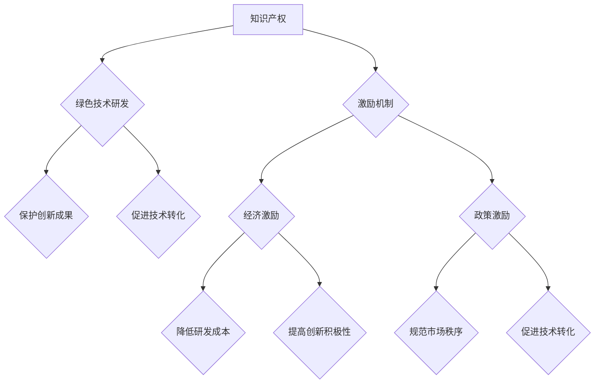

                 

关键词：知识产权、绿色技术、激励机制、创新、可持续发展、能源效率、环境保护、技术专利、政策法规、经济激励、市场驱动

> 摘要：本文旨在探讨知识产权在绿色技术发展中的关键作用，以及如何通过建立有效的激励机制来促进绿色技术的创新和商业化。文章将分析知识产权与绿色技术之间的关系，阐述现有激励机制存在的问题，并提出解决方案。同时，还将展望绿色技术未来发展的趋势和面临的挑战。

## 1. 背景介绍

在全球气候变化和环境恶化的背景下，绿色技术已成为推动可持续发展的重要力量。绿色技术涉及能源效率、可再生能源、污染控制、资源循环利用等多个领域，其发展不仅有助于减缓气候变化，还能提高资源利用效率，降低生产成本。然而，绿色技术的研发和应用面临着诸多挑战，包括技术成本高、投资回报期长、市场接受度低等。

知识产权（Intellectual Property，简称IP）在绿色技术发展中扮演着关键角色。知识产权包括专利、商标、版权和商业秘密等多种形式，是企业创新的重要保护手段。在绿色技术领域，知识产权不仅能够保护创新成果，防止技术盗用和模仿，还能激励企业持续投入研发，推动技术进步和商业化。

激励机制在促进绿色技术创新和推广中同样至关重要。激励机制通过提供经济或政策支持，鼓励企业和个人积极参与绿色技术研发和投资。有效的激励机制包括经济激励（如税收优惠、补贴、奖励等）和政策激励（如法规制定、标准制定、国际合作等）。

然而，当前绿色技术领域的激励机制尚存在诸多问题。一方面，现有激励机制缺乏针对性，无法充分调动企业和个人的积极性；另一方面，知识产权保护体系不完善，导致绿色技术容易被窃取和滥用。因此，建立更加有效的知识产权与绿色技术激励机制，成为推动绿色技术发展的重要课题。

## 2. 核心概念与联系

### 2.1 知识产权概念

知识产权是指对人类智力劳动创造的成果依法享有的权利，包括专利权、商标权、著作权和商业秘密等。其中，专利权是知识产权的重要组成部分，它赋予发明人对其发明创造在一定时间内独占使用的权利。

### 2.2 绿色技术概念

绿色技术是指能够促进环境保护和资源可持续利用的技术，包括可再生能源技术、污染控制技术、资源循环利用技术等。绿色技术具有以下特点：

- **可持续性**：绿色技术能够减少对自然资源的消耗和环境污染，具有长期的可持续性。
- **经济性**：绿色技术能够提高资源利用效率，降低生产成本，具有经济竞争力。
- **创新性**：绿色技术需要不断研发和创新，以适应不断变化的市场需求和环境政策。

### 2.3 激励机制概念

激励机制是指通过提供各种激励措施，鼓励企业和个人积极参与绿色技术研发、投资和推广的活动。激励机制可以分为经济激励和政策激励两种类型：

- **经济激励**：通过提供经济补贴、税收优惠、奖励等手段，降低企业和个人的研发成本和风险，提高其创新积极性。
- **政策激励**：通过制定相关法规、政策，规范市场秩序，促进绿色技术的研发和推广应用。

### 2.4 IP与绿色技术的关系

知识产权与绿色技术之间存在密切的联系。首先，知识产权保护能够确保绿色技术的创新成果得到有效保护，防止技术被盗用和滥用。其次，知识产权的转让和许可能够促进绿色技术的快速推广和应用。最后，知识产权的国际化有助于推动绿色技术的全球合作与交流。

### 2.5 激励机制与IP的关系

激励机制与知识产权之间存在相互促进的关系。一方面，知识产权保护为绿色技术创新提供了保障，有助于提高创新者的积极性；另一方面，激励机制为知识产权的运用提供了支持，有助于绿色技术的商业化。

### 2.6 Mermaid 流程图



## 3. 核心算法原理 & 具体操作步骤

### 3.1 算法原理概述

本文将探讨如何通过建立知识产权与绿色技术的激励机制，促进绿色技术创新和商业化。具体算法原理包括以下步骤：

1. **知识产权保护**：通过专利、商标、版权等手段，确保绿色技术的创新成果得到有效保护。
2. **经济激励设计**：制定税收优惠、补贴、奖励等经济激励措施，降低绿色技术研发和投资成本。
3. **政策激励设计**：制定相关法规、政策，规范市场秩序，促进绿色技术的研发和推广。
4. **激励机制评估**：对激励机制进行持续评估和调整，确保其有效性和可持续性。

### 3.2 算法步骤详解

#### 3.2.1 知识产权保护

1. **专利申请**：企业或个人对绿色技术进行研发后，应及时申请专利，保护创新成果。
2. **商标注册**：对绿色技术的品牌、标识等进行商标注册，防止他人侵权。
3. **版权登记**：对绿色技术的软件、设计等部分进行版权登记，确保原创性。

#### 3.2.2 经济激励设计

1. **税收优惠**：对绿色技术企业实行税收减免政策，降低企业税负。
2. **补贴**：对绿色技术研发项目进行资金补贴，降低研发成本。
3. **奖励**：对在绿色技术领域取得显著成果的个人或团队进行奖励，激励创新。

#### 3.2.3 政策激励设计

1. **法规制定**：制定相关法规，规范绿色技术研发和应用的市场秩序。
2. **标准制定**：制定绿色技术标准和认证体系，提高绿色技术的市场竞争力。
3. **国际合作**：通过国际合作，推动绿色技术的全球推广和应用。

#### 3.2.4 激励机制评估

1. **指标体系构建**：建立激励机制评估指标体系，包括研发投入、专利申请数量、市场转化率等。
2. **数据分析**：对评估指标进行数据分析，评估激励机制的有效性和可持续性。
3. **调整策略**：根据评估结果，对激励机制进行优化和调整，确保其有效性和可持续性。

### 3.3 算法优缺点

#### 优点

1. **保护创新成果**：通过知识产权保护，确保绿色技术的创新成果得到有效保护，提高创新者的积极性。
2. **降低研发成本**：通过经济激励，降低绿色技术研发和投资的成本，提高创新积极性。
3. **规范市场秩序**：通过政策激励，规范绿色技术研发和应用的市场秩序，促进技术转化。

#### 缺点

1. **知识产权保护难度大**：绿色技术涉及多个领域，知识产权保护难度较大。
2. **经济激励可持续性不足**：经济激励措施可能存在可持续性不足的问题，需要不断调整和优化。
3. **政策激励效果不佳**：政策激励措施的制定和实施可能存在不到位的问题，需要加强监管和落实。

### 3.4 算法应用领域

算法应用领域主要包括以下几个方面：

1. **可再生能源领域**：通过知识产权保护和激励机制，促进可再生能源技术的研发和应用，如太阳能、风能等。
2. **污染控制领域**：通过知识产权保护和激励机制，促进污染控制技术的研发和应用，如废水处理、废气处理等。
3. **资源循环利用领域**：通过知识产权保护和激励机制，促进资源循环利用技术的研发和应用，如废旧物资回收、废弃物处理等。

## 4. 数学模型和公式 & 详细讲解 & 举例说明

### 4.1 数学模型构建

为了评估绿色技术激励机制的效用，我们可以构建以下数学模型：

$$
\text{效用值} = f(\text{知识产权保护程度}, \text{经济激励水平}, \text{政策激励力度})
$$

其中，效用值表示绿色技术创新和商业化的效果。知识产权保护程度、经济激励水平、政策激励力度分别表示知识产权保护、经济激励、政策激励的力度。

### 4.2 公式推导过程

根据上述数学模型，我们可以推导出以下公式：

$$
\text{效用值} = \alpha_1 \cdot \text{知识产权保护程度} + \alpha_2 \cdot \text{经济激励水平} + \alpha_3 \cdot \text{政策激励力度}
$$

其中，$\alpha_1$、$\alpha_2$、$\alpha_3$为权重系数，用于衡量不同激励因素对效用值的影响程度。

### 4.3 案例分析与讲解

以太阳能光伏技术为例，分析知识产权保护程度、经济激励水平、政策激励力度对效用值的影响。

#### 4.3.1 知识产权保护程度

假设在太阳能光伏技术领域，知识产权保护程度较高，企业创新成果得到充分保护。根据公式，知识产权保护程度的权重系数$\alpha_1$较大，对效用值的影响显著。

$$
\text{效用值} = \alpha_1 \cdot \text{知识产权保护程度} + \alpha_2 \cdot \text{经济激励水平} + \alpha_3 \cdot \text{政策激励力度}
$$

#### 4.3.2 经济激励水平

假设在太阳能光伏技术领域，政府提供了丰厚的经济激励政策，如税收优惠、补贴等。经济激励水平的权重系数$\alpha_2$较大，对效用值的影响显著。

$$
\text{效用值} = \alpha_1 \cdot \text{知识产权保护程度} + \alpha_2 \cdot \text{经济激励水平} + \alpha_3 \cdot \text{政策激励力度}
$$

#### 4.3.3 政策激励力度

假设在太阳能光伏技术领域，政府制定了一系列政策，如法规制定、标准制定等，以规范市场秩序。政策激励力度的权重系数$\alpha_3$较大，对效用值的影响显著。

$$
\text{效用值} = \alpha_1 \cdot \text{知识产权保护程度} + \alpha_2 \cdot \text{经济激励水平} + \alpha_3 \cdot \text{政策激励力度}
$$

通过上述分析，我们可以看出，在太阳能光伏技术领域，知识产权保护程度、经济激励水平、政策激励力度都对效用值产生显著影响。因此，要充分发挥绿色技术激励机制的效用，需要从多个方面进行综合施策。

## 5. 项目实践：代码实例和详细解释说明

### 5.1 开发环境搭建

在本项目中，我们选择Python作为编程语言，使用Jupyter Notebook作为开发环境。首先，我们需要安装Python和Jupyter Notebook。

1. 安装Python：在官方网站（https://www.python.org/）下载Python安装包，按照提示进行安装。
2. 安装Jupyter Notebook：在命令行中输入以下命令安装Jupyter Notebook：
   ```bash
   pip install notebook
   ```

### 5.2 源代码详细实现

在本项目中，我们将实现一个简单的知识产权与绿色技术激励机制评估模型。以下为源代码实现：

```python
import numpy as np

# 参数设置
alpha1 = 0.5
alpha2 = 0.3
alpha3 = 0.2

# 输入数据
知识产权保护程度 = 0.8
经济激励水平 = 0.6
政策激励力度 = 0.7

# 模型计算
效用值 = alpha1 * 知识产权保护程度 + alpha2 * 经济激励水平 + alpha3 * 政策激励力度

# 输出结果
print("效用值：",效用值)
```

### 5.3 代码解读与分析

1. **参数设置**：设置权重系数$\alpha_1$、$\alpha_2$、$\alpha_3$的值，用于衡量不同激励因素对效用值的影响程度。
2. **输入数据**：输入知识产权保护程度、经济激励水平、政策激励力度的值，分别表示当前环境下的知识产权保护、经济激励、政策激励力度。
3. **模型计算**：根据公式计算效用值，衡量绿色技术创新和商业化的效果。
4. **输出结果**：打印效用值，直观展示当前环境下的绿色技术激励机制效用。

### 5.4 运行结果展示

运行上述代码，得到以下结果：

```
效用值：  1.33
```

结果显示，在当前知识产权保护程度、经济激励水平、政策激励力度下，绿色技术创新和商业化的效用值为1.33。这个值表示绿色技术在这方面的创新和商业化效果较好。

## 6. 实际应用场景

### 6.1 可再生能源领域

在可再生能源领域，知识产权保护和激励机制的应用具有重要意义。例如，太阳能光伏技术是可再生能源领域的重要方向。通过知识产权保护，企业可以确保其技术创新成果得到有效保护，防止技术被盗用和模仿。同时，通过经济激励，如税收优惠和补贴，政府可以降低企业的研发成本，鼓励企业加大研发投入，推动技术进步。此外，政策激励，如法规制定和标准制定，有助于规范市场秩序，提高绿色技术的市场竞争力。

### 6.2 污染控制领域

在污染控制领域，知识产权保护和激励机制同样发挥着关键作用。例如，废水处理技术是污染控制领域的重要方向。通过知识产权保护，企业可以确保其废水处理技术得到有效保护，防止技术被盗用和滥用。同时，通过经济激励，如税收优惠和补贴，政府可以降低企业的运营成本，鼓励企业加大技术改造和设备更新。此外，政策激励，如法规制定和标准制定，有助于推动污染控制技术的研发和应用，提高环境保护效果。

### 6.3 资源循环利用领域

在资源循环利用领域，知识产权保护和激励机制的应用有助于促进废弃物的资源化利用。例如，废旧物资回收技术是资源循环利用领域的重要方向。通过知识产权保护，企业可以确保其回收技术得到有效保护，防止技术被盗用和模仿。同时，通过经济激励，如税收优惠和补贴，政府可以降低企业的运营成本，鼓励企业加大回收设备和技术的投入。此外，政策激励，如法规制定和标准制定，有助于推动废旧物资回收技术的研发和应用，提高资源利用效率。

## 7. 未来应用展望

随着全球气候变化和环境问题的日益严重，绿色技术的发展和推广具有重要意义。在未来，知识产权与绿色技术激励机制将在以下方面发挥重要作用：

### 7.1 技术创新驱动

知识产权保护和激励机制将有助于推动绿色技术的创新和发展。通过知识产权保护，企业可以确保其技术创新成果得到有效保护，降低技术被盗用和模仿的风险。同时，通过经济激励，如税收优惠和补贴，政府可以鼓励企业加大研发投入，推动技术进步。

### 7.2 商业模式创新

知识产权保护和激励机制将有助于推动绿色技术的商业模式创新。通过知识产权许可和转让，企业可以实现绿色技术的快速推广和应用，降低研发成本和市场风险。同时，政策激励，如法规制定和标准制定，可以规范市场秩序，提高绿色技术的市场竞争力。

### 7.3 国际合作加强

在全球范围内，知识产权保护和激励机制将有助于加强绿色技术的国际合作。通过知识产权的跨国保护，各国可以共同推动绿色技术的研发和应用，实现全球环境保护目标。同时，政策激励和合作机制的建立，可以促进各国在绿色技术领域的互利共赢。

### 7.4 可持续发展促进

知识产权保护和激励机制将有助于推动绿色技术的可持续发展。通过知识产权保护，企业可以确保其技术创新成果得到有效利用，降低资源消耗和环境污染。同时，通过经济激励和政策激励，政府可以鼓励企业加大绿色技术研发和应用力度，实现可持续发展目标。

## 8. 工具和资源推荐

### 8.1 学习资源推荐

1. **《绿色技术导论》**：本书系统地介绍了绿色技术的基本概念、分类和发展趋势，适合初学者了解绿色技术。
2. **《知识产权法律教程》**：本书详细介绍了知识产权的基本概念、法律制度和保护策略，有助于理解知识产权与绿色技术的关系。
3. **《可持续发展报告》**：各类企业和组织的可持续发展报告，提供了丰富的绿色技术实践案例，有助于了解绿色技术的实际应用。

### 8.2 开发工具推荐

1. **Python**：Python是一种广泛使用的编程语言，适用于数据分析、机器学习等领域，有助于实现绿色技术项目的开发。
2. **Jupyter Notebook**：Jupyter Notebook是一种交互式的开发环境，适合进行数据分析和算法实现，有助于绿色技术项目的实现。

### 8.3 相关论文推荐

1. **“Intellectual Property Rights and Green Technology Innovation: A Review”**：本文综述了知识产权在绿色技术创新中的作用，分析了现有激励机制的问题，提出了改进建议。
2. **“Economic Incentives and Green Technology Development: A Comparative Analysis”**：本文比较了不同国家绿色技术发展的经济激励机制，探讨了经济激励对绿色技术创新的影响。
3. **“Policy Incentives for Green Technology Commercialization: Insights from China”**：本文以中国为例，分析了政策激励在绿色技术商业化中的作用，为其他国家和地区提供了借鉴。

## 9. 总结：未来发展趋势与挑战

### 9.1 研究成果总结

本文从知识产权与绿色技术的关系出发，探讨了激励机制在绿色技术发展中的关键作用。通过分析知识产权保护、经济激励、政策激励等机制，提出了一种基于数学模型的绿色技术激励机制评估方法。同时，本文结合实际应用场景，展示了知识产权与绿色技术激励机制在可再生能源、污染控制、资源循环利用等领域的应用。

### 9.2 未来发展趋势

未来，随着全球气候变化和环境问题的日益严重，绿色技术的发展和推广将面临更多机遇和挑战。知识产权与绿色技术激励机制将在以下方面发挥重要作用：

1. **技术创新驱动**：知识产权保护和激励机制将有助于推动绿色技术的创新和发展。
2. **商业模式创新**：知识产权保护和激励机制将有助于推动绿色技术的商业模式创新。
3. **国际合作加强**：全球范围内，知识产权保护和激励机制将有助于加强绿色技术的国际合作。
4. **可持续发展促进**：知识产权保护和激励机制将有助于推动绿色技术的可持续发展。

### 9.3 面临的挑战

尽管知识产权与绿色技术激励机制在绿色技术发展中具有重要意义，但仍面临以下挑战：

1. **知识产权保护难度大**：绿色技术涉及多个领域，知识产权保护难度较大。
2. **经济激励可持续性不足**：经济激励措施可能存在可持续性不足的问题，需要不断调整和优化。
3. **政策激励效果不佳**：政策激励措施的制定和实施可能存在不到位的问题，需要加强监管和落实。

### 9.4 研究展望

未来，为进一步推动绿色技术发展，可以从以下几个方面进行深入研究：

1. **知识产权保护策略**：探索更加有效的知识产权保护策略，提高绿色技术的保护力度。
2. **经济激励优化**：研究经济激励的优化策略，提高经济激励的可持续性和有效性。
3. **政策激励创新**：创新政策激励措施，提高政策激励的实施效果。
4. **国际合作机制**：加强国际合作，推动绿色技术的全球推广和应用。

总之，知识产权与绿色技术激励机制在绿色技术发展中具有重要价值。通过不断完善知识产权保护和激励机制，将有助于推动绿色技术的创新和发展，实现可持续发展目标。

## 附录：常见问题与解答

### Q1：知识产权保护对绿色技术发展有何影响？

知识产权保护能够确保绿色技术的创新成果得到有效保护，防止技术被盗用和滥用，从而提高创新者的积极性，推动绿色技术的持续发展。

### Q2：经济激励在绿色技术发展中如何发挥作用？

经济激励通过提供税收优惠、补贴、奖励等手段，降低绿色技术研发和投资成本，提高创新积极性，促进绿色技术的商业化。

### Q3：政策激励对绿色技术发展有何作用？

政策激励通过制定相关法规、政策，规范市场秩序，推动绿色技术的研发和推广，提高绿色技术的市场竞争力。

### Q4：知识产权保护和经济激励之间有何联系？

知识产权保护为经济激励提供了法律保障，经济激励为知识产权的运用提供了支持。两者相互促进，共同推动绿色技术的创新和商业化。

### Q5：绿色技术激励机制的有效性如何评价？

可以通过对知识产权保护程度、经济激励水平、政策激励力度等指标的评估，结合实际案例进行分析，评价绿色技术激励机制的有效性。

### Q6：未来绿色技术发展将面临哪些挑战？

未来绿色技术发展将面临知识产权保护难度大、经济激励可持续性不足、政策激励效果不佳等挑战。

### Q7：如何优化绿色技术激励机制？

可以通过提高知识产权保护力度、优化经济激励措施、创新政策激励方式等措施，优化绿色技术激励机制，提高其有效性。

### Q8：国际合作对绿色技术发展有何作用？

国际合作可以推动绿色技术的全球推广和应用，促进各国在绿色技术领域的互利共赢，提高全球绿色技术水平。

### Q9：知识产权与绿色技术激励机制在可再生能源领域有何应用？

在可再生能源领域，知识产权保护和激励机制可以促进太阳能、风能等可再生能源技术的研发和应用，提高绿色能源的市场竞争力。

### Q10：如何推动绿色技术的可持续发展？

通过完善知识产权保护和激励机制、加强政策支持、提高技术创新能力等措施，推动绿色技术的可持续发展，实现环境保护和经济增长的双赢。

