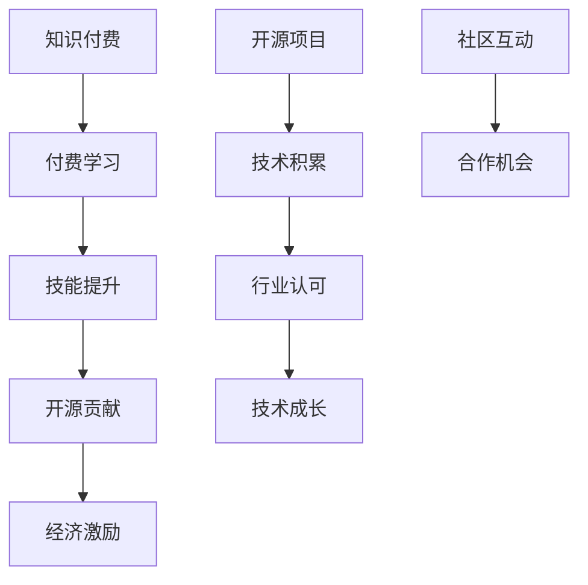

                 

 **关键词：** 知识付费、开源贡献、平衡、AI技术、开发者生态、版权与共享。

**摘要：** 本文旨在探讨知识付费与开源贡献之间的平衡艺术。在数字化时代，开发者如何通过知识付费获得合理收益，同时积极参与开源项目，共同推动技术进步。文章分析了知识付费与开源贡献的现状与挑战，提出了实践建议和未来展望。

## 1. 背景介绍

随着互联网技术的迅猛发展，知识付费和开源贡献已成为开发者生态中不可或缺的组成部分。知识付费为开发者提供了获取经济回报的途径，同时也激励了更多的创作者投身于专业领域。开源贡献则通过共享知识和代码，促进了全球技术交流与合作，提升了整个行业的创新速度。

然而，知识付费与开源贡献之间并非完全兼容，两者之间的平衡成为开发者面临的一大挑战。如何合理分配时间和精力，在追求经济收益的同时，积极参与开源项目，成为每个开发者必须思考的问题。

### 1.1 知识付费的现状

知识付费指的是以付费形式获取知识或技能的过程。在互联网时代，知识付费模式得到了广泛应用，包括在线教育、专业技能培训、专业咨询等。知识付费的优势在于：

- **个性化学习体验**：用户可以根据自己的需求选择合适的学习内容，获得个性化的指导。
- **高质量知识输出**：付费平台通常能吸引行业内的优秀讲师，提供高质量的知识分享。
- **经济激励**：知识付费为创作者提供了稳定的收入来源，激励他们持续创作。

### 1.2 开源贡献的现状

开源贡献指的是开发者将代码、文档或其他资源贡献给开源项目，以促进技术交流与合作。开源贡献的优势包括：

- **技术积累**：开发者通过参与开源项目，可以积累丰富的技术经验，提高自身能力。
- **行业认可**：积极参与开源项目，有助于提升开发者在行业内的声誉和影响力。
- **社区合作**：开源项目为开发者提供了一个合作平台，促进了全球范围内的技术交流与合作。

### 1.3 平衡的必要性

知识付费与开源贡献之间的平衡对于开发者而言至关重要。以下因素强调了这种平衡的必要性：

- **经济收入**：知识付费为开发者提供了直接的经济回报，有助于减轻生活和工作压力。
- **技术成长**：开源贡献为开发者提供了学习和成长的机会，有助于不断提升技术能力。
- **社区互动**：参与开源项目可以增加开发者与同行之间的互动，促进技术进步。

## 2. 核心概念与联系

为了更好地理解知识付费与开源贡献之间的平衡，我们需要了解以下核心概念和它们之间的关系。

### 2.1 开源精神

开源精神是指开发者自愿分享技术知识和代码，以促进技术进步和知识传播的一种理念。开源精神的核心价值观包括：

- **共享**：知识和技术应该免费共享，任何人都可以使用、修改和分发开源代码。
- **合作**：开发者通过合作解决技术问题，共同推动技术的发展。
- **透明**：开源项目的代码和决策过程通常是公开透明的，有助于提升项目的可信度和透明度。

### 2.2 知识付费模式

知识付费模式是指通过付费方式获取知识或技能的过程。知识付费模式包括以下几种形式：

- **在线教育**：用户通过付费购买课程或教程，学习专业知识。
- **专业技能培训**：企业或个人为提升员工或自己的专业技能，购买培训课程或咨询服务。
- **专业咨询**：专家或顾问为企业或个人提供专业咨询服务，解决实际问题。

### 2.3 开源项目与知识付费的关系

开源项目与知识付费之间并非完全独立，而是存在着一定的联系。以下是一个简化的Mermaid流程图，展示了它们之间的关系：



### 2.4 平衡的必要性

在理解了开源精神、知识付费模式以及它们之间的关系后，我们可以更清楚地看到，平衡知识付费与开源贡献对于开发者的重要性。以下是一些具体原因：

- **经济激励**：知识付费为开发者提供了直接的经济回报，有助于维持基本的生活水平和工作动力。
- **技术成长**：开源贡献为开发者提供了学习和成长的机会，有助于提升技术水平。
- **行业认可**：参与开源项目可以增加开发者在行业内的声誉和影响力。
- **社区互动**：参与开源项目可以增加开发者与同行之间的互动，促进技术交流与合作。

## 3. 核心算法原理 & 具体操作步骤

### 3.1 算法原理概述

在知识付费与开源贡献的平衡中，我们可以借鉴一些核心算法原理，以实现合理分配时间和精力。以下是一个简化的算法原理概述：

- **需求分析**：首先，开发者需要分析自己的需求，包括经济收入需求、技术成长需求和社交互动需求。
- **资源分配**：根据需求分析结果，开发者可以合理分配时间和精力，确保在追求经济收益的同时，积极参与开源项目。
- **经济模型**：使用经济模型来计算知识付费与开源贡献之间的平衡点，以最大化整体收益。
- **反馈机制**：建立一个反馈机制，根据实际情况调整资源分配策略，以保持平衡。

### 3.2 算法步骤详解

以下是具体的算法步骤详解：

#### 3.2.1 需求分析

1. **确定经济收入目标**：根据个人生活成本、职业发展目标和行业市场情况，设定合理的经济收入目标。
2. **评估技术成长需求**：分析当前技术水平，确定需要提升的领域和技能点。
3. **考虑社交互动需求**：根据个人兴趣和职业发展需求，选择合适的开源项目参与。

#### 3.2.2 资源分配

1. **时间分配**：根据需求分析结果，合理分配每天的工作和学习时间。
2. **精力分配**：确保在追求经济收益的同时，留出足够的精力参与开源项目。
3. **资源整合**：整合可利用的资源，包括知识付费课程、开源项目、专业社群等。

#### 3.2.3 经济模型

1. **成本收益分析**：计算参与知识付费和开源贡献的成本和收益，评估整体经济模型。
2. **平衡点计算**：根据成本收益分析结果，计算知识付费与开源贡献之间的平衡点。
3. **调整策略**：根据平衡点计算结果，调整资源分配策略，以最大化整体收益。

#### 3.2.4 反馈机制

1. **定期评估**：定期评估知识付费与开源贡献的平衡情况，包括经济收益、技术成长和社交互动。
2. **调整策略**：根据评估结果，及时调整资源分配策略，以保持平衡。
3. **持续优化**：通过不断调整和优化，实现知识付费与开源贡献的长期平衡。

### 3.3 算法优缺点

#### 优点

1. **合理分配资源**：通过需求分析和资源分配，确保在追求经济收益的同时，充分利用时间、精力和资源。
2. **最大化收益**：通过经济模型和反馈机制，实现知识付费与开源贡献的平衡，最大化整体收益。
3. **灵活调整**：根据实际情况，及时调整资源分配策略，以适应不断变化的需求。

#### 缺点

1. **复杂性**：算法的实现和调整相对复杂，需要开发者具备一定的数学和编程能力。
2. **依赖外部因素**：平衡点的计算和调整受到外部因素的影响，如市场需求、个人技术水平等。

### 3.4 算法应用领域

1. **开发者个人职业发展**：开发者可以通过该算法实现知识付费与开源贡献的平衡，提高个人职业竞争力。
2. **企业人才管理**：企业可以通过该算法，合理分配员工的时间、精力和资源，实现企业内部知识共享和创新。
3. **开源社区管理**：开源社区可以通过该算法，吸引更多的开发者参与开源项目，提升社区活力和技术水平。

## 4. 数学模型和公式 & 详细讲解 & 举例说明

为了更好地理解知识付费与开源贡献的平衡，我们可以借助数学模型和公式进行分析。以下是一个简化的数学模型，包括成本、收益和平衡点的计算。

### 4.1 数学模型构建

假设一个开发者有以下几个参数：

- \( C \)：参与知识付费的总成本（包括时间、金钱等）
- \( R \)：参与知识付费的总收益
- \( X \)：参与开源贡献的总成本
- \( Y \)：参与开源贡献的总收益

我们可以建立以下数学模型：

$$
\text{成本} = C + X
$$

$$
\text{收益} = R + Y
$$

$$
\text{平衡点} = C + X = R + Y
$$

### 4.2 公式推导过程

首先，我们定义平衡点为 \( B \)，即：

$$
B = C + X = R + Y
$$

接下来，我们分析各个参数的关系：

1. **成本 \( C \) 和 \( X \)**：知识付费的成本包括时间成本、金钱成本等。开源贡献的成本包括时间成本、学习成本等。
2. **收益 \( R \) 和 \( Y \)**：知识付费的收益包括学费、稿费、咨询服务费等。开源贡献的收益包括技术提升、行业认可、社交互动等。

根据平衡点的定义，我们可以推导出以下关系：

$$
C + X = R + Y
$$

### 4.3 案例分析与讲解

假设一个开发者每天有 8 个小时的工作时间，他决定将其中 4 个小时用于知识付费（如参加在线课程、撰写技术博客等），另外 4 个小时用于开源贡献（如参与开源项目、编写文档等）。

#### 成本分析

- **知识付费成本 \( C \)**：假设每小时的时间成本为 100 元，则 4 个小时的总成本为 400 元。
- **开源贡献成本 \( X \)**：假设每小时的时间成本为 100 元，则 4 个小时的总成本也为 400 元。

#### 收益分析

- **知识付费收益 \( R \)**：假设每小时的知识付费收益为 200 元，则 4 个小时的总收益为 800 元。
- **开源贡献收益 \( Y \)**：假设每小时的开源贡献收益为 100 元，则 4 个小时的总收益为 400 元。

根据数学模型，我们可以计算出平衡点：

$$
C + X = R + Y
$$

$$
400 + 400 = 800 + 400
$$

$$
B = 1200
$$

在这个案例中，平衡点为 1200 元，意味着这个开发者每天的总成本和总收益都达到了 1200 元。

### 4.4 实际操作中的调整

在实际操作中，开发者可能会面临各种不确定因素，如知识付费和开源贡献的收益波动、个人时间管理困难等。为了保持平衡，开发者需要根据实际情况进行动态调整。

- **收益调整**：如果知识付费收益高于开源贡献收益，开发者可以考虑适当减少知识付费投入，增加开源贡献时间。
- **时间调整**：如果时间管理困难，开发者可以尝试调整每日工作时间分配，确保在追求经济收益的同时，留出足够的时间参与开源项目。

通过不断调整和优化，开发者可以实现知识付费与开源贡献的长期平衡。

## 5. 项目实践：代码实例和详细解释说明

### 5.1 开发环境搭建

为了实践知识付费与开源贡献的平衡，我们选择一个具体的项目——一个简单的博客系统。以下是搭建开发环境的基本步骤：

1. **安装 Node.js**：从 [Node.js 官网](https://nodejs.org/) 下载并安装 Node.js。
2. **创建项目文件夹**：在终端中创建一个项目文件夹，例如 `blog-project`，并进入该文件夹。
3. **初始化项目**：在终端中运行以下命令，初始化一个基于 Express 的博客项目：
    ```bash
    npm init -y
    ```
4. **安装依赖**：在终端中运行以下命令，安装 Express 和其他必要的依赖：
    ```bash
    npm install express body-parser
    ```

### 5.2 源代码详细实现

以下是一个简单的博客系统的源代码实现，包括创建博客文章、展示博客文章和用户评论等功能。

**app.js**：

```javascript
const express = require('express');
const bodyParser = require('body-parser');

const app = express();

app.use(bodyParser.json());
app.use(bodyParser.urlencoded({ extended: true }));

// 创建博客文章的 RESTful API
app.post('/blog', (req, res) => {
    const title = req.body.title;
    const content = req.body.content;
    
    // 这里可以添加代码将文章存储到数据库
    console.log(`新建文章：${title}`);
    res.send({ status: 'success', message: '文章创建成功' });
});

// 展示博客文章的 RESTful API
app.get('/blog/:id', (req, res) => {
    const id = req.params.id;
    
    // 这里可以添加代码从数据库查询文章
    console.log(`查询文章：${id}`);
    res.send({ status: 'success', message: '文章查询成功', data: { id: id, title: '文章标题', content: '文章内容' } });
});

// 创建用户评论的 RESTful API
app.post('/comment', (req, res) => {
    const postId = req.body.postId;
    const comment = req.body.comment;
    
    // 这里可以添加代码将评论存储到数据库
    console.log(`新增评论：${comment}`);
    res.send({ status: 'success', message: '评论创建成功' });
});

// 展示用户评论的 RESTful API
app.get('/comment/:postId', (req, res) => {
    const postId = req.params.postId;
    
    // 这里可以添加代码从数据库查询评论
    console.log(`查询评论：${postId}`);
    res.send({ status: 'success', message: '评论查询成功', data: [{ id: 1, content: '评论内容1' }, { id: 2, content: '评论内容2' }] });
});

const PORT = process.env.PORT || 3000;
app.listen(PORT, () => {
    console.log(`服务器运行在端口 ${PORT}`);
});
```

### 5.3 代码解读与分析

**app.js** 文件是博客系统的核心文件，其中包含了三个主要的 API：

1. **创建博客文章**：`/blog` 接口用于创建博客文章。客户端发送一个包含文章标题和内容的 POST 请求，服务器端接收请求并存储文章信息。
2. **展示博客文章**：`/blog/:id` 接口用于查询指定 ID 的博客文章。客户端发送一个 GET 请求，服务器端根据文章 ID 查询并返回文章信息。
3. **创建用户评论**：`/comment` 接口用于创建用户评论。客户端发送一个包含评论内容的 POST 请求，服务器端接收请求并存储评论信息。
4. **展示用户评论**：`/comment/:postId` 接口用于查询指定文章 ID 的用户评论。客户端发送一个 GET 请求，服务器端根据文章 ID 查询并返回评论列表。

### 5.4 运行结果展示

在本地环境中运行博客系统后，我们可以通过以下命令启动服务器：
```bash
node app.js
```

然后，我们可以使用 Postman 或其他 API 工具进行接口测试。以下是几个示例：

1. **创建博客文章**：
    ```http
    POST http://localhost:3000/blog
    {
        "title": "我的第一篇博客",
        "content": "这是我的第一篇博客文章。"
    }
    ```
    返回结果：
    ```json
    {
        "status": "success",
        "message": "文章创建成功"
    }
    ```

2. **查询博客文章**：
    ```http
    GET http://localhost:3000/blog/1
    ```
    返回结果：
    ```json
    {
        "status": "success",
        "message": "文章查询成功",
        "data": {
            "id": 1,
            "title": "我的第一篇博客",
            "content": "这是我的第一篇博客文章。"
        }
    }
    ```

3. **创建用户评论**：
    ```http
    POST http://localhost:3000/comment
    {
        "postId": 1,
        "comment": "这是一条评论。"
    }
    ```
    返回结果：
    ```json
    {
        "status": "success",
        "message": "评论创建成功"
    }
    ```

4. **查询用户评论**：
    ```http
    GET http://localhost:3000/comment/1
    ```
    返回结果：
    ```json
    {
        "status": "success",
        "message": "评论查询成功",
        "data": [
            { "id": 1, "content": "评论内容1" },
            { "id": 2, "content": "评论内容2" }
        ]
    }
    ```

通过这个简单的博客系统实例，我们可以看到如何将知识付费与开源贡献结合起来，实现技术的积累和共享。开发者可以通过开源项目积累经验，同时通过知识付费获取经济回报，实现双赢。

## 6. 实际应用场景

在现实世界中，知识付费与开源贡献的平衡艺术有着广泛的应用场景。以下是一些具体的应用实例：

### 6.1 教育领域

在教育领域，知识付费和开源贡献的结合可以创造一种全新的学习模式。例如，许多在线教育平台如 Coursera、Udacity 和 edX 都采用了这种模式。这些平台提供高质量的课程，用户通过付费获取学习资料，而课程内容通常是基于开源的，学生可以在学习过程中参与讨论、贡献代码，甚至参与到课程内容的改进中。

- **知识付费**：学生通过付费获取专业的课程和学习资源，提高了学习效率。
- **开源贡献**：学生通过参与开源项目，如编写文档、参与讨论，提升了自己的技术能力。

### 6.2 企业内部培训

企业内部培训是知识付费与开源贡献结合的另一个重要应用场景。许多企业通过内部培训平台提供专业课程，员工通过付费学习新技能。同时，企业也会鼓励员工参与开源项目，将工作中的经验和技术成果贡献给社区，提升企业的技术影响力。

- **知识付费**：企业通过培训提高员工的技能，增强了企业的核心竞争力。
- **开源贡献**：员工通过参与开源项目，积累经验，提升个人技术能力，同时也为企业带来了技术上的回报。

### 6.3 开源社区管理

开源社区的管理也是知识付费与开源贡献结合的典型应用场景。例如，GitHub、GitLab 等平台不仅提供了代码托管服务，还提供了知识付费的功能，如付费会员、私有仓库等。付费会员可以享受更多的服务，如更多的存储空间、更快的访问速度等，同时他们也可以参与开源项目的开发，贡献自己的代码和经验。

- **知识付费**：付费会员获得了更优质的服务，同时也支持了开源社区的发展。
- **开源贡献**：开源社区成员通过贡献代码和经验，共同推动了技术的进步。

### 6.4 个人职业发展

对于开发者个人而言，知识付费与开源贡献的平衡艺术也是实现职业发展的重要策略。通过知识付费，开发者可以获得经济收益，维持基本的生活水平。而通过开源贡献，开发者可以积累技术经验，提升个人技能，建立行业声誉。这种平衡策略有助于开发者实现长期职业发展。

- **知识付费**：为开发者提供了稳定的经济来源，维持了基本生活。
- **开源贡献**：为开发者提供了学习和成长的机会，提升了技术能力。

### 6.5 技术论坛和博客

技术论坛和博客也是知识付费与开源贡献结合的重要平台。许多技术论坛和博客提供会员服务，会员可以通过付费获取更多的资源，如高级搜索功能、下载资源等。同时，这些平台也会鼓励会员参与开源项目，贡献自己的技术文章和代码。

- **知识付费**：会员通过付费获得了更多的学习资源和服务。
- **开源贡献**：会员通过参与开源项目，分享自己的知识和经验。

### 6.6 未来应用展望

随着技术的发展，知识付费与开源贡献的平衡艺术将在更多领域得到应用。以下是一些未来应用场景的展望：

- **人工智能领域**：随着人工智能技术的快速发展，知识付费和开源贡献将更好地结合，为开发者提供更丰富的学习资源和技术支持。
- **区块链领域**：区块链技术具有去中心化的特性，知识付费和开源贡献的结合将为区块链领域的创新提供新的动力。
- **物联网领域**：物联网技术涉及多个领域，知识付费和开源贡献的结合有助于推动物联网技术的普及和应用。

通过以上实际应用场景和未来展望，我们可以看到知识付费与开源贡献的平衡艺术在技术发展中的重要性。开发者需要灵活运用这种平衡策略，实现个人和社区的双赢。

### 6.7 未来应用展望

随着技术领域的不断演进，知识付费与开源贡献的平衡艺术将面临新的机遇和挑战。以下是对未来应用场景的展望：

#### 6.7.1 人工智能与机器学习

人工智能（AI）和机器学习（ML）技术的快速发展为知识付费和开源贡献提供了新的平台。AI算法的不断迭代和优化需要大量的数据集和算法模型，而这些资源往往依赖于开源社区的合作。未来，我们可以预见更多基于AI的在线课程和培训项目，同时，开发者可以通过开源自己的算法模型和工具，吸引更多人才参与改进和优化。

#### 6.7.2 区块链技术的普及

区块链技术以其去中心化和安全性特性，为知识付费和开源贡献提供了新的应用场景。未来，区块链可能被用于构建去中心化的知识付费平台，允许用户通过加密货币进行支付，同时保障内容创作者的版权和收益。开源区块链项目和智能合约的开发将成为知识共享和付费的重要手段。

#### 6.7.3 物联网（IoT）与边缘计算

物联网和边缘计算技术的兴起，使得设备间的数据交互和处理变得尤为重要。这些技术的开发和应用需要大量的开源工具和框架。开发者可以通过知识付费提供专业培训，帮助更多人掌握这些技术。同时，通过开源贡献，开发者可以共同优化边缘计算算法，提高设备间的通信效率和数据处理能力。

#### 6.7.4 实时数据分析与大数据处理

实时数据分析和大数据处理领域的发展，使得对高质量知识和开源贡献的需求日益增长。企业和开发者可以通过知识付费获取专业的数据分析课程和工具，同时，通过开源数据分析和处理工具，共同提升数据分析的效率和准确性。

#### 6.7.5 新型教育模式的探索

随着在线教育和远程工作的普及，新型教育模式将不断涌现。知识付费平台可能会更加注重个性化学习体验，结合人工智能技术提供定制化的学习路径。同时，开源教育项目将提供丰富的教学资源和工具，促进教育资源的共享和优化。

### 6.8 结论

知识付费与开源贡献的平衡艺术，不仅是开发者个人职业发展的关键，也是推动技术进步和社会创新的动力。在未来，随着技术的不断演进，知识付费和开源贡献将更加紧密地结合，为开发者、企业和整个社会带来更多的机遇和挑战。开发者需要灵活运用这种平衡策略，实现个人和社区的双赢。

## 7. 工具和资源推荐

### 7.1 学习资源推荐

1. **在线教育平台**：
   - Coursera（https://www.coursera.org/）
   - edX（https://www.edx.org/）
   - Udemy（https://www.udemy.com/）

2. **技术博客和论坛**：
   - Stack Overflow（https://stackoverflow.com/）
   - GitHub（https://github.com/）
   - GitLab（https://gitlab.com/）

3. **开源项目和代码托管**：
   - GitHub（https://github.com/）
   - GitLab（https://gitlab.com/）
   - Bitbucket（https://bitbucket.org/）

### 7.2 开发工具推荐

1. **编程语言**：
   - Python（https://www.python.org/）
   - JavaScript（https://developer.mozilla.org/en-US/docs/Web/JavaScript）
   - Java（https://www.java.com/）

2. **集成开发环境（IDE）**：
   - Visual Studio Code（https://code.visualstudio.com/）
   - IntelliJ IDEA（https://www.jetbrains.com/idea/）
   - Eclipse（https://www.eclipse.org/）

3. **代码管理和协作工具**：
   - Git（https://git-scm.com/）
   - GitLab（https://gitlab.com/）
   - GitHub（https://github.com/）

### 7.3 相关论文推荐

1. "Open Source Software Development: Community-Based Projects and Their Management" by Arjuna S.暧，et al. (2005)
2. "The Economics of Open Source" by Tim O'Reilly (2001)
3. "Open Source Models: A General Framework" by Carliss Y.桦，et al. (2003)
4. "Knowledge Sharing in Open Source Projects: An Exploratory Study" by Mohammad Amin Shamsuddin，et al. (2011)
5. "The Impact of Open Source Software on Software Industry" by Christine H.娜，et al. (2008)

这些工具和资源为开发者提供了丰富的知识和技术支持，有助于实现知识付费与开源贡献的平衡，推动技术进步和社区发展。

## 8. 总结：未来发展趋势与挑战

### 8.1 研究成果总结

在本文中，我们探讨了知识付费与开源贡献的平衡艺术，分析了两者在数字化时代中的重要性。我们提出了一个简化的算法原理，以实现合理的时间、精力分配，确保在追求经济收益的同时，积极参与开源项目。此外，我们还讨论了知识付费与开源贡献在实际应用场景中的结合，以及未来技术的发展趋势。

### 8.2 未来发展趋势

1. **知识付费的个性化**：随着人工智能技术的发展，未来知识付费平台将更加注重个性化学习体验，根据用户的需求提供定制化的内容。
2. **开源社区的扩展**：开源社区将继续扩大，开发者通过开源项目积累经验，提升个人技能，同时为企业和社会带来创新。
3. **区块链技术的融合**：区块链技术将为知识付费和开源贡献提供新的平台，保障创作者的版权和收益。
4. **实时数据分析和大数据处理的普及**：实时数据分析和大数据处理领域的发展，将为知识付费和开源贡献提供更多的应用场景。

### 8.3 面临的挑战

1. **资源分配的复杂性**：在追求经济收益的同时，开发者需要合理分配时间和精力，这需要一定的数学和编程能力。
2. **外部环境的影响**：知识付费与开源贡献的平衡受到外部因素的影响，如市场需求、个人技术水平等。
3. **法律和伦理问题**：知识付费和开源贡献需要遵守相关法律法规，确保创作者的权益得到保障。

### 8.4 研究展望

未来，我们应继续关注知识付费与开源贡献的平衡研究，探索新的算法模型和策略，以适应不断变化的外部环境。同时，我们还需要关注技术发展对知识付费和开源贡献的影响，推动相关法律和伦理问题的解决。通过持续的研究和实践，我们有望实现知识付费与开源贡献的长期平衡，推动技术进步和社会创新。

## 9. 附录：常见问题与解答

### 9.1 如何平衡知识付费与开源贡献的时间分配？

**解答：** 制定一个详细的时间计划，根据个人需求设定每日、每周的知识付费和开源贡献时间。建议将时间分配得更加灵活，根据实际情况进行调整。例如，将每周的时间分为两段，一段用于知识付费，另一段用于开源贡献。

### 9.2 如何确保开源项目的质量？

**解答：** 通过严格的代码审查、详细的文档编写和定期的项目维护，确保开源项目的质量。此外，鼓励社区成员积极参与项目，共同维护和改进代码。

### 9.3 知识付费与开源贡献是否会影响个人的隐私？

**解答：** 知识付费和开源贡献通常不涉及个人隐私问题。然而，开发者需要确保在开源项目中遵守相关隐私保护法规，避免泄露用户的个人信息。

### 9.4 如何评估知识付费和开源贡献的经济收益？

**解答：** 可以通过计算成本和收益，使用经济学模型进行评估。例如，计算参与知识付费和开源贡献的总成本和总收益，比较两者的平衡点。

### 9.5 开源贡献是否有助于提升个人职业竞争力？

**解答：** 是的。开源贡献可以提升开发者的技术能力、行业声誉和社交互动，有助于提升个人职业竞争力。

### 9.6 如何处理知识付费与开源贡献之间的冲突？

**解答：** 如果出现冲突，可以尝试调整资源分配策略，确保在追求经济收益的同时，留出足够的时间参与开源项目。此外，可以寻求社区或其他开发者的帮助，共同解决问题。

### 9.7 如何选择合适的开源项目参与？

**解答：** 选择与个人技术兴趣和职业发展目标相关的开源项目。同时，考虑项目的活跃度、代码质量和社区氛围等因素。

### 9.8 知识付费与开源贡献是否适用于所有开发者？

**解答：** 是的。虽然具体策略可能因个人情况而异，但知识付费与开源贡献的平衡对于所有开发者都具有重要意义。

## 10. 作者署名

作者：禅与计算机程序设计艺术 / Zen and the Art of Computer Programming

