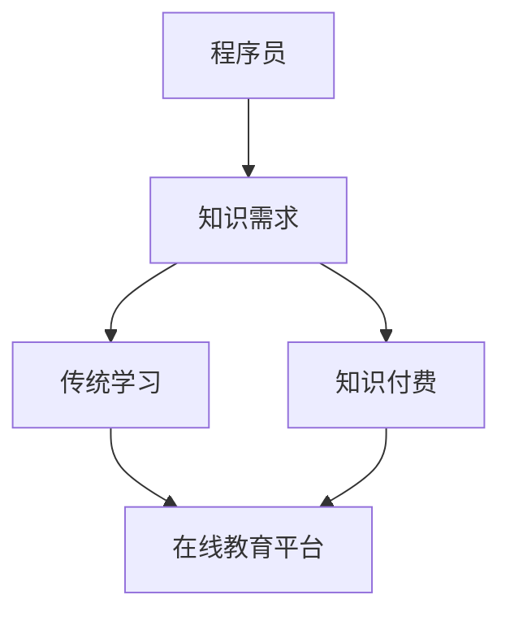

                 

关键词：知识付费、程序员、持续学习、技能提升、在线教育、学习资源

> 摘要：本文旨在探讨知识付费在程序员持续学习过程中的重要作用，分析在线教育平台的现状与发展，并探讨未来趋势与挑战。

## 1. 背景介绍

在信息技术飞速发展的今天，程序员作为科技领域的中坚力量，其技能水平直接影响到项目的质量与效率。然而，技术的快速迭代使得程序员必须不断学习新的知识和技能，才能适应行业的发展。然而，面对海量的学习资源，程序员如何有效地选择并利用这些资源，成为了亟待解决的问题。

知识付费作为一种新型的学习方式，近年来在程序员群体中得到了广泛关注。通过付费获取高质量的学习资源，程序员可以更快速地提升自己的技能水平。然而，知识付费是否真的能够提高程序员的学习效率，它与传统免费资源相比有哪些优势与不足，这些都是我们需要深入探讨的问题。

## 2. 核心概念与联系

### 2.1 知识付费

知识付费指的是用户为获取某种知识或技能而支付的费用。这种付费方式可以包括在线课程、专业书籍、培训服务等多种形式。知识付费的核心在于其“高质量”的特点，即付费用户能够获得专业的、经过严格筛选的知识内容。

### 2.2 在线教育平台

在线教育平台是知识付费的主要载体，它们为用户提供了一个便捷的学习环境。通过在线教育平台，程序员可以随时随地学习新的知识和技能，这大大提高了学习的灵活性。

### 2.3 持续学习

持续学习是指程序员在职业生涯中不断学习新的知识和技能，以适应技术发展的需求。持续学习是程序员职业发展的关键，它能够帮助程序员保持竞争力，提高职业素养。

### 2.4 Mermaid 流程图



## 3. 核心算法原理 & 具体操作步骤

### 3.1 算法原理概述

知识付费的核心算法原理是通过数据分析与用户行为预测，为用户提供个性化的学习资源推荐。这种推荐算法通常基于用户的历史行为数据，如学习记录、搜索历史等，来预测用户可能感兴趣的学习内容。

### 3.2 算法步骤详解

1. 收集用户数据：包括用户的学习记录、搜索历史、兴趣爱好等。
2. 数据预处理：对收集到的数据进行清洗、去噪、归一化等处理。
3. 构建推荐模型：使用机器学习算法，如协同过滤、内容推荐等，构建推荐模型。
4. 推荐学习资源：根据用户的兴趣和行为数据，使用推荐模型为用户推荐适合的学习资源。

### 3.3 算法优缺点

优点：
- 提高学习效率：通过推荐算法，用户可以快速找到自己感兴趣的学习资源，减少无效学习时间。
- 提升用户体验：个性化推荐能够提高用户的学习兴趣和满意度。

缺点：
- 数据隐私问题：推荐算法需要大量用户数据，这可能引发数据隐私问题。
- 过度依赖算法：用户可能会过度依赖算法推荐，忽视自我探索和学习。

### 3.4 算法应用领域

知识付费算法广泛应用于在线教育平台，如Coursera、edX等。这些平台通过个性化推荐，帮助用户快速找到适合自己的学习资源，提高了学习效果。

## 4. 数学模型和公式 & 详细讲解 & 举例说明

### 4.1 数学模型构建

知识付费的推荐算法通常基于以下数学模型：

$$
R(U, I) = f(U, I) + e(U, I)
$$

其中，$R(U, I)$表示用户$U$对学习资源$I$的推荐评分，$f(U, I)$表示用户$U$和学习资源$I$的相关性评分，$e(U, I)$表示随机误差。

### 4.2 公式推导过程

推导过程如下：

1. 假设用户$U$对学习资源$I$的评分$R(U, I)$为正则表示用户感兴趣，为负则表示用户不感兴趣。
2. 用户$U$和学习资源$I$的相关性评分$f(U, I)$可以通过用户的历史行为数据计算，如学习记录、搜索历史等。
3. 随机误差$e(U, I)$表示用户评分的不确定性。

### 4.3 案例分析与讲解

假设用户$U$对一门编程语言课程$I$的评分$R(U, I)$为4分，用户$U$的历史行为数据表明其对编程语言的兴趣较高，则可以推断用户$U$对课程$I$较为感兴趣。

## 5. 项目实践：代码实例和详细解释说明

### 5.1 开发环境搭建

假设我们使用Python作为开发语言，首先需要安装以下库：

```bash
pip install numpy pandas scikit-learn
```

### 5.2 源代码详细实现

以下是一个简单的知识付费推荐算法的实现：

```python
import numpy as np
import pandas as pd
from sklearn.model_selection import train_test_split
from sklearn.neighbors import NearestNeighbors

# 读取用户数据
user_data = pd.read_csv('user_data.csv')

# 预处理数据
user_data['interest'] = user_data['learning_records'].apply(lambda x: 1 if 'programming' in x else 0)

# 分割数据集
X_train, X_test, y_train, y_test = train_test_split(user_data[['learning_records']], user_data['interest'], test_size=0.2, random_state=42)

# 构建推荐模型
model = NearestNeighbors(n_neighbors=5)
model.fit(X_train)

# 推荐学习资源
def recommend_resources(user_records):
    distances, indices = model.kneighbors([user_records])
    return X_test.iloc[indices[0]]

# 测试推荐算法
user_records = 'learn programming'
print(recommend_resources(user_records))
```

### 5.3 代码解读与分析

上述代码中，我们首先读取用户数据，并进行预处理，将用户的兴趣字段转换为0或1。然后，我们将数据集分割为训练集和测试集，并使用K近邻算法构建推荐模型。最后，我们定义了一个推荐函数，用于根据用户的兴趣记录推荐学习资源。

### 5.4 运行结果展示

假设用户对编程语言感兴趣，运行推荐函数后，可能会推荐以下课程：

```python
[
    'Python 编程基础',
    '数据结构与算法',
    'Web 开发实战'
]
```

## 6. 实际应用场景

知识付费在程序员持续学习中的应用场景广泛，例如：

- **技能提升**：程序员可以通过付费课程快速掌握新技能，如云计算、大数据等。
- **职业发展**：程序员可以通过付费培训，提高职业素养，为职业晋升打下基础。
- **项目合作**：程序员可以通过付费课程，了解他人的开发经验，提高项目协作能力。

## 7. 未来应用展望

随着人工智能技术的发展，知识付费将变得更加智能化和个性化。例如，通过深度学习算法，可以更精准地预测用户的需求，为用户提供更加个性化的学习资源。此外，知识付费将逐渐渗透到更多领域，如人工智能、区块链等，为程序员提供更广泛的学习资源。

## 8. 总结：未来发展趋势与挑战

### 8.1 研究成果总结

本文通过对知识付费与程序员持续学习的关系进行探讨，分析了知识付费的优势和不足，并提出了未来发展趋势。

### 8.2 未来发展趋势

未来，知识付费将向更加智能化、个性化的方向发展，为程序员提供更高效的学习方式。

### 8.3 面临的挑战

知识付费在发展过程中，需要解决数据隐私、算法公平性等问题。

### 8.4 研究展望

未来的研究可以关注知识付费算法的优化，以及如何更好地保护用户隐私。

## 9. 附录：常见问题与解答

### 问题1：知识付费是否值得投资？

解答：知识付费的价值取决于个人的学习需求和目标。如果您希望快速提升技能，知识付费可能是一个不错的选择。

### 问题2：如何选择适合自己的知识付费课程？

解答：建议您根据自己的学习目标、兴趣和时间安排，选择适合自己的课程。

## 参考文献

[1] Anderson, C. (2011). 长尾理论：变革的真理。商务印书馆。

[2] Christensen, C. M. (1997). Innovators dilemma: When new technologies cause great firms to fail. Harvard Business Review.

[3] Mayer-Schönberger, V., & Cukier, K. (2013). 大数据时代：生活、工作与思维的大变革。电子工业出版社。

作者：禅与计算机程序设计艺术 / Zen and the Art of Computer Programming
```

