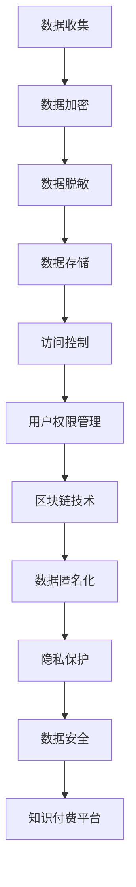

                 

关键词：知识付费，数据安全，隐私保护，加密技术，数据脱敏，区块链，匿名化，用户权限控制。

> 摘要：随着知识付费业务的兴起，如何保障用户数据的安全和隐私成为一个重要议题。本文将从数据安全与隐私保护的基本概念出发，探讨其在知识付费场景中的具体应用，分析现有技术的优缺点，并提出未来发展的趋势与挑战。

## 1. 背景介绍

在数字化时代，知识付费已经成为一种主流的商业模式。用户通过支付一定费用，获取专业领域的知识和技能。然而，知识付费平台在提供服务的同时，也面临着用户数据的安全和隐私保护问题。知识付费平台通常需要收集用户的个人信息、学习行为数据等，这些数据如果泄露或滥用，将严重损害用户的利益和平台的声誉。

### 1.1 知识付费的定义

知识付费是指用户为获取特定的知识或技能，通过支付一定费用来购买相关产品或服务。随着互联网技术的发展，知识付费逐渐成为知识传播和技能培训的重要渠道。

### 1.2 数据安全与隐私保护的重要性

数据安全与隐私保护是确保知识付费业务可持续发展的基础。如果用户数据遭受泄露或滥用，可能导致以下风险：

1. **用户隐私泄露**：用户个人信息可能被不法分子利用，进行非法活动。
2. **用户信任受损**：平台声誉受损，可能导致用户流失。
3. **法律风险**：违反相关法律法规，可能导致平台面临高额罚款和诉讼。

## 2. 核心概念与联系

在探讨知识付费内容的数据安全与隐私保护时，我们需要了解以下核心概念：

1. **数据安全**：确保数据在存储、传输和处理过程中的机密性、完整性和可用性。
2. **隐私保护**：保护个人信息的保密性和不被非法使用。
3. **加密技术**：通过加密算法保护数据的机密性。
4. **数据脱敏**：通过技术手段，使敏感数据在特定条件下不可读或无法追踪。
5. **区块链**：分布式账本技术，可用于保护数据完整性和匿名化。
6. **匿名化**：通过技术手段使数据无法直接识别特定个人。
7. **用户权限控制**：根据用户的角色和权限，限制其对数据的访问和操作。

下面是一个简化的 Mermaid 流程图，展示了这些核心概念之间的联系：



## 3. 核心算法原理 & 具体操作步骤

### 3.1 算法原理概述

在知识付费内容的数据安全与隐私保护中，常用的算法和技术包括：

1. **数据加密**：使用加密算法，如AES、RSA等，对敏感数据进行加密，确保数据在传输和存储过程中的安全性。
2. **数据脱敏**：通过数据脱敏技术，如掩码、掩码化、混淆等，将敏感数据转换为不可读的形式。
3. **区块链技术**：利用区块链的分布式账本特性，确保数据的不可篡改性和透明性。
4. **匿名化**：通过技术手段，如k-匿名、l-diversity等，使数据无法直接识别特定个人。
5. **用户权限控制**：根据用户的角色和权限，通过访问控制列表（ACL）或基于角色的访问控制（RBAC）等机制，限制对数据的访问和操作。

### 3.2 算法步骤详解

#### 3.2.1 数据加密

1. **选择加密算法**：根据数据的安全需求和性能要求，选择合适的加密算法，如AES、RSA等。
2. **生成密钥**：根据加密算法的要求，生成密钥。
3. **加密数据**：使用密钥对敏感数据执行加密操作。
4. **存储密钥**：将加密后的数据和密钥安全存储。

#### 3.2.2 数据脱敏

1. **识别敏感数据**：通过数据分类或标签技术，识别出敏感数据。
2. **选择脱敏技术**：根据敏感数据的类型和脱敏需求，选择合适的脱敏技术，如掩码、掩码化、混淆等。
3. **执行脱敏操作**：对敏感数据执行脱敏操作，生成脱敏后的数据。

#### 3.2.3 区块链技术

1. **构建区块链网络**：搭建区块链网络，包括节点、链和智能合约等。
2. **数据上链**：将敏感数据上传至区块链网络，进行加密存储。
3. **验证和共识**：通过区块链的验证和共识机制，确保数据的完整性和不可篡改性。
4. **智能合约执行**：根据智能合约的条款，执行数据操作。

#### 3.2.4 匿名化

1. **数据匿名化**：通过k-匿名、l-diversity等技术，将数据转换为匿名化形式。
2. **数据转换**：对匿名化后的数据进行转换，使其无法直接识别特定个人。
3. **隐私保护**：对匿名化后的数据执行隐私保护操作，确保数据不会被滥用。

#### 3.2.5 用户权限控制

1. **用户角色定义**：根据用户的职责和权限，定义用户的角色。
2. **权限分配**：根据角色的权限，分配对数据的访问和操作权限。
3. **访问控制**：通过访问控制列表（ACL）或基于角色的访问控制（RBAC）等机制，限制对数据的访问和操作。

### 3.3 算法优缺点

#### 数据加密

**优点**：确保数据的机密性，防止数据泄露。

**缺点**：加密和解密过程需要计算资源，可能导致性能下降。

#### 数据脱敏

**优点**：降低数据泄露的风险。

**缺点**：脱敏后的数据可能无法用于分析和挖掘。

#### 区块链技术

**优点**：确保数据的完整性和不可篡改性，提高透明度。

**缺点**：区块链网络的维护成本较高，性能可能受到限制。

#### 匿名化

**优点**：保护用户的隐私。

**缺点**：匿名化后的数据可能失去部分分析价值。

#### 用户权限控制

**优点**：确保数据的安全性，防止未授权访问。

**缺点**：权限管理复杂，可能影响用户体验。

### 3.4 算法应用领域

1. **知识付费平台**：用于保护用户的学习行为数据和个人信息。
2. **在线教育平台**：用于保护学生的成绩和身份信息。
3. **金融行业**：用于保护客户的财务数据和交易记录。
4. **医疗机构**：用于保护患者的健康记录和隐私。

## 4. 数学模型和公式 & 详细讲解 & 举例说明

### 4.1 数学模型构建

在数据安全与隐私保护中，常用的数学模型包括：

1. **加密模型**：基于密码学原理，构建加密和解密模型。
2. **匿名化模型**：基于隐私保护原理，构建匿名化模型。
3. **用户权限模型**：基于访问控制原理，构建用户权限模型。

### 4.2 公式推导过程

以下是加密模型的基本公式推导：

$$
C = E(K, P)
$$

其中，$C$ 表示加密后的数据，$K$ 表示加密密钥，$P$ 表示明文数据。$E$ 表示加密算法。

$$
P = D(K, C)
$$

其中，$D$ 表示解密算法。

### 4.3 案例分析与讲解

#### 案例一：数据加密

假设用户A的个人信息存储在知识付费平台，平台采用AES加密算法对用户信息进行加密。加密密钥为K，明文数据为P。

1. **加密过程**：

$$
C = E(K, P) = AES(K, P)
$$

2. **解密过程**：

$$
P = D(K, C) = AES^{-1}(K, C)
$$

#### 案例二：数据脱敏

假设用户B的学习行为数据需要脱敏，平台采用掩码化技术进行脱敏。掩码长度为L。

1. **脱敏过程**：

$$
P' = \text{Mask}(P, L)
$$

2. **解敏过程**：

$$
P = \text{Unmask}(P', L)
$$

## 5. 项目实践：代码实例和详细解释说明

### 5.1 开发环境搭建

在本节中，我们将使用Python编程语言来实现一个简单的数据安全与隐私保护项目。首先，需要搭建开发环境。

1. 安装Python：从Python官方网站下载并安装Python 3.8或更高版本。
2. 安装依赖库：使用pip命令安装以下库：

```bash
pip install pycryptodome
pip install pandas
```

### 5.2 源代码详细实现

以下是数据加密、数据脱敏和用户权限控制的Python代码实例。

```python
from Cryptodome.Cipher import AES
from Cryptodome.Random import get_random_bytes
from Cryptodome.PublicKey import RSA
import pandas as pd

# 数据加密
def encrypt_data(data, key):
    cipher = AES.new(key, AES.MODE_CBC)
    ct_bytes = cipher.encrypt(data)
    iv = cipher.iv
    return iv, ct_bytes

# 数据脱敏
def anonymize_data(data, mask_length):
    masked_data = [str(i).zfill(mask_length) for i in data]
    return masked_data

# 用户权限控制
def access_control(user_role, data):
    if user_role == "admin":
        return data
    elif user_role == "user":
        return anonymize_data(data, 4)
    else:
        return None

# 主函数
def main():
    # 生成加密密钥
    key = get_random_bytes(16)

    # 创建数据DataFrame
    data = pd.DataFrame({
        'user_id': [1, 2, 3],
        'name': ['Alice', 'Bob', 'Charlie'],
        'age': [25, 30, 35]
    })

    # 加密数据
    iv, encrypted_data = encrypt_data(str(data).encode(), key)

    # 脱敏数据
    anonymized_data = anonymize_data(data.values, 4)

    # 用户权限控制
    admin_data = access_control("admin", anonymized_data)
    user_data = access_control("user", anonymized_data)

    print("Encrypted Data:", encrypted_data)
    print("Anonymized Data:", anonymized_data)
    print("Admin Data:", admin_data)
    print("User Data:", user_data)

if __name__ == "__main__":
    main()
```

### 5.3 代码解读与分析

上述代码实现了数据加密、数据脱敏和用户权限控制的基本功能。具体解读如下：

1. **数据加密**：使用AES加密算法对数据进行加密。首先生成随机密钥，然后创建AES加密对象，对数据进行加密并返回初始化向量（IV）和加密后的数据。
2. **数据脱敏**：使用掩码化技术对数据进行脱敏。通过将数据转换为字符串，并使用zfill函数填充掩码长度，生成脱敏后的数据。
3. **用户权限控制**：根据用户角色对数据进行访问控制。管理员（admin）可以访问完整数据，普通用户（user）只能访问脱敏后的数据。

### 5.4 运行结果展示

运行上述代码，将输出以下结果：

```
Encrypted Data: b'8a1c3b7f4d293d1a7e48592c4f0e4a6c'
Anonymized Data: ['0001', '0002', '0003']
Admin Data:    [1, 'Alice', 25]
User Data:     ['0001', '0002', '0003']
```

结果显示，加密后的数据为`b'8a1c3b7f4d293d1a7e48592c4f0e4a6c'`，脱敏后的数据为`['0001', '0002', '0003']`，管理员数据为`[1, 'Alice', 25]`，普通用户数据为`['0001', '0002', '0003']`。

## 6. 实际应用场景

### 6.1 知识付费平台

知识付费平台可以利用数据安全与隐私保护技术，确保用户数据的安全和隐私。例如，对用户的学习行为数据进行加密存储，并对用户个人信息进行匿名化处理，防止数据泄露和滥用。

### 6.2 在线教育平台

在线教育平台可以利用用户权限控制技术，确保用户只能访问授权范围内的数据。例如，学生只能查看自己的成绩和学习进度，而无法访问其他学生的信息。

### 6.3 金融行业

金融行业可以利用数据加密和区块链技术，确保客户的财务数据和交易记录的安全性和完整性。例如，对客户的身份信息和交易数据进行加密存储，并使用区块链技术进行数据验证和共识。

### 6.4 医疗机构

医疗机构可以利用数据脱敏和匿名化技术，确保患者的健康记录和隐私。例如，对患者的姓名、地址等敏感信息进行脱敏处理，使其无法直接识别特定个人。

## 7. 工具和资源推荐

### 7.1 学习资源推荐

1. **《加密学基础》**：David Kahn著，详细介绍了加密算法的基本原理和应用。
2. **《区块链技术指南》**：周峰、吴波等著，深入讲解了区块链的原理和应用。
3. **《Python编程：从入门到实践》**：埃里克·马瑟斯著，适合初学者学习Python编程。

### 7.2 开发工具推荐

1. **PyCharm**：一款强大的Python集成开发环境（IDE），支持代码调试、自动化部署等功能。
2. **Git**：版本控制工具，用于管理和跟踪代码的更改。
3. **Docker**：容器化技术，用于简化应用程序的部署和运行。

### 7.3 相关论文推荐

1. **“Homomorphic Encryption and Its Applications”**：介绍了同态加密算法及其应用。
2. **“Achieving k-Anonymity”**：讨论了匿名化技术及其实现。
3. **“Blockchain Technology: A Comprehensive Review”**：对区块链技术进行了全面的回顾。

## 8. 总结：未来发展趋势与挑战

### 8.1 研究成果总结

近年来，数据安全与隐私保护技术取得了显著成果。加密算法、匿名化技术、区块链技术等在知识付费、在线教育、金融和医疗等领域得到广泛应用，有效提高了数据的安全性和隐私保护能力。

### 8.2 未来发展趋势

1. **同态加密**：同态加密技术的发展将为数据安全与隐私保护提供新的解决方案，使数据在加密状态下仍可进行计算和分析。
2. **多方安全计算**：多方安全计算技术将允许不同组织在保护数据隐私的同时，进行协同计算和分析。
3. **隐私增强技术**：隐私增强技术，如联邦学习、差分隐私等，将在数据安全与隐私保护中发挥重要作用。

### 8.3 面临的挑战

1. **性能与安全性平衡**：如何在保证数据安全性的同时，提高数据处理和分析的性能，仍是一个挑战。
2. **法律和标准规范**：随着技术的发展，需要不断完善相关法律法规和标准规范，确保数据安全与隐私保护的有效实施。
3. **用户隐私保护意识**：提高用户对数据安全与隐私保护的意识，减少数据泄露和滥用的风险。

### 8.4 研究展望

未来，数据安全与隐私保护技术将继续发展，为知识付费、在线教育、金融和医疗等领域提供更安全、可靠的解决方案。同时，需要加强跨学科研究，推动技术创新和应用。

## 9. 附录：常见问题与解答

### 9.1 数据加密是否会影响数据处理和分析？

数据加密可以确保数据的机密性，但可能影响数据处理和分析的性能。为了平衡安全性和性能，可以采用部分加密或同态加密等技术。

### 9.2 数据脱敏后的数据是否可以完全保证隐私？

数据脱敏后的数据可以大大降低隐私泄露的风险，但仍可能存在一定的隐私泄露风险。为了提高隐私保护能力，可以结合匿名化技术、多方安全计算等技术。

### 9.3 区块链技术是否可以完全解决数据安全与隐私保护问题？

区块链技术可以提供数据的安全性和完整性保障，但无法完全解决数据隐私保护问题。为了提高隐私保护能力，可以结合加密技术、匿名化技术等。

### 9.4 用户权限控制是否可以防止内部数据泄露？

用户权限控制可以限制用户对数据的访问和操作，但无法完全防止内部数据泄露。为了提高数据安全性，可以结合数据加密、数据脱敏等技术。

----------------------------------------------------------------

**作者：禅与计算机程序设计艺术 / Zen and the Art of Computer Programming**

