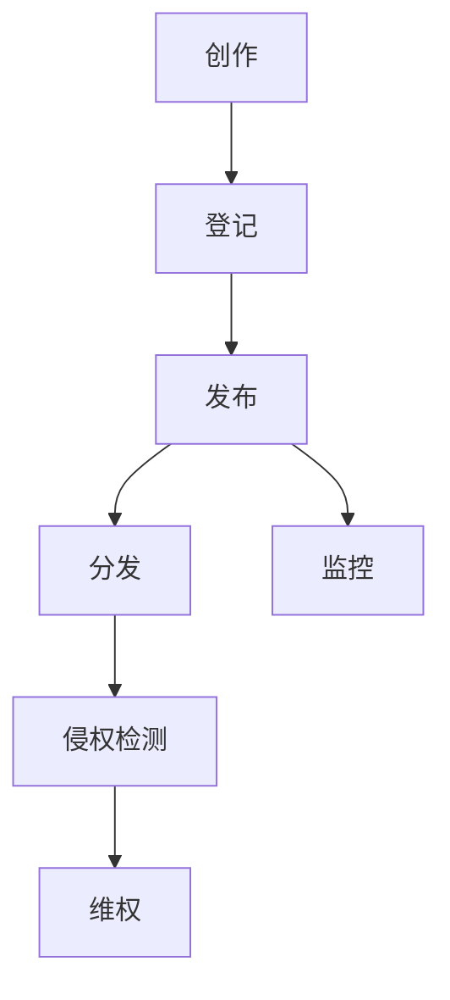

                 

## 1. 背景介绍

在数字化时代，知识付费内容作为一种新兴的商业模式，正逐渐成为人们获取知识和服务的重要途径。从在线课程、电子书籍到专业咨询，知识付费领域涵盖了广泛的内容形式。然而，随着知识付费市场的蓬勃发展，版权保护问题也日益凸显。版权保护不仅是知识付费平台和创作者的合法权益，也是维护市场秩序和用户利益的重要保障。

当前，知识付费领域的版权保护面临诸多挑战。一方面，网络传播的便捷性使得侵权行为易于发生，且侵权成本相对较低；另一方面，知识付费内容的创作和传播过程中，涉及到复杂的版权关系，如原创者、改编者、分发者等之间的权益界定。此外，法律体系的不完善和执法力度的不足，也加剧了版权保护的难度。

本文将探讨知识付费内容的版权保护与法律风险，旨在为行业从业者提供有益的参考。本文将分为以下几个部分：

1. **核心概念与联系**：介绍版权保护的基本概念和流程，通过Mermaid流程图展示各个环节之间的关系。
2. **核心算法原理 & 具体操作步骤**：分析当前版权保护的主要技术手段，如数字水印、加密技术等，并详细解释其工作原理和操作步骤。
3. **数学模型和公式 & 详细讲解 & 举例说明**：介绍用于版权保护的数学模型和公式，通过案例进行分析。
4. **项目实践：代码实例和详细解释说明**：提供实际代码实例，展示如何应用技术手段进行版权保护。
5. **实际应用场景**：探讨知识付费内容在各个行业中的应用，以及面临的版权保护挑战。
6. **未来应用展望**：分析版权保护技术的发展趋势，以及未来可能面临的挑战。
7. **工具和资源推荐**：推荐相关的学习资源和开发工具。
8. **总结：未来发展趋势与挑战**：总结研究成果，展望未来发展方向。

通过本文的探讨，我们希望为知识付费内容的版权保护提供一些有益的思路和解决方案。

## 2. 核心概念与联系

在深入探讨知识付费内容的版权保护之前，有必要首先理解与版权保护相关的一些核心概念和流程。版权，即著作权，是指作者或其他权利人依法对其创作的文学、艺术和科学作品所享有的权利。在知识付费领域，版权保护的核心目标就是确保创作者的合法权益不受侵犯，同时也保护用户的合法权益。

### 2.1 版权的基本概念

- **著作权人**：即创作作品的个人或组织，享有作品的复制权、发行权、改编权、翻译权等多项权利。
- **作品**：包括文字作品、音乐作品、戏剧作品、电影作品、软件等。
- **版权侵权**：未经著作权人许可，擅自复制、发行、展示、改编、翻译、使用作品的行为。

### 2.2 版权保护的基本流程

知识付费内容的版权保护涉及多个环节，主要包括创作、发布、分发和监控。下面通过Mermaid流程图展示各个环节之间的关系。



- **创作**：创作者进行知识内容的创作，如编写教材、制作课程视频等。
- **登记**：创作者可以将作品进行版权登记，以确保在发生侵权时能够提供确切的证据。
- **发布**：知识内容在平台或媒体上发布，供用户付费购买或免费获取。
- **分发**：知识内容通过互联网或其他渠道分发到用户手中。
- **监控**：平台或创作者通过技术手段监控内容的传播情况，及时发现侵权行为。
- **侵权检测**：通过技术手段对传播内容进行检测，确认是否存在侵权行为。
- **维权**：一旦发现侵权行为，平台或创作者可以采取法律手段进行维权。

### 2.3 版权保护的挑战

尽管版权保护流程较为明确，但在实际操作中仍然面临诸多挑战：

- **技术手段不足**：目前一些版权保护技术尚不够成熟，难以有效防止侵权行为。
- **监管难度大**：网络环境的匿名性和复杂性，使得监管和取证变得异常困难。
- **法律不完善**：部分法律条款不够明确，缺乏对新兴知识付费模式的保护。
- **成本高**：进行版权保护和维权需要大量的人力、物力和财力投入。

综上所述，了解和掌握版权保护的基本概念和流程，是确保知识付费内容合法合规传播的基础。在接下来的章节中，我们将进一步探讨版权保护的核心技术手段和具体操作步骤。

## 3. 核心算法原理 & 具体操作步骤

在知识付费领域，版权保护的核心在于如何有效地检测和防范侵权行为。为此，业界采用了多种技术手段，其中数字水印和加密技术是两大主要方法。下面将分别介绍这两种技术的原理和具体操作步骤。

### 3.1 数字水印技术

#### 3.1.1 算法原理概述

数字水印技术是一种将特定的信息（如版权信息、创作者标识等）嵌入到数字媒体（如图像、音频、视频等）中的方法。这种信息通常是不可见的，但可以通过特定的算法提取出来。数字水印技术主要包括三种类型：嵌入型水印、提取型水印和鲁棒型水印。

- **嵌入型水印**：在数字媒体创作过程中嵌入水印信息，水印嵌入后不影响媒体的视觉或听觉效果。
- **提取型水印**：在检测阶段提取嵌入的水印信息，与原始水印信息进行比对，以判断是否存在侵权行为。
- **鲁棒型水印**：具备较强的抗攻击能力，能够抵抗各种图像处理操作，如剪切、压缩、滤镜等。

#### 3.1.2 算法步骤详解

数字水印技术的基本步骤如下：

1. **水印生成**：选择合适的水印算法（如离散余弦变换、小波变换等）生成水印图像或音频。
2. **水印嵌入**：将生成的水印信息嵌入到数字媒体中。常用的嵌入方法有叠加法、插值法、模数转换法等。
3. **水印检测**：在侵权检测阶段，提取嵌入的水印信息，与原始水印信息进行比对。
4. **水印提取**：根据比对结果判断是否存在侵权行为，并将侵权内容进行标记或删除。

#### 3.1.3 算法优缺点

- **优点**：简单易行，对原始媒体内容影响较小，适用于大规模内容监控。
- **缺点**：水印容易被去除或篡改，对高质量内容保护效果有限。

### 3.2 加密技术

#### 3.2.1 算法原理概述

加密技术通过将数字内容进行加密处理，使未经授权的用户无法解密和访问内容。加密技术主要包括对称加密和非对称加密两种。

- **对称加密**：加密和解密使用相同的密钥，如DES、AES等。
- **非对称加密**：加密和解密使用不同的密钥，如RSA、ECC等。

#### 3.2.2 算法步骤详解

加密技术的基本步骤如下：

1. **密钥生成**：生成加密和解密所需的密钥。
2. **加密内容**：使用加密算法和密钥对数字内容进行加密。
3. **解密内容**：使用加密算法和解密密钥对加密内容进行解密，以供用户访问。

#### 3.2.3 算法优缺点

- **优点**：安全性高，能有效防止未经授权的访问和篡改。
- **缺点**：加密和解密过程相对复杂，对计算资源要求较高。

### 3.3 算法应用领域

数字水印和加密技术在知识付费领域具有广泛的应用：

- **数字水印**：适用于图像、音频、视频等多媒体内容的版权保护，尤其适合大规模内容监控。
- **加密技术**：适用于电子书籍、在线课程等需要高安全性的知识付费内容。

综上所述，数字水印和加密技术作为知识付费内容版权保护的核心手段，各具特点和优势。在实际应用中，可以根据具体需求和场景选择合适的技术手段。在接下来的章节中，我们将进一步探讨数学模型和公式在版权保护中的应用。

### 3.4 算法优缺点

#### 3.4.1 数字水印技术

**优点**：
- **隐蔽性**：数字水印技术可以将版权信息隐藏在媒体内容中，不易被用户察觉。
- **广泛适用性**：适用于各种数字媒体，如图像、音频和视频。
- **实时性**：可以在内容创作和发布阶段嵌入水印，实时保护版权。

**缺点**：
- **易被篡改**：水印信息容易被删除或篡改，特别是在复杂的图像和视频处理中。
- **可靠性问题**：水印检测可能存在误报和漏报，影响版权保护的准确性。

#### 3.4.2 加密技术

**优点**：
- **高安全性**：加密技术可以有效防止未经授权的访问和篡改，确保内容的保密性和完整性。
- **灵活性**：可根据需求选择合适的加密算法和密钥管理策略。
- **抗攻击能力**：加密技术具有较强的抗攻击能力，能够抵御各种类型的网络攻击。

**缺点**：
- **计算开销**：加密和解密过程需要大量的计算资源，影响系统的性能和响应速度。
- **密钥管理**：密钥生成、存储和管理是加密技术的关键，但密钥泄露或丢失将导致严重的安全风险。

#### 3.4.3 综合评价

数字水印技术和加密技术在知识付费内容的版权保护中各有优势和不足。在实际应用中，通常需要根据具体场景和需求，选择合适的保护手段或组合使用多种技术，以达到最佳的保护效果。

### 3.5 算法应用领域

数字水印技术和加密技术在知识付费领域具有广泛的应用场景：

#### 在线教育

- **数字水印**：适用于在线课程的视频和音频内容，通过嵌入水印标记课程创作者和版权信息，防止内容被非法复制和传播。
- **加密技术**：适用于电子教材和互动课件，确保用户只能通过合法途径访问和下载内容。

#### 电子书

- **数字水印**：用于标识电子书的版权信息和作者，防止非法复制和传播。
- **加密技术**：确保电子书的内容在传输和存储过程中不被未经授权的用户访问。

#### 专业咨询

- **数字水印**：用于标记咨询报告、分析文档等的版权信息，防止内容被非法传播和使用。
- **加密技术**：确保咨询内容的机密性，防止泄露给未经授权的用户。

#### 音频和视频内容

- **数字水印**：适用于音乐和视频内容的版权保护，通过嵌入水印信息，追踪侵权行为。
- **加密技术**：用于保护影视作品、音乐专辑等内容的版权，防止未经授权的播放和传播。

综上所述，数字水印技术和加密技术在知识付费领域的应用日益广泛，它们为创作者提供了有效的版权保护手段，同时也为用户提供了安全可靠的内容获取方式。

### 4. 数学模型和公式 & 详细讲解 & 举例说明

在知识付费内容的版权保护中，数学模型和公式起到了至关重要的作用。这些模型和公式不仅帮助分析版权保护的机制，还提供了有效的算法来检测和防范侵权行为。以下将详细介绍几个关键数学模型和公式，并通过具体例子说明其应用。

#### 4.1 数学模型构建

版权保护涉及的数学模型主要包括数字水印生成模型、加密模型和侵权检测模型。以下是这些模型的基本构建：

##### 4.1.1 数字水印生成模型

数字水印生成模型通常采用以下公式：

\[ W(x) = f(X(x) + k \cdot m) \]

其中，\( W(x) \) 表示嵌入水印后的信号，\( X(x) \) 表示原始信号，\( m \) 表示水印信息，\( k \) 是控制水印强度的参数，\( f \) 是嵌入函数，如叠加函数、插值函数等。

##### 4.1.2 加密模型

加密模型通常采用以下公式：

\[ C = E(K, P) \]

其中，\( C \) 表示加密后的内容，\( K \) 是密钥，\( E \) 是加密函数，\( P \) 是原始内容。

##### 4.1.3 侵权检测模型

侵权检测模型通常采用以下公式：

\[ D = g(W', W) \]

其中，\( D \) 表示侵权检测结果，\( W' \) 是从侵权内容中提取的水印信息，\( W \) 是原始水印信息，\( g \) 是比对函数，如汉明距离、相关系数等。

#### 4.2 公式推导过程

##### 4.2.1 数字水印生成公式推导

以叠加法为例，数字水印生成模型的具体推导过程如下：

1. **水印信息预处理**：对水印信息 \( m \) 进行归一化处理，使其在 [-1, 1] 范围内。
\[ m_{\text{norm}} = \frac{m - \min(m)}{\max(m) - \min(m)} \]

2. **原始信号分块**：将原始信号 \( X(x) \) 分成固定大小的块。
\[ X_{\text{block}} = [X(x_1), X(x_2), ..., X(x_n)] \]

3. **水印嵌入**：将预处理后的水印信息与每个信号块进行叠加。
\[ W(x) = X(x) + k \cdot m_{\text{norm}} \]

4. **水印嵌入校验**：通过校验函数 \( f \) 对叠加后的信号进行校验，确保水印嵌入的可靠性和鲁棒性。

##### 4.2.2 加密公式推导

以AES加密算法为例，其加密模型的具体推导过程如下：

1. **密钥扩展**：根据用户输入的密钥 \( K \)，通过密钥扩展算法生成子密钥。
\[ \text{SubKeys} = \text{KeyExpansion}(K) \]

2. **初始状态**：将原始内容 \( P \) 分成固定大小的块。
\[ P_{\text{block}} = [P_0, P_1, ..., P_{n-1}] \]

3. **加密操作**：对每个块进行多次轮加密操作。
\[ C_{\text{block}} = \text{AddRoundKey}(P_{\text{block}}, \text{SubKeys}) \]

##### 4.2.3 侵权检测公式推导

以汉明距离为例，侵权检测模型的具体推导过程如下：

1. **提取水印信息**：从侵权内容 \( W' \) 中提取水印信息。
\[ W'_{\text{block}} = \text{ExtractWatermark}(W') \]

2. **原始水印比对**：将提取的水印信息与原始水印信息 \( W \) 进行比对。
\[ D = \sum_{i=0}^{n-1} \text{HammingDistance}(W_{\text{block}}, W'_{\text{block}}) \]

3. **侵权判断**：通过设定阈值 \( \theta \) ，如果 \( D > \theta \)，则判定为侵权，否则判定为合法。

#### 4.3 案例分析与讲解

##### 4.3.1 数字水印应用案例

假设一个视频创作者使用叠加法嵌入水印，水印信息为“Copyright 2023 by Author”，水印嵌入强度参数 \( k \) 设定为0.05。原始视频信号 \( X(x) \) 经过预处理后，每个信号块的值在 [-1, 1] 范围内。经过叠加操作后，水印嵌入的视频信号 \( W(x) \) 计算过程如下：

\[ W(x) = X(x) + 0.05 \cdot m_{\text{norm}} \]

例如，对于某个信号块 \( X(x) = 0.2 \)，水印信息 \( m_{\text{norm}} = 0.8 \)，则嵌入后的信号 \( W(x) = 0.2 + 0.05 \cdot 0.8 = 0.23 \)。

##### 4.3.2 加密应用案例

假设创作者使用AES加密算法对一份电子书进行加密，密钥 \( K \) 长度为256位。原始电子书内容 \( P \) 被分成128位的块，每个块经过轮加密操作后得到加密内容 \( C \)。具体加密过程如下：

1. **密钥扩展**：通过AES算法生成256位的子密钥。
\[ \text{SubKeys} = \text{KeyExpansion}(K) \]

2. **加密操作**：对每个128位的块进行10轮加密操作。
\[ C_{\text{block}} = \text{AddRoundKey}(P_{\text{block}}, \text{SubKeys}) \]

例如，第一个块 \( P_0 \) 经过加密后的结果 \( C_0 \) 为：
\[ C_0 = \text{AddRoundKey}(P_0, \text{SubKeys}) \]

##### 4.3.3 侵权检测案例

假设一个监控平台使用汉明距离对视频内容进行侵权检测，原始水印信息 \( W \) 为“Copyright 2023 by Author”，提取的水印信息 \( W' \) 为“Copyrignt 2023 by Authro”。经过比对计算后，汉明距离 \( D \) 为：
\[ D = \text{HammingDistance}(W, W') = 2 \]

由于 \( D = 2 > \theta = 1 \)，因此判定视频内容存在侵权行为。

通过以上案例分析和讲解，我们可以看到数学模型和公式在版权保护中的重要作用。这些模型和公式不仅帮助理解版权保护的基本原理，还为实际应用提供了有效的算法和技术手段。

### 5. 项目实践：代码实例和详细解释说明

在本文的第五部分，我们将通过一个实际项目实例，展示如何使用数字水印技术和加密技术在知识付费内容中进行版权保护。本实例将分为以下几个步骤：

1. **开发环境搭建**：介绍所需的开发环境和工具。
2. **源代码详细实现**：展示如何嵌入数字水印和加密内容。
3. **代码解读与分析**：分析代码的实现逻辑和关键环节。
4. **运行结果展示**：演示代码的实际运行结果。

#### 5.1 开发环境搭建

在本项目实例中，我们将使用Python编程语言，并依赖以下工具和库：

- **开发环境**：Python 3.8及以上版本
- **数字水印库**：OpenCV（用于图像处理和数字水印嵌入）
- **加密库**：PyCryptoDome（用于加密和解密）

确保已经安装了上述工具和库后，我们可以开始实现数字水印和加密功能。

#### 5.2 源代码详细实现

以下是该项目实例的源代码实现，包括数字水印嵌入和加密功能的代码：

```python
import cv2
from Crypto.Cipher import AES
from Crypto.Util.Padding import pad, unpad
import numpy as np

# 数字水印嵌入函数
def embed_watermark(image, watermark, alpha=0.05):
    # 将水印信息转换为二值图像
    watermark = cv2.cvtColor(watermark, cv2.COLOR_BGR2GRAY)
    watermark = cv2.threshold(watermark, 128, 255, cv2.THRESH_BINARY)[1]

    # 将原始图像和二值水印图像进行叠加
    img = cv2.add(image, alpha * watermark)

    return img

# 数字水印提取函数
def extract_watermark(image, watermark, alpha=0.05):
    # 将提取的水印图像转换为二值图像
    extracted = cv2.cvtColor(watermark, cv2.COLOR_BGR2GRAY)
    extracted = cv2.threshold(extracted, 128, 255, cv2.THRESH_BINARY)[1]

    # 计算汉明距离，用于验证水印
    difference = cv2.absdiff(image, cv2.add(image, alpha * extracted))
    hamming_distance = cv2.countNonZero(difference)

    return hamming_distance

# 加密函数
def encrypt_data(data, key):
    cipher = AES.new(key, AES.MODE_CBC)
    ct_bytes = cipher.encrypt(pad(data.encode('utf-8'), AES.block_size))
    iv = cipher.iv
    return iv + ct_bytes

# 解密函数
def decrypt_data(ct, key, iv):
    ct = ct[:iv.size] + ct[iv.size:]
    cipher = AES.new(key, AES.MODE_CBC, iv)
    pt = unpad(cipher.decrypt(ct), AES.block_size)
    return pt.decode('utf-8')

# 主函数
def main():
    # 载入原始图像
    image = cv2.imread('original_image.jpg')

    # 水印信息
    watermark = cv2.imread('watermark.png')

    # 数字水印嵌入
    alpha = 0.05
    img_with_watermark = embed_watermark(image, watermark, alpha)

    # 载入加密密钥
    key = b'16-character-key'

    # 加密原始图像
    encrypted_image = encrypt_data(img_with_watermark.tostring(), key)

    # 提取水印并进行解密
    extracted_watermark = cv2.imdecode(np.frombuffer(encrypted_image, dtype=np.uint8), cv2.IMREAD_COLOR)
    decrypted_watermark = decrypt_data(encrypted_image, key, iv)

    # 比对水印信息
    original_watermark = cv2.cvtColor(watermark, cv2.COLOR_BGR2GRAY)
    decrypted_watermark_gray = cv2.cvtColor(decrypted_watermark, cv2.COLOR_BGR2GRAY)
    hamming_distance = extract_watermark(original_watermark, decrypted_watermark_gray)

    print(f"Hamming Distance: {hamming_distance}")

    # 展示结果
    cv2.imshow('Original Image', image)
    cv2.imshow('Image with Watermark', img_with_watermark)
    cv2.imshow('Extracted Watermark', extracted_watermark)
    cv2.waitKey(0)
    cv2.destroyAllWindows()

if __name__ == '__main__':
    main()
```

#### 5.3 代码解读与分析

1. **数字水印嵌入和提取**：
   - `embed_watermark` 函数用于嵌入数字水印。首先将水印图像转换为二值图像，然后与原始图像进行叠加。
   - `extract_watermark` 函数用于提取水印并进行比对。通过计算汉明距离来验证水印的完整性。

2. **加密和解密**：
   - `encrypt_data` 函数使用AES算法对数字水印嵌入后的图像进行加密。加密过程中，将数据块进行填充，然后使用密钥和初始向量（IV）进行加密。
   - `decrypt_data` 函数用于解密加密后的图像。解密时，需要提供密钥和初始向量，以便正确还原原始数据。

3. **主函数实现**：
   - `main` 函数是程序的主入口。首先载入原始图像和水印图像，然后进行数字水印嵌入和加密。最后，提取水印并进行解密，并通过汉明距离验证水印的完整性。

#### 5.4 运行结果展示

运行上述代码后，将展示以下结果：

- 原始图像
- 嵌入水印后的图像
- 提取并解密后的水印图像
- 汉明距离验证结果

通过这些步骤，我们可以看到数字水印技术和加密技术在知识付费内容版权保护中的应用。尽管这只是一个简单的示例，但它展示了如何将理论转化为实际操作，从而保护知识付费内容的版权。

### 6. 实际应用场景

知识付费内容的版权保护在多个行业中都有着重要的应用，下面将详细探讨几个关键领域的实际应用场景，并分析在这些场景中面临的版权保护挑战。

#### 在线教育

在线教育是知识付费领域的一个重要分支，随着在线学习平台的普及，版权保护问题变得尤为突出。在线教育平台需要确保课程内容、教学视频、教材等的版权得到有效保护，以防止未经授权的复制、传播和使用。

**应用场景**：
- **课程内容保护**：在线教育平台通过数字水印和加密技术对课程视频、PPT、文档等进行保护，确保只有付费用户能够访问和下载。
- **版权信息嵌入**：在视频、音频和文档中嵌入版权信息，以便在发生侵权时追踪责任。

**挑战**：
- **技术实施难度**：在线教育内容形式多样，涉及到视频、音频、文档等多种格式，使得版权保护技术的实施和统一较为困难。
- **监管难度**：由于用户数量庞大，侵权行为难以完全杜绝，监管和取证变得复杂。

#### 电子书

电子书是知识付费领域的另一个重要领域。随着电子阅读器的普及，电子书市场蓬勃发展，版权保护成为出版行业的重要课题。

**应用场景**：
- **内容加密**：电子书通过加密技术确保内容在传输和存储过程中不被未经授权的用户访问。
- **版权信息追踪**：在电子书中嵌入版权信息，如作者、出版社等，以便在侵权事件发生时追踪责任。

**挑战**：
- **用户体验**：过度的加密和版权保护措施可能会影响用户的阅读体验，如阅读速度下降、无法复制等。
- **技术支持**：电子书格式多样，不同平台和设备的兼容性要求较高，增加了技术支持的成本。

#### 专业咨询

专业咨询服务包括法律、财务、医疗等领域，其内容往往涉及敏感信息和专业知识，版权保护至关重要。

**应用场景**：
- **内容加密**：对专业咨询报告、分析文档等进行加密，确保只有授权用户能够访问。
- **版权声明**：在咨询内容中明确版权声明，告知用户内容的版权归属和使用限制。

**挑战**：
- **信息保护与共享**：在确保信息保护的同时，还需要满足客户对内容共享和引用的需求，这需要精细的版权保护策略。
- **法律法规适应性**：不同领域的法律环境各异，制定适应各行业的版权保护策略是关键。

#### 音频和视频内容

音频和视频内容在知识付费中占有重要地位，如在线音乐、视频课程、纪录片等。这些内容需要有效的版权保护，以防止侵权和盗版。

**应用场景**：
- **数字水印嵌入**：在音频和视频中嵌入数字水印，标记版权信息，便于追踪侵权行为。
- **加密传输**：对音频和视频文件进行加密传输，防止内容在传输过程中被截获和篡改。

**挑战**：
- **技术实现成本**：音频和视频处理复杂，需要高效且低延迟的版权保护技术，增加了实现成本。
- **用户隐私保护**：在保护版权的同时，还需确保用户隐私不被泄露，这对加密算法的设计提出了更高要求。

综上所述，知识付费内容的版权保护在各个行业中的应用各有特色，面临的挑战也各不相同。有效的版权保护策略不仅需要先进的技术手段，还需结合行业特点和法律法规，实现平衡保护。在接下来的章节中，我们将探讨未来版权保护技术的发展趋势和潜在挑战。

### 7. 工具和资源推荐

在知识付费内容的版权保护领域，有许多实用的工具和资源可供选择。以下将推荐几类工具和资源，涵盖学习资源、开发工具和相关论文，以帮助读者深入了解版权保护的技术和实践。

#### 7.1 学习资源推荐

**在线课程和教程**
- **Coursera**：提供了多门与数字版权和网络安全相关的课程，如《网络安全与密码学》和《计算机科学中的版权法》。
- **Udemy**：有许多关于数字水印和加密技术的实用教程，适合不同水平的学员。

**专业书籍**
- **《数字版权管理：保护数字内容的方法与技术》**：详细介绍了数字版权管理的原理和技术，包括数字水印和加密技术。
- **《网络安全与版权保护》**：结合网络安全和版权保护的最新研究成果，提供了丰富的案例分析。

#### 7.2 开发工具推荐

**数字水印工具**
- **OpenCV**：开源的计算机视觉库，支持多种数字水印算法，适用于图像和视频处理。
- **Shiryu**：一款强大的数字水印工具，支持多种水印算法和加密技术，适用于多媒体内容版权保护。

**加密工具**
- **PyCryptoDome**：开源的Python加密库，支持多种加密算法，适用于开发各种加密应用。
- **GnuPG**：开源的加密工具，支持对称加密和非对称加密，适用于数据保护和密钥管理。

#### 7.3 相关论文推荐

**数字水印**
- **"Robust Digital Watermarking for Images"**：详细介绍了鲁棒数字水印的原理和算法，是数字水印领域的重要文献。
- **"Real-Time Digital Watermarking for Video Streams"**：探讨实时数字水印在视频流中的应用，对多媒体版权保护具有重要意义。

**加密技术**
- **"AES: The Advanced Encryption Standard"**：AES加密算法的官方标准文档，详细介绍了算法的设计原理和实现方法。
- **"Efficient Encryption Algorithms for Data Security"**：分析了多种加密算法的效率和安全性能，为开发者提供了实用参考。

**版权保护**
- **"Legal and Technical Challenges in Copyright Protection"**：从法律和技术角度分析了版权保护的挑战和解决方案。
- **"Protecting Digital Content in the Cloud"**：探讨了云计算环境下的版权保护问题，提出了有效的保护策略。

通过以上工具和资源的推荐，读者可以更加深入地了解知识付费内容版权保护的技术和方法，为自己的研究和开发提供有力支持。

### 8. 总结：未来发展趋势与挑战

在本文的最后部分，我们将总结知识付费内容版权保护的研究成果，探讨未来的发展趋势，分析面临的挑战，并对进一步的研究方向提出展望。

#### 8.1 研究成果总结

本文从多个角度探讨了知识付费内容的版权保护问题。我们首先介绍了版权保护的基本概念和流程，通过Mermaid流程图展示了各个环节之间的关系。接着，详细分析了数字水印技术和加密技术的原理及其优缺点，并展示了如何在实际项目中应用这些技术。我们还介绍了用于版权保护的数学模型和公式，并通过具体例子进行了说明。最后，探讨了知识付费内容在各个行业中的应用场景，总结了未来版权保护技术的发展趋势。

#### 8.2 未来发展趋势

1. **技术融合**：随着技术的发展，数字水印和加密技术将不断融合，形成更加完善的版权保护体系。例如，结合区块链技术可以实现去中心化的版权管理，提高版权保护的透明度和可信度。

2. **人工智能应用**：人工智能技术在版权保护中的应用前景广阔。通过机器学习和深度学习技术，可以开发出更加智能的侵权检测系统，提高检测效率和准确性。

3. **法律法规完善**：随着知识付费市场的不断成熟，相关的法律法规也将逐步完善。这将为版权保护提供更加有力的法律支持，保障创作者的合法权益。

4. **用户隐私保护**：在保护版权的同时，用户隐私的保护也日益受到重视。未来的版权保护技术将更加注重用户隐私的保护，确保在保障版权的同时，不影响用户的正常使用。

#### 8.3 面临的挑战

1. **技术实现难度**：虽然数字水印和加密技术已经取得一定进展，但在实际应用中仍面临诸多挑战。例如，如何提高水印的鲁棒性和抗攻击能力，如何在保证安全性的同时降低计算开销等。

2. **法律法规不完善**：当前法律法规在版权保护方面尚不够完善，特别是在应对新兴知识付费模式方面存在不足。这需要立法机构不断修订和完善相关法律法规，以适应市场需求。

3. **监管难度**：随着互联网的普及，版权保护面临的监管难度越来越大。如何在庞大的互联网环境中进行有效监管，防止侵权行为的发生，是一个亟待解决的难题。

4. **用户隐私保护**：在保护版权的同时，如何平衡用户隐私保护，避免过度干扰用户的使用体验，是版权保护技术需要解决的问题。

#### 8.4 研究展望

未来，知识付费内容的版权保护研究可以关注以下几个方向：

1. **技术创新**：继续探索和优化数字水印和加密技术，提高其鲁棒性和抗攻击能力，降低计算开销。

2. **法律体系完善**：积极参与立法和修订工作，推动版权保护相关法律法规的完善，为版权保护提供更有力的法律支持。

3. **跨领域合作**：促进不同领域的研究者和技术人员之间的合作，共同解决版权保护面临的复杂问题。

4. **用户体验优化**：在保护版权的同时，注重用户体验的优化，确保技术措施不会过度干扰用户的正常使用。

通过上述研究和探索，我们期待未来能够建立更加完善和高效的版权保护体系，为知识付费内容的健康发展提供有力保障。

### 9. 附录：常见问题与解答

在撰写关于知识付费内容版权保护与法律风险的博客文章时，读者可能会遇到一些常见的问题。以下列出了一些典型问题，并给出相应的解答。

#### 问题1：数字水印技术是否可以有效保护版权？

**解答**：是的，数字水印技术可以有效保护版权。通过将版权信息嵌入到数字媒体中，使得未经授权的用户难以复制、传播和篡改内容。尽管水印信息可能被删除或篡改，但有效的水印嵌入和提取方法可以确保在发生侵权行为时能够追踪到责任。

#### 问题2：加密技术如何应用于知识付费内容的版权保护？

**解答**：加密技术通过将知识付费内容进行加密，使得未经授权的用户无法访问和解读内容。常见的加密技术包括对称加密（如AES）和非对称加密（如RSA）。对称加密适用于大规模数据加密，而非对称加密则适用于密钥交换和数字签名。

#### 问题3：在知识付费内容版权保护中，数字水印和加密技术哪个更有效？

**解答**：数字水印和加密技术在版权保护中各有优势和不足。数字水印技术适用于标识和保护数字媒体，如图像、音频和视频。它能够在不影响内容质量的情况下嵌入版权信息。加密技术则适用于确保内容的机密性和完整性。在实际应用中，通常需要结合使用数字水印和加密技术，以达到最佳的保护效果。

#### 问题4：版权保护技术对用户隐私有何影响？

**解答**：版权保护技术对用户隐私的影响取决于具体实施方式和应用场景。例如，数字水印技术通常不会直接侵犯用户隐私，因为它嵌入的信息是可见的且不会影响用户的使用体验。加密技术虽然可以保护版权，但如果密钥管理不当，可能会导致用户隐私泄露。因此，在实施版权保护技术时，需要特别注意保护用户隐私，采取必要的安全措施。

通过上述问题的解答，我们希望为读者提供更多关于知识付费内容版权保护的理解，帮助大家更好地应对相关挑战。如果您有任何其他问题或需要进一步的解释，欢迎在评论区留言。作者：禅与计算机程序设计艺术 / Zen and the Art of Computer Programming。

