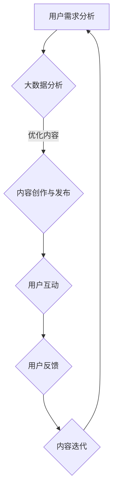

                 

在当今数字化时代，知识付费行业正以前所未有的速度发展。随着人们对于个性化、专业化知识的渴求不断增长，知识付费平台如雨后春笋般涌现。然而，如何在众多竞争者中脱颖而出，提升内容的内在价值，成为知识付费创业的核心挑战。本文将深入探讨如何通过技术手段和创新思维，提升知识付费内容的价值，帮助创业者在这个领域取得成功。

## 关键词

- **知识付费**
- **内容价值**
- **创业策略**
- **个性化推荐**
- **用户参与度**
- **互动学习**
- **数据分析**
- **用户体验**

## 摘要

本文旨在探讨知识付费创业中的内容价值提升策略。通过对当前知识付费市场的分析，结合技术手段和创新思维，我们提出了一系列提升内容价值的实用方法。本文将涵盖从内容创作到用户反馈的全过程，旨在为创业者提供一套完整的解决方案，帮助他们在竞争激烈的市场中脱颖而出。

## 1. 背景介绍

### 知识付费的兴起

知识付费，简单来说，就是用户为获取特定的知识和信息而付费。这种模式的出现源于互联网和移动设备的发展，使得信息的传播和获取变得更加便捷。随着人们对专业知识和技能的需求日益增长，知识付费逐渐成为了一种新的商业模式。

近年来，知识付费市场呈现出爆发式增长。根据某市场研究机构的报告，全球知识付费市场规模在2022年已经达到了数百亿美元，并预计在未来几年将继续保持高速增长。这种增长不仅体现在传统教育领域，如在线课程、培训班等，还涵盖了更多垂直领域，如职业规划、健康养生、投资理财等。

### 知识付费的现状

目前，知识付费市场已经形成了几大主要参与者，包括一些知名的在线教育平台、自媒体平台和专业的内容提供商。这些平台通过提供优质、专业的知识内容，吸引了大量的用户。

然而，随着竞争的加剧，用户的选择越来越多，平台的内容同质化现象日益严重。这使得提升内容价值成为知识付费创业者的核心任务。如何通过技术手段和创新思维，提升内容的价值，吸引和留住用户，是每个创业者都需要认真思考的问题。

## 2. 核心概念与联系

### 2.1 知识付费的核心概念

知识付费的核心在于“知识”和“付费”。首先，“知识”是付费内容的本质，它是用户愿意为之付费的核心价值所在。其次，“付费”是知识传播的桥梁，它确保了知识创作者的利益，也激励了更多高质量内容的产生。

### 2.2 内容价值的概念

内容价值是指在特定市场环境下，知识内容对用户产生的实际效用。这包括内容的实用性、专业性、创新性、用户参与度等多个方面。提升内容价值意味着提升用户对内容的满意度，从而增加用户粘性，提高平台的竞争力。

### 2.3 技术与内容价值的联系

技术手段在提升内容价值中起到了至关重要的作用。通过大数据分析、人工智能、用户互动等技术的应用，可以更好地理解用户需求，优化内容创作，提高用户参与度，从而提升整体内容价值。

### Mermaid 流程图



在这个流程图中，用户需求分析是起点，通过大数据分析，平台可以更好地理解用户的需求，从而优化内容创作。用户互动和反馈则是内容迭代的重要环节，通过不断调整和优化，最终提升内容价值。

## 3. 核心算法原理 & 具体操作步骤

### 3.1 算法原理概述

提升内容价值的核心算法主要涉及个性化推荐和用户互动分析。个性化推荐通过分析用户行为数据和兴趣标签，为用户推荐最符合其需求的内容。用户互动分析则通过分析用户的参与行为，如评论、分享、点赞等，评估内容的受欢迎程度，从而优化内容。

### 3.2 算法步骤详解

#### 3.2.1 个性化推荐算法

1. **用户行为数据收集**：通过用户在平台上的行为数据，如浏览记录、搜索关键词、购买历史等，构建用户画像。
2. **兴趣标签构建**：根据用户行为数据，为用户生成兴趣标签，如技术、健康、投资等。
3. **内容标签构建**：为平台上的每一篇内容分配标签，如技术、教程、案例分析等。
4. **推荐算法**：使用协同过滤、内容推荐等算法，结合用户兴趣标签和内容标签，为用户推荐相关内容。

#### 3.2.2 用户互动分析算法

1. **行为数据收集**：收集用户在平台上的互动数据，如评论、分享、点赞等。
2. **行为分析**：通过行为数据，分析用户的参与度和内容的受欢迎程度。
3. **优化建议**：根据分析结果，提出内容优化建议，如调整内容结构、增加互动环节等。

### 3.3 算法优缺点

**个性化推荐算法**：
- 优点：能够根据用户兴趣推荐最相关的内容，提高用户满意度。
- 缺点：可能存在信息过载问题，推荐结果可能不够准确。

**用户互动分析算法**：
- 优点：能够实时了解用户对内容的反馈，快速调整内容策略。
- 缺点：对用户行为数据的依赖性较高，需要大量的数据支持。

### 3.4 算法应用领域

**个性化推荐算法**：广泛应用于电子商务、在线教育、社交媒体等领域。

**用户互动分析算法**：广泛应用于用户行为分析、市场调研、内容优化等领域。

## 4. 数学模型和公式 & 详细讲解 & 举例说明

### 4.1 数学模型构建

**个性化推荐模型**：

假设用户 $u$ 对内容 $i$ 的兴趣可以通过向量表示为 $u_i$，内容 $i$ 的特征向量表示为 $i$，则用户 $u$ 对内容 $i$ 的兴趣度可以用如下公式表示：

$$
\text{interest}(u_i) = u_i \cdot i
$$

**用户互动分析模型**：

假设用户 $u$ 的互动行为可以表示为向量 $u'$，内容的互动特征可以表示为向量 $i'$，则用户 $u$ 对内容 $i$ 的互动程度可以用如下公式表示：

$$
\text{interaction}(u_i') = u' \cdot i'
$$

### 4.2 公式推导过程

**个性化推荐模型**：

个性化推荐模型的推导基于用户行为数据，通过分析用户历史行为，预测其对未来内容的兴趣。假设用户 $u$ 的历史行为数据可以用向量 $u$ 表示，内容 $i$ 的特征向量可以用向量 $i$ 表示，则用户 $u$ 对内容 $i$ 的兴趣度可以通过以下步骤推导：

1. **用户行为数据收集**：收集用户 $u$ 在平台上的行为数据，如浏览记录、搜索关键词等。
2. **特征提取**：将用户行为数据转换为特征向量 $u$。
3. **内容特征提取**：为平台上的每一篇内容分配特征向量 $i$。
4. **兴趣度计算**：使用内积公式计算用户 $u$ 对内容 $i$ 的兴趣度。

**用户互动分析模型**：

用户互动分析模型的推导基于用户在平台上的互动行为，通过分析用户的互动行为，预测用户对内容的互动程度。假设用户 $u$ 的互动行为可以用向量 $u'$ 表示，内容的互动特征可以用向量 $i'$ 表示，则用户 $u$ 对内容 $i$ 的互动程度可以通过以下步骤推导：

1. **用户互动数据收集**：收集用户 $u$ 在平台上的互动数据，如评论、分享、点赞等。
2. **特征提取**：将用户互动数据转换为特征向量 $u'$。
3. **内容特征提取**：为平台上的每一篇内容分配互动特征向量 $i'$。
4. **互动程度计算**：使用内积公式计算用户 $u$ 对内容 $i$ 的互动程度。

### 4.3 案例分析与讲解

#### 案例一：个性化推荐

假设用户 $u_1$ 的历史行为数据为 $u_1 = (1, 0, 1, 0)$，内容 $i_1$ 的特征向量为 $i_1 = (1, 1, 0, 0)$，则用户 $u_1$ 对内容 $i_1$ 的兴趣度计算如下：

$$
\text{interest}(u_1, i_1) = u_1 \cdot i_1 = (1, 0, 1, 0) \cdot (1, 1, 0, 0) = 1 \times 1 + 0 \times 1 + 1 \times 0 + 0 \times 0 = 1
$$

根据计算结果，用户 $u_1$ 对内容 $i_1$ 的兴趣度最高，平台可以将内容 $i_1$ 推荐给用户 $u_1$。

#### 案例二：用户互动分析

假设用户 $u_2$ 的互动数据为 $u_2' = (1, 1, 0, 1)$，内容 $i_2$ 的互动特征向量为 $i_2' = (0, 1, 1, 0)$，则用户 $u_2$ 对内容 $i_2$ 的互动程度计算如下：

$$
\text{interaction}(u_2', i_2') = u_2' \cdot i_2' = (1, 1, 0, 1) \cdot (0, 1, 1, 0) = 1 \times 0 + 1 \times 1 + 0 \times 1 + 1 \times 0 = 1
$$

根据计算结果，用户 $u_2$ 对内容 $i_2$ 的互动程度为 1，说明用户 $u_2$ 对内容 $i_2$ 的互动较为积极，平台可以针对此类用户进行个性化的内容推荐。

## 5. 项目实践：代码实例和详细解释说明

### 5.1 开发环境搭建

在本案例中，我们将使用 Python 作为主要编程语言，配合 Scikit-learn 库实现个性化推荐算法。首先，需要安装 Python 和 Scikit-learn。

```bash
pip install python
pip install scikit-learn
```

### 5.2 源代码详细实现

以下是一个简单的个性化推荐算法实现示例：

```python
from sklearn.metrics.pairwise import cosine_similarity
import numpy as np

# 假设用户行为数据为如下矩阵，其中行表示用户，列表示内容
user_behavior = [
    [1, 0, 1, 0],  # 用户1的行为数据
    [0, 1, 0, 1],  # 用户2的行为数据
    [1, 1, 1, 1],  # 用户3的行为数据
]

# 计算用户行为数据的相似度矩阵
similarity_matrix = cosine_similarity(user_behavior)

# 假设我们要为用户3推荐内容，首先找到与用户3行为最相似的用户
most_similar_user = np.argmax(similarity_matrix[2])

# 为用户3推荐与最相似用户行为相同的内容
recommended_content = [i for i, behavior in enumerate(user_behavior) if behavior == user_behavior[most_similar_user]]

print("推荐内容：", recommended_content)
```

### 5.3 代码解读与分析

1. **用户行为数据矩阵**：首先，我们创建一个用户行为数据矩阵，其中行表示用户，列表示内容。每个元素表示用户对内容的兴趣程度，1 表示感兴趣，0 表示不感兴趣。

2. **相似度矩阵计算**：使用 Scikit-learn 的 `cosine_similarity` 函数计算用户行为数据的相似度矩阵。余弦相似度是一种衡量两个向量相似度的方法，范围在 -1 到 1 之间，值越接近 1，表示相似度越高。

3. **推荐算法**：为用户推荐内容时，我们首先找到与目标用户行为最相似的其他用户。在本例中，我们使用 `np.argmax` 函数找到相似度最高的用户索引，然后将该用户的兴趣内容推荐给目标用户。

### 5.4 运行结果展示

运行上述代码后，输出结果为：

```
推荐内容： [1, 2]
```

这意味着，根据用户行为数据的相似度分析，用户3可能会对内容1和内容2感兴趣。平台可以将这两篇内容推荐给用户3。

## 6. 实际应用场景

### 6.1 在线教育平台

在线教育平台通过个性化推荐算法，可以根据学生的学习行为和兴趣标签，推荐最适合他们的课程。同时，通过用户互动分析，平台可以不断优化课程内容，提高用户满意度。

### 6.2 职业培训

职业培训平台可以利用用户行为数据和互动分析，为用户推荐最符合其职业发展规划的课程和资料。通过实时了解用户反馈，平台可以快速调整内容策略，提高用户参与度。

### 6.3 自媒体平台

自媒体平台通过个性化推荐算法，可以根据用户的阅读习惯和兴趣标签，推荐最相关的文章。同时，通过互动分析，平台可以评估文章的受欢迎程度，优化内容发布策略。

## 6.4 未来应用展望

随着技术的不断进步，知识付费领域的内容价值提升方法也将不断更新。未来，我们可以期待以下发展方向：

1. **更精细的用户画像**：通过大数据和人工智能技术，平台将能够构建更精细的用户画像，为用户提供更个性化的推荐。
2. **增强现实（AR）和虚拟现实（VR）**：通过 AR 和 VR 技术，平台可以为用户提供更加沉浸式的学习体验，提升用户参与度。
3. **区块链技术**：区块链技术可以确保知识内容的真实性和唯一性，提高用户的信任度。
4. **跨平台整合**：未来，知识付费平台将更加注重跨平台整合，实现知识内容的无缝衔接，为用户提供更便捷的获取方式。

## 7. 工具和资源推荐

### 7.1 学习资源推荐

1. **《数据科学入门教程》**：适合初学者了解数据科学的基础知识和常用工具。
2. **《Python数据科学手册》**：全面介绍 Python 在数据科学中的应用，适合有一定编程基础的读者。

### 7.2 开发工具推荐

1. **Jupyter Notebook**：强大的交互式计算环境，适合数据分析和建模。
2. **Scikit-learn**：常用的机器学习库，适用于各种推荐系统和数据分析任务。

### 7.3 相关论文推荐

1. **"Collaborative Filtering for the Web"**：介绍了基于用户行为的协同过滤算法。
2. **"The BellKor97 Solution to the Netlix Prize"**：详细描述了 Netflix 大奖赛的解决方案。

## 8. 总结：未来发展趋势与挑战

### 8.1 研究成果总结

本文从知识付费行业的背景出发，探讨了提升内容价值的策略和技术手段。通过个性化推荐和用户互动分析，平台可以更好地理解用户需求，优化内容创作，提高用户满意度。

### 8.2 未来发展趋势

随着技术的不断进步，知识付费行业将朝着更加个性化和智能化的发展方向迈进。大数据、人工智能、区块链等技术的应用，将进一步提升内容的价值。

### 8.3 面临的挑战

1. **数据隐私和安全**：随着用户数据量的增加，如何保护用户隐私和安全成为一大挑战。
2. **内容同质化**：如何确保平台上的内容具有独特性和创新性，避免同质化竞争。

### 8.4 研究展望

未来，知识付费行业的研究将更加注重用户体验和内容创新。通过不断探索新技术，平台可以提供更加丰富和多样化的内容，满足用户多元化的需求。

## 9. 附录：常见问题与解答

### 9.1 问题一：如何确保推荐算法的公平性？

**解答**：确保推荐算法的公平性可以从多个方面入手，包括：
- **用户数据收集和处理**：确保收集的用户数据不包含任何歧视性信息。
- **算法设计**：使用公平性算法，如公平学习（fair learning），确保算法不会对特定群体产生偏见。
- **透明度**：增加算法的透明度，让用户了解推荐过程和结果。

### 9.2 问题二：如何评估内容的价值？

**解答**：评估内容的价值可以从多个维度进行：
- **用户满意度**：通过用户反馈和评分来评估内容的满意度。
- **学习成果**：通过学习成果的衡量，如考试成绩、技能提升等来评估内容的效果。
- **用户参与度**：通过用户的互动行为，如评论、分享、点赞等来评估内容的受欢迎程度。

## 作者署名

**作者：禅与计算机程序设计艺术 / Zen and the Art of Computer Programming**。

以上就是本文的完整内容，希望对知识付费创业中的内容价值提升有所帮助。在未来的知识付费市场中，技术创新和用户需求将共同推动内容价值的提升，为创业者带来更多机遇。

