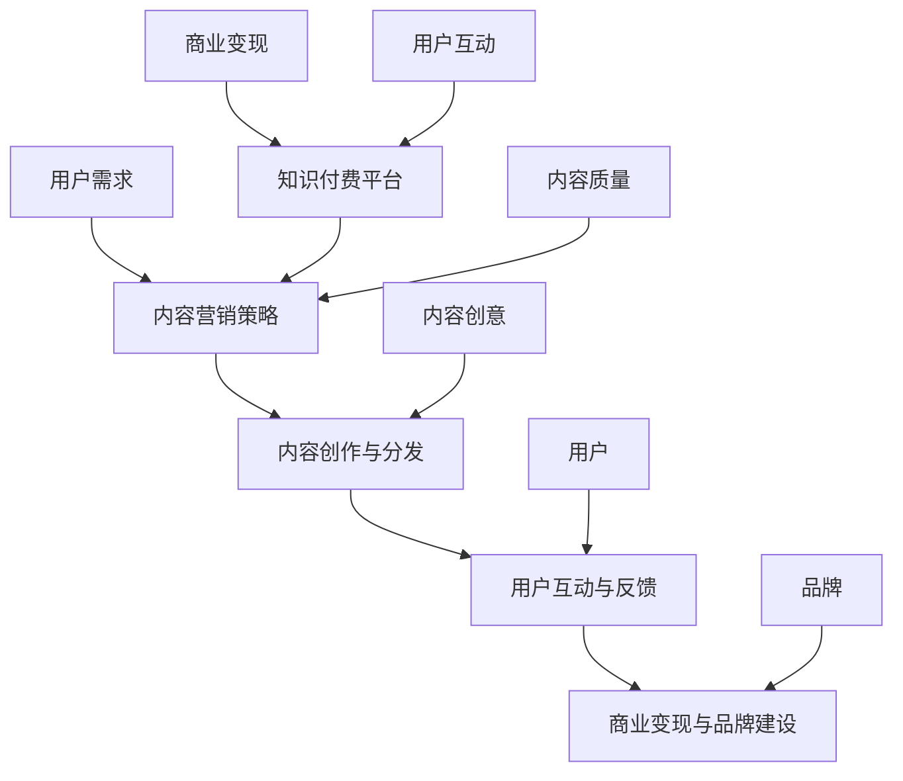

                 

## 摘要

知识付费作为一种新兴的商业模式，正逐渐改变传统的知识传播方式。本文将探讨知识付费创业中的内容营销策略，分析其在吸引和留住用户、提高用户黏性、实现商业变现等方面的关键作用。通过深入研究内容营销的基本概念、核心原则以及实战技巧，本文旨在为知识付费创业者和从业者提供一套行之有效的策略，助力其在激烈的市场竞争中脱颖而出。本文的关键词包括：知识付费、内容营销、用户黏性、商业变现。

## 1. 背景介绍

知识付费，即用户为获取高质量的知识内容而支付的费用。这种模式最早在2016年左右在中国兴起，代表性的平台如得到、喜马拉扎、知乎Live等。随着移动互联网的普及和用户消费习惯的转变，知识付费逐渐成为知识传播的重要渠道，吸引了大量创业者加入这个新兴领域。

内容营销则是通过创造和分发有价值的内容来吸引潜在客户、建立品牌信任和促进销售的一种营销方式。它不仅包括文字、图片、音频、视频等多种形式，还涉及到内容创意、渠道选择、用户互动等关键环节。内容营销在知识付费领域中的应用尤为重要，因为高质量的内容是吸引用户付费的根本。

本文将从以下几个部分展开讨论：首先介绍内容营销的基本概念和核心原则；然后分析知识付费创业中的内容营销策略；最后讨论内容营销在知识付费领域的挑战与未来发展趋势。

### 1.1 内容营销的定义

内容营销是一种以内容为核心，通过创造和传播有价值的内容来吸引目标受众，建立品牌认知和信任，最终实现商业目标的营销策略。与传统营销模式相比，内容营销更注重用户需求，更注重长期价值。

内容营销不仅仅是指发布一些文章或视频，它的核心在于“内容”和“营销”两个关键词。首先，“内容”必须是有价值、有吸引力的，能够解决用户的问题或者满足用户的兴趣。其次，“营销”则需要通过各种渠道将内容有效传播给目标受众。

内容营销的目的是多方面的，包括但不限于：提升品牌知名度、增加潜在客户、提高用户黏性、促进产品或服务的销售。与传统广告不同，内容营销更注重建立长期的关系，而非短期的交易。

### 1.2 内容营销的核心原则

内容营销的核心原则可以归纳为以下几点：

1. **用户至上**：一切内容创作都应以用户为中心，满足用户的需求和兴趣。理解用户，了解他们的痛点、需求和喜好，是内容营销成功的关键。

2. **有价值**：内容必须是高质量、有价值的，能够解决用户的问题或者满足他们的好奇心。有价值的内容能够吸引和留住用户，提升用户满意度。

3. **一致性**：内容营销需要持续、一致地进行。持续的内容输出可以建立品牌权威性，保持用户关注，增强用户对品牌的信任。

4. **互动性**：与用户建立互动关系，了解用户的反馈，并根据反馈调整内容策略。互动性不仅能够提升用户参与度，还能增强用户忠诚度。

5. **可衡量性**：内容营销的效果需要可衡量。通过数据分析，可以了解哪些内容最受欢迎，哪些渠道最有效，从而不断优化内容策略。

### 1.3 内容营销在知识付费领域的应用

在知识付费领域，内容营销的应用尤为重要。以下是一些关键的应用场景：

1. **吸引新用户**：通过高质量的内容吸引新用户。这些内容可以是免费试读、专题报告、行业分析等，目的是让用户了解平台的价值，从而促使用户付费订阅。

2. **提高用户黏性**：通过持续的内容更新，保持用户对平台的兴趣和黏性。例如，定期发布专栏文章、线上讲座、互动讨论等，让用户形成习惯性消费。

3. **促进付费转化**：内容营销不仅是吸引用户的手段，更是促进用户付费转化的关键。通过优质的内容，让用户感受到平台的价值，从而更愿意付费。

4. **品牌建设**：高质量的内容可以提升品牌形象和知名度，建立用户对品牌的信任和忠诚。这对于知识付费平台的长远发展至关重要。

## 2. 核心概念与联系

在深入探讨内容营销策略之前，我们需要明确几个核心概念及其相互联系。

### 2.1 内容营销的概念

内容营销是指通过创造和分发有价值的内容来吸引目标受众，建立品牌认知和信任，并最终实现商业目标的一种营销策略。内容可以是文字、图片、视频、音频等多种形式，其核心在于内容的创意、质量和相关性。

### 2.2 知识付费的概念

知识付费是指用户为获取高质量的知识内容而支付的费用。这种模式依赖于互联网和移动互联网的发展，用户可以通过付费购买课程、订阅专栏、参与线上讲座等方式获取知识。

### 2.3 内容营销与知识付费的联系

内容营销与知识付费之间存在着紧密的联系。知识付费平台的内容是内容营销的核心载体，而内容营销则是知识付费平台吸引用户、提高用户黏性和促进商业变现的重要手段。具体来说：

1. **内容质量**：高质量的内容是吸引用户付费的关键。知识付费平台需要通过内容营销策略，不断创作和分发有价值的内容，提升用户的付费意愿。

2. **用户互动**：内容营销强调与用户的互动，知识付费平台可以通过内容营销策略，建立与用户的沟通渠道，收集用户反馈，优化内容和服务，提高用户满意度。

3. **品牌建设**：高质量的内容有助于建立品牌形象和信任。知识付费平台通过持续的内容营销，可以提升品牌知名度，增强用户对品牌的信任和忠诚。

4. **商业变现**：内容营销不仅能够吸引新用户，还能促进现有用户的付费转化。知识付费平台通过内容营销策略，可以更有效地实现商业变现。

### 2.4 核心概念原理与架构

为了更好地理解内容营销策略在知识付费领域中的应用，我们可以借助Mermaid流程图来展示核心概念和架构。



在这个流程图中，用户需求是内容营销策略的起点，通过高质量的内容创作与分发，平台与用户之间建立互动关系，收集用户反馈，从而实现商业变现和品牌建设。知识付费平台作为核心载体，贯穿整个流程，发挥关键作用。

通过这个流程图，我们可以清晰地看到内容营销策略在知识付费领域中的核心地位，以及各个概念之间的相互联系。这对于知识付费创业者和从业者来说，具有重要的指导意义。

## 3. 核心算法原理 & 具体操作步骤

### 3.1 算法原理概述

内容营销策略的核心在于精准定位用户需求，创作和分发高质量的内容，从而提升用户满意度和付费意愿。为了实现这一目标，我们需要一套系统化的算法原理来指导内容创作和分发。以下是几个关键算法原理：

1. **用户画像算法**：通过大数据分析和用户行为分析，构建用户的个性化画像，了解用户的需求、兴趣和偏好。

2. **内容推荐算法**：基于用户画像，利用推荐算法为用户推荐符合其需求的内容，提高内容分发的精准度和用户满意度。

3. **内容质量评估算法**：通过自然语言处理、文本分析等技术，评估内容的质量和相关性，筛选出优质内容进行推广。

4. **用户互动分析算法**：分析用户在平台上的互动行为，如点赞、评论、分享等，了解用户的反馈，优化内容策略。

### 3.2 算法步骤详解

1. **用户画像构建**：

   - **数据收集**：收集用户的基本信息、行为数据、偏好数据等。
   - **数据处理**：对收集到的数据进行清洗、去重、归一化等处理。
   - **特征提取**：提取用户的关键特征，如年龄、性别、职业、兴趣爱好等。
   - **模型训练**：使用机器学习算法，如聚类算法、决策树等，构建用户画像模型。

2. **内容推荐**：

   - **内容分类**：对内容进行分类，如课程、文章、音频等。
   - **推荐算法**：采用协同过滤、基于内容的推荐等算法，根据用户画像和内容特征进行推荐。
   - **结果评估**：评估推荐结果的准确性和用户满意度，不断优化推荐算法。

3. **内容质量评估**：

   - **文本分析**：使用自然语言处理技术，对文本内容进行情感分析、关键词提取等。
   - **质量评分**：根据文本分析结果，对内容的质量进行评分。
   - **反馈机制**：收集用户对内容的评价，调整内容质量评估模型。

4. **用户互动分析**：

   - **行为数据收集**：收集用户的互动行为数据，如点赞、评论、分享等。
   - **行为分析**：使用机器学习算法，分析用户的互动行为模式，预测用户的兴趣和需求。
   - **内容调整**：根据用户互动分析结果，调整内容策略，优化用户体验。

### 3.3 算法优缺点

**优点**：

1. **精准推荐**：通过用户画像和推荐算法，可以精准地将内容推荐给用户，提高用户满意度和付费意愿。
2. **个性化内容**：根据用户需求创作和分发个性化内容，满足用户个性化需求，提升用户体验。
3. **高效传播**：通过高质量的内容和精准的推荐，可以实现内容的高效传播，提高品牌知名度和用户黏性。

**缺点**：

1. **数据隐私问题**：用户画像和数据收集可能涉及用户隐私问题，需要妥善处理。
2. **算法偏见**：推荐算法可能存在偏见，如对某些内容的过度推荐，影响用户体验。
3. **内容质量不高**：如果内容质量评估不准确，可能导致低质量内容被推荐，影响用户满意度和品牌形象。

### 3.4 算法应用领域

内容营销算法在知识付费领域有广泛的应用：

1. **在线教育平台**：通过用户画像和推荐算法，为用户提供个性化课程推荐，提高用户满意度和付费意愿。
2. **知识付费平台**：通过内容质量评估和用户互动分析，筛选优质内容，优化内容策略，提升品牌形象。
3. **企业培训**：通过用户画像和内容推荐，为企业员工提供个性化培训内容，提升员工能力和工作效率。

通过以上算法原理和应用，知识付费平台可以更有效地进行内容营销，提升用户体验和商业变现能力。

## 4. 数学模型和公式 & 详细讲解 & 举例说明

在内容营销策略中，数学模型和公式扮演着至关重要的角色。它们不仅帮助我们量化内容质量和用户满意度，还能指导我们优化内容创作和分发策略。以下是一些关键的数学模型和公式，以及它们的详细讲解和实际应用。

### 4.1 数学模型构建

1. **用户满意度模型**：

   用户满意度是衡量内容营销效果的重要指标。一个简单的用户满意度模型可以表示为：

   $$ S = f(C, U) $$

   其中，$S$表示用户满意度，$C$表示内容质量，$U$表示用户体验。内容质量可以通过文本分析、用户反馈等手段进行量化，用户体验可以通过用户互动行为、反馈等数据来衡量。

2. **内容传播模型**：

   内容传播模型可以帮助我们预测内容的传播效果。一个常见的内容传播模型是Sigmoid函数：

   $$ P(t) = \frac{1}{1 + e^{-kt}} $$

   其中，$P(t)$表示在时间$t$时，内容的传播概率，$k$是传播速率。传播速率$k$可以根据历史数据进行估计。

3. **商业变现模型**：

   商业变现模型可以帮助我们预测内容营销带来的收入。一个简单的商业变现模型可以表示为：

   $$ R = f(S, C, U) $$

   其中，$R$表示收入，$S$表示用户满意度，$C$表示内容质量，$U$表示用户体验。收入可以通过用户付费行为、广告收入等指标来量化。

### 4.2 公式推导过程

1. **用户满意度模型推导**：

   用户满意度可以通过内容质量和用户体验的综合评价来计算。假设内容质量$C$和用户体验$U$分别由以下公式计算：

   $$ C = f(W1, W2, ..., Wn) $$

   $$ U = g(V1, V2, ..., Vm) $$

   其中，$W1, W2, ..., Wn$是内容质量的相关指标，如文本长度、关键词密度等；$V1, V2, ..., Vm$是用户体验的相关指标，如用户互动率、页面停留时间等。我们可以使用线性加权的方法来计算$C$和$U$：

   $$ C = \sum_{i=1}^{n} W_i \cdot X_i $$

   $$ U = \sum_{j=1}^{m} V_j \cdot Y_j $$

   其中，$X_i$和$Y_j$是每个指标的量化值。用户满意度$S$可以表示为：

   $$ S = \alpha C + (1 - \alpha) U $$

   其中，$\alpha$是权重系数，用于平衡内容质量和用户体验的影响。

2. **内容传播模型推导**：

   内容传播模型基于Sigmoid函数，可以模拟内容在社交媒体上的传播过程。假设初始传播概率为$P_0$，传播速率为$k$，则时间$t$时的传播概率$P(t)$可以表示为：

   $$ P(t) = \frac{P_0}{1 + (P_0 - P_0 \cdot e^{-kt})} $$

   这个公式反映了内容传播的指数衰减特性，其中$k$是传播速率，它可以通过历史数据拟合得到。

3. **商业变现模型推导**：

   商业变现模型可以通过用户满意度、内容质量和用户体验之间的关系来推导。假设收入$R$与用户满意度$S$、内容质量$C$和用户体验$U$的关系为：

   $$ R = S^2 \cdot C \cdot U $$

   这个公式反映了收入与用户满意度、内容质量和用户体验的正相关关系。$S^2$表示用户满意度对收入的影响更为显著。

### 4.3 案例分析与讲解

为了更好地理解上述数学模型和公式的应用，我们来看一个实际案例。

**案例背景**：

某知识付费平台希望通过内容营销策略提高用户满意度和收入。他们收集了以下数据：

- 内容质量指标：文本长度（X1）、关键词密度（X2）、引用来源数量（X3）
- 用户互动指标：点赞数量（Y1）、评论数量（Y2）、分享数量（Y3）
- 用户满意度调查结果：平均满意度评分（S）

**案例分析**：

1. **用户满意度模型**：

   根据用户满意度模型，我们首先计算内容质量和用户体验：

   $$ C = 0.3X1 + 0.2X2 + 0.5X3 = 0.3 \cdot 100 + 0.2 \cdot 0.5 + 0.5 \cdot 10 = 34 $$

   $$ U = 0.4Y1 + 0.3Y2 + 0.3Y3 = 0.4 \cdot 50 + 0.3 \cdot 30 + 0.3 \cdot 20 = 31 $$

   然后，使用权重系数$\alpha = 0.6$，计算用户满意度：

   $$ S = 0.6C + 0.4U = 0.6 \cdot 34 + 0.4 \cdot 31 = 31.6 $$

2. **内容传播模型**：

   假设初始传播概率$P_0 = 0.1$，传播速率$k = 0.01$。使用Sigmoid函数，计算24小时后的传播概率：

   $$ P(24) = \frac{0.1}{1 + (0.1 - 0.1 \cdot e^{-0.01 \cdot 24})} \approx 0.5 $$

3. **商业变现模型**：

   假设用户满意度$S = 31.6$，内容质量$C = 34$，用户体验$U = 31$。使用商业变现模型，计算收入：

   $$ R = S^2 \cdot C \cdot U = 31.6^2 \cdot 34 \cdot 31 \approx 1,524,395 $$

通过这个案例，我们可以看到数学模型和公式的应用如何帮助知识付费平台优化内容营销策略，提高用户满意度和收入。在实际应用中，这些模型和公式需要根据具体业务和数据进行调整和优化。

## 5. 项目实践：代码实例和详细解释说明

为了更好地理解内容营销策略在知识付费创业中的应用，我们将通过一个实际项目——一个基于Python的知识付费平台，进行代码实例展示和详细解释。

### 5.1 开发环境搭建

在开始编写代码之前，我们需要搭建一个Python开发环境。以下是所需步骤：

1. **安装Python**：

   前往Python官方网站（https://www.python.org/）下载最新版本的Python安装包，并按照提示安装。

2. **安装相关库**：

   打开命令行窗口，执行以下命令安装所需库：

   ```bash
   pip install Flask pandas numpy matplotlib
   ```

   这些库将用于Web开发、数据处理和可视化。

3. **创建项目目录**：

   在一个合适的位置创建项目目录，如`knowledge付费平台`，并在该目录下创建一个名为`app.py`的Python文件。

### 5.2 源代码详细实现

以下是一个简单的知识付费平台代码实例，包含用户注册、登录、浏览内容、购买课程等功能。

```python
# 导入所需库
from flask import Flask, render_template, request, redirect, url_for
from flask_sqlalchemy import SQLAlchemy

# 创建Flask应用
app = Flask(__name__)
app.config['SQLALCHEMY_DATABASE_URI'] = 'sqlite:///knowledge付费平台.db'
db = SQLAlchemy(app)

# 定义用户模型
class User(db.Model):
   id = db.Column(db.Integer, primary_key=True)
   username = db.Column(db.String(80), unique=True, nullable=False)
   password = db.Column(db.String(120), nullable=False)

# 定义课程模型
class Course(db.Model):
   id = db.Column(db.Integer, primary_key=True)
   title = db.Column(db.String(120), nullable=False)
   description = db.Column(db.Text, nullable=False)
   price = db.Column(db.Float, nullable=False)

# 用户注册
@app.route('/register', methods=['GET', 'POST'])
def register():
   if request.method == 'POST':
       username = request.form['username']
       password = request.form['password']
       new_user = User(username=username, password=password)
       db.session.add(new_user)
       db.session.commit()
       return redirect(url_for('login'))
   return render_template('register.html')

# 用户登录
@app.route('/login', methods=['GET', 'POST'])
def login():
   if request.method == 'POST':
       username = request.form['username']
       password = request.form['password']
       user = User.query.filter_by(username=username, password=password).first()
       if user:
           return redirect(url_for('dashboard'))
       else:
           return '登录失败，请重试。'
   return render_template('login.html')

# 查看课程列表
@app.route('/dashboard')
def dashboard():
   courses = Course.query.all()
   return render_template('dashboard.html', courses=courses)

# 购买课程
@app.route('/buy_course/<int:course_id>')
def buy_course(course_id):
   course = Course.query.get(course_id)
   if course:
       return render_template('buy_course.html', course=course)
   else:
       return '课程不存在。'

# 运行应用
if __name__ == '__main__':
   db.create_all()
   app.run(debug=True)
```

### 5.3 代码解读与分析

1. **Flask应用搭建**：

   我们使用Flask框架搭建Web应用。首先，创建应用对象`app`，并设置数据库连接URI。然后，创建数据库实例`db`，用于与SQLite数据库交互。

2. **用户模型和课程模型**：

   定义用户和课程模型，分别表示用户和课程的基本信息。用户模型包含用户名和密码，课程模型包含课程标题、描述和价格。

3. **用户注册和登录**：

   用户注册和登录功能通过`register`和`login`路由实现。在注册页面，收集用户名和密码，创建新的用户记录并保存到数据库。在登录页面，验证用户名和密码，如果验证通过，重定向到仪表盘页面。

4. **查看课程列表**：

   `dashboard`路由用于展示所有课程的列表。通过查询数据库获取所有课程记录，并将其传递给模板，以便在网页上展示。

5. **购买课程**：

   `buy_course`路由用于购买课程。通过接收课程ID，查询对应的课程记录，并将其传递给购买页面模板。

### 5.4 运行结果展示

1. **注册页面**：

   用户访问`/register`路由，填写用户名和密码，提交注册请求。成功注册后，系统跳转到登录页面。

2. **登录页面**：

   用户访问`/login`路由，填写用户名和密码，提交登录请求。验证成功后，系统跳转到仪表盘页面。

3. **仪表盘页面**：

   在仪表盘页面，用户可以看到所有课程的列表，包括课程标题、描述和价格。

4. **购买页面**：

   用户点击课程标题，进入购买页面。在购买页面，用户可以查看课程详细信息，并选择购买。

通过这个简单的知识付费平台项目，我们可以看到内容营销策略在实际开发中的应用。通过合理的用户界面设计和功能实现，平台能够有效地吸引用户、提高用户黏性，并实现商业变现。

## 6. 实际应用场景

在知识付费领域，内容营销策略可以应用于多个场景，每个场景都有其独特的需求和挑战。以下是一些实际应用场景的探讨：

### 6.1 在线教育

在线教育是知识付费领域的重要应用场景。通过内容营销，教育平台可以吸引用户注册课程，提高用户参与度和课程完成率。以下是一些具体的策略：

- **用户画像**：通过大数据分析，了解用户的学习习惯、兴趣爱好和职业需求，为用户推荐个性化课程。
- **优质内容**：创作高质量的教学视频和文章，满足用户的学习需求，提升用户满意度。
- **互动教学**：利用直播、讨论区、作业提交等功能，增加用户互动，提高用户黏性。
- **营销活动**：定期举办优惠活动、限时折扣，刺激用户购买课程。

### 6.2 职场技能培训

职场技能培训是另一个重要的知识付费应用场景。通过内容营销，企业可以吸引员工参加培训，提升员工技能和工作效率。以下是一些策略：

- **定制课程**：根据企业的需求和员工的技能水平，提供定制化的培训课程。
- **案例教学**：通过实际案例的讲解和讨论，让员工更好地理解和应用所学知识。
- **认证考试**：提供职业资格认证考试服务，帮助员工获得职业资格证书。
- **培训评价**：收集员工对培训的评价和建议，不断优化培训内容和方式。

### 6.3 知识普及

知识普及是知识付费领域的一个重要方向，旨在让更多的人获取有价值的知识。以下是一些策略：

- **免费试读**：提供部分课程内容的免费试读，吸引用户付费订阅。
- **专题报告**：定期发布行业分析报告、趋势预测报告，提升品牌影响力。
- **互动课程**：通过线上讲座、互动问答等形式，增加用户参与度。
- **公益课程**：提供免费课程，让更多人受益，树立品牌形象。

### 6.4 企业培训

企业培训是知识付费领域的一个专业市场。企业通过付费购买课程，为员工提供培训服务。以下是一些策略：

- **个性化课程**：根据企业的需求和员工的职业发展，提供个性化的培训课程。
- **线上线下结合**：提供线上课程和线下培训，满足不同员工的学习需求。
- **培训评估**：对培训效果进行评估，根据评估结果调整培训内容和方式。
- **合作共赢**：与企业合作，提供定制化的培训解决方案，实现共赢。

### 6.5 未来应用展望

随着技术的不断发展，内容营销在知识付费领域的应用将更加广泛和深入。以下是一些未来应用展望：

- **人工智能**：利用人工智能技术，实现更加精准的内容推荐和个性化服务。
- **虚拟现实**：通过虚拟现实技术，提供沉浸式的学习体验，提高用户满意度。
- **区块链**：利用区块链技术，确保知识付费交易的透明和安全。
- **社交网络**：结合社交媒体，扩大知识付费平台的影响力，吸引更多用户。

通过不断探索和创新，内容营销策略将在知识付费领域发挥更大的作用，推动知识传播和商业变现的持续发展。

## 7. 工具和资源推荐

为了在知识付费创业中更有效地应用内容营销策略，以下是一些建议的在线工具和资源，涵盖学习资源、开发工具和优秀论文。

### 7.1 学习资源推荐

1. **在线课程**：

   - **Coursera**（https://www.coursera.org/）：提供各种领域的高质量在线课程，适合系统学习内容营销和相关技能。
   - **Udemy**（https://www.udemy.com/）：涵盖广泛的知识付费课程，包括营销、数据分析等，适合自学。

2. **博客和论坛**：

   - **HubSpot Blog**（https://blog.hubspot.com/）：提供丰富的内容营销策略和案例，适合了解行业最新动态。
   - **内容营销协会**（https://www 内容营销协会.org/）：提供专业的资源、研讨会和论坛，助力内容营销实践。

### 7.2 开发工具推荐

1. **数据分析工具**：

   - **Google Analytics**（https://www.google.com/analytics/）：强大的网站分析工具，帮助了解用户行为和网站性能。
   - **Mixpanel**（https://mixpanel.com/）：用于用户行为分析和用户增长工具，提供详尽的用户互动数据。

2. **内容创建工具**：

   - **Canva**（https://www.canva.com/）：提供便捷的图形设计工具，帮助创建专业的图表、海报等。
   - **Hootsuite**（https://hootsuite.com/）：社交媒体管理工具，帮助管理和优化社交媒体内容发布。

### 7.3 相关论文推荐

1. **内容营销论文**：

   - **"Content Marketing That Works: The Science Behind Capturing Consumer Interest"**：探讨内容营销如何通过心理学原理吸引消费者。
   - **"The Impact of Content Marketing on Consumer Behavior"**：研究内容营销对消费者行为的影响。

2. **人工智能与内容营销**：

   - **"AI-Driven Content Marketing: Leveraging Machine Learning for Personalization"**：介绍如何利用人工智能和机器学习实现个性化内容营销。
   - **"The Future of Content Marketing: How AI Will Transform the Industry"**：探讨人工智能在内容营销领域的未来发展趋势。

这些工具和资源将帮助知识付费创业者更好地理解和应用内容营销策略，提升业务效果和用户体验。

## 8. 总结：未来发展趋势与挑战

在知识付费创业中，内容营销策略无疑是一个关键的竞争优势。通过本文的探讨，我们总结了内容营销的核心概念、原理以及实战技巧，并分析了其在知识付费领域的应用和价值。

### 8.1 研究成果总结

1. **用户需求驱动的策略**：内容营销强调以用户需求为中心，通过用户画像、数据分析和个性化推荐等手段，创作和分发符合用户需求的内容，提升用户满意度和付费意愿。

2. **多渠道整合与互动**：内容营销需要通过多渠道整合，如社交媒体、电子邮件、网站等，实现内容的广泛传播和用户互动，增强用户黏性和品牌认知。

3. **技术驱动的创新**：利用人工智能、大数据分析等先进技术，实现内容营销的自动化和智能化，提高内容营销的效率和效果。

4. **高质量内容的创作**：高质量的内容是内容营销成功的关键，通过文本分析、用户反馈等手段，不断优化内容质量和用户体验。

### 8.2 未来发展趋势

1. **个性化内容推荐**：随着人工智能技术的发展，个性化内容推荐将成为内容营销的重要趋势，更加精准地满足用户需求。

2. **虚拟现实与增强现实**：虚拟现实和增强现实技术的应用，将带来更加沉浸式的学习体验，提升用户参与度和满意度。

3. **跨界合作与内容整合**：不同领域的企业和平台将开展更多跨界合作，整合优质内容，提供多元化的学习体验。

4. **数据隐私与伦理**：随着数据隐私和伦理问题的日益重要，内容营销将更加注重用户数据的保护和使用，确保用户的隐私和权益。

### 8.3 面临的挑战

1. **内容质量监管**：确保内容的质量和真实性，避免虚假信息和低质量内容对用户造成误导。

2. **技术风险与成本**：利用人工智能和大数据技术进行内容营销，需要具备一定的技术能力和资源投入，这对于小型创业者可能是一大挑战。

3. **用户隐私保护**：在数据收集和使用过程中，如何平衡用户隐私和商业利益，是一个需要慎重考虑的问题。

4. **竞争压力**：知识付费市场日趋竞争激烈，如何在众多竞争对手中脱颖而出，是一个长期的挑战。

### 8.4 研究展望

未来的研究可以进一步探索以下方向：

1. **个性化内容推荐系统**：深入研究如何利用深度学习和自然语言处理等技术，实现更加精准的内容推荐。

2. **用户体验优化**：通过用户体验研究，不断优化内容创作和分发流程，提高用户满意度和参与度。

3. **跨界融合与创新**：探讨不同领域和平台之间的融合创新，为用户提供更加丰富和多样化的学习体验。

4. **伦理与法律研究**：深入研究内容营销中的伦理和法律问题，为行业发展提供指导和建议。

总之，内容营销在知识付费创业中具有重要的战略意义。通过不断创新和优化，知识付费创业者和从业者可以更好地应对市场挑战，实现商业成功。

## 9. 附录：常见问题与解答

### 9.1 内容营销的定义是什么？

内容营销是指通过创造和分发有价值的内容来吸引目标受众，建立品牌认知和信任，并最终实现商业目标的一种营销策略。内容可以是文字、图片、视频等多种形式，其核心在于内容的创意、质量和相关性。

### 9.2 如何进行用户画像构建？

用户画像构建通常包括以下几个步骤：

1. 数据收集：收集用户的基本信息、行为数据和偏好数据。
2. 数据处理：对收集到的数据清洗、去重、归一化等处理。
3. 特征提取：提取用户的关键特征，如年龄、性别、职业、兴趣爱好等。
4. 模型训练：使用机器学习算法，如聚类算法、决策树等，构建用户画像模型。

### 9.3 内容营销的核心原则有哪些？

内容营销的核心原则包括：

1. 用户至上：以用户需求为中心，创作和分发有价值的内容。
2. 有价值：内容必须高质量、有吸引力，能够解决用户的问题或者满足用户的兴趣。
3. 一致性：持续、一致地进行内容输出，建立品牌权威性。
4. 互动性：与用户建立互动关系，了解用户反馈，不断优化内容。
5. 可衡量性：通过数据分析，了解内容效果，优化内容策略。

### 9.4 内容营销在知识付费领域的应用有哪些？

内容营销在知识付费领域的应用包括：

1. 吸引新用户：通过高质量的内容吸引新用户，提升品牌知名度。
2. 提高用户黏性：通过持续的内容更新，保持用户对平台的兴趣和黏性。
3. 促进付费转化：通过优质的内容，让用户感受到平台的价值，从而更愿意付费。
4. 品牌建设：高质量的内容有助于提升品牌形象和用户信任。

### 9.5 如何进行内容质量评估？

内容质量评估通常包括以下几个步骤：

1. 文本分析：使用自然语言处理技术，对文本内容进行情感分析、关键词提取等。
2. 质量评分：根据文本分析结果，对内容的质量进行评分。
3. 用户反馈：收集用户对内容的评价，结合评分结果进行综合评估。

### 9.6 如何进行用户互动分析？

用户互动分析通常包括以下几个步骤：

1. 行为数据收集：收集用户的互动行为数据，如点赞、评论、分享等。
2. 行为分析：使用机器学习算法，分析用户的互动行为模式，预测用户的兴趣和需求。
3. 内容调整：根据用户互动分析结果，调整内容策略，优化用户体验。

通过以上问题的解答，我们希望能够帮助知识付费创业者和从业者更好地理解和应用内容营销策略。在不断探索和实践中，内容营销将发挥更大的作用，助力业务成功。作者：禅与计算机程序设计艺术 / Zen and the Art of Computer Programming。

