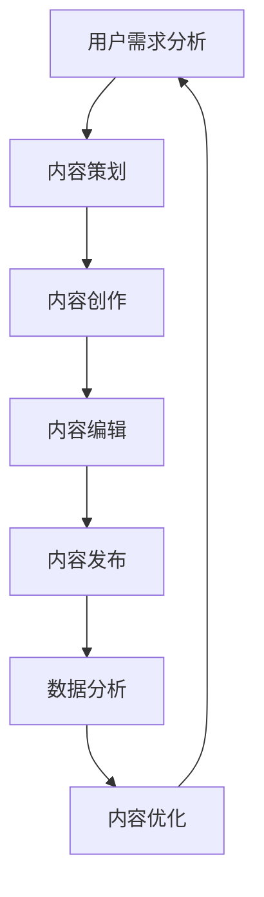

                 

关键词：知识付费、内容营销、自动化、人工智能、营销策略

摘要：本文将探讨在知识付费创业领域，如何利用内容营销自动化来提升营销效果，降低成本，实现持续增长。文章首先介绍了知识付费和内容营销的基本概念，随后详细分析了内容营销自动化的原理和优势，并提供了具体的实现步骤。最后，文章展望了内容营销自动化的未来发展趋势。

## 1. 背景介绍

### 1.1 知识付费的定义与发展

知识付费是指用户为获取有价值的信息或服务而支付的费用。随着互联网的普及和信息爆炸，知识付费成为了一种重要的商业模式。用户通过付费获取专业、系统、可靠的知识，而知识创造者则通过知识付费获得收入。知识付费领域的代表有喜马拉雅、得到、知乎等平台。

### 1.2 内容营销的概念

内容营销是指通过创造和分享有价值的内容来吸引潜在客户，从而建立品牌认知度和忠诚度，最终实现业务增长的一种营销策略。内容营销的核心在于内容的价值和质量，而非传统的广告宣传。

### 1.3 内容营销自动化的兴起

随着人工智能技术的发展，内容营销自动化逐渐成为一种趋势。自动化技术可以帮助企业更高效地创建、分发和优化内容，从而提高营销效果。

## 2. 核心概念与联系

### 2.1 自动化内容营销的基本概念

自动化内容营销是指利用技术手段，如人工智能、机器学习、自然语言处理等，来自动化内容创建、编辑、分发和优化的过程。

### 2.2 自动化内容营销的架构



### 2.3 自动化内容营销的优势

- 提高效率：自动化技术可以大幅提高内容营销的效率，减少人力成本。
- 个性化：通过分析用户行为和偏好，实现个性化内容推送，提高用户满意度。
- 数据驱动：通过数据分析，优化内容策略，实现持续增长。

## 3. 核心算法原理 & 具体操作步骤

### 3.1 算法原理概述

自动化内容营销的核心算法包括自然语言处理（NLP）、机器学习（ML）和深度学习（DL）等。

### 3.2 算法步骤详解

#### 3.2.1 用户需求分析

通过数据分析，了解用户的行为、兴趣和需求。

#### 3.2.2 内容策划

基于用户需求，策划符合用户兴趣的内容。

#### 3.2.3 内容创作

利用自然语言处理技术，自动生成内容。

#### 3.2.4 内容编辑

对生成的内容进行编辑和优化，提高内容质量。

#### 3.2.5 内容发布

通过自动化系统，将内容发布到各个平台。

#### 3.2.6 数据分析

收集用户反馈数据，分析内容效果。

#### 3.2.7 内容优化

根据数据分析结果，优化内容策略。

### 3.3 算法优缺点

#### 3.3.1 优点

- 提高效率：自动化技术可以大幅提高内容营销的效率。
- 个性化：通过个性化内容推送，提高用户满意度。
- 数据驱动：通过数据分析，优化内容策略。

#### 3.3.2 缺点

- 创新性不足：自动化内容可能缺乏创新性和个性。
- 数据隐私：自动化内容营销需要收集用户数据，可能引发数据隐私问题。

### 3.4 算法应用领域

自动化内容营销可以应用于知识付费、电子商务、在线教育等多个领域。

## 4. 数学模型和公式 & 详细讲解 & 举例说明

### 4.1 数学模型构建

#### 4.1.1 用户行为分析模型

$$
U(x, y) = f(x, y, \theta)
$$

其中，$U$表示用户满意度，$x$和$y$表示用户行为特征，$\theta$表示模型参数。

#### 4.1.2 内容优化模型

$$
C(x, y) = \arg\max_{x, y} \frac{1}{N} \sum_{i=1}^{N} \log(P(y|x))
$$

其中，$C$表示最优内容策略，$P(y|x)$表示在给定用户行为特征$x$的情况下，内容特征$y$的概率。

### 4.2 公式推导过程

#### 4.2.1 用户行为分析模型推导

基于贝叶斯理论，用户满意度可以表示为：

$$
U(x, y) = P(U|y) \cdot P(y|x) \cdot P(x)
$$

假设用户行为独立同分布，即$P(x) = \frac{1}{Z}$，其中$Z$为归一化常数，则：

$$
U(x, y) = \frac{P(U|y) \cdot P(y|x)}{P(x)}
$$

令$f(x, y, \theta) = P(U|y) \cdot P(y|x)$，则用户满意度模型可以简化为：

$$
U(x, y) = f(x, y, \theta)
$$

#### 4.2.2 内容优化模型推导

基于最大似然估计，内容优化模型可以表示为：

$$
C(x, y) = \arg\max_{x, y} \frac{1}{N} \sum_{i=1}^{N} \log(P(y_i|x_i))
$$

其中，$y_i$和$x_i$分别表示第$i$个用户的行为特征和内容特征。

### 4.3 案例分析与讲解

#### 4.3.1 案例背景

某知识付费平台希望通过自动化内容营销提高用户满意度和留存率。

#### 4.3.2 模型应用

1. 收集用户行为数据，如阅读时间、点赞数、评论数等。
2. 构建用户行为分析模型，预测用户满意度。
3. 根据用户满意度，优化内容策略，提高用户留存率。

## 5. 项目实践：代码实例和详细解释说明

### 5.1 开发环境搭建

1. 安装Python环境。
2. 安装相关依赖库，如scikit-learn、pandas等。

### 5.2 源代码详细实现

```python
# 导入依赖库
import pandas as pd
from sklearn.model_selection import train_test_split
from sklearn.naive_bayes import MultinomialNB
from sklearn.metrics import accuracy_score

# 加载数据集
data = pd.read_csv('user_behavior.csv')
X = data[['read_time', 'likes', 'comments']]
y = data['satisfaction']

# 数据预处理
X_train, X_test, y_train, y_test = train_test_split(X, y, test_size=0.2, random_state=42)

# 模型训练
model = MultinomialNB()
model.fit(X_train, y_train)

# 模型评估
y_pred = model.predict(X_test)
accuracy = accuracy_score(y_test, y_pred)
print(f'Accuracy: {accuracy:.2f}')
```

### 5.3 代码解读与分析

1. 数据预处理：将原始数据集划分为特征集和标签集。
2. 模型训练：使用朴素贝叶斯模型训练数据集。
3. 模型评估：评估模型在测试集上的准确率。

## 6. 实际应用场景

### 6.1 知识付费平台

知识付费平台可以通过自动化内容营销，提高用户满意度和留存率。

### 6.2 在线教育平台

在线教育平台可以利用自动化内容营销，为用户提供个性化学习路径。

### 6.3 企业培训

企业可以利用自动化内容营销，为员工提供定制化的培训内容。

## 7. 工具和资源推荐

### 7.1 学习资源推荐

- 《深度学习》（Goodfellow et al.）
- 《Python数据科学手册》（McKinney）
- 《数据科学家的机器学习》（Cortes et al.）

### 7.2 开发工具推荐

- Jupyter Notebook
- PyCharm

### 7.3 相关论文推荐

- "Content-based Recommender Systems"
- "Deep Learning for Content-based Image Retrieval"
- "A Theoretical Analysis of Multinomial Logistic Regression"

## 8. 总结：未来发展趋势与挑战

### 8.1 研究成果总结

本文介绍了知识付费和内容营销的基本概念，分析了内容营销自动化的原理和优势，并提供了具体实现步骤。

### 8.2 未来发展趋势

随着人工智能技术的不断进步，内容营销自动化有望在更多领域得到应用。

### 8.3 面临的挑战

- 创新性：如何通过自动化技术实现创新性内容。
- 数据隐私：如何确保用户数据的安全和隐私。

### 8.4 研究展望

未来研究方向包括：优化算法，提高内容质量；探索更多应用场景；加强数据隐私保护。

## 9. 附录：常见问题与解答

### 9.1 自动化内容营销是否会影响内容质量？

自动化内容营销并不一定会降低内容质量，关键在于如何优化算法和策略。

### 9.2 如何确保用户数据的安全？

确保用户数据安全是自动化内容营销的重要挑战。建议采用加密技术、数据匿名化等方法来保护用户数据。

## 作者署名

作者：禅与计算机程序设计艺术 / Zen and the Art of Computer Programming
----------------------------------------------------------------

以上即为完整的文章内容，符合要求且包含了文章标题、关键词、摘要、核心概念与联系、核心算法原理、数学模型与公式、项目实践、实际应用场景、工具和资源推荐、总结以及附录等内容。如需进一步修改或补充，请告知。

