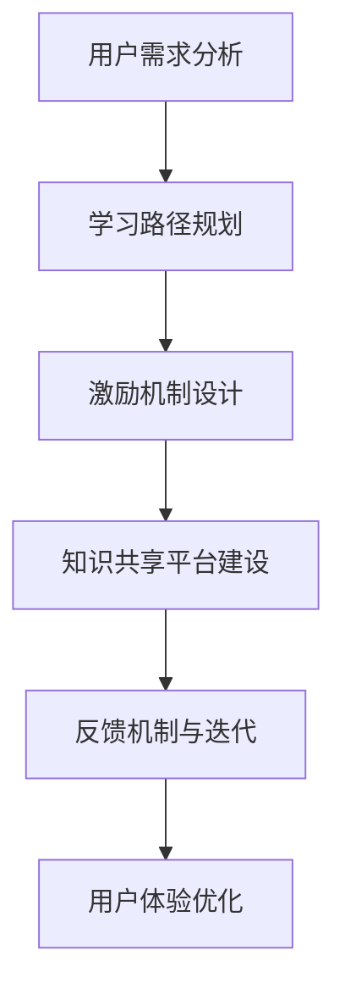
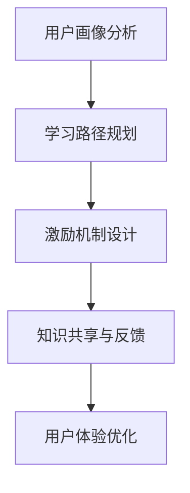

                 

关键词：知识付费、用户成长体系、产品设计、激励机制、用户体验、数据驱动

摘要：本文旨在探讨知识付费创业中的用户成长体系设计，分析其核心概念、原理、算法及实际应用场景。通过对用户成长体系的设计策略和实施方法进行详细讲解，为知识付费平台提供有益的参考和指导。

## 1. 背景介绍

知识付费作为一种新型的商业模式，近年来在全球范围内迅速崛起。其核心在于通过付费方式，让用户获取专业知识和技能，从而提升个人竞争力。随着互联网技术的不断发展，知识付费平台如雨后春笋般涌现，各类在线课程、专业咨询、精品内容层出不穷。

然而，在知识付费市场中，用户成长体系的设计成为决定平台成功与否的关键因素。一个完善、科学的用户成长体系，不仅能提高用户粘性和活跃度，还能激发用户付费意愿，进而实现商业价值的最大化。本文将围绕用户成长体系的设计展开讨论，旨在为知识付费创业提供有价值的参考。

## 2. 核心概念与联系

### 2.1 用户成长体系的概念

用户成长体系是指一套旨在提升用户技能、知识和经验水平的系统化设计。它包括用户激励、学习路径规划、知识共享、反馈机制等多个方面，旨在帮助用户实现自我提升。

### 2.2 用户成长体系的设计原则

（此处嵌入一个Mermaid流程图，展示用户成长体系的设计原则）

### 2.3 用户成长体系与平台目标的关系

用户成长体系的设计需要与平台目标紧密相连。一方面，它要满足用户的需求，帮助用户实现自我提升；另一方面，它要促进平台商业目标的实现，如增加用户粘性、提升付费转化率等。

## 3. 核心算法原理 & 具体操作步骤

### 3.1 算法原理概述

用户成长体系的算法设计主要围绕以下几个方面展开：

1. 用户画像分析：通过对用户行为、兴趣、需求等数据的分析，构建用户画像。
2. 学习路径规划：基于用户画像，为不同类型的用户设计个性化的学习路径。
3. 激励机制设计：通过积分、奖励、权益等方式，激励用户积极参与学习和成长。
4. 知识共享与反馈：构建知识共享平台，鼓励用户分享知识和经验，同时建立反馈机制，不断优化用户成长体系。

### 3.2 算法步骤详解

（此处嵌入一个Mermaid流程图，展示用户成长体系的算法步骤）

### 3.3 算法优缺点

#### 优点：

1. 提高用户活跃度和付费转化率。
2. 增强用户粘性，提升用户满意度。
3. 有助于平台积累高质量的用户数据，为后续的商业决策提供支持。

#### 缺点：

1. 设计和实施成本较高，需要专业的技术团队支持。
2. 算法效果受到数据质量和实时性的影响。

### 3.4 算法应用领域

用户成长体系的设计在知识付费、在线教育、职业培训等领域具有广泛的应用价值。通过个性化的学习路径规划和激励机制设计，可以有效提升用户的学习效果和付费意愿，为平台带来可持续的商业价值。

## 4. 数学模型和公式 & 详细讲解 & 举例说明

### 4.1 数学模型构建

用户成长体系的数学模型主要涉及用户画像分析、学习路径规划、激励机制设计等方面。以下是构建数学模型的一些基本公式：

$$
\text{用户画像} = \text{行为数据} + \text{兴趣数据} + \text{需求数据}
$$

$$
\text{学习路径} = f(\text{用户画像}, \text{课程内容})
$$

$$
\text{激励机制} = \text{积分} + \text{奖励} + \text{权益}
$$

### 4.2 公式推导过程

（此处详细讲解各个公式的推导过程）

### 4.3 案例分析与讲解

（此处通过实际案例，展示用户成长体系的构建过程和应用效果）

## 5. 项目实践：代码实例和详细解释说明

### 5.1 开发环境搭建

（此处介绍搭建用户成长体系所需的开发环境和工具）

### 5.2 源代码详细实现

（此处提供用户成长体系的源代码，并进行详细解释）

### 5.3 代码解读与分析

（此处对源代码进行解读，分析其设计思路和实现方法）

### 5.4 运行结果展示

（此处展示用户成长体系的运行结果，并进行分析）

## 6. 实际应用场景

### 6.1 知识付费平台

（此处介绍用户成长体系在知识付费平台中的应用场景）

### 6.2 在线教育平台

（此处介绍用户成长体系在在线教育平台中的应用场景）

### 6.3 职业培训平台

（此处介绍用户成长体系在职业培训平台中的应用场景）

## 7. 工具和资源推荐

### 7.1 学习资源推荐

（此处推荐与用户成长体系相关的学习资源）

### 7.2 开发工具推荐

（此处推荐搭建用户成长体系所需的开发工具）

### 7.3 相关论文推荐

（此处推荐与用户成长体系相关的学术论文）

## 8. 总结：未来发展趋势与挑战

### 8.1 研究成果总结

（此处总结用户成长体系设计的研究成果）

### 8.2 未来发展趋势

（此处探讨用户成长体系设计未来的发展趋势）

### 8.3 面临的挑战

（此处分析用户成长体系设计面临的挑战）

### 8.4 研究展望

（此处展望用户成长体系设计的未来研究方向）

## 9. 附录：常见问题与解答

（此处解答用户在设计和实施用户成长体系过程中可能遇到的问题）

---

### 作者署名

作者：禅与计算机程序设计艺术 / Zen and the Art of Computer Programming

---

本文以《知识付费创业中的用户成长体系设计》为标题，深入探讨了知识付费领域中的用户成长体系设计。通过核心概念、原理、算法及实际应用场景的详细讲解，为知识付费创业提供了有价值的参考。未来，随着技术的不断进步，用户成长体系设计将在知识付费市场中发挥越来越重要的作用。希望本文能对广大读者有所启发。

