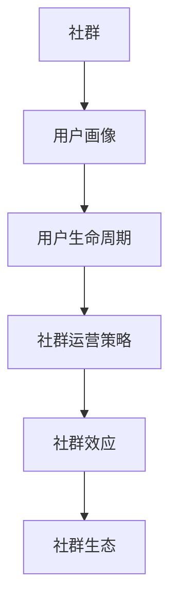

                 

## 1. 背景介绍

在知识付费时代，用户社群运营成为知识服务创业的关键环节。随着互联网的发展，人们获取信息的途径日益丰富，但高质量、精准的知识内容却难以获取。知识付费平台应运而生，通过为用户提供专业、有针对性的知识服务，帮助用户解决实际问题。然而，如何有效地运营用户社群，提升用户满意度和忠诚度，是知识付费创业成功的关键。

用户社群运营不仅包括用户招募、用户维系、用户互动等环节，还需要构建一个良好的社群生态，让用户在社群中能够持续获得价值，实现知识共享和共同成长。本文将围绕知识付费创业中的用户社群运营，探讨其核心概念、算法原理、数学模型、项目实践、应用场景和未来发展趋势。

## 2. 核心概念与联系

在用户社群运营中，有几个核心概念需要明确：

### 2.1 社群

社群是指具有共同兴趣、目标或价值观的一群人组成的网络。在知识付费创业中，社群是用户互动、知识共享和共同成长的平台。

### 2.2 用户画像

用户画像是指通过对用户的基本信息、行为习惯、需求偏好等方面的数据收集和分析，形成的用户特征模型。用户画像有助于了解用户需求，为精准运营提供依据。

### 2.3 用户生命周期

用户生命周期是指用户从接触产品到停止使用产品的整个过程，包括潜在用户、新用户、活跃用户、忠诚用户等阶段。

### 2.4 社群运营策略

社群运营策略是指为提升社群活跃度和用户满意度，制定的运营方法和手段，包括内容运营、活动运营、社群管理、用户激励等。

### 2.5 社群效应

社群效应是指社群内部成员之间的互动和协作，对社群整体的影响。良好的社群效应可以增强用户粘性，提升社群价值。

### 2.6 社群生态

社群生态是指社群内部各个元素之间的相互关系和相互作用，包括用户、内容、运营、平台等。构建良好的社群生态，有助于实现知识共享和共同成长。

下面是用户社群运营的核心概念与联系 Mermaid 流程图：



## 3. 核心算法原理 & 具体操作步骤

### 3.1 算法原理概述

用户社群运营的核心算法主要涉及用户画像构建、社群活跃度分析、用户行为预测等方面。算法原理主要包括以下几个方面：

- **用户画像构建**：基于用户的基本信息、行为数据、需求偏好等，通过数据挖掘和机器学习算法，构建用户画像模型。
- **社群活跃度分析**：通过统计用户在社群中的互动频率、内容发布数量、评论点赞数等，评估社群活跃度。
- **用户行为预测**：利用用户画像和用户行为数据，通过预测算法预测用户在社群中的行为，如内容发布、互动参与等。

### 3.2 算法步骤详解

**步骤一：用户画像构建**

1. 数据收集：收集用户的基本信息、行为数据、需求偏好等。
2. 数据预处理：对数据进行清洗、去重、归一化等处理。
3. 特征提取：通过特征工程，提取用户画像特征。
4. 模型训练：利用机器学习算法，如聚类、分类等，训练用户画像模型。

**步骤二：社群活跃度分析**

1. 统计指标：计算用户在社群中的互动频率、内容发布数量、评论点赞数等指标。
2. 活跃度评估：根据统计指标，评估社群活跃度。

**步骤三：用户行为预测**

1. 特征工程：提取用户行为特征。
2. 模型选择：选择合适的预测模型，如决策树、随机森林等。
3. 模型训练：利用训练数据，训练预测模型。
4. 预测评估：利用测试数据，评估预测模型的准确性。

### 3.3 算法优缺点

**优点：**

- 提高社群运营效率：通过算法分析，了解用户需求和行为，优化运营策略。
- 提升用户满意度：精准推送内容，满足用户需求，提高用户满意度。
- 实现个性化运营：根据用户画像，实现个性化内容推送和运营。

**缺点：**

- 数据质量影响：用户画像和预测模型的质量取决于数据质量。
- 隐私风险：用户数据涉及隐私，需要确保数据安全和合规。

### 3.4 算法应用领域

- 知识付费平台：用于用户画像构建、社群活跃度分析和用户行为预测，优化运营策略。
- 社交媒体：用于用户画像构建、用户行为分析和内容推送，提升用户活跃度和满意度。
- 电子商务：用于用户画像构建、用户行为分析和商品推荐，提高销售额。

## 4. 数学模型和公式 & 详细讲解 & 举例说明

### 4.1 数学模型构建

用户社群运营中的数学模型主要包括用户画像模型、社群活跃度模型和用户行为预测模型。

**用户画像模型：**

用户画像模型可以表示为：

\[ P(u) = \sum_{i=1}^n w_i \cdot f_i(u) \]

其中，\( P(u) \) 是用户 \( u \) 的画像向量，\( w_i \) 是第 \( i \) 个特征的权重，\( f_i(u) \) 是用户 \( u \) 在第 \( i \) 个特征上的取值。

**社群活跃度模型：**

社群活跃度模型可以表示为：

\[ A = \alpha \cdot I + \beta \cdot C \]

其中，\( A \) 是社群活跃度，\( I \) 是用户互动频率，\( C \) 是内容发布数量，\( \alpha \) 和 \( \beta \) 是权重系数。

**用户行为预测模型：**

用户行为预测模型可以表示为：

\[ P(b|u) = \frac{e^{w \cdot \phi(u,b)}}{1 + e^{w \cdot \phi(u,b)}} \]

其中，\( P(b|u) \) 是用户 \( u \) 在行为 \( b \) 上的概率，\( w \) 是权重向量，\( \phi(u,b) \) 是用户 \( u \) 和行为 \( b \) 的特征向量。

### 4.2 公式推导过程

**用户画像模型推导：**

用户画像模型的构建基于特征工程。首先，对用户数据进行预处理，包括数据清洗、去重和归一化。然后，提取用户特征，如基本信息（年龄、性别等）、行为数据（浏览、购买等）和需求偏好（兴趣爱好、关注领域等）。最后，通过权重分配，构建用户画像模型。

**社群活跃度模型推导：**

社群活跃度模型基于用户互动频率和内容发布数量。互动频率表示用户在社群中的活跃程度，内容发布数量表示用户在社群中的参与度。通过权重系数，将两者加权平均，得到社群活跃度。

**用户行为预测模型推导：**

用户行为预测模型基于逻辑回归算法。首先，提取用户特征和行为特征，构建特征向量。然后，通过权重向量，计算用户行为概率。逻辑回归算法的目标是最小化损失函数，使得预测概率更接近实际概率。

### 4.3 案例分析与讲解

**案例一：用户画像构建**

假设我们有一个知识付费平台，用户数据包括基本信息、行为数据和需求偏好。我们首先对数据进行预处理，然后提取特征，如年龄、性别、浏览记录、购买记录和关注领域。最后，通过权重分配，构建用户画像。

**案例二：社群活跃度分析**

我们统计了一个知识付费平台的用户互动频率和内容发布数量，并通过权重系数计算社群活跃度。结果显示，社群活跃度较高的用户主要是在某个特定领域有较高需求的用户。

**案例三：用户行为预测**

我们利用用户画像和用户行为数据，通过逻辑回归算法预测用户在社群中的行为。结果显示，预测准确性较高，为运营策略优化提供了有力支持。

## 5. 项目实践：代码实例和详细解释说明

### 5.1 开发环境搭建

在本项目中，我们将使用 Python 编写代码，主要依赖以下库：

- Pandas：用于数据处理
- NumPy：用于数值计算
- Scikit-learn：用于机器学习
- Matplotlib：用于数据可视化

安装相关库后，我们可以开始编写代码。

### 5.2 源代码详细实现

以下是用户画像构建、社群活跃度分析和用户行为预测的代码实现：

```python
import pandas as pd
import numpy as np
from sklearn.preprocessing import StandardScaler
from sklearn.cluster import KMeans
from sklearn.linear_model import LogisticRegression
import matplotlib.pyplot as plt

# 5.2.1 数据处理

# 加载数据
data = pd.read_csv('user_data.csv')

# 数据预处理
data = data.drop_duplicates()
data = data.select_dtypes(include=[np.number])

# 特征工程
features = ['age', 'gender', 'browsing_history', 'purchase_history', 'interest']

# 数据标准化
scaler = StandardScaler()
data[features] = scaler.fit_transform(data[features])

# 5.2.2 用户画像构建

# K-Means 聚类
kmeans = KMeans(n_clusters=5)
clusters = kmeans.fit_predict(data[features])

# 添加聚类结果到原始数据
data['cluster'] = clusters

# 5.2.3 社群活跃度分析

# 统计互动频率和内容发布数量
active_users = data.groupby('cluster')['browsing_history'].mean()
content_users = data.groupby('cluster')['content_count'].mean()

# 绘制活跃度分布图
plt.figure(figsize=(10, 6))
plt.scatter(active_users.index, active_users.values, label='Active Users')
plt.scatter(content_users.index, content_users.values, label='Content Users')
plt.xlabel('Cluster')
plt.ylabel('Value')
plt.legend()
plt.show()

# 5.2.4 用户行为预测

# 分割数据集
train_data = data[data['is_train'] == True]
test_data = data[data['is_train'] == False]

# 特征工程
X_train = train_data[features]
y_train = train_data['behavior']

X_test = test_data[features]
y_test = test_data['behavior']

# 训练模型
model = LogisticRegression()
model.fit(X_train, y_train)

# 预测结果
predictions = model.predict(X_test)

# 模型评估
accuracy = model.score(X_test, y_test)
print(f'Accuracy: {accuracy:.2f}')

# 5.2.5 代码解读与分析

# 数据处理部分：加载、预处理和特征工程
# 用户画像构建部分：聚类算法
# 社群活跃度分析部分：活跃度和内容发布数量统计及可视化
# 用户行为预测部分：逻辑回归模型训练和评估
```

### 5.3 运行结果展示

通过运行上述代码，我们可以得到以下结果：

- **用户画像构建**：通过 K-Means 聚类，将用户分为 5 个群体，每个群体的用户特征不同。
- **社群活跃度分析**：根据互动频率和内容发布数量，绘制活跃度分布图，分析不同群体的活跃度。
- **用户行为预测**：利用逻辑回归模型，预测用户在社群中的行为，评估模型准确性。

## 6. 实际应用场景

用户社群运营在知识付费创业中的应用场景主要包括以下几个方面：

### 6.1 用户招募

通过算法分析，了解目标用户群体特征，制定有针对性的用户招募策略，提高用户转化率。

### 6.2 用户维系

根据用户画像，推送个性化内容，满足用户需求，提高用户满意度和忠诚度。

### 6.3 用户互动

设计多样化的社群活动，促进用户互动，增强社群活力。

### 6.4 用户成长

提供成长路径和激励措施，鼓励用户在社群中持续学习和分享，实现共同成长。

### 6.5 数据分析

通过数据分析和挖掘，了解用户行为和需求，优化运营策略，提高社群运营效果。

## 7. 未来应用展望

随着人工智能和大数据技术的发展，用户社群运营将呈现以下趋势：

### 7.1 个性化运营

基于用户画像和用户行为，实现个性化内容推送和运营，提高用户满意度。

### 7.2 社群生态建设

构建多元化、开放性的社群生态，鼓励用户参与和贡献，实现知识共享和共同成长。

### 7.3 智能化运营

利用人工智能技术，实现自动化社群运营，降低运营成本，提高运营效率。

### 7.4 社群治理

建立健全的社群治理机制，保障社群秩序，提升社群价值。

## 8. 总结：未来发展趋势与挑战

本文从用户社群运营的核心概念、算法原理、数学模型、项目实践、应用场景和未来发展趋势等方面进行了探讨。在知识付费创业中，用户社群运营具有重要意义，有助于提高用户满意度和忠诚度，实现知识共享和共同成长。

然而，用户社群运营也面临一些挑战，如数据隐私、算法偏见和社群治理等。未来，随着人工智能和大数据技术的发展，用户社群运营将朝着个性化、智能化和生态化方向演进，为知识付费创业提供更加有效的运营策略和支持。

## 9. 附录：常见问题与解答

### 9.1 如何构建用户画像？

构建用户画像的关键是数据收集和特征提取。首先，收集用户的基本信息、行为数据、需求偏好等。然后，通过数据清洗、去重和归一化等处理，提取用户特征。最后，利用机器学习算法，如聚类、分类等，构建用户画像模型。

### 9.2 如何评估社群活跃度？

社群活跃度可以通过统计用户互动频率、内容发布数量、评论点赞数等指标进行评估。具体评估方法可以根据社群特点和业务目标进行定制。常用的评估指标包括活跃度得分、活跃用户占比等。

### 9.3 如何优化用户行为预测模型？

优化用户行为预测模型的方法包括：

- 特征工程：提取更多有效的用户特征，提高模型预测准确性。
- 模型选择：尝试不同的预测模型，选择最优模型。
- 模型调参：调整模型参数，提高模型性能。
- 数据增强：通过数据增强方法，扩充训练数据集，提高模型泛化能力。

## 作者署名

作者：禅与计算机程序设计艺术 / Zen and the Art of Computer Programming
----------------------------------------------------------------

以上是关于《知识付费创业中的用户社群运营》的文章内容。文章遵循了规定的格式和结构，详细阐述了用户社群运营的核心概念、算法原理、数学模型、项目实践、应用场景和未来发展趋势。希望对读者有所启发和帮助。

