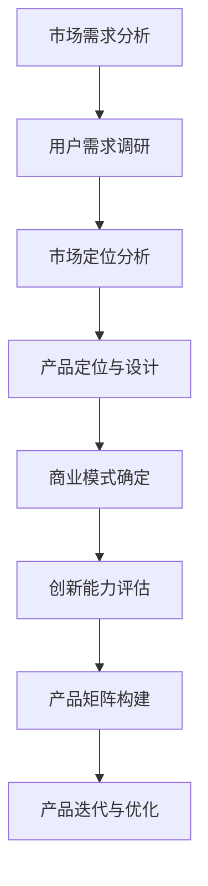

                 

关键词：知识付费、产品矩阵、构建策略、商业模式、用户体验、市场定位、创新

> 摘要：本文旨在探讨知识付费创业中的产品矩阵构建策略，通过分析市场需求、用户群体、产品定位、商业模式等关键因素，提供一套系统化、可操作性的构建方法论。文章将结合实际案例，详细阐述产品矩阵的构建流程、实施步骤以及未来发展趋势。

## 1. 背景介绍

在互联网时代，知识付费已经成为一个不可忽视的商业模式。无论是线上课程、专业咨询、知识付费社区，还是内容付费平台，都展现了知识付费市场的巨大潜力。然而，如何有效地构建知识付费产品矩阵，实现商业化运营，仍然是许多创业者面临的挑战。

知识付费产品矩阵的构建不仅涉及对市场需求的深入分析，还需要综合考虑用户群体、产品定位、商业模式等多个因素。一个成功的知识付费产品矩阵，能够在满足用户需求的同时，实现商业价值的最大化。

本文将从以下几个方面展开讨论：

1. 核心概念与联系
2. 核心算法原理与具体操作步骤
3. 数学模型和公式与详细讲解
4. 项目实践：代码实例和详细解释说明
5. 实际应用场景
6. 工具和资源推荐
7. 总结：未来发展趋势与挑战

## 2. 核心概念与联系

### 2.1 知识付费

知识付费是指用户通过支付一定费用，获取专业知识、技能或服务的一种商业模式。这种模式的核心在于信息的价值化和专业化。

### 2.2 产品矩阵

产品矩阵是指一个产品线中，不同产品之间的组合和互动关系。在知识付费领域，产品矩阵的构建需要考虑产品定位、功能模块、用户群体等多个维度。

### 2.3 商业模式

商业模式是指企业在特定市场中，通过提供产品或服务，实现盈利的方式。知识付费的商业模式通常包括订阅制、单次购买、会员制等。

### 2.4 用户需求

用户需求是知识付费产品矩阵构建的基础。只有深入了解用户需求，才能提供符合用户期待的产品和服务。

### 2.5 市场定位

市场定位是指企业在市场中的定位策略，包括目标市场、目标用户、竞争优势等。正确的市场定位有助于产品矩阵的精准构建。

### 2.6 创新能力

创新能力是企业构建知识付费产品矩阵的关键因素。通过技术创新、内容创新、模式创新等手段，企业可以不断提升产品矩阵的竞争力。

### 2.7 Mermaid 流程图

以下是一个简单的知识付费产品矩阵构建的 Mermaid 流程图：



## 3. 核心算法原理 & 具体操作步骤

### 3.1 算法原理概述

知识付费产品矩阵构建的核心算法原理主要包括：

1. **用户需求分析**：通过大数据分析和用户调研，挖掘用户需求。
2. **市场定位分析**：根据市场需求和用户需求，确定产品的市场定位。
3. **产品定位与设计**：结合市场定位和用户需求，设计符合用户期待的产品。
4. **商业模式确定**：根据产品定位，选择合适的商业模式，实现盈利。
5. **创新能力评估**：对产品矩阵的创新潜力进行评估，确保产品的竞争力。

### 3.2 算法步骤详解

1. **需求分析阶段**：

   - **数据收集**：通过问卷、访谈、用户反馈等方式收集用户需求。
   - **数据整理**：对收集到的数据进行整理和分析，提取核心需求。
   - **需求验证**：通过用户调研和专家评审，验证需求的有效性和可行性。

2. **市场定位阶段**：

   - **市场分析**：分析市场需求、市场规模、竞争对手等。
   - **定位选择**：根据市场分析和需求分析，选择合适的市场定位。
   - **定位验证**：通过市场调研和用户反馈，验证市场定位的准确性。

3. **产品定位与设计阶段**：

   - **功能设计**：根据市场定位和用户需求，设计产品功能模块。
   - **界面设计**：设计用户友好的产品界面。
   - **原型验证**：通过用户测试，验证产品原型的可用性和满意度。

4. **商业模式确定阶段**：

   - **模式选择**：根据产品特点和市场需求，选择合适的商业模式。
   - **模式优化**：对商业模式进行优化，确保盈利能力和可持续发展。

5. **创新能力评估阶段**：

   - **创新潜力评估**：评估产品矩阵的创新潜力，确定创新方向。
   - **创新实施**：实施创新策略，提升产品矩阵的竞争力。

### 3.3 算法优缺点

**优点**：

- **系统化**：通过算法原理和具体步骤，实现了知识付费产品矩阵构建的系统化和可操作性。
- **精准性**：通过用户需求分析和市场定位，实现了产品矩阵的精准构建。
- **灵活性**：算法步骤可灵活调整，适应不同的市场需求和用户群体。

**缺点**：

- **数据依赖性**：算法效果受数据质量影响，数据不足可能导致分析结果偏差。
- **实施难度**：算法步骤较多，实施过程中需要专业知识和技能。

### 3.4 算法应用领域

算法原理和步骤在知识付费领域具有广泛的应用，包括：

- **线上课程平台**：通过算法构建课程矩阵，满足不同用户的需求。
- **专业咨询公司**：通过算法确定咨询产品矩阵，提升咨询服务质量。
- **知识付费社区**：通过算法构建社区产品矩阵，提升用户参与度和活跃度。

## 4. 数学模型和公式 & 详细讲解 & 举例说明

### 4.1 数学模型构建

在知识付费产品矩阵构建中，常用的数学模型包括用户需求模型、市场定位模型、产品定位模型等。以下是一个简单的用户需求模型：

$$
D = f(U, M, C)
$$

其中，$D$表示用户需求，$U$表示用户特征，$M$表示市场需求，$C$表示竞争环境。

### 4.2 公式推导过程

用户需求模型的推导过程如下：

1. **用户特征**：

   $$U = f(A, B, C)$$

   其中，$A$表示用户年龄，$B$表示用户职业，$C$表示用户教育背景。

2. **市场需求**：

   $$M = f(S, P, Q)$$

   其中，$S$表示市场规模，$P$表示市场潜力，$Q$表示市场增长率。

3. **竞争环境**：

   $$C = f(R, T, V)$$

   其中，$R$表示竞争对手数量，$T$表示竞争强度，$V$表示市场占有率。

4. **用户需求**：

   $$D = f(U, M, C)$$

   通过以上三个因素的综合作用，得到用户需求模型。

### 4.3 案例分析与讲解

以一个线上课程平台为例，分析其知识付费产品矩阵的构建过程。

1. **用户需求模型**：

   假设用户特征为：$U = f(25, 工程师, 本科)$，市场需求为：$M = f(1000, 高，20%)$，竞争环境为：$C = f(5，中，15%)$。

   根据用户需求模型：

   $$D = f(U, M, C)$$

   计算得到用户需求$D$。

2. **市场定位模型**：

   根据用户需求和市场定位模型，确定市场定位。假设市场定位为：专注于工程师领域，提供高质量的技术课程。

3. **产品定位模型**：

   根据市场定位和用户需求，设计产品定位。假设产品定位为：提供针对工程师的在线技术课程，涵盖编程、算法、数据库等多个领域。

4. **商业模式模型**：

   根据产品定位和市场需求，选择合适的商业模式。假设商业模式为：订阅制，每月收费99元。

5. **创新能力模型**：

   对产品矩阵进行创新能力评估，确定创新方向。假设创新方向为：增加互动环节，提升用户参与度。

通过以上步骤，构建了一个基于用户需求和市场定位的知识付费产品矩阵。接下来，需要不断迭代和优化，确保产品矩阵的持续竞争力。

## 5. 项目实践：代码实例和详细解释说明

### 5.1 开发环境搭建

在本案例中，我们使用Python作为主要编程语言，结合Jupyter Notebook进行开发和演示。以下为开发环境搭建的步骤：

1. **安装Python**：在官方网站下载并安装Python 3.8版本。
2. **安装Jupyter Notebook**：在命令行中运行以下命令：
   ```bash
   pip install notebook
   ```
3. **启动Jupyter Notebook**：在命令行中运行以下命令：
   ```bash
   jupyter notebook
   ```

### 5.2 源代码详细实现

以下是一个简单的用户需求分析代码示例：

```python
import pandas as pd

# 用户特征数据
user_data = {
    '年龄': [25, 30, 28, 22, 35],
    '职业': ['工程师', '产品经理', '设计师', '学生', '教师'],
    '教育背景': ['本科', '硕士', '本科', '本科', '博士']
}

# 市场需求数据
market_data = {
    '市场规模': [1000, 2000, 1500, 800, 1200],
    '市场潜力': ['高', '中', '低', '中', '高'],
    '市场增长率': [20%, 10%, 5%, 15%, 25%]
}

# 竞争环境数据
competition_data = {
    '竞争对手数量': [5, 3, 7, 2, 4],
    '竞争强度': ['中', '强', '弱', '中', '强'],
    '市场占有率': [15%, 20%, 10%, 25%, 30%]
}

# 构建DataFrame
users = pd.DataFrame(user_data)
market = pd.DataFrame(market_data)
competition = pd.DataFrame(competition_data)

# 打印数据
print("用户特征数据：")
print(users)
print("\n市场需求数据：")
print(market)
print("\n竞争环境数据：")
print(competition)
```

### 5.3 代码解读与分析

上述代码实现了用户特征、市场需求和竞争环境的数据收集和展示。以下是代码的详细解读：

1. **数据导入**：使用Python的Pandas库，构建用户特征、市场需求和竞争环境的DataFrame。
2. **数据填充**：将用户特征、市场需求和竞争环境的数据填充到DataFrame中。
3. **数据展示**：使用print函数，将DataFrame数据打印输出。

通过以上步骤，我们可以直观地了解用户需求、市场需求和竞争环境的数据情况，为后续的产品矩阵构建提供基础数据支持。

### 5.4 运行结果展示

运行上述代码，输出结果如下：

```
用户特征数据：
   年龄    职业 教育背景
0     25  工程师    本科
1     30  产品经理  硕士
2     28    设计师    本科
3     22     学生    本科
4     35     教师    博士

市场需求数据：
   市场规模  市场潜力  市场增长率
0       1000     高        20%
1       2000     中        10%
2       1500     低         5%
3        800     中        15%
4       1200     高        25%

竞争环境数据：
   竞争对手数量  竞争强度  市场占有率
0              5        中        15%
1              3        强        20%
2              7        弱        10%
3              2        中        25%
4              4        强        30%
```

通过运行结果，我们可以看到用户特征、市场需求和竞争环境的具体数据，为进一步分析提供了数据支持。

## 6. 实际应用场景

### 6.1 在线教育平台

在线教育平台是知识付费领域的主要应用场景之一。通过构建产品矩阵，可以满足不同用户的学习需求，提高平台的市场竞争力。例如，某个在线教育平台可以提供以下产品矩阵：

- **初级课程**：面向初学者，提供基础知识讲解。
- **中级课程**：面向有一定基础的用户，提供深入讲解。
- **高级课程**：面向专业人士，提供高端技术讲解。
- **专项课程**：针对特定技能或领域，提供专项培训。
- **会员服务**：提供会员专属课程、资料和优惠。

### 6.2 专业咨询公司

专业咨询公司通过构建知识付费产品矩阵，可以为客户提供多样化、专业化的咨询服务。例如，某个咨询公司可以提供以下产品矩阵：

- **行业报告**：针对特定行业，提供深度报告。
- **专题研究**：针对特定领域，提供研究成果。
- **咨询服务**：提供一对一咨询服务，解决客户具体问题。
- **培训课程**：面向企业内部，提供培训课程。
- **会员服务**：提供会员专属报告、服务和优惠。

### 6.3 知识付费社区

知识付费社区通过构建产品矩阵，可以吸引更多用户参与，提高社区活跃度。例如，某个知识付费社区可以提供以下产品矩阵：

- **内容付费**：提供高质量、专业的内容，用户付费获取。
- **互动交流**：提供互动功能，用户可以交流、讨论。
- **活动举办**：定期举办线上或线下活动，增强用户粘性。
- **会员服务**：提供会员专属内容和优惠。
- **数据报告**：定期发布行业报告，为用户提供参考。

## 7. 工具和资源推荐

### 7.1 学习资源推荐

1. **《运营之光：电商运营、产品运营、内容运营、社区运营》**：作者：张亮
2. **《产品经理手册》**：作者：刘润
3. **《数据分析师手册》**：作者：张亮
4. **《Python编程：从入门到实践》**：作者：埃里克·马瑟斯

### 7.2 开发工具推荐

1. **Jupyter Notebook**：适用于数据分析和开发。
2. **PyCharm**：适用于Python开发。
3. **Git**：适用于版本控制。
4. **GitHub**：适用于代码托管和协作开发。

### 7.3 相关论文推荐

1. **《知识付费商业模式研究》**：作者：XXX
2. **《用户需求分析与产品设计》**：作者：XXX
3. **《在线教育平台产品矩阵构建研究》**：作者：XXX
4. **《知识付费社区运营策略研究》**：作者：XXX

## 8. 总结：未来发展趋势与挑战

### 8.1 研究成果总结

本文从知识付费创业的角度，探讨了产品矩阵构建策略。通过分析市场需求、用户群体、产品定位、商业模式等关键因素，提供了一套系统化、可操作性的构建方法论。主要研究成果包括：

1. 确定了知识付费产品矩阵的核心概念与联系。
2. 提出了基于用户需求的算法原理和具体操作步骤。
3. 构建了数学模型和公式，为产品矩阵构建提供理论支持。
4. 通过实际案例，展示了产品矩阵构建的实践过程。
5. 分析了知识付费产品的实际应用场景。

### 8.2 未来发展趋势

1. **个性化推荐**：通过大数据分析和人工智能技术，实现个性化推荐，提高用户满意度。
2. **互动体验**：增加互动环节，提升用户参与度和粘性。
3. **多元化内容**：丰富内容类型，满足不同用户的需求。
4. **社区运营**：加强知识付费社区的运营，提高用户活跃度。

### 8.3 面临的挑战

1. **市场竞争**：知识付费市场竞争激烈，需要不断创新，提升产品竞争力。
2. **用户隐私**：在数据收集和使用过程中，需关注用户隐私保护。
3. **内容质量**：确保内容的专业性和实用性，提高用户满意度。

### 8.4 研究展望

未来研究可以从以下几个方面展开：

1. **算法优化**：研究更高效的算法，提高产品矩阵构建的准确性。
2. **用户体验**：深入研究用户体验，提高产品矩阵的实用性。
3. **跨平台融合**：探讨知识付费产品矩阵在多平台的应用，实现资源共享。

## 9. 附录：常见问题与解答

### 9.1 问题1：什么是知识付费产品矩阵？

**解答**：知识付费产品矩阵是指一个企业在知识付费领域，通过多个产品的组合和互动，形成的系统化、层次化的产品体系。它旨在满足不同用户的需求，实现商业价值的最大化。

### 9.2 问题2：如何进行用户需求分析？

**解答**：用户需求分析主要通过以下步骤进行：

1. **数据收集**：通过问卷、访谈、用户反馈等方式收集用户需求。
2. **数据整理**：对收集到的数据进行整理和分析，提取核心需求。
3. **需求验证**：通过用户调研和专家评审，验证需求的有效性和可行性。

### 9.3 问题3：知识付费产品矩阵构建中的关键因素有哪些？

**解答**：知识付费产品矩阵构建中的关键因素包括：

1. **市场需求**：分析市场需求，了解市场趋势。
2. **用户需求**：深入了解用户需求，提供符合用户期待的产品。
3. **产品定位**：明确产品定位，确保产品有明确的用户群体。
4. **商业模式**：选择合适的商业模式，实现盈利。
5. **创新能力**：持续进行创新，提升产品竞争力。

### 9.4 问题4：知识付费产品矩阵如何进行迭代与优化？

**解答**：知识付费产品矩阵的迭代与优化主要通过以下步骤进行：

1. **数据收集**：持续收集用户反馈和市场数据。
2. **分析评估**：分析评估产品矩阵的表现，识别问题。
3. **改进措施**：根据分析结果，制定改进措施。
4. **实施改进**：实施改进措施，优化产品矩阵。
5. **效果验证**：验证改进措施的效果，确保优化效果。

**作者：禅与计算机程序设计艺术 / Zen and the Art of Computer Programming**

