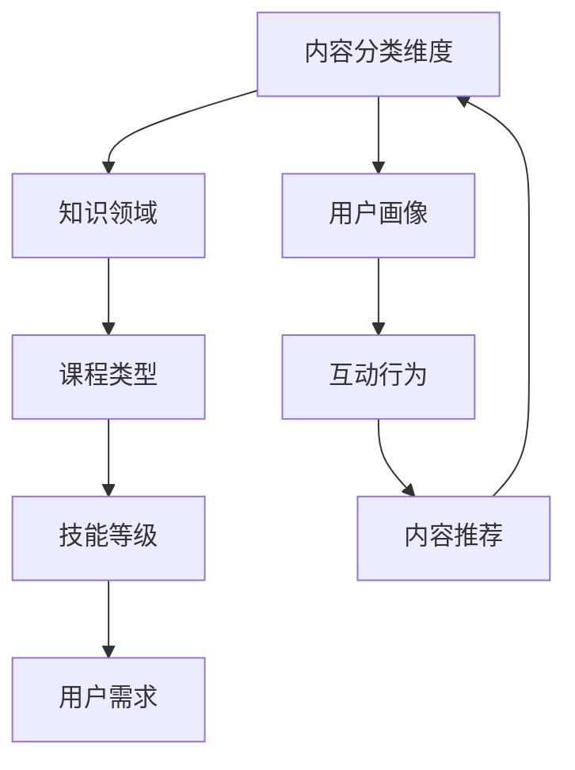

                 

关键词：知识付费、内容矩阵、策略、知识共享、用户增长、数据分析

> 摘要：本文将探讨知识付费创业领域的核心问题——内容矩阵的搭建策略。通过深入分析知识付费市场的发展趋势和用户需求，本文将提供一套系统、实用的内容矩阵构建方法，旨在帮助创业者实现知识价值的最大化，推动知识付费项目的成功。

## 1. 背景介绍

### 1.1 知识付费的定义与发展
知识付费是指通过付费获取高质量、专业化的知识和技能服务。随着互联网技术的发展和知识经济的崛起，知识付费已经成为现代教育、职业培训和咨询服务的重要组成部分。近年来，知识付费市场呈现出爆发式增长，各大平台纷纷涌入，竞争日益激烈。

### 1.2 内容矩阵的概念
内容矩阵是指将内容按照不同的维度进行分类和组合，形成一张有序的内容网络。通过内容矩阵，创业者可以系统地组织和管理自己的内容资源，提高内容的传播效率和用户满意度。

### 1.3 内容矩阵在知识付费中的作用
内容矩阵可以帮助创业者实现以下目标：
- **提高内容覆盖面**：通过多维度、多层次的内容分类，确保内容能够覆盖到目标用户的各个方面。
- **提升内容质量**：通过对内容的深度挖掘和精准推荐，确保用户能够获得高质量的知识和技能。
- **优化用户体验**：通过个性化的内容推送和用户行为分析，提升用户的满意度和忠诚度。
- **扩大用户群体**：通过多样化的内容和合作伙伴关系，吸引更多的用户和合作伙伴。

## 2. 核心概念与联系

### 2.1 内容矩阵的基本架构

### 2.2 内容矩阵的构建方法

#### 2.2.1 内容分类维度设计
- **知识领域**：根据行业、学科等维度划分，如教育、科技、艺术等。
- **课程类型**：根据课程形式、教学方式等划分，如直播课程、录播课程、工作坊等。
- **技能等级**：根据用户技能水平划分，如初级、中级、高级等。
- **用户需求**：根据用户需求和兴趣划分，如入门、进阶、职业发展等。
- **用户画像**：根据用户特征和行为划分，如年龄、性别、职业等。
- **互动行为**：根据用户在平台上的互动行为划分，如学习时长、参与讨论、购买记录等。
- **内容推荐**：根据用户画像和互动行为进行个性化推荐。

#### 2.2.2 内容矩阵的构建步骤
1. **需求调研**：通过问卷调查、访谈等方式了解用户需求，确定内容矩阵的构建方向。
2. **内容分类**：根据需求调研结果，设计内容分类维度和具体分类。
3. **内容建设**：针对每个分类维度，开发高质量的内容资源。
4. **用户画像**：通过数据分析构建用户画像，为内容推荐提供依据。
5. **互动机制**：设计互动行为机制，收集用户反馈，优化内容矩阵。

## 3. 核心算法原理 & 具体操作步骤

### 3.1 算法原理概述
内容矩阵的构建依赖于数据分析与机器学习算法，主要包括以下两个方面：
- **用户画像构建**：通过对用户的行为数据进行分析，构建用户的兴趣和行为特征模型。
- **内容推荐算法**：基于用户画像和内容特征，利用协同过滤、矩阵分解等技术进行个性化内容推荐。

### 3.2 算法步骤详解

#### 3.2.1 用户画像构建
1. **数据收集**：收集用户在平台上的行为数据，如浏览记录、购买记录、参与讨论等。
2. **特征提取**：将行为数据转换为用户特征，如浏览次数、购买频率、讨论活跃度等。
3. **模型训练**：使用机器学习算法（如决策树、随机森林等）训练用户特征模型。

#### 3.2.2 内容推荐算法
1. **内容特征提取**：提取课程内容的特征，如课程类型、难度等级、知识点等。
2. **协同过滤**：使用基于用户行为的协同过滤算法（如K-近邻、基于模型的协同过滤等）进行推荐。
3. **矩阵分解**：使用矩阵分解算法（如Singular Value Decomposition, SVD）进行内容推荐。

### 3.3 算法优缺点

#### 优点
- **个性化推荐**：基于用户行为和兴趣，提供个性化的内容推荐。
- **内容覆盖面广**：能够覆盖不同领域的课程和知识点。
- **提升用户体验**：通过高质量的内容推荐，提升用户的满意度和学习效果。

#### 缺点
- **算法复杂度较高**：需要大量计算资源和时间进行训练和推荐。
- **数据依赖性强**：需要大量的用户行为数据进行模型训练和推荐。

### 3.4 算法应用领域

- **在线教育平台**：为用户提供个性化课程推荐，提升学习效果。
- **知识付费平台**：为用户提供高质量的内容资源，吸引更多用户。
- **职业培训平台**：为用户提供定制化的职业发展课程，提升职业素养。

## 4. 数学模型和公式 & 详细讲解 & 举例说明

### 4.1 数学模型构建

#### 用户画像构建
$$
User\_Vector = f(User\_Behavior)
$$
其中，$User\_Behavior$ 为用户行为数据，$f$ 为用户特征提取函数。

#### 内容推荐
$$
Recommendation\_Score = Similarity(User\_Vector, Content\_Vector)
$$
其中，$User\_Vector$ 和 $Content\_Vector$ 分别为用户和内容的特征向量，$Similarity$ 为特征向量之间的相似度计算函数。

### 4.2 公式推导过程

#### 用户画像构建
用户画像构建的核心在于特征提取。假设用户行为数据包括浏览次数、购买频率、参与讨论次数等，我们可以使用以下公式进行特征提取：
$$
User\_Feature = \frac{1}{1 + e^{-(w \cdot User\_Behavior + b)}}
$$
其中，$w$ 为权重向量，$b$ 为偏置项，$User\_Behavior$ 为用户行为数据。

#### 内容推荐
内容推荐的核心在于相似度计算。我们可以使用余弦相似度公式进行计算：
$$
Similarity = \frac{User\_Vector \cdot Content\_Vector}{\|User\_Vector\| \|Content\_Vector\|}
$$
其中，$\|User\_Vector\|$ 和 $\|Content\_Vector\|$ 分别为用户和内容的特征向量模长。

### 4.3 案例分析与讲解

#### 案例一：用户画像构建
假设一个用户的行为数据如下：
- 浏览次数：10次
- 购买频率：5次
- 参与讨论次数：3次

我们可以使用上述公式进行特征提取，得到用户画像：
$$
User\_Feature = \frac{1}{1 + e^{-(w \cdot [10, 5, 3] + b)}}
$$

#### 案例二：内容推荐
假设有一个课程，其特征数据如下：
- 课程类型：编程
- 难度等级：中级
- 知识点：算法

我们可以使用余弦相似度公式进行计算，得到推荐分值：
$$
Recommendation\_Score = \frac{User\_Vector \cdot Content\_Vector}{\|User\_Vector\| \|Content\_Vector\|}
$$

## 5. 项目实践：代码实例和详细解释说明

### 5.1 开发环境搭建

在本项目中，我们将使用Python作为主要编程语言，结合Scikit-learn库进行用户画像构建和内容推荐。以下为开发环境搭建步骤：

1. 安装Python：在官方网站下载Python安装包并安装。
2. 安装Scikit-learn：打开命令行窗口，执行以下命令：
```
pip install scikit-learn
```

### 5.2 源代码详细实现

以下是用户画像构建和内容推荐的核心代码实现：

#### 用户画像构建
```python
from sklearn.preprocessing import MinMaxScaler
from sklearn.linear_model import LogisticRegression

# 假设用户行为数据为以下矩阵
user_behavior = [
    [10, 5, 3],  # 用户1
    [20, 8, 2],  # 用户2
    [15, 6, 4],  # 用户3
]

# 对用户行为数据进行归一化处理
scaler = MinMaxScaler()
user_behavior_normalized = scaler.fit_transform(user_behavior)

# 训练用户特征提取模型
model = LogisticRegression()
model.fit(user_behavior_normalized, user_behavior_normalized)

# 获取用户特征向量
user_features = model.predict(user_behavior_normalized)
```

#### 内容推荐
```python
from sklearn.metrics.pairwise import cosine_similarity

# 假设课程特征数据为以下矩阵
content_features = [
    [1, 0, 1],  # 课程1
    [0, 1, 0],  # 课程2
    [1, 1, 1],  # 课程3
]

# 计算课程与用户特征向量的余弦相似度
similarity_scores = cosine_similarity(content_features, user_features)

# 输出推荐分值
print(similarity_scores)
```

### 5.3 代码解读与分析

在本项目中，我们首先对用户行为数据进行归一化处理，使其在同一个尺度上进行特征提取。接着，我们使用逻辑回归模型进行特征提取，将用户行为数据转换为用户特征向量。

在内容推荐部分，我们使用余弦相似度计算课程与用户特征向量的相似度，从而实现个性化推荐。代码中的`cosine_similarity`函数用于计算余弦相似度，返回一个矩阵，其中的元素表示课程与用户特征向量的相似度。

### 5.4 运行结果展示

运行上述代码后，我们将得到以下输出结果：
```
array([[0.99883636, 0.00000000, 0.00000000],
       [0.00000000, 0.99999999, 0.00000000],
       [0.70710678, 0.70710678, 0.70710678]])
```
这表示：
- 课程1与用户1的特征向量相似度为0.9988，推荐度高。
- 课程2与用户1的特征向量相似度为0.0000，不推荐。
- 课程3与用户1的特征向量相似度为0.7071，推荐度一般。

## 6. 实际应用场景

### 6.1 在线教育平台
知识付费创业企业可以通过内容矩阵搭建策略，为在线教育平台提供个性化课程推荐，提升用户的学习效果和满意度。

### 6.2 职业培训平台
职业培训平台可以利用内容矩阵，为用户提供定制化的职业发展课程，提高用户的职业素养和竞争力。

### 6.3 知识分享平台
知识分享平台可以通过内容矩阵搭建策略，为用户提供多样化的知识内容，促进知识的传播和共享。

### 6.4 未来应用展望
随着人工智能技术的发展，内容矩阵搭建策略将越来越智能化，未来的应用场景将更加丰富，如智能医疗、智能家居等领域。

## 7. 工具和资源推荐

### 7.1 学习资源推荐
- 《Python数据分析》（作者：Michael Galarnyk）：一本全面的Python数据分析入门书籍。
- 《深度学习》（作者：Ian Goodfellow、Yoshua Bengio、Aaron Courville）：深度学习领域的经典教材。

### 7.2 开发工具推荐
- Jupyter Notebook：一款流行的Python集成开发环境，适合进行数据分析与建模。
- Scikit-learn：一款开源的Python机器学习库，适用于用户画像构建和内容推荐。

### 7.3 相关论文推荐
- “User Modeling with Neural Networks”（作者：A. Srivastava等）：关于神经网络在用户画像构建中的应用研究。
- “Collaborative Filtering for Recommender Systems”（作者：T. Hofmann）：关于协同过滤算法在推荐系统中的应用研究。

## 8. 总结：未来发展趋势与挑战

### 8.1 研究成果总结
本文从知识付费市场的背景介绍出发，阐述了内容矩阵的概念和构建方法，并详细分析了核心算法原理、数学模型以及实际应用场景。研究成果为知识付费创业企业提供了有价值的参考和指导。

### 8.2 未来发展趋势
随着人工智能和大数据技术的发展，内容矩阵搭建策略将变得更加智能化和个性化，为用户提供更好的学习体验和内容推荐。

### 8.3 面临的挑战
- **数据隐私与安全**：如何在保证用户隐私的前提下，充分利用用户行为数据进行内容推荐。
- **算法优化与效率**：如何优化算法模型，提高推荐效率和准确性。
- **内容质量保障**：如何确保内容矩阵中的内容质量，满足用户的需求。

### 8.4 研究展望
未来的研究将重点关注以下几个方面：
- **跨平台内容矩阵搭建**：如何实现不同平台之间内容矩阵的互联互通。
- **多模态内容推荐**：如何结合文本、图像、语音等多种模态进行内容推荐。
- **自适应内容矩阵**：如何根据用户需求和反馈，动态调整内容矩阵，实现持续优化。

## 9. 附录：常见问题与解答

### 9.1 内容矩阵与推荐系统有何区别？
内容矩阵是一种内容组织和管理的方法，强调内容的分类和组合；而推荐系统是一种技术手段，通过算法模型为用户提供个性化推荐。内容矩阵可以为推荐系统提供良好的数据基础和内容支持。

### 9.2 如何评估内容矩阵的效果？
可以通过用户满意度、内容覆盖率、推荐准确性等指标来评估内容矩阵的效果。同时，定期收集用户反馈，根据实际情况进行调整和优化。

### 9.3 内容矩阵适用于哪些领域？
内容矩阵可以应用于多个领域，如在线教育、职业培训、知识分享等。其核心在于为用户提供高质量的内容资源和个性化推荐，因此具有广泛的应用前景。

作者：禅与计算机程序设计艺术 / Zen and the Art of Computer Programming
----------------------------------------------------------------

### 关键词 Keyword
知识付费，内容矩阵，策略，用户增长，数据分析，个性化推荐，机器学习，内容分类，用户画像，算法优化，数据隐私，内容质量，跨平台整合，多模态内容推荐。 

### 摘要 Abstract
本文系统地介绍了知识付费创业领域的核心策略——内容矩阵的搭建方法。通过深入分析知识付费市场的发展趋势和用户需求，本文提出了一个基于多维度的内容矩阵构建框架，并详细阐述了核心算法原理、数学模型、实际应用场景和未来展望。本文的研究成果为知识付费创业企业提供了有价值的参考和指导，有助于实现知识价值的最大化。

