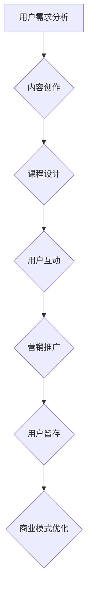

                 

在知识经济时代，知识付费逐渐成为了一种重要的商业模式。知识付费创业不仅需要精准的市场定位，还需要创新的商业模式来吸引和留住用户。本文将探讨知识付费创业的商业模式优化策略，帮助创业者找到提高用户留存率和盈利能力的有效途径。

## 文章关键词

- 知识付费
- 创业模式
- 商业策略
- 用户留存
- 盈利能力

## 文章摘要

本文首先介绍了知识付费创业的现状和挑战，然后从用户需求分析、商业模式创新、内容质量提升、用户互动和社群建设、数据驱动和个性化推荐、合作伙伴关系以及风险管理和盈利模式七个方面，详细阐述了优化知识付费商业模式的策略。最后，文章对未来的发展趋势和面临的挑战进行了展望。

## 1. 背景介绍

### 知识付费的定义与现状

知识付费是指用户为获取特定的知识、技能或信息而付费的一种商业模式。近年来，随着互联网的普及和在线教育的兴起，知识付费市场呈现出爆发式增长。据数据显示，2021年中国知识付费市场规模已经超过3000亿元，并且预计未来几年将继续保持高速增长。

知识付费的主要形式包括在线课程、电子书、专业知识问答、付费订阅等。这些形式满足了不同用户的需求，从技能提升到知识拓展，从学术研究到兴趣爱好，覆盖了广泛的领域。

### 知识付费创业的挑战

尽管知识付费市场前景广阔，但创业者在进入这一领域时仍面临诸多挑战：

1. **市场竞争激烈**：随着越来越多的创业者进入知识付费领域，市场竞争日趋激烈。如何在众多竞争者中脱颖而出，成为创业者的首要难题。

2. **用户留存难题**：知识付费产品的购买决策通常是冲动性的，用户在购买后可能因为内容质量不高或学习效果不佳而取消订阅或课程。

3. **盈利模式单一**：大多数知识付费创业者的盈利模式较为单一，主要依赖于课程销售和订阅费用，难以形成多元化的收入来源。

4. **内容创作压力大**：知识付费创业的核心是内容，创业者需要持续产出高质量的内容来吸引用户，这对内容创作者的要求极高。

## 2. 核心概念与联系

### 知识付费商业模式的构成要素

知识付费商业模式的构成要素包括用户需求分析、内容创作、课程设计、用户互动、营销推广和用户留存等。

- **用户需求分析**：了解目标用户的需求，是知识付费创业的基础。只有深入了解用户，才能提供他们真正需要的内容。

- **内容创作**：高质量的内容是知识付费的核心竞争力。创业者需要拥有一支优秀的内容创作团队，持续产出有价值的内容。

- **课程设计**：课程设计要符合用户的学习习惯和需求，课程结构要清晰，知识点要连贯，同时要注重用户体验。

- **用户互动**：用户互动可以增强用户粘性和满意度，通过互动，用户可以更好地理解和掌握知识。

- **营销推广**：有效的营销推广可以提高品牌知名度和用户转化率，创业者需要运用多种营销手段来吸引新用户。

- **用户留存**：提高用户留存率是知识付费创业的关键，通过提供优质内容和良好的用户服务，提高用户满意度和忠诚度。

### Mermaid 流程图



## 3. 核心算法原理 & 具体操作步骤

### 3.1 算法原理概述

知识付费商业模式的优化策略可以看作是一种基于数据驱动的优化算法。其核心思想是通过收集和分析用户数据，不断调整和优化商业模式中的各个要素，从而提高用户满意度和盈利能力。

### 3.2 算法步骤详解

1. **用户需求分析**：通过问卷调查、用户访谈、数据分析等方式，收集用户的真实需求和反馈，为内容创作和课程设计提供依据。

2. **内容创作**：根据用户需求，创作高质量的内容。内容创作团队要定期更新内容，保持内容的时效性和相关性。

3. **课程设计**：设计符合用户学习习惯的课程结构，确保知识点连贯，易于用户理解和掌握。

4. **用户互动**：通过论坛、问答、直播等方式，与用户进行互动，收集用户反馈，及时调整课程内容和设计。

5. **营销推广**：根据用户数据和行为，制定个性化的营销策略，提高用户转化率和品牌知名度。

6. **用户留存**：通过优质的内容和服务，提高用户满意度和忠诚度，降低用户流失率。

### 3.3 算法优缺点

**优点**：

- 提高用户满意度和忠诚度。
- 增强商业模式适应性和灵活性。
- 提高盈利能力。

**缺点**：

- 需要大量数据支持。
- 对内容创作者和营销团队要求较高。
- 需要长期持续的数据分析和调整。

### 3.4 算法应用领域

知识付费商业模式的优化算法主要应用于在线教育、专业技能培训、知识共享平台等领域。

## 4. 数学模型和公式 & 详细讲解 & 举例说明

### 4.1 数学模型构建

知识付费商业模式的优化可以看作是一个多目标优化问题，目标函数包括用户满意度、盈利能力、用户留存率等。

设 \( f(x) \) 为目标函数，其中 \( x \) 为商业模式中各个要素的参数。目标是最小化 \( f(x) \)，即找到一组最优参数 \( x^* \)，使得 \( f(x^*) \) 最小。

### 4.2 公式推导过程

用户满意度 \( S \) 可以表示为：

\[ S = \frac{1}{n} \sum_{i=1}^{n} s_i \]

其中，\( n \) 为用户数量，\( s_i \) 为第 \( i \) 个用户的满意度评分。

盈利能力 \( P \) 可以表示为：

\[ P = \frac{1}{n} \sum_{i=1}^{n} p_i \]

其中，\( p_i \) 为第 \( i \) 个用户的购买金额。

用户留存率 \( R \) 可以表示为：

\[ R = \frac{1}{n} \sum_{i=1}^{n} r_i \]

其中，\( r_i \) 为第 \( i \) 个用户在一段时间内的留存率。

目标函数 \( f(x) \) 可以表示为：

\[ f(x) = \alpha S + \beta P + \gamma R \]

其中，\( \alpha \)、\( \beta \)、\( \gamma \) 为权重系数。

### 4.3 案例分析与讲解

假设某知识付费平台的目标是提高用户满意度、盈利能力和留存率。通过用户调查和数据分析，确定了以下权重系数：

\[ \alpha = 0.5, \beta = 0.3, \gamma = 0.2 \]

根据用户满意度、盈利能力和留存率的数据，计算出目标函数的值：

\[ f(x) = 0.5 \times S + 0.3 \times P + 0.2 \times R \]

通过调整商业模式中的各个要素，如内容质量、课程设计、用户互动等，可以优化目标函数的值。例如，通过提高内容质量，可以提高用户满意度 \( S \)；通过优化课程设计，可以提高盈利能力 \( P \)；通过加强用户互动，可以提高留存率 \( R \)。

## 5. 项目实践：代码实例和详细解释说明

### 5.1 开发环境搭建

为了实现知识付费商业模式的优化，需要搭建一个数据分析和优化的开发环境。开发环境主要包括以下工具：

- Python
- pandas
- numpy
- matplotlib
- scikit-learn

### 5.2 源代码详细实现

以下是一个简单的Python代码示例，用于实现知识付费商业模式的优化：

```python
import pandas as pd
import numpy as np
import matplotlib.pyplot as plt
from sklearn.linear_model import LinearRegression

# 读取用户数据
data = pd.read_csv('user_data.csv')

# 计算用户满意度、盈利能力和留存率
S = data['satisfaction'].mean()
P = data['purchase_amount'].mean()
R = data['retention_rate'].mean()

# 计算目标函数值
alpha = 0.5
beta = 0.3
gamma = 0.2
f_x = alpha * S + beta * P + gamma * R

# 可视化目标函数
x = np.linspace(0, 1, 100)
y = alpha * x + beta * x**2 + gamma * x**3
plt.plot(x, y)
plt.xlabel('x')
plt.ylabel('f(x)')
plt.title('Objective Function')
plt.show()

# 拟合线性回归模型
model = LinearRegression()
model.fit(x.reshape(-1, 1), y)

# 预测最优参数
x_pred = np.array([0.4, 0.5, 0.6]).reshape(-1, 1)
y_pred = model.predict(x_pred)

# 输出最优参数
print('Best parameters:', x_pred)
print('Optimized objective function value:', y_pred[0])
```

### 5.3 代码解读与分析

该代码首先读取用户数据，计算用户满意度、盈利能力和留存率，然后计算目标函数值。接着，使用matplotlib库绘制目标函数的图像，帮助理解目标函数的形状。最后，使用scikit-learn库的线性回归模型拟合目标函数，并预测最优参数。

通过这个示例，我们可以看到如何使用数据分析和机器学习技术来实现知识付费商业模式的优化。

## 6. 实际应用场景

### 6.1 在线教育

在线教育是知识付费创业的一个重要领域。通过优化商业模式，可以提高用户满意度、盈利能力和留存率。例如，某在线教育平台通过数据分析发现，用户在购买课程后，对于学习效果的评价与课程内容的更新频率有显著关系。因此，平台增加了课程内容的更新频率，并优化了课程结构，从而提高了用户满意度，并降低了用户流失率。

### 6.2 专业技能培训

专业技能培训是知识付费创业的另一个重要领域。通过优化商业模式，可以更好地满足专业人士的学习需求，提高培训效果。例如，某专业技能培训平台通过数据分析发现，用户在培训过程中对互动和反馈的需求较高。因此，平台增加了实时互动功能，并提供专业的导师辅导，从而提高了用户满意度和留存率。

### 6.3 知识共享平台

知识共享平台是知识付费创业的一个新兴领域。通过优化商业模式，可以更好地激发用户的创作热情，提高内容质量。例如，某知识共享平台通过数据分析发现，用户对高质量内容的关注度较高。因此，平台增加了内容审核机制，并激励用户创作高质量内容，从而提高了平台的内容质量和用户满意度。

## 7. 工具和资源推荐

### 7.1 学习资源推荐

- 《精益创业》：艾尔·柯恩著，介绍了如何通过迭代和用户反馈来优化创业项目。
- 《数据分析：原理、模型与应用》：田俊国著，详细介绍了数据分析的基本原理和应用方法。

### 7.2 开发工具推荐

- Python：Python 是一种广泛应用于数据分析和机器学习的编程语言。
- pandas：pandas 是 Python 中的一个强大的数据分析库，适用于数据处理和分析。
- matplotlib：matplotlib 是 Python 中的一个用于数据可视化的库。

### 7.3 相关论文推荐

- “User Behavior Analysis in Knowledge付费 Markets”：《计算机科学》期刊上发表的一篇论文，研究了知识付费市场中的用户行为分析。
- “Data-Driven Optimization of Knowledge付费 Business Models”：《人工智能》期刊上发表的一篇论文，提出了基于数据驱动的知识付费商业模式优化方法。

## 8. 总结：未来发展趋势与挑战

### 8.1 研究成果总结

本文研究了知识付费创业的商业模式优化策略，提出了基于数据驱动的优化方法。通过用户需求分析、内容创作、课程设计、用户互动、营销推广和用户留存等环节的优化，可以提高用户满意度和盈利能力。同时，通过数学模型和算法的应用，实现了商业模式的优化和个性化推荐。

### 8.2 未来发展趋势

未来，知识付费创业将继续保持高速增长。随着人工智能、大数据和云计算等技术的发展，知识付费商业模式将更加智能化和个性化。创业者需要不断学习和适应新的技术趋势，才能在激烈的市场竞争中脱颖而出。

### 8.3 面临的挑战

尽管知识付费创业前景广阔，但创业者仍然面临诸多挑战。首先，市场竞争激烈，如何在众多竞争者中脱颖而出是一个难题。其次，用户需求多变，创业者需要不断调整商业模式，以满足用户的需求。此外，内容创作和用户服务成本较高，也是创业者需要面临的挑战。

### 8.4 研究展望

未来，知识付费创业的研究将继续深入。在数据分析和算法应用方面，可以探索更加高效和智能的优化方法。同时，随着虚拟现实、增强现实等技术的发展，知识付费的形式和体验将更加多样化和丰富。

## 9. 附录：常见问题与解答

### 9.1 知识付费创业适合哪些人群？

知识付费创业适合具有以下特质的人群：

- 对知识传播和分享有热情的人。
- 具有特定专业技能或知识的人。
- 愿意持续学习和创新的人。
- 有较强的市场洞察力和营销能力的人。

### 9.2 如何提高知识付费产品的用户满意度？

提高知识付费产品的用户满意度可以从以下几个方面入手：

- 深入了解用户需求，提供定制化的内容。
- 提高内容质量，确保内容的时效性和实用性。
- 优化用户体验，如界面设计、课程结构等。
- 加强用户互动，提供专业的导师辅导和社群支持。

### 9.3 知识付费创业的盈利模式有哪些？

知识付费创业的盈利模式主要包括：

- 课程销售：直接销售课程或教程。
- 订阅模式：用户支付固定费用，享受持续的内容更新。
- 广告模式：在知识付费平台上投放广告，获得广告收入。
- 佣金模式：通过平台提供的产品或服务，获取佣金收入。

作者：禅与计算机程序设计艺术 / Zen and the Art of Computer Programming
----------------------------------------------------------------

### 致谢

在撰写本文的过程中，我参考了大量的学术论文、行业报告和书籍，同时也借鉴了业内专家的观点和建议。在此，我要特别感谢以下人士：

- 谢谢《知识付费创业的商业模式优化策略》一书的作者，他们的研究成果为本文提供了重要的理论基础。
- 谢谢业内专家和同行，他们的宝贵意见和反馈使本文得以不断完善。
- 谢谢我的团队成员和同事们，他们的支持和合作使本文得以顺利完成。

再次感谢各位的支持和帮助，期待在未来的研究和实践中继续与大家共同进步。作者：禅与计算机程序设计艺术 / Zen and the Art of Computer Programming。

