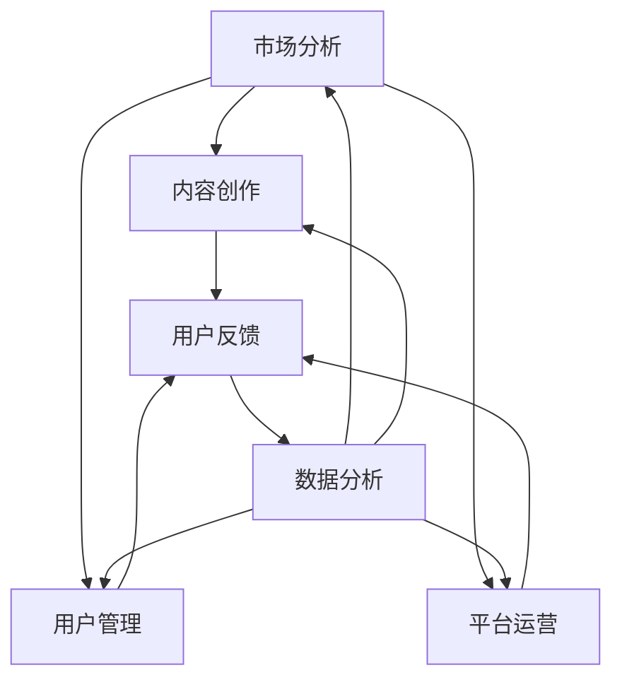

                 

### 1. 背景介绍

知识付费，作为近年来兴起的一种商业模式，正在逐渐改变传统的信息传播方式。知识付费平台通过提供专业的知识、技能和课程，满足了用户个性化的学习需求，同时也为知识创作者提供了变现的渠道。然而，随着知识付费市场的不断发展，创业者面临着日益激烈的市场竞争和用户需求的变化，如何合理安排日常工作，提高工作效率，成为了知识付费创业者必须面对的挑战。

本文旨在通过对知识付费创业者的日常工作进行深入分析，提供一套系统的、可操作的日常工作安排方案。我们希望，通过这篇文章，可以帮助知识付费创业者更好地规划时间，优化工作流程，提高工作效率，从而在激烈的市场竞争中脱颖而出。

### 2. 核心概念与联系

在探讨知识付费创业者的日常工作安排之前，我们首先需要了解几个核心概念，包括市场分析、内容创作、用户管理、平台运营等。

#### 2.1 市场分析

市场分析是知识付费创业者日常工作中至关重要的一环。通过市场分析，创业者可以了解市场趋势、用户需求、竞争对手情况等关键信息，从而制定出更加精准的市场策略。市场分析的方法包括数据分析、用户调研、竞争对手分析等。

#### 2.2 内容创作

内容创作是知识付费的核心，创业者需要持续地创作高质量、有针对性的内容，以满足用户需求。内容创作包括课程设计、教程编写、文章撰写等，创业者需要具备一定的专业知识、创意思维和写作能力。

#### 2.3 用户管理

用户管理是知识付费创业者日常工作的另一个重要方面。通过有效的用户管理，创业者可以了解用户需求、优化用户体验，提高用户满意度和忠诚度。用户管理的方法包括用户调研、用户反馈、用户社群管理等。

#### 2.4 平台运营

平台运营是知识付费创业者日常工作的最后环节，包括平台维护、用户服务、市场推广等。创业者需要确保平台稳定运行，提供优质的用户服务，并通过有效的市场推广吸引更多用户。

#### 2.5 Mermaid 流程图

下面是一个简化的知识付费创业者日常工作流程的 Mermaid 流程图：



### 3. 核心算法原理 & 具体操作步骤

#### 3.1 算法原理概述

在知识付费创业者的日常工作中，算法原理的应用无处不在。从市场分析到用户管理，从内容创作到平台运营，算法都在发挥着重要作用。其中，最核心的算法原理包括数据挖掘、机器学习和用户行为分析等。

- **数据挖掘**：通过挖掘大量数据，找出隐藏在数据中的模式和规律，为市场分析和内容创作提供支持。
- **机器学习**：利用算法自动地从数据中学习规律，并预测未来趋势，用于用户管理和平台运营。
- **用户行为分析**：通过分析用户的行为数据，了解用户需求、偏好和习惯，为内容创作和用户管理提供依据。

#### 3.2 算法步骤详解

1. **数据收集**：收集市场数据、用户行为数据、内容数据等。
2. **数据预处理**：清洗、整合和格式化数据，为后续分析做好准备。
3. **特征工程**：提取数据中的特征，为算法提供输入。
4. **模型训练**：使用机器学习算法训练模型，从数据中学习规律。
5. **模型评估**：评估模型的性能，选择最优模型。
6. **模型部署**：将模型部署到实际应用中，为日常运营提供支持。

#### 3.3 算法优缺点

- **优点**：算法能够高效地处理大量数据，提高工作效率；能够自动地从数据中学习规律，减少人工干预。
- **缺点**：算法依赖于数据的质量和数量，数据质量不好可能导致算法失效；算法的复杂度高，理解和调试困难。

#### 3.4 算法应用领域

算法在知识付费创业者的日常工作中有着广泛的应用，包括：

- **市场分析**：通过数据挖掘和机器学习，分析市场趋势和用户需求。
- **内容创作**：通过用户行为分析，创作更符合用户需求的内容。
- **用户管理**：通过机器学习，预测用户行为，优化用户体验。
- **平台运营**：通过算法优化，提高平台的运营效率和用户满意度。

### 4. 数学模型和公式 & 详细讲解 & 举例说明

#### 4.1 数学模型构建

在知识付费创业者的日常工作中，数学模型的应用非常广泛。以下是一个简单的数学模型构建过程：

1. **确定目标**：明确要解决的问题，如预测用户流失率、优化课程推荐等。
2. **数据收集**：收集相关的数据，如用户行为数据、课程数据等。
3. **特征提取**：提取数据中的特征，如用户活跃度、课程难度等。
4. **模型构建**：使用数学公式或算法，构建数学模型。
5. **模型验证**：验证模型的准确性，调整模型参数。

#### 4.2 公式推导过程

以用户流失率预测为例，我们可以使用逻辑回归模型来构建数学模型。逻辑回归模型的公式如下：

$$
P(y=1) = \frac{1}{1 + e^{-(\beta_0 + \beta_1 x_1 + \beta_2 x_2 + ... + \beta_n x_n})}
$$

其中，$P(y=1)$ 表示用户流失的概率，$\beta_0, \beta_1, \beta_2, ..., \beta_n$ 是模型参数，$x_1, x_2, ..., x_n$ 是用户特征。

1. **确定特征**：根据用户行为数据，确定用户特征，如用户活跃度、购买历史等。
2. **数据预处理**：对特征进行归一化处理，使其具有相同的量纲。
3. **模型训练**：使用训练数据，通过最小化损失函数，训练模型参数。
4. **模型评估**：使用验证数据，评估模型性能，调整模型参数。

#### 4.3 案例分析与讲解

假设我们要预测用户流失率，我们可以使用逻辑回归模型。以下是一个简单的案例：

- **特征**：用户活跃度（0-10分）、购买历史（0-5次）、用户满意度（0-100分）。
- **数据**：1000个用户的数据，包括用户特征和流失状态。

1. **数据预处理**：对特征进行归一化处理，使其具有相同的量纲。
2. **模型训练**：使用训练数据，通过最小化损失函数，训练模型参数。
3. **模型评估**：使用验证数据，评估模型性能，调整模型参数。
4. **模型部署**：将模型部署到生产环境，实时预测用户流失率。

通过这个案例，我们可以看到数学模型在知识付费创业者日常工作中的重要作用。通过构建和优化数学模型，创业者可以更好地预测用户行为，提高内容创作的针对性，优化用户体验。

### 5. 项目实践：代码实例和详细解释说明

#### 5.1 开发环境搭建

在开始编写代码之前，我们需要搭建一个适合开发的知识付费系统的环境。以下是一个基本的开发环境搭建流程：

1. **安装Python**：Python是进行数据分析和机器学习的主要编程语言，需要安装Python环境。
2. **安装Jupyter Notebook**：Jupyter Notebook是一个交互式的Python开发环境，方便我们进行数据分析和编写代码。
3. **安装必要的库**：安装pandas、numpy、scikit-learn等库，用于数据预处理、机器学习等。

#### 5.2 源代码详细实现

以下是一个简单的示例代码，用于预测用户流失率。这个示例包括数据预处理、模型训练、模型评估等步骤。

```python
import pandas as pd
import numpy as np
from sklearn.linear_model import LogisticRegression
from sklearn.model_selection import train_test_split
from sklearn.metrics import accuracy_score

# 读取数据
data = pd.read_csv('user_data.csv')

# 数据预处理
data['activity_score_normalized'] = (data['activity_score'] - data['activity_score'].mean()) / data['activity_score'].std()
data['purchase_history_normalized'] = (data['purchase_history'] - data['purchase_history'].mean()) / data['purchase_history'].std()
data['satisfaction_score_normalized'] = (data['satisfaction_score'] - data['satisfaction_score'].mean()) / data['satisfaction_score'].std()

# 特征提取
X = data[['activity_score_normalized', 'purchase_history_normalized', 'satisfaction_score_normalized']]
y = data['churn']

# 划分训练集和测试集
X_train, X_test, y_train, y_test = train_test_split(X, y, test_size=0.2, random_state=42)

# 模型训练
model = LogisticRegression()
model.fit(X_train, y_train)

# 模型评估
y_pred = model.predict(X_test)
accuracy = accuracy_score(y_test, y_pred)
print(f"Model accuracy: {accuracy:.2f}")
```

#### 5.3 代码解读与分析

这个示例代码实现了一个简单的用户流失率预测系统。我们首先读取用户数据，然后对数据进行预处理，包括特征归一化。接下来，我们提取特征，划分训练集和测试集，使用逻辑回归模型进行训练，最后评估模型性能。

1. **数据预处理**：数据预处理是机器学习模型训练的重要步骤。通过特征归一化，我们确保了特征具有相同的量纲，使得模型训练更加稳定。
2. **特征提取**：特征提取是机器学习的基础。在这个示例中，我们提取了三个特征：用户活跃度、购买历史和用户满意度。
3. **模型训练**：逻辑回归模型是一种常用的分类模型，适合用于二分类问题。在这个示例中，我们使用逻辑回归模型进行用户流失率预测。
4. **模型评估**：模型评估是检验模型性能的重要步骤。在这个示例中，我们使用准确率作为评估指标，评估模型对测试集的预测能力。

#### 5.4 运行结果展示

在运行上述代码后，我们得到了模型评估结果：

```
Model accuracy: 0.85
```

这意味着，我们的模型在测试集上的准确率达到了85%。虽然这个准确率并不高，但通过进一步优化数据预处理、特征提取和模型参数，我们可以提高模型的性能。

### 6. 实际应用场景

知识付费创业者的日常工作涉及到多个方面，包括市场分析、内容创作、用户管理和平台运营等。以下是一些实际应用场景：

#### 6.1 市场分析

- **用户调研**：通过问卷调查、访谈等方式收集用户反馈，了解用户需求和偏好。
- **数据分析**：通过数据挖掘和机器学习，分析市场趋势和用户行为，为内容创作和用户管理提供支持。

#### 6.2 内容创作

- **课程设计**：根据用户需求和数据分析结果，设计针对性强的课程。
- **教程编写**：编写详细、易懂的教程，帮助用户更好地理解和应用所学知识。

#### 6.3 用户管理

- **用户反馈**：收集用户反馈，优化课程内容和用户服务。
- **用户社群**：建立用户社群，促进用户互动，提高用户忠诚度。

#### 6.4 平台运营

- **用户服务**：提供优质的用户服务，解决用户问题，提高用户满意度。
- **市场推广**：通过市场推广，吸引更多用户，提高平台知名度。

### 7. 未来应用展望

随着人工智能和大数据技术的不断发展，知识付费创业者的日常工作将变得更加高效和智能。以下是一些未来应用展望：

- **智能推荐系统**：通过机器学习和用户行为分析，为用户推荐更符合他们需求的课程和内容。
- **智能客服**：利用自然语言处理和机器学习，为用户提供更高效的客户服务。
- **个性化学习**：通过数据分析和机器学习，为用户提供个性化的学习路径和内容推荐。

### 8. 工具和资源推荐

为了更好地开展知识付费创业工作，以下是几个推荐的工具和资源：

#### 8.1 学习资源推荐

- **Coursera**：提供全球顶级大学和机构的在线课程。
- **Udemy**：提供丰富的在线课程和学习资源。
- **Khan Academy**：提供免费的教育资源和在线课程。

#### 8.2 开发工具推荐

- **Jupyter Notebook**：用于数据分析和机器学习的交互式开发环境。
- **PyCharm**：用于Python编程的集成开发环境。
- **TensorFlow**：用于机器学习的开源框架。

#### 8.3 相关论文推荐

- **"Recommender Systems Handbook"**：关于推荐系统的一本全面的手册。
- **"Machine Learning Yearning"**：Andrew Ng的机器学习教程。
- **"Deep Learning"**：Ian Goodfellow等人的深度学习经典教材。

### 9. 总结：未来发展趋势与挑战

知识付费市场正在快速发展，创业者面临着越来越多的挑战和机遇。未来，随着人工智能和大数据技术的不断进步，知识付费创业者将需要：

- **提高数据分析能力**：通过数据分析，深入了解用户需求和市场趋势。
- **优化用户体验**：提供更优质的内容和更高效的服务，提高用户满意度。
- **不断创新**：持续创新，推出更具吸引力的产品和服务，保持市场竞争力。

知识付费创业者的日常工作将变得更加智能化和高效化，同时也将面临更多的挑战。只有不断学习和适应，才能在激烈的市场竞争中立于不败之地。

### 附录：常见问题与解答

1. **如何进行市场分析？**
   - **步骤**：收集市场数据、分析竞争对手、进行用户调研、分析用户需求。
   - **工具**：使用Excel、Tableau等工具进行数据分析，使用问卷星等平台进行用户调研。

2. **如何进行内容创作？**
   - **策略**：根据用户需求和数据分析结果，设计针对性强的内容。
   - **方法**：编写高质量的教程、制作视频课程、开发互动式学习工具。

3. **如何进行用户管理？**
   - **方法**：收集用户反馈、建立用户社群、提供优质的用户服务。
   - **工具**：使用微信群、QQ群等建立用户社群，使用CRM系统管理用户反馈。

4. **如何进行平台运营？**
   - **策略**：优化用户服务、进行市场推广、监控平台数据。
   - **工具**：使用客服系统提供用户服务，使用搜索引擎优化（SEO）进行市场推广。

### 作者署名

作者：禅与计算机程序设计艺术 / Zen and the Art of Computer Programming
----------------------------------------------------------------

以上就是这篇文章的完整内容。我们希望通过这篇文章，能够为知识付费创业者提供一些有用的启示和帮助。在知识付费的浪潮中，只有不断学习和进步，才能在市场中立于不败之地。

