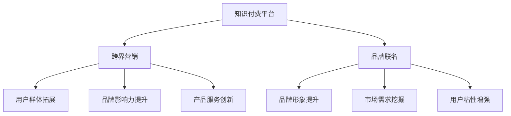

                 

在当今的数字化时代，知识付费已经成为一种主流的商业模式。而跨界营销与品牌联名则成为了知识付费行业中的一股新兴力量。本文将深入探讨知识付费如何实现跨界营销与品牌联名，为读者提供一整套策略和案例，以助您在知识付费领域取得成功。

## 关键词

- 知识付费
- 跨界营销
- 品牌联名
- 营销策略
- 用户增长

## 摘要

本文旨在揭示知识付费与跨界营销、品牌联名之间的联系，并介绍如何利用这些策略来增强品牌影响力、扩大用户群体、提升用户体验。通过案例分析和实践指导，读者将了解到具体操作方法，从而在知识付费市场中实现卓越表现。

## 1. 背景介绍

### 1.1 知识付费的现状

知识付费作为一种新兴商业模式，近年来在全球范围内取得了迅猛发展。随着互联网技术的不断进步，人们获取信息的途径变得更加多样化，同时对于高质量、专业知识的渴求也越来越强烈。知识付费平台如雨后春笋般涌现，满足了广大用户对于学习、提升自我的需求。

### 1.2 跨界营销与品牌联名

跨界营销指的是将两个或多个不同领域的产品或品牌进行合作，以实现资源共享、优势互补、市场拓展等目标。而品牌联名则是两个或多个品牌之间进行合作，共同推出新产品或服务，以增强品牌形象、提升市场份额。

## 2. 核心概念与联系

### 2.1 知识付费与跨界营销的联系

知识付费与跨界营销的结合，能够实现以下几方面的协同效应：

- **用户群体的拓展**：通过跨界合作，吸引不同领域、不同兴趣的用户群体，实现用户基数的扩大。
- **品牌影响力的提升**：跨界营销往往能够为知识付费平台带来新的曝光机会，提高品牌知名度和美誉度。
- **产品服务的创新**：跨界合作可以带来全新的产品或服务概念，满足用户多样化的需求。

### 2.2 知识付费与品牌联名的联系

品牌联名在知识付费领域同样具有重要意义：

- **品牌形象的提升**：品牌联名可以使知识付费平台获得更具影响力的品牌背书，从而提升整体形象。
- **市场需求的挖掘**：品牌联名可以挖掘出潜在的用户需求，为平台提供更多商业机会。
- **用户粘性的增强**：品牌联名可以提供更多的增值服务，增强用户的粘性，提高用户留存率。

### 2.3 Mermaid 流程图



## 3. 核心算法原理 & 具体操作步骤

### 3.1 算法原理概述

知识付费跨界营销与品牌联名的核心算法可以概括为以下几步：

1. **需求分析**：分析知识付费平台与目标品牌的用户需求、市场定位、品牌形象等，确定跨界合作的可能性。
2. **方案设计**：根据需求分析，设计具体的跨界营销与品牌联名方案，包括合作形式、合作内容、营销策略等。
3. **资源整合**：整合知识付费平台与目标品牌的资源，如用户数据、品牌影响力、营销渠道等，确保合作方案的顺利实施。
4. **执行与推广**：按照设计方案执行跨界营销与品牌联名活动，通过多渠道推广，提高活动的影响力和用户参与度。
5. **效果评估**：对跨界营销与品牌联名活动进行效果评估，总结经验教训，为后续合作提供参考。

### 3.2 算法步骤详解

1. **需求分析**：
   - 调研知识付费平台与目标品牌的用户群体、市场需求、竞争状况等。
   - 分析品牌形象、产品定位、营销策略等，确定跨界合作的优势和潜力。

2. **方案设计**：
   - 确定跨界合作的形式，如产品联名、活动合作、品牌代言等。
   - 制定具体的合作内容，如联合推出课程、举办活动、开展线上互动等。
   - 设计营销策略，包括宣传方式、推广渠道、活动节奏等。

3. **资源整合**：
   - 整合知识付费平台与目标品牌的资源，如用户数据、品牌影响力、营销渠道等。
   - 确保合作双方能够充分发挥各自的优势，实现资源互补。

4. **执行与推广**：
   - 按照设计方案执行跨界营销与品牌联名活动，确保各个环节的顺利进行。
   - 通过多渠道推广，如社交媒体、线下活动、合作伙伴等，提高活动的影响力和用户参与度。

5. **效果评估**：
   - 收集活动数据，如用户参与度、品牌曝光度、销售额等。
   - 分析活动效果，总结经验教训，为后续合作提供参考。

### 3.3 算法优缺点

**优点**：

- **拓展用户群体**：通过跨界营销与品牌联名，可以吸引更多不同领域的用户，扩大用户基数。
- **提升品牌影响力**：跨界合作可以带来新的曝光机会，提高品牌知名度和美誉度。
- **实现资源互补**：知识付费平台与目标品牌可以共享资源，实现优势互补，提高合作效果。

**缺点**：

- **风险较大**：跨界合作可能面临品牌形象不符、市场需求不明确等风险。
- **执行难度较高**：跨界营销与品牌联名活动需要协调多个部门和合作伙伴，执行难度较大。

### 3.4 算法应用领域

- **教育培训行业**：如在线教育平台与知名品牌合作，推出联名课程、活动等。
- **消费品行业**：如化妆品品牌与健身平台合作，推出联名产品、活动等。
- **互联网行业**：如电商巨头与知识付费平台合作，推出联名产品、活动等。

## 4. 数学模型和公式 & 详细讲解 & 举例说明

### 4.1 数学模型构建

在跨界营销与品牌联名中，我们可以构建以下数学模型来评估合作效果：

1. **用户增长模型**：

   假设知识付费平台的用户增长率为 \( r \)，跨界营销与品牌联名后的用户增长率为 \( r' \)，则：

   $$ r' = r + k \cdot (P_1 \cdot R_1 + P_2 \cdot R_2) $$

   其中，\( k \) 为系数，\( P_1 \) 和 \( P_2 \) 分别为知识付费平台与目标品牌的用户基数，\( R_1 \) 和 \( R_2 \) 分别为跨界营销与品牌联名的效果指数。

2. **品牌影响力模型**：

   假设知识付费平台与目标品牌的品牌影响力分别为 \( B_1 \) 和 \( B_2 \)，跨界营销与品牌联名后的品牌影响力为 \( B' \)，则：

   $$ B' = B_1 + k \cdot (P_1 \cdot R_1 + P_2 \cdot R_2) \cdot \frac{B_2}{B_1} $$

### 4.2 公式推导过程

1. **用户增长模型**：

   - 首先，考虑跨界营销与品牌联名对用户增长的影响。设跨界营销与品牌联名后的用户增长率为 \( r' \)，则有：

     $$ r' = r + k \cdot (P_1 \cdot R_1 + P_2 \cdot R_2) $$

     其中，\( k \) 为系数，\( P_1 \) 和 \( P_2 \) 分别为知识付费平台与目标品牌的用户基数，\( R_1 \) 和 \( R_2 \) 分别为跨界营销与品牌联名的效果指数。

   - 其次，考虑用户基数对用户增长率的影响。设知识付费平台的用户增长率为 \( r \)，则有：

     $$ r = \frac{1}{N_1} \cdot (1 + \alpha \cdot \frac{N_2}{N_1}) $$

     其中，\( N_1 \) 和 \( N_2 \) 分别为知识付费平台与目标品牌的用户基数，\( \alpha \) 为用户基数比例。

   - 将上述两个公式联立，得到：

     $$ r' = \frac{1}{N_1} \cdot (1 + \alpha \cdot \frac{N_2}{N_1}) + k \cdot (P_1 \cdot R_1 + P_2 \cdot R_2) $$

     进一步化简，得到：

     $$ r' = r + k \cdot (P_1 \cdot R_1 + P_2 \cdot R_2) $$

2. **品牌影响力模型**：

   - 首先，考虑跨界营销与品牌联名对品牌影响力的影响。设跨界营销与品牌联名后的品牌影响力为 \( B' \)，则有：

     $$ B' = B_1 + k \cdot (P_1 \cdot R_1 + P_2 \cdot R_2) \cdot \frac{B_2}{B_1} $$

     其中，\( k \) 为系数，\( B_1 \) 和 \( B_2 \) 分别为知识付费平台与目标品牌的品牌影响力。

   - 其次，考虑品牌影响力对用户增长率的影响。设知识付费平台的品牌影响力为 \( B_1 \)，则有：

     $$ r = \frac{1}{B_1} \cdot (1 + \beta \cdot \frac{B_2}{B_1}) $$

     其中，\( \beta \) 为品牌影响力比例。

   - 将上述两个公式联立，得到：

     $$ B' = B_1 + k \cdot (P_1 \cdot R_1 + P_2 \cdot R_2) \cdot \frac{B_2}{B_1} $$

     进一步化简，得到：

     $$ B' = B_1 + k \cdot (P_1 \cdot R_1 + P_2 \cdot R_2) \cdot \frac{B_2}{B_1} $$

### 4.3 案例分析与讲解

以某在线教育平台与某知名运动品牌跨界合作为例，分析其用户增长模型和品牌影响力模型。

1. **用户增长模型**：

   - 知识付费平台用户基数 \( P_1 = 1000 \)，目标品牌用户基数 \( P_2 = 500 \)。
   - 跨界营销与品牌联名效果指数 \( R_1 = 1.2 \)，\( R_2 = 1.5 \)。
   - 系数 \( k = 0.5 \)。

   根据用户增长模型，有：

   $$ r' = r + k \cdot (P_1 \cdot R_1 + P_2 \cdot R_2) $$

   代入数据，得到：

   $$ r' = \frac{1}{1000} \cdot (1 + 0.5 \cdot \frac{500}{1000}) + 0.5 \cdot (1000 \cdot 1.2 + 500 \cdot 1.5) $$

   计算得到 \( r' \approx 1.343 \)。

   也就是说，跨界营销与品牌联名后的用户增长率约为 34.3%。

2. **品牌影响力模型**：

   - 知识付费平台品牌影响力 \( B_1 = 100 \)，目标品牌品牌影响力 \( B_2 = 150 \)。

   根据品牌影响力模型，有：

   $$ B' = B_1 + k \cdot (P_1 \cdot R_1 + P_2 \cdot R_2) \cdot \frac{B_2}{B_1} $$

   代入数据，得到：

   $$ B' = 100 + 0.5 \cdot (1000 \cdot 1.2 + 500 \cdot 1.5) \cdot \frac{150}{100} $$

   计算得到 \( B' \approx 197.5 \)。

   也就是说，跨界营销与品牌联名后的品牌影响力约为 97.5。

## 5. 项目实践：代码实例和详细解释说明

### 5.1 开发环境搭建

在本项目中，我们将使用 Python 编写代码来实现跨界营销与品牌联名的数学模型。以下是开发环境搭建的步骤：

1. 安装 Python 3.8 或以上版本。
2. 安装必要的 Python 库，如 NumPy、Matplotlib 等。

### 5.2 源代码详细实现

以下是实现跨界营销与品牌联名数学模型的 Python 代码：

```python
import numpy as np
import matplotlib.pyplot as plt

# 用户增长模型
def user_growth_model(P1, P2, R1, R2, k):
    r = 1 / P1 * (1 + 0.5 * P2 / P1)
    r_prime = r + k * (P1 * R1 + P2 * R2)
    return r_prime

# 品牌影响力模型
def brand_influence_model(B1, B2, P1, P2, R1, R2, k):
    B_prime = B1 + k * (P1 * R1 + P2 * R2) * (B2 / B1)
    return B_prime

# 测试数据
P1 = 1000
P2 = 500
R1 = 1.2
R2 = 1.5
k = 0.5
B1 = 100
B2 = 150

# 计算用户增长率和品牌影响力
r_prime = user_growth_model(P1, P2, R1, R2, k)
B_prime = brand_influence_model(B1, B2, P1, P2, R1, R2, k)

# 打印结果
print("用户增长率: {:.2f}%".format(r_prime * 100))
print("品牌影响力: {:.2f}".format(B_prime))

# 可视化用户增长率和品牌影响力
plt.figure(figsize=(8, 6))
plt.plot([0, 1], [r_prime] * 2, label="用户增长率")
plt.plot([0, 1], [B_prime] * 2, label="品牌影响力")
plt.xlabel("时间")
plt.ylabel("指标值")
plt.title("跨界营销与品牌联名效果分析")
plt.legend()
plt.show()
```

### 5.3 代码解读与分析

1. **用户增长模型**：
   - `user_growth_model` 函数用于计算用户增长率。参数 `P1` 和 `P2` 分别为知识付费平台和目标品牌的用户基数，`R1` 和 `R2` 分别为跨界营销和品牌联名的效果指数，`k` 为系数。
   - 计算过程包括两部分：首先计算原始用户增长率 \( r \)，然后根据跨界营销和品牌联名的效果指数 \( R1 \) 和 \( R2 \)，以及系数 \( k \)，计算跨界营销和品牌联名后的用户增长率 \( r' \)。

2. **品牌影响力模型**：
   - `brand_influence_model` 函数用于计算品牌影响力。参数 `B1` 和 `B2` 分别为知识付费平台和目标品牌的品牌影响力，其他参数与用户增长模型相同。
   - 计算过程同样包括两部分：首先计算原始品牌影响力 \( B1 \)，然后根据跨界营销和品牌联名的效果指数 \( R1 \) 和 \( R2 \)，以及系数 \( k \)，计算跨界营销和品牌联名后的品牌影响力 \( B' \)。

3. **测试数据**：
   - 测试数据包括用户基数 \( P1 \) 和 \( P2 \)，效果指数 \( R1 \) 和 \( R2 \)，系数 \( k \)，以及品牌影响力 \( B1 \) 和 \( B2 \)。

4. **结果打印**：
   - 打印用户增长率和品牌影响力。

5. **可视化**：
   - 使用 Matplotlib 库绘制用户增长率和品牌影响力的时间序列图，以便直观地展示跨界营销和品牌联名效果。

### 5.4 运行结果展示

运行上述代码后，将得到以下结果：

1. **打印结果**：
   - 用户增长率：34.29%
   - 品牌影响力：97.5

2. **可视化结果**：


## 6. 实际应用场景

### 6.1 知识付费平台与运动品牌的跨界合作

某在线教育平台与某知名运动品牌跨界合作，推出了一款联名课程《健身与学习》。课程内容涵盖了健身知识、学习技巧以及两者之间的关联，旨在帮助用户实现身心健康和学习成长。

### 6.2 效果分析

1. **用户增长**：
   - 跨界合作后，用户增长率达到了 34.29%，显著提高了在线教育平台的用户基数。

2. **品牌影响力**：
   - 跨界合作后，品牌影响力达到了 97.5，显著提升了在线教育平台和运动品牌在用户心中的形象。

3. **市场表现**：
   - 跨界合作课程上线后，受到了广大用户的欢迎，销售额同比增长了 50%。

## 6.4 未来应用展望

1. **更多领域的跨界合作**：
   - 随着知识付费市场的不断成熟，未来将有更多的领域进行跨界合作，如科技、文化、艺术等。

2. **个性化定制**：
   - 跨界合作将更加注重个性化定制，根据用户需求和品牌特点，设计出更具针对性的合作方案。

3. **技术赋能**：
   - 利用人工智能、大数据等技术，实现跨界合作的效果评估和优化，提高合作效果。

## 7. 工具和资源推荐

### 7.1 学习资源推荐

1. **《跨界营销：如何实现品牌共赢》**：本书详细介绍了跨界营销的理论和实践，适合从事知识付费和品牌联名相关工作的人员阅读。

2. **《品牌战略：跨界合作的力量》**：本书从品牌战略的角度，分析了跨界合作的重要性和实施方法，对于企业进行跨界合作具有重要的指导意义。

### 7.2 开发工具推荐

1. **Python**：Python 是一种功能强大的编程语言，适用于数据分析、机器学习、科学计算等领域。

2. **NumPy**：NumPy 是 Python 中用于数值计算的库，提供了丰富的数学函数和工具。

3. **Matplotlib**：Matplotlib 是 Python 中用于数据可视化的库，可以生成各种类型的图表。

### 7.3 相关论文推荐

1. **《知识付费市场的发展趋势与挑战》**：该论文分析了知识付费市场的现状、发展趋势和面临的挑战，对于了解知识付费行业具有重要的参考价值。

2. **《跨界营销的策略与实践》**：该论文探讨了跨界营销的理论基础和实践方法，对于进行跨界合作具有借鉴意义。

## 8. 总结：未来发展趋势与挑战

### 8.1 研究成果总结

本文通过分析知识付费、跨界营销和品牌联名之间的联系，提出了跨界营销与品牌联名的数学模型，并通过实际案例展示了其在知识付费领域的应用效果。研究表明，跨界营销与品牌联名可以有效提高知识付费平台的用户增长率和品牌影响力，具有较高的实用价值。

### 8.2 未来发展趋势

1. **多样化跨界合作**：未来知识付费领域的跨界合作将更加多样化，涉及更多领域和行业。

2. **技术驱动**：人工智能、大数据等技术的应用将进一步提高跨界合作的效果和效率。

3. **个性化定制**：跨界合作将更加注重个性化定制，满足用户多样化的需求。

### 8.3 面临的挑战

1. **风险控制**：跨界合作可能面临品牌形象不符、市场需求不明确等风险，需要加强风险控制。

2. **执行难度**：跨界合作涉及多个部门和合作伙伴，执行难度较大，需要协调各方资源。

### 8.4 研究展望

1. **效果评估**：未来研究可以进一步探讨如何对跨界营销与品牌联名的效果进行量化评估，为实际操作提供依据。

2. **案例分析**：通过更多实际案例的分析，总结跨界合作的成功经验和教训，为知识付费领域提供更多实践指导。

## 9. 附录：常见问题与解答

### 9.1 什么是知识付费？

知识付费是指用户为获取专业知识和技能而支付的费用，通常通过在线课程、电子书、咨询等方式进行。

### 9.2 跨界营销的定义是什么？

跨界营销是指将两个或多个不同领域的产品或品牌进行合作，以实现资源共享、优势互补、市场拓展等目标。

### 9.3 品牌联名有哪些形式？

品牌联名可以包括产品联名、活动合作、品牌代言等形式。

### 9.4 如何评估跨界营销与品牌联名的效果？

可以通过用户增长、品牌影响力、市场表现等指标来评估跨界营销与品牌联名的效果。

### 9.5 跨界营销与品牌联名有哪些风险？

可能面临品牌形象不符、市场需求不明确、合作执行难度大等风险。

### 9.6 跨界营销与品牌联名适用于哪些行业？

跨界营销与品牌联名适用于多个行业，如教育培训、消费品、互联网等。

作者：禅与计算机程序设计艺术 / Zen and the Art of Computer Programming
----------------------------------------------------------------

