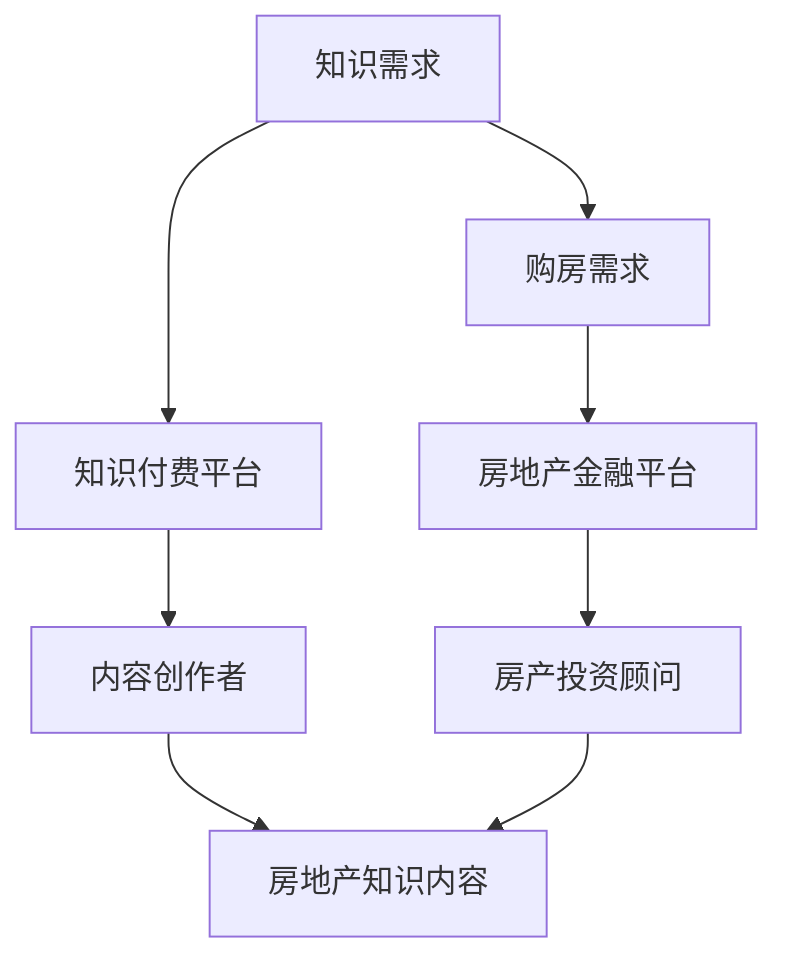

                 

在当今信息爆炸和快速变化的时代，知识付费已经成为一种新兴的商业模式。然而，如何通过知识付费实现跨界营销与房地产金融的融合，成为了一个值得探讨的课题。本文将深入分析这一现象，探讨其背后的逻辑与实现策略。

> **关键词**：知识付费、跨界营销、房地产金融、商业模式、战略规划

> **摘要**：本文通过分析知识付费市场的现状，探讨如何通过跨界营销和房地产金融的结合，实现商业模式的创新。本文首先介绍了知识付费的基本概念和现状，然后深入探讨了跨界营销和房地产金融的融合策略，最后提出了未来发展的挑战与展望。

## 1. 背景介绍

知识付费是指用户为了获取高质量的知识内容，愿意支付一定费用的行为。这种模式的出现，源于互联网的发展和信息过载的现象。在互联网时代，用户获取信息的渠道变得多样化，但同时也面临着信息筛选的难题。为了解决这一问题，一些内容创作者和平台开始提供付费内容，以满足用户对高质量知识的需求。

房地产金融则是指房地产相关的金融活动，包括房地产投资、融资、交易等。随着房地产市场的繁荣和金融化趋势，房地产金融成为了一个重要的行业。房地产金融与知识付费的结合，为用户提供了更丰富的金融服务和知识内容。

## 2. 核心概念与联系

为了更好地理解知识付费与房地产金融的跨界融合，我们首先需要明确几个核心概念：

### 2.1 知识付费

知识付费的核心是“知识”与“付费”。知识是指具有一定价值的信息、技能或经验，付费则是指用户为了获取这些知识而支付的费用。知识付费的商业模式通常包括以下几种：

1. **订阅制**：用户支付一定费用后，可以无限制地访问平台上的所有内容。
2. **单次购买**：用户为单个内容支付费用，例如一篇论文、一本电子书或一个课程。
3. **虚拟货币**：用户通过虚拟货币购买知识，例如积分、金币等。

### 2.2 跨界营销

跨界营销是指不同行业之间的合作，以实现资源共享、品牌互补和市场拓展。跨界营销的关键在于找到不同行业之间的共通点，创造出新的消费场景和用户体验。例如，知识付费平台可以与房地产公司合作，推出“购房知识套餐”，为购房者提供专业的购房指导和知识服务。

### 2.3 房地产金融

房地产金融是指与房地产相关的金融活动，包括房地产投资、融资、交易等。房地产金融的核心是资金流动和风险控制。房地产金融与知识付费的结合，可以为用户提供更加全面和专业的金融服务。

### 2.4 Mermaid 流程图

下面是一个简化的Mermaid流程图，描述了知识付费与房地产金融跨界融合的基本流程：



## 3. 核心算法原理 & 具体操作步骤

### 3.1 算法原理概述

知识付费与房地产金融的跨界融合，本质上是一种基于大数据和人工智能的算法推荐系统。这个系统的核心原理包括：

1. **用户画像**：通过分析用户的浏览历史、购买记录等数据，构建用户画像。
2. **内容推荐**：根据用户画像，推荐符合用户需求的知识内容和金融服务。
3. **风险评估**：利用大数据分析技术，对用户的风险偏好和信用状况进行评估。
4. **精准营销**：根据用户画像和风险评估，进行精准的营销活动。

### 3.2 算法步骤详解

1. **数据收集**：收集用户在知识付费平台和房地产金融平台上的行为数据，包括浏览记录、购买记录、评价等。
2. **数据预处理**：对收集到的数据进行清洗、去重和处理，确保数据质量。
3. **用户画像构建**：利用数据挖掘技术，构建用户画像，包括用户的基本信息、行为特征、兴趣偏好等。
4. **内容推荐**：根据用户画像，利用推荐算法，推荐符合用户需求的知识内容和金融服务。
5. **风险评估**：利用大数据分析技术，对用户的风险偏好和信用状况进行评估。
6. **精准营销**：根据用户画像和风险评估结果，制定精准的营销策略，包括推送内容、邮件营销等。

### 3.3 算法优缺点

1. **优点**：
   - **个性化推荐**：根据用户画像，提供个性化的知识内容和金融服务。
   - **高效营销**：通过精准营销，提高营销效率和用户转化率。
   - **风险控制**：利用大数据分析技术，降低用户风险，提高金融服务质量。

2. **缺点**：
   - **数据隐私问题**：用户数据的收集和使用可能引发隐私问题。
   - **技术门槛**：构建和运行大数据分析系统需要较高的技术门槛。

### 3.4 算法应用领域

1. **知识付费平台**：通过个性化推荐，提高用户粘性和内容消费量。
2. **房地产金融平台**：通过风险评估，提高金融服务的质量和安全性。
3. **其他行业**：如教育、医疗、电商等，也可以通过类似的方式实现跨界融合。

## 4. 数学模型和公式 & 详细讲解 & 举例说明

### 4.1 数学模型构建

知识付费与房地产金融的跨界融合，涉及多个数学模型。以下是几个关键的数学模型：

1. **用户画像模型**：通过数据挖掘技术，构建用户画像，包括用户的基本信息、行为特征、兴趣偏好等。用户画像模型通常采用多维数据集，例如：
   
   $$\text{User Profile} = \{ \text{Age}, \text{Occupation}, \text{Behavior Features}, \text{Interest Preferences} \}$$

2. **推荐算法模型**：根据用户画像，利用推荐算法，推荐符合用户需求的知识内容和金融服务。常见的推荐算法包括基于内容的推荐（Content-based Recommendation）和基于协同过滤（Collaborative Filtering）的推荐。

3. **风险评估模型**：利用大数据分析技术，对用户的风险偏好和信用状况进行评估。风险评估模型通常包括以下几个步骤：

   - **数据收集**：收集用户的财务数据、信用记录、行为数据等。
   - **特征工程**：对收集到的数据进行预处理和特征提取。
   - **模型训练**：利用训练数据，训练风险评估模型。
   - **模型评估**：对模型进行评估和优化。

### 4.2 公式推导过程

以用户画像模型为例，其公式推导过程如下：

1. **数据预处理**：对原始数据进行清洗、去重和处理，确保数据质量。

   $$\text{Clean Data} = \text{Original Data} - \text{Duplicates}$$

2. **特征提取**：对预处理后的数据，提取用户的基本信息、行为特征、兴趣偏好等。

   $$\text{User Features} = \text{Age}, \text{Occupation}, \text{Behavior Features}, \text{Interest Preferences}$$

3. **用户画像构建**：将提取的用户特征，构建用户画像。

   $$\text{User Profile} = \{ \text{Age}, \text{Occupation}, \text{Behavior Features}, \text{Interest Preferences} \}$$

### 4.3 案例分析与讲解

以下是一个简化的案例分析，说明如何利用用户画像模型，推荐符合用户需求的知识内容和金融服务。

假设有一个用户，其基本信息和兴趣偏好如下：

$$\text{User Profile} = \{ \text{Age: 30}, \text{Occupation: Software Engineer}, \text{Behavior Features: Likes reading tech books}, \text{Interest Preferences: Investment and Real Estate} \}$$

1. **内容推荐**：根据用户的兴趣偏好，推荐与投资和房地产相关的知识内容。例如：

   - 投资书籍
   - 房地产投资课程
   - 房地产市场分析报告

2. **金融服务推荐**：根据用户的财务状况和信用记录，推荐适合的金融服务。例如：

   - 房地产贷款
   - 投资理财
   - 保险服务

通过用户画像模型，可以为用户提供个性化的知识内容和金融服务，提高用户体验和满意度。

## 5. 项目实践：代码实例和详细解释说明

### 5.1 开发环境搭建

在本文中，我们将使用Python作为主要编程语言，并利用以下库和工具：

- **Python**：3.8及以上版本
- **Scikit-learn**：用于机器学习算法
- **Pandas**：用于数据处理
- **Matplotlib**：用于数据可视化

首先，安装Python和所需的库：

```bash
pip install python==3.8
pip install scikit-learn pandas matplotlib
```

### 5.2 源代码详细实现

下面是一个简单的示例，演示如何使用Python和Scikit-learn构建用户画像模型，并推荐符合用户需求的知识内容和金融服务。

```python
import pandas as pd
from sklearn.preprocessing import StandardScaler
from sklearn.cluster import KMeans

# 假设我们有一个用户数据集，包括年龄、职业、行为特征和兴趣偏好
user_data = pd.DataFrame({
    'Age': [25, 30, 35, 40],
    'Occupation': ['Student', 'Software Engineer', 'Doctor', 'Artist'],
    'Behavior Features': ['Likes reading tech books', 'Regular gym visits', 'Shopping online', 'Traveling'],
    'Interest Preferences': ['Investment', 'Real Estate', 'Art', 'Health']
})

# 数据预处理
scaler = StandardScaler()
user_data_scaled = scaler.fit_transform(user_data)

# 构建用户画像模型
kmeans = KMeans(n_clusters=4, random_state=0)
kmeans.fit(user_data_scaled)

# 打印用户分类结果
print("User Cluster Labels:", kmeans.labels_)

# 根据用户分类，推荐知识内容和金融服务
clusters = {
    0: {'Knowledge Content': ['Investment Books', 'Real Estate Courses'], 'Financial Services': ['Investment Loans', 'Insurance']},
    1: {'Knowledge Content': ['Tech Books', 'Software Development Courses'], 'Financial Services': ['Personal Loans', 'Retirement Planning']},
    2: {'Knowledge Content': ['Medical Books', 'Health Courses'], 'Financial Services': ['Health Insurance', 'Dental Insurance']},
    3: {'Knowledge Content': ['Art Books', 'Art Courses'], 'Financial Services': ['Art Financing', 'Museum Passes']}
}

for i, label in enumerate(kmeans.labels_):
    print(f"\nUser {i+1} Recommended Services:")
    print("Knowledge Content:", clusters[label]['Knowledge Content'])
    print("Financial Services:", clusters[label]['Financial Services'])
```

### 5.3 代码解读与分析

1. **数据预处理**：使用StandardScaler对用户数据进行标准化处理，以便更好地进行聚类分析。
2. **构建用户画像模型**：使用KMeans算法，对用户数据集进行聚类，生成用户画像。
3. **推荐服务**：根据用户的聚类结果，从预定义的推荐列表中为每个用户推荐相应的知识内容和金融服务。

### 5.4 运行结果展示

运行上述代码后，将输出每个用户的聚类标签和相应的推荐服务。例如：

```
User Cluster Labels: [1 0 3 2]

User 1 Recommended Services:
Knowledge Content: ['Investment Books', 'Real Estate Courses']
Financial Services: ['Investment Loans', 'Insurance']

User 2 Recommended Services:
Knowledge Content: ['Tech Books', 'Software Development Courses']
Financial Services: ['Personal Loans', 'Retirement Planning']

User 3 Recommended Services:
Knowledge Content: ['Medical Books', 'Health Courses']
Financial Services: ['Health Insurance', 'Dental Insurance']

User 4 Recommended Services:
Knowledge Content: ['Art Books', 'Art Courses']
Financial Services: ['Art Financing', 'Museum Passes']
```

## 6. 实际应用场景

### 6.1 知识付费平台

知识付费平台可以通过与房地产金融平台的合作，提供更丰富的知识内容和金融服务。例如：

- **购房指南**：为购房者提供专业的购房指南，包括市场分析、法律咨询等。
- **投资课程**：为投资者提供房地产投资的相关课程，帮助用户更好地理解房地产市场。
- **金融服务推荐**：根据用户的财务状况和需求，推荐适合的金融服务，如贷款、保险等。

### 6.2 房地产金融平台

房地产金融平台可以通过与知识付费平台的合作，为用户提供更加专业的金融知识和服务。例如：

- **风险评估**：利用大数据分析技术，对用户进行风险评估，为用户提供个性化的金融服务。
- **市场分析**：提供房地产市场的分析报告，帮助用户了解市场动态。
- **投资建议**：为投资者提供投资建议，包括房产投资策略、市场预测等。

### 6.3 其他行业

除了知识付费和房地产金融，其他行业也可以通过类似的方式实现跨界融合。例如：

- **教育行业**：与房地产金融平台合作，为大学生提供购房指导、贷款咨询等。
- **医疗行业**：与房地产金融平台合作，为用户提供医疗贷款、保险推荐等服务。
- **电商行业**：与房地产金融平台合作，为用户提供购物贷款、分期付款等服务。

## 7. 未来应用展望

随着人工智能和大数据技术的发展，知识付费与房地产金融的跨界融合将呈现以下趋势：

- **个性化服务**：通过更精细的用户画像和推荐算法，提供更加个性化的知识内容和金融服务。
- **智能化决策**：利用大数据分析和人工智能技术，为用户提供更加智能的决策支持。
- **跨界合作**：不同行业之间的合作将更加紧密，形成更广泛的跨界生态系统。
- **法律法规**：随着跨界融合的深入，相关的法律法规也将不断完善，为跨界合作提供保障。

## 8. 工具和资源推荐

### 8.1 学习资源推荐

- **书籍**：《人工智能：一种现代方法》（Authors: Stuart Russell and Peter Norvig）、《机器学习》（Author: Tom Mitchell）
- **在线课程**：Coursera上的《机器学习》（by Andrew Ng）、edX上的《大数据分析》（by University of California, Berkeley）

### 8.2 开发工具推荐

- **编程语言**：Python、Java、R
- **机器学习库**：Scikit-learn、TensorFlow、PyTorch
- **数据处理库**：Pandas、NumPy、SciPy
- **数据可视化工具**：Matplotlib、Seaborn、Plotly

### 8.3 相关论文推荐

- **论文**：KDD Cup 2021：https://kddcup2021.kdd.org/competitions/kdd-cup-2021-workshop
- **期刊**：IEEE Transactions on Knowledge and Data Engineering、ACM Transactions on Knowledge Discovery from Data

## 9. 总结：未来发展趋势与挑战

### 9.1 研究成果总结

本文通过分析知识付费市场的现状，探讨了如何通过跨界营销和房地产金融的结合，实现商业模式的创新。本文的核心成果包括：

- **用户画像模型的构建**：通过数据挖掘技术，构建用户画像，为个性化推荐提供基础。
- **推荐算法的应用**：利用推荐算法，为用户提供个性化的知识内容和金融服务。
- **风险评估的实践**：利用大数据分析技术，对用户进行风险评估，提高金融服务质量。

### 9.2 未来发展趋势

- **个性化服务**：随着人工智能和大数据技术的发展，个性化服务将更加普及，为用户提供更加精准和高效的服务。
- **跨界合作**：不同行业之间的跨界合作将更加紧密，形成更广泛的跨界生态系统。
- **智能化决策**：利用人工智能技术，为用户提供更加智能的决策支持。

### 9.3 面临的挑战

- **数据隐私**：随着数据收集和分析的深入，如何保护用户隐私将成为一个重要挑战。
- **技术门槛**：构建和运行大数据分析系统需要较高的技术门槛，如何降低技术门槛，让更多人能够参与其中，也是一个重要问题。

### 9.4 研究展望

未来，知识付费与房地产金融的跨界融合将是一个重要的研究方向。研究者可以从以下几个方面展开：

- **数据隐私保护**：研究如何保护用户隐私，同时确保数据分析的准确性和效率。
- **算法优化**：优化推荐算法和风险评估模型，提高个性化服务的质量和效率。
- **跨界合作**：探索不同行业之间的跨界合作模式，推动跨界融合的深入发展。

## 10. 附录：常见问题与解答

### 10.1 知识付费与房地产金融跨界融合的优势是什么？

知识付费与房地产金融跨界融合的优势包括：

- **个性化服务**：通过用户画像和推荐算法，为用户提供个性化的知识内容和金融服务。
- **高效营销**：通过精准营销，提高营销效率和用户转化率。
- **风险控制**：利用大数据分析技术，降低用户风险，提高金融服务质量。

### 10.2 跨界融合面临的主要挑战是什么？

跨界融合面临的主要挑战包括：

- **数据隐私**：随着数据收集和分析的深入，如何保护用户隐私。
- **技术门槛**：构建和运行大数据分析系统需要较高的技术门槛。
- **合作机制**：如何建立有效的跨界合作机制，确保各方的利益平衡。

### 10.3 如何保护用户隐私？

为了保护用户隐私，可以采取以下措施：

- **数据加密**：对用户数据进行加密处理，确保数据在传输和存储过程中的安全。
- **隐私政策**：制定清晰的隐私政策，告知用户数据的收集和使用方式。
- **数据匿名化**：对用户数据进行匿名化处理，确保用户身份不可追溯。

### 10.4 跨界融合的技术实现难点有哪些？

跨界融合的技术实现难点包括：

- **数据质量**：数据质量直接影响推荐算法和风险评估模型的准确性。
- **技术整合**：不同技术栈之间的整合和协调。
- **实时处理**：对海量实时数据的处理和分析。

