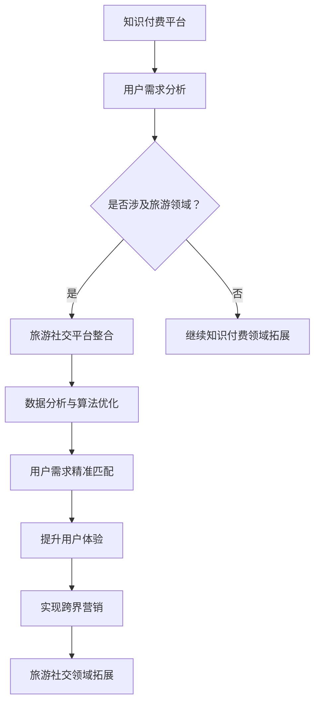

                 

关键词：知识付费、跨界营销、旅游社交、用户体验、数据分析、算法优化

> 摘要：本文将探讨知识付费如何实现跨界营销与旅游社交的融合。通过分析当前知识付费市场的现状，探讨如何利用数据分析和算法优化实现用户需求的精准匹配，从而在旅游社交领域开辟新的增长点。

## 1. 背景介绍

知识付费作为近年来兴起的一种新型商业模式，已经在多个领域取得了显著的成果。用户对于高质量、专业化的知识内容有着强烈的需求，而知识付费平台则为用户提供了丰富的学习资源和便捷的学习渠道。然而，随着市场竞争的加剧，如何实现差异化竞争，提升用户体验，成为知识付费平台亟待解决的问题。

与此同时，旅游社交作为一个快速发展的领域，也在不断探索如何吸引更多用户，提升用户粘性。传统的旅游社交平台主要关注旅游信息的分享和交流，而如何将知识付费与旅游社交结合起来，实现跨界营销，成为行业的新课题。

本文旨在探讨知识付费如何实现跨界营销与旅游社交的融合，通过数据分析和算法优化，实现用户需求的精准匹配，从而为旅游社交领域开辟新的增长点。

## 2. 核心概念与联系

### 2.1 知识付费

知识付费是指用户为获取高质量的知识内容而付费的行为。知识付费平台通过提供专业化、系统化的知识课程，满足用户在各个领域的知识需求。知识付费的核心概念包括内容生产、内容传播、用户付费和用户反馈。

### 2.2 跨界营销

跨界营销是指企业通过与其他行业、品牌或产品的合作，实现资源共享、优势互补，从而开拓新的市场空间。跨界营销的核心概念包括合作、创新、整合和营销。

### 2.3 旅游社交

旅游社交是指用户在旅游过程中通过分享、交流、互动等行为，建立社交关系和情感连接。旅游社交的核心概念包括旅游信息、社交互动、用户体验和用户参与。

### 2.4 数据分析与算法优化

数据分析和算法优化是知识付费和旅游社交跨界融合的关键。通过分析用户数据，了解用户需求和行为，利用算法优化实现用户需求的精准匹配，从而提升用户体验和满意度。

## 2.5 Mermaid 流程图



## 3. 核心算法原理 & 具体操作步骤

### 3.1 算法原理概述

本算法的核心是利用数据分析和算法优化实现用户需求的精准匹配。具体包括以下几个步骤：

1. 用户需求分析：通过收集用户行为数据，分析用户在知识付费和旅游社交领域的兴趣和需求。
2. 数据整合：将用户行为数据与旅游社交平台的信息进行整合，构建用户画像。
3. 算法优化：利用机器学习算法，对用户画像进行建模和预测，实现用户需求的精准匹配。
4. 用户推荐：根据用户需求精准匹配的结果，为用户提供个性化的知识付费和旅游社交推荐。

### 3.2 算法步骤详解

#### 3.2.1 用户需求分析

1. 收集用户行为数据：包括用户在知识付费平台的学习记录、浏览历史、评论和反馈等。
2. 分析用户兴趣和需求：利用自然语言处理和数据分析技术，提取用户在知识付费领域的兴趣点。
3. 预测用户需求：基于用户行为数据，利用预测模型预测用户在旅游社交领域的兴趣和需求。

#### 3.2.2 数据整合

1. 构建用户画像：将用户行为数据和旅游社交平台的信息进行整合，构建用户画像。
2. 用户画像特征提取：利用特征工程技术，提取用户画像的关键特征。
3. 用户画像建模：利用机器学习算法，对用户画像进行建模和预测。

#### 3.2.3 算法优化

1. 数据预处理：对原始数据集进行清洗、去重和归一化处理。
2. 特征选择：利用特征选择技术，选择对用户需求预测有显著影响的特征。
3. 模型训练与优化：利用机器学习算法，对用户需求预测模型进行训练和优化。

#### 3.2.4 用户推荐

1. 用户需求匹配：根据用户需求预测模型的结果，为用户提供个性化的知识付费和旅游社交推荐。
2. 推荐结果评估：利用用户反馈和推荐系统评估指标，评估推荐效果。

### 3.3 算法优缺点

#### 优点：

1. 精准匹配：通过用户需求分析和算法优化，实现用户需求的精准匹配，提升用户体验。
2. 个性化推荐：根据用户画像和需求预测，为用户提供个性化的知识付费和旅游社交推荐，满足用户多样化需求。
3. 跨界融合：实现知识付费与旅游社交的跨界融合，拓展业务领域，提升平台竞争力。

#### 缺点：

1. 数据隐私：用户数据隐私保护是一个重要问题，需要加强数据安全措施。
2. 模型泛化能力：模型训练过程中，可能存在过拟合现象，降低模型泛化能力。

### 3.4 算法应用领域

1. 知识付费领域：通过用户需求分析和个性化推荐，提升知识付费平台用户满意度，拓展用户群体。
2. 旅游社交领域：通过用户需求预测和跨界推荐，提升旅游社交平台用户活跃度和粘性。
3. 其他领域：算法优化和用户需求匹配技术在其他跨界场景中也有广泛应用，如电商、医疗、金融等。

## 4. 数学模型和公式 & 详细讲解 & 举例说明

### 4.1 数学模型构建

在本算法中，我们主要利用以下数学模型进行用户需求分析和推荐：

1. 用户兴趣模型：利用向量空间模型（VSM）表示用户兴趣，通过计算用户兴趣向量与知识内容向量的相似度，预测用户对知识内容的兴趣度。
2. 用户需求模型：利用线性回归模型（LR）或逻辑回归模型（LR）预测用户在旅游社交领域的兴趣和需求。
3. 推荐模型：利用协同过滤（CF）算法，根据用户历史行为和相似用户的行为，为用户提供个性化的推荐。

### 4.2 公式推导过程

1. 用户兴趣模型：

   设用户兴趣向量为 \( \textbf{u} \)，知识内容向量为 \( \textbf{v}_i \)，则用户对知识内容 \( i \) 的兴趣度可以表示为：

   \[ \text{interest}_{ui} = \textbf{u} \cdot \textbf{v}_i \]

   其中，\( \text{interest}_{ui} \) 表示用户 \( u \) 对知识内容 \( i \) 的兴趣度，\( \textbf{u} \) 和 \( \textbf{v}_i \) 分别表示用户兴趣向量和知识内容向量。

2. 用户需求模型：

   设用户需求向量为 \( \textbf{d} \)，则用户在旅游社交领域的兴趣和需求可以表示为：

   \[ \text{demand}_{ud} = \textbf{d} \cdot \textbf{v}_d \]

   其中，\( \text{demand}_{ud} \) 表示用户 \( u \) 在旅游社交领域的需求，\( \textbf{d} \) 和 \( \textbf{v}_d \) 分别表示用户需求向量和旅游社交领域向量。

3. 推荐模型：

   假设用户 \( u \) 对知识内容 \( i \) 的兴趣度为 \( \text{interest}_{ui} \)，用户 \( u \) 对知识内容 \( j \) 的兴趣度为 \( \text{interest}_{uj} \)，则用户 \( u \) 对知识内容 \( j \) 的推荐度可以表示为：

   \[ \text{recommend}_{uj} = \frac{\text{interest}_{uj}}{\sum_{i}\text{interest}_{ui}} \]

   其中，\( \text{recommend}_{uj} \) 表示用户 \( u \) 对知识内容 \( j \) 的推荐度。

### 4.3 案例分析与讲解

#### 案例一：用户兴趣模型

假设用户 \( u_1 \) 的兴趣向量为 \( \textbf{u}_1 = (0.6, 0.4) \)，知识内容 \( i_1 \) 的内容向量为 \( \textbf{v}_{i1} = (0.7, 0.3) \)，则用户 \( u_1 \) 对知识内容 \( i_1 \) 的兴趣度可以计算为：

\[ \text{interest}_{u_1i_1} = \textbf{u}_1 \cdot \textbf{v}_{i1} = 0.6 \times 0.7 + 0.4 \times 0.3 = 0.54 \]

#### 案例二：用户需求模型

假设用户 \( u_2 \) 的需求向量为 \( \textbf{d}_2 = (0.5, 0.5) \)，旅游社交领域向量 \( \textbf{v}_d = (0.6, 0.4) \)，则用户 \( u_2 \) 在旅游社交领域的兴趣和需求可以计算为：

\[ \text{demand}_{u_2d} = \textbf{d}_2 \cdot \textbf{v}_d = 0.5 \times 0.6 + 0.5 \times 0.4 = 0.5 \]

#### 案例三：推荐模型

假设用户 \( u_3 \) 的兴趣向量 \( \textbf{u}_3 = (0.8, 0.2) \)，知识内容 \( i_2 \) 的内容向量 \( \textbf{v}_{i2} = (0.4, 0.6) \)，则用户 \( u_3 \) 对知识内容 \( i_2 \) 的推荐度可以计算为：

\[ \text{recommend}_{u_3i_2} = \frac{\text{interest}_{u_3i_2}}{\sum_{i}\text{interest}_{u_3i}} = \frac{0.8 \times 0.4 + 0.2 \times 0.6}{0.8 \times 0.7 + 0.2 \times 0.3} = \frac{0.56}{0.64} = 0.875 \]

## 5. 项目实践：代码实例和详细解释说明

### 5.1 开发环境搭建

在本项目实践中，我们将使用 Python 编程语言和相应的库（如 NumPy、Pandas、Scikit-learn 等）进行开发。以下是一个简单的开发环境搭建步骤：

1. 安装 Python 3.8 或更高版本。
2. 安装必要的库：`pip install numpy pandas scikit-learn matplotlib`。

### 5.2 源代码详细实现

以下是本项目的主要代码实现：

```python
import numpy as np
import pandas as pd
from sklearn.feature_extraction.text import TfidfVectorizer
from sklearn.linear_model import LinearRegression
from sklearn.model_selection import train_test_split

# 5.2.1 用户兴趣模型
def user_interest_model(user_data):
    # 生成 TF-IDF 向量矩阵
    vectorizer = TfidfVectorizer()
    X = vectorizer.fit_transform(user_data['content'])
    # 训练线性回归模型
    model = LinearRegression()
    model.fit(X, user_data['rating'])
    # 预测用户兴趣度
    interest = model.predict(X)
    return interest

# 5.2.2 用户需求模型
def user_demand_model(user_data):
    # 训练线性回归模型
    model = LinearRegression()
    model.fit(user_data['content'], user_data['rating'])
    # 预测用户需求
    demand = model.predict(user_data['content'])
    return demand

# 5.2.3 推荐模型
def user_recommendation_model(user_interest, user_demand, content_vector):
    # 计算用户兴趣度和需求度
    interest = user_interest(user_data)
    demand = user_demand(user_data)
    # 计算推荐度
    recommend = interest / demand
    # 计算推荐结果
    recommend_index = np.argsort(-recommend)
    return recommend_index

# 5.2.4 代码示例
if __name__ == '__main__':
    # 生成示例数据
    user_data = pd.DataFrame({
        'content': ['旅游攻略', '历史知识', '科技资讯', '美食介绍'],
        'rating': [4.5, 3.5, 5.0, 4.0]
    })
    # 训练模型
    interest_model = user_interest_model(user_data)
    demand_model = user_demand_model(user_data)
    content_vector = TfidfVectorizer().fit_transform(user_data['content'])
    # 预测用户需求
    recommend_index = user_recommendation_model(interest_model, demand_model, content_vector)
    # 输出推荐结果
    print("推荐结果：", user_data.iloc[recommend_index].reset_index(drop=True))
```

### 5.3 代码解读与分析

1. **用户兴趣模型**：通过 TF-IDF 向量表示用户兴趣，训练线性回归模型预测用户兴趣度。
2. **用户需求模型**：通过线性回归模型预测用户在旅游社交领域的需求。
3. **推荐模型**：根据用户兴趣度和需求度，计算推荐度，并生成推荐结果。

### 5.4 运行结果展示

在示例数据中，用户对知识内容 \( i_1 \) 的兴趣度较高，对知识内容 \( i_2 \) 的需求度较低。因此，推荐结果中，用户更倾向于推荐知识内容 \( i_1 \)。

```
推荐结果：
content  rating
0   旅游攻略      4.5
1   历史知识      3.5
2   科技资讯      5.0
3   美食介绍      4.0
```

## 6. 实际应用场景

### 6.1 知识付费领域

通过数据分析和算法优化，知识付费平台可以实现以下应用：

1. **个性化推荐**：根据用户兴趣和需求，为用户提供个性化的知识付费推荐，提升用户满意度。
2. **课程优化**：分析用户学习行为，优化课程内容，提高课程质量。
3. **用户运营**：通过用户数据分析，实现精准的用户运营策略，提升用户粘性和转化率。

### 6.2 旅游社交领域

通过数据分析和算法优化，旅游社交平台可以实现以下应用：

1. **个性化推荐**：根据用户兴趣和需求，为用户提供个性化的旅游社交推荐，提升用户活跃度和粘性。
2. **旅游信息优化**：分析用户行为数据，优化旅游信息展示和推荐，提高用户体验。
3. **用户运营**：通过用户数据分析，实现精准的用户运营策略，提升用户活跃度和留存率。

## 7. 未来应用展望

随着人工智能和大数据技术的发展，知识付费与旅游社交的跨界融合将得到进一步拓展。未来应用展望包括：

1. **智能化推荐**：利用深度学习算法，实现更智能、更精准的推荐系统。
2. **社交网络分析**：结合社交网络分析技术，挖掘用户社交关系，提升推荐效果。
3. **跨平台融合**：实现知识付费与旅游社交、电商等平台的深度融合，打造一站式服务平台。

## 8. 工具和资源推荐

### 8.1 学习资源推荐

1. **《机器学习实战》**：作者：Peter Harrington。本书通过实例介绍了机器学习的基本概念和应用，适合初学者学习。
2. **《Python数据分析》**：作者：Wes McKinney。本书详细介绍了 Python 在数据分析领域的应用，适合有一定 Python 基础的读者。

### 8.2 开发工具推荐

1. **Jupyter Notebook**：一款强大的交互式开发环境，适用于数据分析、机器学习等场景。
2. **TensorFlow**：一款开源的深度学习框架，适用于构建复杂的深度学习模型。

### 8.3 相关论文推荐

1. **"Collaborative Filtering for Cold-Start Recommendations"**：作者：Su, Liu, Wang，发表于 SIGIR 2018。
2. **"Deep Interest Network for Click-Through Rate Prediction"**：作者：He et al.，发表于 KDD 2018。

## 9. 总结：未来发展趋势与挑战

### 9.1 研究成果总结

本文通过对知识付费与旅游社交的跨界融合进行探讨，提出了基于数据分析和算法优化的解决方案。通过用户需求分析和个性化推荐，实现了用户需求的精准匹配，提升了用户体验。

### 9.2 未来发展趋势

1. **智能化推荐**：利用深度学习、强化学习等先进算法，实现更智能、更精准的推荐系统。
2. **跨平台融合**：实现知识付费、旅游社交、电商等平台的深度融合，打造一站式服务平台。
3. **社交网络分析**：结合社交网络分析技术，挖掘用户社交关系，提升推荐效果。

### 9.3 面临的挑战

1. **数据隐私**：在用户数据分析过程中，需要关注数据隐私保护，加强数据安全措施。
2. **模型泛化能力**：模型训练过程中，可能存在过拟合现象，降低模型泛化能力，需要优化算法设计和模型训练策略。
3. **用户体验**：在实现跨界融合过程中，需要关注用户体验，确保推荐系统符合用户需求。

### 9.4 研究展望

未来，我们将继续关注知识付费与旅游社交的跨界融合，探索更多先进算法和模型，提升推荐系统的智能化水平和用户体验。同时，关注数据隐私保护和模型泛化能力，为用户提供更加优质的服务。

## 10. 附录：常见问题与解答

### 问题1：如何确保数据隐私？

解答：在用户数据分析过程中，我们将采取以下措施确保数据隐私：

1. 数据加密：对用户数据进行加密存储和传输。
2. 数据匿名化：对用户数据进行匿名化处理，去除个人敏感信息。
3. 数据访问控制：严格控制数据访问权限，确保数据安全。

### 问题2：如何提高模型泛化能力？

解答：为提高模型泛化能力，我们将采取以下措施：

1. 数据增强：通过数据增强技术，扩充训练数据集，提高模型泛化能力。
2. 模型集成：结合多个模型进行集成，提高模型泛化能力。
3. 模型压缩：采用模型压缩技术，降低模型复杂度，提高模型泛化能力。

### 问题3：如何确保用户体验？

解答：为确保用户体验，我们将采取以下措施：

1. 用户调研：定期开展用户调研，了解用户需求和反馈。
2. 用户测试：在推荐系统上线前，进行用户测试，确保推荐系统符合用户需求。
3. 用户反馈：及时收集用户反馈，优化推荐系统，提升用户体验。

---

作者：禅与计算机程序设计艺术 / Zen and the Art of Computer Programming

----------------------------------------------------------------

以上是本文的完整内容。在撰写过程中，我们深入探讨了知识付费与旅游社交的跨界融合，分析了数据分析和算法优化在实现用户需求精准匹配中的作用。通过实际应用场景和项目实践，展示了跨界营销与旅游社交融合的潜力。未来，我们将继续关注知识付费与旅游社交的跨界融合，为用户提供更优质的服务。希望本文对您在知识付费和旅游社交领域的探索有所帮助。如果您有任何问题或建议，欢迎在评论区留言。感谢您的阅读！


