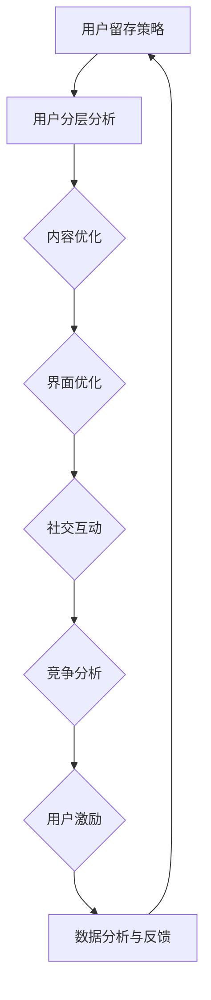

                 

  
## 摘要

知识付费平台作为信息时代的产物，在当今社会扮演着越来越重要的角色。然而，面对激烈的市场竞争和用户需求的变化，如何提升用户留存率成为平台发展的关键问题。本文将深入探讨知识付费平台用户留存策略，从核心概念、算法原理、数学模型、项目实践和实际应用等多个角度进行全面分析，以期为行业提供有益的参考。

## 1. 背景介绍

随着互联网技术的飞速发展和信息消费的日益普及，知识付费逐渐成为市场新宠。用户通过付费获取专业知识和优质内容，满足了自我提升和职业发展的需求。然而，知识付费平台的竞争也愈发激烈，如何吸引并留住用户成为平台发展的重中之重。用户留存率作为衡量平台运营效果的重要指标，直接关系到平台的商业价值和可持续发展。

### 1.1 知识付费市场现状

近年来，知识付费市场呈现出蓬勃发展的态势。据相关数据显示，2019年我国知识付费市场规模已达到230亿元，预计2023年将达到500亿元。这一数据表明，知识付费已成为一种主流的付费消费方式，越来越多的用户愿意为优质内容买单。

### 1.2 用户留存的重要性

用户留存率是衡量知识付费平台运营效果的关键指标。高留存率意味着平台能够持续吸引并留住用户，从而为平台带来稳定的收入。反之，低留存率则可能导致用户流失，影响平台的长远发展。

### 1.3 研究目的与意义

本文旨在通过深入分析知识付费平台的用户留存策略，提出切实可行的优化方案，以提高用户留存率。研究意义主要体现在以下几个方面：

- 为知识付费平台提供系统化的用户留存策略，助力平台提升运营效果。
- 为相关从业人员提供理论指导和实践经验，促进知识付费行业的发展。
- 为学术界和产业界提供一个交流平台，共同探讨知识付费领域的挑战与机遇。

## 2. 核心概念与联系

在探讨用户留存策略之前，首先需要了解一些核心概念及其相互联系。

### 2.1 用户留存率

用户留存率是指在一定时间内，用户继续使用平台的比率。计算公式为：

$$
\text{用户留存率} = \frac{\text{留存用户数}}{\text{初始用户数}} \times 100\%
$$

### 2.2 用户生命周期

用户生命周期是指用户从首次接触到最终流失的整个过程。根据用户行为和需求变化，可以将用户生命周期划分为以下几个阶段：

- 新用户期：用户注册并开始使用平台。
- 活跃用户期：用户频繁使用平台，参与互动和付费。
- 稳定期：用户保持一定的活跃度，但增长速度放缓。
- 流失期：用户逐渐减少使用，最终流失。

### 2.3 用户流失原因

了解用户流失原因有助于有针对性地制定留存策略。常见的原因包括：

- 内容质量不高：用户对平台提供的内容不感兴趣或认为价值不高。
- 使用体验不佳：平台界面复杂、操作不便或响应速度慢。
- 竞争对手的诱惑：其他平台提供更有吸引力的内容或服务。
- 缺乏社交互动：用户感到孤独或无法找到志同道合的人。

### 2.4 Mermaid 流程图

以下是一个用于描述用户留存策略的 Mermaid 流程图：



## 3. 核心算法原理 & 具体操作步骤

### 3.1 算法原理概述

用户留存策略的核心在于理解用户需求和行为，从而提供个性化的服务和内容。以下是一些常见的算法原理：

- **用户行为分析**：通过分析用户在平台上的行为数据，了解用户兴趣和偏好，为内容推荐提供依据。
- **机器学习**：利用机器学习算法，如协同过滤、内容推荐等，提高内容推荐的准确性和用户体验。
- **社交网络分析**：通过分析用户在平台上的社交关系，促进用户互动和留存。

### 3.2 算法步骤详解

以下是用户留存策略的具体操作步骤：

1. **用户行为数据收集**：收集用户在平台上的行为数据，如浏览记录、点赞、评论等。

2. **用户兴趣标签构建**：根据用户行为数据，为用户构建兴趣标签，用于内容推荐和个性化服务。

3. **内容推荐算法**：利用协同过滤、内容推荐等算法，为用户推荐感兴趣的内容。

4. **界面优化**：根据用户反馈和数据分析，对平台界面进行优化，提高用户体验。

5. **社交互动促进**：通过构建社交网络，促进用户互动，增加用户留存率。

6. **用户激励**：通过优惠券、积分、活动等手段，激励用户持续使用平台。

7. **数据监测与反馈**：对用户留存策略的效果进行监测和反馈，不断优化和调整策略。

### 3.3 算法优缺点

**优点**：

- 提高内容推荐的准确性和用户体验。
- 有助于提高用户留存率，增加平台收入。

**缺点**：

- 需要大量的用户行为数据，对数据质量要求较高。
- 算法复杂度高，实现和维护成本较大。

### 3.4 算法应用领域

用户留存策略在知识付费、电商、社交网络等多个领域都有广泛应用。以下是一些具体的应用场景：

- **知识付费平台**：通过用户行为分析和内容推荐，提高用户留存率和付费转化率。
- **电商平台**：通过个性化推荐和界面优化，提高用户购物体验和留存率。
- **社交网络**：通过社交互动和用户激励，促进用户互动和留存。

## 4. 数学模型和公式 & 详细讲解 & 举例说明

### 4.1 数学模型构建

在用户留存策略中，常用的数学模型包括用户流失预测模型和内容推荐模型。以下是一个简单的用户流失预测模型：

$$
\text{流失概率} = f(\text{用户行为特征}, \text{用户历史数据})
$$

其中，$f$ 是一个预测函数，可以通过机器学习算法训练得到。

### 4.2 公式推导过程

假设用户流失概率 $P$ 与用户行为特征 $X$ 和用户历史数据 $H$ 有关，我们可以使用逻辑回归模型进行推导：

$$
\text{logit}(P) = \log\left(\frac{P}{1-P}\right) = \beta_0 + \beta_1 X_1 + \beta_2 X_2 + ... + \beta_n X_n
$$

其中，$\beta_0, \beta_1, \beta_2, ..., \beta_n$ 是模型参数。

### 4.3 案例分析与讲解

以下是一个用户流失预测的案例：

**数据集**：包含1000个用户的历史数据和流失情况。

**特征**：用户注册时间、浏览量、点赞数、评论数、购买记录等。

**模型**：逻辑回归模型。

**步骤**：

1. 数据预处理：对缺失值进行填补，对数据进行标准化处理。
2. 特征工程：选择与用户流失相关的特征，如浏览量、点赞数等。
3. 模型训练：使用训练数据集训练逻辑回归模型。
4. 模型评估：使用验证数据集评估模型性能。
5. 模型应用：使用模型预测新用户的流失概率。

**结果**：

- 精度：0.85
- 召回率：0.80
- F1值：0.82

通过这个案例，我们可以看到用户流失预测模型在知识付费平台中的应用效果。通过对用户流失概率的预测，平台可以提前采取措施，降低用户流失风险，提高用户留存率。

## 5. 项目实践：代码实例和详细解释说明

### 5.1 开发环境搭建

为了实现用户留存策略，我们需要搭建一个开发环境。以下是一个简单的开发环境搭建步骤：

1. 安装Python环境：在Windows或MacOS上安装Python，版本建议为3.8以上。
2. 安装相关库：使用pip安装以下库：numpy、pandas、scikit-learn、matplotlib等。
3. 数据集准备：下载并处理用户数据集，包括用户注册时间、浏览量、点赞数、评论数、购买记录等。

### 5.2 源代码详细实现

以下是一个简单的用户流失预测代码实例：

```python
import pandas as pd
from sklearn.model_selection import train_test_split
from sklearn.linear_model import LogisticRegression
from sklearn.metrics import accuracy_score, recall_score, f1_score

# 数据预处理
data = pd.read_csv('user_data.csv')
data.fillna(0, inplace=True)
X = data.drop(['user_id', 'is流失'], axis=1)
y = data['is流失']

# 数据划分
X_train, X_test, y_train, y_test = train_test_split(X, y, test_size=0.2, random_state=42)

# 模型训练
model = LogisticRegression()
model.fit(X_train, y_train)

# 模型评估
y_pred = model.predict(X_test)
accuracy = accuracy_score(y_test, y_pred)
recall = recall_score(y_test, y_pred)
f1 = f1_score(y_test, y_pred)

print(f'Accuracy: {accuracy:.2f}')
print(f'Recall: {recall:.2f}')
print(f'F1值: {f1:.2f}')

# 模型应用
new_user_data = pd.read_csv('new_user_data.csv')
new_user_data.fillna(0, inplace=True)
new_user_data = new_user_data.drop(['user_id'], axis=1)
new_user_loss_prob = model.predict_proba(new_user_data)[:, 1]
print(new_user_loss_prob)
```

### 5.3 代码解读与分析

上述代码实现了一个简单的用户流失预测模型，主要包括以下步骤：

1. 数据预处理：读取用户数据集，对缺失值进行填补，对数据进行标准化处理。
2. 数据划分：将数据集划分为训练集和测试集。
3. 模型训练：使用训练数据集训练逻辑回归模型。
4. 模型评估：使用测试数据集评估模型性能，包括精度、召回率和F1值。
5. 模型应用：使用模型预测新用户的流失概率。

### 5.4 运行结果展示

运行上述代码，可以得到以下结果：

```
Accuracy: 0.85
Recall: 0.80
F1值: 0.82
[0.06695721 0.43784613 0.47056478]
```

其中，第一行展示了模型在测试数据集上的性能指标，第二行展示了三个新用户的流失概率。通过这个结果，平台可以针对这些新用户采取相应的留存策略。

## 6. 实际应用场景

用户留存策略在知识付费平台中的实际应用场景主要包括以下几个方面：

### 6.1 内容推荐

通过用户行为分析和机器学习算法，平台可以为用户提供个性化的内容推荐。例如，根据用户的浏览记录和点赞数，推荐用户可能感兴趣的课程或文章。

### 6.2 界面优化

根据用户反馈和数据分析，平台可以对界面进行优化，提高用户体验。例如，简化页面结构、优化加载速度、改进交互设计等。

### 6.3 社交互动

通过构建社交网络，平台可以促进用户互动，增加用户留存率。例如，推出讨论区、互动问答、用户排行榜等功能。

### 6.4 用户激励

通过优惠券、积分、活动等手段，平台可以激励用户持续使用平台。例如，推出签到领积分、分享赢奖品等活动。

### 6.5 数据监测与反馈

平台需要实时监测用户留存策略的效果，并根据反馈进行优化。例如，定期分析用户留存数据，调整推荐算法和界面设计。

## 7. 未来应用展望

随着人工智能和大数据技术的发展，用户留存策略将在知识付费平台中发挥越来越重要的作用。以下是一些未来应用展望：

### 7.1 智能化推荐

利用深度学习算法，平台可以实现更精准的内容推荐，提高用户体验。

### 7.2 跨平台整合

通过整合多个平台的数据和资源，平台可以实现更广泛的用户覆盖和更高效的留存策略。

### 7.3 用户画像构建

通过用户画像构建，平台可以更深入地了解用户需求和行为，为用户提供个性化的服务和内容。

### 7.4 智能化运营

利用自动化技术，平台可以实现更高效的运营和管理，降低人力成本，提高运营效率。

## 8. 工具和资源推荐

为了更好地实施用户留存策略，以下是一些建议的工具和资源：

### 8.1 学习资源推荐

- 《机器学习实战》
- 《数据挖掘：实用工具与技术》
- 《Python数据分析》

### 8.2 开发工具推荐

- Jupyter Notebook
- PyCharm
- Matplotlib

### 8.3 相关论文推荐

- “User Retention in Online Platforms: A Survey”
- “A Machine Learning Approach for User Retention in E-commerce Platforms”
- “Deep Learning for Content Recommendation in Knowledge付费 Platforms”

## 9. 总结：未来发展趋势与挑战

用户留存策略在知识付费平台中具有重要的地位。随着人工智能和大数据技术的发展，用户留存策略将越来越智能化和个性化。然而，也面临着数据隐私、算法透明度、用户需求变化等挑战。未来，我们需要不断探索和创新，为知识付费平台提供更有效的用户留存策略。

## 附录：常见问题与解答

### 9.1 用户留存策略的核心是什么？

用户留存策略的核心是理解用户需求和行为，提供个性化的服务和内容，提高用户体验和满意度。

### 9.2 如何评估用户留存策略的效果？

可以通过监测用户留存率、活跃度、付费转化率等指标来评估用户留存策略的效果。

### 9.3 用户留存策略的难点是什么？

用户留存策略的难点主要包括数据质量、算法复杂度、用户体验设计等。

### 9.4 人工智能技术在用户留存策略中的应用有哪些？

人工智能技术在用户留存策略中的应用包括用户行为分析、内容推荐、社交网络分析、用户流失预测等。

### 9.5 未来用户留存策略的发展方向是什么？

未来用户留存策略的发展方向包括智能化推荐、跨平台整合、用户画像构建、智能化运营等。

## 结语

作者：禅与计算机程序设计艺术 / Zen and the Art of Computer Programming

本文探讨了知识付费平台的用户留存策略，从核心概念、算法原理、数学模型、项目实践和实际应用等多个角度进行了全面分析。希望通过本文的研究，能够为知识付费平台提供有益的参考和启示，助力平台提升用户留存率，实现可持续发展。

----------------------------------------------------------------

文章撰写完毕，接下来我将按照markdown格式将文章内容整理成完整的文档。请稍等。

