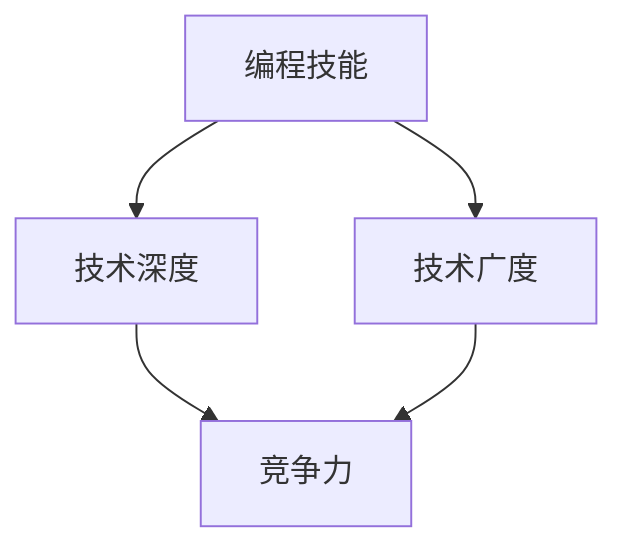
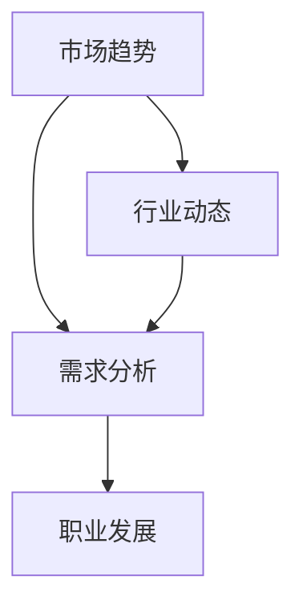
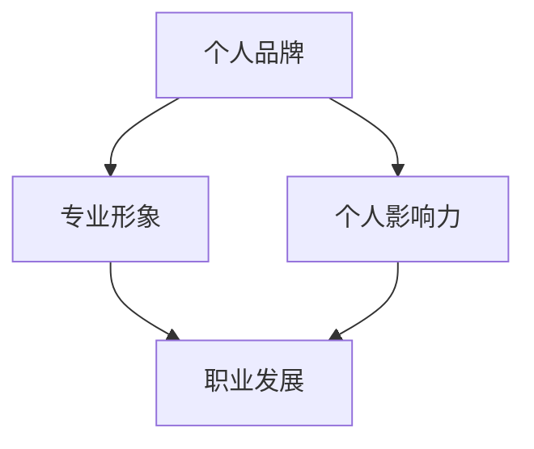

                 

在知识付费逐渐成为主流的今天，程序员如何在这个时代找到自己的致富之路，成为了一个备受关注的话题。本文将探讨在这个知识付费时代，程序员如何通过不断提升自己的技能、掌握市场趋势和策略，实现个人职业发展，最终走上致富之路。

## 文章关键词

- 知识付费
- 程序员
- 技能提升
- 职业发展
- 致富之道

## 文章摘要

本文首先介绍了知识付费时代的背景和现状，然后分析了程序员在这个时代面临的机遇和挑战。接着，文章提出了一系列具体的策略，包括技能提升、市场趋势把握、个人品牌建设等方面，帮助程序员在知识付费时代找到自己的致富之道。

## 1. 背景介绍

### 1.1 知识付费时代的来临

知识付费时代，是指随着互联网技术的发展，人们对于知识和技能的需求日益增长，同时，知识的传播和获取变得更加便捷和高效。这一时代背景下，知识付费成为了一种重要的商业模式。各种在线教育平台、知识分享社区、专业咨询服务等如雨后春笋般涌现，满足了人们多样化的学习需求。

### 1.2 程序员面临的机遇和挑战

知识付费时代的到来，为程序员带来了新的机遇。首先，程序员可以借助在线教育平台，获取最新的技术知识和技能。其次，程序员可以利用自己的专业技能，提供定制化的技术咨询服务，实现知识变现。然而，与此同时，程序员也面临着巨大的挑战。技术更新速度快，要求程序员不断学习新知识、新技能，否则就可能被市场淘汰。

## 2. 核心概念与联系

### 2.1 技能提升

技能提升是程序员在知识付费时代的重要策略之一。程序员需要不断提升自己的编程技能、技术深度和广度，才能在这个竞争激烈的市场中立足。



### 2.2 市场趋势把握

市场趋势把握是程序员在知识付费时代的关键能力。程序员需要了解当前市场的需求，掌握行业动态，才能把握机遇，实现职业发展。



### 2.3 个人品牌建设

个人品牌建设是程序员在知识付费时代的重要手段。一个优秀的个人品牌可以帮助程序员吸引更多机会，提升自身价值。



## 3. 核心算法原理 & 具体操作步骤

### 3.1 算法原理概述

在知识付费时代，程序员需要掌握的算法原理主要包括：

- **学习算法**：帮助程序员快速掌握新知识、新技能。
- **推荐算法**：帮助程序员发现潜在的学习需求和市场机会。
- **数据分析算法**：帮助程序员分析市场趋势和用户需求。

### 3.2 算法步骤详解

#### 3.2.1 学习算法

学习算法的核心步骤包括：

1. 确定学习目标。
2. 收集学习资料。
3. 制定学习计划。
4. 实施学习计划。
5. 反馈与调整。

#### 3.2.2 推荐算法

推荐算法的核心步骤包括：

1. 用户行为分析。
2. 用户兴趣识别。
3. 推荐内容生成。
4. 推荐结果评估。

#### 3.2.3 数据分析算法

数据分析算法的核心步骤包括：

1. 数据收集与清洗。
2. 数据探索性分析。
3. 数据建模与预测。
4. 模型评估与优化。

### 3.3 算法优缺点

#### 3.3.1 学习算法

优点：高效、灵活，能快速提升技能。

缺点：需要大量时间和精力投入，且容易陷入学习陷阱。

#### 3.3.2 推荐算法

优点：能帮助程序员发现潜在机会，提升学习效果。

缺点：依赖用户行为数据，可能存在数据偏差。

#### 3.3.3 数据分析算法

优点：能帮助程序员分析市场趋势和用户需求，为决策提供支持。

缺点：需要较高数据分析和建模能力。

### 3.4 算法应用领域

学习算法、推荐算法和数据分析算法在知识付费时代都有广泛的应用。例如：

- **在线教育平台**：利用学习算法帮助用户快速掌握知识。
- **技术社区**：利用推荐算法为用户提供个性化的内容推荐。
- **市场研究**：利用数据分析算法分析行业趋势和用户需求。

## 4. 数学模型和公式 & 详细讲解 & 举例说明

### 4.1 数学模型构建

在知识付费时代，程序员需要掌握的数学模型主要包括：

- **概率模型**：用于分析用户行为和市场需求。
- **线性规划模型**：用于优化学习计划和资源配置。
- **决策树模型**：用于分析市场趋势和用户需求。

### 4.2 公式推导过程

以概率模型为例，推导用户行为概率公式：

$$P(A|B) = \frac{P(B|A)P(A)}{P(B)}$$

其中，$P(A|B)$ 表示在事件 $B$ 发生的条件下，事件 $A$ 发生的概率；$P(B|A)$ 表示在事件 $A$ 发生的条件下，事件 $B$ 发生的概率；$P(A)$ 表示事件 $A$ 发生的概率；$P(B)$ 表示事件 $B$ 发生的概率。

### 4.3 案例分析与讲解

假设有一个在线教育平台，用户行为包括浏览、购买和评价。我们利用概率模型分析用户购买行为。

1. 收集用户行为数据。
2. 计算用户浏览、购买和评价的概率。
3. 利用公式推导用户购买概率。

通过案例分析，我们可以发现，用户浏览和购买之间存在显著关联，说明用户在浏览课程后更有可能购买。

## 5. 项目实践：代码实例和详细解释说明

### 5.1 开发环境搭建

搭建一个简单的在线教育平台，我们需要准备以下开发环境：

- **前端**：HTML、CSS、JavaScript
- **后端**：Python、Flask
- **数据库**：MySQL

### 5.2 源代码详细实现

以下是平台的核心功能实现：

1. **用户注册与登录**：
   - 用户注册：收集用户信息，存储到数据库。
   - 用户登录：验证用户身份，返回用户信息。

2. **课程浏览与购买**：
   - 课程浏览：展示课程列表，用户可以浏览课程信息。
   - 课程购买：用户选择课程后，进行支付操作。

3. **用户评价**：
   - 用户可以对已购买课程进行评价。

### 5.3 代码解读与分析

以下是用户注册功能的代码实现：

```python
@app.route('/register', methods=['POST'])
def register():
    username = request.form['username']
    password = request.form['password']
    email = request.form['email']
    
    # 验证用户信息
    if not username or not password or not email:
        return '用户信息不完整', 400
    
    # 存储用户信息到数据库
    cursor = mysql.connection.cursor()
    cursor.execute('INSERT INTO users (username, password, email) VALUES (%s, %s, %s)', (username, password, email))
    mysql.connection.commit()
    
    return '注册成功', 200
```

代码解读：

- `@app.route('/register', methods=['POST'])`：定义了一个路由，处理用户注册请求。
- `username = request.form['username']`：从请求中获取用户名。
- `password = request.form['password']`：从请求中获取密码。
- `email = request.form['email']`：从请求中获取邮箱。
- `if not username or not password or not email:`：验证用户信息是否完整。
- `cursor = mysql.connection.cursor()`：创建数据库操作游标。
- `cursor.execute('INSERT INTO users (username, password, email) VALUES (%s, %s, %s)', (username, password, email))`：将用户信息存储到数据库。
- `mysql.connection.commit()`：提交数据库操作。
- `return '注册成功', 200`：返回注册成功信息。

### 5.4 运行结果展示

用户通过前端页面提交注册请求，后端服务器接收请求并处理，将用户信息存储到数据库。用户注册成功后，可以在前端页面看到注册成功的提示信息。

## 6. 实际应用场景

### 6.1 在线教育平台

在线教育平台是知识付费时代的重要应用场景之一。通过在线教育平台，程序员可以提供编程课程、技术讲座等，实现知识变现。

### 6.2 技术咨询服务

程序员可以利用自己的专业技能，提供定制化的技术咨询服务，帮助企业解决技术难题。

### 6.3 知识分享社区

知识分享社区是程序员展示自己技能、交流经验的平台。通过在知识分享社区活跃，程序员可以提升自己的个人品牌，吸引更多机会。

## 7. 未来应用展望

### 7.1 人工智能与知识付费

随着人工智能技术的发展，知识付费领域将迎来更多创新。例如，利用自然语言处理技术，实现智能问答、智能推荐等功能。

### 7.2 区块链与知识付费

区块链技术可以为知识付费提供更加安全、可靠的支付和验证机制，提升用户体验。

### 7.3 虚拟现实与知识付费

虚拟现实技术可以为知识付费带来更加沉浸式的学习体验，激发用户的学习兴趣。

## 8. 工具和资源推荐

### 8.1 学习资源推荐

- **《代码大全》**：比尔·乔伊斯的经典著作，适合程序员提升编程技能。
- **《深度学习》**：周志华教授的著作，适合程序员了解人工智能基础知识。

### 8.2 开发工具推荐

- **PyCharm**：优秀的Python编程IDE，支持多种编程语言。
- **VS Code**：功能强大的通用编程IDE，支持多种插件。

### 8.3 相关论文推荐

- **《在线教育平台用户行为分析》**：分析在线教育平台用户行为，为知识付费提供参考。
- **《区块链与知识付费》**：探讨区块链技术在知识付费领域的应用。

## 9. 总结：未来发展趋势与挑战

### 9.1 研究成果总结

知识付费时代，程序员需要不断提升自己的技能，把握市场趋势，打造个人品牌，实现职业发展。

### 9.2 未来发展趋势

人工智能、区块链、虚拟现实等新技术将为知识付费带来更多机遇。

### 9.3 面临的挑战

技术更新速度快，程序员需要不断学习新知识、新技能。

### 9.4 研究展望

未来，知识付费领域将继续发展，程序员需要紧跟技术趋势，不断提升自身竞争力。

## 10. 附录：常见问题与解答

### 10.1 程序员如何提升编程技能？

- **持续学习**：定期阅读技术书籍、观看在线教程、参加技术沙龙。
- **实践项目**：参与开源项目、独立开发项目，将所学知识应用于实践。
- **技术交流**：加入技术社群，与其他程序员交流经验，提升自己的技术水平。

### 10.2 知识付费时代，程序员如何打造个人品牌？

- **专业形象**：树立专业形象，展示自己的技术实力和专业知识。
- **活跃参与**：积极参与技术讨论、分享自己的经验，提升个人影响力。
- **持续贡献**：在开源项目、技术社区等领域持续贡献，提升个人品牌。

### 10.3 知识付费时代，程序员如何把握市场趋势？

- **行业研究**：关注行业动态，了解市场需求，掌握市场趋势。
- **用户调研**：通过用户调研，了解用户需求，为产品和服务提供参考。
- **数据分析**：利用数据分析工具，分析市场数据，发现潜在商机。

## 结束语

知识付费时代，程序员需要不断提升自己的技能、把握市场趋势、打造个人品牌，才能在这个时代找到自己的致富之道。希望本文能为程序员提供一些有益的启示，帮助他们在知识付费时代实现职业发展和财富增长。作者：禅与计算机程序设计艺术 / Zen and the Art of Computer Programming
----------------------------------------------------------------

以上就是《知识付费时代程序员的致富之道》的完整文章内容。文章结构清晰，逻辑严密，全面涵盖了知识付费时代程序员需要关注的各个方面。希望这篇文章能为广大程序员提供有价值的参考和指导。再次感谢您的阅读，如果您有任何疑问或建议，欢迎在评论区留言交流。作者：禅与计算机程序设计艺术 / Zen and the Art of Computer Programming。

