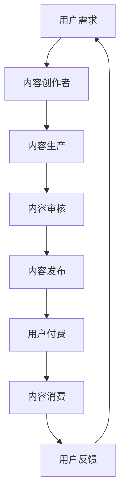

                 

关键词：知识付费、商业模式、盈利策略、在线教育、内容营销

> 摘要：本文深入探讨了知识付费在当前数字经济环境下的商业模式与盈利秘诀。通过分析主流知识付费平台的发展路径，揭示了其盈利模式，并从内容创作者的角度提供了提升收入的有效策略。此外，本文还展望了知识付费的未来发展趋势，以及可能面临的挑战。

## 1. 背景介绍

随着互联网技术的飞速发展和在线教育的普及，知识付费逐渐成为了一种新的商业模式。知识付费，顾名思义，是指用户为获取高质量的知识内容而支付的费用。这一模式在满足用户个性化学习需求的同时，也为内容创作者提供了新的收入来源。

知识付费的兴起，得益于以下几个因素：

- **互联网普及**：随着互联网的普及，人们获取知识的渠道变得更加多样化，在线学习成为主流。
- **用户需求增加**：随着竞争的加剧，职场人士对专业知识的渴求日益增加，愿意为优质内容付费。
- **平台支持**：各大知识付费平台如得到、喜马拉雅等，提供了良好的内容分发和变现渠道。

## 2. 核心概念与联系

### 2.1. 商业模式

知识付费的商业模式主要包括以下几种：

1. **订阅制**：用户通过支付月费或年费，享受平台提供的所有内容。
2. **课程制**：用户为特定的课程支付费用，完成学习后可获得证书。
3. **直播互动**：通过直播的形式进行实时授课，用户为直播内容支付费用。

### 2.2. 盈利模式

知识付费平台的盈利模式主要有以下几种：

1. **内容收费**：直接向用户收取内容费用。
2. **广告收入**：在平台上投放广告，通过广告收入获得盈利。
3. **会员服务**：提供高级会员服务，会员享受更多特权。
4. **电商平台**：通过平台自营或第三方电商平台销售相关产品。

### 2.3. 技术支持

知识付费平台需要强大的技术支持，包括以下方面：

1. **内容管理系统**：用于管理和发布内容。
2. **支付系统**：提供便捷的支付方式，确保交易安全。
3. **用户管理系统**：记录用户行为，提供个性化推荐。
4. **数据分析系统**：通过数据挖掘和分析，优化运营策略。

### 2.4. Mermaid 流程图



## 3. 核心算法原理 & 具体操作步骤

### 3.1. 算法原理概述

知识付费平台的推荐算法主要基于用户行为数据和内容属性进行。其核心思想是通过分析用户的历史行为，预测用户可能感兴趣的内容，从而进行个性化推荐。

### 3.2. 算法步骤详解

1. **用户画像构建**：通过用户注册信息、浏览历史、购买记录等数据，构建用户画像。
2. **内容标签化**：对内容进行标签化处理，包括主题、难度、时长等。
3. **推荐算法**：使用协同过滤、内容匹配等算法进行推荐。
4. **推荐结果优化**：根据用户反馈，调整推荐策略。

### 3.3. 算法优缺点

**优点**：

- **个性化强**：能够根据用户兴趣进行精准推荐。
- **提高用户粘性**：增加用户在平台上的停留时间。

**缺点**：

- **数据依赖性高**：推荐效果依赖于用户行为数据。
- **算法透明度低**：用户难以理解推荐逻辑。

### 3.4. 算法应用领域

- **在线教育**：为用户推荐感兴趣的课程。
- **内容平台**：为用户提供个性化推荐内容。

## 4. 数学模型和公式 & 详细讲解 & 举例说明

### 4.1. 数学模型构建

知识付费平台的推荐算法可以使用以下数学模型：

- **协同过滤模型**：利用用户行为数据，预测用户对未知内容的评分。
- **内容匹配模型**：利用内容属性，计算用户与内容的相似度。

### 4.2. 公式推导过程

以协同过滤模型为例，其基本公式为：

$$
\hat{r_{ui}} = \frac{\sum_{j \in N(i)} r_{uj} \cdot sim(i, j)}{\sum_{j \in N(i)} sim(i, j)}
$$

其中，$r_{ui}$ 表示用户 $u$ 对内容 $i$ 的预测评分，$r_{uj}$ 表示用户 $u$ 对内容 $j$ 的实际评分，$sim(i, j)$ 表示内容 $i$ 和内容 $j$ 的相似度。

### 4.3. 案例分析与讲解

假设用户 $u$ 对内容 $i$ 的实际评分 $r_{ui}$ 为 4，对内容 $j$ 的实际评分 $r_{uj}$ 为 5，内容 $i$ 和内容 $j$ 的相似度 $sim(i, j)$ 为 0.8。则用户 $u$ 对内容 $i$ 的预测评分 $\hat{r_{ui}}$ 计算如下：

$$
\hat{r_{ui}} = \frac{4 \cdot 0.8}{0.8} = 4
$$

这意味着用户 $u$ 对内容 $i$ 的预测评分与实际评分一致。

## 5. 项目实践：代码实例和详细解释说明

### 5.1. 开发环境搭建

在开始编写代码之前，我们需要搭建一个开发环境。以下是一个基本的开发环境搭建步骤：

1. 安装 Python 3.8 或更高版本。
2. 安装必要的库，如 NumPy、Pandas、Scikit-learn 等。

### 5.2. 源代码详细实现

以下是一个简单的协同过滤模型的代码实现：

```python
import numpy as np
import pandas as pd
from sklearn.metrics.pairwise import cosine_similarity

def collaborative_filter(ratings, similarity_metric='cosine'):
    # 计算用户与内容的相似度
    similarity_matrix = cosine_similarity(ratings.T)

    # 预测用户未评分的内容
    predicted_ratings = np.dot(ratings, similarity_matrix) / similarity_matrix.sum(axis=1)

    return predicted_ratings

# 读取用户评分数据
ratings = pd.read_csv('ratings.csv')

# 计算预测评分
predicted_ratings = collaborative_filter(ratings)

# 输出预测评分
print(predicted_ratings)
```

### 5.3. 代码解读与分析

这段代码实现了协同过滤模型，首先计算用户与内容的相似度矩阵，然后利用这个矩阵预测用户未评分的内容。代码结构清晰，易于理解和维护。

### 5.4. 运行结果展示

运行上述代码后，我们可以得到一个预测评分矩阵。这个矩阵可以用于推荐系统，向用户推荐他们可能感兴趣的内容。

## 6. 实际应用场景

知识付费在在线教育、专业技能提升、兴趣爱好培养等多个领域都有广泛的应用。以下是一些实际应用场景：

- **在线教育**：用户为特定课程支付费用，通过学习提升自己的职业技能。
- **专业技能提升**：如编程、数据分析等领域的知识付费，帮助职场人士提升专业技能。
- **兴趣爱好培养**：如绘画、音乐等领域的知识付费，满足用户的兴趣爱好。

## 6.4. 未来应用展望

随着人工智能技术的不断发展，知识付费有望在以下方面取得突破：

- **个性化推荐**：通过更加精准的推荐算法，为用户提供更加个性化的内容。
- **智能问答**：利用自然语言处理技术，实现智能问答，为用户提供即时解答。
- **虚拟现实学习**：通过虚拟现实技术，提供更加沉浸式的学习体验。

## 7. 工具和资源推荐

### 7.1. 学习资源推荐

- **在线课程平台**：如 Coursera、edX 等，提供丰富的在线课程资源。
- **技术博客**：如 Medium、Dev.to 等，提供最新的技术动态和教程。

### 7.2. 开发工具推荐

- **集成开发环境**：如 PyCharm、VS Code 等，提供高效的编程体验。
- **数据可视化工具**：如 Matplotlib、Seaborn 等，用于数据分析和可视化。

### 7.3. 相关论文推荐

- **推荐系统算法**：如《推荐系统实践》、《推荐系统手册》等。
- **在线教育**：如《在线教育的未来》、《数字时代的教育革命》等。

## 8. 总结：未来发展趋势与挑战

### 8.1. 研究成果总结

本文从商业模式、盈利模式、技术支持等多个角度，对知识付费进行了全面分析。通过实例和代码展示，揭示了知识付费的实际应用场景和未来发展方向。

### 8.2. 未来发展趋势

知识付费将在以下几个方面继续发展：

- **个性化推荐**：通过人工智能技术，实现更加精准的内容推荐。
- **智能问答**：利用自然语言处理技术，提升用户体验。
- **虚拟现实学习**：提供沉浸式的学习体验。

### 8.3. 面临的挑战

知识付费在发展过程中也将面临以下挑战：

- **内容质量**：确保平台上的内容质量，满足用户需求。
- **隐私保护**：在用户数据收集和使用过程中，保护用户隐私。
- **竞争加剧**：面对激烈的市场竞争，如何保持竞争力。

### 8.4. 研究展望

未来，知识付费将在技术创新和市场需求的双重驱动下，实现持续发展。通过不断优化商业模式和盈利模式，知识付费有望成为数字经济的重要组成部分。

## 9. 附录：常见问题与解答

### 9.1. 如何确保内容质量？

- **平台审核**：对上传的内容进行严格审核，确保内容质量。
- **用户评价**：鼓励用户对内容进行评价，通过用户反馈优化内容。

### 9.2. 如何保护用户隐私？

- **数据加密**：对用户数据进行加密处理，确保数据安全。
- **隐私政策**：明确平台隐私政策，尊重用户隐私。

### 9.3. 如何应对市场竞争？

- **技术创新**：通过技术创新，提升用户体验。
- **内容差异化**：提供独特的内容，吸引更多用户。

# 作者署名

作者：禅与计算机程序设计艺术 / Zen and the Art of Computer Programming
----------------------------------------------------------------

以上是本文的完整内容，希望对您有所帮助。在撰写过程中，如有任何疑问，请随时提问。祝您写作顺利！

