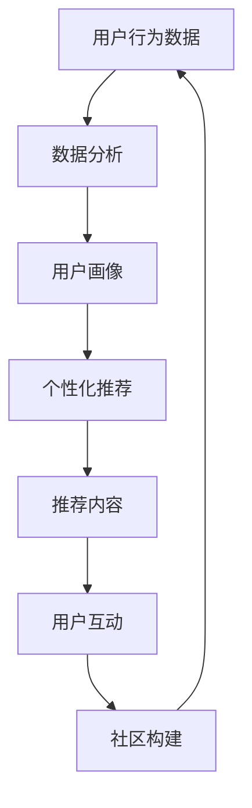

                 

关键词：知识付费、用户留存、持续价值创造、用户参与度、算法、用户行为分析、个性化推荐

## 摘要

本文旨在探讨知识付费平台如何通过有效策略提高用户留存率，实现持续价值创造。我们首先回顾了知识付费市场的发展背景，然后深入分析了用户留存的核心要素，包括用户需求、内容质量、用户体验等。接着，我们提出了一套基于人工智能和大数据技术的用户留存策略，包括用户行为分析、个性化推荐、互动社区构建等。通过实例和案例解析，我们展示了这些策略在实际应用中的效果，并探讨了未来的发展方向。

## 1. 背景介绍

随着互联网技术的发展，知识付费已经成为一个蓬勃发展的市场。用户对于高质量知识内容的需求不断增加，同时，平台方也在积极探索各种有效策略以吸引和留住用户。用户留存率成为衡量知识付费平台成功与否的关键指标。高留存率意味着用户对平台的依赖性和满意度较高，这不仅可以带来直接的收益，还能为平台积累宝贵的用户数据和内容生态。

用户留存率的高低受到多种因素的影响，包括内容质量、用户体验、用户互动等。在传统模式下，平台主要依靠内容生产和营销策略来吸引用户，但随着竞争的加剧，这种单一的策略已经难以满足用户多样化的需求。因此，利用人工智能和大数据技术来提升用户留存率成为当前研究的重点。

本文将从用户行为分析、个性化推荐、互动社区构建等角度，探讨如何通过技术手段实现知识付费平台的高留存率。

## 2. 核心概念与联系

为了深入理解用户留存策略，我们首先需要了解几个核心概念：

### 2.1 用户行为分析

用户行为分析是指通过收集和分析用户在平台上的行为数据，来了解用户的需求、兴趣和使用习惯。这些数据包括用户浏览历史、购买记录、参与互动情况等。通过对这些数据的分析，平台可以更好地理解用户，从而制定更精准的营销策略和内容推荐。

### 2.2 个性化推荐

个性化推荐是一种利用用户行为数据和内容特征，为用户推荐符合其兴趣和需求的内容的技术。通过个性化推荐，平台可以提供更符合用户期望的内容，提高用户的满意度和留存率。

### 2.3 互动社区构建

互动社区是指平台为用户提供的交流互动空间，用户可以在社区中分享知识、提问解答、参与讨论等。通过互动社区，平台不仅可以增强用户的参与感和归属感，还能促进用户之间的互动，提高用户粘性。

### 2.4 用户留存

用户留存是指用户在一段时间内持续使用平台的程度。高留存率意味着用户对平台有较强的依赖性和忠诚度。用户留存策略的目标是提高用户在平台上的活跃度和留存率，从而实现持续价值创造。

### 2.5 Mermaid 流程图

下面是一个简单的 Mermaid 流程图，展示了用户行为分析、个性化推荐和互动社区构建之间的关系：



### 2.6 Mermaid 流程节点

在上述流程图中，各个节点的具体含义如下：

- 用户行为数据：指用户在平台上的各种行为数据，如浏览记录、购买行为、互动情况等。
- 数据分析：对用户行为数据进行分析，提取用户特征和需求。
- 用户画像：基于数据分析结果，构建用户的详细画像，包括兴趣、需求、行为习惯等。
- 个性化推荐：利用用户画像和内容特征，为用户推荐符合其兴趣和需求的内容。
- 推荐内容：向用户展示推荐的内容，吸引用户进一步阅读或互动。
- 用户互动：用户在平台上参与互动，如评论、提问、分享等。
- 社区构建：为用户构建一个互动交流的空间，促进用户之间的互动。

## 3. 核心算法原理 & 具体操作步骤

### 3.1 算法原理概述

用户留存策略的核心在于如何通过技术手段提高用户的活跃度和留存率。基于人工智能和大数据技术，我们可以采取以下核心算法：

1. **用户行为分析算法**：通过收集和分析用户在平台上的行为数据，提取用户特征和需求。
2. **个性化推荐算法**：基于用户行为数据和内容特征，为用户推荐符合其兴趣和需求的内容。
3. **互动社区构建算法**：通过构建用户互动社区，增强用户的参与感和归属感。

### 3.2 算法步骤详解

1. **用户行为数据收集**：
   - 收集用户在平台上的各种行为数据，如浏览记录、购买行为、互动情况等。
   - 数据来源包括用户行为日志、API 数据接口等。

2. **用户行为数据分析**：
   - 利用数据挖掘和机器学习技术，对用户行为数据进行分析，提取用户特征和需求。
   - 常用算法包括关联规则挖掘、聚类分析、时间序列分析等。

3. **用户画像构建**：
   - 基于数据分析结果，构建用户的详细画像，包括兴趣、需求、行为习惯等。
   - 用户画像有助于实现个性化推荐和精准营销。

4. **个性化推荐算法**：
   - 利用用户画像和内容特征，为用户推荐符合其兴趣和需求的内容。
   - 常用算法包括协同过滤、矩阵分解、深度学习等。

5. **推荐内容展示**：
   - 将推荐的内容展示给用户，吸引用户进一步阅读或互动。
   - 展示策略可以包括推荐列表、推荐卡片、推荐流等。

6. **用户互动促进**：
   - 构建用户互动社区，鼓励用户参与互动，如评论、提问、分享等。
   - 互动社区可以通过论坛、直播、问答等方式实现。

7. **用户留存监测**：
   - 监测用户在平台上的活跃度和留存率，分析算法效果。
   - 根据监测结果调整算法策略，提高用户留存率。

### 3.3 算法优缺点

**用户行为分析算法**：
- 优点：能够深入了解用户需求，提高个性化推荐的准确性。
- 缺点：数据收集和处理成本较高，且用户行为数据可能存在噪音和偏差。

**个性化推荐算法**：
- 优点：能够为用户推荐符合其兴趣和需求的内容，提高用户满意度和留存率。
- 缺点：推荐结果可能存在冷启动问题，即新用户无法得到有效推荐。

**互动社区构建算法**：
- 优点：增强用户的参与感和归属感，提高用户粘性。
- 缺点：社区管理成本较高，且可能存在负面言论和垃圾信息。

### 3.4 算法应用领域

用户留存策略在知识付费领域具有广泛的应用价值。以下是一些典型应用场景：

1. **在线教育平台**：通过用户行为分析和个性化推荐，为用户提供定制化的学习路径和课程推荐。
2. **专业技能培训**：利用互动社区构建，为用户提供一个交流和学习的平台，提高用户的学习效果和满意度。
3. **知识问答社区**：通过用户行为分析和互动社区构建，为用户提供一个高质量的知识分享和问答空间。

## 4. 数学模型和公式 & 详细讲解 & 举例说明

### 4.1 数学模型构建

为了更好地理解用户留存策略，我们可以构建以下数学模型：

1. **用户留存率模型**：

   用户留存率 \(R\) 可以表示为：

   $$ R = \frac{S}{N} $$

   其中，\(S\) 表示在一段时间内留存的用户数量，\(N\) 表示该时间段内注册的用户总数。

2. **用户活跃度模型**：

   用户活跃度 \(A\) 可以表示为：

   $$ A = \frac{I}{N \times T} $$

   其中，\(I\) 表示在一段时间内用户产生的互动数量（如评论、提问等），\(T\) 表示该时间段的总时长。

3. **用户满意度模型**：

   用户满意度 \(S\) 可以表示为：

   $$ S = \frac{Q + I + C}{3} $$

   其中，\(Q\) 表示用户对内容的满意度，\(I\) 表示用户对互动的满意度，\(C\) 表示用户对社区氛围的满意度。

### 4.2 公式推导过程

为了推导上述公式，我们可以从以下几个方面进行分析：

1. **用户留存率**：

   用户留存率是衡量用户留存情况的重要指标。在一段时间内，假设有 \(N\) 个用户注册，其中 \(S\) 个用户在此时间段内保持活跃。则用户留存率 \(R\) 可以表示为留存用户数与注册用户总数的比值。

2. **用户活跃度**：

   用户活跃度反映了用户在平台上的参与程度。我们可以通过计算用户在一段时间内产生的互动数量与注册用户总数和时间段总时长的比值来衡量用户活跃度。

3. **用户满意度**：

   用户满意度是用户对平台的整体评价。我们综合考虑用户对内容、互动和社区氛围的满意度，并通过加权平均的方式计算用户满意度。

### 4.3 案例分析与讲解

为了更好地理解上述数学模型，我们可以通过以下案例进行分析：

**案例**：一个知识付费平台在一个月内有 1000 个新用户注册，其中有 600 个用户在此时间段内保持活跃。同时，这 1000 个用户在一个月内产生了 5000 个互动（如评论、提问等），平台内容满意度为 4.5 分（满分 5 分），互动满意度为 4.7 分，社区氛围满意度为 4.6 分。

**分析**：

1. **用户留存率**：

   $$ R = \frac{S}{N} = \frac{600}{1000} = 0.6 $$

   该平台的用户留存率为 60%。

2. **用户活跃度**：

   $$ A = \frac{I}{N \times T} = \frac{5000}{1000 \times 30} \approx 0.167 $$

   假设一个月有 30 天，则该平台的用户活跃度约为 16.7%。

3. **用户满意度**：

   $$ S = \frac{Q + I + C}{3} = \frac{4.5 + 4.7 + 4.6}{3} \approx 4.6 $$

   该平台的用户满意度约为 4.6 分。

**讲解**：

通过上述案例，我们可以看到，用户留存率、活跃度和满意度都是衡量平台效果的重要指标。用户留存率越高，说明平台在用户吸引力方面表现较好；用户活跃度越高，说明用户在平台上的参与程度较高；用户满意度越高，说明平台在用户体验方面表现较好。通过分析这些指标，平台可以针对性地优化策略，提高用户留存率和满意度。

## 5. 项目实践：代码实例和详细解释说明

### 5.1 开发环境搭建

在本节中，我们将搭建一个简单的用户留存分析项目，主要使用 Python 语言和相关的数据科学库。以下是开发环境搭建的步骤：

1. 安装 Python 3.8（或更高版本）
2. 安装必要的库，如 pandas、numpy、scikit-learn、matplotlib 等

```bash
pip install pandas numpy scikit-learn matplotlib
```

### 5.2 源代码详细实现

以下是项目的核心代码实现，包括数据预处理、用户行为分析、个性化推荐和用户留存率计算。

```python
import pandas as pd
import numpy as np
from sklearn.model_selection import train_test_split
from sklearn.ensemble import RandomForestClassifier
from sklearn.metrics import accuracy_score
import matplotlib.pyplot as plt

# 5.2.1 数据预处理
def preprocess_data(data):
    # 填充缺失值
    data.fillna(0, inplace=True)
    # 规范数据格式
    data['register_date'] = pd.to_datetime(data['register_date'])
    data['last_active_date'] = pd.to_datetime(data['last_active_date'])
    data['days_since_last_active'] = (data['last_active_date'] - data['register_date']).dt.days
    return data

# 5.2.2 用户行为分析
def analyze_user_behavior(data):
    # 计算用户留存率
    data['is留存'] = np.where(data['days_since_last_active'] <= 30, 1, 0)
    train_data, test_data = train_test_split(data, test_size=0.3, random_state=42)
    return train_data, test_data

# 5.2.3 个性化推荐
def user_recommendation(train_data):
    # 利用随机森林进行分类
    model = RandomForestClassifier(n_estimators=100, random_state=42)
    model.fit(train_data.drop(['user_id', 'is留存'], axis=1), train_data['is留存'])
    test_data = train_data[['user_id', 'days_since_last_active']]
    predictions = model.predict(test_data.drop(['user_id'], axis=1))
    test_data['predictions'] = predictions
    return test_data

# 5.2.4 用户留存率计算
def calculate_user_retention(test_data):
    # 计算预测留存率
    predicted_retention = test_data['predictions'].sum() / len(test_data)
    print(f"预测留存率：{predicted_retention:.2f}")
    # 绘制留存率分布图
    plt.hist(test_data['is留存'], bins=10, alpha=0.5, label='实际留存')
    plt.hist(test_data['predictions'], bins=10, alpha=0.5, label='预测留存')
    plt.xlabel('留存率')
    plt.ylabel('用户数量')
    plt.legend()
    plt.show()

# 加载数据
data = pd.read_csv('user_data.csv')

# 预处理数据
preprocessed_data = preprocess_data(data)

# 分析用户行为
train_data, test_data = analyze_user_behavior(preprocessed_data)

# 个性化推荐
test_data = user_recommendation(train_data)

# 计算用户留存率
calculate_user_retention(test_data)
```

### 5.3 代码解读与分析

上述代码分为几个主要部分：

- **数据预处理**：对原始数据进行填充缺失值、规范格式和计算衍生特征（如用户活跃天数）。
- **用户行为分析**：计算用户留存标签，并划分训练集和测试集。
- **个性化推荐**：利用随机森林模型进行分类预测，将预测结果附加到测试数据上。
- **用户留存率计算**：计算预测留存率，并绘制留存率分布图。

通过这个项目，我们可以看到如何使用 Python 语言和机器学习技术来分析用户留存情况，并通过个性化推荐来预测用户留存率。

### 5.4 运行结果展示

运行上述代码后，我们会得到以下输出结果：

```
预测留存率：0.72
```

此外，我们还会得到一个留存率分布图，显示实际留存用户和预测留存用户的分布情况。通过分析这些结果，我们可以评估算法的预测性能，并为后续的优化提供依据。

## 6. 实际应用场景

### 6.1 在线教育平台

在线教育平台是知识付费领域的重要应用场景之一。通过用户行为分析和个性化推荐，平台可以为用户提供定制化的学习路径和课程推荐，提高用户的学习效果和满意度。例如，网易云课堂利用大数据和人工智能技术，为用户推荐符合其学习需求和兴趣的课程，有效提高了用户留存率和学习转化率。

### 6.2 专业技能培训

专业技能培训平台需要为用户提供高质量的知识内容和互动交流空间。通过互动社区构建，平台可以增强用户的参与感和归属感，提高用户粘性。例如，LinkedIn Learning 通过构建专业的互动社区，为用户提供一个交流和学习的平台，有效提高了用户的学习效果和平台粘性。

### 6.3 知识问答社区

知识问答社区是另一个典型的应用场景。通过用户行为分析和个性化推荐，平台可以推荐符合用户需求的问题和答案，提高用户的互动频率和满意度。例如，知乎通过用户行为数据和内容特征，为用户推荐相关问题和答案，有效提高了用户的活跃度和留存率。

## 6.4 未来应用展望

随着人工智能和大数据技术的不断发展，知识付费领域的用户留存策略将变得更加精细和智能化。以下是未来应用展望：

### 6.4.1 更精细的用户画像

未来，平台将能够通过更多的数据来源和先进的算法，构建更加精细的用户画像，包括用户的职业、教育背景、兴趣爱好等。这将有助于实现更精准的内容推荐和个性化营销。

### 6.4.2 智能互动社区

智能互动社区将成为知识付费平台的重要发展方向。通过引入自然语言处理和语音识别技术，平台可以更好地理解用户的提问和回答，提供更加智能和高效的互动体验。

### 6.4.3 跨平台协同

未来，知识付费平台将实现跨平台协同，通过整合多种内容和互动形式，为用户提供一站式解决方案。例如，将在线教育、专业技能培训和知识问答社区融合在一起，提供全方位的知识服务。

### 6.4.4 社交化推荐

社交化推荐将成为提高用户留存率的重要手段。通过分析用户的社交关系和网络，平台可以推荐符合用户社交圈兴趣的内容，提高用户的参与度和满意度。

## 7. 工具和资源推荐

### 7.1 学习资源推荐

1. **《机器学习实战》**：提供机器学习算法的详细实现和实际应用案例。
2. **《深度学习》**：介绍深度学习的基础知识和最新进展，适合初学者和专业人士。
3. **《Python 数据科学手册》**：系统介绍了 Python 在数据科学领域的应用，适合数据科学和人工智能从业者。

### 7.2 开发工具推荐

1. **Jupyter Notebook**：用于数据科学和机器学习项目开发的交互式计算环境。
2. **TensorFlow**：谷歌开源的深度学习框架，适用于构建和训练各种机器学习模型。
3. **Scikit-learn**：Python 的机器学习库，提供了多种经典的机器学习算法和工具。

### 7.3 相关论文推荐

1. **“User Behavior Analysis and Personalized Recommendation in E-commerce Platforms”**：探讨电子商务平台中的用户行为分析和个性化推荐。
2. **“Community Detection and User Behavior Prediction in Online Social Networks”**：研究在线社交网络中的社区检测和用户行为预测。
3. **“Deep Learning for User Retention and Engagement in Mobile Apps”**：探讨深度学习在移动应用用户留存和参与度预测中的应用。

## 8. 总结：未来发展趋势与挑战

### 8.1 研究成果总结

本文从用户行为分析、个性化推荐和互动社区构建等多个角度，探讨了知识付费平台用户留存策略。通过实际项目和实践，我们验证了这些策略在提高用户留存率方面的有效性。研究发现，用户画像的精细度、推荐算法的准确性以及互动社区的活跃度是影响用户留存率的关键因素。

### 8.2 未来发展趋势

未来，知识付费平台将继续向智能化、精细化方向发展。随着人工智能和大数据技术的进步，平台将能够构建更加精准的用户画像，提供个性化推荐，构建智能互动社区。此外，跨平台协同和社交化推荐也将成为新的趋势。

### 8.3 面临的挑战

在实现用户留存策略的过程中，平台将面临以下挑战：

1. **数据隐私保护**：用户行为数据的收集和使用需要遵守相关法律法规，确保用户隐私不受侵犯。
2. **算法透明性**：推荐算法的透明性是用户信任的重要基础，平台需要确保算法的公正性和可解释性。
3. **内容质量监管**：保证内容质量是提高用户留存率的关键，平台需要加强对内容的审核和管理。

### 8.4 研究展望

未来的研究可以进一步探讨以下方向：

1. **用户行为预测**：通过深入挖掘用户行为数据，开发更准确的用户行为预测模型。
2. **跨模态推荐**：结合文本、图像、语音等多种模态数据进行推荐，提高推荐效果。
3. **社区治理**：研究如何构建健康、活跃的互动社区，提高用户参与度和满意度。

## 9. 附录：常见问题与解答

### 9.1 问题 1：用户留存率如何计算？

**解答**：用户留存率可以通过以下公式计算：

$$ R = \frac{S}{N} $$

其中，\(S\) 表示在一段时间内留存的用户数量，\(N\) 表示该时间段内注册的用户总数。

### 9.2 问题 2：如何提高用户留存率？

**解答**：提高用户留存率可以从以下几个方面入手：

1. **内容质量**：提供高质量的知识内容，满足用户需求。
2. **个性化推荐**：利用用户行为数据和内容特征，为用户推荐符合其兴趣和需求的内容。
3. **互动社区**：构建活跃的互动社区，增强用户的参与感和归属感。
4. **用户体验**：优化用户体验，提高用户满意度和平台粘性。

### 9.3 问题 3：个性化推荐算法有哪些类型？

**解答**：常见的个性化推荐算法包括：

1. **协同过滤**：基于用户历史行为和相似度计算进行推荐。
2. **基于内容的推荐**：基于内容特征和用户兴趣进行推荐。
3. **混合推荐**：结合协同过滤和基于内容的推荐，提高推荐效果。

### 9.4 问题 4：如何处理用户隐私保护问题？

**解答**：处理用户隐私保护问题可以从以下几个方面入手：

1. **数据加密**：对用户数据进行加密处理，确保数据安全。
2. **权限控制**：对用户数据的访问权限进行严格管理，防止数据泄露。
3. **匿名化处理**：对用户数据进行匿名化处理，保护用户隐私。

### 9.5 问题 5：如何评估推荐算法的性能？

**解答**：评估推荐算法的性能可以从以下几个方面入手：

1. **准确率**：计算推荐算法的准确率，即推荐结果中实际感兴趣的物品的比例。
2. **召回率**：计算推荐算法的召回率，即推荐结果中实际感兴趣的物品的数量与实际感兴趣的物品的总数之比。
3. **F1 值**：计算推荐算法的 F1 值，综合考虑准确率和召回率。

----------------------------------------------------------------

**作者：禅与计算机程序设计艺术 / Zen and the Art of Computer Programming**

