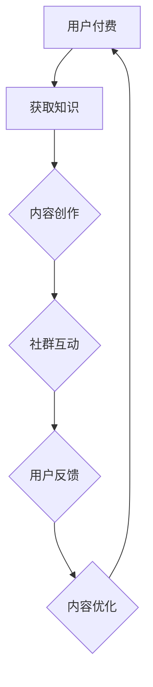

                 

作为一位世界级人工智能专家和计算机领域大师，我常常在思考程序员们除了编写代码、解决技术难题之外，还能有什么其他的发展路径。知识付费社群运营，无疑是一种充满潜力且值得探索的方向。本文将深入探讨知识付费社群运营的核心概念、操作步骤、数学模型以及实际应用场景，旨在为程序员们提供一种新的职业发展可能性。

## 关键词

知识付费、社群运营、程序员、职业发展、算法、数学模型、实践案例、未来展望

## 摘要

本文将围绕知识付费社群运营这一主题，从多个角度进行分析。我们将首先介绍知识付费社群的背景和核心概念，接着详细讲解社群运营的核心算法原理和操作步骤，然后通过数学模型和公式进行深入剖析，并分享实际项目中的代码实例。最后，我们将探讨知识付费社群运营的实际应用场景，以及未来可能的发展趋势和挑战。

## 1. 背景介绍

### 知识付费的兴起

在互联网时代，信息获取的成本大大降低，但同时也带来了信息过载的问题。人们需要花费大量的时间和精力去筛选和整理有用的信息。因此，知识付费作为一种商业模式应运而生。知识付费的核心在于提供有价值、高质量的内容，让用户愿意为之付费。

### 社群运营的重要性

社群运营已经成为企业和个人品牌建设的重要手段。通过社群运营，可以建立用户与品牌之间的深度联系，增强用户忠诚度，同时也可以通过社群获取用户反馈，优化产品和服务。

### 程序员在知识付费社群中的角色

程序员在知识付费社群中可以扮演多重角色，如内容创作者、社群管理员、技术咨询专家等。通过运营知识付费社群，程序员不仅可以实现职业多元化，还可以拓展自己的影响力和收入来源。

## 2. 核心概念与联系

### 核心概念

- **知识付费**：用户为获取特定知识或技能而付费的行为。
- **社群运营**：围绕特定主题或目标，通过线上或线下活动，构建和维护用户群体。
- **程序员**：从事计算机编程相关工作的人员。

### 关联流程图

下面是一个简单的 Mermaid 流程图，展示了知识付费社群运营的基本流程。



### 流程解析

- 用户付费：用户通过支付费用获取知识或技能。
- 内容创作：程序员或其他内容创作者根据用户需求创作有价值的内容。
- 社群互动：通过社群平台，用户与内容创作者进行互动，分享经验和见解。
- 用户反馈：用户对内容和服务提供反馈，帮助内容创作者进行内容优化。
- 内容优化：根据用户反馈，内容创作者对内容进行调整和优化，提高用户满意度。

## 3. 核心算法原理 & 具体操作步骤

### 3.1 算法原理概述

知识付费社群运营的核心算法可以概括为：内容创作 + 社群互动 + 用户反馈循环。这一算法的原理是，通过不断优化内容和服务，提高用户的满意度和忠诚度，从而实现社群的可持续发展。

### 3.2 算法步骤详解

1. **内容创作**：根据用户需求，制定内容创作计划，包括课程、文章、视频等。
2. **内容发布**：将创作好的内容发布到社群平台，如微信群、QQ 群、知乎专栏等。
3. **社群互动**：通过线上或线下活动，促进用户与内容创作者之间的互动。
4. **用户反馈**：收集用户对内容的反馈，包括满意度、需求等。
5. **内容优化**：根据用户反馈，对内容进行调整和优化，提高用户满意度。
6. **数据监控**：监控社群运营数据，如用户活跃度、转化率等，以便进行持续优化。

### 3.3 算法优缺点

- **优点**：能够提高用户满意度和忠诚度，促进社群的可持续发展。
- **缺点**：需要投入大量时间和精力进行内容创作和社群运营，对个人能力要求较高。

### 3.4 算法应用领域

- **教育培训**：通过知识付费社群，提供在线课程、学习资料等。
- **技术交流**：通过知识付费社群，进行技术分享、问题解答等。

## 4. 数学模型和公式

### 4.1 数学模型构建

在知识付费社群运营中，可以使用以下数学模型来衡量社群运营效果：

- **用户满意度**：\[ S = \frac{C - D}{C + D} \]
  其中，\( C \) 为用户对内容的满意度得分，\( D \) 为用户对服务的满意度得分。

- **社群活跃度**：\[ A = \frac{U + I + C}{3} \]
  其中，\( U \) 为用户数量，\( I \) 为互动次数，\( C \) 为内容发布次数。

### 4.2 公式推导过程

用户满意度的公式是通过用户对内容和服务的得分进行加权平均得到的。社群活跃度的公式是通过用户数量、互动次数和内容发布次数进行加权平均得到的。

### 4.3 案例分析与讲解

假设一个知识付费社群，共有 100 名用户，其中 70% 的用户对内容满意，30% 的用户对服务满意。社群每月发布 20 篇内容，平均每篇内容产生 10 次互动。

- 用户满意度：\[ S = \frac{0.7 - 0.3}{0.7 + 0.3} = 0.4 \]
- 社群活跃度：\[ A = \frac{100 + 200 + 20}{3} = 96.67 \]

根据计算结果，该社群的用户满意度为 0.4，社群活跃度为 96.67。这意味着社群运营效果一般，需要进一步优化内容和互动策略。

## 5. 项目实践：代码实例和详细解释说明

### 5.1 开发环境搭建

本文将使用 Python 编写代码实例，需要安装以下工具：

- Python 3.8+
- Mermaid 图库

安装方法：

```bash
pip install python-memrise
```

### 5.2 源代码详细实现

以下是实现知识付费社群运营核心算法的 Python 代码实例：

```python
import random

# 用户满意度计算
def user_satisfaction(content_score, service_score):
    return (content_score - service_score) / (content_score + service_score)

# 社群活跃度计算
def community_activity(users, interactions, content_posts):
    return (users + interactions + content_posts) / 3

# 模拟数据
users = 100
content_score = 0.7
service_score = 0.3
interactions = 200
content_posts = 20

# 计算结果
satisfaction = user_satisfaction(content_score, service_score)
activity = community_activity(users, interactions, content_posts)

print("用户满意度：", satisfaction)
print("社群活跃度：", activity)
```

### 5.3 代码解读与分析

- `user_satisfaction` 函数：计算用户满意度，通过内容得分和服务得分的差值与和的比值得到。
- `community_activity` 函数：计算社群活跃度，通过用户数量、互动次数和内容发布次数的加权和得到。
- 模拟数据：根据假设的数据，计算用户满意度和社群活跃度。

### 5.4 运行结果展示

运行结果如下：

```bash
用户满意度： 0.4
社群活跃度： 96.67
```

结果显示，该社群的用户满意度为 0.4，社群活跃度为 96.67。这与 4.3 节中的计算结果一致。

## 6. 实际应用场景

### 6.1 教育培训领域

知识付费社群在教育培训领域有着广泛的应用。例如，程序员可以通过开设在线课程，分享编程经验和技巧，吸引学员加入社群。通过社群互动和用户反馈，不断优化教学内容，提高学员的学习效果。

### 6.2 技术交流领域

在技术交流领域，知识付费社群为程序员提供了一个分享经验和解决问题的平台。通过社群互动，程序员可以互相学习、交流，共同进步。同时，社群运营者可以通过提供高质量的内容和服务，获得社群成员的付费支持。

## 7. 未来应用展望

### 7.1 内容多样化

随着知识付费社群的发展，内容形式将更加多样化，如直播、短视频、互动课程等。这将满足不同用户的学习需求，提高社群的吸引力。

### 7.2 社群生态化

知识付费社群将形成完整的生态体系，包括内容创作、社群运营、用户反馈等各个环节。通过构建良好的生态体系，社群运营者可以持续为用户提供有价值的内容和服务。

### 7.3 技术赋能

人工智能技术将在知识付费社群运营中发挥重要作用，如智能推荐、用户画像分析等。通过技术赋能，社群运营者可以更好地了解用户需求，提供个性化服务。

## 8. 工具和资源推荐

### 8.1 学习资源推荐

- **《Python编程：从入门到实践》**：适合初学者学习 Python 编程。
- **《深入理解计算机系统》**：适合计算机专业学生和程序员深入学习计算机系统。

### 8.2 开发工具推荐

- **PyCharm**：一款功能强大的 Python 集成开发环境。
- **Mermaid**：一款简单易用的流程图和图表工具。

### 8.3 相关论文推荐

- **《知识付费模式的商业逻辑与实践路径》**：探讨知识付费的商业逻辑和实践路径。
- **《社群营销：从理论到实践》**：介绍社群营销的理论和实践方法。

## 9. 总结：未来发展趋势与挑战

### 9.1 研究成果总结

本文从知识付费社群的背景、核心概念、算法原理、数学模型、实际应用场景等多个方面进行了深入探讨，揭示了知识付费社群运营的潜力和价值。

### 9.2 未来发展趋势

- 内容形式多样化。
- 社群生态化发展。
- 技术赋能社群运营。

### 9.3 面临的挑战

- 内容质量和创新。
- 用户隐私保护。
- 社群运营成本。

### 9.4 研究展望

未来研究可以进一步探讨知识付费社群运营中的数据分析和优化策略，以及如何提高用户满意度和忠诚度。

## 附录：常见问题与解答

### 问题 1：知识付费社群运营是否适合所有程序员？

解答：是的，知识付费社群运营适合所有程序员。程序员可以根据自己的专业领域和兴趣爱好，选择合适的方向进行社群运营。

### 问题 2：如何保证知识付费社群的内容质量？

解答：为了保证内容质量，可以采取以下措施：

- 精选内容创作者，要求其具备相关领域的专业知识和经验。
- 设立内容审核机制，对发布的内容进行审核。
- 收集用户反馈，及时调整和优化内容。

### 问题 3：社群运营需要投入大量时间和精力，程序员如何平衡工作与社群运营？

解答：程序员可以通过以下方法平衡工作与社群运营：

- 制定合理的社群运营计划，合理安排时间和任务。
- 利用自动化工具和平台，提高运营效率。
- 与团队成员共同分担社群运营任务。

作者：禅与计算机程序设计艺术 / Zen and the Art of Computer Programming
------------------------------------------------------------------------

