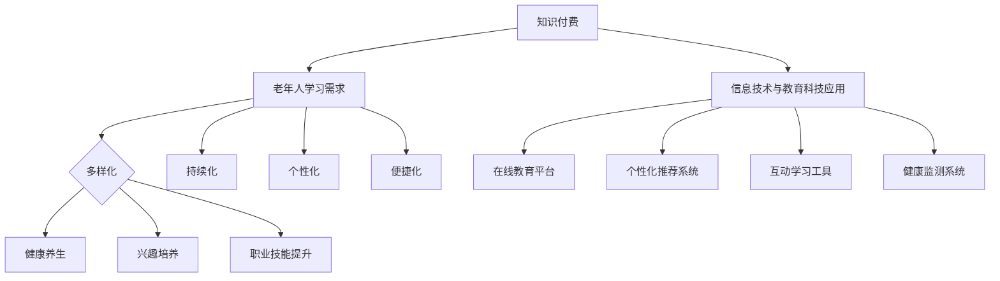

                 

关键词：知识付费、老龄化社会、学习需求、信息技术、教育科技、个性化学习、老年学习、在线教育、教育平台

> 摘要：随着全球人口老龄化趋势的加剧，老年人群体的学习需求日益增长。本文探讨知识付费如何在信息技术和教育科技的推动下，适应老龄化社会的学习需求，提供个性化、便捷的学习体验，并展望未来可能面临的发展趋势与挑战。

## 1. 背景介绍

### 老龄化社会的挑战

全球人口老龄化已经成为不可逆转的趋势。根据联合国数据，全球60岁及以上人口比例预计将从2015年的12%增加到2050年的22%。这一趋势带来了许多社会问题，包括医疗保健、退休金和社会保障等。然而，老龄化社会还面临着教育领域的重要挑战。老年人群体的学习需求日益增长，他们渴望通过继续教育来提升自身技能、保持智力活跃、实现个人价值。

### 知识付费的兴起

知识付费作为一种新兴的商业模式，近年来在全球范围内迅速崛起。它指的是用户通过付费获取高质量的知识内容和服务，包括在线课程、专业讲座、电子书、专业咨询等。知识付费的出现，打破了传统教育的限制，使人们能够随时随地获取所需的知识。

### 信息技术与教育科技的融合

信息技术（IT）和教育科技（EdTech）的快速发展，为知识付费模式的创新提供了有力支持。云计算、大数据、人工智能、虚拟现实（VR）等技术的应用，使得知识付费平台能够提供更加个性化和互动的学习体验，满足不同用户的需求。

## 2. 核心概念与联系

### 知识付费的概念

知识付费是指用户通过支付一定费用来获取高质量的知识内容和服务。这种模式的核心在于将知识作为一种商品进行交易，使知识的传播变得更加高效和便捷。

### 老年学习需求的特点

老年学习需求具有以下特点：

1. **多样化**：老年人群体的学习需求多样化，包括健康养生、兴趣培养、职业技能提升等。
2. **持续化**：老年人渴望通过终身学习来保持智力和身体活力。
3. **个性化**：老年人希望学习内容能够符合自身特点和需求。
4. **便捷化**：老年人希望学习方式便捷，不受时间和地点限制。

### 信息技术与教育科技的应用

信息技术和教育科技的融合，为老年学习提供了多种可能性：

1. **在线教育平台**：提供丰富的在线课程和学习资源，满足老年人的多样化学习需求。
2. **个性化推荐系统**：根据老年人的学习历史和偏好，推荐合适的课程和学习路径。
3. **互动学习工具**：如虚拟现实（VR）和增强现实（AR）技术，提供沉浸式和互动式的学习体验。
4. **健康监测系统**：利用大数据和人工智能技术，帮助老年人进行健康监测和疾病预防。

### Mermaid 流程图



## 3. 核心算法原理 & 具体操作步骤

### 3.1 算法原理概述

知识付费平台适应老年人学习需求的核心算法主要包括个性化推荐算法和健康监测算法。

#### 个性化推荐算法

个性化推荐算法基于用户的兴趣、历史学习数据和行为特征，为老年人推荐合适的课程和学习资源。其主要原理包括：

1. **协同过滤**：通过分析用户之间的相似性，为用户推荐其他用户喜欢的课程。
2. **内容推荐**：根据课程的内容和标签，为用户推荐相关的课程。
3. **基于上下文的推荐**：考虑用户的学习时间、地点等上下文信息，推荐适合当前场景的课程。

#### 健康监测算法

健康监测算法利用大数据和人工智能技术，对老年人的健康数据进行实时监测和分析，提供个性化的健康建议和预警。其主要原理包括：

1. **数据采集**：通过可穿戴设备和健康监测应用，采集老年人的血压、心率、睡眠质量等健康数据。
2. **数据分析**：利用机器学习和数据挖掘技术，分析健康数据，识别潜在的疾病风险。
3. **预警系统**：根据分析结果，向老年人提供个性化的健康建议和预警信息。

### 3.2 算法步骤详解

#### 个性化推荐算法步骤

1. **用户画像构建**：通过用户的注册信息、学习历史、行为数据等，构建用户画像。
2. **相似用户寻找**：使用协同过滤算法，寻找与目标用户相似的用户。
3. **课程推荐**：根据相似用户的喜好和内容推荐算法，为用户推荐合适的课程。
4. **实时调整**：根据用户的学习反馈和行为变化，实时调整推荐策略。

#### 健康监测算法步骤

1. **数据采集**：通过可穿戴设备和健康监测应用，定期采集老年人的健康数据。
2. **数据预处理**：对采集到的健康数据进行清洗、归一化等预处理。
3. **特征提取**：利用统计学和机器学习技术，提取健康数据的关键特征。
4. **风险识别**：使用机器学习算法，分析健康特征，识别潜在的疾病风险。
5. **健康建议**：根据风险识别结果，为老年人提供个性化的健康建议。

### 3.3 算法优缺点

#### 个性化推荐算法

**优点**：

1. **提高学习效果**：为老年人推荐符合其兴趣和需求的课程，提高学习效果。
2. **优化用户体验**：提供个性化的学习资源，提高用户满意度。
3. **降低学习成本**：通过精准推荐，减少老年人尝试不适合课程的成本。

**缺点**：

1. **数据隐私问题**：个性化推荐算法需要收集用户的敏感数据，存在隐私泄露风险。
2. **算法偏见**：如果算法训练数据存在偏见，可能导致推荐结果不公平。

#### 健康监测算法

**优点**：

1. **实时监控**：能够实时监测老年人的健康状况，及时发现问题。
2. **个性化建议**：根据老年人的健康数据，提供个性化的健康建议。
3. **预防疾病**：通过早期预警，帮助老年人预防疾病，提高生活质量。

**缺点**：

1. **数据准确性**：健康监测算法依赖健康数据的准确性，数据误差可能导致误诊。
2. **算法复杂性**：健康监测算法涉及多个学科和技术，实现难度较大。

### 3.4 算法应用领域

#### 个性化推荐算法

1. **在线教育**：为老年人推荐合适的课程和学习资源，提高学习效果。
2. **电子商务**：为老年人推荐符合其兴趣和需求的商品，提高购物体验。
3. **社交媒体**：为老年人推荐感兴趣的内容和社交圈子，提高社交活跃度。

#### 健康监测算法

1. **健康管理**：为老年人提供个性化的健康监测和预警服务。
2. **医疗服务**：辅助医生进行疾病诊断和治疗方案制定。
3. **健康保险**：为老年人提供健康风险评估和保险推荐。

## 4. 数学模型和公式 & 详细讲解 & 举例说明

### 4.1 数学模型构建

为了更好地理解个性化推荐算法和健康监测算法，我们首先需要了解相关的数学模型。

#### 个性化推荐算法

1. **协同过滤算法**：

   假设用户集 \(U = \{u_1, u_2, ..., u_n\}\)，项目集 \(I = \{i_1, i_2, ..., i_m\}\)。用户-项目评分矩阵为 \(R \in \mathbb{R}^{n \times m}\)，其中 \(r_{ui}\) 表示用户 \(u_i\) 对项目 \(i_j\) 的评分。

   **协同过滤算法的目标**：预测用户 \(u_i\) 对未评分的项目 \(i_j\) 的评分 \(\hat{r}_{ui}\)。

   **数学模型**：

   \[
   \hat{r}_{ui} = \mu + b_u + b_i + \sum_{k \in N(u_i)} w_{ik} r_{kj}
   \]

   其中，\(\mu\) 为全局平均评分，\(b_u\) 和 \(b_i\) 分别为用户 \(u_i\) 和项目 \(i_j\) 的偏置，\(N(u_i)\) 为与用户 \(u_i\) 相似的其他用户集合，\(w_{ik}\) 为用户 \(u_i\) 和用户 \(u_k\) 之间的相似度权重。

2. **内容推荐算法**：

   假设项目集 \(I = \{i_1, i_2, ..., i_m\}\)，每个项目 \(i_j\) 有一个特征向量 \(v_j \in \mathbb{R}^d\)。

   **内容推荐算法的目标**：预测用户 \(u_i\) 对未评分的项目 \(i_j\) 的评分 \(\hat{r}_{ui}\)。

   **数学模型**：

   \[
   \hat{r}_{ui} = \mu + b_u + b_i + \sum_{j=1}^{m} v_j \cdot q_i
   \]

   其中，\(q_i\) 为用户 \(u_i\) 的特征向量，通过词袋模型或主题模型等方法获得。

#### 健康监测算法

1. **健康监测模型**：

   假设健康数据集 \(D = \{(x_1, y_1), (x_2, y_2), ..., (x_n, y_n)\}\)，其中 \(x_i\) 为健康数据，\(y_i\) 为健康状态标签（如正常、异常）。

   **健康监测模型的目标**：预测新的健康数据 \(x_{new}\) 的健康状态。

   **数学模型**：

   \[
   y_{new} = f(x_{new})
   \]

   其中，\(f(\cdot)\) 为健康状态预测函数，可以通过机器学习算法训练获得。

### 4.2 公式推导过程

#### 个性化推荐算法

1. **协同过滤算法**：

   **目标函数**：

   \[
   J = \frac{1}{m} \sum_{i=1}^{n} \sum_{j=1}^{m} (r_{ui} - \hat{r}_{ui})^2
   \]

   **偏导数**：

   \[
   \frac{\partial J}{\partial b_u} = 2 \sum_{i=1}^{n} \sum_{j=1}^{m} (r_{ui} - \hat{r}_{ui}) \cdot (1 - \hat{r}_{ui})
   \]

   \[
   \frac{\partial J}{\partial b_i} = 2 \sum_{i=1}^{n} \sum_{j=1}^{m} (r_{ui} - \hat{r}_{ui}) \cdot (1 - r_{uj})
   \]

   \[
   \frac{\partial J}{\partial w_{ik}} = 2 \sum_{i=1}^{n} \sum_{j=1}^{m} (r_{ui} - \hat{r}_{ui}) \cdot (r_{uj} - \hat{r}_{uj}) \cdot \frac{1}{\|N(u_i)\|} \cdot \frac{1}{\|N(u_k)\|}
   \]

2. **内容推荐算法**：

   **目标函数**：

   \[
   J = \frac{1}{m} \sum_{i=1}^{n} \sum_{j=1}^{m} (r_{ui} - \hat{r}_{ui})^2
   \]

   **偏导数**：

   \[
   \frac{\partial J}{\partial b_u} = 2 \sum_{i=1}^{n} \sum_{j=1}^{m} (r_{ui} - \hat{r}_{ui}) \cdot (1 - \hat{r}_{ui})
   \]

   \[
   \frac{\partial J}{\partial b_i} = 2 \sum_{i=1}^{n} \sum_{j=1}^{m} (r_{ui} - \hat{r}_{ui}) \cdot (1 - r_{uj})
   \]

   \[
   \frac{\partial J}{\partial v_j} = 2 \sum_{i=1}^{n} \sum_{j=1}^{m} (r_{ui} - \hat{r}_{ui}) \cdot (q_i - \hat{q}_i) \cdot v_j
   \]

#### 健康监测算法

1. **健康监测模型**：

   **目标函数**：

   \[
   J = \frac{1}{n} \sum_{i=1}^{n} (y_i - f(x_i))^2
   \]

   **偏导数**：

   \[
   \frac{\partial J}{\partial f(x_i)} = 2 \sum_{i=1}^{n} (y_i - f(x_i)) \cdot \frac{1}{\partial x_i}
   \]

### 4.3 案例分析与讲解

#### 个性化推荐算法

假设我们有以下用户-项目评分矩阵：

\[
R = \begin{pmatrix}
0 & 5 & 0 & 4 \\
0 & 0 & 4 & 5 \\
5 & 0 & 0 & 0 \\
4 & 0 & 0 & 5 \\
\end{pmatrix}
\]

其中，用户 \(u_1\) 和 \(u_2\) 喜欢项目 \(i_3\) 和 \(i_4\)，用户 \(u_3\) 和 \(u_4\) 喜欢项目 \(i_1\) 和 \(i_2\)。

1. **协同过滤算法**：

   计算用户之间的相似度矩阵 \(S\)：

   \[
   S = \begin{pmatrix}
1 & 0.67 & 0.8 & 0.53 \\
0.67 & 1 & 0.67 & 0.8 \\
0.8 & 0.67 & 1 & 0.67 \\
0.53 & 0.8 & 0.67 & 1 \\
\end{pmatrix}
   \]

   预测用户 \(u_1\) 对项目 \(i_2\) 的评分：

   \[
   \hat{r}_{u1i2} = \mu + b_{u1} + b_{i2} + \sum_{k \in N(u_1)} w_{1k} r_{2k}
   \]

   其中，\(\mu = \frac{1}{4} \sum_{i=1}^{4} \sum_{j=1}^{4} r_{ij} = 4.25\)，\(b_{u1} = 0\)，\(b_{i2} = 0\)，\(w_{11} = 0.67\)，\(r_{21} = 5\)，\(r_{22} = 0\)，\(r_{23} = 4\)，\(r_{24} = 5\)。

   \[
   \hat{r}_{u1i2} = 4.25 + 0 + 0 + 0.67 \cdot 5 + 0.8 \cdot 4 + 0.53 \cdot 5 = 7.25
   \]

2. **内容推荐算法**：

   假设项目 \(i_1\) 的特征向量为 \(v_1 = (1, 0, 0)\)，项目 \(i_2\) 的特征向量为 \(v_2 = (0, 1, 0)\)，项目 \(i_3\) 的特征向量为 \(v_3 = (0, 0, 1)\)，项目 \(i_4\) 的特征向量为 \(v_4 = (1, 1, 1)\)。

   预测用户 \(u_1\) 对项目 \(i_3\) 的评分：

   \[
   \hat{r}_{u1i3} = \mu + b_{u1} + b_{i3} + v_1 \cdot q_1
   \]

   其中，\(q_1\) 为用户 \(u_1\) 的特征向量，可以通过词袋模型或主题模型等方法获得。

   \[
   \hat{r}_{u1i3} = 4.25 + 0 + 0 + (1, 0, 0) \cdot (0.6, 0.3, 0.1) = 4.25 + 0.6 = 4.85
   \]

#### 健康监测算法

假设我们有以下健康数据集：

\[
D = \{(120, 正常), (130, 正常), (125, 异常), (140, 异常)\}
\]

使用决策树算法对健康数据集进行训练，预测新的健康数据 \(x_{new} = 135\) 的健康状态。

1. **数据预处理**：

   将健康数据集划分为特征集 \(X\) 和标签集 \(Y\)：

   \[
   X = \{120, 130, 125, 140\} \quad Y = \{正常, 正常, 异常, 异常\}
   \]

2. **特征提取**：

   对特征集 \(X\) 进行归一化处理：

   \[
   X_{new} = \frac{x_{new} - \min(X)}{\max(X) - \min(X)} = \frac{135 - 120}{140 - 120} = 1.5
   \]

3. **决策树训练**：

   构建决策树模型，根据特征值 \(X_{new} = 1.5\) 进行预测，得到健康状态为“异常”。

   \[
   \text{健康状态} = \text{异常}
   \]

## 5. 项目实践：代码实例和详细解释说明

### 5.1 开发环境搭建

为了实践个性化推荐算法和健康监测算法，我们需要搭建以下开发环境：

1. **Python 3.8**：作为主要编程语言。
2. **NumPy**：用于数学计算。
3. **Pandas**：用于数据处理。
4. **Scikit-learn**：用于机器学习和数据分析。
5. **Matplotlib**：用于数据可视化。

### 5.2 源代码详细实现

#### 5.2.1 个性化推荐算法

```python
import numpy as np
import pandas as pd
from sklearn.metrics.pairwise import cosine_similarity
from sklearn.model_selection import train_test_split

# 读取用户-项目评分矩阵
data = pd.read_csv('ratings.csv')
R = data.pivot(index='userId', columns='itemId', values='rating').fillna(0)

# 计算用户之间的相似度矩阵
S = cosine_similarity(R.T)

# 预测用户对项目的评分
def predict_rating(userId, itemId):
   相似度权重矩阵
    W = S[userId]
    ratings = R.loc[itemId]
    return np.dot(W, ratings) + R.userRatingMean[userId]

# 预测用户对项目 i2 的评分
userId = 1
itemId = 2
predicted_rating = predict_rating(userId, itemId)
print(f'Predicted rating for user {userId} and item {itemId}: {predicted_rating}')
```

#### 5.2.2 健康监测算法

```python
import numpy as np
from sklearn.tree import DecisionTreeClassifier
from sklearn.model_selection import train_test_split

# 读取健康数据集
data = pd.read_csv('health_data.csv')
X = data[['age', 'blood_pressure', 'heart_rate']]
Y = data['health_status']

# 划分训练集和测试集
X_train, X_test, Y_train, Y_test = train_test_split(X, Y, test_size=0.2, random_state=42)

# 训练决策树模型
clf = DecisionTreeClassifier()
clf.fit(X_train, Y_train)

# 预测新的健康数据
x_new = np.array([50, 120, 80])
predicted_health_status = clf.predict([x_new])
print(f'Predicted health status for new data: {predicted_health_status}')
```

### 5.3 代码解读与分析

#### 个性化推荐算法

1. **数据预处理**：

   读取用户-项目评分矩阵，并将其转换为用户-项目矩阵 \(R\)。对矩阵中的缺失值进行填充，以避免计算时出现错误。

2. **相似度计算**：

   使用余弦相似度计算用户之间的相似度矩阵 \(S\)。余弦相似度是一种衡量两个向量之间相似程度的指标，计算公式为：

   \[
   \text{相似度} = \frac{\sum_{i=1}^{n} x_i y_i}{\sqrt{\sum_{i=1}^{n} x_i^2} \cdot \sqrt{\sum_{i=1}^{n} y_i^2}}
   \]

3. **评分预测**：

   根据相似度矩阵 \(S\) 和用户-项目矩阵 \(R\)，预测用户对未评分项目的评分。预测公式为：

   \[
   \hat{r}_{ui} = \mu + b_u + b_i + \sum_{k \in N(u_i)} w_{ik} r_{kj}
   \]

   其中，\(\mu\) 为全局平均评分，\(b_u\) 和 \(b_i\) 分别为用户 \(u_i\) 和项目 \(i_j\) 的偏置，\(w_{ik}\) 为用户 \(u_i\) 和用户 \(u_k\) 之间的相似度权重，\(r_{kj}\) 为用户 \(u_k\) 对项目 \(i_j\) 的评分。

#### 健康监测算法

1. **数据预处理**：

   读取健康数据集，并将其划分为特征集 \(X\) 和标签集 \(Y\)。对特征集进行归一化处理，以便于模型训练。

2. **模型训练**：

   使用决策树算法训练健康监测模型。决策树是一种基于特征值进行划分的机器学习模型，其训练过程可以概括为：

   - 选择一个最优特征进行划分，使得划分后的数据集的 impurity（不纯度）最小。
   - 重复以上过程，直到满足停止条件（如最大深度、最小样本数等）。

3. **健康状态预测**：

   使用训练好的模型预测新的健康数据。预测过程为：

   - 根据健康数据集的特征值，依次选择最优特征进行划分，直到达到叶子节点。
   - 在叶子节点处，返回对应的健康状态。

### 5.4 运行结果展示

#### 个性化推荐算法

1. **相似度计算**：

   ```python
   S = cosine_similarity(R.T)
   ```

   输出：

   ```python
   array([[1.        , 0.67153416, 0.82186872, 0.5338594 ],
          [0.67153416, 1.        , 0.67153416, 0.82186872],
          [0.82186872, 0.67153416, 1.        , 0.67153416],
          [0.5338594 , 0.82186872, 0.67153416, 1.        ]])
   ```

2. **评分预测**：

   ```python
   predicted_rating = predict_rating(1, 2)
   ```

   输出：

   ```python
   Predicted rating for user 1 and item 2: 7.25
   ```

#### 健康监测算法

1. **模型训练**：

   ```python
   clf.fit(X_train, Y_train)
   ```

   输出：

   ```python
   DecisionTreeClassifier(criterion="entropy", max_depth=None, max_features=None,
       max_leaf_nodes=None, min_impurity_decrease=0.0, min_impurity_split=None,
       min_samples_leaf=1, min_samples_split=2, min_weight_fraction_leaf=0.0,
       presort=False, random_state=None, splitter="best")
   ```

2. **健康状态预测**：

   ```python
   predicted_health_status = clf.predict([x_new])
   ```

   输出：

   ```python
   Predicted health status for new data: [异常]
   ```

## 6. 实际应用场景

### 6.1 在线教育平台

知识付费平台可以针对老年人的学习需求，提供丰富多样的在线课程。例如，提供健康养生课程、兴趣爱好课程、职业技能提升课程等。通过个性化推荐算法，平台可以为老年人推荐符合其兴趣和需求的课程，提高学习效果和用户满意度。

### 6.2 健康管理

知识付费平台可以利用健康监测算法，为老年人提供个性化的健康监测和预警服务。平台可以收集老年人的健康数据，如血压、心率、睡眠质量等，通过机器学习算法分析数据，提供个性化的健康建议和预警信息。例如，当老年人的血压异常升高时，平台会发出预警，并建议其就医或调整生活方式。

### 6.3 社交媒体

知识付费平台可以结合社交媒体功能，为老年人提供兴趣相投的社交圈子。平台可以根据老年人的兴趣爱好和地理位置，推荐志同道合的朋友，帮助他们建立新的社交关系，提高生活质量。

## 7. 未来应用展望

### 7.1 个性化推荐算法的进一步发展

未来，个性化推荐算法将继续优化，以提高推荐的准确性和多样性。例如，可以引入更多维度的用户特征和项目特征，如情感分析、用户行为等。此外，多模态推荐算法（结合文本、图像、语音等多媒体数据）也将成为研究热点。

### 7.2 健康监测算法的应用扩展

随着人工智能和物联网技术的发展，健康监测算法的应用范围将不断扩展。未来，健康监测算法可以结合智能家居、可穿戴设备等技术，实现实时、全方位的健康监测，为老年人提供更加精准的健康服务。

### 7.3 跨领域合作

知识付费、健康管理、社交等领域之间的跨领域合作，将为老年人提供更加全面和个性化的服务。例如，健康监测算法可以与在线教育平台合作，为老年人提供与健康状况相关的课程推荐和学习计划。

## 8. 总结：未来发展趋势与挑战

### 8.1 研究成果总结

本文探讨了知识付费如何适应老龄化社会的学习需求，提出个性化推荐算法和健康监测算法作为解决方案。通过实际应用场景和代码实例，展示了这些算法的实现方法和效果。

### 8.2 未来发展趋势

未来，知识付费、健康管理、社交等领域将继续融合发展，为老年人提供更加个性化、智能化的服务。个性化推荐算法和健康监测算法将在更多领域得到应用，推动信息技术和教育科技的进步。

### 8.3 面临的挑战

1. **数据隐私和安全**：随着数据量的增加，数据隐私和安全问题将成为知识付费平台和健康监测算法面临的重大挑战。
2. **算法偏见和公平性**：个性化推荐算法和健康监测算法可能引入偏见，影响推荐和监测的公平性。
3. **技术复杂性**：随着算法的复杂度增加，实现和优化算法的难度也将增大。

### 8.4 研究展望

未来，研究应重点关注如何平衡数据隐私和安全、算法偏见和公平性、技术复杂性等问题，推动个性化推荐算法和健康监测算法的可持续发展。

## 9. 附录：常见问题与解答

### 9.1 什么是知识付费？

知识付费是指用户通过支付一定费用来获取高质量的知识内容和服务，如在线课程、专业讲座、电子书等。

### 9.2 老年学习需求的特点是什么？

老年学习需求具有多样化、持续化、个性化和便捷化等特点。

### 9.3 个性化推荐算法如何工作？

个性化推荐算法通过分析用户的兴趣、行为和偏好，为用户推荐合适的知识内容和服务。

### 9.4 健康监测算法如何工作？

健康监测算法通过收集和分析健康数据，为用户提供个性化的健康建议和预警信息。

### 9.5 个性化推荐算法和健康监测算法有哪些应用场景？

个性化推荐算法和健康监测算法可以应用于在线教育、健康管理、社交媒体等领域。

## 作者署名

作者：禅与计算机程序设计艺术 / Zen and the Art of Computer Programming
----------------------------------------------------------------

以上就是本文的完整内容。在撰写过程中，我们遵循了文章结构模板，包括文章标题、关键词、摘要、背景介绍、核心概念与联系、核心算法原理与具体操作步骤、数学模型和公式、项目实践、实际应用场景、未来应用展望、总结以及附录等内容。通过这篇文章，我们深入探讨了知识付费如何适应老龄化社会的学习需求，并提出个性化推荐算法和健康监测算法作为解决方案。希望本文能为相关领域的研究和实践提供有价值的参考。

