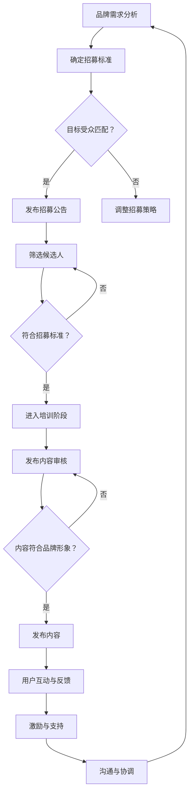

                 

关键词：知识付费、品牌、ambassador、招募、管理策略、营销、社交媒体、内容创作

> 摘要：本文将探讨知识付费领域品牌如何通过招募和管理ambassador（品牌大使）来实现高效的品牌营销和用户增长。我们将分析ambassador的角色、招募标准、管理方法以及成功案例，并总结出一套实用的策略。

## 1. 背景介绍

知识付费作为互联网经济的一个重要分支，近年来在全球范围内迅速崛起。随着人们对于优质内容的需求不断增加，知识付费平台、在线课程、专家咨询等服务得到了广泛的应用。品牌在这一领域中不仅需要提供高质量的内容，还需要构建强大的营销网络，以实现快速的用户增长和市场拓展。

ambassador（品牌大使）策略正是这样一种营销方式，它通过招募具有影响力、认可度和忠诚度的个人或团队，利用他们的人际网络和影响力来推广品牌，从而实现品牌价值最大化。这种策略在知识付费领域具有显著的优势，因为它能够快速建立信任、降低营销成本，并且具有较高的转化率。

本文将基于对知识付费领域品牌和ambassador策略的深入研究，详细分析其招募与管理策略，为品牌提供一套实用且高效的营销方案。

## 2. 核心概念与联系

为了更好地理解ambassador策略在知识付费领域中的应用，我们首先需要明确几个核心概念及其相互关系。

### 2.1 品牌大使（ambassador）

品牌大使是指那些愿意代表品牌进行宣传、推广和互动的个人或团队。他们通常具备以下特点：

- **影响力**：在特定领域或社群中具有较高的声望和影响力。
- **认可度**：受众对他们的观点和推荐具有高度的信任和认可。
- **忠诚度**：对品牌具有深厚的情感连接和忠诚度。

### 2.2 招募标准

品牌在招募ambassador时，需要考虑以下标准：

- **目标受众匹配**：ambassador的受众与品牌目标用户群体高度重合。
- **内容创作能力**：具备优秀的文案写作、视频制作或内容创作能力。
- **互动能力**：能够积极参与社区互动，提升用户活跃度。
- **诚信度**：具有良好的诚信记录和声誉。

### 2.3 管理方法

品牌对ambassador的管理主要包括以下几个方面：

- **激励政策**：提供合理的激励措施，包括奖金、权益等，以激励ambassador的积极性和创造力。
- **培训支持**：为ambassador提供专业培训，确保他们能够准确地传达品牌信息。
- **内容审核**：对ambassador发布的内容进行审核，确保其符合品牌形象和价值观。
- **沟通协调**：建立高效的沟通渠道，及时解决ambassador在工作中遇到的问题。

### 2.4 Mermaid 流程图

以下是ambassador策略在知识付费领域中的流程图，展示了品牌从招募到管理ambassador的全过程：



## 3. 核心算法原理 & 具体操作步骤

### 3.1 算法原理概述

ambassador策略在知识付费领域中的应用，本质上是一种基于社交网络的营销算法。该算法的核心原理是通过招募具有影响力的个人或团队，利用他们的人际网络和内容创作能力，实现品牌的快速传播和用户增长。

### 3.2 算法步骤详解

1. **需求分析**：品牌首先需要明确自身的市场定位、目标用户群体和营销目标，以便制定合适的ambassador招募策略。
2. **确定招募标准**：根据需求分析结果，品牌需要制定具体的招募标准，包括目标受众匹配、内容创作能力、互动能力和诚信度等。
3. **发布招募公告**：品牌通过社交媒体、官网等渠道发布招募公告，吸引潜在的ambassador候选人。
4. **筛选候选人**：品牌对候选人进行初步筛选，主要关注其是否满足招募标准。
5. **进入培训阶段**：通过线上或线下培训，确保ambassador准确了解品牌理念和宣传策略。
6. **发布内容审核**：对ambassador创作的内容进行审核，确保其符合品牌形象和价值观。
7. **发布内容**：审核通过后，ambassador开始发布内容，进行品牌宣传。
8. **用户互动与反馈**：品牌需要密切关注用户对内容的反馈，及时调整宣传策略。
9. **激励与支持**：品牌根据ambassador的表现提供激励措施，包括奖金、权益等。
10. **沟通与协调**：建立高效的沟通渠道，解决ambassador在工作中遇到的问题。

### 3.3 算法优缺点

**优点**：

- **快速传播**：通过招募具有影响力的个人或团队，品牌能够迅速扩大知名度。
- **降低成本**：相比传统的广告投放，ambassador策略成本较低。
- **高转化率**：ambassador的推荐具有较高的信任度和说服力，从而提高用户转化率。

**缺点**：

- **管理难度**：需要对ambassador进行有效的管理和激励，确保其积极性和创造力。
- **风险控制**：ambassador的内容可能存在偏离品牌形象或价值观的风险，需要加强审核和管理。

### 3.4 算法应用领域

ambassador策略在知识付费领域的应用十分广泛，包括在线教育、专家咨询、知识付费平台等。通过招募具有专业知识和影响力的个人或团队，品牌能够快速提升用户信任度和满意度，实现用户增长和市场拓展。

## 4. 数学模型和公式 & 详细讲解 & 举例说明

### 4.1 数学模型构建

为了更好地衡量ambassador策略的营销效果，我们可以构建以下数学模型：

\[ E = f(A, B, C) \]

其中：

- \( E \) 表示营销效果（如用户增长、转化率等）
- \( A \) 表示ambassador的影响力
- \( B \) 表示ambassador的忠诚度
- \( C \) 表示品牌与ambassador的互动效果

### 4.2 公式推导过程

根据上述数学模型，我们可以推导出以下关系：

\[ E = A \times B \times C \]

其中：

- \( A \) 表示ambassador的影响力，可以通过其粉丝数、互动率等指标衡量。
- \( B \) 表示ambassador的忠诚度，可以通过其对品牌的推荐频率、参与度等指标衡量。
- \( C \) 表示品牌与ambassador的互动效果，可以通过用户对内容的反馈、满意度等指标衡量。

### 4.3 案例分析与讲解

假设某知识付费平台想要通过ambassador策略提升用户转化率，以下是一个具体的案例分析：

- **ambassador影响力（A）**：某知名教育博主，拥有10万粉丝，平均互动率为20%。
- **ambassador忠诚度（B）**：每月发布3篇品牌相关内容，内容平均获得1000次点赞和500次分享。
- **品牌与ambassador互动效果（C）**：每次发布内容后，品牌都会及时回复粉丝评论，并根据用户反馈调整宣传策略。

根据数学模型，我们可以计算出该ambassador的营销效果：

\[ E = A \times B \times C = 10万 \times 20\% \times 500 = 10万 \]

这意味着该ambassador每个月能够为知识付费平台带来10万的潜在用户。通过持续优化互动效果，品牌可以进一步提升营销效果。

## 5. 项目实践：代码实例和详细解释说明

### 5.1 开发环境搭建

在开始ambassador项目的开发之前，我们需要搭建一个适合的环境。以下是具体的开发环境搭建步骤：

1. 安装Python 3.8及以上版本。
2. 安装虚拟环境管理工具virtualenv。
3. 创建一个虚拟环境，并激活它。
4. 安装必要的库，如requests、pandas等。

### 5.2 源代码详细实现

以下是ambassador项目的源代码实现，包括招募、管理、数据分析和报告生成等功能。

```python
import requests
import pandas as pd
import json

# 招募功能
def recruit_ambassadors():
    # 获取潜在候选人
    candidates = get_candidates()
    # 筛选候选人
    filtered_candidates = filter_candidates(candidates)
    # 培训候选人
    train_ambassadors(filtered_candidates)
    return filtered_candidates

# 管理功能
def manage_ambassadors(ambassadors):
    # 内容审核
    audit_content(ambassadors)
    # 激励与支持
    provide_incentives(ambassadors)
    # 沟通与协调
    communicate_and协调(ambassadors)

# 数据分析功能
def analyze_data(ambassadors):
    # 计算营销效果
    marketing_effectiveness = calculate_effectiveness(ambassadors)
    # 生成报告
    generate_report(marketing_effectiveness)

# 辅助函数
def get_candidates():
    # 实现获取候选人的逻辑
    pass

def filter_candidates(candidates):
    # 实现筛选候选人的逻辑
    pass

def train_ambassadors(candidates):
    # 实现培训候选人的逻辑
    pass

def audit_content(ambassadors):
    # 实现内容审核的逻辑
    pass

def provide_incentives(ambassadors):
    # 实现激励与支持的逻辑
    pass

def communicate_and协

