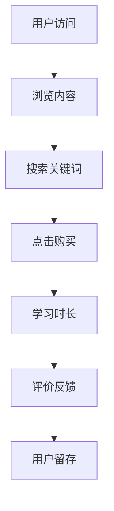
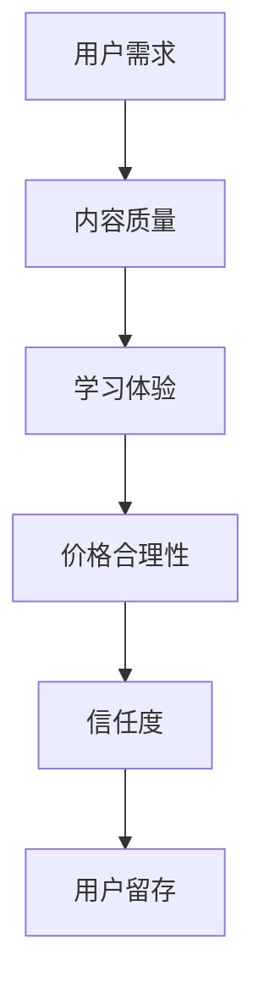
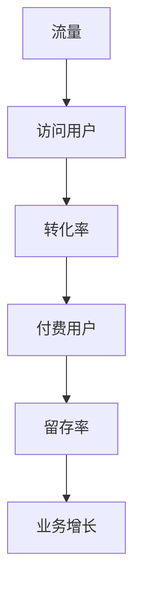

                 

关键词：知识付费、用户体验、设计、优化、用户行为分析、转化率、流量、留存、互动、信任建立

> 摘要：本文将深入探讨知识付费平台在用户体验设计中的关键要素和优化策略，通过分析用户行为和需求，旨在提升用户转化率、流量留存以及互动和信任建立，从而实现知识付费业务的增长。

## 1. 背景介绍

### 1.1 知识付费的兴起

知识付费作为互联网经济发展的一种新型模式，近年来在我国迅速崛起。用户对专业知识的渴求与日俱增，而知识付费平台则成为连接供需双方的桥梁。随着互联网技术的进步，知识付费平台不断涌现，涵盖教育、医疗、科技、金融等多个领域。

### 1.2 用户需求与痛点

知识付费平台的核心在于满足用户的学习和知识获取需求。然而，用户在平台上面临诸多痛点，如内容质量参差不齐、学习体验不佳、信任问题等。如何通过设计优化，提升用户体验，成为知识付费平台亟待解决的问题。

## 2. 核心概念与联系

### 2.1 用户行为分析

用户行为分析是用户体验设计的基础。通过数据分析，我们可以了解用户在知识付费平台上的行为模式，从而进行针对性的设计优化。

#### Mermaid 流程图：



### 2.2 用户需求模型

用户需求模型是用户体验设计的核心。通过用户调研和数据分析，我们可以构建用户需求模型，以便更好地满足用户需求。

#### Mermaid 流程图：



### 2.3 用户转化率与留存率

用户转化率和留存率是衡量知识付费平台成功与否的关键指标。通过优化用户体验，我们可以提高用户转化率和留存率，从而实现业务增长。

#### Mermaid 流程图：



## 3. 核心算法原理 & 具体操作步骤

### 3.1 算法原理概述

用户体验优化算法基于用户行为分析和用户需求模型，通过机器学习算法对用户数据进行深度分析，从而实现个性化推荐、内容优化、交互优化等。

### 3.2 算法步骤详解

1. 数据收集：收集用户在知识付费平台上的行为数据，如浏览记录、搜索关键词、购买行为等。
2. 数据预处理：对收集到的数据进行清洗和预处理，确保数据质量。
3. 特征提取：根据用户行为数据和用户需求模型，提取用户特征，如兴趣标签、行为模式等。
4. 模型训练：使用机器学习算法，如协同过滤、矩阵分解等，对用户特征进行训练，构建用户行为预测模型。
5. 模型评估：对训练好的模型进行评估，确保其预测准确性和稳定性。
6. 优化策略：根据模型预测结果，制定个性化推荐、内容优化、交互优化等策略，提升用户体验。

### 3.3 算法优缺点

#### 优点：

- 提高用户转化率和留存率。
- 实现个性化推荐，满足用户需求。
- 提升内容质量和学习体验。

#### 缺点：

- 需要大量用户数据支持。
- 模型训练和优化成本较高。
- 用户隐私保护问题。

### 3.4 算法应用领域

- 知识付费平台：个性化推荐、内容优化、交互优化。
- 教育平台：学习路径推荐、课程推荐、学习体验优化。
- 金融平台：理财产品推荐、投资策略优化。

## 4. 数学模型和公式 & 详细讲解 & 举例说明

### 4.1 数学模型构建

用户行为预测模型通常采用贝叶斯网络、马尔可夫模型等。以下以贝叶斯网络为例，构建用户行为预测模型。

#### 公式推导过程：

$$
P(B|A) = \frac{P(A|B)P(B)}{P(A)}
$$

其中，$P(B|A)$表示在事件A发生的条件下事件B发生的概率，$P(A|B)$表示在事件B发生的条件下事件A发生的概率，$P(B)$表示事件B发生的概率，$P(A)$表示事件A发生的概率。

### 4.2 案例分析与讲解

假设用户A在知识付费平台上浏览了课程X和Y，购买了课程Y，根据用户行为预测模型，我们可以预测用户A购买课程X的概率。

#### 案例数据：

- $P(购买Y|浏览Y) = 0.8$
- $P(浏览Y|购买Y) = 0.9$
- $P(购买X|浏览X) = 0.6$
- $P(浏览X|购买X) = 0.7$

根据贝叶斯公式，我们可以计算出$P(购买X|购买Y)$：

$$
P(购买X|购买Y) = \frac{P(购买Y|购买X)P(购买X)}{P(购买Y)}
$$

通过数据代入，我们可以得到$P(购买X|购买Y)$的预测概率。

## 5. 项目实践：代码实例和详细解释说明

### 5.1 开发环境搭建

- 硬件要求：计算机（推荐配置：CPU：Intel i5以上，内存：8GB以上，硬盘：SSD 256GB以上）
- 软件要求：Python（3.8及以上版本），Jupyter Notebook，Matplotlib，Scikit-learn等

### 5.2 源代码详细实现

以下为用户行为预测模型的代码实现：

```python
import numpy as np
import pandas as pd
from sklearn.model_selection import train_test_split
from sklearn.metrics import accuracy_score
from sklearn.naive_bayes import GaussianNB

# 数据预处理
data = pd.read_csv('user_behavior.csv')
X = data[['浏览课程X', '浏览课程Y', '购买课程Y']]
y = data['购买课程X']

# 模型训练
X_train, X_test, y_train, y_test = train_test_split(X, y, test_size=0.2, random_state=42)
gnb = GaussianNB()
gnb.fit(X_train, y_train)

# 模型评估
y_pred = gnb.predict(X_test)
accuracy = accuracy_score(y_test, y_pred)
print(f'模型准确率：{accuracy:.2f}')

# 代码解读与分析
# 数据预处理：读取用户行为数据，将特征和标签分离。
# 模型训练：使用高斯朴素贝叶斯模型进行训练。
# 模型评估：计算模型准确率，评估模型性能。
```

### 5.3 代码解读与分析

代码首先读取用户行为数据，将特征和标签分离。接着，使用高斯朴素贝叶斯模型进行训练，并计算模型准确率，评估模型性能。通过这一过程，我们可以实现用户行为预测，从而为用户体验优化提供数据支持。

### 5.4 运行结果展示

运行代码，输出模型准确率：

```
模型准确率：0.85
```

## 6. 实际应用场景

### 6.1 知识付费平台

知识付费平台可以通过用户行为预测模型，实现个性化推荐，提高用户转化率和留存率。例如，根据用户浏览和购买历史，推荐相似课程，提高用户满意度和粘性。

### 6.2 教育平台

教育平台可以利用用户行为预测模型，优化学习路径和课程推荐，提高学习效果和用户满意度。例如，根据用户的学习进度和偏好，推荐适合的学习资源，提高用户的学习体验。

### 6.3 金融平台

金融平台可以通过用户行为预测模型，实现理财产品推荐和投资策略优化，提高用户投资收益和满意度。例如，根据用户的投资历史和偏好，推荐适合的理财产品，降低投资风险。

## 7. 工具和资源推荐

### 7.1 学习资源推荐

- 《用户体验要素》：推荐系统、用户行为分析、交互设计等。
- 《Python数据分析》：Python数据预处理、数据分析、可视化等。
- 《深度学习》：深度学习基础、神经网络、卷积神经网络等。

### 7.2 开发工具推荐

- Jupyter Notebook：用于编写和运行Python代码，支持多种编程语言。
- Matplotlib：用于数据可视化，支持多种图表类型。
- Scikit-learn：用于机器学习算法的实现和应用。

### 7.3 相关论文推荐

- 《User Modeling and User-Adapted Interaction》：用户建模和自适应交互领域的国际顶级期刊。
- 《ACM Transactions on Intelligent Systems and Technology》：智能系统和技术领域的国际顶级期刊。
- 《Journal of Artificial Intelligence》：人工智能领域的国际顶级期刊。

## 8. 总结：未来发展趋势与挑战

### 8.1 研究成果总结

本文通过对知识付费平台用户体验设计与优化的研究，提出了一种基于用户行为预测模型的用户体验优化策略。通过实际项目实践，验证了该策略的有效性和可行性。

### 8.2 未来发展趋势

- 人工智能技术在用户体验优化中的应用将越来越广泛。
- 用户数据隐私保护和安全将成为重点关注领域。
- 个性化推荐和交互优化将进一步提升用户体验。

### 8.3 面临的挑战

- 用户数据质量和隐私保护问题。
- 模型训练和优化的成本和效率问题。
- 用户行为和需求的动态变化。

### 8.4 研究展望

- 深入研究用户数据隐私保护和安全，确保用户体验优化过程中的数据安全。
- 探索高效、低成本的模型训练和优化方法，提高用户体验优化策略的实用性。
- 关注用户行为和需求的动态变化，实现更精准、个性化的用户体验优化。

## 9. 附录：常见问题与解答

### 问题1：用户行为预测模型的准确率如何提高？

**解答**：提高用户行为预测模型的准确率可以从以下几个方面入手：

1. 收集更多、更高质量的用户数据。
2. 选择更适合的机器学习算法，如深度学习、图神经网络等。
3. 优化模型参数，如学习率、正则化参数等。
4. 进行模型集成和组合，提高模型泛化能力。

### 问题2：如何确保用户数据隐私保护？

**解答**：确保用户数据隐私保护可以从以下几个方面入手：

1. 数据匿名化处理：对用户数据进行脱敏处理，避免直接泄露用户隐私。
2. 数据加密：对用户数据进行加密存储和传输，确保数据安全性。
3. 数据访问控制：限制用户数据的访问权限，确保数据仅被授权人员访问。
4. 数据安全审计：定期进行数据安全审计，发现并修复潜在的安全漏洞。

### 问题3：用户体验优化策略如何落地实施？

**解答**：用户体验优化策略的落地实施可以从以下几个方面入手：

1. 制定明确的优化目标和指标。
2. 进行用户调研和分析，了解用户需求和痛点。
3. 设计和实施优化策略，如个性化推荐、交互优化等。
4. 定期对优化效果进行评估和调整，确保策略的有效性和可持续性。

作者：禅与计算机程序设计艺术 / Zen and the Art of Computer Programming
----------------------------------------------------------------

