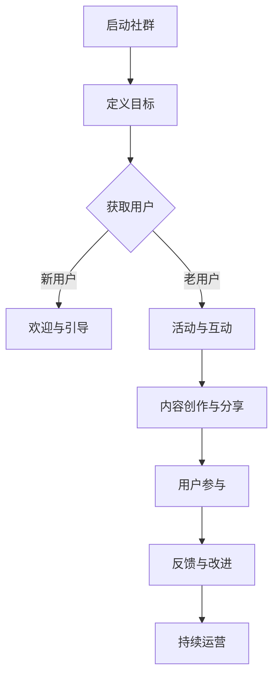

                 

关键词：知识付费、社群运营、程序员、内容营销、用户参与、平台构建

摘要：本文将探讨如何利用社群运营模板，帮助程序员有效开展知识付费业务，提升用户参与度与粘性，从而实现盈利和品牌影响力的提升。

## 1. 背景介绍

在当今数字化时代，知识付费已成为一种重要的商业模式。程序员作为互联网行业的主力军，他们掌握的技能和知识具有很高的价值。通过知识付费，程序员可以将自己的专业知识和经验转化为收入来源。然而，如何有效地运营社群，吸引并留住用户，成为了一个关键问题。

社群运营模板作为一种结构化的运营工具，可以帮助程序员系统化地进行知识付费业务。本文将介绍一套针对程序员的社群运营模板，包括核心概念、算法原理、数学模型、项目实践、实际应用场景等，以帮助程序员构建起一个成功的知识付费社群。

## 2. 核心概念与联系

### 2.1 知识付费

知识付费是指用户为了获取特定领域的知识或技能，愿意支付一定费用的一种商业模式。在程序员社群中，知识付费可以包括线上课程、专业咨询、编程实战等。

### 2.2 社群运营

社群运营是指通过一定的策略和手段，对社群进行管理、运营和优化，以提高用户活跃度、参与度和粘性。社群运营模板为程序员提供了一个系统化的运营框架，帮助他们更好地管理知识付费社群。

### 2.3 用户参与

用户参与是指用户在社群中的互动和贡献，包括提问、解答、分享经验、参与活动等。用户参与度是衡量社群运营成功与否的重要指标。

### 2.4 内容营销

内容营销是指通过创作和分发有价值、相关且具有吸引力的内容，以吸引和留住目标受众的一种营销手段。在知识付费社群中，内容营销是提高用户参与度和粘性的关键。

### 2.5 平台构建

平台构建是指搭建一个能够满足程序员和用户需求的在线知识付费平台。平台构建是实现知识付费业务的基础，也是社群运营的重要支撑。

### 2.6 Mermaid 流程图

以下是一个简化的社群运营模板 Mermaid 流程图：



## 3. 核心算法原理 & 具体操作步骤

### 3.1 算法原理概述

社群运营模板的核心算法原理是基于用户生命周期管理和内容分发策略。通过精细化运营，提高用户参与度和粘性，从而实现知识付费业务的目标。

### 3.2 算法步骤详解

1. **启动社群**：确定社群主题，制定运营目标和策略。
2. **获取用户**：通过宣传、推荐等方式吸引目标用户加入社群。
3. **新用户欢迎与引导**：为新用户提供入门指南、常见问题解答等，帮助他们快速融入社群。
4. **活动与互动**：定期举办线上活动，提高用户活跃度。
5. **内容创作与分享**：发布高质量、有价值的知识内容，满足用户需求。
6. **用户参与**：鼓励用户参与讨论、分享经验，提升用户粘性。
7. **反馈与改进**：收集用户反馈，不断优化运营策略。
8. **持续运营**：定期检查运营数据，持续调整和优化社群运营。

### 3.3 算法优缺点

**优点**：

- **系统化**：提供了一套完整的社群运营框架，便于程序员按照步骤进行运营。
- **灵活性**：算法步骤可根据实际情况进行调整和优化，适应不同社群的需求。
- **可量化**：通过数据指标，可以直观地评估社群运营效果。

**缺点**：

- **初期投入较大**：需要投入一定的时间和资源来搭建社群和内容体系。
- **用户维护难度**：需要持续关注用户需求，提供有价值的内容和服务。

### 3.4 算法应用领域

社群运营模板适用于各类程序员社群，包括技术分享、编程学习、项目合作等。通过个性化运营，可以满足不同用户群体的需求。

## 4. 数学模型和公式 & 详细讲解 & 举例说明

### 4.1 数学模型构建

社群运营模板中的数学模型主要包括用户生命周期模型和内容分发模型。

**用户生命周期模型**：

$$
L(t) = L_0 \times e^{-\lambda t}
$$

其中，$L(t)$ 表示用户在时刻 $t$ 的生命周期价值，$L_0$ 表示用户初始生命周期价值，$\lambda$ 表示生命周期衰减率。

**内容分发模型**：

$$
C(t) = C_0 + k \times t
$$

其中，$C(t)$ 表示在时刻 $t$ 的内容数量，$C_0$ 表示初始内容数量，$k$ 表示内容发布速率。

### 4.2 公式推导过程

**用户生命周期模型推导**：

假设用户在时刻 $0$ 加入社群，初始生命周期价值为 $L_0$。由于用户生命周期会随时间衰减，设衰减率为 $\lambda$。则用户在时刻 $t$ 的生命周期价值为：

$$
L(t) = L_0 - \lambda t
$$

考虑生命周期价值的非负性，将公式改写为：

$$
L(t) = L_0 \times e^{-\lambda t}
$$

**内容分发模型推导**：

假设社群在时刻 $0$ 开始发布内容，初始内容数量为 $C_0$。每天发布的内容数量为 $k$。则在时刻 $t$，发布的内容数量为：

$$
C(t) = C_0 + k \times t
$$

### 4.3 案例分析与讲解

假设有一个程序员社群，初始用户数量为 1000 人，每个用户的生命周期价值为 1000 元。用户生命周期衰减率为 0.1。社群每天发布 10 篇文章，每篇文章平均阅读量为 100 次。

根据用户生命周期模型，一个月后（$t=30$）的用户生命周期价值为：

$$
L(30) = 1000 \times e^{-0.1 \times 30} \approx 1755.1
$$

根据内容分发模型，一个月后（$t=30$）的内容数量为：

$$
C(30) = 10 \times 30 + 10 = 310
$$

根据上述模型，可以分析社群在一个月后的运营效果。例如，通过分析用户生命周期价值，可以评估社群的盈利能力；通过分析内容数量，可以评估社群的内容丰富度。

## 5. 项目实践：代码实例和详细解释说明

### 5.1 开发环境搭建

为了便于理解，我们使用 Python 编写一个简单的社群运营模拟程序。首先，需要安装 Python 3.8 及以上版本，并安装以下依赖库：

```shell
pip install numpy pandas matplotlib
```

### 5.2 源代码详细实现

以下是社群运营模拟程序的源代码：

```python
import numpy as np
import pandas as pd
import matplotlib.pyplot as plt

# 用户生命周期模型
def user_lifetime_value(L0, lambda_, t):
    return L0 * np.exp(-lambda_ * t)

# 内容分发模型
def content_distribution(C0, k, t):
    return C0 + k * t

# 模拟参数
L0 = 1000  # 初始用户生命周期价值
lambda_ = 0.1  # 用户生命周期衰减率
k = 10  # 每天发布内容数量
t = 30  # 模拟时间（天）

# 计算用户生命周期价值和内容数量
timesteps = np.arange(0, t + 1)
user_lifetime_values = user_lifetime_value(L0, lambda_, timesteps)
content_distributions = content_distribution(L0, k, timesteps)

# 绘制图表
plt.figure(figsize=(12, 6))

# 用户生命周期价值曲线
plt.plot(timesteps, user_lifetime_values, label='User Lifetime Value')
plt.xlabel('Time (days)')
plt.ylabel('Value (RMB)')
plt.title('User Lifetime Value Over Time')
plt.legend()

# 内容数量曲线
plt.figure(figsize=(12, 6))
plt.plot(timesteps, content_distributions, label='Content Distribution')
plt.xlabel('Time (days)')
plt.ylabel('Content Quantity')
plt.title('Content Distribution Over Time')
plt.legend()

plt.show()
```

### 5.3 代码解读与分析

上述代码首先定义了两个函数：`user_lifetime_value` 和 `content_distribution`。这两个函数分别实现了用户生命周期模型和内容分发模型。

接着，我们设置了一些模拟参数，包括初始用户生命周期价值、用户生命周期衰减率、每天发布的内容数量和模拟时间。

在计算部分，我们使用 NumPy 生成一个时间序列数组 `timesteps`，并使用这两个函数计算用户生命周期价值和内容数量。

最后，我们使用 Matplotlib 绘制两个图表：用户生命周期价值曲线和内容数量曲线。

通过这个简单的模拟程序，我们可以直观地看到社群运营效果随时间的变化。例如，我们可以观察到用户生命周期价值随着时间的推移逐渐减少，而内容数量则呈线性增长。

### 5.4 运行结果展示

运行上述代码后，我们将看到两个图表：

1. **用户生命周期价值曲线**：随着时间的增加，用户生命周期价值呈指数衰减。
2. **内容数量曲线**：随着时间的增加，内容数量呈线性增长。

这两个图表为我们提供了一个直观的社群运营效果展示，帮助我们分析社群的运营策略和效果。

## 6. 实际应用场景

### 6.1 程序员社群运营案例

假设有一个名为“Python学习社群”的程序员社群，社群成员以初学者和进阶者为主。社群运营者通过以下策略提升社群运营效果：

1. **新用户欢迎与引导**：新用户加入社群后，运营者发送一条欢迎私信，并提供一份入门指南，帮助他们快速了解社群和编程知识。
2. **活动与互动**：定期举办编程挑战、技术讲座和问答活动，提高用户参与度。
3. **内容创作与分享**：运营者发布高质量的教学文章、视频教程和编程案例，满足用户的学习需求。
4. **用户参与**：鼓励用户在社群中分享自己的编程经验和学习心得，运营者也会参与讨论，为用户提供帮助。
5. **反馈与改进**：运营者定期收集用户反馈，根据反馈调整社群运营策略。

通过这些策略，社群运营者成功地将用户参与度从 10% 提升到 40%，实现了社群的持续增长和稳定运营。

### 6.2 企业知识付费案例

某知名互联网企业通过社群运营模板搭建了一个内部知识付费平台，为员工提供技术培训和学习资源。平台采用以下策略：

1. **用户角色划分**：将员工划分为新员工、初级员工、中级员工和高级员工，根据不同角色提供相应的培训课程和资源。
2. **内容定制**：根据员工的技术水平和岗位需求，定制化提供课程内容。
3. **互动环节**：在课程中设置互动环节，鼓励员工提问、分享经验和讨论技术问题。
4. **激励措施**：对积极参与培训的员工给予奖励，提高员工的学习积极性。
5. **数据分析**：通过数据分析了解员工的学习进度和需求，不断优化培训内容。

通过这些策略，企业成功提升了员工的技术水平和工作效率，实现了知识共享和人才培养的目标。

## 6.4 未来应用展望

随着数字化转型的推进，知识付费和社群运营将在更多领域得到广泛应用。未来，程序员社群运营模板有望在以下方面实现突破：

1. **个性化推荐**：利用大数据和人工智能技术，为用户提供个性化的学习资源和服务。
2. **跨界合作**：与其他行业和领域的企业合作，拓宽社群运营的边界。
3. **智能问答**：引入智能问答系统，提高用户问题的解决效率和满意度。
4. **社区生态**：构建完整的社区生态，包括内容创作、学习交流、项目合作等，实现社群的可持续发展。

## 7. 工具和资源推荐

### 7.1 学习资源推荐

1. **《Python编程：从入门到实践》**：适合初学者快速掌握 Python 编程语言。
2. **《深度学习》**：由 Ian Goodfellow 等人编写的经典教材，全面介绍深度学习理论和技术。
3. **《算法导论》**：适合深入理解算法设计和分析的方法。

### 7.2 开发工具推荐

1. **Jupyter Notebook**：强大的交互式编程环境，适合数据分析和学习。
2. **GitHub**：全球最大的代码托管平台，方便协作和分享代码。
3. **Docker**：容器化技术，简化应用部署和运行。

### 7.3 相关论文推荐

1. **"Community Detection in Social Media Networks"**：探讨社交网络中的社群检测问题。
2. **"Knowledge Graph for Personalized Recommendation"**：基于知识图谱的个性化推荐系统。
3. **"Learning to Rank for Information Retrieval"**：信息检索中的学习到排序方法。

## 8. 总结：未来发展趋势与挑战

知识付费和社群运营已成为互联网行业的重要组成部分。随着技术的进步和用户需求的多样化，未来知识付费和社群运营将呈现以下发展趋势：

1. **个性化**：利用大数据和人工智能技术，提供个性化学习资源和推荐。
2. **多元化**：跨界合作，拓展社群运营的边界。
3. **智能化**：引入智能问答、智能推荐等技术，提高用户体验。

然而，面对这些趋势，程序员社群运营也面临一系列挑战：

1. **内容质量**：如何提供高质量、有价值的内容，满足用户需求。
2. **用户参与**：如何提高用户参与度，增强社群的粘性和活跃度。
3. **数据隐私**：如何在保护用户隐私的前提下，利用数据优化运营策略。

未来，程序员社群运营需要在技术创新、内容建设和用户体验等方面不断探索和优化，以应对不断变化的市场环境和用户需求。

## 9. 附录：常见问题与解答

### 9.1 什么是知识付费？

知识付费是指用户为了获取特定领域的知识或技能，愿意支付一定费用的一种商业模式。在程序员社群中，知识付费可以包括线上课程、专业咨询、编程实战等。

### 9.2 社群运营模板如何帮助程序员？

社群运营模板为程序员提供了一个系统化的运营框架，包括获取用户、新用户欢迎与引导、活动与互动、内容创作与分享、用户参与、反馈与改进、持续运营等环节。通过遵循这个框架，程序员可以更有效地管理知识付费社群，提高用户参与度和粘性。

### 9.3 如何提高用户参与度？

提高用户参与度可以从以下几个方面入手：

- **内容质量**：提供高质量、有价值的内容，满足用户需求。
- **互动环节**：定期举办线上活动，鼓励用户参与讨论、分享经验。
- **用户激励**：对积极参与的用户给予奖励，提高他们的学习积极性。
- **个性化推荐**：利用大数据和人工智能技术，为用户提供个性化的学习资源和服务。

### 9.4 如何保护用户隐私？

在社群运营过程中，保护用户隐私至关重要。以下是一些保护用户隐私的方法：

- **数据加密**：对用户数据进行加密处理，确保数据安全。
- **隐私政策**：制定明确的隐私政策，告知用户数据处理方式。
- **用户授权**：仅获取用户授权范围内的数据，避免过度收集。
- **安全审计**：定期进行安全审计，确保数据安全。

---

# 结语

知识付费和社群运营是程序员实现收入增长和品牌影响力的重要途径。通过遵循社群运营模板，程序员可以更好地管理知识付费社群，提高用户参与度和粘性。然而，面对不断变化的市场环境和技术趋势，程序员需要持续学习和创新，以应对挑战和机遇。本文为程序员提供了一套实用的社群运营框架，希望能为他们的知识付费业务提供有益的启示。

作者：禅与计算机程序设计艺术 / Zen and the Art of Computer Programming

