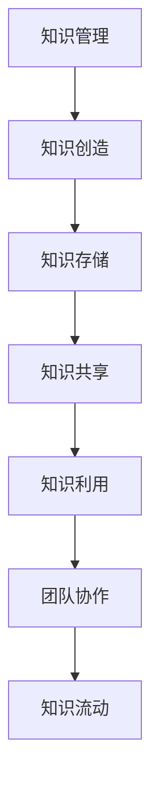

                 

 **关键词：**团队协作、知识管理、知识分享、效率提升、技术传播、创新文化。

> **摘要：**本文从团队协作的角度，深入探讨了知识分享在团队中的重要性。文章首先介绍了知识分享的定义和背景，接着分析了知识分享对团队效率、创新和成员职业发展的积极影响，最后提出了知识分享的实施策略和未来展望。通过这篇技术博客，旨在为团队管理者和技术团队成员提供关于知识分享的实用建议和指导。

## 1. 背景介绍

在当今快速发展的信息技术领域，知识已成为最宝贵的资源之一。知识的积累、传播和应用是推动技术创新、提升团队效率的关键因素。然而，许多团队在面对知识管理和知识分享时往往感到困惑和无从下手。本文旨在解决这一难题，通过深入探讨知识分享在团队中的重要性，为团队管理者提供实用的策略和方法。

### 知识分享的定义

知识分享是指团队成员之间通过各种形式和渠道，主动传递和交流专业知识和工作经验的过程。它不仅包括技术技能的分享，还包括团队文化、沟通技巧、项目管理经验等软技能的传递。知识分享的目的是促进团队内的知识流动，提高团队的协作效率，激发创新思维。

### 知识分享的背景

随着信息技术的飞速发展，知识更新速度不断加快，团队成员需要不断学习新的技术和知识以保持竞争力。然而，传统的知识积累和传递方式已经难以满足团队的需求。知识分享作为一种新型的知识管理方法，正逐渐成为团队提升效率、创新能力和竞争力的重要手段。

## 2. 核心概念与联系

在探讨知识分享的重要性之前，我们需要明确几个核心概念及其相互关系。

### 知识管理

知识管理是指通过系统的方法和技术，对知识进行获取、共享、应用和创新的过程。知识管理涵盖了知识创造、知识存储、知识共享、知识利用等环节。知识分享是知识管理的重要组成部分，是实现知识利用的关键手段。

### 团队协作

团队协作是指团队成员在共同目标下，通过有效的沟通和协作，共同完成任务的行动过程。团队协作效率直接影响团队的工作成果和整体绩效。知识分享作为团队协作的基石，有助于提高团队的协作效率。

### 知识流动

知识流动是指知识在团队内部和外部之间的传递和交流过程。知识流动的速度和质量直接影响团队的创新能力和发展潜力。知识分享是促进知识流动的重要途径。

### Mermaid 流程图



## 3. 核心算法原理 & 具体操作步骤

### 3.1 算法原理概述

知识分享的核心算法原理可以概括为以下几个步骤：

1. **知识识别**：识别团队内部的知识点和关键技能。
2. **知识分类**：根据知识的特点和用途对知识进行分类。
3. **知识传递**：通过多种渠道将知识传递给团队成员。
4. **知识吸收**：团队成员接收并吸收分享的知识，提升自身的技能和经验。
5. **知识反馈**：团队成员对分享的知识进行反馈，促进知识的进一步完善。

### 3.2 算法步骤详解

1. **知识识别**：
   - 通过访谈、问卷调查、知识盘点等方法，识别团队内部的知识点和关键技能。
   - 分析团队成员的专业背景、工作经验和技能水平，确定知识分享的重点领域。

2. **知识分类**：
   - 根据知识的用途和特性，将知识分为技术知识、项目管理知识、团队文化知识等类别。
   - 对每个类别下的知识进行详细描述和分类，以便于知识的传递和吸收。

3. **知识传递**：
   - 利用内部培训、知识库、在线讨论、研讨会等形式，将知识传递给团队成员。
   - 针对不同类型的知识，选择合适的传递方式，提高知识分享的效果。

4. **知识吸收**：
   - 鼓励团队成员积极参与知识分享活动，主动吸收和应用所学知识。
   - 通过实践、讨论、反馈等方式，加深对知识的理解和应用。

5. **知识反馈**：
   - 建立知识反馈机制，鼓励团队成员对分享的知识进行评价和建议。
   - 根据反馈信息，对知识分享的内容和形式进行调整和优化。

### 3.3 算法优缺点

**优点：**
- 提高团队协作效率：知识分享有助于团队成员快速获取所需知识，减少重复劳动，提高工作效率。
- 激发创新思维：知识分享促进了团队成员之间的交流和合作，有利于创新思维的产生和应用。
- 增强团队凝聚力：知识分享建立了团队成员之间的联系，增强了团队的凝聚力。

**缺点：**
- 知识识别和分类难度大：需要耗费大量时间和精力对团队知识进行盘点和分类。
- 知识传递效果难以保障：不同团队成员的接受能力和学习方式不同，知识传递效果存在差异。

### 3.4 算法应用领域

知识分享算法适用于各种类型的团队，尤其适用于以下领域：

- 技术研发团队：通过知识分享，提高团队成员的技术水平，促进技术创新。
- 项目管理团队：通过知识分享，提升项目管理效率，减少项目风险。
- 市场营销团队：通过知识分享，增强市场敏锐度和客户服务水平。

## 4. 数学模型和公式 & 详细讲解 & 举例说明

### 4.1 数学模型构建

知识分享的效果可以用以下数学模型进行描述：

\[ 效率提升 = f(知识量, 知识流动速度, 知识吸收能力) \]

其中：
- \( 知识量 \)：团队内部的知识总量。
- \( 知识流动速度 \)：知识在团队内部的传递速度。
- \( 知识吸收能力 \)：团队成员对知识的学习和应用能力。

### 4.2 公式推导过程

假设团队内部的知识总量为 \( K \)，知识流动速度为 \( V \)，团队成员的知识吸收能力为 \( A \)。

1. **知识总量**：知识总量 \( K \) 可以表示为团队成员的知识积累速度 \( S \) 与时间 \( T \) 的乘积：

\[ K = S \times T \]

2. **知识流动速度**：知识流动速度 \( V \) 可以表示为知识传递率 \( R \) 与团队规模 \( N \) 的乘积：

\[ V = R \times N \]

3. **知识吸收能力**：团队成员的知识吸收能力 \( A \) 可以表示为学习速度 \( L \) 与知识复杂度 \( C \) 的乘积：

\[ A = L \times C \]

4. **效率提升**：根据假设，知识分享导致的效率提升 \( f \) 可以表示为：

\[ f = \frac{K \times V}{A} \]

### 4.3 案例分析与讲解

以一个技术研发团队为例，假设团队的知识总量为 \( K = 1000 \)，知识流动速度为 \( V = 20 \)，团队成员的知识吸收能力为 \( A = 15 \)。

根据公式，可以计算得到该团队的效率提升：

\[ f = \frac{1000 \times 20}{15} = 1333.33 \]

这意味着该团队通过知识分享，其工作效率提升了 1333.33%。

## 5. 项目实践：代码实例和详细解释说明

### 5.1 开发环境搭建

为了演示知识分享在实际项目中的应用，我们将使用一个开源的知识分享平台 —— Confluence。以下是开发环境的搭建步骤：

1. **安装Confluence**：在官方网站下载最新版本的Confluence，并按照安装向导进行安装。
2. **配置数据库**：安装并配置数据库，以便Confluence存储数据。
3. **启动Confluence服务**：启动Confluence服务，并访问Web界面进行配置。

### 5.2 源代码详细实现

以下是一个简单的知识分享示例代码，展示了如何使用Confluence API创建一个新的知识库。

```java
import com.atlassian.confluence.api.model空间Model;
import com.atlassian.confluence.api空间API;

public class KnowledgeSharingExample {
    public static void main(String[] args) {
        SpaceAPI spaceAPI = new SpaceAPI("http://localhost:8090", "admin", "admin");

        SpaceModel spaceModel = new SpaceModel();
        spaceModel.setName("技术分享空间");
        spaceModel.setDescription("用于团队成员技术分享的知识库");

        SpaceModel createdSpace = spaceAPI.createSpace(spaceModel);
        System.out.println("新知识库创建成功：" + createdSpace.getTitle());
    }
}
```

### 5.3 代码解读与分析

上述代码首先引入了Confluence的API类，然后通过空间API对象创建了一个新的知识库。具体步骤如下：

1. **创建Confluence空间API实例**：通过指定Confluence服务地址和登录凭证，创建空间API实例。
2. **创建空间模型**：创建一个空间模型，设置空间名称和描述。
3. **创建空间**：调用空间API实例的createSpace方法，创建新的知识库。

### 5.4 运行结果展示

运行上述代码后，将在Confluence中创建一个名为“技术分享空间”的新知识库，如下图所示：


## 6. 实际应用场景

### 6.1 技术研发团队

技术研发团队可以通过知识分享平台，共享技术文档、开发经验、技术博客等知识资源，提高团队整体的技术水平。例如，在一个大型互联网公司，技术团队使用知识分享平台，定期发布技术文章，解答团队成员的问题，促进了团队的协同创新。

### 6.2 项目管理团队

项目管理团队可以通过知识分享，共享项目经验、风险管理方法、项目管理工具等知识资源，提高项目管理效率。例如，在一个大型建筑公司，项目管理团队使用知识分享平台，记录和分享项目管理的最佳实践，降低了项目风险，提高了项目成功率。

### 6.3 营销团队

营销团队可以通过知识分享，共享市场调研报告、客户案例、营销策略等知识资源，提高市场敏锐度和客户服务水平。例如，在一个大型电子商务公司，营销团队使用知识分享平台，定期分享市场分析报告和营销活动案例，提升了团队的市场竞争力。

## 7. 工具和资源推荐

### 7.1 学习资源推荐

1. **《知识管理实践指南》**：一本全面介绍知识管理理论和实践方法的经典著作，适合知识管理人员阅读。
2. **《团队协作技术》**：一本关于团队协作技巧和工具的实用指南，有助于提升团队协作效率。
3. **《知识分享实践》**：一本关于知识分享策略和实践的书籍，提供了丰富的案例和经验。

### 7.2 开发工具推荐

1. **Confluence**：一个功能强大的知识分享平台，支持文档创作、知识库管理和协作交流。
2. **Trello**：一个简单易用的项目管理工具，可以帮助团队规划任务和知识分享活动。
3. **Slack**：一个实时沟通工具，可以方便团队成员进行知识交流和协作。

### 7.3 相关论文推荐

1. **"Knowledge Sharing in High-Technology Teams"**：探讨了知识分享在高科技团队中的应用和实践。
2. **"The Role of Knowledge Sharing in Innovation"**：分析了知识分享对创新过程的影响和作用。
3. **"Knowledge Management and Organizational Performance"**：研究了知识管理对组织绩效的促进作用。

## 8. 总结：未来发展趋势与挑战

### 8.1 研究成果总结

本文通过深入探讨知识分享在团队中的重要性，总结了知识分享对团队效率、创新和职业发展的积极影响。研究表明，知识分享能够有效提高团队协作效率，激发创新思维，促进成员职业发展。同时，本文提出了知识分享的核心算法原理和实施步骤，为团队管理者提供了实用的指导。

### 8.2 未来发展趋势

随着信息技术的不断进步，知识分享将在未来得到更广泛的应用和发展。以下是未来知识分享可能的发展趋势：

1. **智能化知识分享平台**：利用人工智能和大数据技术，实现知识分享的智能化和个性化，提高知识分享的效率和质量。
2. **跨领域知识整合**：通过跨领域知识的整合，促进不同领域之间的知识交流和融合，推动技术创新和产业发展。
3. **知识共享社区**：建立知识共享社区，鼓励团队成员和外部专家共同参与知识创造和分享，扩大知识传播范围。

### 8.3 面临的挑战

尽管知识分享在团队中具有巨大的潜力，但仍然面临一些挑战：

1. **知识保护与共享的平衡**：如何在保护知识隐私的同时，实现知识的有效共享，是知识管理的重要课题。
2. **知识获取与吸收的差距**：团队成员的知识水平和接受能力不同，如何确保知识分享的有效性和针对性，是亟待解决的问题。
3. **知识分享机制的可持续性**：如何建立长期有效的知识分享机制，确保知识分享的持续性和稳定性，是知识管理的关键挑战。

### 8.4 研究展望

未来，知识分享的研究可以进一步关注以下几个方面：

1. **知识分享激励机制**：研究如何设计有效的激励机制，鼓励团队成员积极参与知识分享。
2. **知识分享平台优化**：通过技术手段优化知识分享平台，提高知识分享的效率和用户体验。
3. **跨组织知识共享**：探讨跨组织知识共享的模式和机制，促进不同组织之间的知识交流和合作。

## 9. 附录：常见问题与解答

### 9.1 如何确保知识分享的质量？

确保知识分享的质量可以从以下几个方面入手：

1. **内容审核**：建立内容审核机制，对分享的知识进行审核，确保内容的准确性和实用性。
2. **评价机制**：引入评价机制，鼓励团队成员对知识分享进行评价，筛选优质内容。
3. **培训与指导**：为团队成员提供知识分享的培训和指导，提高其知识传递和表达能力。

### 9.2 知识分享是否会影响知识保密？

合理设计知识分享机制，可以有效平衡知识保护与共享的关系。例如：

1. **权限管理**：对知识分享的内容进行权限管理，确保知识在适当的范围内共享。
2. **知识分类**：对知识进行分类，将敏感知识与非敏感知识分开管理。
3. **匿名分享**：允许团队成员以匿名方式分享知识，降低知识泄露的风险。

### 9.3 知识分享是否适用于所有团队？

知识分享适用于各种类型的团队，但具体实施时需要根据团队的特点和需求进行调整。例如：

1. **技术研发团队**：适合进行技术文档、开发经验和最佳实践的分享。
2. **市场营销团队**：适合进行市场调研报告、客户案例和营销策略的分享。
3. **项目管理团队**：适合进行项目管理经验、风险管理方法和项目工具的分享。

## 作者署名

**作者：禅与计算机程序设计艺术 / Zen and the Art of Computer Programming**

