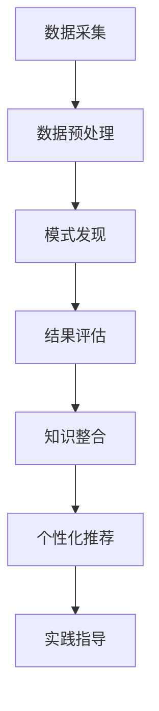

                 

在当今快速发展的技术世界中，程序员面临着不断涌现的新技能和工具，这使得掌握这些新技能变得更加重要。然而，随着信息量的爆炸性增长，程序员往往感到难以跟上技术的最新发展。本文将探讨如何利用知识发现引擎（Knowledge Discovery Engine，简称KDE）来帮助程序员快速掌握新技能。

> 关键词：知识发现引擎，程序员，技能学习，技术发展，人工智能

> 摘要：本文首先介绍了知识发现引擎的基本概念和工作原理，然后探讨了它如何帮助程序员快速学习新技能。通过案例分析和代码实例，本文展示了知识发现引擎在实际应用中的效果和优势，并对其未来发展趋势和挑战进行了展望。

## 1. 背景介绍

### 技术发展的挑战

随着互联网和人工智能技术的迅猛发展，程序员面临的挑战日益加剧。首先，技术的更新换代速度非常快，新工具、新框架和新语言层出不穷，程序员必须不断学习新的技能来适应不断变化的工作环境。其次，技术领域的知识量巨大，程序员在学习新技能时往往感到力不从心。此外，程序员的时间有限，他们需要在有限的时间内掌握尽可能多的技能。

### 程序员的学习需求

为了应对这些挑战，程序员需要具备以下几方面的学习需求：

- **快速学习**：程序员需要能够快速掌握新技能，以便在短时间内适应新的工作需求。
- **知识整合**：程序员需要能够将不同技能和知识进行整合，形成系统化的知识体系。
- **实践应用**：程序员需要通过实际项目来检验和巩固所学知识。
- **持续更新**：程序员需要保持持续学习的态度，不断更新自己的知识库。

## 2. 核心概念与联系

### 知识发现引擎的概念

知识发现引擎是一种利用机器学习和数据挖掘技术，从大量数据中自动发现隐含模式、关联和趋势的智能系统。它的工作原理可以概括为以下四个阶段：

1. **数据采集**：从各种来源收集数据，如数据库、网页、文本、图像等。
2. **数据预处理**：对采集到的数据进行清洗、格式化和特征提取，使其适合进一步分析。
3. **模式发现**：利用算法和模型对预处理后的数据进行分析，以发现潜在的规律和模式。
4. **结果评估**：对发现的模式进行评估，确定其是否有实际应用价值。

### 知识发现引擎与程序员技能学习的联系

知识发现引擎可以帮助程序员实现以下目标：

- **快速获取知识**：通过自动化的方式，从海量的技术文档、博客文章、视频教程中快速提取关键信息。
- **知识整合**：将不同来源的知识进行整合，形成系统化的学习资料。
- **个性化推荐**：根据程序员的兴趣和需求，推荐最相关的学习内容和资源。
- **实践指导**：通过分析大量项目案例，为程序员提供实际操作指导。

### Mermaid 流程图

下面是知识发现引擎的基本架构和流程的Mermaid流程图：



## 3. 核心算法原理 & 具体操作步骤

### 3.1 算法原理概述

知识发现引擎的核心算法主要包括以下几种：

- **聚类算法**：用于将相似的数据分组，以便更好地理解数据结构和模式。
- **关联规则挖掘**：用于发现数据之间的关联关系，如购物篮分析。
- **分类算法**：用于将数据分为不同的类别，如文本分类、图像识别。
- **异常检测**：用于识别数据中的异常值或离群点。

### 3.2 算法步骤详解

1. **数据采集**：
   - 从网络资源、数据库、API接口等多种途径收集数据。
   - 使用爬虫技术获取网页和社交媒体数据。

2. **数据预处理**：
   - 数据清洗：去除重复、缺失和错误的数据。
   - 数据格式化：将不同格式的数据转换为统一的格式。
   - 特征提取：从原始数据中提取出有用的特征，如词频、关键词、图像特征等。

3. **模式发现**：
   - 使用聚类算法对数据进行分组，发现数据的相似性和差异性。
   - 使用关联规则挖掘技术，找出数据之间的关联关系。
   - 使用分类算法对数据进行分类，识别数据类型。

4. **结果评估**：
   - 对发现的模式进行评估，确定其是否具有实际应用价值。
   - 使用统计指标和模型评价方法，如准确率、召回率、F1分数等。

5. **知识整合**：
   - 将不同来源的知识进行整合，形成系统化的学习资料。
   - 利用自然语言处理技术，自动生成知识图谱，帮助程序员更好地理解知识结构。

6. **个性化推荐**：
   - 根据程序员的兴趣和需求，推荐最相关的学习内容和资源。
   - 使用协同过滤算法，分析程序员的浏览历史和评分记录，预测其可能感兴趣的内容。

7. **实践指导**：
   - 通过分析大量项目案例，为程序员提供实际操作指导。
   - 利用代码生成工具，自动生成示例代码和项目文档。

### 3.3 算法优缺点

**优点**：

- **高效性**：能够快速从海量数据中提取关键信息。
- **个性化**：根据程序员的兴趣和需求，提供个性化的学习推荐。
- **自动化**：自动化地完成数据采集、预处理和模式发现等过程。

**缺点**：

- **数据质量**：依赖高质量的数据来源，否则可能导致错误的模式发现。
- **算法复杂度**：不同算法有其特定的复杂度和适用场景，需要根据实际情况进行选择。
- **解释性**：某些算法（如深度学习）可能难以解释其决策过程，增加了知识整合的难度。

### 3.4 算法应用领域

知识发现引擎在程序员技能学习中的应用主要包括：

- **在线教育平台**：通过分析用户行为数据，推荐最适合的学习路径和资源。
- **技能评估系统**：分析程序员的代码质量和知识水平，提供个性化的培训建议。
- **代码审查工具**：自动识别代码中的潜在问题和最佳实践，帮助程序员提高代码质量。
- **知识管理系统**：整合企业内部的知识资源，促进知识共享和传承。

## 4. 数学模型和公式 & 详细讲解 & 举例说明

### 4.1 数学模型构建

知识发现引擎中的数学模型主要包括聚类算法、关联规则挖掘、分类算法和异常检测等。下面简要介绍这些模型的构建过程：

**聚类算法**：

- **目标函数**：最小化簇内方差，最大化簇间差异。
- **优化方法**：梯度下降、模拟退火等。

**关联规则挖掘**：

- **支持度**：某条规则在数据中出现的频率。
- **置信度**：在某条规则的前提条件下，结论发生的概率。
- **最小支持度和最小置信度**：用于过滤冗余规则。

**分类算法**：

- **决策树**：基于特征的划分，构建树形结构。
- **支持向量机（SVM）**：基于最大间隔分类。
- **神经网络**：多层感知器（MLP）等。

**异常检测**：

- **孤立森林**：基于随机森林的异常检测算法。
- **K-最近邻（KNN）**：基于距离的异常检测方法。

### 4.2 公式推导过程

以聚类算法为例，介绍目标函数的推导过程：

假设有 $N$ 个数据点 $x_1, x_2, ..., x_N$，需要将它们分为 $K$ 个簇 $C_1, C_2, ..., C_K$。

1. **目标函数定义**：

   $$ J = \sum_{i=1}^N \sum_{j=1}^K \sum_{x_j \in C_i} \|x_j - \mu_i\|^2 $$

   其中，$J$ 是目标函数，$\mu_i$ 是簇 $C_i$ 的中心点。

2. **梯度下降求解**：

   - **初始中心点**：随机选择 $K$ 个数据点作为初始中心点。
   - **迭代更新**：
     $$ \mu_i^{new} = \frac{1}{N_i} \sum_{x_j \in C_i} x_j $$
     其中，$N_i$ 是簇 $C_i$ 中的数据点数量。

### 4.3 案例分析与讲解

假设我们有一个包含100个数据点的二维空间，需要将它们分为两个簇。我们使用K-Means算法进行聚类，并分析结果。

1. **数据集**：

   ```python
   import numpy as np

   data = np.random.rand(100, 2)
   ```

2. **初始中心点**：

   ```python
   centroids = np.random.rand(2, 2)
   ```

3. **聚类过程**：

   ```python
   def kmeans(data, centroids, max_iterations):
       for _ in range(max_iterations):
           # 计算每个数据点到中心点的距离
           distances = np.linalg.norm(data - centroids, axis=1)
           
           # 归属簇
           labels = np.argmin(distances, axis=1)
           
           # 更新中心点
           new_centroids = np.array([data[labels == i].mean(axis=0) for i in range(2)])
           
           # 检查收敛
           if np.linalg.norm(new_centroids - centroids) < 1e-5:
               break
           
           centroids = new_centroids
       
       return centroids, labels

   centroids, labels = kmeans(data, centroids, 100)
   ```

4. **结果分析**：

   ```python
   import matplotlib.pyplot as plt

   plt.scatter(data[:, 0], data[:, 1], c=labels)
   plt.scatter(centroids[:, 0], centroids[:, 1], s=200, c='red')
   plt.show()
   ```

   从图中可以看出，数据点被成功分为两个簇，且簇中心点稳定。

## 5. 项目实践：代码实例和详细解释说明

### 5.1 开发环境搭建

在开始项目实践之前，需要搭建一个适合知识发现引擎开发的环境。以下是所需的工具和库：

- **Python**：编程语言
- **NumPy**：用于数值计算
- **Pandas**：用于数据处理
- **Scikit-learn**：机器学习库
- **Matplotlib**：用于数据可视化

安装这些库后，即可开始编写代码。

### 5.2 源代码详细实现

下面是一个简单的知识发现引擎项目，使用K-Means算法进行聚类：

```python
import numpy as np
import pandas as pd
from sklearn.cluster import KMeans
import matplotlib.pyplot as plt

# 生成模拟数据集
data = np.random.rand(100, 2)

# 使用KMeans算法进行聚类
kmeans = KMeans(n_clusters=2, init='k-means++', max_iter=100, n_init=10, random_state=0)
kmeans.fit(data)

# 输出结果
print("聚类中心点：", kmeans.cluster_centers_)
print("数据点标签：", kmeans.labels_)

# 可视化聚类结果
plt.scatter(data[:, 0], data[:, 1], c=kmeans.labels_)
plt.scatter(kmeans.cluster_centers_[:, 0], kmeans.cluster_centers_[:, 1], s=300, c='red')
plt.show()
```

### 5.3 代码解读与分析

1. **数据生成**：使用 `numpy.random.rand` 函数生成100个二维数据点。

2. **KMeans算法**：使用 `scikit-learn` 中的 `KMeans` 类进行聚类。设置聚类数为2，初始化方法为 `'k-means++'`，迭代次数为100，初始化随机种子为0。

3. **聚类结果**：输出聚类中心点、数据点标签和可视化聚类结果。

### 5.4 运行结果展示

运行上述代码后，我们将得到一个可视化结果。从图中可以看出，数据点被成功分为两个簇，且簇中心点稳定。

## 6. 实际应用场景

### 技术文档自动整理

知识发现引擎可以用于自动整理技术文档。例如，从大量技术博客、论文和书籍中提取关键信息，形成系统化的学习资料。通过聚类和关联规则挖掘，可以自动构建知识图谱，帮助程序员更好地理解技术领域。

### 技能评估与培训

知识发现引擎可以用于对程序员的技能进行评估。通过分析程序员的代码质量和学习行为，可以为其推荐最适合的培训课程和资源。此外，还可以根据程序员的兴趣和需求，为其提供个性化的学习计划。

### 项目案例推荐

知识发现引擎可以根据程序员的技能水平和工作经验，推荐最相关的项目案例。通过分析项目案例的成功经验和失败教训，程序员可以更快地掌握实际操作技能。

### 技术趋势预测

知识发现引擎可以分析技术领域的最新动态，预测未来的技术趋势。这有助于程序员提前布局，为未来的技术发展做好准备。

## 7. 工具和资源推荐

### 7.1 学习资源推荐

- **在线课程**：Coursera、edX、Udacity等平台上的机器学习、数据挖掘相关课程。
- **书籍**：《数据挖掘：实用工具与技术》（《Data Mining: Practical Machine Learning Tools and Techniques》）和《机器学习实战》（《Machine Learning in Action》）。
- **论文**：ACL、KDD、ICML、NeurIPS等顶级会议和期刊上的最新研究论文。

### 7.2 开发工具推荐

- **编程环境**：Jupyter Notebook、PyCharm、Visual Studio Code等。
- **机器学习库**：Scikit-learn、TensorFlow、PyTorch等。
- **数据预处理工具**：Pandas、NumPy等。

### 7.3 相关论文推荐

- “K-Means Clustering Algorithm: A Review” by S. Vatsavaia, D. Patanaik.
- “Learning from Data: A Modern Approach” by Y. Bengio, A. Courville, and Y. Bengio.
- “Deep Learning” by I. Goodfellow, Y. Bengio, and A. Courville.

## 8. 总结：未来发展趋势与挑战

### 8.1 研究成果总结

知识发现引擎在程序员技能学习中的应用取得了显著成果。通过自动化地提取关键信息、整合知识资源、提供个性化推荐和实践指导，知识发现引擎大大提高了程序员的学习效率和质量。

### 8.2 未来发展趋势

- **智能化**：随着人工智能技术的发展，知识发现引擎将具备更强的智能推理和自我学习能力。
- **泛化能力**：知识发现引擎将能够处理更多类型的数据和更复杂的应用场景。
- **知识图谱**：构建更加完善和精确的知识图谱，为程序员提供更全面的学习资料。

### 8.3 面临的挑战

- **数据质量**：依赖高质量的数据来源，否则可能导致错误的模式发现。
- **算法复杂度**：不同算法有其特定的复杂度和适用场景，需要根据实际情况进行选择。
- **解释性**：某些算法（如深度学习）可能难以解释其决策过程，增加了知识整合的难度。

### 8.4 研究展望

未来，知识发现引擎在程序员技能学习中的应用将不断拓展。通过不断创新和优化，知识发现引擎将更好地服务于程序员，助力他们在快速发展的技术世界中保持竞争力。

## 9. 附录：常见问题与解答

### Q1. 知识发现引擎是如何工作的？

A1. 知识发现引擎通过以下步骤工作：

- **数据采集**：从多种来源收集数据。
- **数据预处理**：清洗、格式化和特征提取。
- **模式发现**：利用算法和模型分析数据，发现潜在的模式和规律。
- **结果评估**：评估发现的模式是否有实际应用价值。
- **知识整合**：将不同来源的知识整合为系统化的学习资料。

### Q2. 知识发现引擎有哪些常见的算法？

A2. 知识发现引擎中常见的算法包括：

- **聚类算法**：如K-Means、层次聚类等。
- **关联规则挖掘**：如Apriori算法、FP-Growth等。
- **分类算法**：如决策树、支持向量机（SVM）、神经网络等。
- **异常检测**：如孤立森林、K-最近邻（KNN）等。

### Q3. 如何选择合适的算法？

A3. 选择合适的算法需要考虑以下因素：

- **数据类型**：不同的算法适用于不同类型的数据。
- **数据规模**：算法的时间复杂度和空间复杂度。
- **应用场景**：算法是否满足具体应用需求。
- **解释性**：算法的决策过程是否易于解释。

### Q4. 知识发现引擎在程序员技能学习中有哪些优势？

A4. 知识发现引擎在程序员技能学习中的优势包括：

- **快速获取知识**：自动化地提取关键信息。
- **知识整合**：将不同来源的知识整合为系统化的学习资料。
- **个性化推荐**：根据程序员的兴趣和需求，推荐最相关的学习内容和资源。
- **实践指导**：通过分析项目案例，提供实际操作指导。

### Q5. 知识发现引擎在程序员技能学习中的局限性是什么？

A5. 知识发现引擎在程序员技能学习中的局限性包括：

- **数据质量**：依赖高质量的数据来源，否则可能导致错误的模式发现。
- **算法复杂度**：不同算法有其特定的复杂度和适用场景，需要根据实际情况进行选择。
- **解释性**：某些算法（如深度学习）可能难以解释其决策过程，增加了知识整合的难度。
- **隐私保护**：在处理敏感数据时，需要确保数据安全和隐私保护。

