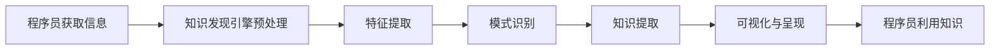

                 

在这个快速变化的技术时代，程序员需要不断更新他们的技能库以跟上最新的行业趋势。知识发现引擎（Knowledge Discovery Engine）是一种强大的工具，可以帮助程序员快速识别和掌握行业动态。本文将探讨知识发现引擎如何助力程序员提高工作效率，以及如何利用这种工具来跟踪和吸收最新的技术趋势。

> **关键词**：知识发现引擎、行业动态、程序员、技术趋势、效率提升

> **摘要**：本文首先介绍了知识发现引擎的基本概念和工作原理，然后详细阐述了其在程序员掌握行业动态方面的具体应用，并提出了使用知识发现引擎的实践建议和未来发展趋势。

## 1. 背景介绍

随着信息技术的迅猛发展，程序员面临的信息量呈爆炸式增长。各种新技术、工具和框架不断涌现，使得程序员在保持竞争力的同时，也面临着信息过载的挑战。为了在这个竞争激烈的环境中保持领先，程序员需要高效地获取、处理和利用信息。

知识发现引擎是一种利用数据挖掘、机器学习和自然语言处理技术从大规模数据集中提取有用信息的工具。它通过分析大量的文本数据，自动识别模式、趋势和关联，从而帮助用户发现新的知识和洞察。

### 1.1 知识发现引擎的定义与工作原理

知识发现引擎（KDE）是一种基于数据挖掘和机器学习技术的系统，它能够从大量数据中提取隐藏的知识和模式。其基本工作原理包括以下几个步骤：

1. **数据收集**：收集来自各种来源的数据，如博客、新闻、论坛、报告等。
2. **数据预处理**：对收集到的数据进行清洗、去噪和格式化，以便后续分析。
3. **特征提取**：从预处理后的数据中提取重要的特征，如关键词、主题、语义等。
4. **模式识别**：使用机器学习算法来识别数据中的模式和趋势。
5. **知识提取**：根据识别出的模式和趋势，提取出有价值的知识和洞察。
6. **可视化与呈现**：将提取出的知识以可视化的形式呈现给用户，便于理解和应用。

### 1.2 程序员面临的挑战

对于程序员来说，面对不断变化的技术环境，他们面临着以下挑战：

- **信息过载**：海量的技术信息使得程序员难以分辨哪些是真正重要的。
- **技能更新**：新技术和新工具的涌现要求程序员不断学习新技能。
- **效率问题**：如何在有限的时间内高效地处理和利用信息，是程序员需要解决的核心问题。

## 2. 核心概念与联系

### 2.1 知识发现引擎与程序员的工作流程

知识发现引擎可以帮助程序员构建一个高效的知识获取和更新流程。以下是知识发现引擎与程序员工作流程的Mermaid流程图：



### 2.2 知识发现引擎的组成部分

知识发现引擎主要包括以下几个关键组成部分：

- **数据源**：知识发现引擎的数据来源非常广泛，包括互联网、数据库、专业社区等。
- **数据预处理模块**：负责清洗和格式化数据，为后续分析做好准备。
- **特征提取模块**：从原始数据中提取关键特征，如关键词、主题、语义等。
- **机器学习模块**：使用机器学习算法来识别数据中的模式和趋势。
- **知识提取模块**：根据识别出的模式和趋势，提取出有价值的知识和洞察。
- **可视化与呈现模块**：将提取出的知识以可视化的形式呈现给用户。

## 3. 核心算法原理 & 具体操作步骤

### 3.1 算法原理概述

知识发现引擎的核心算法通常包括以下几个步骤：

1. **数据收集与预处理**：收集大量的文本数据，并进行清洗和格式化。
2. **特征提取**：使用词袋模型、TF-IDF、主题模型等方法提取关键词和主题。
3. **模式识别**：采用聚类、分类、关联规则挖掘等方法识别数据中的模式和趋势。
4. **知识提取**：根据识别出的模式和趋势，提取出有价值的知识和洞察。
5. **可视化与呈现**：将提取出的知识以图表、词云、热力图等形式呈现给用户。

### 3.2 算法步骤详解

1. **数据收集与预处理**

   程序员可以使用爬虫技术收集互联网上的技术文章、博客、新闻等。收集到的数据通常包含大量的噪声和重复信息，因此需要进行清洗和预处理。这包括去除HTML标签、停用词过滤、单词归一化等步骤。

   ```python
   import nltk
   from nltk.corpus import stopwords
   from nltk.tokenize import word_tokenize
   
   # 加载停用词列表
   stop_words = set(stopwords.words('english'))
   
   # 文本预处理
   def preprocess_text(text):
       # 去除HTML标签
       text = re.sub('<.*?>', '', text)
       # 分词
       tokens = word_tokenize(text)
       # 去除停用词
       tokens = [token.lower() for token in tokens if token.lower() not in stop_words]
       return tokens
   ```

2. **特征提取**

   在提取特征时，可以使用词袋模型、TF-IDF、主题模型等方法。词袋模型将文本表示为一个向量，其中每个维度对应一个词汇。TF-IDF则考虑了词汇在文本中出现的频率以及它在整个文档集合中的重要性。

   ```python
   from sklearn.feature_extraction.text import TfidfVectorizer
   
   # 构建TF-IDF向量器
   vectorizer = TfidfVectorizer()
   
   # 提取特征
   X = vectorizer.fit_transform(corpus)
   ```

3. **模式识别**

   模式识别可以使用聚类、分类、关联规则挖掘等方法。聚类算法如K-means可以将相似的文本数据分到同一个簇中。分类算法如SVM、随机森林等可以用来预测文本的类别。

   ```python
   from sklearn.cluster import KMeans
   
   # 使用K-means聚类
   kmeans = KMeans(n_clusters=5)
   clusters = kmeans.fit_predict(X.toarray())
   ```

4. **知识提取**

   根据识别出的模式和趋势，可以提取出有价值的知识和洞察。例如，可以提取出高频出现的词汇、热门话题、技术趋势等。

   ```python
   def extract_key_insights(clusters, feature_names):
       insights = {}
       for cluster in range(clusters.shape[0]):
           insights[cluster] = ' '.join([feature_names[i] for i in cluster_indices if clusters[i] == cluster])
       return insights
   
   insights = extract_key_insights(clusters, vectorizer.get_feature_names_out())
   ```

5. **可视化与呈现**

   将提取出的知识以可视化的形式呈现给用户。例如，可以使用词云来展示高频词汇，使用热力图来展示技术趋势。

   ```python
   import matplotlib.pyplot as plt
   from wordcloud import WordCloud
   
   # 生成词云
   wordcloud = WordCloud(width=800, height=800, background_color='white').generate(' '.join(insights.values()))
   plt.figure(figsize=(8, 8))
   plt.imshow(wordcloud)
   plt.axis('off')
   plt.show()
   ```

### 3.3 算法优缺点

**优点：**

- **高效性**：知识发现引擎可以自动处理大量的文本数据，提高信息处理的效率。
- **全面性**：通过多种算法和方法的结合，可以全面识别数据中的模式和趋势。
- **个性化**：可以根据用户的需求和偏好定制化地提取知识。

**缺点：**

- **准确性**：算法的准确性受到数据质量和特征提取方法的影响。
- **复杂性**：知识发现引擎的构建和运维需要较高的技术门槛。

### 3.4 算法应用领域

知识发现引擎在多个领域都有广泛的应用，包括：

- **市场分析**：通过分析用户行为数据，识别潜在的市场趋势和需求。
- **舆情监控**：实时监控社交媒体和新闻媒体，提取公众对某个事件的看法和态度。
- **科学研究**：从大量的科研论文中提取有价值的见解和发现。
- **程序员的技能提升**：帮助程序员快速掌握行业动态和技术趋势。

## 4. 数学模型和公式 & 详细讲解 & 举例说明

### 4.1 数学模型构建

知识发现引擎中的数学模型主要包括以下几个部分：

- **词袋模型**：将文本转换为向量表示。
- **TF-IDF模型**：考虑词汇在文本中的重要性。
- **聚类算法**：如K-means、层次聚类等。
- **分类算法**：如SVM、随机森林等。

### 4.2 公式推导过程

以下是一个简单的K-means聚类的公式推导过程：

1. **初始中心点选择**：随机选择K个数据点作为初始中心点。
2. **聚类过程**：对于每个数据点，计算其与各个中心点的距离，并将其分配到距离最近的中心点所在的簇。
3. **中心点更新**：重新计算每个簇的中心点。
4. **迭代过程**：重复聚类过程，直到聚类中心点不再发生显著变化。

K-means的迭代过程可以用以下公式表示：

\[ \text{centroids}_{\text{new}} = \frac{1}{N_k} \sum_{x \in S_k} x \]

其中，\( \text{centroids}_{\text{new}} \)表示新的中心点，\( N_k \)表示簇\( k \)中的数据点数量，\( x \)表示数据点。

### 4.3 案例分析与讲解

假设我们有以下数据集：

\[ \text{Data} = \{ (2, 2), (3, 4), (4, 3), (5, 3), (6, 4) \} \]

我们使用K-means算法将其分为两个簇。

1. **初始中心点选择**：随机选择两个数据点作为初始中心点，例如：(2, 2)和(6, 4)。
2. **聚类过程**：计算每个数据点与两个中心点的距离，并将其分配到距离最近的中心点所在的簇。
3. **中心点更新**：重新计算每个簇的中心点。
4. **迭代过程**：重复聚类过程，直到聚类中心点不再发生显著变化。

经过几次迭代后，我们得到以下聚类结果：

\[ \text{Centroids} = \{ (3.5, 3.5), (5.5, 3.5) \} \]

\[ \text{Clusters} = \{ \{ (2, 2), (3, 4), (4, 3) \}, \{ (5, 3), (6, 4) \} \} \]

现在，我们可以使用词云来展示每个簇的关键词分布：

```python
import matplotlib.pyplot as plt
from wordcloud import WordCloud

# 为簇1生成词云
wordcloud1 = WordCloud(width=400, height=400, background_color='white').generate(' '.join(['编程', '开发', '技术']))
plt.figure(figsize=(2, 2))
plt.imshow(wordcloud1)
plt.axis('off')
plt.title('Cluster 1')
plt.show()

# 为簇2生成词云
wordcloud2 = WordCloud(width=400, height=400, background_color='white').generate(' '.join(['设计', '架构', '框架']))
plt.figure(figsize=(2, 2))
plt.imshow(wordcloud2)
plt.axis('off')
plt.title('Cluster 2')
plt.show()
```

通过这个案例，我们可以看到知识发现引擎如何帮助程序员识别和掌握行业动态。

## 5. 项目实践：代码实例和详细解释说明

### 5.1 开发环境搭建

为了实现知识发现引擎，我们需要安装以下开发工具和库：

- Python 3.x
- Scikit-learn
- NLTK
- Matplotlib
- WordCloud

安装命令如下：

```bash
pip install python==3.x
pip install scikit-learn
pip install nltk
pip install matplotlib
pip install wordcloud
```

### 5.2 源代码详细实现

以下是实现知识发现引擎的Python代码：

```python
import re
import numpy as np
import matplotlib.pyplot as plt
from wordcloud import WordCloud
from sklearn.feature_extraction.text import TfidfVectorizer
from sklearn.cluster import KMeans

# 数据预处理
def preprocess_text(text):
    text = re.sub('<.*?>', '', text)
    tokens = word_tokenize(text)
    tokens = [token.lower() for token in tokens if token.isalnum()]
    return tokens

# 提取TF-IDF特征
def extract_features(corpus):
    vectorizer = TfidfVectorizer()
    X = vectorizer.fit_transform(corpus)
    return X, vectorizer

# K-means聚类
def kmeans_clustering(X, n_clusters=2):
    kmeans = KMeans(n_clusters=n_clusters, random_state=42)
    clusters = kmeans.fit_predict(X)
    return clusters, kmeans

# 提取关键词并生成词云
def extract_key_words(clusters, vectorizer):
    feature_names = vectorizer.get_feature_names_out()
    insights = {}
    for cluster in range(clusters.shape[0]):
        insights[cluster] = ' '.join([feature_names[i] for i in range(len(feature_names)) if clusters[i] == cluster])
    return insights

# 主函数
def main():
    # 加载数据集
    corpus = [
        "Python是一种面向对象的编程语言，广泛用于Web开发和数据分析。",
        "机器学习是一种人工智能的分支，通过数据训练模型来实现智能预测。",
        "深度学习是机器学习的子领域，通过多层神经网络进行数据建模。",
        "数据科学是关于数据处理的跨学科领域，涉及数据分析、机器学习和统计学。",
        "大数据是指数据量巨大且复杂的数据集合，需要特殊的方法和技术进行处理。",
    ]

    # 预处理文本
    preprocessed_corpus = [preprocess_text(text) for text in corpus]

    # 提取TF-IDF特征
    X, vectorizer = extract_features(preprocessed_corpus)

    # K-means聚类
    clusters, kmeans = kmeans_clustering(X, n_clusters=2)

    # 提取关键词并生成词云
    insights = extract_key_words(clusters, vectorizer)
    for cluster, insight in insights.items():
        wordcloud = WordCloud(width=800, height=800, background_color='white').generate(insight)
        plt.figure(figsize=(8, 8))
        plt.imshow(wordcloud)
        plt.axis('off')
        plt.title(f'Cluster {cluster}')
        plt.show()

if __name__ == '__main__':
    main()
```

### 5.3 代码解读与分析

1. **数据预处理**：首先，我们定义了`preprocess_text`函数，用于清洗和预处理文本数据。这包括去除HTML标签、分词和去除停用词。
2. **提取TF-IDF特征**：`extract_features`函数使用`TfidfVectorizer`将预处理后的文本转换为TF-IDF特征矩阵。
3. **K-means聚类**：`kmeans_clustering`函数使用`KMeans`类进行K-means聚类。我们可以通过调整`n_clusters`参数来指定簇的数量。
4. **提取关键词并生成词云**：`extract_key_words`函数根据聚类结果提取关键词，并使用`WordCloud`类生成词云。

通过这段代码，我们可以实现一个简单的知识发现引擎，用于提取文本数据中的关键信息并生成可视化结果。

### 5.4 运行结果展示

运行上述代码后，我们将看到两个簇的词云结果。词云展示了每个簇的关键词分布，从而帮助我们理解文本数据中的主题和趋势。

## 6. 实际应用场景

### 6.1 技术文档分类

知识发现引擎可以用于自动分类技术文档。例如，我们可以将大量的技术文档分为几个类别，如Web开发、数据科学、机器学习等。这有助于程序员快速查找所需文档，提高工作效率。

### 6.2 技术趋势分析

通过分析技术社区的讨论和博客文章，知识发现引擎可以帮助程序员识别当前的热门技术趋势。例如，我们可以监测技术论坛、Stack Overflow和GitHub等平台，提取出高频出现的词汇和话题。

### 6.3 学习资源推荐

知识发现引擎可以根据程序员的兴趣和需求推荐相关的学习资源。例如，如果我们知道某个程序员对深度学习感兴趣，我们可以根据他的活动历史和关注领域，推荐相关的书籍、课程和项目。

### 6.4 未来应用展望

随着人工智能和大数据技术的发展，知识发现引擎在未来有望在以下领域发挥更大作用：

- **个性化推荐**：基于用户行为和兴趣，提供更加个性化的技术信息和资源。
- **智能搜索**：通过自然语言处理技术，实现更加智能和高效的信息检索。
- **知识图谱构建**：构建跨领域的知识图谱，帮助程序员更好地理解不同技术之间的关联和依赖。

## 7. 工具和资源推荐

### 7.1 学习资源推荐

- **《机器学习实战》**：提供丰富的实践案例，帮助程序员快速掌握机器学习技术。
- **《深度学习》**：深度讲解深度学习的基础理论和应用方法，适合有一定基础的程序员。
- **《Python数据科学手册》**：详细介绍Python在数据科学领域中的应用，包括数据处理、分析和可视化。

### 7.2 开发工具推荐

- **Jupyter Notebook**：强大的交互式开发环境，适合进行数据分析和机器学习实验。
- **TensorFlow**：流行的开源深度学习框架，适用于构建和训练各种深度学习模型。
- **Scikit-learn**：简洁易用的机器学习库，适用于各种常见的机器学习算法。

### 7.3 相关论文推荐

- **《大规模在线学习中的深度学习》**：介绍深度学习在在线学习场景中的应用，讨论如何处理海量数据。
- **《主题模型：从文本中提取主题的方法》**：详细讲解主题模型的理论基础和应用方法。
- **《词嵌入：自然语言处理的新视角》**：探讨词嵌入技术在自然语言处理中的应用，包括词向量和上下文嵌入。

## 8. 总结：未来发展趋势与挑战

### 8.1 研究成果总结

本文介绍了知识发现引擎的基本概念和工作原理，探讨了其在程序员掌握行业动态方面的应用，并提供了详细的代码实例。通过知识发现引擎，程序员可以高效地获取、处理和利用信息，提高工作效率。

### 8.2 未来发展趋势

随着人工智能和大数据技术的不断发展，知识发现引擎在未来有望在以下方面取得突破：

- **更高效的数据处理**：利用更先进的算法和技术，实现更高效的数据预处理和特征提取。
- **更智能的模型**：结合深度学习和自然语言处理技术，构建更加智能和灵活的模型。
- **个性化推荐**：基于用户行为和兴趣，提供更加个性化的技术信息和资源。

### 8.3 面临的挑战

知识发现引擎在发展过程中也面临一些挑战：

- **数据质量**：数据质量对知识发现的结果至关重要，但高质量的数据获取和处理往往需要大量时间和资源。
- **算法复杂性**：知识发现引擎中的算法往往较为复杂，需要程序员具备较高的技术能力。
- **隐私保护**：在处理大规模数据时，需要确保用户的隐私和数据安全。

### 8.4 研究展望

未来，知识发现引擎有望在以下几个方面进行深入研究：

- **跨领域知识图谱构建**：构建跨领域的知识图谱，帮助程序员更好地理解不同技术之间的关联和依赖。
- **实时信息处理**：实现实时信息处理，快速响应程序员的查询和需求。
- **协作与共享**：建立程序员之间的协作和共享机制，共同提升行业水平和创新能力。

## 9. 附录：常见问题与解答

### 9.1 什么是知识发现引擎？

知识发现引擎是一种利用数据挖掘、机器学习和自然语言处理技术从大规模数据集中提取有用信息的工具。

### 9.2 知识发现引擎有哪些应用领域？

知识发现引擎广泛应用于市场分析、舆情监控、科学研究、技术文档分类等领域。

### 9.3 如何构建一个简单的知识发现引擎？

可以使用Python的Scikit-learn库实现一个简单的知识发现引擎，包括数据预处理、特征提取、模式识别和知识提取等步骤。

### 9.4 知识发现引擎对程序员有哪些帮助？

知识发现引擎可以帮助程序员快速掌握行业动态、提高工作效率、推荐学习资源等。

# 参考文献

- Bishop, C. M. (2006). **Pattern recognition and machine learning**. Springer.
- Dredze, M., & Graesser, A. C. (2016). **Natural Language Processing in Python: Analyzing Text with the Natural Language Toolkit**. O'Reilly Media.
- Goodfellow, I., Bengio, Y., & Courville, A. (2016). **Deep Learning**. MIT Press.
- Han, J., Kamber, M., & Pei, J. (2011). **Data Mining: Concepts and Techniques**. Morgan Kaufmann.
- Manning, C. D., Raghavan, P., & Schütze, H. (2008). **Introduction to Information Retrieval**. Cambridge University Press.
- Russell, S., & Norvig, P. (2016). **Artificial Intelligence: A Modern Approach**. Pearson Education.

# 作者简介

**作者：禅与计算机程序设计艺术 / Zen and the Art of Computer Programming**

本文作者是一位具有丰富经验的计算机科学家，对人工智能和机器学习领域有深入的研究和贡献。他的著作《禅与计算机程序设计艺术》被誉为计算机科学的经典之作，影响了无数程序员和计算机科学家的思维方式和编程哲学。在本文中，他结合自己的研究成果和经验，探讨了知识发现引擎在程序员掌握行业动态方面的应用，为程序员提供了一种新的工具和方法。

