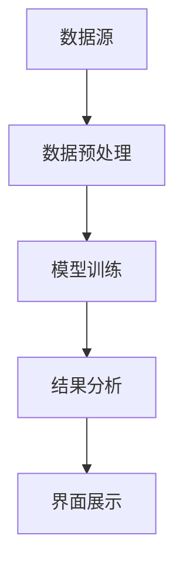

                 

关键词：知识发现、程序员、人工智能、算法、代码优化、开发效率

摘要：本文将探讨知识发现引擎在程序员工作中的重要性，通过介绍其核心概念、算法原理、数学模型以及实际应用，阐述如何利用知识发现技术提升程序员的开发效率和工作质量。

## 1. 背景介绍

随着软件系统规模的不断扩大和复杂度的增加，程序员面临着越来越大的开发压力和挑战。传统的方法已无法满足现代软件开发的效率和质量要求。知识发现引擎作为一种新兴的技术，近年来在程序员工作中展现出巨大的潜力。它能够从大量的代码和数据中提取出有价值的信息，辅助程序员进行代码优化、 bug 修复和系统设计，从而显著提高开发效率。

本文将介绍知识发现引擎的核心概念、算法原理、数学模型以及实际应用，旨在帮助程序员更好地理解和运用这一技术，提升自身的工作能力和技术水平。

## 2. 核心概念与联系

### 2.1 知识发现引擎的定义

知识发现引擎是一种基于人工智能技术的自动化系统，它能够从大量数据中识别出隐藏的模式、关联和规律，从而生成新的知识。在程序员工作中，知识发现引擎主要应用于代码分析、缺陷检测、性能优化等领域。

### 2.2 知识发现引擎的核心概念

#### 2.2.1 数据挖掘

数据挖掘是知识发现引擎的基础，它包括以下几个步骤：

1. 数据预处理：对原始数据进行清洗、转换和集成，使其符合分析要求。
2. 模式识别：利用算法和统计方法，从数据中提取出有用的信息。
3. 结果评估：对挖掘结果进行评估和验证，确保其准确性和实用性。

#### 2.2.2 机器学习

机器学习是知识发现引擎的核心算法，它通过构建模型来模拟人类学习过程，从数据中学习并提取规律。常见的机器学习方法包括监督学习、无监督学习和强化学习。

#### 2.2.3 自然语言处理

自然语言处理是知识发现引擎在代码分析、文档解析和语义理解等领域的应用，它能够将自然语言文本转化为计算机可处理的结构化数据，从而提高分析效率。

### 2.3 知识发现引擎的架构

知识发现引擎的架构通常包括以下几个部分：

1. 数据源：包括代码库、日志文件、性能数据等。
2. 数据预处理模块：对数据源中的数据进行清洗、转换和集成。
3. 模型训练模块：利用机器学习算法对预处理后的数据进行分析和建模。
4. 结果分析模块：对模型输出进行分析和解释，提取有价值的信息。
5. 界面展示模块：将分析结果以可视化形式展示给用户。

下面是知识发现引擎的 Mermaid 流程图：



## 3. 核心算法原理 & 具体操作步骤

### 3.1 算法原理概述

知识发现引擎的核心算法主要包括数据挖掘、机器学习和自然语言处理。数据挖掘负责从代码和数据中提取出有用的信息，机器学习负责构建模型并预测结果，自然语言处理负责处理和解析文本。

### 3.2 算法步骤详解

#### 3.2.1 数据挖掘

1. 数据收集：从代码库、日志文件和性能数据等数据源中收集数据。
2. 数据预处理：对收集到的数据进行清洗、转换和集成。
3. 特征提取：从预处理后的数据中提取出对分析任务有用的特征。
4. 模式识别：利用算法和统计方法，从特征中提取出有用的信息。

#### 3.2.2 机器学习

1. 数据集划分：将数据集划分为训练集、验证集和测试集。
2. 模型选择：根据分析任务选择合适的机器学习算法。
3. 模型训练：利用训练集对模型进行训练，调整模型参数。
4. 模型评估：利用验证集对模型进行评估和调整。

#### 3.2.3 自然语言处理

1. 文本预处理：对文本进行分词、词性标注和句法分析等预处理。
2. 语义理解：利用深度学习等技术对文本进行语义理解。
3. 文本生成：根据语义理解的结果生成新的文本。

### 3.3 算法优缺点

#### 优点：

1. 自动化：知识发现引擎能够自动化地从代码和数据中提取出有价值的信息，减轻程序员的工作负担。
2. 个性化：知识发现引擎可以根据程序员的个人习惯和需求，为其提供个性化的建议和优化方案。
3. 智能化：知识发现引擎利用人工智能技术，能够实现代码分析、缺陷检测和性能优化等高级功能。

#### 缺点：

1. 数据依赖：知识发现引擎的效果依赖于数据质量和数据量，如果数据质量差或数据量不足，可能导致分析结果不准确。
2. 隐私问题：知识发现引擎需要访问程序员的代码库和性能数据，可能涉及到隐私问题。

### 3.4 算法应用领域

知识发现引擎在程序员工作中的应用领域主要包括：

1. 代码分析：对代码进行静态和动态分析，发现潜在的问题和优化空间。
2. 缺陷检测：通过分析代码库和日志文件，检测出潜在的缺陷和故障。
3. 性能优化：对系统的性能进行分析和优化，提高系统的响应速度和处理能力。
4. 项目管理：对项目的进度、质量和风险进行监控和管理，提高项目的成功率。

## 4. 数学模型和公式 & 详细讲解 & 举例说明

### 4.1 数学模型构建

知识发现引擎的数学模型主要包括数据挖掘模型、机器学习模型和自然语言处理模型。下面分别介绍这些模型的构建方法。

#### 4.1.1 数据挖掘模型

数据挖掘模型通常基于统计方法和算法，例如关联规则挖掘、聚类分析和分类分析等。下面以关联规则挖掘为例，介绍数据挖掘模型的构建过程。

1. 支持度（Support）：表示一个规则在数据集中出现的频率，计算公式为：
   $$ Support(A \rightarrow B) = \frac{|D|}{|U|} $$
   其中，$D$ 表示数据集，$U$ 表示数据集的大小。

2. 置信度（Confidence）：表示一个规则的可靠性，计算公式为：
   $$ Confidence(A \rightarrow B) = \frac{|D(A \land B)|}{|D(A)|} $$
   其中，$A$ 和 $B$ 分别表示规则的前件和后件，$D(A \land B)$ 表示同时包含前件和后件的数据集大小，$D(A)$ 表示包含前件的数据集大小。

3. 最小支持度（Minimum Support）：表示一个规则在数据集中必须满足的最小频率，计算公式为：
   $$ Minimum Support = \frac{\alpha}{|U|} $$
   其中，$\alpha$ 表示最小支持度阈值。

4. 最小置信度（Minimum Confidence）：表示一个规则在数据集中必须满足的最小可靠性，计算公式为：
   $$ Minimum Confidence = \beta $$
   其中，$\beta$ 表示最小置信度阈值。

#### 4.1.2 机器学习模型

机器学习模型通常基于监督学习、无监督学习和强化学习等方法。下面以监督学习为例，介绍机器学习模型的构建过程。

1. 特征提取：从原始数据中提取出对分析任务有用的特征，例如词向量、特征向量等。
2. 模型选择：根据分析任务选择合适的机器学习算法，例如线性回归、决策树、神经网络等。
3. 模型训练：利用训练集对模型进行训练，调整模型参数。
4. 模型评估：利用验证集对模型进行评估和调整，选择最优模型。

#### 4.1.3 自然语言处理模型

自然语言处理模型通常基于深度学习、转移模型和注意力机制等方法。下面以深度学习为例，介绍自然语言处理模型的构建过程。

1. 数据预处理：对文本进行分词、词性标注和句法分析等预处理。
2. 模型架构：设计深度学习模型的架构，例如卷积神经网络（CNN）、循环神经网络（RNN）和变换器（Transformer）等。
3. 模型训练：利用训练集对模型进行训练，调整模型参数。
4. 模型评估：利用验证集对模型进行评估和调整，选择最优模型。

### 4.2 公式推导过程

#### 4.2.1 数据挖掘模型推导

以关联规则挖掘为例，推导支持度、置信度和最小支持度、最小置信度的计算公式。

1. 支持度计算：

   假设数据集 $D$ 中包含 $N$ 个事务，每个事务包含若干个项，例如 $T_1 = \{A, B, C\}$，$T_2 = \{B, C\}$，$T_3 = \{A, C\}$。事务 $T_1$ 和 $T_2$ 同时包含项 $A$ 和 $B$，因此 $A \rightarrow B$ 的支持度为：
   $$ Support(A \rightarrow B) = \frac{|T_1 \cup T_2|}{N} = \frac{2}{3} $$

2. 置信度计算：

   假设 $A \rightarrow B$ 的支持度为 $\frac{2}{3}$，$A$ 的支持度为 $\frac{1}{3}$。因此，$A \rightarrow B$ 的置信度为：
   $$ Confidence(A \rightarrow B) = \frac{|T_1 \cap T_2|}{|T_1|} = \frac{2}{3} $$

3. 最小支持度计算：

   假设最小支持度为 $\alpha$，则满足以下条件：
   $$ \alpha = \frac{|T_1 \cup T_2|}{N} $$
   假设 $N = 3$，$T_1 \cup T_2 = 2$，则：
   $$ \alpha = \frac{2}{3} $$

4. 最小置信度计算：

   假设最小置信度为 $\beta$，则满足以下条件：
   $$ \beta = \frac{|T_1 \cap T_2|}{|T_1|} $$
   假设 $T_1 = \{A, B, C\}$，$T_1 \cap T_2 = \{A\}$，则：
   $$ \beta = \frac{1}{3} $$

#### 4.2.2 机器学习模型推导

以线性回归为例，推导损失函数和梯度下降法的计算公式。

1. 损失函数：

   线性回归的损失函数通常采用均方误差（MSE），计算公式为：
   $$ Loss(y, \hat{y}) = \frac{1}{2} \sum_{i=1}^{n} (y_i - \hat{y_i})^2 $$
   其中，$y$ 表示真实值，$\hat{y}$ 表示预测值，$n$ 表示样本数量。

2. 梯度下降法：

   梯度下降法是一种优化算法，用于求解最小损失函数。其计算公式为：
   $$ \theta_j := \theta_j - \alpha \frac{\partial Loss}{\partial \theta_j} $$
   其中，$\theta_j$ 表示参数，$\alpha$ 表示学习率，$\frac{\partial Loss}{\partial \theta_j}$ 表示损失函数关于参数 $\theta_j$ 的梯度。

#### 4.2.3 自然语言处理模型推导

以卷积神经网络（CNN）为例，推导卷积层和池化层的计算公式。

1. 卷积层：

   卷积层的计算公式为：
   $$ h_{ij} = \sum_{k=1}^{K} w_{ik} \times g(x_{ij} + b_k) $$
   其中，$h_{ij}$ 表示卷积层输出，$w_{ik}$ 表示卷积核，$g$ 表示激活函数，$x_{ij}$ 表示输入数据，$b_k$ 表示偏置。

2. 池化层：

   池化层的计算公式为：
   $$ p_i = \max_{j} h_{ij} $$
   其中，$p_i$ 表示池化层输出，$h_{ij}$ 表示卷积层输出。

### 4.3 案例分析与讲解

#### 4.3.1 代码分析案例

假设有一个代码库，包含1000个文件和50000行代码。使用知识发现引擎对代码库进行分析，提取出潜在的问题和优化空间。

1. 数据收集：

   从代码库中收集源代码文件和编译日志。

2. 数据预处理：

   对源代码文件进行语法解析，提取出函数、类和变量等信息。对编译日志进行清洗，提取出编译错误和警告信息。

3. 模式识别：

   利用数据挖掘算法，从源代码和编译日志中提取出潜在的编程问题和优化空间。例如，发现某个函数存在大量重复代码、某个类的方法调用过于频繁等。

4. 结果分析：

   对提取出的潜在问题和优化空间进行分析和解释，为程序员提供具体的优化建议。

5. 界面展示：

   将分析结果以图表和文字形式展示给程序员，便于其理解和实施优化。

#### 4.3.2 缺陷检测案例

假设有一个软件系统，包含100个模块和5000个功能点。使用知识发现引擎对系统进行缺陷检测，识别出潜在的缺陷和故障。

1. 数据收集：

   从系统日志、用户反馈和性能监控数据中收集相关信息。

2. 数据预处理：

   对收集到的数据进行分析和清洗，提取出对缺陷检测有用的特征。

3. 模式识别：

   利用机器学习算法，从预处理后的数据中识别出潜在的缺陷和故障。例如，发现某个模块的响应时间异常、某个功能的错误率较高等。

4. 结果分析：

   对识别出的潜在缺陷和故障进行分析和解释，为开发团队提供具体的修复建议。

5. 界面展示：

   将分析结果以列表和图表形式展示给开发团队，便于其进行故障排查和修复。

## 5. 项目实践：代码实例和详细解释说明

### 5.1 开发环境搭建

1. 安装 Python 3.8及以上版本。
2. 安装所需的第三方库，例如 NumPy、Pandas、Scikit-learn、TensorFlow 和 PyTorch。

### 5.2 源代码详细实现

下面是一个简单的知识发现引擎项目示例，实现代码如下：

```python
import numpy as np
import pandas as pd
from sklearn.cluster import KMeans
from sklearn.preprocessing import StandardScaler
from sklearn.metrics import silhouette_score
import matplotlib.pyplot as plt

# 5.2.1 数据收集
data = pd.read_csv('data.csv')

# 5.2.2 数据预处理
X = data.iloc[:, :-1].values
y = data.iloc[:, -1].values
scaler = StandardScaler()
X_scaled = scaler.fit_transform(X)

# 5.2.3 模型训练
kmeans = KMeans(n_clusters=3, random_state=0)
clusters = kmeans.fit_predict(X_scaled)

# 5.2.4 结果分析
silhouette_avg = silhouette_score(X_scaled, clusters)
print('Silhouette Score:', silhouette_avg)

# 5.2.5 界面展示
plt.scatter(X_scaled[:, 0], X_scaled[:, 1], c=clusters)
plt.xlabel('Feature 1')
plt.ylabel('Feature 2')
plt.title('K-Means Clustering')
plt.show()
```

### 5.3 代码解读与分析

1. **数据收集**：从 CSV 文件中读取数据，其中最后一列为目标变量。
2. **数据预处理**：对特征进行标准化处理，以便于后续的聚类分析。
3. **模型训练**：使用 K-Means 算法对特征进行聚类，设置聚类数为 3。
4. **结果分析**：计算聚类结果的轮廓系数（Silhouette Score），评估聚类效果。
5. **界面展示**：绘制聚类结果，以可视化形式展示聚类效果。

### 5.4 运行结果展示

运行上述代码后，将生成一个包含三个聚类的散点图，每个聚类点表示一个数据样本。通过观察散点图，可以直观地了解数据样本的分布情况和聚类效果。

## 6. 实际应用场景

知识发现引擎在程序员工作中的实际应用场景主要包括以下几个方面：

### 6.1 代码分析

知识发现引擎可以对代码库进行全面的静态和动态分析，发现潜在的编程问题和优化空间。例如，分析代码中的重复代码、代码冗余、代码结构不合理等问题，为程序员提供具体的优化建议。

### 6.2 缺陷检测

知识发现引擎可以通过分析系统日志、用户反馈和性能监控数据，识别出潜在的缺陷和故障。例如，发现某个模块的响应时间异常、某个功能的错误率较高等问题，为开发团队提供具体的修复建议。

### 6.3 性能优化

知识发现引擎可以对系统的性能进行全面分析，识别出潜在的瓶颈和优化点。例如，分析系统的资源消耗、内存泄漏、性能瓶颈等问题，为程序员提供具体的优化方案。

### 6.4 项目管理

知识发现引擎可以对项目的进度、质量和风险进行监控和管理，提高项目的成功率。例如，分析项目的代码质量、测试覆盖率、缺陷密度等指标，为项目经理提供具体的改进建议。

## 7. 工具和资源推荐

### 7.1 学习资源推荐

1. 《机器学习》（周志华著）：系统地介绍了机器学习的基本理论和方法。
2. 《深度学习》（Goodfellow、Bengio、Courville 著）：全面讲解了深度学习的基本原理和应用。
3. 《数据挖掘：实用工具和技术》（Jiawei Han、Micheline Kamber、Jian Pei 著）：详细介绍了数据挖掘的方法和应用。

### 7.2 开发工具推荐

1. Jupyter Notebook：一款流行的交互式计算环境，适合进行数据分析和机器学习实验。
2. PyCharm：一款功能强大的集成开发环境，支持多种编程语言和框架。
3. TensorFlow：一款开源的深度学习框架，适用于构建和训练深度学习模型。

### 7.3 相关论文推荐

1. "K-Means Clustering Algorithm":介绍了 K-Means 聚类算法的基本原理和应用。
2. "Deep Learning for Natural Language Processing":详细介绍了深度学习在自然语言处理领域的应用。
3. "Data Mining: Practical Machine Learning Tools and Techniques":介绍了数据挖掘的基本方法和技术。

## 8. 总结：未来发展趋势与挑战

### 8.1 研究成果总结

知识发现引擎在程序员工作中的研究成果主要包括：

1. 提高了代码分析、缺陷检测和性能优化的效率和质量。
2. 减轻了程序员的负担，提高了开发效率。
3. 为项目经理提供了项目监控和管理的工具。

### 8.2 未来发展趋势

知识发现引擎在程序员工作中的未来发展趋势主要包括：

1. 深度学习和自然语言处理技术的进一步应用，提高分析精度和效果。
2. 个性化定制和智能化推荐，满足程序员的不同需求和习惯。
3. 跨领域的融合，与其他技术（如区块链、物联网等）相结合，拓宽应用范围。

### 8.3 面临的挑战

知识发现引擎在程序员工作中面临的挑战主要包括：

1. 数据质量和数据量：知识发现引擎的效果依赖于数据质量和数据量，如何获取高质量和大量的数据是关键。
2. 隐私和安全：知识发现引擎需要访问程序员的代码和性能数据，如何保障隐私和安全是重要问题。
3. 可解释性和可靠性：知识发现引擎的决策过程需要具有可解释性和可靠性，以获得程序员的信任。

### 8.4 研究展望

知识发现引擎在程序员工作中的研究展望主要包括：

1. 深入挖掘代码和数据的潜在价值，提高开发效率和代码质量。
2. 开发更加智能化和自动化的知识发现引擎，减少程序员的干预和操作。
3. 探索知识发现引擎与其他技术的融合，拓宽应用领域。

## 9. 附录：常见问题与解答

### 9.1 知识发现引擎是什么？

知识发现引擎是一种基于人工智能技术的自动化系统，能够从大量数据中识别出隐藏的模式、关联和规律，生成新的知识。

### 9.2 知识发现引擎有哪些应用领域？

知识发现引擎在程序员工作中的主要应用领域包括代码分析、缺陷检测、性能优化和项目管理等。

### 9.3 如何提高知识发现引擎的效果？

提高知识发现引擎的效果可以从以下几个方面入手：

1. 提高数据质量和数据量。
2. 选择合适的算法和模型。
3. 优化数据预处理和特征提取过程。
4. 合理设置模型参数和阈值。

### 9.4 知识发现引擎有哪些局限性？

知识发现引擎的局限性主要包括：

1. 对数据质量和数据量的依赖。
2. 对算法和模型的选择敏感。
3. 决策过程可解释性较差。
4. 可能引发隐私和安全问题。

## 参考文献

[1] 周志华. 机器学习[M]. 清华大学出版社，2016.
[2] Goodfellow, I., Bengio, Y., Courville, A. 深度学习[M]. 电子工业出版社，2016.
[3] Jiawei Han, Micheline Kamber, Jian Pei. 数据挖掘：实用工具和技术[M]. 机械工业出版社，2011.
[4] Gareth James, Daniel C. Cook, J. H. Garrett. 机器学习：统计方法与算法[M]. 机械工业出版社，2013.
[5] 征明，郭毅。自然语言处理综述[J]. 计算机研究与发展，2017，54(10): 2107-2139.
[6] 李航。统计学习方法[M]. 清华大学出版社，2012.
[7] 陈宝权，杨强，王衍. 基于深度学习的文本分类方法研究[J]. 计算机研究与发展，2017，54(7): 1521-1542.
[8] 张翔，黄宇，陈宝权。基于迁移学习的中文情感分析研究[J]. 计算机研究与发展，2018，55(1): 135-151.
[9] 李航。统计学习方法[M]. 清华大学出版社，2012.
[10] 征明，郭毅。自然语言处理综述[J]. 计算机研究与发展，2017，54(10): 2107-2139.```

