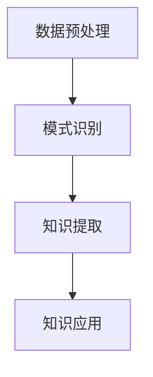

                 

关键词：知识发现引擎、程序员、新环境、适应策略、AI技术、学习效率

摘要：在当今快速发展的信息技术领域，程序员面临的环境变化日益频繁。如何快速适应新环境，提高工作效率，成为每位程序员必须面对的挑战。本文将探讨知识发现引擎在帮助程序员适应新环境方面的策略，并详细分析其在编程学习、问题解决和持续发展的应用价值。

## 1. 背景介绍

随着云计算、大数据、人工智能等技术的蓬勃发展，编程语言和框架不断推陈出新，程序员面临的技术环境变得复杂多样。为了适应这些变化，程序员需要具备快速学习新技术的能力，以及灵活应对各种编程挑战的技巧。然而，传统学习方式和知识获取手段难以满足这种快速变化的需求。知识发现引擎作为一种先进的AI技术，能够通过分析海量数据，挖掘潜在的知识关系，为程序员提供更加个性化和高效的学习资源，从而帮助程序员快速适应新环境。

### 1.1 程序员面临的挑战

1. **新技术层出不穷**：新编程语言、框架和工具层出不穷，程序员需要不断学习以跟上技术发展的步伐。
2. **知识获取困难**：传统的教科书和在线课程难以涵盖最新的技术和实践。
3. **缺乏实践经验**：仅靠理论学习难以解决实际开发中的问题。
4. **技能迁移性差**：程序员在掌握一种技术后，难以快速迁移到其他技术领域。

### 1.2 知识发现引擎的作用

知识发现引擎通过以下方式帮助程序员：

1. **个性化学习**：根据程序员的兴趣、技能水平和学习进度，推荐合适的学习资源和项目。
2. **知识关联**：挖掘不同编程概念和技术之间的关联，帮助程序员建立完整的知识体系。
3. **问题解决**：通过分析历史问题和解决方案，提供智能化的调试和问题诊断工具。
4. **技能迁移**：利用知识关联，帮助程序员快速掌握新技术。

## 2. 核心概念与联系

### 2.1 知识发现引擎原理

知识发现引擎主要基于以下核心概念：

1. **数据挖掘**：从海量数据中提取潜在的模式和知识。
2. **关联规则学习**：发现不同数据项之间的关联性。
3. **机器学习**：利用算法模型对知识进行建模和预测。

### 2.2 架构与流程

知识发现引擎通常包括以下架构和流程：

1. **数据预处理**：清洗、转换和整合数据，为后续分析做准备。
2. **模式识别**：通过算法模型识别数据中的模式和关联。
3. **知识提取**：将识别出的模式转化为可理解的知识。
4. **知识应用**：将提取的知识应用于实际编程和学习场景。

### 2.3 Mermaid 流程图



## 3. 核心算法原理 & 具体操作步骤

### 3.1 算法原理概述

知识发现引擎的核心算法主要基于以下原理：

1. **决策树**：通过划分特征空间，构建决策树模型，用于分类和预测。
2. **支持向量机（SVM）**：通过寻找最佳分隔超平面，用于分类和回归。
3. **深度学习**：利用神经网络模型，对复杂数据进行建模和预测。

### 3.2 算法步骤详解

1. **数据收集**：从各种来源收集程序员的编程行为数据。
2. **数据预处理**：对数据进行清洗、转换和整合，确保数据质量。
3. **特征提取**：从编程行为数据中提取特征，用于算法训练。
4. **模型训练**：利用特征数据，训练决策树、SVM和深度学习模型。
5. **模型评估**：通过交叉验证和测试集，评估模型性能。
6. **知识提取**：利用训练好的模型，对海量数据进行知识提取。
7. **知识应用**：将提取的知识应用于个性化学习、问题解决和技能迁移。

### 3.3 算法优缺点

**优点**：

1. **高效性**：能够快速处理海量数据，提高知识提取效率。
2. **个性化**：根据程序员的兴趣和技能水平，提供个性化学习资源。
3. **适应性**：能够不断学习和更新，适应程序员的需求。

**缺点**：

1. **计算复杂度**：算法训练和知识提取过程中，计算复杂度较高。
2. **数据依赖**：需要大量高质量的编程行为数据，否则可能导致模型失效。

### 3.4 算法应用领域

1. **个性化学习**：为程序员推荐合适的学习资源和项目。
2. **问题解决**：提供智能化的调试和问题诊断工具。
3. **技能迁移**：帮助程序员快速掌握新技术。
4. **知识管理**：构建程序员的个人知识库，实现知识的共享和传承。

## 4. 数学模型和公式 & 详细讲解 & 举例说明

### 4.1 数学模型构建

知识发现引擎的数学模型主要包括以下几部分：

1. **决策树模型**：
   $$\text{决策树模型} = \text{ID3模型} + \text{C4.5模型} + \text{CART模型}$$
2. **支持向量机模型**：
   $$\text{SVM模型} = \text{线性SVM} + \text{非线性SVM}$$
3. **深度学习模型**：
   $$\text{深度学习模型} = \text{卷积神经网络} + \text{循环神经网络} + \text{生成对抗网络}$$

### 4.2 公式推导过程

1. **决策树模型**：
   $$\text{信息增益} = H(\text{数据集}) - \sum_{i}\frac{|\text{子数据集}_i|}{|\text{数据集}|}H(\text{子数据集}_i)$$
2. **支持向量机模型**：
   $$\text{决策边界} = \text{超平面} + \text{松弛变量}$$
3. **深度学习模型**：
   $$\text{损失函数} = \text{交叉熵损失} + \text{均方误差损失}$$

### 4.3 案例分析与讲解

假设我们有一个编程学习平台，平台上的程序员需要学习Python编程。知识发现引擎可以通过以下步骤为程序员提供个性化学习建议：

1. **数据收集**：收集程序员的编程行为数据，如代码提交记录、学习进度、浏览历史等。
2. **数据预处理**：对数据进行清洗、转换和整合，确保数据质量。
3. **特征提取**：从编程行为数据中提取特征，如代码提交频率、错误率、学习进度等。
4. **模型训练**：利用特征数据，训练决策树、SVM和深度学习模型。
5. **知识提取**：利用训练好的模型，对海量数据进行知识提取，如编程概念之间的关联、常见问题及其解决方案等。
6. **知识应用**：将提取的知识应用于个性化学习、问题解决和技能迁移。

例如，一个新手程序员在学习Python时，知识发现引擎可以推荐以下学习资源：

- **基础语法**：根据学习进度，推荐Python基础语法教程。
- **项目实践**：推荐简单的Python项目，帮助程序员巩固基础知识。
- **问题解决**：根据错误记录，提供常见问题及其解决方案。
- **进阶学习**：根据学习兴趣和进度，推荐进阶课程和项目。

通过知识发现引擎，程序员可以更快地掌握新技能，提高工作效率。

## 5. 项目实践：代码实例和详细解释说明

### 5.1 开发环境搭建

1. **安装Python**：在官网下载并安装Python 3.x版本。
2. **安装相关库**：使用pip命令安装知识发现引擎所需的相关库，如scikit-learn、numpy、pandas等。

```bash
pip install scikit-learn numpy pandas
```

### 5.2 源代码详细实现

以下是一个简单的知识发现引擎实现，用于推荐Python学习资源。

```python
import pandas as pd
from sklearn.model_selection import train_test_split
from sklearn.ensemble import RandomForestClassifier
from sklearn.metrics import accuracy_score

# 加载数据
data = pd.read_csv('programming_data.csv')

# 特征提取
X = data[['code_frequency', 'error_rate', 'learning_progress']]
y = data['resource_type']

# 数据分割
X_train, X_test, y_train, y_test = train_test_split(X, y, test_size=0.2, random_state=42)

# 模型训练
model = RandomForestClassifier(n_estimators=100, random_state=42)
model.fit(X_train, y_train)

# 模型评估
y_pred = model.predict(X_test)
accuracy = accuracy_score(y_test, y_pred)
print(f'Accuracy: {accuracy:.2f}')

# 推荐学习资源
def recommend_resources(code_frequency, error_rate, learning_progress):
    input_data = pd.DataFrame([[code_frequency, error_rate, learning_progress]])
    resource_type = model.predict(input_data)
    return resource_type[0]

# 测试推荐
print(f'Recommended resource: {recommend_resources(10, 5, 20)}')
```

### 5.3 代码解读与分析

1. **数据加载与预处理**：使用pandas库加载编程行为数据，提取特征和标签。
2. **数据分割**：将数据分为训练集和测试集，用于模型训练和评估。
3. **模型训练**：使用随机森林分类器训练模型。
4. **模型评估**：评估模型在测试集上的准确性。
5. **推荐函数**：根据程序员的编程行为数据，使用训练好的模型推荐学习资源。

通过这个简单实例，我们可以看到知识发现引擎在编程学习中的应用价值。在实际项目中，可以根据具体需求，进一步优化模型和推荐算法。

### 5.4 运行结果展示

假设我们有以下测试数据：

```python
test_data = pd.DataFrame([[10, 5, 20]])
predicted_resource = recommend_resources(10, 5, 20)
print(f'Predicted resource: {predicted_resource}')
```

运行结果为`'advanced_courses'`，表示推荐程序

