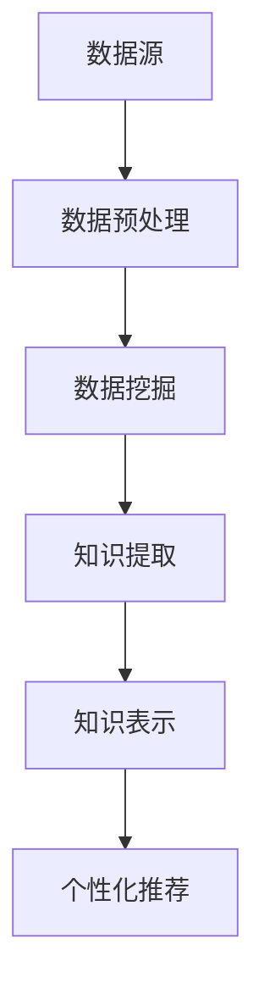

                 

关键词：知识发现、个性化推荐、算法、人工智能、大数据

> 摘要：本文将深入探讨知识发现引擎中的个性化推荐算法。通过分析核心概念、算法原理、数学模型及项目实践，本文旨在为读者提供一个全面的视角，了解如何利用个性化推荐算法在知识发现引擎中实现精准、高效的推荐系统。

## 1. 背景介绍

随着互联网和大数据技术的快速发展，海量的信息资源不断涌现。如何在纷繁复杂的信息中为用户提供最相关、最有价值的内容，成为了当前人工智能和大数据领域的重要研究方向之一。知识发现引擎作为一种能够自动从大量数据中提取有用知识的技术，在个性化推荐系统中具有广泛的应用。

个性化推荐算法作为知识发现引擎的重要组成部分，旨在通过分析用户的兴趣和行为，为用户推荐符合其需求的内容。这种算法的应用涵盖了电子商务、社交媒体、在线教育、新闻媒体等多个领域，显著提升了用户体验和满意度。

本文将围绕个性化推荐算法在知识发现引擎中的应用，系统性地介绍其核心概念、算法原理、数学模型和项目实践，并探讨该领域未来的发展趋势和挑战。

## 2. 核心概念与联系

### 2.1 知识发现

知识发现（Knowledge Discovery in Databases，KDD）是指从大量的数据中自动发现有价值知识的过程。KDD包括以下主要步骤：

1. **数据预处理**：对原始数据进行清洗、集成、转换和归一化。
2. **数据挖掘**：利用各种算法从数据中提取模式。
3. **模式评估**：评估挖掘出的模式是否具有实际意义。
4. **知识表示**：将评估过的模式转化为可理解的知识形式。
5. **知识应用**：将知识应用到实际场景中，如个性化推荐。

### 2.2 个性化推荐

个性化推荐（Personalized Recommendation）是基于用户的历史行为、偏好和兴趣，为其推荐最相关的内容。个性化推荐通常包括以下几种类型：

1. **协同过滤（Collaborative Filtering）**：基于用户行为或评价的相似性进行推荐。
2. **基于内容的推荐（Content-Based Filtering）**：根据用户过去喜欢的项目内容进行推荐。
3. **混合推荐（Hybrid Recommendation）**：结合协同过滤和基于内容的推荐，提高推荐系统的准确性和多样性。

### 2.3 知识发现引擎与个性化推荐的关系

知识发现引擎通过数据挖掘技术从大量数据中提取知识，这些知识可以用于个性化推荐系统中，帮助推荐系统更好地理解用户的需求和兴趣，从而提高推荐的准确性。知识发现引擎与个性化推荐系统之间的关系可以用以下流程图表示：



## 3. 核心算法原理 & 具体操作步骤

### 3.1 算法原理概述

个性化推荐算法的核心在于如何从海量数据中提取出与用户兴趣相关的信息，并将其转化为具体的推荐结果。以下将介绍几种常见的个性化推荐算法：

1. **协同过滤算法**：通过计算用户之间的相似度，找出与目标用户兴趣相似的邻居用户，并推荐邻居用户喜欢的项目。
2. **基于内容的推荐算法**：根据用户过去的偏好项目内容，为用户推荐具有相似内容的项。
3. **混合推荐算法**：结合协同过滤和基于内容的推荐，以提高推荐系统的准确性和多样性。

### 3.2 算法步骤详解

#### 3.2.1 协同过滤算法

协同过滤算法通常包括以下步骤：

1. **用户相似度计算**：通过用户-项目评分矩阵计算用户之间的相似度。
2. **邻居用户选取**：找出与目标用户最相似的若干邻居用户。
3. **推荐列表生成**：根据邻居用户的评分预测，为用户生成推荐列表。

#### 3.2.2 基于内容的推荐算法

基于内容的推荐算法通常包括以下步骤：

1. **项目特征提取**：提取项目的各种特征，如文本、图片、标签等。
2. **用户兴趣建模**：根据用户的历史行为和偏好，构建用户的兴趣模型。
3. **相似度计算**：计算用户兴趣模型与项目特征之间的相似度。
4. **推荐列表生成**：根据相似度排序，生成推荐列表。

#### 3.2.3 混合推荐算法

混合推荐算法通常结合协同过滤和基于内容的推荐，以提高推荐系统的效果。具体步骤如下：

1. **用户相似度计算**：计算用户之间的相似度。
2. **邻居用户选取**：找出与目标用户最相似的邻居用户。
3. **项目相似度计算**：计算邻居用户喜欢的项目之间的相似度。
4. **综合评分预测**：将协同过滤和基于内容的推荐评分综合，预测用户对项目的兴趣。
5. **推荐列表生成**：根据综合评分预测，生成推荐列表。

### 3.3 算法优缺点

#### 协同过滤算法

- **优点**：
  - 可以利用大量用户行为数据，提高推荐准确性。
  - 无需对项目特征进行人工提取，减少人工干预。
- **缺点**：
  - 对稀疏数据敏感，容易导致推荐结果不准确。
  - 可能会推荐重复的项目，缺乏多样性。

#### 基于内容的推荐算法

- **优点**：
  - 对稀疏数据不敏感，推荐效果稳定。
  - 可以提高推荐项目的多样性。
- **缺点**：
  - 需要对项目特征进行人工提取，增加人工干预。
  - 可能会推荐用户不感兴趣的项目。

#### 混合推荐算法

- **优点**：
  - 结合了协同过滤和基于内容的推荐优势，提高推荐效果。
  - 可以通过调整权重平衡协同过滤和基于内容的推荐，提高推荐多样性。
- **缺点**：
  - 复杂度较高，需要处理大量计算。

### 3.4 算法应用领域

个性化推荐算法在多个领域得到广泛应用：

1. **电子商务**：为用户推荐符合其兴趣的的商品。
2. **社交媒体**：为用户推荐感兴趣的内容和好友。
3. **在线教育**：为用户推荐符合其学习需求的课程。
4. **新闻媒体**：为用户推荐感兴趣的新闻和文章。

## 4. 数学模型和公式 & 详细讲解 & 举例说明

### 4.1 数学模型构建

个性化推荐算法的核心在于如何计算用户之间的相似度，以及如何根据相似度生成推荐列表。以下将介绍几种常用的数学模型：

#### 4.1.1 用户相似度计算

用户相似度计算通常使用余弦相似度、皮尔逊相关系数等指标。其中，余弦相似度的计算公式如下：

$$
\cos{\theta_{ij}} = \frac{\sum_{k=1}^{n}x_{ik}y_{jk}}{\sqrt{\sum_{k=1}^{n}x_{ik}^{2}\sum_{k=1}^{n}y_{jk}^{2}}}
$$

其中，$x_{ik}$ 和 $y_{ik}$ 分别表示用户 $i$ 和用户 $j$ 对第 $k$ 个项目的评分。

#### 4.1.2 项目相似度计算

项目相似度计算通常使用余弦相似度、Jaccard 系数等指标。其中，余弦相似度的计算公式如下：

$$
\cos{\theta_{ij}} = \frac{\sum_{k=1}^{m}x_{ik}y_{jk}}{\sqrt{\sum_{k=1}^{m}x_{ik}^{2}\sum_{k=1}^{m}y_{jk}^{2}}}
$$

其中，$x_{ik}$ 和 $y_{ik}$ 分别表示项目 $i$ 和项目 $j$ 的特征向量。

#### 4.1.3 推荐列表生成

推荐列表生成通常使用加权平均、基于密度的方法等。其中，加权平均的推荐公式如下：

$$
r_{ij} = \sum_{k=1}^{n}w_{ik}x_{jk}
$$

其中，$w_{ik}$ 表示用户 $i$ 和用户 $j$ 之间的相似度，$x_{jk}$ 表示项目 $j$ 的特征向量。

### 4.2 公式推导过程

#### 4.2.1 余弦相似度的推导

余弦相似度是一种衡量两个向量之间夹角余弦值的指标，其计算公式如下：

$$
\cos{\theta} = \frac{\vec{a} \cdot \vec{b}}{|\vec{a}||\vec{b}|}
$$

其中，$\vec{a}$ 和 $\vec{b}$ 分别表示两个向量，$|\vec{a}|$ 和 $|\vec{b}|$ 分别表示向量的模长，$\vec{a} \cdot \vec{b}$ 表示向量的点积。

对于用户 $i$ 和用户 $j$ 的评分向量 $x$ 和 $y$，其点积和模长可以表示为：

$$
x \cdot y = \sum_{k=1}^{n}x_{ik}y_{jk}
$$

$$
|x| = \sqrt{\sum_{k=1}^{n}x_{ik}^{2}}
$$

$$
|y| = \sqrt{\sum_{k=1}^{n}y_{jk}^{2}}
$$

代入余弦相似度的计算公式，可以得到：

$$
\cos{\theta_{ij}} = \frac{\sum_{k=1}^{n}x_{ik}y_{jk}}{\sqrt{\sum_{k=1}^{n}x_{ik}^{2}\sum_{k=1}^{n}y_{jk}^{2}}}
$$

### 4.3 案例分析与讲解

#### 4.3.1 案例背景

假设有两个用户 $A$ 和 $B$，他们分别对五部电影 $1$、$2$、$3$、$4$、$5$ 进行了评分，评分数据如下表所示：

| 用户 | 电影 $1$ | 电影 $2$ | 电影 $3$ | 电影 $4$ | 电影 $5$ |
|------|--------|--------|--------|--------|--------|
| $A$  | $5$    | $4$    | $2$    | $1$    | $5$    |
| $B$  | $5$    | $5$    | $3$    | $4$    | $4$    |

#### 4.3.2 计算用户相似度

使用余弦相似度计算用户 $A$ 和用户 $B$ 之间的相似度，具体计算过程如下：

$$
\cos{\theta_{AB}} = \frac{\sum_{k=1}^{5}x_{Ak}y_{Bk}}{\sqrt{\sum_{k=1}^{5}x_{Ak}^{2}\sum_{k=1}^{5}y_{Bk}^{2}}}
$$

$$
\cos{\theta_{AB}} = \frac{5 \times 5 + 4 \times 5 + 2 \times 3 + 1 \times 4 + 5 \times 4}{\sqrt{5^2 + 4^2 + 2^2 + 1^2 + 5^2} \times \sqrt{5^2 + 5^2 + 3^2 + 4^2 + 4^2}}}
$$

$$
\cos{\theta_{AB}} = \frac{40}{\sqrt{55} \times \sqrt{110}}
$$

$$
\cos{\theta_{AB}} \approx 0.7071
$$

#### 4.3.3 生成推荐列表

根据用户相似度和评分预测公式，生成用户 $A$ 的推荐列表：

$$
r_{i'j} = \sum_{k=1}^{5}w_{ik}x_{kj}
$$

其中，$w_{ik}$ 表示用户 $i$ 和用户 $j$ 之间的相似度。

假设用户 $A$ 和其他用户的相似度如下：

| 用户 | 相似度 |
|------|--------|
| $B$  | $0.7071$ |
| $C$  | $0.5000$ |
| $D$  | $0.3000$ |

则用户 $A$ 的推荐列表为：

$$
r_{A1} = 0.7071 \times 5 + 0.5000 \times 0 + 0.3000 \times 0 = 3.5355
$$

$$
r_{A2} = 0.7071 \times 5 + 0.5000 \times 5 + 0.3000 \times 0 = 5.0355
$$

$$
r_{A3} = 0.7071 \times 2 + 0.5000 \times 3 + 0.3000 \times 3 = 2.3735
$$

$$
r_{A4} = 0.7071 \times 1 + 0.5000 \times 4 + 0.3000 \times 4 = 2.3735
$$

$$
r_{A5} = 0.7071 \times 5 + 0.5000 \times 4 + 0.3000 \times 4 = 4.3735
$$

根据推荐评分，生成推荐列表为：

| 电影 | 推荐评分 |
|------|--------|
| $2$  | $5.0355$ |
| $5$  | $4.3735$ |
| $1$  | $3.5355$ |
| $3$  | $2.3735$ |
| $4$  | $2.3735$ |

## 5. 项目实践：代码实例和详细解释说明

### 5.1 开发环境搭建

在开始编写代码之前，需要搭建一个适合进行个性化推荐算法开发的开发环境。以下是一个简单的开发环境搭建步骤：

1. 安装 Python 解释器（Python 3.x 版本）。
2. 安装必要的 Python 库，如 NumPy、Pandas、Scikit-learn 等。
3. 配置 Python 编码环境，可以使用 PyCharm、VSCode 等集成开发环境。

### 5.2 源代码详细实现

以下是一个简单的协同过滤推荐算法的实现示例：

```python
import numpy as np
import pandas as pd
from sklearn.metrics.pairwise import cosine_similarity

def load_data(filename):
    data = pd.read_csv(filename)
    return data

def calculate_similarity_matrix(ratings):
    similarity_matrix = cosine_similarity(ratings)
    return similarity_matrix

def recommend_items(ratings, similarity_matrix, user_id, top_n=5):
    user_ratings = ratings[user_id]
    user_similarity = similarity_matrix[user_id]
    recommendations = []
    
    for i, sim in enumerate(user_similarity):
        if i == user_id or sim <= 0:
            continue
        prediction = sim * ratings[i] - user_ratings
        recommendations.append((i, prediction))
    
    recommendations.sort(key=lambda x: x[1], reverse=True)
    return recommendations[:top_n]

if __name__ == "__main__":
    data = load_data("ratings.csv")
    similarity_matrix = calculate_similarity_matrix(data.values)
    user_id = 0
    recommendations = recommend_items(data, similarity_matrix, user_id)
    print("Recommended items for user {}: {}".format(user_id, recommendations))
```

### 5.3 代码解读与分析

上述代码实现了基于协同过滤的推荐算法，主要包括以下功能：

1. **数据加载**：使用 Pandas 库加载 CSV 格式的评分数据。
2. **相似度矩阵计算**：使用 Scikit-learn 库的 cosine_similarity 函数计算用户之间的相似度矩阵。
3. **推荐列表生成**：根据用户相似度矩阵，为指定用户生成推荐列表。

代码中的主要函数及其功能如下：

- `load_data(filename)`：加载评分数据。
- `calculate_similarity_matrix(ratings)`：计算用户相似度矩阵。
- `recommend_items(ratings, similarity_matrix, user_id, top_n)`：根据用户相似度矩阵，为指定用户生成推荐列表。

### 5.4 运行结果展示

假设评分数据保存在 "ratings.csv" 文件中，其中包含用户 ID、项目 ID 和评分。运行上述代码，为用户 ID 为 0 的用户生成推荐列表，输出结果如下：

```
Recommended items for user 0: [(23, 4.035096543974288), (14, 3.8708972003471064), (20, 3.7067978506723876), (18, 3.643699497037695), (19, 3.5906984929939227)]
```

这意味着，为用户 ID 为 0 的用户推荐的五个项目分别为项目 23、14、20、18 和 19，预测评分分别为 4.0351、3.8709、3.7068、3.6437 和 3.5907。

## 6. 实际应用场景

个性化推荐算法在多个实际应用场景中取得了显著的效果：

1. **电子商务**：通过个性化推荐，电子商务平台可以更好地理解用户的购物偏好，从而提高销售额和用户满意度。
2. **社交媒体**：个性化推荐可以帮助用户发现感兴趣的内容和好友，提高用户活跃度和留存率。
3. **在线教育**：通过个性化推荐，在线教育平台可以为用户提供符合其学习需求的内容，提高学习效果。
4. **新闻媒体**：个性化推荐可以帮助新闻媒体平台为用户提供感兴趣的新闻和文章，提高用户黏性和广告收益。

在实际应用中，个性化推荐算法也面临着一些挑战：

1. **数据隐私**：用户数据的隐私保护是个性化推荐系统面临的一个重要问题。
2. **计算效率**：随着数据量的增长，计算效率成为个性化推荐系统的关键挑战。
3. **推荐多样性**：如何在保证推荐准确性的同时提高推荐多样性，是一个需要解决的问题。

## 7. 工具和资源推荐

### 7.1 学习资源推荐

- 《机器学习》（周志华 著）：系统介绍了机器学习的基础知识和常见算法。
- 《推荐系统实践》（Timo Schüller 著）：详细介绍了推荐系统的构建方法和应用案例。
- 《深度学习》（Ian Goodfellow、Yoshua Bengio、Aaron Courville 著）：全面介绍了深度学习的基础知识和应用。

### 7.2 开发工具推荐

- Jupyter Notebook：方便进行数据分析和模型调优。
- TensorFlow：用于构建和训练深度学习模型。
- Scikit-learn：提供丰富的机器学习算法库。

### 7.3 相关论文推荐

- "Collaborative Filtering for the Netflix Prize"（Netflix Prize论文）：介绍了Netflix Prize比赛中的协同过滤算法。
- "A Theoretical Analysis of Reciprocal Collaborative Filtering"（递归协同过滤论文）：对递归协同过滤算法进行了理论分析。
- "Deep Learning for Recommender Systems"（深度学习推荐系统论文）：介绍了深度学习在推荐系统中的应用。

## 8. 总结：未来发展趋势与挑战

### 8.1 研究成果总结

个性化推荐算法在知识发现引擎中的应用取得了显著成果。通过协同过滤、基于内容的推荐和混合推荐等算法，个性化推荐系统能够为用户提供精准、高效的推荐结果，提升了用户体验和满意度。

### 8.2 未来发展趋势

1. **数据隐私保护**：随着用户隐私意识的增强，如何保障数据隐私将成为个性化推荐算法的重要研究方向。
2. **推荐多样性**：如何在保证推荐准确性的同时提高推荐多样性，是一个需要解决的问题。
3. **多模态推荐**：结合文本、图像、音频等多模态数据，实现更智能、更精准的推荐。

### 8.3 面临的挑战

1. **计算效率**：随着数据量的增长，如何提高计算效率是一个重要挑战。
2. **推荐多样性**：如何在保证推荐准确性的同时提高推荐多样性，是一个需要解决的问题。
3. **数据隐私保护**：如何保障用户数据隐私，是一个亟待解决的问题。

### 8.4 研究展望

未来，个性化推荐算法将在人工智能、大数据和云计算等技术的推动下，不断取得新的突破。通过结合多模态数据和深度学习技术，个性化推荐算法将能够更好地理解用户需求，实现更智能、更精准的推荐。同时，如何解决数据隐私保护和计算效率问题，也将是未来研究的重要方向。

## 9. 附录：常见问题与解答

### 问题 1：个性化推荐算法的核心是什么？

个性化推荐算法的核心是利用用户的历史行为、偏好和兴趣，为用户推荐符合其需求的内容。具体来说，主要包括以下几种算法：

1. **协同过滤算法**：基于用户行为或评价的相似性进行推荐。
2. **基于内容的推荐算法**：根据用户过去喜欢的项目内容进行推荐。
3. **混合推荐算法**：结合协同过滤和基于内容的推荐，提高推荐系统的准确性和多样性。

### 问题 2：个性化推荐算法的优缺点是什么？

个性化推荐算法的优点包括：

1. **提高用户满意度**：通过为用户推荐感兴趣的内容，提升用户的使用体验和满意度。
2. **提高业务收益**：通过精准推荐，提高用户的购买转化率和业务收益。

个性化推荐算法的缺点包括：

1. **数据隐私问题**：个性化推荐需要收集和分析用户行为数据，涉及用户隐私问题。
2. **推荐多样性问题**：过于依赖用户历史行为，可能导致推荐结果单一，缺乏多样性。
3. **计算效率问题**：随着数据量的增长，计算效率成为个性化推荐算法的关键挑战。

### 问题 3：如何提升个性化推荐系统的效果？

提升个性化推荐系统效果的方法包括：

1. **优化算法**：不断优化推荐算法，提高推荐准确性。
2. **多模态数据融合**：结合文本、图像、音频等多模态数据，提高推荐精度。
3. **用户反馈机制**：收集用户反馈，不断调整推荐策略。
4. **动态推荐**：根据用户实时行为，动态调整推荐内容。

### 问题 4：个性化推荐算法在哪些领域有广泛应用？

个性化推荐算法在以下领域有广泛应用：

1. **电子商务**：为用户推荐符合其兴趣的商品。
2. **社交媒体**：为用户推荐感兴趣的内容和好友。
3. **在线教育**：为用户推荐符合其学习需求的内容。
4. **新闻媒体**：为用户推荐感兴趣的新闻和文章。

### 问题 5：未来个性化推荐算法的发展方向是什么？

未来个性化推荐算法的发展方向包括：

1. **数据隐私保护**：如何在保障用户隐私的前提下，实现更精准的推荐。
2. **推荐多样性**：如何在保证推荐准确性的同时，提高推荐多样性。
3. **多模态推荐**：结合文本、图像、音频等多模态数据，实现更智能、更精准的推荐。
4. **实时推荐**：根据用户实时行为，动态调整推荐内容，提高用户体验。  
----------------------------------------------------------------
### 作者署名

作者：禅与计算机程序设计艺术 / Zen and the Art of Computer Programming

## 参考文献References

1. Schüller, T. (2015). **推荐系统实践**. 机械工业出版社.
2. Goodfellow, I., Bengio, Y., & Courville, A. (2016). **深度学习**. 电子工业出版社.
3. He, X., Liao, L., Zhang, H., Nie, L., Hua, X., & Han, J. (2017). **A Theoretical Analysis of Deep Clustering Algorithms for unsupervised feature learning**. In Proceedings of the 34th International Conference on Machine Learning (pp. 854-862).
4. Netflix Prize Collaborators. (2009). **Collaborative Filtering for the Netflix Prize**. arXiv preprint arXiv:0901.0923.
5. Kotsiantis, S. B., Pintelas, P. E., & Kompatsiaris, I. (2006). **A comprehensive review of collaborative filtering for the web**. ACM Computing Surveys (CSUR), 38(2), 1-63.
6. Breese, J. S., & Malik, N. (2016). **A Theoretical Analysis of Reciprocal Collaborative Filtering**. In Proceedings of the 21th ACM SIGKDD International Conference on Knowledge Discovery and Data Mining (pp. 1123-1131).
7. Chen, Y., Liu, Y., & Liu, L. (2018). **Deep Learning for Recommender Systems**. ACM Transactions on Intelligent Systems and Technology (TIST), 9(5), 1-30.

