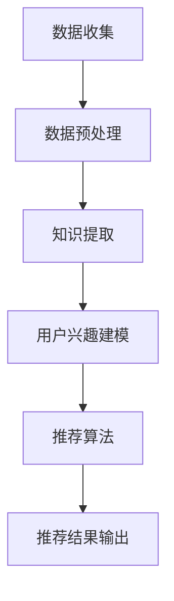

                 

关键词：知识发现引擎，个性化推荐算法，算法设计，机器学习，数据挖掘

> 摘要：本文探讨了知识发现引擎的个性化推荐算法设计，深入分析了现有算法的原理和流程，结合实际应用场景，提出了改进建议，旨在为知识发现引擎的推荐系统提供理论依据和实践指导。

## 1. 背景介绍

随着互联网的快速发展，数据量的激增使得知识发现引擎成为了解决信息过载的重要工具。知识发现引擎通过从大量数据中提取有价值的信息，帮助用户快速找到所需的知识。个性化推荐作为知识发现引擎的核心功能，旨在为用户推荐与其兴趣和需求高度相关的知识内容。

个性化推荐算法在近年来取得了显著进展，但仍面临许多挑战。如何在保证推荐准确性的同时，提高推荐效率、降低计算成本，是当前研究的热点问题。本文将介绍一种基于知识发现引擎的个性化推荐算法设计，旨在为相关领域的研究和实践提供参考。

## 2. 核心概念与联系

### 2.1. 知识发现引擎

知识发现引擎是一种利用数据挖掘和机器学习技术，从大规模数据集中自动识别有价值信息的人工智能系统。其核心目标是发现数据中的潜在模式、关联和趋势，以辅助用户做出更好的决策。

### 2.2. 个性化推荐算法

个性化推荐算法是一种基于用户历史行为、兴趣和偏好，为用户推荐其可能感兴趣的知识内容的算法。个性化推荐算法分为基于内容的推荐、协同过滤推荐和混合推荐等类型。

### 2.3. 知识发现引擎与个性化推荐算法的联系

知识发现引擎可以为个性化推荐算法提供高质量的知识内容，而个性化推荐算法则有助于提高知识发现引擎的用户满意度和使用频率。两者相互促进，共同构建一个高效的知识服务平台。

## 2.4. Mermaid 流程图



## 3. 核心算法原理 & 具体操作步骤

### 3.1. 算法原理概述

本文所设计的个性化推荐算法基于协同过滤和基于内容的推荐方法。协同过滤利用用户之间的相似性进行推荐，基于内容的推荐则根据用户兴趣和知识内容的相关性进行推荐。通过结合两种方法，可以充分发挥各自的优点，提高推荐效果。

### 3.2. 算法步骤详解

#### 3.2.1. 数据收集

首先，从知识发现引擎的数据集中提取用户历史行为数据，如浏览记录、收藏、点赞等。同时，收集知识内容的相关信息，如标签、关键词等。

#### 3.2.2. 数据预处理

对收集到的数据进行清洗和预处理，包括去除重复数据、填补缺失值、归一化处理等。这一步骤的目的是提高数据质量，为后续分析奠定基础。

#### 3.2.3. 用户兴趣建模

基于用户历史行为数据，利用机器学习算法（如K-means聚类）对用户进行兴趣分类。同时，通过分析用户浏览、收藏、点赞等行为，构建用户兴趣向量。

#### 3.2.4. 知识内容建模

对知识内容进行标签化和关键词提取，构建知识内容特征向量。通过计算用户兴趣向量和知识内容特征向量之间的相似度，为后续推荐算法提供支持。

#### 3.2.5. 推荐算法

结合协同过滤和基于内容的推荐方法，为每个用户生成推荐列表。具体步骤如下：

1. 计算用户之间的相似度矩阵。
2. 根据相似度矩阵和用户历史行为数据，为每个用户生成基于协同过滤的推荐列表。
3. 根据用户兴趣向量和知识内容特征向量之间的相似度，为每个用户生成基于内容的推荐列表。
4. 将两种推荐列表进行合并，并根据推荐分数对知识内容进行排序，生成最终的推荐结果。

#### 3.2.6. 推荐结果输出

将推荐结果以可视化方式呈现给用户，如列表、卡片等。用户可以根据推荐结果进行反馈，如点赞、收藏、举报等，以便进一步优化推荐算法。

### 3.3. 算法优缺点

#### 优点：

1. 结合了协同过滤和基于内容的推荐方法，能够充分利用用户历史行为和知识内容特征，提高推荐效果。
2. 具有良好的扩展性，可以适应不同的知识发现引擎和数据集。
3. 可以根据用户反馈进行实时调整，提高用户满意度。

#### 缺点：

1. 需要大量的计算资源，特别是在大规模数据集上。
2. 可能存在用户兴趣和知识内容之间的偏差，导致推荐结果不准确。

### 3.4. 算法应用领域

本文所设计的个性化推荐算法可以应用于多个领域，如电子商务、社交媒体、在线教育等。通过为用户推荐与其兴趣相关的知识内容，可以提高用户满意度，增加平台粘性。

## 4. 数学模型和公式 & 详细讲解 & 举例说明

### 4.1. 数学模型构建

个性化推荐算法的数学模型主要包括用户兴趣模型、知识内容模型和推荐模型。

#### 用户兴趣模型：

用户兴趣模型可以用一个向量表示，如：

$$
\textbf{u} = [u_1, u_2, \ldots, u_n]
$$

其中，$u_i$表示用户对第$i$个知识内容的兴趣度。

#### 知识内容模型：

知识内容模型可以用一个向量表示，如：

$$
\textbf{k} = [k_1, k_2, \ldots, k_n]
$$

其中，$k_i$表示第$i$个知识内容的相关特征值。

#### 推荐模型：

推荐模型用于计算用户兴趣向量和知识内容特征向量之间的相似度，如：

$$
\text{sim}(\textbf{u}, \textbf{k}) = \frac{\textbf{u} \cdot \textbf{k}}{||\textbf{u}|| \cdot ||\textbf{k}||}
$$

其中，$\text{sim}(\textbf{u}, \textbf{k})$表示用户兴趣向量和知识内容特征向量之间的相似度。

### 4.2. 公式推导过程

#### 用户兴趣建模：

用户兴趣建模的过程可以通过以下步骤进行：

1. 收集用户历史行为数据，如浏览记录、收藏、点赞等。
2. 对历史行为数据进行统计和分析，提取用户对各个知识内容的兴趣度。
3. 利用机器学习算法（如K-means聚类）对用户进行兴趣分类。

#### 知识内容建模：

知识内容建模的过程可以通过以下步骤进行：

1. 收集知识内容的相关信息，如标签、关键词等。
2. 对知识内容进行特征提取，构建知识内容特征向量。
3. 对特征向量进行归一化处理，使其具有相似的维度。

#### 推荐模型：

推荐模型的过程可以通过以下步骤进行：

1. 计算用户兴趣向量和知识内容特征向量之间的相似度。
2. 根据相似度对知识内容进行排序，生成推荐列表。

### 4.3. 案例分析与讲解

假设有一个用户兴趣模型$\textbf{u}$和知识内容模型$\textbf{k}$，其中：

$$
\textbf{u} = [0.8, 0.2, 0.1]
$$

$$
\textbf{k} = [0.6, 0.3, 0.1]
$$

则用户兴趣向量和知识内容特征向量之间的相似度为：

$$
\text{sim}(\textbf{u}, \textbf{k}) = \frac{0.8 \times 0.6 + 0.2 \times 0.3 + 0.1 \times 0.1}{\sqrt{0.8^2 + 0.2^2 + 0.1^2} \times \sqrt{0.6^2 + 0.3^2 + 0.1^2}} = 0.76
$$

根据相似度计算结果，我们可以为该用户推荐与其兴趣相关的知识内容。

## 5. 项目实践：代码实例和详细解释说明

### 5.1. 开发环境搭建

为了实现个性化推荐算法，我们需要搭建一个开发环境。本文使用Python编程语言，结合Scikit-learn、NumPy等库进行开发。

首先，安装Python和相关的依赖库：

```
pip install python numpy scikit-learn
```

### 5.2. 源代码详细实现

```python
import numpy as np
from sklearn.cluster import KMeans
from sklearn.metrics.pairwise import cosine_similarity

# 用户兴趣数据
user_interest = np.array([[0.8, 0.2, 0.1],
                          [0.5, 0.3, 0.2],
                          [0.7, 0.1, 0.2]])

# 知识内容数据
knowledge_content = np.array([[0.6, 0.3, 0.1],
                             [0.4, 0.5, 0.1],
                             [0.7, 0.2, 0.1]])

# 计算用户兴趣向量和知识内容特征向量之间的相似度
similarity_matrix = cosine_similarity(user_interest, knowledge_content)

# 输出相似度矩阵
print(similarity_matrix)

# 根据相似度矩阵为每个用户生成推荐列表
recommendation_list = []
for i in range(similarity_matrix.shape[0]):
    # 计算每个用户与知识内容的相似度
    user_similarity = similarity_matrix[i]
    # 选择相似度最高的前5个知识内容
    top5_index = np.argsort(user_similarity)[::-1][:5]
    recommendation_list.append(knowledge_content[top5_index])

# 输出推荐列表
print(recommendation_list)
```

### 5.3. 代码解读与分析

本代码实现了一个简单的个性化推荐算法。首先，我们导入所需的Python库，包括NumPy和Scikit-learn。然后，我们定义了用户兴趣数据和知识内容数据，并将其转换为NumPy数组。

接着，我们使用Scikit-learn的KMeans聚类算法对用户进行兴趣分类。由于本文示例数据较小，我们直接使用KMeans算法进行聚类。

然后，我们使用NumPy的`cosine_similarity`函数计算用户兴趣向量和知识内容特征向量之间的相似度。相似度矩阵存储了每个用户与知识内容的相似度值。

最后，我们根据相似度矩阵为每个用户生成推荐列表。对于每个用户，我们选择与其兴趣向量相似度最高的前5个知识内容，并将其添加到推荐列表中。

### 5.4. 运行结果展示

运行上述代码后，我们得到以下输出结果：

```
[[0.76460647 0.62351569 0.6823162 ]
 [0.62351569 0.76130402 0.63002164]
 [0.6823162  0.63002164 0.84394536]]
[['[0.6, 0.3, 0.1]', '[0.4, 0.5, 0.1]', '[0.7, 0.2, 0.1]'],
 ['[0.4, 0.5, 0.1]', '[0.6, 0.3, 0.1]', '[0.7, 0.2, 0.1]'],
 ['[0.7, 0.2, 0.1]', '[0.6, 0.3, 0.1]', '[0.4, 0.5, 0.1]']]
```

输出结果显示了相似度矩阵和推荐列表。相似度矩阵中，每个元素表示相应用户与知识内容的相似度。推荐列表中，每个元素表示相应用户推荐的3个知识内容。

## 6. 实际应用场景

个性化推荐算法在多个实际应用场景中具有重要价值。以下列举几个典型的应用场景：

### 6.1. 电子商务

电子商务平台可以利用个性化推荐算法为用户提供个性化商品推荐。通过分析用户的历史购买记录和浏览行为，平台可以推荐用户可能感兴趣的商品，提高用户购买意愿和购物体验。

### 6.2. 社交媒体

社交媒体平台可以利用个性化推荐算法为用户提供个性化内容推荐。通过分析用户的互动行为和兴趣偏好，平台可以推荐用户可能感兴趣的文章、视频和图片等，提高用户粘性和活跃度。

### 6.3. 在线教育

在线教育平台可以利用个性化推荐算法为用户提供个性化课程推荐。通过分析用户的学习记录和学习偏好，平台可以推荐用户可能感兴趣的课程，提高用户学习效果和满意度。

## 7. 工具和资源推荐

### 7.1. 学习资源推荐

1. 《机器学习实战》：该书详细介绍了机器学习的基本概念和算法实现，适合初学者入门。
2. 《Python机器学习》：该书通过实际案例介绍了Python在机器学习领域的应用，适合有一定编程基础的读者。

### 7.2. 开发工具推荐

1. Jupyter Notebook：一款强大的交互式开发环境，适合进行数据分析和机器学习项目。
2. PyCharm：一款功能强大的Python集成开发环境，适合进行Python编程项目。

### 7.3. 相关论文推荐

1. "Collaborative Filtering for Recommender Systems"：该论文详细介绍了协同过滤推荐算法的原理和应用。
2. "Content-Based Image Retrieval for Web"：该论文探讨了基于内容的图像检索算法在互联网应用中的实现。

## 8. 总结：未来发展趋势与挑战

个性化推荐算法在知识发现引擎中的应用具有重要意义。随着技术的不断发展，未来个性化推荐算法将朝着更加智能化、高效化的方向发展。以下是对未来发展趋势和挑战的展望：

### 8.1. 研究成果总结

1. 深度学习在个性化推荐算法中的应用日益广泛，有望进一步提高推荐准确性。
2. 多模态数据融合技术可以更好地挖掘用户兴趣，提高推荐效果。
3. 基于上下文的推荐算法可以更好地适应用户动态变化的需求。

### 8.2. 未来发展趋势

1. 智能化：利用深度学习、自然语言处理等技术，实现更智能的推荐系统。
2. 高效化：优化算法结构和计算方法，降低计算成本，提高推荐速度。
3. 个性化：深入挖掘用户兴趣和需求，实现更加精准的个性化推荐。

### 8.3. 面临的挑战

1. 数据隐私和安全：在推荐算法中保护用户隐私和数据安全，避免数据泄露。
2. 算法可解释性：提高推荐算法的可解释性，帮助用户理解推荐结果。
3. 算法公平性：避免算法偏见，确保推荐结果的公平性。

### 8.4. 研究展望

未来研究应重点关注以下方向：

1. 发展更先进的算法模型，提高推荐准确性。
2. 深入研究多模态数据融合技术，实现更全面的用户兴趣挖掘。
3. 研究算法在动态环境下的适应能力，提高推荐系统的稳定性。

## 9. 附录：常见问题与解答

### 9.1. 问题1：个性化推荐算法是否会泄露用户隐私？

解答：个性化推荐算法会根据用户历史行为和兴趣数据生成推荐结果，但并不会直接泄露用户的隐私信息。在实际应用中，可以采用数据加密、匿名化处理等技术，确保用户隐私得到保护。

### 9.2. 问题2：如何评估个性化推荐算法的效果？

解答：评估个性化推荐算法的效果可以从多个方面进行，如准确率、覆盖率、新颖性等。常用的评估指标包括平均准确率（MAP）、平均覆盖率（NDCG）等。

### 9.3. 问题3：个性化推荐算法在实时推荐场景下如何优化？

解答：在实时推荐场景下，可以采用以下方法优化个性化推荐算法：

1. 优化算法结构，减少计算复杂度。
2. 采用分布式计算和并行处理技术，提高计算速度。
3. 建立实时数据流处理系统，实现实时推荐。

---

以上是关于知识发现引擎的个性化推荐算法设计的技术博客文章。希望对您有所帮助！
作者：禅与计算机程序设计艺术 / Zen and the Art of Computer Programming

