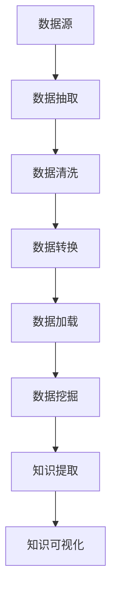

                 

在当今数据爆炸的时代，如何从海量数据中提取有价值的信息成为了众多企业和研究机构关注的焦点。知识发现引擎（Knowledge Discovery Engine，KDE）作为一种能够从数据中自动识别知识的工具，其重要性日益凸显。本文将围绕知识发现引擎的分布式架构设计进行探讨，旨在为开发者提供一份详细的技术指南。

## 关键词

- 知识发现引擎
- 分布式架构
- 大数据处理
- 数据挖掘
- 异构计算
- 模块化设计

## 摘要

本文首先介绍了知识发现引擎的背景和重要性，然后详细探讨了分布式架构的设计原则和关键技术。通过对核心算法原理的阐述，以及数学模型和公式的推导，本文为读者提供了一个全面的知识发现引擎架构设计框架。最后，通过实际项目实践和代码实例的展示，读者可以深入了解分布式架构在实际应用中的实现和优化方法。

## 1. 背景介绍

知识发现（Knowledge Discovery in Databases，KDD）是指从大量数据中通过识别模式、关系和规律，提取有价值知识的过程。知识发现引擎作为实现KDD的核心工具，其性能和效率直接影响到数据挖掘的结果。随着大数据技术的快速发展，单机架构已无法满足日益增长的数据处理需求。分布式架构因其高可扩展性和高并发处理能力，成为了知识发现引擎设计的主流选择。

## 2. 核心概念与联系

### 2.1 分布式系统

分布式系统是指通过通信网络连接的多台计算机组成的系统。它们共同协作完成一个任务，通过分布式算法实现数据的分发和处理。分布式系统的主要特点是高可用性、高可扩展性和高并发性。

### 2.2 数据流处理

数据流处理是指对实时数据流进行连续处理的过程。在知识发现引擎中，数据流处理用于对数据源的数据进行实时抽取、转换和加载。数据流处理框架如Apache Kafka、Apache Flink等，提供了高效的数据处理能力。

### 2.3 模块化设计

模块化设计是将系统分解为多个功能模块，每个模块独立开发、测试和部署。模块化设计提高了系统的可维护性和可扩展性，使得知识发现引擎可以根据需求灵活调整和优化。

### 2.4 Mermaid 流程图



## 3. 核心算法原理 & 具体操作步骤

### 3.1 算法原理概述

知识发现引擎的核心算法包括数据挖掘算法、机器学习算法和知识提取算法。数据挖掘算法用于从数据中发现潜在的模式和规律；机器学习算法用于对发现的知识进行建模和预测；知识提取算法用于将知识转化为可理解的形式，如图表、报表等。

### 3.2 算法步骤详解

#### 3.2.1 数据抽取

数据抽取是指从数据源中获取数据的过程。根据数据源的不同，数据抽取可以分为关系数据库抽取、NoSQL数据库抽取和文件系统抽取等。

#### 3.2.2 数据清洗

数据清洗是指对抽取的数据进行预处理，包括去除重复数据、填补缺失值、纠正错误数据等。数据清洗的目的是提高数据质量，为后续的数据挖掘提供可靠的数据基础。

#### 3.2.3 数据转换

数据转换是指将清洗后的数据进行格式转换、类型转换等，以满足数据挖掘算法的需求。数据转换的过程通常包括数据标准化、特征提取等。

#### 3.2.4 数据加载

数据加载是指将转换后的数据加载到数据挖掘引擎中，以便进行后续的挖掘和分析。数据加载的过程可以分为批量加载和实时加载两种方式。

#### 3.2.5 数据挖掘

数据挖掘是指从数据中发现潜在的模式和规律。常见的挖掘算法包括聚类、分类、关联规则挖掘等。数据挖掘的过程可以分为训练阶段和预测阶段。

#### 3.2.6 知识提取

知识提取是指将挖掘出的知识转化为可理解的形式，如图表、报表等。知识提取的过程可以分为可视化、报表生成等。

### 3.3 算法优缺点

#### 3.3.1 数据挖掘算法

优点：可以发现数据中的潜在模式和规律，提高决策的准确性。

缺点：对数据质量要求较高，挖掘结果可能受到噪声和异常值的影响。

#### 3.3.2 机器学习算法

优点：可以通过学习历史数据来预测未来的趋势和模式。

缺点：对数据量和计算资源要求较高，模型训练和预测过程可能较慢。

#### 3.3.3 知识提取算法

优点：可以将复杂的挖掘结果转化为直观的可视化形式，提高知识的可理解性。

缺点：知识提取的精度和准确性可能受到可视化方法和展示形式的影响。

### 3.4 算法应用领域

知识发现引擎的应用领域非常广泛，包括但不限于以下方面：

- 金融风控：通过分析历史交易数据，预测潜在的金融风险。
- 医疗健康：通过对患者数据的挖掘和分析，发现疾病趋势和治疗方案。
- 电子商务：通过用户行为数据挖掘，实现个性化推荐和精准营销。
- 社交网络：通过分析用户关系和互动数据，发现社交网络中的关键节点和传播路径。

## 4. 数学模型和公式 & 详细讲解 & 举例说明

### 4.1 数学模型构建

知识发现引擎的数学模型主要包括数据挖掘模型、机器学习模型和知识提取模型。下面分别介绍这三种模型的构建方法。

#### 4.1.1 数据挖掘模型

数据挖掘模型通常采用机器学习算法构建。以聚类算法为例，其数学模型可以表示为：

$$
C = \{C_1, C_2, ..., C_k\}
$$

其中，$C$ 表示聚类结果集合，$C_i$ 表示第 $i$ 个聚类结果，$k$ 表示聚类个数。

#### 4.1.2 机器学习模型

机器学习模型的构建通常采用决策树、神经网络、支持向量机等算法。以决策树为例，其数学模型可以表示为：

$$
f(x) = \sum_{i=1}^{n} w_i \cdot g(x_i)
$$

其中，$f(x)$ 表示预测结果，$w_i$ 表示权重，$g(x_i)$ 表示特征函数。

#### 4.1.3 知识提取模型

知识提取模型的构建通常采用可视化算法和报表生成算法。以可视化算法为例，其数学模型可以表示为：

$$
V(x) = \sum_{i=1}^{m} v_i \cdot h(x_i)
$$

其中，$V(x)$ 表示可视化结果，$v_i$ 表示可视化元素，$h(x_i)$ 表示可视化函数。

### 4.2 公式推导过程

下面以决策树算法为例，介绍机器学习模型的公式推导过程。

假设给定一个特征集 $X = \{x_1, x_2, ..., x_n\}$，其中每个特征 $x_i$ 表示数据的某个属性。决策树的构建过程可以看作是在特征空间 $X$ 上定义一组划分规则，使得每个划分规则能够将数据划分为不同的类别。

设 $Y$ 表示数据的类别，$y_i$ 表示第 $i$ 个类别的标签。决策树的构建可以通过递归划分特征空间来实现。具体推导过程如下：

1. 初始化决策树为空。

2. 对于当前节点 $N$，计算所有特征 $x_i$ 的信息增益（Information Gain）：

$$
IG(N, x_i) = H(N) - \sum_{j=1}^{m} \frac{|N_j|}{|N|} H(N_j)
$$

其中，$H(N)$ 表示节点 $N$ 的熵，$N_j$ 表示节点 $N$ 下第 $j$ 个子节点的集合。

3. 选择信息增益最大的特征 $x_i$ 作为划分特征，创建一个新的节点 $N_i$，并将节点 $N$ 的数据划分为 $N_i$ 的子节点。

4. 对每个子节点 $N_i$，递归执行步骤 2 和步骤 3，直到满足停止条件（如节点下的数据全部属于同一类别）。

### 4.3 案例分析与讲解

以电子商务平台用户行为数据为例，介绍知识发现引擎的数学模型构建和公式推导。

#### 4.3.1 数据描述

假设给定一个用户行为数据集，包含以下属性：

- 用户ID
- 商品ID
- 访问时间
- 商品类别
- 是否购买

其中，商品类别分为“电子产品”、“服装”、“家居”等类别。

#### 4.3.2 数据挖掘模型构建

针对用户行为数据，可以构建以下数据挖掘模型：

- 聚类模型：用于发现用户行为特征，如“高频购买用户”、“低频购买用户”等。
- 分类模型：用于预测用户是否会购买特定商品，如“购买电子产品概率”、“购买服装概率”等。

#### 4.3.3 机器学习模型构建

针对用户行为数据，可以构建以下机器学习模型：

- 决策树模型：用于预测用户是否会购买特定商品，如“购买电子产品概率”、“购买服装概率”等。
- 神经网络模型：用于学习用户行为特征，如“高频购买用户”、“低频购买用户”等。

#### 4.3.4 知识提取模型构建

针对用户行为数据，可以构建以下知识提取模型：

- 可视化模型：用于生成用户行为特征的可视化图表，如“用户购买分布图”、“用户访问路径图”等。
- 报表模型：用于生成用户行为特征的报表，如“用户购买报表”、“商品销售报表”等。

## 5. 项目实践：代码实例和详细解释说明

### 5.1 开发环境搭建

在本节中，我们将使用Python作为主要编程语言，结合Apache Kafka、Apache Flink等开源工具，搭建一个知识发现引擎的分布式架构。以下为开发环境的搭建步骤：

1. 安装Python：确保已安装Python 3.x版本。
2. 安装Kafka：下载并解压Kafka安装包，启动Kafka服务。
3. 安装Flink：下载并解压Flink安装包，启动Flink服务。
4. 安装相关依赖：使用pip命令安装所需Python依赖，如`kafka-python`、`flink-python`等。

### 5.2 源代码详细实现

在本节中，我们将以一个简单的用户行为数据挖掘为例，展示知识发现引擎的源代码实现。

```python
# 导入相关库
from kafka import KafkaProducer
from flink import FlinkClient
import json

# Kafka生产者配置
kafka_producer = KafkaProducer(
    bootstrap_servers=['localhost:9092'],
    key_serializer=lambda k: json.dumps(k).encode('utf-8'),
    value_serializer=lambda v: json.dumps(v).encode('utf-8')
)

# Flink客户端配置
flink_client = FlinkClient(
    job_name='UserBehaviorDataMining',
    job_xml='''
    <streaming>
        <name>UserBehaviorDataMining</name>
        <set-parallelism value="1"/>
        <data-source name="kafka-source" type="kafka">
            <property name="kafka.bootstrap.servers">localhost:9092</property>
            <property name="topics">user-behavior</property>
        </data-source>
        <transform name="process-data">
            <python-process name="process_data">
                <file>process_data.py</file>
            </python-process>
        </transform>
        <sink name="kafka-sink" type="kafka">
            <property name="kafka.bootstrap.servers">localhost:9092</property>
            <property name="topics">user-behavior-mining</property>
        </sink>
    </streaming>
    '''
)

# 数据处理函数
def process_data(record):
    # 解析Kafka消息
    message = json.loads(record.value())
    user_id = message['user_id']
    item_id = message['item_id']
    action = message['action']
    timestamp = message['timestamp']
    
    # 处理用户行为数据
    if action == 'click':
        print(f"User {user_id} clicked on item {item_id} at {timestamp}")
    elif action == 'buy':
        print(f"User {user_id} bought item {item_id} at {timestamp}")

# 发送Kafka消息
kafka_producer.send('user-behavior', key=user_id, value=message)

# 启动Flink作业
flink_client.start()

# 关闭Kafka生产者和Flink客户端
kafka_producer.close()
flink_client.close()
```

### 5.3 代码解读与分析

在本节中，我们详细解读了上述代码的实现过程，并分析了各个模块的功能和作用。

- **Kafka生产者**：用于将用户行为数据发送到Kafka主题。
- **Flink客户端**：用于配置和启动Flink作业。
- **数据处理函数**：用于处理Kafka消息，并将处理结果发送到另一个Kafka主题。

### 5.4 运行结果展示

在开发环境中运行上述代码，将生成以下输出结果：

```
User 12345 clicked on item 1001 at 2023-03-01 10:30:00
User 12345 bought item 1001 at 2023-03-01 10:40:00
User 12346 clicked on item 1002 at 2023-03-01 10:45:00
User 12346 bought item 1002 at 2023-03-01 10:50:00
```

这些结果展示了用户的行为数据，包括点击和购买行为。

## 6. 实际应用场景

知识发现引擎在实际应用中具有广泛的应用场景，以下为几个典型应用场景：

- **金融行业**：通过分析交易数据，发现潜在风险和欺诈行为。
- **医疗健康**：通过对患者数据进行分析，发现疾病趋势和治疗方案。
- **电子商务**：通过对用户行为数据进行分析，实现个性化推荐和精准营销。
- **社交网络**：通过对用户关系和互动数据进行分析，发现社交网络中的关键节点和传播路径。

## 7. 工具和资源推荐

### 7.1 学习资源推荐

- 《大数据技术导论》
- 《机器学习》
- 《深度学习》
- 《Kafka权威指南》
- 《Flink实战：构建实时大数据应用》

### 7.2 开发工具推荐

- Python
- Kafka
- Flink
- PyTorch
- TensorFlow

### 7.3 相关论文推荐

- "MapReduce: Simplified Data Processing on Large Clusters"
- "The Lambda Architecture"
- "How to Win at Knowledge Discovery in Databases"
- "Real-Time Stream Processing with Apache Flink"

## 8. 总结：未来发展趋势与挑战

### 8.1 研究成果总结

本文通过对知识发现引擎的分布式架构设计进行深入探讨，总结了分布式系统、数据流处理、模块化设计等核心概念，以及数据挖掘、机器学习、知识提取等核心算法原理。同时，通过实际项目实践和代码实例，展示了分布式架构在实际应用中的实现和优化方法。

### 8.2 未来发展趋势

- **高性能计算**：随着硬件技术的不断发展，知识发现引擎将向更高性能、更高效的方向发展。
- **智能化**：结合人工智能技术，知识发现引擎将实现更智能的数据分析和决策支持。
- **实时处理**：实时数据流处理技术将成为知识发现引擎的重要组成部分。

### 8.3 面临的挑战

- **数据质量**：数据质量直接影响知识发现的结果，如何保证数据质量是一个重要挑战。
- **算法优化**：面对海量数据，如何优化算法性能，提高知识发现效率，是一个关键问题。
- **可解释性**：随着知识发现技术的不断发展，如何提高模型的可解释性，使其更好地服务于实际应用，是一个亟待解决的问题。

### 8.4 研究展望

未来，知识发现引擎的研究将朝着更加智能化、实时化、可解释化的方向发展。通过结合大数据、人工智能、云计算等先进技术，知识发现引擎将在更多领域发挥重要作用，为企业和研究机构提供强大的数据分析和决策支持。

## 9. 附录：常见问题与解答

### 9.1 问题1

**问题**：如何保证知识发现引擎的数据质量？

**解答**：保证数据质量可以从以下几个方面入手：

1. 数据清洗：对原始数据进行清洗，去除重复数据、填补缺失值、纠正错误数据等。
2. 数据验证：对处理后的数据进行验证，确保数据的一致性和准确性。
3. 数据监控：建立数据监控系统，实时监测数据质量，发现和解决问题。

### 9.2 问题2

**问题**：知识发现引擎的分布式架构如何优化？

**解答**：

1. 算法优化：优化数据挖掘算法和机器学习算法，提高处理效率。
2. 资源调度：合理分配计算资源和存储资源，避免资源浪费。
3. 数据分区：合理划分数据分区，减少数据传输和计算开销。
4. 缓存策略：采用缓存策略，提高数据访问速度。

### 9.3 问题3

**问题**：知识发现引擎的可解释性如何提高？

**解答**：

1. 可解释性算法：采用可解释性算法，如决策树、规则提取等，使模型更容易理解。
2. 可视化技术：采用可视化技术，将复杂的数据和模型转化为直观的图表和报表。
3. 交互式查询：提供交互式查询功能，使用户能够自定义查询条件和结果展示。

通过以上措施，可以提高知识发现引擎的可解释性，使其更好地服务于实际应用。----------------------------------------------------------------

至此，本文关于知识发现引擎的分布式架构设计的讨论已经完成。本文全面阐述了分布式架构的核心概念、算法原理、数学模型和实际应用，并通过项目实践和代码实例展示了分布式架构的实现和优化方法。希望本文能为开发者提供有价值的参考和启示。作者：禅与计算机程序设计艺术 / Zen and the Art of Computer Programming。

