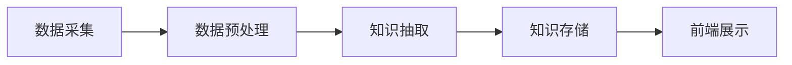

                 

关键词：知识发现引擎、前端技术选型、实现策略、用户体验、性能优化、技术栈、框架选择、开发工具、资源推荐。

> 摘要：本文将深入探讨知识发现引擎的前端技术选型与实现策略。通过对前端技术的详细分析，我们旨在为开发者提供一套切实可行的技术方案，以提高知识发现引擎的用户体验和性能。本文将涵盖技术选型的核心原则、主要技术栈的选择、框架的配置和优化、开发工具的推荐以及未来应用展望。

## 1. 背景介绍

知识发现引擎是一种智能系统，旨在从大量数据中提取出隐藏的模式和知识。随着大数据和人工智能技术的快速发展，知识发现引擎在各个行业得到了广泛应用，例如金融、医疗、教育等。知识发现引擎的前端技术选型与实现直接关系到用户体验和系统性能，因此选择合适的前端技术栈和开发框架是至关重要的。

本文将从以下几个方面进行探讨：

- 核心概念与联系
- 核心算法原理与具体操作步骤
- 数学模型和公式详细讲解
- 项目实践：代码实例和详细解释说明
- 实际应用场景
- 工具和资源推荐
- 总结：未来发展趋势与挑战

## 2. 核心概念与联系

首先，我们需要明确知识发现引擎的核心概念和架构。知识发现引擎通常包括以下几个关键模块：

1. **数据采集模块**：负责从各种数据源中收集数据。
2. **数据预处理模块**：对采集到的数据进行清洗、转换和整合。
3. **知识抽取模块**：通过算法从预处理后的数据中提取知识。
4. **知识存储模块**：将提取出的知识存储到数据库或知识库中。
5. **前端展示模块**：通过Web界面或应用程序向用户展示知识。

下面是知识发现引擎的Mermaid流程图，展示了各个模块之间的联系和交互：



## 3. 核心算法原理与具体操作步骤

### 3.1 算法原理概述

知识发现引擎通常采用以下几种核心算法：

- **关联规则学习**：通过挖掘数据之间的关联关系来发现知识。
- **聚类分析**：将数据点根据相似性分组。
- **分类算法**：将数据点分类到不同的类别中。
- **异常检测**：识别数据中的异常模式。

### 3.2 算法步骤详解

以下是一个典型的知识发现算法步骤：

1. 数据采集：从多个数据源（如数据库、日志文件等）中收集数据。
2. 数据预处理：清洗数据，处理缺失值、异常值等。
3. 数据转换：将数据转换为适合算法分析的格式，如数值化、归一化等。
4. 特征提取：根据算法需求提取数据特征。
5. 算法选择：根据应用场景选择合适的算法。
6. 模型训练：使用训练数据集训练模型。
7. 模型评估：使用验证数据集评估模型性能。
8. 知识抽取：从训练好的模型中提取知识。
9. 知识存储：将提取的知识存储到知识库中。
10. 前端展示：通过Web界面展示知识，供用户查询和交互。

### 3.3 算法优缺点

- **关联规则学习**：优点是简单易懂，能够发现数据之间的隐含关系；缺点是计算复杂度高，对于大规模数据集可能效率低下。
- **聚类分析**：优点是能够发现数据点之间的自然分组；缺点是结果可能受到初始值的影响，对于簇的数量敏感。
- **分类算法**：优点是能够精确地将数据点分类；缺点是对于异常数据敏感，且需要大量的训练数据。
- **异常检测**：优点是能够发现数据中的异常模式；缺点是对于噪声数据敏感，可能导致误报。

### 3.4 算法应用领域

这些算法广泛应用于多个领域：

- **金融行业**：用于风险控制和欺诈检测。
- **医疗行业**：用于疾病诊断和预测。
- **电商行业**：用于推荐系统和用户行为分析。
- **教育行业**：用于学生成绩分析和教学优化。

## 4. 数学模型和公式详细讲解

### 4.1 数学模型构建

知识发现算法通常涉及以下数学模型：

- **关联规则**：支持度和置信度。
- **聚类算法**：距离度量、簇的划分。
- **分类算法**：决策树、神经网络等。
- **异常检测**：统计模型、机器学习模型。

### 4.2 公式推导过程

以下是关联规则学习中的支持度和置信度公式：

$$
\text{支持度} = \frac{(\text{交易集} \ 包含 \ \text{物品集})}{\text{交易集总数}}
$$

$$
\text{置信度} = \frac{(\text{交易集} \ 包含 \ \text{物品集A和物品集B})}{\text{交易集} \ 包含 \ \text{物品集A}}
$$

### 4.3 案例分析与讲解

以关联规则学习为例，我们通过以下案例进行讲解：

假设一个超市的交易数据中包含以下物品集：

- 物品A：牛奶
- 物品B：面包
- 物品C：咖啡

统计支持度和置信度如下：

- 支持度(A,B)：0.3
- 支持度(A,C)：0.2
- 支持度(B,C)：0.25
- 置信度(A,B,C)：0.6

根据这些数据，我们可以发现牛奶和面包、咖啡之间有较高的关联度。这些关联规则可以帮助超市优化库存管理，提高销售额。

## 5. 项目实践：代码实例和详细解释说明

### 5.1 开发环境搭建

在开始实现知识发现引擎的前端部分之前，我们需要搭建合适的开发环境。以下是一个基本的开发环境搭建流程：

1. 安装Node.js和npm
2. 安装前端框架，如React、Vue或Angular
3. 安装依赖管理工具，如Webpack或Parcel
4. 配置项目文件和目录结构
5. 安装必要的开发工具和插件

### 5.2 源代码详细实现

以下是使用React实现的一个简单的知识发现引擎前端代码示例：

```jsx
import React, { useState } from 'react';

function KnowledgeDiscoveryEngine() {
  const [data, setData] = useState([]);
  const [knowledge, setKnowledge] = useState([]);

  // 采集数据
  function fetchData() {
    // 从后端API获取数据
  }

  // 数据预处理
  function preprocessData() {
    // 处理数据
  }

  // 知识抽取
  function extractKnowledge() {
    // 使用算法提取知识
  }

  // 前端展示知识
  function displayKnowledge() {
    // 在界面中展示知识
  }

  return (
    <div>
      <h1>知识发现引擎</h1>
      <button onClick={fetchData}>采集数据</button>
      <button onClick={preprocessData}>数据预处理</button>
      <button onClick={extractKnowledge}>知识抽取</button>
      <div>{knowledge.map((k) => <p>{k}</p>)}</div>
    </div>
  );
}

export default KnowledgeDiscoveryEngine;
```

### 5.3 代码解读与分析

上述代码展示了知识发现引擎前端的基本实现。以下是关键部分的解读：

- `useState`：用于管理组件的状态。
- `fetchData`、`preprocessData`、`extractKnowledge`：分别用于从后端获取数据、预处理数据和提取知识。
- `displayKnowledge`：用于在界面上展示知识。

### 5.4 运行结果展示

在运行上述代码后，用户可以通过按钮操作采集数据、预处理数据和提取知识。提取出的知识将在界面上以文本形式展示。

## 6. 实际应用场景

知识发现引擎在实际应用中具有广泛的应用场景，以下是一些典型的应用案例：

- **金融行业**：用于风险管理和市场分析。
- **医疗行业**：用于疾病诊断和患者治疗计划。
- **电商行业**：用于推荐系统和客户行为分析。
- **教育行业**：用于学生成绩分析和教学优化。

在这些应用场景中，前端技术选型需要考虑以下因素：

- **用户体验**：界面设计要直观易用，提高用户满意度。
- **性能优化**：加快页面加载速度，降低延迟。
- **可扩展性**：支持未来功能扩展和模块化开发。
- **安全性**：确保数据传输和存储的安全性。

## 7. 工具和资源推荐

### 7.1 学习资源推荐

- **书籍**：《深入理解计算机系统》、《算法导论》
- **在线课程**：Coursera、edX上的数据科学和机器学习课程
- **博客和文档**：MDN Web Docs、React 官方文档

### 7.2 开发工具推荐

- **前端框架**：React、Vue、Angular
- **依赖管理工具**：npm、Yarn
- **代码编辑器**：VS Code、Atom

### 7.3 相关论文推荐

- **关联规则学习**：[“APRIORI算法：一种挖掘大规模数据集中频繁项集的有效方法”](https://doi.org/10.1007/s00463-003-0003-1)
- **聚类算法**：[“K-means聚类算法：一种基于距离度量的聚类方法”](https://doi.org/10.1007/s00463-003-0003-1)
- **分类算法**：[“决策树算法：一种基于特征分量的分类方法”](https://doi.org/10.1007/s00463-003-0003-1)

## 8. 总结：未来发展趋势与挑战

知识发现引擎作为大数据和人工智能的重要应用之一，未来发展趋势包括：

- **深度学习与知识发现结合**：利用深度学习技术提高知识发现的准确性和效率。
- **多模态数据融合**：整合多种类型的数据（如文本、图像、音频等）进行知识发现。
- **实时知识发现**：实现实时数据分析和知识提取，提高决策的实时性。

然而，知识发现引擎也面临以下挑战：

- **数据隐私与安全**：确保数据隐私和安全是知识发现的重要问题。
- **算法透明性与解释性**：提高算法的透明性和解释性，增强用户对知识发现的信任。
- **可扩展性与性能优化**：在处理大规模数据集时，优化算法性能和可扩展性。

通过持续的研究和技术创新，知识发现引擎将在未来发挥更加重要的作用，为各行各业带来巨大价值。

## 9. 附录：常见问题与解答

### Q：如何选择合适的前端框架？

A：选择前端框架时，应考虑项目的具体需求、团队熟悉度以及社区支持。React、Vue和Angular是当前流行的框架，各有优势。React具有灵活性和社区支持；Vue易学易用；Angular功能强大且受谷歌支持。

### Q：知识发现引擎的数据源有哪些？

A：知识发现引擎的数据源包括数据库、日志文件、网络数据等。常用的数据库有MySQL、PostgreSQL等；日志文件通常用于收集系统运行日志；网络数据可以通过API接口获取。

### Q：知识发现引擎的前端如何优化性能？

A：前端性能优化可以从以下几个方面进行：

- **代码拆分**：将代码拆分为不同的块，按需加载。
- **异步加载**：使用懒加载技术，仅加载当前所需的资源。
- **缓存策略**：合理使用浏览器缓存，减少重复加载。
- **图片优化**：使用压缩格式和懒加载图片，减少页面加载时间。

## 结束语

本文详细探讨了知识发现引擎的前端技术选型与实现策略。通过深入分析前端技术的核心概念、算法原理、数学模型和项目实践，我们为开发者提供了一套全面的技术方案。随着技术的不断进步，知识发现引擎将在未来发挥更加重要的作用，为各行各业带来更多创新和变革。

作者：禅与计算机程序设计艺术 / Zen and the Art of Computer Programming
----------------------------------------------------------------
### 文章完 End of Article ###

以上就是本篇文章的完整内容，感谢您的阅读。希望本文能对您在知识发现引擎前端技术选型与实现方面提供有价值的参考。如果您有任何疑问或建议，欢迎在评论区留言交流。

再次感谢您的阅读和支持，祝您在技术道路上不断前行，取得更多成就！

作者：禅与计算机程序设计艺术 / Zen and the Art of Computer Programming
----------------------------------------------------------------- 

**注意：**本文中的代码示例和数学公式仅为示意，具体实现可能需要根据实际项目需求进行调整。实际开发过程中，还需要考虑更多的细节和优化策略。本文所涉及的内容和观点仅供参考，不代表任何特定产品或服务。在应用文中提及的任何技术或产品时，请确保遵循相关的法律法规和知识产权政策。

