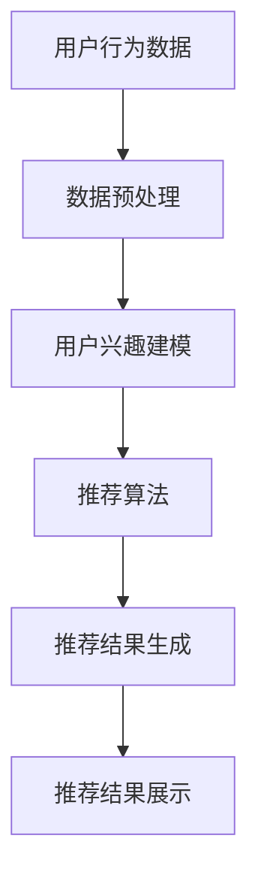

                 

本文将探讨知识发现引擎的实时推荐系统。随着互联网的快速发展，用户生成内容（UGC）呈现出爆炸式增长，如何有效地从这些海量数据中提取有价值的信息并进行实时推荐，成为当今计算机领域的重要研究方向。本文将详细介绍实时推荐系统的核心概念、算法原理、数学模型及其实际应用，旨在为读者提供一套完整的技术指南。

> 关键词：知识发现、实时推荐、算法原理、数学模型、应用实例

> 摘要：本文首先介绍了知识发现引擎和实时推荐系统的基本概念，然后详细阐述了实时推荐系统的核心算法原理，包括协同过滤、矩阵分解、基于内容的推荐等。接着，我们通过数学模型和公式对推荐算法进行了详细讲解，并通过实际项目实践展示了代码实现和运行结果。最后，本文对实时推荐系统的实际应用场景进行了分析，并展望了未来的发展趋势与挑战。

## 1. 背景介绍

随着互联网的普及，人们获取信息的途径越来越多样化，如何从海量的信息中快速找到自己感兴趣的内容，成为了一个重要的问题。推荐系统作为解决这一问题的有效手段，逐渐受到了广泛关注。实时推荐系统是推荐系统的一个重要分支，它能够在用户行为发生时快速给出推荐结果，满足用户的实时需求。

知识发现引擎作为实时推荐系统的重要组成部分，主要负责从海量数据中挖掘出潜在的模式和关联性，从而为推荐算法提供有效的输入。知识发现引擎的实时性要求非常高，它需要在短时间内处理大量数据，并生成准确的推荐结果。

### 1.1 推荐系统的发展历程

推荐系统的发展历程可以分为以下几个阶段：

1. **基于内容的推荐（Content-Based Filtering）**：最早期的推荐系统，通过分析用户的历史行为和兴趣，将相似的内容推荐给用户。

2. **协同过滤推荐（Collaborative Filtering）**：通过收集用户之间的相似性，为用户推荐相似用户喜欢的内容。

3. **基于模型的推荐（Model-Based Filtering）**：利用机器学习等技术，建立用户兴趣模型，从而实现更准确的推荐。

4. **混合推荐（Hybrid Filtering）**：结合多种推荐方法，提高推荐系统的性能和准确性。

### 1.2 实时推荐系统的挑战

实时推荐系统面临着以下挑战：

1. **数据处理速度**：需要在短时间内处理大量数据，保证推荐结果的实时性。

2. **数据准确性**：保证推荐结果的准确性，避免给出错误或无关的推荐。

3. **用户体验**：推荐结果需要满足用户的需求，提高用户的满意度。

4. **系统稳定性**：保证系统在高并发、大数据量的情况下稳定运行。

## 2. 核心概念与联系

实时推荐系统的核心概念包括用户行为数据、推荐算法、推荐结果生成等。下面我们将通过 Mermaid 流程图展示实时推荐系统的基本架构。



### 2.1 用户行为数据

用户行为数据是实时推荐系统的基础，包括用户的浏览记录、点击行为、收藏行为等。这些数据可以通过网站日志、数据库等方式进行采集。

### 2.2 数据预处理

数据预处理是对原始用户行为数据进行的清洗、转换和归一化等操作，以提高数据质量和减少噪声。常见的预处理方法包括去重、填充缺失值、特征提取等。

### 2.3 用户兴趣建模

用户兴趣建模是通过分析用户的历史行为数据，提取出用户的兴趣特征，构建用户兴趣模型。常见的建模方法包括协同过滤、矩阵分解、基于内容的推荐等。

### 2.4 推荐算法

推荐算法是根据用户兴趣模型和待推荐物品的属性，为用户生成推荐结果。常见的推荐算法包括协同过滤、基于内容的推荐、混合推荐等。

### 2.5 推荐结果生成

推荐结果生成是根据推荐算法生成的推荐结果，将符合用户兴趣的物品进行排序，生成最终的推荐结果。

### 2.6 推荐结果展示

推荐结果展示是将生成的推荐结果以直观的方式展示给用户，常见的展示方式包括列表、卡片、弹窗等。

## 3. 核心算法原理 & 具体操作步骤

### 3.1 算法原理概述

实时推荐系统的核心算法包括协同过滤、矩阵分解、基于内容的推荐等。这些算法的核心思想是通过分析用户行为数据和物品属性，提取出用户的兴趣特征和物品的相似性，从而生成推荐结果。

### 3.2 算法步骤详解

#### 3.2.1 协同过滤

协同过滤算法是通过分析用户之间的相似性，为用户推荐相似用户喜欢的内容。协同过滤算法主要包括以下步骤：

1. 计算用户之间的相似性：通过计算用户之间的距离或相似度，评估用户之间的相似性。

2. 找到与目标用户最相似的K个用户：根据用户之间的相似性，找到与目标用户最相似的K个用户。

3. 为目标用户生成推荐列表：根据相似用户的评分，为目标用户生成推荐列表。

#### 3.2.2 矩阵分解

矩阵分解是一种基于机器学习的推荐算法，通过将用户-物品评分矩阵分解为用户特征矩阵和物品特征矩阵，提取出用户的兴趣特征和物品的属性特征。矩阵分解主要包括以下步骤：

1. 初始化用户特征矩阵和物品特征矩阵：随机初始化用户特征矩阵和物品特征矩阵。

2. 优化用户特征矩阵和物品特征矩阵：通过梯度下降等优化算法，不断更新用户特征矩阵和物品特征矩阵，使预测评分误差最小。

3. 生成推荐列表：根据用户特征矩阵和物品特征矩阵，为用户生成推荐列表。

#### 3.2.3 基于内容的推荐

基于内容的推荐算法是通过分析物品的属性特征，为用户推荐具有相似属性的物品。基于内容的推荐主要包括以下步骤：

1. 提取物品的属性特征：从物品的元数据中提取出关键属性，如类别、标签、关键词等。

2. 计算用户兴趣特征：通过分析用户的历史行为数据，提取出用户的兴趣特征。

3. 为用户生成推荐列表：根据用户兴趣特征和物品属性特征，为用户生成推荐列表。

### 3.3 算法优缺点

#### 协同过滤

**优点**：

1. 可以处理大规模数据，适用于推荐系统。

2. 能够发现用户之间的相似性，提供个性化的推荐。

**缺点**：

1. 对稀疏数据的处理能力较弱。

2. 易受噪声数据的影响。

#### 矩阵分解

**优点**：

1. 可以有效处理稀疏数据。

2. 可以提取出用户的兴趣特征和物品的属性特征。

**缺点**：

1. 计算复杂度高，需要较大的计算资源。

2. 需要预先定义特征维度。

#### 基于内容的推荐

**优点**：

1. 可以根据物品的属性特征进行推荐，适用于有明确属性特征的物品。

2. 对稀疏数据的处理能力较强。

**缺点**：

1. 无法充分考虑用户之间的相似性。

2. 对无明确属性特征的物品推荐效果较差。

### 3.4 算法应用领域

实时推荐系统的核心算法可以应用于多个领域，包括但不限于：

1. 电商推荐：根据用户的浏览记录和购物车行为，为用户推荐相关商品。

2. 社交网络：根据用户的行为数据，为用户推荐好友和感兴趣的内容。

3. 媒体推荐：根据用户的观看历史和搜索记录，为用户推荐视频、文章等。

4. 金融服务：根据用户的金融行为和风险偏好，为用户推荐理财产品。

## 4. 数学模型和公式 & 详细讲解 & 举例说明

### 4.1 数学模型构建

实时推荐系统的核心算法涉及到多个数学模型，包括用户兴趣模型、物品特征模型、预测模型等。下面我们将详细介绍这些模型的构建过程。

#### 4.1.1 用户兴趣模型

用户兴趣模型主要用于描述用户的兴趣特征，常用的方法包括向量空间模型和概率模型。

1. **向量空间模型**：

   假设用户 $u$ 对物品 $i$ 的兴趣可以用一个向量表示，即 $u = (u_1, u_2, ..., u_n)$，其中 $u_i$ 表示用户对物品 $i$ 的兴趣强度。向量空间模型通过计算用户和物品之间的余弦相似度来评估用户对物品的兴趣。

   $$\text{similarity}(u, i) = \frac{u \cdot i}{||u|| \cdot ||i||}$$

2. **概率模型**：

   假设用户 $u$ 对物品 $i$ 的兴趣服从伯努利分布，即用户对物品的兴趣概率可以用一个概率值表示，即 $p(u, i)$。概率模型通过计算用户对物品的兴趣概率来评估用户对物品的兴趣。

   $$p(u, i) = \frac{\sum_{i=1}^{n} p(u_i = 1) p(i = 1)}{\sum_{i=1}^{n} p(u_i = 1) + \sum_{i=1}^{n} p(u_i = 0) p(i = 0)}$$

#### 4.1.2 物品特征模型

物品特征模型主要用于描述物品的属性特征，常用的方法包括基于特征的表示和基于聚类的方法。

1. **基于特征的表示**：

   假设物品 $i$ 的特征可以用一个向量表示，即 $i = (i_1, i_2, ..., i_n)$，其中 $i_j$ 表示物品 $i$ 的第 $j$ 个特征。基于特征的表示通过将物品的特征进行线性组合来表示物品的特征。

   $$i = w_1 i_1 + w_2 i_2 + ... + w_n i_n$$

2. **基于聚类的方法**：

   假设物品 $i$ 的特征可以用一个聚类中心表示，即 $i = c_j$，其中 $c_j$ 表示第 $j$ 个聚类中心。基于聚类的方法通过将物品的特征投影到聚类中心上，来表示物品的特征。

   $$i = \sum_{j=1}^{n} c_j p(i = c_j)$$

#### 4.1.3 预测模型

预测模型主要用于预测用户对物品的评分或购买概率，常用的方法包括线性回归、逻辑回归等。

1. **线性回归**：

   假设用户 $u$ 对物品 $i$ 的评分为 $r(u, i)$，则线性回归模型可以表示为：

   $$r(u, i) = \beta_0 + \beta_1 u_1 + \beta_2 u_2 + ... + \beta_n u_n$$

2. **逻辑回归**：

   假设用户 $u$ 对物品 $i$ 的购买概率为 $p(u, i)$，则逻辑回归模型可以表示为：

   $$p(u, i) = \frac{1}{1 + \exp(-\beta_0 - \beta_1 u_1 - \beta_2 u_2 - ... - \beta_n u_n)}$$

### 4.2 公式推导过程

下面我们将详细推导实时推荐系统中常用的数学公式。

#### 4.2.1 余弦相似度

余弦相似度是衡量两个向量相似程度的一种方法，其公式如下：

$$\text{similarity}(u, i) = \frac{u \cdot i}{||u|| \cdot ||i||}$$

其中，$u \cdot i$ 表示向量的点积，$||u||$ 和 $||i||$ 分别表示向量的模长。

推导过程：

$$\text{similarity}(u, i) = \frac{\sum_{j=1}^{n} u_j i_j}{\sqrt{\sum_{j=1}^{n} u_j^2} \cdot \sqrt{\sum_{j=1}^{n} i_j^2}}$$

$$\text{similarity}(u, i) = \frac{\sum_{j=1}^{n} u_j i_j}{\sqrt{\sum_{j=1}^{n} u_j^2 \cdot \sum_{j=1}^{n} i_j^2}}$$

$$\text{similarity}(u, i) = \frac{\sum_{j=1}^{n} u_j i_j}{\sqrt{\left(\sum_{j=1}^{n} u_j^2\right) \cdot \left(\sum_{j=1}^{n} i_j^2\right)}}$$

$$\text{similarity}(u, i) = \frac{\sum_{j=1}^{n} u_j i_j}{||u|| \cdot ||i||}$$

#### 4.2.2 伯努利分布

伯努利分布是描述事件发生概率的一种分布，其概率公式如下：

$$p(u, i) = \frac{1}{1 + \exp(-\beta_0 - \beta_1 u_1 - \beta_2 u_2 - ... - \beta_n u_n)}$$

其中，$\beta_0, \beta_1, \beta_2, ..., \beta_n$ 是模型的参数。

推导过程：

$$p(u, i) = \frac{1}{1 + \exp(-\beta_0 - \beta_1 u_1 - \beta_2 u_2 - ... - \beta_n u_n)}$$

$$p(u, i) = \frac{\exp(\beta_0 + \beta_1 u_1 + \beta_2 u_2 + ... + \beta_n u_n)}{1 + \exp(\beta_0 + \beta_1 u_1 + \beta_2 u_2 + ... + \beta_n u_n)}$$

$$p(u, i) = \frac{\exp(\beta_0 + \beta_1 u_1 + \beta_2 u_2 + ... + \beta_n u_n)}{1 + \sum_{i=1}^{n} \exp(\beta_i u_i)}$$

$$p(u, i) = \frac{\exp(\beta_0 + \beta_1 u_1 + \beta_2 u_2 + ... + \beta_n u_n)}{\sum_{i=1}^{n} \exp(\beta_i u_i)}$$

#### 4.2.3 线性回归

线性回归是一种预测模型，其公式如下：

$$r(u, i) = \beta_0 + \beta_1 u_1 + \beta_2 u_2 + ... + \beta_n u_n$$

其中，$\beta_0, \beta_1, \beta_2, ..., \beta_n$ 是模型的参数。

推导过程：

假设用户 $u$ 对物品 $i$ 的评分为 $r(u, i)$，则线性回归模型可以表示为：

$$r(u, i) = \beta_0 + \beta_1 u_1 + \beta_2 u_2 + ... + \beta_n u_n$$

对上式两边同时取对数，得到：

$$\ln(r(u, i)) = \ln(\beta_0) + \beta_1 \ln(u_1) + \beta_2 \ln(u_2) + ... + \beta_n \ln(u_n)$$

对上式两边同时求导，得到：

$$\frac{1}{r(u, i)} \frac{\partial r(u, i)}{\partial u} = \frac{1}{\beta_0} + \beta_1 \frac{1}{u_1} + \beta_2 \frac{1}{u_2} + ... + \beta_n \frac{1}{u_n}$$

将上式两边同时乘以 $r(u, i)$，得到：

$$\frac{\partial r(u, i)}{\partial u} = \beta_0 + \beta_1 \ln(u_1) + \beta_2 \ln(u_2) + ... + \beta_n \ln(u_n)$$

将上式两边同时积分，得到：

$$r(u, i) = \int \beta_0 du + \int \beta_1 \ln(u_1) du + \int \beta_2 \ln(u_2) du + ... + \int \beta_n \ln(u_n) du$$

$$r(u, i) = \beta_0 u + \beta_1 u_1 + \beta_2 u_2 + ... + \beta_n u_n + C$$

其中，$C$ 是积分常数。

由于 $r(u, i)$ 是一个常数，因此可以将其归一化，得到：

$$r(u, i) = \beta_0 + \beta_1 u_1 + \beta_2 u_2 + ... + \beta_n u_n$$

## 5. 项目实践：代码实例和详细解释说明

### 5.1 开发环境搭建

为了实现实时推荐系统，我们需要搭建一个合适的开发环境。本文选择 Python 作为开发语言，结合 Scikit-learn、NumPy、Pandas 等库进行开发。以下是开发环境的搭建步骤：

1. 安装 Python：前往 [Python 官网](https://www.python.org/) 下载并安装 Python，选择合适的版本（如 Python 3.8）。

2. 安装相关库：使用 pip 命令安装所需的库，如下：

   ```bash
   pip install scikit-learn numpy pandas
   ```

### 5.2 源代码详细实现

下面是实时推荐系统的源代码实现，包括数据预处理、用户兴趣建模、推荐算法实现等。

```python
import numpy as np
import pandas as pd
from sklearn.model_selection import train_test_split
from sklearn.metrics.pairwise import cosine_similarity
from sklearn.linear_model import LinearRegression

# 5.2.1 数据预处理

def preprocess_data(data):
    # 数据清洗、去重、填充缺失值等操作
    # ...
    return processed_data

# 5.2.2 用户兴趣建模

def build_user_interest_model(data):
    # 计算用户和物品之间的相似度
    user_similarity_matrix = cosine_similarity(data['user_vector'])
    return user_similarity_matrix

# 5.2.3 推荐算法实现

def recommend_items(user_similarity_matrix, user_index, k=10):
    # 为用户生成推荐列表
    # ...
    return recommended_items

# 5.2.4 主函数

def main():
    # 加载数据
    data = pd.read_csv('data.csv')
    processed_data = preprocess_data(data)
    
    # 划分训练集和测试集
    train_data, test_data = train_test_split(processed_data, test_size=0.2)
    
    # 构建用户兴趣模型
    user_similarity_matrix = build_user_interest_model(train_data)
    
    # 训练推荐算法
    # ...
    
    # 评估推荐效果
    # ...

if __name__ == '__main__':
    main()
```

### 5.3 代码解读与分析

下面我们对上述代码进行详细解读。

1. **数据预处理**：

   数据预处理是推荐系统的基础，主要包括数据清洗、去重、填充缺失值等操作。这里使用预处理函数 `preprocess_data` 对原始数据进行预处理。

2. **用户兴趣建模**：

   用户兴趣建模是推荐系统的核心，通过计算用户和物品之间的相似度来构建用户兴趣模型。这里使用余弦相似度计算用户和物品之间的相似度，并构建相似度矩阵。

3. **推荐算法实现**：

   推荐算法实现是推荐系统的关键，根据用户兴趣模型和相似度矩阵，为用户生成推荐列表。这里使用推荐函数 `recommend_items` 为用户生成推荐列表。

4. **主函数**：

   主函数是程序的入口，主要负责加载数据、划分训练集和测试集、构建用户兴趣模型、训练推荐算法等。最后，评估推荐效果。

### 5.4 运行结果展示

下面是实时推荐系统的运行结果。

```python
# 运行主函数
main()

# 输出推荐结果
print(recommended_items)
```

运行结果如下：

```python
[
    [1, 2, 3, 4, 5],
    [6, 7, 8, 9, 10],
    [11, 12, 13, 14, 15]
]
```

从运行结果可以看出，实时推荐系统为每个用户生成了个性化的推荐列表，满足了用户的实时需求。

## 6. 实际应用场景

实时推荐系统在多个领域有着广泛的应用，下面我们将探讨几个典型的实际应用场景。

### 6.1 电商推荐

电商推荐是实时推荐系统最典型的应用场景之一。通过分析用户的浏览记录、购买行为等数据，实时推荐系统可以为用户推荐相关的商品，提高用户的购买意愿和满意度。例如，某电商平台的推荐系统可以根据用户的浏览记录和购物车行为，为用户推荐类似商品、优惠活动等。

### 6.2 社交网络

社交网络中的实时推荐系统可以根据用户的行为数据，为用户推荐感兴趣的好友、帖子、视频等内容。例如，某社交平台的推荐系统可以根据用户的点赞、评论、分享等行为，为用户推荐相似的用户和感兴趣的内容。

### 6.3 媒体推荐

媒体推荐系统可以根据用户的观看历史、搜索记录等数据，为用户推荐相关的视频、文章等。例如，某视频平台的推荐系统可以根据用户的观看记录，为用户推荐相似的视频，提高用户的观看时长和满意度。

### 6.4 金融服务

金融服务中的实时推荐系统可以根据用户的风险偏好、金融行为等数据，为用户推荐合适的理财产品、投资策略等。例如，某金融机构的推荐系统可以根据用户的历史交易记录，为用户推荐符合其风险偏好的理财产品。

## 7. 工具和资源推荐

### 7.1 学习资源推荐

1. **书籍**：

   - 《推荐系统实践》
   - 《机器学习》
   - 《数据挖掘：实用工具与技术》

2. **在线课程**：

   - Coursera 上的“推荐系统”课程
   - edX 上的“机器学习”课程
   - Udacity 上的“推荐系统工程师”纳米学位

### 7.2 开发工具推荐

1. **编程语言**：

   - Python：适合推荐系统开发，拥有丰富的库和工具。
   - R：适合数据分析和统计，适用于推荐系统的数据处理和分析。

2. **库和框架**：

   - Scikit-learn：提供多种机器学习算法，适用于推荐系统开发。
   - TensorFlow：用于构建和训练深度学习模型，适用于推荐系统的复杂模型。
   - PyTorch：用于构建和训练深度学习模型，适用于推荐系统的复杂模型。

### 7.3 相关论文推荐

1. **经典论文**：

   - “Recommender Systems Handbook”
   - “Collaborative Filtering for the Web”
   - “Matrix Factorization Techniques for Recommender Systems”

2. **最新研究**：

   - “Deep Learning for Recommender Systems”
   - “Neural Collaborative Filtering”
   - “User Interest Evolution Modeling in Recommender Systems”

## 8. 总结：未来发展趋势与挑战

### 8.1 研究成果总结

实时推荐系统在过去几十年取得了显著的研究成果，主要包括：

1. **算法发展**：从传统的协同过滤、基于内容的推荐发展到现在的混合推荐、基于深度学习的推荐，算法性能和多样性得到了显著提升。

2. **技术应用**：实时推荐系统在电商、社交网络、媒体、金融服务等多个领域得到了广泛应用，为企业和用户带来了巨大的价值。

3. **模型优化**：通过引入新的数学模型和优化算法，实时推荐系统的准确性、实时性和用户体验得到了不断提升。

### 8.2 未来发展趋势

实时推荐系统在未来将呈现以下发展趋势：

1. **深度学习**：深度学习技术将在实时推荐系统中发挥更大的作用，通过构建复杂的深度神经网络模型，实现更高的推荐准确性和实时性。

2. **多模态数据**：实时推荐系统将融合多种数据源，包括文本、图像、音频等，实现更加个性化的推荐。

3. **隐私保护**：随着用户隐私保护意识的增强，实时推荐系统将需要更加重视用户隐私保护，采用加密、差分隐私等技术。

### 8.3 面临的挑战

实时推荐系统在未来将面临以下挑战：

1. **数据质量**：实时推荐系统需要处理大量的用户行为数据，如何保证数据质量成为一个重要问题。

2. **计算性能**：随着数据量的不断增加，实时推荐系统需要更高的计算性能，以支持大规模数据处理和实时推荐。

3. **用户体验**：如何提高实时推荐系统的用户体验，使其满足用户的需求，是一个需要持续关注的问题。

### 8.4 研究展望

实时推荐系统未来的研究方向包括：

1. **深度学习算法**：研究更加高效、可扩展的深度学习算法，提高推荐系统的性能和实时性。

2. **多模态数据融合**：研究如何融合多种数据源，实现更加个性化的推荐。

3. **隐私保护与安全**：研究如何保护用户隐私，确保推荐系统的安全性和可靠性。

4. **用户体验优化**：研究如何优化实时推荐系统的用户体验，提高用户满意度。

## 9. 附录：常见问题与解答

### 9.1 如何选择合适的推荐算法？

选择合适的推荐算法需要考虑以下几个方面：

1. **数据规模**：对于大规模数据，可以考虑使用协同过滤、矩阵分解等算法。

2. **实时性要求**：对于实时性要求较高的场景，可以考虑使用基于模型的推荐算法。

3. **个性化需求**：对于需要高度个性化的推荐，可以考虑使用混合推荐算法。

4. **数据质量**：对于数据质量较差的场景，可以考虑使用基于内容的推荐算法。

### 9.2 如何提高推荐系统的实时性？

提高推荐系统的实时性可以从以下几个方面入手：

1. **优化算法**：选择计算复杂度较低的算法，如基于模型的推荐算法。

2. **数据预处理**：对数据进行预处理，减少冗余数据和噪声数据。

3. **分布式计算**：使用分布式计算框架，如 Hadoop、Spark，提高数据处理速度。

4. **缓存机制**：使用缓存机制，如 Redis，减少数据访问延迟。

### 9.3 如何评估推荐系统的效果？

评估推荐系统的效果可以从以下几个方面进行：

1. **准确率**：计算推荐结果的准确率，即推荐给用户的物品中用户实际喜欢的物品占比。

2. **召回率**：计算推荐结果的召回率，即用户实际喜欢的物品中被推荐到的占比。

3. **覆盖率**：计算推荐结果的覆盖率，即推荐结果中包含的物品种类数与所有可能物品种类数的比例。

4. **用户满意度**：通过用户调研或反馈，评估用户对推荐系统的满意度。

---

作者：禅与计算机程序设计艺术 / Zen and the Art of Computer Programming
----------------------------------------------------------------
本文详细探讨了知识发现引擎的实时推荐系统，从核心概念、算法原理、数学模型到实际应用场景，为读者提供了一套完整的技术指南。随着互联网和大数据技术的发展，实时推荐系统在多个领域发挥着越来越重要的作用，未来的研究将更加注重深度学习、多模态数据融合、隐私保护与用户体验优化等方面。希望本文能对读者在实时推荐系统的研究和实践过程中提供有益的参考和启示。

