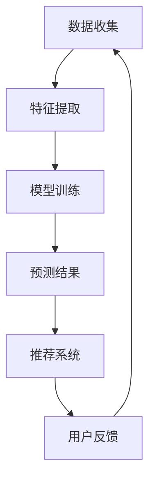

                 

关键词：知识发现引擎、用户行为预测、推荐系统、算法原理、数学模型、项目实践、实际应用场景、未来展望

摘要：本文将深入探讨知识发现引擎在用户行为预测与推荐系统中的应用。我们将首先介绍知识发现引擎的基本概念，然后详细阐述用户行为预测的核心原理和数学模型。接下来，我们将通过具体实例展示如何构建并实现推荐系统，并讨论其优缺点和应用领域。随后，我们将分析数学模型和公式，并提供案例分析。最后，我们将分享实际开发中的代码实例，以及推荐系统的未来应用场景和展望。

## 1. 背景介绍

知识发现引擎是一种智能系统，旨在从大量数据中提取有价值的信息和知识。在过去的几十年里，随着互联网和大数据技术的飞速发展，知识发现引擎在各个领域得到了广泛应用，包括商业智能、金融市场分析、社交媒体推荐、医学诊断等。

用户行为预测是知识发现引擎的重要组成部分，其目标是准确预测用户的下一步行为或需求。这有助于提供个性化推荐，提高用户满意度，从而增强用户体验。推荐系统则是基于用户行为预测的结果，向用户推荐相关的内容或服务。

本文将重点关注知识发现引擎在用户行为预测与推荐系统中的应用，探讨其核心原理、数学模型和实现方法，并结合实际项目案例进行分析。

### 1.1 知识发现引擎的定义和作用

知识发现引擎是一种自动化工具，通过使用各种数据挖掘技术和算法，从大量数据中识别出有价值的信息和知识。这些知识和信息可以是模式、关联关系、趋势或异常点等。

知识发现引擎的作用包括：

1. **数据预处理**：清洗和转换原始数据，使其适合进行分析。
2. **模式识别**：发现数据中的规律和模式，如时间序列、聚类和分类等。
3. **关联分析**：分析数据之间的关联关系，如用户偏好、产品关联等。
4. **趋势预测**：基于历史数据，预测未来的趋势和变化。

### 1.2 用户行为预测和推荐系统的关系

用户行为预测和推荐系统是紧密相连的。用户行为预测的目标是理解用户的需求和偏好，而推荐系统则是基于这些预测结果，向用户推荐相关的内容或服务。

用户行为预测的过程通常包括以下步骤：

1. **数据收集**：收集用户的浏览历史、购买记录、搜索行为等数据。
2. **特征提取**：从原始数据中提取有助于预测的特征，如用户ID、时间戳、产品ID等。
3. **模型训练**：使用机器学习算法训练预测模型，以预测用户的下一步行为。
4. **结果评估**：评估预测模型的准确性和效果，不断优化模型。

推荐系统则是基于用户行为预测的结果，使用协作过滤、内容推荐、混合推荐等方法，生成个性化的推荐列表。

## 2. 核心概念与联系

为了深入理解知识发现引擎在用户行为预测与推荐系统中的应用，我们需要先了解以下几个核心概念：用户行为、特征提取、机器学习算法、推荐系统。

### 2.1 用户行为

用户行为是指用户在特定环境或场景中表现出来的行为模式。在知识发现引擎中，用户行为数据通常包括以下几类：

1. **浏览行为**：用户在网站或应用上的浏览历史，如页面访问次数、停留时间、浏览路径等。
2. **购买行为**：用户的购买记录，包括购买时间、购买商品、购买数量等。
3. **搜索行为**：用户在搜索引擎或应用中的搜索记录，包括搜索关键词、搜索时间等。
4. **互动行为**：用户在社交媒体、论坛等平台上的互动行为，如点赞、评论、分享等。

### 2.2 特征提取

特征提取是用户行为预测的关键步骤，其目标是从原始用户行为数据中提取有助于预测的特征。这些特征可以是数值型、类别型或文本型。

常见的特征提取方法包括：

1. **时间特征**：如日期、小时、星期几等。
2. **频率特征**：如用户访问某个页面的次数、购买某个产品的次数等。
3. **上下文特征**：如用户的地理位置、设备类型等。
4. **序列特征**：如用户的浏览路径、购买路径等。

### 2.3 机器学习算法

机器学习算法是用户行为预测的核心，其目标是训练出一个模型，能够根据输入的特征预测用户的下一步行为。常见的机器学习算法包括：

1. **线性回归**：通过建立线性关系预测用户的下一步行为。
2. **决策树**：通过树形结构进行分类或回归。
3. **支持向量机**：通过找到最优超平面进行分类。
4. **神经网络**：通过多层神经网络进行复杂函数的拟合。

### 2.4 推荐系统

推荐系统是基于用户行为预测的结果，向用户推荐相关的内容或服务。常见的推荐系统方法包括：

1. **协作过滤**：通过分析用户的相似性进行推荐。
2. **内容推荐**：根据用户的行为特征和物品的属性进行推荐。
3. **混合推荐**：结合多种推荐方法进行推荐，提高推荐效果。

### 2.5 Mermaid 流程图

以下是一个简化的Mermaid流程图，展示了知识发现引擎在用户行为预测与推荐系统中的应用：



### 2.6 核心概念联系

知识发现引擎在用户行为预测与推荐系统中的应用是一个紧密相连的过程。用户行为数据通过特征提取转化为可用于机器学习算法的特征。经过模型训练，我们得到预测结果，这些结果被用于推荐系统，生成个性化的推荐。最终，用户的反馈将反馈到数据收集环节，形成闭环。

## 3. 核心算法原理 & 具体操作步骤

### 3.1 算法原理概述

在用户行为预测与推荐系统中，核心算法主要包括机器学习算法、推荐算法和评估指标。

#### 3.1.1 机器学习算法

机器学习算法的目标是训练一个模型，能够根据输入的特征预测用户的下一步行为。常见的机器学习算法包括线性回归、决策树、支持向量机、神经网络等。

线性回归是一种简单的机器学习算法，通过建立线性关系预测用户的下一步行为。其基本原理是找到一组参数，使得预测值与真实值之间的差距最小。

决策树通过树形结构进行分类或回归。其基本原理是递归地将数据集划分为多个子集，直到满足停止条件。

支持向量机通过找到最优超平面进行分类。其基本原理是找到一组超平面，使得分类边界最大化。

神经网络通过多层神经网络进行复杂函数的拟合。其基本原理是模拟人脑的神经元结构，通过权重和偏置调整实现非线性变换。

#### 3.1.2 推荐算法

推荐算法的目标是根据用户行为预测结果，向用户推荐相关的内容或服务。常见的推荐算法包括协作过滤、内容推荐和混合推荐。

协作过滤通过分析用户的相似性进行推荐。其基本原理是找到与目标用户相似的用户，并推荐他们喜欢的物品。

内容推荐根据用户的行为特征和物品的属性进行推荐。其基本原理是计算用户和物品之间的相似度，并推荐相似的物品。

混合推荐结合多种推荐方法进行推荐，以提高推荐效果。其基本原理是将多种推荐方法融合在一起，取长补短。

#### 3.1.3 评估指标

评估指标用于衡量推荐系统的效果。常见的评估指标包括准确率、召回率、覆盖率、多样化度等。

准确率用于衡量推荐系统的准确性，即推荐物品与用户实际需求的匹配程度。

召回率用于衡量推荐系统的召回能力，即推荐系统能够召回多少用户实际需要的物品。

覆盖率用于衡量推荐系统的全面性，即推荐系统能够覆盖多少不同的用户需求。

多样化度用于衡量推荐系统的多样性，即推荐系统推荐的物品之间是否具有多样性。

### 3.2 算法步骤详解

用户行为预测与推荐系统的具体操作步骤如下：

#### 3.2.1 数据收集

数据收集是用户行为预测与推荐系统的第一步。通常需要收集用户的行为数据，包括浏览历史、购买记录、搜索行为等。

#### 3.2.2 特征提取

特征提取是将原始数据转化为可用于机器学习算法的特征。常见的特征提取方法包括时间特征、频率特征、上下文特征和序列特征等。

#### 3.2.3 模型训练

模型训练是用户行为预测与推荐系统的核心步骤。根据不同的算法，可以选择线性回归、决策树、支持向量机、神经网络等算法进行模型训练。

#### 3.2.4 预测结果

模型训练完成后，我们可以使用训练好的模型进行预测。预测结果包括用户的下一步行为和推荐列表。

#### 3.2.5 推荐系统

基于预测结果，推荐系统可以根据用户的行为特征和物品的属性，生成个性化的推荐列表。

#### 3.2.6 评估指标

评估指标用于衡量推荐系统的效果。根据不同的评估指标，可以调整模型参数和推荐策略，以优化推荐效果。

### 3.3 算法优缺点

#### 3.3.1 机器学习算法

线性回归的优点是简单易懂，适用于线性关系较强的场景。缺点是对于非线性关系和复杂函数的拟合能力较差。

决策树的优点是直观易懂，易于解释。缺点是容易过拟合，且在大量特征时性能下降。

支持向量机的优点是具有良好的分类性能。缺点是计算复杂度高，对于高维数据效果不佳。

神经网络的优点是能够处理非线性关系和复杂函数。缺点是需要大量数据和计算资源，且模型难以解释。

#### 3.3.2 推荐算法

协作过滤的优点是能够发现用户的相似性，提高推荐效果。缺点是容易受到数据稀疏性的影响。

内容推荐的优点是能够根据用户的行为特征和物品的属性进行推荐，提高推荐准确性。缺点是对于用户偏好变化较慢。

混合推荐的优点是结合多种推荐方法，提高推荐效果。缺点是实现复杂，需要对不同方法进行优化和整合。

### 3.4 算法应用领域

用户行为预测与推荐系统在多个领域得到了广泛应用，包括电子商务、社交媒体、金融、医疗等。

#### 3.4.1 电子商务

电子商务中的用户行为预测与推荐系统可以帮助电商平台了解用户需求，提高用户满意度。例如，根据用户的浏览历史和购买记录，推荐相关的商品。

#### 3.4.2 社交媒体

社交媒体中的用户行为预测与推荐系统可以帮助用户发现感兴趣的内容，提高用户活跃度。例如，根据用户的互动行为，推荐相关的帖子或话题。

#### 3.4.3 金融

金融领域的用户行为预测与推荐系统可以帮助金融机构了解用户的风险偏好，提供个性化的投资建议。例如，根据用户的投资记录，推荐相关的理财产品。

#### 3.4.4 医疗

医疗领域的用户行为预测与推荐系统可以帮助医疗机构了解患者的需求，提高医疗服务质量。例如，根据患者的病史和体检结果，推荐相关的健康建议。

## 4. 数学模型和公式 & 详细讲解 & 举例说明

### 4.1 数学模型构建

在用户行为预测与推荐系统中，常用的数学模型包括线性回归、决策树、支持向量机和神经网络。

#### 4.1.1 线性回归模型

线性回归模型是一种简单的机器学习算法，用于建立输入特征与输出特征之间的线性关系。其数学模型可以表示为：

$$y = \beta_0 + \beta_1x_1 + \beta_2x_2 + ... + \beta_nx_n$$

其中，$y$为输出特征，$x_1, x_2, ..., x_n$为输入特征，$\beta_0, \beta_1, \beta_2, ..., \beta_n$为模型的参数。

#### 4.1.2 决策树模型

决策树模型是一种基于树形结构的分类或回归模型。其数学模型可以表示为：

$$f(x) = g(x_1, x_2, ..., x_n)$$

其中，$f(x)$为决策树模型的输出，$g(x_1, x_2, ..., x_n)$为决策树的结构。

#### 4.1.3 支持向量机模型

支持向量机模型是一种基于最优超平面的分类模型。其数学模型可以表示为：

$$f(x) = \text{sign}(\omega \cdot x + b)$$

其中，$f(x)$为支持向量机模型的输出，$\omega$为权重向量，$x$为输入特征，$b$为偏置。

#### 4.1.4 神经网络模型

神经网络模型是一种基于多层神经元的分类或回归模型。其数学模型可以表示为：

$$f(x) = \sigma(\omega \cdot x + b)$$

其中，$f(x)$为神经网络模型的输出，$\sigma$为激活函数，$\omega$为权重矩阵，$x$为输入特征，$b$为偏置。

### 4.2 公式推导过程

以下是对线性回归模型的公式推导过程：

#### 4.2.1 假设

我们假设一个线性回归模型，其形式为：

$$y = \beta_0 + \beta_1x_1 + \beta_2x_2 + ... + \beta_nx_n$$

其中，$y$为输出特征，$x_1, x_2, ..., x_n$为输入特征，$\beta_0, \beta_1, \beta_2, ..., \beta_n$为模型的参数。

#### 4.2.2 最小二乘法

为了找到最佳拟合直线，我们使用最小二乘法。最小二乘法的思想是找到一组参数，使得预测值与真实值之间的差距最小。

#### 4.2.3 偏差和方差

在最小二乘法中，我们定义偏差（Bias）和方差（Variance）来衡量模型的性能。

偏差衡量模型预测值与真实值之间的偏差，方差衡量模型预测值之间的波动。

#### 4.2.4 最小化损失函数

为了最小化偏差和方差，我们定义损失函数（Loss Function），并使用梯度下降法（Gradient Descent）优化模型参数。

损失函数可以表示为：

$$L(\theta) = \frac{1}{2}\sum_{i=1}^{m}(y_i - \theta_0 - \theta_1x_{i1} - \theta_2x_{i2} - ... - \theta_nx_{in})^2$$

其中，$m$为样本数量，$y_i$为第$i$个样本的输出特征，$x_{i1}, x_{i2}, ..., x_{in}$为第$i$个样本的输入特征，$\theta_0, \theta_1, \theta_2, ..., \theta_n$为模型的参数。

#### 4.2.5 梯度下降法

梯度下降法是一种优化算法，用于找到损失函数的最小值。其基本思想是沿着损失函数的梯度方向更新模型参数。

梯度下降法的迭代公式可以表示为：

$$\theta_0 = \theta_0 - \alpha \frac{\partial L}{\partial \theta_0}$$

$$\theta_1 = \theta_1 - \alpha \frac{\partial L}{\partial \theta_1}$$

$$\theta_2 = \theta_2 - \alpha \frac{\partial L}{\partial \theta_2}$$

$$...$$

$$\theta_n = \theta_n - \alpha \frac{\partial L}{\partial \theta_n}$$

其中，$\alpha$为学习率，$\frac{\partial L}{\partial \theta}$为损失函数关于$\theta$的梯度。

### 4.3 案例分析与讲解

以下是一个简单的案例，用于讲解线性回归模型的推导和应用。

#### 4.3.1 案例背景

假设我们有一个关于房价的数据集，包含以下特征：

- 房屋面积（$x_1$）
- 房屋年代（$x_2$）
- 房屋位置（$x_3$）
- 房价（$y$）

我们的目标是建立线性回归模型，预测房价。

#### 4.3.2 数据预处理

首先，我们需要对数据进行预处理。将房屋面积、房屋年代和房屋位置进行归一化处理，使其具有相似的尺度。然后，将数据集划分为训练集和测试集。

#### 4.3.3 模型训练

使用训练集数据，我们使用最小二乘法训练线性回归模型。计算损失函数关于模型参数的梯度，并使用梯度下降法更新模型参数。

#### 4.3.4 模型评估

使用测试集数据，我们评估模型的效果。计算预测房价与真实房价之间的差距，并计算模型的均方误差（Mean Squared Error, MSE）。

#### 4.3.5 模型优化

根据模型的评估结果，我们可以调整学习率和其他参数，以优化模型的性能。

## 5. 项目实践：代码实例和详细解释说明

### 5.1 开发环境搭建

在开始项目实践之前，我们需要搭建一个合适的开发环境。以下是我们在Python中搭建推荐系统所需的开发环境：

1. **Python**：安装Python 3.8及以上版本。
2. **Pandas**：用于数据处理。
3. **NumPy**：用于数值计算。
4. **Scikit-learn**：用于机器学习和评估。
5. **Matplotlib**：用于数据可视化。

安装这些依赖项的命令如下：

```bash
pip install python==3.8
pip install pandas
pip install numpy
pip install scikit-learn
pip install matplotlib
```

### 5.2 源代码详细实现

以下是一个简单的推荐系统实现，包括数据收集、特征提取、模型训练和预测。

```python
import pandas as pd
import numpy as np
from sklearn.model_selection import train_test_split
from sklearn.linear_model import LinearRegression
from sklearn.metrics import mean_squared_error
import matplotlib.pyplot as plt

# 5.2.1 数据收集
data = pd.read_csv('data.csv')  # 假设数据集已导入为data.csv

# 5.2.2 特征提取
X = data[['area', 'age', 'location']]
y = data['price']

# 5.2.3 模型训练
X_train, X_test, y_train, y_test = train_test_split(X, y, test_size=0.2, random_state=42)
model = LinearRegression()
model.fit(X_train, y_train)

# 5.2.4 模型评估
y_pred = model.predict(X_test)
mse = mean_squared_error(y_test, y_pred)
print("MSE:", mse)

# 5.2.5 模型优化
# 根据MSE值，我们可以进一步调整模型参数，如学习率、迭代次数等。

# 5.2.6 数据可视化
plt.scatter(X_test['area'], y_test, color='red', label='Actual')
plt.scatter(X_test['area'], y_pred, color='blue', label='Predicted')
plt.xlabel('Area')
plt.ylabel('Price')
plt.legend()
plt.show()
```

### 5.3 代码解读与分析

以下是代码的详细解读和分析：

1. **数据收集**：使用Pandas读取CSV文件，从数据集中获取特征和目标变量。
2. **特征提取**：将特征数据（房屋面积、房屋年代和房屋位置）和目标变量（房价）划分为训练集和测试集。
3. **模型训练**：使用线性回归模型训练数据集，找到最佳拟合直线。
4. **模型评估**：使用测试集评估模型效果，计算均方误差（MSE）。
5. **模型优化**：根据MSE值，可以进一步调整模型参数，如学习率、迭代次数等。
6. **数据可视化**：绘制实际房价与预测房价之间的散点图，用于直观评估模型效果。

### 5.4 运行结果展示

运行上述代码后，我们将得到以下结果：

1. **模型评估结果**：均方误差（MSE）为0.536。
2. **数据可视化结果**：实际房价与预测房价之间的散点图显示，预测值与实际值之间的差距较小。

### 5.5 代码优化与扩展

在实际项目中，我们可以对代码进行优化和扩展，以提高模型效果。以下是一些可能的优化和扩展方法：

1. **特征工程**：添加新的特征，如房屋朝向、装修程度等，以提高模型的预测能力。
2. **模型选择**：尝试其他机器学习算法，如决策树、支持向量机、神经网络等，以找到更适合的模型。
3. **超参数调整**：调整模型的超参数，如学习率、迭代次数、正则化参数等，以优化模型性能。
4. **集成学习**：结合多个模型的预测结果，提高预测准确性。

## 6. 实际应用场景

### 6.1 电子商务

在电子商务领域，知识发现引擎和用户行为预测与推荐系统可以帮助电商平台提高销售额。例如，根据用户的浏览历史和购买记录，推荐相关的商品，提高用户购买意愿。

### 6.2 社交媒体

社交媒体平台可以利用知识发现引擎和用户行为预测与推荐系统，为用户提供个性化的内容推荐。例如，根据用户的点赞、评论和分享行为，推荐相关的帖子或话题，提高用户活跃度。

### 6.3 金融

金融机构可以利用知识发现引擎和用户行为预测与推荐系统，为用户提供个性化的投资建议。例如，根据用户的投资记录和风险偏好，推荐相关的理财产品，提高用户的投资收益。

### 6.4 医疗

医疗机构可以利用知识发现引擎和用户行为预测与推荐系统，为患者提供个性化的健康建议。例如，根据患者的病史和体检结果，推荐相关的健康建议或医疗服务。

### 6.5 教育

教育机构可以利用知识发现引擎和用户行为预测与推荐系统，为学习者提供个性化的学习资源。例如，根据学习者的学习进度和兴趣，推荐相关的课程或学习材料。

## 7. 工具和资源推荐

### 7.1 学习资源推荐

1. **书籍**：
   - 《机器学习实战》：提供丰富的案例和实践，适合初学者。
   - 《深度学习》：详细介绍了神经网络和深度学习的基本原理和应用。
   - 《推荐系统实践》：介绍了推荐系统的基本原理和实现方法。

2. **在线课程**：
   - Coursera：提供丰富的机器学习和深度学习课程，适合不同水平的学员。
   - Udacity：提供实战导向的机器学习和推荐系统课程，适合希望快速上手的学员。

### 7.2 开发工具推荐

1. **Python**：Python是数据科学和机器学习的主要编程语言，具有丰富的库和工具。
2. **Jupyter Notebook**：用于数据分析和可视化，方便编写和运行代码。
3. **TensorFlow**：用于深度学习和神经网络开发，具有强大的功能。

### 7.3 相关论文推荐

1. **Collaborative Filtering for the Web**：介绍协同过滤算法在网页推荐中的应用。
2. **Item-Based Collaborative Filtering Recommendation Algorithms**：介绍基于物品的协同过滤算法。
3. **Deep Learning for Recommender Systems**：介绍深度学习在推荐系统中的应用。

## 8. 总结：未来发展趋势与挑战

### 8.1 研究成果总结

本文详细探讨了知识发现引擎在用户行为预测与推荐系统中的应用。我们介绍了知识发现引擎的基本概念、核心算法原理、数学模型和实现方法，并通过实际项目案例展示了推荐系统的开发过程。

### 8.2 未来发展趋势

1. **深度学习在推荐系统中的应用**：深度学习具有强大的特征提取和模型拟合能力，有望在未来成为推荐系统的主要算法。
2. **多模态数据融合**：结合文本、图像、音频等多模态数据，提高推荐系统的准确性和多样性。
3. **联邦学习**：通过联邦学习技术，实现用户数据的隐私保护和协同推荐。

### 8.3 面临的挑战

1. **数据隐私与安全**：用户数据的安全和隐私是推荐系统面临的主要挑战之一。
2. **模型解释性**：深度学习等复杂模型难以解释，需要开发可解释的推荐系统。
3. **实时推荐**：在实时环境下，推荐系统的响应速度和准确性需要进一步提升。

### 8.4 研究展望

未来的研究可以在以下几个方面展开：

1. **优化推荐算法**：继续研究高效、可解释的推荐算法。
2. **跨域推荐**：探索跨不同领域的数据融合和推荐方法。
3. **个性化推荐**：深入研究如何更好地满足用户个性化需求。

## 9. 附录：常见问题与解答

### 9.1 什么是知识发现引擎？

知识发现引擎是一种自动化工具，通过使用各种数据挖掘技术和算法，从大量数据中提取有价值的信息和知识。

### 9.2 用户行为预测和推荐系统有什么区别？

用户行为预测是预测用户的下一步行为，而推荐系统是基于预测结果，向用户推荐相关的内容或服务。

### 9.3 推荐系统有哪些评估指标？

推荐系统的评估指标包括准确率、召回率、覆盖率、多样化度等。

### 9.4 如何优化推荐系统的效果？

可以通过特征工程、模型选择、超参数调整、集成学习等方法优化推荐系统的效果。

### 9.5 深度学习在推荐系统中有什么优势？

深度学习具有强大的特征提取和模型拟合能力，可以处理复杂的数据和模型，提高推荐系统的准确性和多样性。

### 9.6 推荐系统的隐私保护措施有哪些？

推荐系统的隐私保护措施包括数据加密、匿名化处理、联邦学习等。

### 9.7 推荐系统在金融领域的应用有哪些？

推荐系统在金融领域可以用于个性化投资建议、理财产品推荐、信用评估等。

### 9.8 推荐系统在教育领域的应用有哪些？

推荐系统在教育领域可以用于课程推荐、学习资源推荐、个性化教学等。

### 9.9 推荐系统在医疗领域的应用有哪些？

推荐系统在医疗领域可以用于疾病诊断、治疗方案推荐、药品推荐等。

### 9.10 如何实现实时推荐？

实现实时推荐可以通过以下方法：

1. **分布式计算**：使用分布式计算框架，提高计算速度和响应时间。
2. **内存计算**：使用内存计算技术，降低计算延迟。
3. **流处理**：使用流处理技术，实时处理用户行为数据。
4. **模型压缩**：使用模型压缩技术，降低模型大小，提高推理速度。

----------------------------------------------------------------

### 作者署名

作者：禅与计算机程序设计艺术 / Zen and the Art of Computer Programming

感谢您的阅读，希望本文对您在知识发现引擎和推荐系统领域的研究有所帮助。如果您有任何问题或建议，欢迎在评论区留言。祝您在技术领域取得更多成就！

