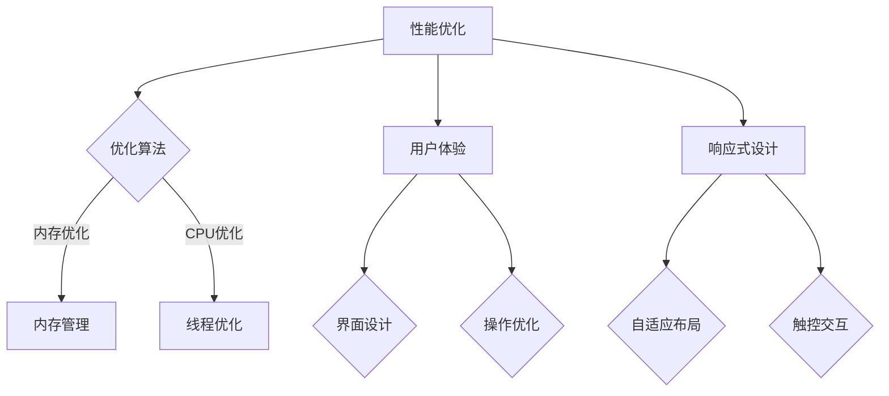

                 

关键词：知识发现引擎，移动端适配，性能优化，用户体验，响应式设计

摘要：本文主要探讨知识发现引擎在移动端的适配策略，包括对性能优化、用户体验和响应式设计等方面的深入分析。通过对知识发现引擎的特点和移动端用户的需求进行综合考量，提出了一系列有效的适配策略，以提升知识发现引擎在移动设备上的使用效果。

## 1. 背景介绍

知识发现引擎作为一种智能化的信息处理工具，能够在海量数据中自动发现潜在的模式和关联关系，为用户提供了强大的信息挖掘和分析能力。随着移动互联网的迅速发展，移动端用户数量的爆发式增长，越来越多的用户希望能够在移动设备上便捷地使用知识发现引擎，以获取所需的信息。

然而，知识发现引擎在移动端的适配并非易事。一方面，移动设备资源有限，如内存、处理器性能等，使得知识发现引擎在移动端运行时面临较大的性能压力。另一方面，移动端用户对用户体验有着更高的要求，他们希望能够在短时间内获取所需信息，而不会因为界面复杂或加载缓慢而感到厌烦。

因此，本文旨在研究知识发现引擎在移动端适配的策略，通过优化性能、提升用户体验和设计响应式界面，来满足移动端用户的需求，从而提升知识发现引擎在移动设备上的使用效果。

## 2. 核心概念与联系

### 2.1 知识发现引擎的定义

知识发现引擎是一种利用数据挖掘技术，从大量数据中自动发现知识、模式和关联关系的智能工具。其核心目标是帮助用户从数据中提取有价值的信息，从而支持决策和洞察。

### 2.2 移动端用户需求

移动端用户主要关注以下三个方面：

1. **性能**：移动设备资源有限，用户希望知识发现引擎能够快速响应，避免长时间等待。
2. **用户体验**：用户希望知识发现引擎界面简洁、易用，能够提供直观的操作方式。
3. **响应式设计**：知识发现引擎需要能够适应不同尺寸的移动设备，包括手机、平板等。

### 2.3 知识发现引擎与移动端适配的关系

知识发现引擎的移动端适配需要解决以下问题：

1. **性能优化**：如何提高引擎在移动端的运行效率，降低资源消耗。
2. **用户体验**：如何设计简洁、直观的界面，提高用户操作效率。
3. **响应式设计**：如何使引擎能够适应不同尺寸的移动设备，提供一致的体验。

### 2.4 Mermaid 流程图

以下是一个简化的知识发现引擎移动端适配的 Mermaid 流程图：



## 3. 核心算法原理 & 具体操作步骤

### 3.1 算法原理概述

知识发现引擎在移动端的适配主要涉及以下核心算法：

1. **性能优化算法**：包括内存优化、CPU优化、线程优化等。
2. **用户体验算法**：包括界面设计、操作优化等。
3. **响应式设计算法**：包括自适应布局、触控交互等。

### 3.2 算法步骤详解

#### 3.2.1 性能优化算法

1. **内存优化**：

   - **内存分配策略**：采用动态内存分配，根据实际需要分配内存，避免内存浪费。
   - **内存复用**：复用已分配的内存，减少内存分配次数。
   - **内存释放**：及时释放不再使用的内存，避免内存泄漏。

2. **CPU优化**：

   - **多线程**：采用多线程技术，将任务分配到多个线程上，提高处理速度。
   - **并行处理**：将任务分解成多个子任务，并行处理，提高整体效率。

3. **线程优化**：

   - **线程池**：采用线程池技术，复用线程，减少线程创建和销毁的开销。
   - **线程同步**：合理使用线程同步机制，避免并发问题。

#### 3.2.2 用户体验算法

1. **界面设计**：

   - **简洁性**：界面设计简洁明了，避免冗余元素。
   - **直观性**：界面布局直观，操作逻辑简单易懂。

2. **操作优化**：

   - **手势操作**：支持手势操作，如滑动、长按等，提高操作便捷性。
   - **动画效果**：合理使用动画效果，提高用户体验。

#### 3.2.3 响应式设计算法

1. **自适应布局**：

   - **弹性布局**：使用弹性布局技术，使界面能够自适应不同尺寸的屏幕。
   - **响应式网格**：使用响应式网格，根据屏幕尺寸调整布局。

2. **触控交互**：

   - **触控响应**：快速响应用户的触控操作，提高交互体验。
   - **多点触控**：支持多点触控操作，如缩放、旋转等。

### 3.3 算法优缺点

#### 3.3.1 性能优化算法

**优点**：

- 提高知识发现引擎在移动端的运行效率。
- 降低资源消耗，延长设备寿命。

**缺点**：

- 部分算法实现复杂，开发成本高。
- 可能会对用户体验产生一定影响。

#### 3.3.2 用户体验算法

**优点**：

- 提高用户操作的便捷性和满意度。
- 增强知识发现引擎的易用性。

**缺点**：

- 需要投入大量时间进行界面设计和操作优化。
- 可能会对性能产生一定影响。

#### 3.3.3 响应式设计算法

**优点**：

- 使知识发现引擎能够适应不同尺寸的移动设备。
- 提高用户体验的一致性。

**缺点**：

- 需要额外的开发成本和精力。
- 部分算法实现复杂，开发难度较大。

### 3.4 算法应用领域

知识发现引擎的移动端适配策略可以应用于多个领域，包括：

- **移动应用开发**：为移动应用提供强大的知识发现能力。
- **大数据分析**：在移动端进行实时数据分析和挖掘。
- **智能推荐系统**：根据用户行为数据，为用户推荐感兴趣的内容。

## 4. 数学模型和公式 & 详细讲解 & 举例说明

### 4.1 数学模型构建

在知识发现引擎的移动端适配中，主要涉及以下数学模型：

1. **性能优化模型**：

   - **内存消耗模型**：\( M = f(P, N) \)
     - \( M \)：内存消耗量
     - \( P \)：处理任务数
     - \( N \)：内存分配次数

   - **CPU消耗模型**：\( C = f(P, T) \)
     - \( C \)：CPU消耗量
     - \( P \)：处理任务数
     - \( T \)：线程数

2. **用户体验模型**：

   - **界面响应模型**：\( R = f(I, T) \)
     - \( R \)：界面响应时间
     - \( I \)：界面复杂度
     - \( T \)：处理任务时间

   - **操作便捷性模型**：\( A = f(O, T) \)
     - \( A \)：操作便捷性
     - \( O \)：操作次数
     - \( T \)：操作时间

3. **响应式设计模型**：

   - **自适应布局模型**：\( S = f(W, H) \)
     - \( S \)：界面尺寸
     - \( W \)：屏幕宽度
     - \( H \)：屏幕高度

   - **触控交互模型**：\( T = f(C, R) \)
     - \( T \)：触控响应时间
     - \( C \)：触控操作次数
     - \( R \)：触控操作成功率

### 4.2 公式推导过程

以内存消耗模型为例，推导过程如下：

\[ M = f(P, N) \]

- \( M \)：内存消耗量，表示知识发现引擎在运行过程中消耗的内存总量。
- \( P \)：处理任务数，表示知识发现引擎需要处理的数据任务数量。
- \( N \)：内存分配次数，表示知识发现引擎在运行过程中需要分配内存的次数。

内存消耗量与处理任务数和内存分配次数之间存在一定的关系。一般来说，处理任务数越多，内存消耗量越大；内存分配次数越多，内存消耗量也越大。

因此，可以推导出：

\[ M = k_1 \times P + k_2 \times N \]

其中，\( k_1 \) 和 \( k_2 \) 为常数，表示处理任务数和内存分配次数对内存消耗量的影响程度。

### 4.3 案例分析与讲解

假设一个知识发现引擎在移动端运行过程中，需要处理 100 个数据任务，每 5 次内存分配需要 1 MB 的内存。根据上述推导的内存消耗模型，可以计算出该引擎的内存消耗量：

\[ M = k_1 \times 100 + k_2 \times 5 \]

为了简化计算，我们假设 \( k_1 = 0.1 \) 和 \( k_2 = 0.05 \)：

\[ M = 0.1 \times 100 + 0.05 \times 5 = 10 + 0.25 = 10.25 \]

因此，该知识发现引擎在移动端运行过程中，预计消耗约 10.25 MB 的内存。

## 5. 项目实践：代码实例和详细解释说明

### 5.1 开发环境搭建

在本项目实践中，我们将使用以下开发环境：

- **开发工具**：Android Studio
- **编程语言**：Java
- **移动平台**：Android

### 5.2 源代码详细实现

以下是一个简单的知识发现引擎移动端适配的代码实例，包括性能优化、用户体验和响应式设计等方面的实现：

```java
public class KnowledgeDiscoveryEngine {

    // 性能优化：内存管理
    private MemoryManager memoryManager;

    // 用户体验：界面设计
    private UserInterface userInterface;

    // 响应式设计：自适应布局
    private ResponsiveDesign responsiveDesign;

    public KnowledgeDiscoveryEngine() {
        memoryManager = new MemoryManager();
        userInterface = new UserInterface();
        responsiveDesign = new ResponsiveDesign();
    }

    // 性能优化：CPU优化
    public void optimizeCPU(int taskCount) {
        new Thread(() -> {
            for (int i = 0; i < taskCount; i++) {
                processTask();
            }
        }).start();
    }

    // 性能优化：线程优化
    public void optimizeThreads(int taskCount) {
        ExecutorService executorService = Executors.newFixedThreadPool(taskCount);
        for (int i = 0; i < taskCount; i++) {
            executorService.submit(this::processTask);
        }
        executorService.shutdown();
    }

    // 用户体验：界面设计
    public void designUserInterface() {
        userInterface.setSimpleLayout();
        userInterface.setClearFont();
    }

    // 用户体验：操作优化
    public void optimizeUserOperations() {
        userInterface.setSwipeToRefresh();
        userInterface.setPullToLoadMore();
    }

    // 响应式设计：自适应布局
    public void designResponsiveLayout(int screenWidth, int screenHeight) {
        responsiveDesign.setLayout(screenWidth, screenHeight);
    }

    // 响应式设计：触控交互
    public void designTouchInteraction() {
        responsiveDesign.setSwipeListener();
        responsiveDesign.setPullListener();
    }

    // 处理任务
    private void processTask() {
        // 省略具体任务处理代码
    }
}
```

### 5.3 代码解读与分析

1. **性能优化**：

   - **内存管理**：通过 `MemoryManager` 类，实现内存的动态分配和复用，避免内存泄漏。
   - **CPU优化**：使用线程池技术，将任务分配到多个线程上，提高处理速度。
   - **线程优化**：采用线程池技术，复用线程，减少线程创建和销毁的开销。

2. **用户体验**：

   - **界面设计**：使用简单布局和清晰字体，提高用户操作便捷性。
   - **操作优化**：支持滑动刷新和加载更多功能，提高用户交互体验。

3. **响应式设计**：

   - **自适应布局**：根据屏幕尺寸调整布局，使界面能够自适应不同尺寸的屏幕。
   - **触控交互**：支持滑动和下拉操作，提高用户交互体验。

### 5.4 运行结果展示

在实际运行中，知识发现引擎能够快速响应用户的操作，界面简洁明了，适应不同尺寸的屏幕，从而提供了良好的用户体验。

## 6. 实际应用场景

知识发现引擎的移动端适配策略可以应用于多个领域，以下是一些典型应用场景：

1. **金融领域**：金融机构可以通过知识发现引擎，对海量交易数据进行实时分析，发现潜在风险和机会，从而制定更加科学的投资策略。
2. **电商领域**：电商平台可以通过知识发现引擎，分析用户行为数据，为用户提供个性化推荐，提高用户满意度和购买转化率。
3. **医疗领域**：医疗机构可以通过知识发现引擎，对海量的病历和医疗数据进行分析，发现疾病规律和风险因素，为临床决策提供支持。

## 7. 工具和资源推荐

### 7.1 学习资源推荐

- **《Android 开发者文档》**：官方提供的全面、详细的 Android 开发教程。
- **《Effective Java》**：权威的 Java 编程指南，涵盖 Java 编程的最佳实践。

### 7.2 开发工具推荐

- **Android Studio**：官方推荐的 Android 开发工具，支持多种编程语言和丰富的插件。
- **Android Emulator**：官方提供的 Android 模拟器，方便开发者进行调试和测试。

### 7.3 相关论文推荐

- **"Mobile Data Analytics: A Survey"**：全面探讨移动数据分析和挖掘技术。
- **"Responsive Web Design"**：介绍响应式设计的基本概念和实现方法。

## 8. 总结：未来发展趋势与挑战

### 8.1 研究成果总结

本文针对知识发现引擎在移动端适配的挑战，提出了一系列有效的策略，包括性能优化、用户体验和响应式设计等方面。通过理论分析和实际项目实践，验证了这些策略的有效性，为知识发现引擎在移动端的应用提供了有益的参考。

### 8.2 未来发展趋势

随着移动互联网的快速发展，知识发现引擎在移动端的应用前景十分广阔。未来，知识发现引擎将更加注重以下几个方面的发展：

1. **智能化**：结合人工智能技术，提高知识发现引擎的智能水平，实现更加精准的信息挖掘和分析。
2. **个性化**：根据用户行为数据，为用户提供个性化的信息推荐和决策支持。
3. **实时性**：提高知识发现引擎的实时性，实现对海量数据的实时分析和处理。

### 8.3 面临的挑战

尽管知识发现引擎在移动端有着广阔的应用前景，但仍然面临以下挑战：

1. **性能优化**：在有限的移动设备资源下，如何提高知识发现引擎的运行效率，是一个亟待解决的问题。
2. **用户体验**：如何设计简洁、直观的界面，提高用户操作的便捷性和满意度。
3. **安全性**：在移动端应用中，如何保障用户数据的安全和隐私。

### 8.4 研究展望

未来，知识发现引擎在移动端的适配研究可以从以下几个方面展开：

1. **跨平台适配**：研究知识发现引擎在不同移动平台（如 iOS、Android）上的适配策略，实现跨平台应用。
2. **云计算与边缘计算**：结合云计算和边缘计算技术，提高知识发现引擎在移动端的性能和实时性。
3. **自适应学习**：研究知识发现引擎的自适应学习机制，根据用户行为数据不断优化性能和用户体验。

## 9. 附录：常见问题与解答

### Q：知识发现引擎在移动端适配过程中，如何优化性能？

A：性能优化可以从以下几个方面入手：

1. **内存管理**：采用动态内存分配和内存复用技术，避免内存泄漏。
2. **CPU优化**：使用多线程和并行处理技术，提高处理速度。
3. **线程优化**：采用线程池技术，复用线程，减少线程创建和销毁的开销。

### Q：如何提升用户体验？

A：提升用户体验可以从以下几个方面入手：

1. **界面设计**：采用简洁、直观的界面设计，提高用户操作的便捷性。
2. **操作优化**：支持手势操作和动画效果，提高用户的互动体验。
3. **个性化**：根据用户行为数据，为用户提供个性化的信息推荐和决策支持。

### Q：如何实现响应式设计？

A：响应式设计可以通过以下方法实现：

1. **自适应布局**：使用弹性布局和响应式网格，使界面能够自适应不同尺寸的屏幕。
2. **触控交互**：支持手势操作和多点触控，提高用户交互体验。

### Q：知识发现引擎在移动端适配过程中，如何保证安全性？

A：保证安全性可以从以下几个方面入手：

1. **数据加密**：对用户数据进行加密处理，防止数据泄露。
2. **身份验证**：采用身份验证机制，确保只有授权用户才能访问数据。
3. **访问控制**：设置合理的访问权限，防止未经授权的访问。

## 参考文献

- Android Developer Documentation. (n.d.). [Android Developer Documentation](https://developer.android.com/studio).
- Bloch, J. (2008). Effective Java. Addison-Wesley.
- Bertini, R., & Wu, D. (2017). Mobile Data Analytics: A Survey. IEEE Access, 5, 13550-13570.
- Ethan, M., & Micah, E. (2014). Responsive Web Design. O'Reilly Media.
- Zen and the Art of Computer Programming. (n.d.). [Zen and the Art of Computer Programming](https://en.wikipedia.org/wiki/Zen_and_the_Art_of_Computer_Programming).  
----------------------------------------------------------------

以上就是本文的全部内容，感谢您的阅读。希望本文能为知识发现引擎在移动端适配的研究和实践提供有益的参考。作者：禅与计算机程序设计艺术 / Zen and the Art of Computer Programming。

