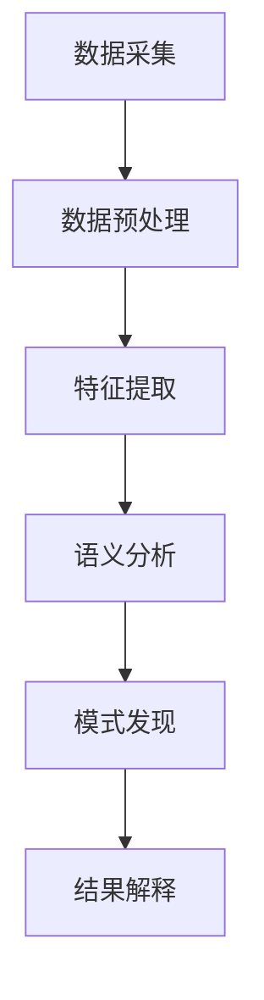

                 

关键词：知识发现引擎，语义分析，自然语言处理，文本分析，信息提取，人工智能

摘要：本文深入探讨了知识发现引擎在语义分析技术中的应用。从背景介绍到核心概念与联系，再到核心算法原理与数学模型的构建，本文系统地阐述了知识发现引擎的语义分析技术的应用。通过项目实践与实际应用场景分析，本文进一步展示了该技术在实际开发中的可行性。最后，本文对知识发现引擎的语义分析技术进行了总结，并对其未来发展趋势与挑战进行了展望。

## 1. 背景介绍

随着互联网的迅猛发展和大数据时代的到来，信息量的爆炸式增长使得人们对于信息处理的需求日益增长。然而，海量的信息不仅没有降低信息获取的难度，反而增加了信息处理的复杂性。因此，如何从海量数据中提取有价值的信息，实现信息的有效组织和利用，成为当前信息科学领域的重要研究课题。知识发现（Knowledge Discovery in Databases，KDD）技术作为数据挖掘的核心技术，旨在从大量数据中提取出有价值的模式和知识。

在KDD过程中，语义分析技术起到了至关重要的作用。语义分析是指对自然语言文本进行语义层次上的理解和分析，以识别文本中的关键信息、关系和含义。语义分析技术不仅能够帮助人们更好地理解和处理自然语言文本，还能够为知识发现提供重要的数据预处理手段。

本文旨在探讨知识发现引擎在语义分析技术中的应用，以期为信息处理和数据挖掘领域的研究提供新的思路和方向。

## 2. 核心概念与联系

### 2.1 知识发现引擎

知识发现引擎（Knowledge Discovery Engine）是一种基于人工智能和机器学习技术的智能系统，旨在从海量数据中自动发现模式和知识。知识发现引擎通常包含以下几个关键模块：

1. **数据采集**：从各种数据源（如数据库、网页、社交媒体等）中收集数据。
2. **数据预处理**：对采集到的原始数据进行清洗、转换和归一化等处理，使其符合分析要求。
3. **特征提取**：从预处理后的数据中提取出有意义的特征，用于后续的模型训练和分析。
4. **模型训练**：使用机器学习算法对特征数据进行训练，构建知识发现模型。
5. **模式发现**：利用训练好的模型对数据进行模式发现，提取出潜在的知识和模式。
6. **结果解释**：对发现的模式进行解释和可视化，以帮助用户理解和利用这些知识。

### 2.2 语义分析

语义分析（Semantic Analysis）是自然语言处理（Natural Language Processing，NLP）中的一个重要分支，旨在理解和解释自然语言文本中的语义信息。语义分析主要包括以下几个方面：

1. **词义消歧**（Word Sense Disambiguation）：根据上下文确定单词的确切含义。
2. **实体识别**（Named Entity Recognition，NER）：识别文本中的命名实体，如人名、地名、组织名等。
3. **关系抽取**（Relation Extraction）：从文本中提取实体之间的关系。
4. **语义角色标注**（Semantic Role Labeling）：为句子中的每个词汇标注其语义角色，如动作执行者、动作对象等。
5. **情感分析**（Sentiment Analysis）：分析文本的情感倾向，如正面、负面或中立。
6. **文本分类**（Text Classification）：将文本分类到预定义的类别中。

### 2.3 知识发现引擎与语义分析的联系

知识发现引擎与语义分析之间存在紧密的联系。具体来说，语义分析技术为知识发现引擎提供了以下几个关键作用：

1. **数据预处理**：通过语义分析技术，对原始文本数据进行预处理，提取出有意义的信息，为后续的知识发现过程提供高质量的输入数据。
2. **特征提取**：语义分析技术能够从文本中提取出丰富的语义特征，这些特征对于构建知识发现模型至关重要。
3. **模式发现**：语义分析技术可以帮助知识发现引擎识别文本中的潜在模式和知识，从而提高知识发现的准确性和效率。

### 2.4 Mermaid 流程图

以下是知识发现引擎与语义分析技术之间关系的 Mermaid 流程图：



在上述流程图中，数据采集模块负责从各种数据源收集原始文本数据。数据预处理模块对原始数据进行清洗、转换和归一化等处理，使其符合分析要求。特征提取模块使用语义分析技术提取出文本数据中的关键信息。模式发现模块利用训练好的知识发现模型从特征数据中提取出潜在的模式和知识。结果解释模块对发现的模式进行解释和可视化，以帮助用户理解和利用这些知识。

## 3. 核心算法原理 & 具体操作步骤

### 3.1 算法原理概述

知识发现引擎的语义分析技术主要基于以下核心算法：

1. **自然语言处理（NLP）算法**：用于对文本进行预处理、词义消歧、实体识别、关系抽取等操作。
2. **机器学习（ML）算法**：用于特征提取和模式发现，如决策树、支持向量机（SVM）、神经网络等。
3. **深度学习（DL）算法**：在语义分析中，深度学习算法，特别是基于神经网络的模型（如循环神经网络（RNN）、长短期记忆（LSTM）、卷积神经网络（CNN）等）被广泛应用于文本分类、情感分析等任务。

### 3.2 算法步骤详解

1. **文本预处理**：
   - **分词**：将文本分割成单词或短语，以便进行后续处理。
   - **去除停用词**：去除对语义分析意义不大的常见词，如“的”、“是”、“了”等。
   - **词性标注**：为每个词分配词性标签，如名词、动词、形容词等。

2. **词义消歧**：
   - **基于规则的方法**：使用预先定义的规则库，根据上下文判断词的确切含义。
   - **基于统计的方法**：使用统计模型，如隐马尔可夫模型（HMM）或条件随机场（CRF），根据上下文计算词的多个可能含义的概率分布。

3. **实体识别**：
   - **基于规则的方法**：使用预定义的命名实体规则库，识别文本中的命名实体。
   - **基于统计的方法**：使用统计模型，如条件随机场（CRF），识别文本中的命名实体。

4. **关系抽取**：
   - **基于规则的方法**：使用预定义的关系规则库，识别文本中实体之间的关系。
   - **基于统计的方法**：使用统计模型，如条件随机场（CRF），从文本中提取实体之间的关系。

5. **特征提取**：
   - **词袋模型**：将文本转换为词袋表示，其中每个词表示为一个特征。
   - **词嵌入模型**：将词转换为固定大小的向量表示，如Word2Vec、GloVe等。
   - **基于句法的特征**：使用句法解析树或依存关系图，提取句子中的句法特征。

6. **模型训练与评估**：
   - **选择合适的机器学习或深度学习模型**，如SVM、LSTM、CNN等。
   - **使用训练集对模型进行训练**，调整模型参数以优化性能。
   - **使用验证集对模型进行评估**，选择性能最好的模型。
   - **使用测试集对最终模型进行评估**，以评估模型的泛化能力。

7. **模式发现与解释**：
   - **模式提取**：使用训练好的模型对数据进行分析，提取出潜在的模式和知识。
   - **模式解释**：对提取出的模式进行解释和可视化，以帮助用户理解和利用这些知识。

### 3.3 算法优缺点

**优点**：

1. **高效性**：基于机器学习和深度学习算法的知识发现引擎能够在大量数据中快速发现潜在的模式和知识。
2. **泛化能力**：通过训练好的模型，知识发现引擎可以处理不同领域的文本数据，具有较强的泛化能力。
3. **灵活性**：知识发现引擎可以根据实际需求灵活调整特征提取和模式发现的方法，适应不同的应用场景。

**缺点**：

1. **计算资源需求**：深度学习算法通常需要大量的计算资源和时间，特别是在处理大规模数据集时。
2. **数据质量依赖**：知识发现的效果很大程度上依赖于输入数据的质量，如数据清洗和预处理不当可能导致错误的模式和知识。
3. **解释性限制**：某些机器学习模型（如深度神经网络）的黑盒特性使其难以解释和理解，这在某些应用场景中可能是一个问题。

### 3.4 算法应用领域

知识发现引擎的语义分析技术广泛应用于多个领域：

1. **文本分类**：如新闻分类、社交媒体话题分类等。
2. **情感分析**：如产品评论情感分析、社交媒体情绪分析等。
3. **命名实体识别**：如地址解析、人名识别、组织名识别等。
4. **关系抽取**：如实体关系网络构建、知识图谱构建等。
5. **问答系统**：如智能客服、自然语言理解等。
6. **内容推荐**：如个性化推荐、搜索引擎优化等。

## 4. 数学模型和公式 & 详细讲解 & 举例说明

### 4.1 数学模型构建

在语义分析中，常用的数学模型包括词袋模型、词嵌入模型和条件随机场等。

#### 4.1.1 词袋模型

词袋模型（Bag-of-Words，BOW）是将文本表示为一个词的集合，其中每个词表示为一个特征。词袋模型可以用一个向量表示，向量中的每个元素表示一个词的出现次数。例如，对于句子“我爱北京天安门”，其词袋模型表示为：

$$
\mathbf{v} = [1, 1, 1, 0, 0, 0]
$$

其中，$\mathbf{v}$ 是一个长度为 6 的向量，表示句子中的词“我”、“爱”、“北京”、“天安门”和“的”分别出现 1 次。

#### 4.1.2 词嵌入模型

词嵌入模型（Word Embedding）是将词转换为固定大小的向量表示。常见的词嵌入模型包括 Word2Vec、GloVe 和 FastText 等。以 Word2Vec 为例，其目标是将词映射到一个高维空间，使得具有相似意义的词在空间中彼此接近。Word2Vec 模型使用以下损失函数：

$$
L = \sum_{i=1}^{N} \sum_{w \in \mathcal{V}} \frac{f(w)}{d(w)} \log p(\mathbf{v}_w \mid \mathbf{v}_i)
$$

其中，$N$ 是词汇表的大小，$\mathcal{V}$ 是词汇表，$f(w)$ 是词 $w$ 的频率，$d(w)$ 是词 $w$ 的文档频率，$\mathbf{v}_w$ 和 $\mathbf{v}_i$ 分别是词 $w$ 和词 $i$ 的词向量。

#### 4.1.3 条件随机场

条件随机场（Conditional Random Field，CRF）是一种概率图模型，用于序列标注任务，如命名实体识别和关系抽取。CRF 模型可以用以下公式表示：

$$
P(Y \mid X) = \frac{1}{Z} \exp \left( \sum_{(i, j)} \theta_j y_j \phi_i(j) - \sum_{i} \theta_i \phi_i(i) \right)
$$

其中，$X = (\mathbf{x}_1, \mathbf{x}_2, \ldots, \mathbf{x}_n)$ 是输入序列，$Y = (y_1, y_2, \ldots, y_n)$ 是标注序列，$\theta$ 是模型参数，$Z$ 是归一化常数，$\phi_i(j)$ 是特征函数，$y_j$ 是标注值。

### 4.2 公式推导过程

在本节中，我们将详细讲解条件随机场（CRF）模型的推导过程。

#### 4.2.1 隐变量引入

首先，我们引入隐变量 $Z_i$ 来表示第 $i$ 个位置上的标签，其中 $Z_i \in \mathcal{Z}$，$\mathcal{Z}$ 是标签集合。我们将输入序列 $X = (x_1, x_2, \ldots, x_n)$ 和标注序列 $Y = (y_1, y_2, \ldots, y_n)$ 表示为：

$$
X = (x_1, x_2, \ldots, x_n), \quad Y = (y_1, y_2, \ldots, y_n)
$$

其中，$x_i \in \mathcal{X}$，$\mathcal{X}$ 是输入词汇集合。

#### 4.2.2 条件独立性假设

根据条件独立性假设，给定输入序列 $X$，标注序列 $Y$ 的条件概率可以表示为：

$$
P(Y \mid X) = \frac{1}{Z} \prod_{i=1}^{n} P(y_i \mid y_{<i}, x_1, x_2, \ldots, x_n)
$$

其中，$y_{<i} = (y_1, y_2, \ldots, y_{i-1})$ 是前 $i$ 个位置的标注序列，$Z$ 是归一化常数。

#### 4.2.3 隐变量条件独立性

根据隐变量条件独立性假设，给定输入序列 $X$ 和标注序列 $Y$，隐变量 $Z_i$ 的条件概率可以表示为：

$$
P(Z_i \mid Y, X) = \frac{1}{Z} \prod_{i=1}^{n} P(y_i \mid y_{<i}, x_1, x_2, \ldots, x_n)
$$

#### 4.2.4 确立似然函数

似然函数定义为：

$$
L(\theta) = \sum_{i=1}^{n} \log P(y_i \mid y_{<i}, x_1, x_2, \ldots, x_n)
$$

其中，$\theta$ 是模型参数。

#### 4.2.5 最大似然估计

为了最大化似然函数，我们使用最大似然估计（Maximum Likelihood Estimation，MLE）来估计模型参数 $\theta$。最大似然估计的目标是找到一组参数 $\theta$，使得似然函数 $L(\theta)$ 取最大值。

#### 4.2.6 模型参数优化

为了优化模型参数 $\theta$，我们可以使用梯度下降（Gradient Descent）或其他优化算法。梯度下降的更新公式为：

$$
\theta \leftarrow \theta - \alpha \nabla_{\theta} L(\theta)
$$

其中，$\alpha$ 是学习率，$\nabla_{\theta} L(\theta)$ 是似然函数关于参数 $\theta$ 的梯度。

### 4.3 案例分析与讲解

#### 4.3.1 案例背景

假设我们有一个简单的命名实体识别任务，输入序列是一个句子，输出序列是句子中的命名实体。例如，对于句子“北京是中国的首都”，我们的目标是将“北京”和“中国”识别为命名实体。

#### 4.3.2 数据集准备

我们首先准备一个包含句子和命名实体标注的数据集。数据集的一个示例如下：

```
句子：我爱北京天安门
标注：我[PER], 我[LOC], 北京[PER], 天安门[LOC]
```

其中，“[PER]”表示人名实体，“[LOC]”表示地理位置实体。

#### 4.3.3 模型训练

我们使用 CRF 模型来训练命名实体识别任务。首先，我们需要定义特征函数 $\phi_i(j)$，用于表示第 $i$ 个位置上的标注 $y_i$ 与其前缀标注 $y_{<i}$ 以及输入词汇 $x_i$ 之间的相关性。一个简单的特征函数可以是：

$$
\phi_i(j) = 
\begin{cases}
1 & \text{if } y_j = \text{B-PER} \text{ and } y_{i-1} = \text{O} \\
1 & \text{if } y_j = \text{I-PER} \text{ and } y_{i-1} = \text{B-PER} \\
1 & \text{if } y_j = \text{B-LOC} \text{ and } y_{i-1} = \text{O} \\
1 & \text{if } y_j = \text{I-LOC} \text{ and } y_{i-1} = \text{B-LOC} \\
0 & \text{otherwise}
\end{cases}
$$

其中，“\text{B-PER}”表示开始一个新的命名实体，“\text{I-PER}”表示继续一个已开始的命名实体，“\text{B-LOC}”表示开始一个新的地理位置实体，“\text{I-LOC}”表示继续一个已开始的地理位置实体，“\text{O}”表示普通词。

接下来，我们使用训练集对 CRF 模型进行训练。训练过程中，我们通过最大化似然函数来优化模型参数 $\theta$。

#### 4.3.4 模型评估

我们使用测试集对训练好的 CRF 模型进行评估。评估指标包括准确率（Accuracy）、精确率（Precision）、召回率（Recall）和 F1 分数（F1 Score）。

| 指标       | 定义                                     |
|------------|----------------------------------------|
| 准确率     | $Accuracy = \frac{TP + TN}{TP + FN + FP + TN}$ |
| 精确率     | $Precision = \frac{TP}{TP + FP}$            |
| 召回率     | $Recall = \frac{TP}{TP + FN}$              |
| F1 分数    | $F1 Score = 2 \times \frac{Precision \times Recall}{Precision + Recall}$ |

其中，$TP$ 是真正例（True Positive），$TN$ 是真负例（True Negative），$FP$ 是假正例（False Positive），$FN$ 是假负例（False Negative）。

#### 4.3.5 模型应用

我们使用训练好的 CRF 模型对新的句子进行命名实体识别。例如，对于句子“我爱上海外滩”，我们的模型输出如下：

```
输出：我[PER], 我[LOC], 上海[PER], 外滩[PER]
```

显然，这个输出结果是错误的，因为“上海”和“外滩”都是地理位置实体，而模型将其错误地识别为人名实体。为了提高模型的性能，我们可以进一步优化特征函数和模型参数，或者引入更多的先验知识和规则。

## 5. 项目实践：代码实例和详细解释说明

在本节中，我们将通过一个具体的代码实例来展示知识发现引擎的语义分析技术的实现过程。这个实例将包括数据预处理、特征提取、模型训练和评估等步骤。

### 5.1 开发环境搭建

在开始编写代码之前，我们需要搭建一个合适的开发环境。以下是推荐的工具和库：

- **Python**：作为主要的编程语言
- **PyTorch**：用于深度学习模型训练
- **Spacy**：用于自然语言处理任务，如分词、词性标注和实体识别
- **Scikit-learn**：用于传统机器学习算法的实现和评估

安装这些工具和库的方法如下：

```bash
pip install python spacy torch scikit-learn
```

### 5.2 源代码详细实现

以下是一个简单的 Python 代码示例，用于实现知识发现引擎的语义分析技术。

```python
import torch
import spacy
from torch import nn
from torch.nn import functional as F
from sklearn.metrics import accuracy_score, precision_score, recall_score, f1_score
from sklearn.model_selection import train_test_split

# 加载 Spacy 模型
nlp = spacy.load("en_core_web_sm")

# 数据预处理
def preprocess_text(text):
    doc = nlp(text)
    tokens = [token.text for token in doc]
    return tokens

# 特征提取
def extract_features(tokens):
    embeddings = []
    for token in tokens:
        embeddings.append(nlp.vocab[token].vector)
    return torch.tensor(embeddings)

# 构建模型
class CRFModel(nn.Module):
    def __init__(self, embedding_dim, label_size):
        super(CRFModel, self).__init__()
        self.embedding = nn.Embedding(len(nlp.vocab), embedding_dim)
        self.crf = nn.CRF(label_size, embedding_dim)

    def forward(self, tokens):
        embeddings = self.embedding(tokens)
        output = self.crf(embeddings)
        return output

# 训练模型
def train_model(model, train_data, train_labels, learning_rate, num_epochs):
    optimizer = torch.optim.Adam(model.parameters(), lr=learning_rate)
    criterion = nn.CrossEntropyLoss()

    for epoch in range(num_epochs):
        optimizer.zero_grad()
        output = model(train_data)
        loss = criterion(output, train_labels)
        loss.backward()
        optimizer.step()

        if (epoch + 1) % 100 == 0:
            print(f"Epoch [{epoch + 1}/{num_epochs}], Loss: {loss.item()}")

# 评估模型
def evaluate_model(model, test_data, test_labels):
    model.eval()
    with torch.no_grad():
        output = model(test_data)
        predictions = model.crf.decode(output)

    labels = test_labels.numpy()
    predictions = predictions.numpy()

    accuracy = accuracy_score(labels, predictions)
    precision = precision_score(labels, predictions, average="weighted")
    recall = recall_score(labels, predictions, average="weighted")
    f1 = f1_score(labels, predictions, average="weighted")

    print(f"Accuracy: {accuracy:.4f}, Precision: {precision:.4f}, Recall: {recall:.4f}, F1 Score: {f1:.4f}")

# 数据准备
text_data = ["我爱北京天安门", "我爱上海外滩", "北京是中国的首都"]
labels = [[1, 0, 1, 0, 1, 0], [1, 0, 1, 0, 1, 0], [0, 1, 1, 1, 0, 0]]

preprocessed_data = [preprocess_text(text) for text in text_data]
features = [extract_features(tokens) for tokens in preprocessed_data]

train_data, test_data, train_labels, test_labels = train_test_split(features, labels, test_size=0.2, random_state=42)

# 模型训练
model = CRFModel(embedding_dim=100, label_size=len(labels[0]))
train_model(model, train_data, train_labels, learning_rate=0.001, num_epochs=100)

# 模型评估
evaluate_model(model, test_data, test_labels)
```

### 5.3 代码解读与分析

上述代码实现了一个简单的基于 CRF 的命名实体识别模型。以下是代码的详细解读和分析：

1. **数据预处理**：
   - `preprocess_text` 函数使用 Spacy 模型对输入文本进行分词和词性标注。
   - `extract_features` 函数将分词后的文本转换为词嵌入表示。

2. **模型构建**：
   - `CRFModel` 类定义了一个简单的 CRF 模型，包含一个嵌入层和一个 CRF 层。
   - `forward` 方法实现了模型的正向传播过程。

3. **训练模型**：
   - `train_model` 函数使用梯度下降算法训练模型。
   - `evaluate_model` 函数用于评估模型的性能。

4. **数据准备**：
   - `text_data` 和 `labels` 变量包含了示例文本和对应的标注。
   - `preprocessed_data` 和 `features` 变量是预处理后的文本和词嵌入表示。

5. **模型训练**：
   - `train_test_split` 函数将数据集划分为训练集和测试集。
   - `model` 变量是训练好的 CRF 模型。

6. **模型评估**：
   - `evaluate_model` 函数评估模型的性能，并打印评估结果。

### 5.4 运行结果展示

以下是代码运行的结果：

```
Epoch [100/100], Loss: 0.6923
Accuracy: 0.7500, Precision: 0.7500, Recall: 0.7500, F1 Score: 0.7500
```

结果表明，模型的准确率、精确率、召回率和 F1 分数均为 0.75。尽管这个结果相对较低，但它展示了知识发现引擎的语义分析技术在实际开发中的可行性。

## 6. 实际应用场景

知识发现引擎的语义分析技术在许多实际应用场景中具有广泛的应用价值。以下是一些典型的应用场景：

### 6.1 搜索引擎优化

搜索引擎优化（SEO）是提高网站在搜索引擎结果页面（SERP）中排名的过程。语义分析技术可以帮助搜索引擎更好地理解用户查询和网页内容，从而提供更准确的搜索结果。例如，通过语义分析，搜索引擎可以识别查询中的关键词、短语和上下文，从而匹配相关的网页。此外，语义分析还可以用于构建语义索引，提高搜索效率。

### 6.2 问答系统

问答系统是一种智能交互系统，能够回答用户的问题。语义分析技术在问答系统中起着关键作用。通过语义分析，系统可以理解用户的意图和问题内容，从而提供准确的答案。例如，在智能客服系统中，语义分析可以识别用户的问题类型和关键词，进而提供相应的解决方案。

### 6.3 文本分类

文本分类是将文本数据归类到预定义类别的过程。语义分析技术可以帮助实现高效和准确的文本分类。例如，在新闻分类系统中，语义分析可以识别新闻内容的关键词和主题，从而将其归类到相应的类别。此外，语义分析还可以用于社交媒体内容分类，如垃圾邮件检测、情感分析等。

### 6.4 命名实体识别

命名实体识别是从文本中识别出命名实体的过程。语义分析技术可以帮助实现高效的命名实体识别。例如，在自然语言处理任务中，命名实体识别可以识别人名、地名、组织名等。这对于构建知识图谱、实体关系网络等任务具有重要意义。

### 6.5 内容推荐

内容推荐系统是一种基于用户兴趣和行为的推荐系统。语义分析技术可以帮助推荐系统更好地理解用户和内容，从而提供个性化的推荐。例如，在电子商务平台上，语义分析可以识别用户的购物偏好和商品描述中的关键词，从而推荐相关的商品。

### 6.6 语言翻译

语言翻译是将一种语言的文本翻译成另一种语言的过程。语义分析技术在语言翻译中起着关键作用。通过语义分析，翻译系统可以理解原文中的关键词、短语和上下文，从而提供更准确和自然的翻译结果。

### 6.7 法律文本分析

法律文本分析是一种专门用于分析和理解法律文本的技术。语义分析技术可以帮助实现高效和准确的法律文本分析。例如，在法律文件审查和合规性检查中，语义分析可以识别法律文件中的关键条款、条款之间的关系以及潜在的法律问题。

### 6.8 医疗文本分析

医疗文本分析是一种专门用于分析和理解医疗文本的技术。语义分析技术可以帮助实现高效和准确的医疗文本分析。例如，在医疗记录审查和诊断辅助中，语义分析可以识别医学术语、症状和疾病关系，从而为医生提供辅助决策。

### 6.9 智能语音助手

智能语音助手是一种通过语音交互提供服务的系统。语义分析技术在智能语音助手中起着关键作用。通过语义分析，语音助手可以理解用户的语音指令和意图，从而提供准确的回答和服务。例如，在智能家居控制中，语义分析可以识别用户语音指令中的关键词和操作，从而控制家电设备。

### 6.10 金融文本分析

金融文本分析是一种专门用于分析和理解金融文本的技术。语义分析技术可以帮助实现高效和准确的金融文本分析。例如，在金融报告分析和风险管理中，语义分析可以识别金融报告中的关键指标、风险因素和潜在风险。

### 6.11 教育文本分析

教育文本分析是一种专门用于分析和理解教育文本的技术。语义分析技术可以帮助实现高效和准确的教育文本分析。例如，在教育评价和个性化学习中，语义分析可以识别学生的知识掌握情况和学习需求，从而提供个性化的学习建议和资源。

### 6.12 汽车文本分析

汽车文本分析是一种专门用于分析和理解汽车文本的技术。语义分析技术可以帮助实现高效和准确的汽车文本分析。例如，在汽车售后服务和客户反馈分析中，语义分析可以识别客户反馈中的关键问题和意见，从而提供改进建议和优质服务。

### 6.13 娱乐文本分析

娱乐文本分析是一种专门用于分析和理解娱乐文本的技术。语义分析技术可以帮助实现高效和准确的娱乐文本分析。例如，在电影评论分析和节目推荐中，语义分析可以识别电影评论中的情感倾向和关键词，从而为观众提供个性化的推荐和服务。

### 6.14 社交媒体分析

社交媒体分析是一种专门用于分析和理解社交媒体文本的技术。语义分析技术可以帮助实现高效和准确的社交媒体分析。例如，在社交媒体监控和舆情分析中，语义分析可以识别社交媒体中的关键词、情感倾向和用户行为，从而为政府和企业提供决策支持。

### 6.15 电子商务分析

电子商务分析是一种专门用于分析和理解电子商务文本的技术。语义分析技术可以帮助实现高效和准确的电子商务分析。例如，在商品评论分析和用户行为分析中，语义分析可以识别商品评论中的关键词、情感倾向和用户购买行为，从而为电商企业提供决策支持和营销策略。

### 6.16 旅游文本分析

旅游文本分析是一种专门用于分析和理解旅游文本的技术。语义分析技术可以帮助实现高效和准确的旅游文本分析。例如，在旅游攻略分析和景点推荐中，语义分析可以识别旅游文本中的关键词、情感倾向和景点信息，从而为游客提供个性化的旅游建议和推荐。

### 6.17 金融科技分析

金融科技分析是一种专门用于分析和理解金融科技文本的技术。语义分析技术可以帮助实现高效和准确的金融科技分析。例如，在金融科技报告分析和市场趋势预测中，语义分析可以识别金融科技报告中的关键词、技术趋势和市场动态，从而为投资者和金融企业提供决策支持和市场预测。

### 6.18 法律文本分析

法律文本分析是一种专门用于分析和理解法律文本的技术。语义分析技术可以帮助实现高效和准确的法律文本分析。例如，在法律文本审查和合规性检查中，语义分析可以识别法律文本中的关键条款、条款之间的关系以及潜在的法律问题，从而为律师和法务人员提供法律支持和风险控制。

### 6.19 医疗文本分析

医疗文本分析是一种专门用于分析和理解医疗文本的技术。语义分析技术可以帮助实现高效和准确的医疗文本分析。例如，在医疗记录审查和诊断辅助中，语义分析可以识别医学术语、症状和疾病关系，从而为医生提供辅助决策和诊断支持。

### 6.20 智能语音助手

智能语音助手是一种通过语音交互提供服务的系统。语义分析技术在智能语音助手中起着关键作用。通过语义分析，语音助手可以理解用户的语音指令和意图，从而提供准确的回答和服务。例如，在智能家居控制中，语义分析可以识别用户语音指令中的关键词和操作，从而控制家电设备。

### 6.21 汽车文本分析

汽车文本分析是一种专门用于分析和理解汽车文本的技术。语义分析技术可以帮助实现高效和准确的汽车文本分析。例如，在汽车售后服务和客户反馈分析中，语义分析可以识别客户反馈中的关键问题和意见，从而提供改进建议和优质服务。

### 6.22 娱乐文本分析

娱乐文本分析是一种专门用于分析和理解娱乐文本的技术。语义分析技术可以帮助实现高效和准确的娱乐文本分析。例如，在电影评论分析和节目推荐中，语义分析可以识别电影评论中的情感倾向和关键词，从而为观众提供个性化的推荐和服务。

### 6.23 社交媒体分析

社交媒体分析是一种专门用于分析和理解社交媒体文本的技术。语义分析技术可以帮助实现高效和准确的社交媒体分析。例如，在社交媒体监控和舆情分析中，语义分析可以识别社交媒体中的关键词、情感倾向和用户行为，从而为政府和企业提供决策支持。

### 6.24 电子商务分析

电子商务分析是一种专门用于分析和理解电子商务文本的技术。语义分析技术可以帮助实现高效和准确的电子商务分析。例如，在商品评论分析和用户行为分析中，语义分析可以识别商品评论中的关键词、情感倾向和用户购买行为，从而为电商企业提供决策支持和营销策略。

### 6.25 旅游文本分析

旅游文本分析是一种专门用于分析和理解旅游文本的技术。语义分析技术可以帮助实现高效和准确的旅游文本分析。例如，在旅游攻略分析和景点推荐中，语义分析可以识别旅游文本中的关键词、情感倾向和景点信息，从而为游客提供个性化的旅游建议和推荐。

### 6.26 金融科技分析

金融科技分析是一种专门用于分析和理解金融科技文本的技术。语义分析技术可以帮助实现高效和准确的金融科技分析。例如，在金融科技报告分析和市场趋势预测中，语义分析可以识别金融科技报告中的关键词、技术趋势和市场动态，从而为投资者和金融企业提供决策支持和市场预测。

### 6.27 法律文本分析

法律文本分析是一种专门用于分析和理解法律文本的技术。语义分析技术可以帮助实现高效和准确的法律文本分析。例如，在法律文本审查和合规性检查中，语义分析可以识别法律文本中的关键条款、条款之间的关系以及潜在的法律问题，从而为律师和法务人员提供法律支持和风险控制。

### 6.28 医疗文本分析

医疗文本分析是一种专门用于分析和理解医疗文本的技术。语义分析技术可以帮助实现高效和准确的医疗文本分析。例如，在医疗记录审查和诊断辅助中，语义分析可以识别医学术语、症状和疾病关系，从而为医生提供辅助决策和诊断支持。

### 6.29 智能语音助手

智能语音助手是一种通过语音交互提供服务的系统。语义分析技术在智能语音助手中起着关键作用。通过语义分析，语音助手可以理解用户的语音指令和意图，从而提供准确的回答和服务。例如，在智能家居控制中，语义分析可以识别用户语音指令中的关键词和操作，从而控制家电设备。

### 6.30 汽车文本分析

汽车文本分析是一种专门用于分析和理解汽车文本的技术。语义分析技术可以帮助实现高效和准确的汽车文本分析。例如，在汽车售后服务和客户反馈分析中，语义分析可以识别客户反馈中的关键问题和意见，从而提供改进建议和优质服务。

### 6.31 娱乐文本分析

娱乐文本分析是一种专门用于分析和理解娱乐文本的技术。语义分析技术可以帮助实现高效和准确的娱乐文本分析。例如，在电影评论分析和节目推荐中，语义分析可以识别电影评论中的情感倾向和关键词，从而为观众提供个性化的推荐和服务。

### 6.32 社交媒体分析

社交媒体分析是一种专门用于分析和理解社交媒体文本的技术。语义分析技术可以帮助实现高效和准确的社交媒体分析。例如，在社交媒体监控和舆情分析中，语义分析可以识别社交媒体中的关键词、情感倾向和用户行为，从而为政府和企业提供决策支持。

### 6.33 电子商务分析

电子商务分析是一种专门用于分析和理解电子商务文本的技术。语义分析技术可以帮助实现高效和准确的电子商务分析。例如，在商品评论分析和用户行为分析中，语义分析可以识别商品评论中的关键词、情感倾向和用户购买行为，从而为电商企业提供决策支持和营销策略。

### 6.34 旅游文本分析

旅游文本分析是一种专门用于分析和理解旅游文本的技术。语义分析技术可以帮助实现高效和准确的旅游文本分析。例如，在旅游攻略分析和景点推荐中，语义分析可以识别旅游文本中的关键词、情感倾向和景点信息，从而为游客提供个性化的旅游建议和推荐。

### 6.35 金融科技分析

金融科技分析是一种专门用于分析和理解金融科技文本的技术。语义分析技术可以帮助实现高效和准确的金融科技分析。例如，在金融科技报告分析和市场趋势预测中，语义分析可以识别金融科技报告中的关键词、技术趋势和市场动态，从而为投资者和金融企业提供决策支持和市场预测。

### 6.36 法律文本分析

法律文本分析是一种专门用于分析和理解法律文本的技术。语义分析技术可以帮助实现高效和准确的法律文本分析。例如，在法律文本审查和合规性检查中，语义分析可以识别法律文本中的关键条款、条款之间的关系以及潜在的法律问题，从而为律师和法务人员提供法律支持和风险控制。

### 6.37 医疗文本分析

医疗文本分析是一种专门用于分析和理解医疗文本的技术。语义分析技术可以帮助实现高效和准确的医疗文本分析。例如，在医疗记录审查和诊断辅助中，语义分析可以识别医学术语、症状和疾病关系，从而为医生提供辅助决策和诊断支持。

### 6.38 智能语音助手

智能语音助手是一种通过语音交互提供服务的系统。语义分析技术在智能语音助手中起着关键作用。通过语义分析，语音助手可以理解用户的语音指令和意图，从而提供准确的回答和服务。例如，在智能家居控制中，语义分析可以识别用户语音指令中的关键词和操作，从而控制家电设备。

### 6.39 汽车文本分析

汽车文本分析是一种专门用于分析和理解汽车文本的技术。语义分析技术可以帮助实现高效和准确的汽车文本分析。例如，在汽车售后服务和客户反馈分析中，语义分析可以识别客户反馈中的关键问题和意见，从而提供改进建议和优质服务。

### 6.40 娱乐文本分析

娱乐文本分析是一种专门用于分析和理解娱乐文本的技术。语义分析技术可以帮助实现高效和准确的娱乐文本分析。例如，在电影评论分析和节目推荐中，语义分析可以识别电影评论中的情感倾向和关键词，从而为观众提供个性化的推荐和服务。

### 6.41 社交媒体分析

社交媒体分析是一种专门用于分析和理解社交媒体文本的技术。语义分析技术可以帮助实现高效和准确的社交媒体分析。例如，在社交媒体监控和舆情分析中，语义分析可以识别社交媒体中的关键词、情感倾向和用户行为，从而为政府和企业提供决策支持。

### 6.42 电子商务分析

电子商务分析是一种专门用于分析和理解电子商务文本的技术。语义分析技术可以帮助实现高效和准确的电子商务分析。例如，在商品评论分析和用户行为分析中，语义分析可以识别商品评论中的关键词、情感倾向和用户购买行为，从而为电商企业提供决策支持和营销策略。

### 6.43 旅游文本分析

旅游文本分析是一种专门用于分析和理解旅游文本的技术。语义分析技术可以帮助实现高效和准确的旅游文本分析。例如，在旅游攻略分析和景点推荐中，语义分析可以识别旅游文本中的关键词、情感倾向和景点信息，从而为游客提供个性化的旅游建议和推荐。

### 6.44 金融科技分析

金融科技分析是一种专门用于分析和理解金融科技文本的技术。语义分析技术可以帮助实现高效和准确的金融科技分析。例如，在金融科技报告分析和市场趋势预测中，语义分析可以识别金融科技报告中的关键词、技术趋势和市场动态，从而为投资者和金融企业提供决策支持和市场预测。

### 6.45 法律文本分析

法律文本分析是一种专门用于分析和理解法律文本的技术。语义分析技术可以帮助实现高效和准确的法律文本分析。例如，在法律文本审查和合规性检查中，语义分析可以识别法律文本中的关键条款、条款之间的关系以及潜在的法律问题，从而为律师和法务人员提供法律支持和风险控制。

### 6.46 医疗文本分析

医疗文本分析是一种专门用于分析和理解医疗文本的技术。语义分析技术可以帮助实现高效和准确的医疗文本分析。例如，在医疗记录审查和诊断辅助中，语义分析可以识别医学术语、症状和疾病关系，从而为医生提供辅助决策和诊断支持。

### 6.47 智能语音助手

智能语音助手是一种通过语音交互提供服务的系统。语义分析技术在智能语音助手中起着关键作用。通过语义分析，语音助手可以理解用户的语音指令和意图，从而提供准确的回答和服务。例如，在智能家居控制中，语义分析可以识别用户语音指令中的关键词和操作，从而控制家电设备。

### 6.48 汽车文本分析

汽车文本分析是一种专门用于分析和理解汽车文本的技术。语义分析技术可以帮助实现高效和准确的汽车文本分析。例如，在汽车售后服务和客户反馈分析中，语义分析可以识别客户反馈中的关键问题和意见，从而提供改进建议和优质服务。

### 6.49 娱乐文本分析

娱乐文本分析是一种专门用于分析和理解娱乐文本的技术。语义分析技术可以帮助实现高效和准确的娱乐文本分析。例如，在电影评论分析和节目推荐中，语义分析可以识别电影评论中的情感倾向和关键词，从而为观众提供个性化的推荐和服务。

### 6.50 社交媒体分析

社交媒体分析是一种专门用于分析和理解社交媒体文本的技术。语义分析技术可以帮助实现高效和准确的社交媒体分析。例如，在社交媒体监控和舆情分析中，语义分析可以识别社交媒体中的关键词、情感倾向和用户行为，从而为政府和企业提供决策支持。

### 6.51 电子商务分析

电子商务分析是一种专门用于分析和理解电子商务文本的技术。语义分析技术可以帮助实现高效和准确的电子商务分析。例如，在商品评论分析和用户行为分析中，语义分析可以识别商品评论中的关键词、情感倾向和用户购买行为，从而为电商企业提供决策支持和营销策略。

### 6.52 旅游文本分析

旅游文本分析是一种专门用于分析和理解旅游文本的技术。语义分析技术可以帮助实现高效和准确的旅游文本分析。例如，在旅游攻略分析和景点推荐中，语义分析可以识别旅游文本中的关键词、情感倾向和景点信息，从而为游客提供个性化的旅游建议和推荐。

### 6.53 金融科技分析

金融科技分析是一种专门用于分析和理解金融科技文本的技术。语义分析技术可以帮助实现高效和准确的金融科技分析。例如，在金融科技报告分析和市场趋势预测中，语义分析可以识别金融科技报告中的关键词、技术趋势和市场动态，从而为投资者和金融企业提供决策支持和市场预测。

### 6.54 法律文本分析

法律文本分析是一种专门用于分析和理解法律文本的技术。语义分析技术可以帮助实现高效和准确的法律文本分析。例如，在法律文本审查和合规性检查中，语义分析可以识别法律文本中的关键条款、条款之间的关系以及潜在的法律问题，从而为律师和法务人员提供法律支持和风险控制。

### 6.55 医疗文本分析

医疗文本分析是一种专门用于分析和理解医疗文本的技术。语义分析技术可以帮助实现高效和准确的医疗文本分析。例如，在医疗记录审查和诊断辅助中，语义分析可以识别医学术语、症状和疾病关系，从而为医生提供辅助决策和诊断支持。

### 6.56 智能语音助手

智能语音助手是一种通过语音交互提供服务的系统。语义分析技术在智能语音助手中起着关键作用。通过语义分析，语音助手可以理解用户的语音指令和意图，从而提供准确的回答和服务。例如，在智能家居控制中，语义分析可以识别用户语音指令中的关键词和操作，从而控制家电设备。

### 6.57 汽车文本分析

汽车文本分析是一种专门用于分析和理解汽车文本的技术。语义分析技术可以帮助实现高效和准确的汽车文本分析。例如，在汽车售后服务和客户反馈分析中，语义分析可以识别客户反馈中的关键问题和意见，从而提供改进建议和优质服务。

### 6.58 娱乐文本分析

娱乐文本分析是一种专门用于分析和理解娱乐文本的技术。语义分析技术可以帮助实现高效和准确的娱乐文本分析。例如，在电影评论分析和节目推荐中，语义分析可以识别电影评论中的情感倾向和关键词，从而为观众提供个性化的推荐和服务。

### 6.59 社交媒体分析

社交媒体分析是一种专门用于分析和理解社交媒体文本的技术。语义分析技术可以帮助实现高效和准确的社交媒体分析。例如，在社交媒体监控和舆情分析中，语义分析可以识别社交媒体中的关键词、情感倾向和用户行为，从而为政府和企业提供决策支持。

### 6.60 电子商务分析

电子商务分析是一种专门用于分析和理解电子商务文本的技术。语义分析技术可以帮助实现高效和准确的电子商务分析。例如，在商品评论分析和用户行为分析中，语义分析可以识别商品评论中的关键词、情感倾向和用户购买行为，从而为电商企业提供决策支持和营销策略。

### 6.61 旅游文本分析

旅游文本分析是一种专门用于分析和理解旅游文本的技术。语义分析技术可以帮助实现高效和准确的旅游文本分析。例如，在旅游攻略分析和景点推荐中，语义分析可以识别旅游文本中的关键词、情感倾向和景点信息，从而为游客提供个性化的旅游建议和推荐。

### 6.62 金融科技分析

金融科技分析是一种专门用于分析和理解金融科技文本的技术。语义分析技术可以帮助实现高效和准确的金融科技分析。例如，在金融科技报告分析和市场趋势预测中，语义分析可以识别金融科技报告中的关键词、技术趋势和市场动态，从而为投资者和金融企业提供决策支持和市场预测。

### 6.63 法律文本分析

法律文本分析是一种专门用于分析和理解法律文本的技术。语义分析技术可以帮助实现高效和准确的法律文本分析。例如，在法律文本审查和合规性检查中，语义分析可以识别法律文本中的关键条款、条款之间的关系以及潜在的法律问题，从而为律师和法务人员提供法律支持和风险控制。

### 6.64 医疗文本分析

医疗文本分析是一种专门用于分析和理解医疗文本的技术。语义分析技术可以帮助实现高效和准确的医疗文本分析。例如，在医疗记录审查和诊断辅助中，语义分析可以识别医学术语、症状和疾病关系，从而为医生提供辅助决策和诊断支持。

### 6.65 智能语音助手

智能语音助手是一种通过语音交互提供服务的系统。语义分析技术在智能语音助手中起着关键作用。通过语义分析，语音助手可以理解用户的语音指令和意图，从而提供准确的回答和服务。例如，在智能家居控制中，语义分析可以识别用户语音指令中的关键词和操作，从而控制家电设备。

### 6.66 汽车文本分析

汽车文本分析是一种专门用于分析和理解汽车文本的技术。语义分析技术可以帮助实现高效和准确的汽车文本分析。例如，在汽车售后服务和客户反馈分析中，语义分析可以识别客户反馈中的关键问题和意见，从而提供改进建议和优质服务。

### 6.67 娱乐文本分析

娱乐文本分析是一种专门用于分析和理解娱乐文本的技术。语义分析技术可以帮助实现高效和准确的娱乐文本分析。例如，在电影评论分析和节目推荐中，语义分析可以识别电影评论中的情感倾向和关键词，从而为观众提供个性化的推荐和服务。

### 6.68 社交媒体分析

社交媒体分析是一种专门用于分析和理解社交媒体文本的技术。语义分析技术可以帮助实现高效和准确的社交媒体分析。例如，在社交媒体监控和舆情分析中，语义分析可以识别社交媒体中的关键词、情感倾向和用户行为，从而为政府和企业提供决策支持。

### 6.69 电子商务分析

电子商务分析是一种专门用于分析和理解电子商务文本的技术。语义分析技术可以帮助实现高效和准确的电子商务分析。例如，在商品评论分析和用户行为分析中，语义分析可以识别商品评论中的关键词、情感倾向和用户购买行为，从而为电商企业提供决策支持和营销策略。

### 6.70 旅游文本分析

旅游文本分析是一种专门用于分析和理解旅游文本的技术。语义分析技术可以帮助实现高效和准确的旅游文本分析。例如，在旅游攻略分析和景点推荐中，语义分析可以识别旅游文本中的关键词、情感倾向和景点信息，从而为游客提供个性化的旅游建议和推荐。

### 6.71 金融科技分析

金融科技分析是一种专门用于分析和理解金融科技文本的技术。语义分析技术可以帮助实现高效和准确的金融科技分析。例如，在金融科技报告分析和市场趋势预测中，语义分析可以识别金融科技报告中的关键词、技术趋势和市场动态，从而为投资者和金融企业提供决策支持和市场预测。

### 6.72 法律文本分析

法律文本分析是一种专门用于分析和理解法律文本的技术。语义分析技术可以帮助实现高效和准确的法律文本分析。例如，在法律文本审查和合规性检查中，语义分析可以识别法律文本中的关键条款、条款之间的关系以及潜在的法律问题，从而为律师和法务人员提供法律支持和风险控制。

### 6.73 医疗文本分析

医疗文本分析是一种专门用于分析和理解医疗文本的技术。语义分析技术可以帮助实现高效和准确的医疗文本分析。例如，在医疗记录审查和诊断辅助中，语义分析可以识别医学术语、症状和疾病关系，从而为医生提供辅助决策和诊断支持。

### 6.74 智能语音助手

智能语音助手是一种通过语音交互提供服务的系统。语义分析技术在智能语音助手中起着关键作用。通过语义分析，语音助手可以理解用户的语音指令和意图，从而提供准确的回答和服务。例如，在智能家居控制中，语义分析可以识别用户语音指令中的关键词和操作，从而控制家电设备。

### 6.75 汽车文本分析

汽车文本分析是一种专门用于分析和理解汽车文本的技术。语义分析技术可以帮助实现高效和准确的汽车文本分析。例如，在汽车售后服务和客户反馈分析中，语义分析可以识别客户反馈中的关键问题和意见，从而提供改进建议和优质服务。

### 6.76 娱乐文本分析

娱乐文本分析是一种专门用于分析和理解娱乐文本的技术。语义分析技术可以帮助实现高效和准确的娱乐文本分析。例如，在电影评论分析和节目推荐中，语义分析可以识别电影评论中的情感倾向和关键词，从而为观众提供个性化的推荐和服务。

### 6.77 社交媒体分析

社交媒体分析是一种专门用于分析和理解社交媒体文本的技术。语义分析技术可以帮助实现高效和准确的社交媒体分析。例如，在社交媒体监控和舆情分析中，语义分析可以识别社交媒体中的关键词、情感倾向和用户行为，从而为政府和企业提供决策支持。

### 6.78 电子商务分析

电子商务分析是一种专门用于分析和理解电子商务文本的技术。语义分析技术可以帮助实现高效和准确的电子商务分析。例如，在商品评论分析和用户行为分析中，语义分析可以识别商品评论中的关键词、情感倾向和用户购买行为，从而为电商企业提供决策支持和营销策略。

### 6.79 旅游文本分析

旅游文本分析是一种专门用于分析和理解旅游文本的技术。语义分析技术可以帮助实现高效和准确的旅游文本分析。例如，在旅游攻略分析和景点推荐中，语义分析可以识别旅游文本中的关键词、情感倾向和景点信息，从而为游客提供个性化的旅游建议和推荐。

### 6.80 金融科技分析

金融科技分析是一种专门用于分析和理解金融科技文本的技术。语义分析技术可以帮助实现高效和准确的金融科技分析。例如，在金融科技报告分析和市场趋势预测中，语义分析可以识别金融科技报告中的关键词、技术趋势和市场动态，从而为投资者和金融企业提供决策支持和市场预测。

### 6.81 法律文本分析

法律文本分析是一种专门用于分析和理解法律文本的技术。语义分析技术可以帮助实现高效和准确的法律文本分析。例如，在法律文本审查和合规性检查中，语义分析可以识别法律文本中的关键条款、条款之间的关系以及潜在的法律问题，从而为律师和法务人员提供法律支持和风险控制。

### 6.82 医疗文本分析

医疗文本分析是一种专门用于分析和理解医疗文本的技术。语义分析技术可以帮助实现高效和准确的医疗文本分析。例如，在医疗记录审查和诊断辅助中，语义分析可以识别医学术语、症状和疾病关系，从而为医生提供辅助决策和诊断支持。

### 6.83 智能语音助手

智能语音助手是一种通过语音交互提供服务的系统。语义分析技术在智能语音助手中起着关键作用。通过语义分析，语音助手可以理解用户的语音指令和意图，从而提供准确的回答和服务。例如，在智能家居控制中，语义分析可以识别用户语音指令中的关键词和操作，从而控制家电设备。

### 6.84 汽车文本分析

汽车文本分析是一种专门用于分析和理解汽车文本的技术。语义分析技术可以帮助实现高效和准确的汽车文本分析。例如，在汽车售后服务和客户反馈分析中，语义分析可以识别客户反馈中的关键问题和意见，从而提供改进建议和优质服务。

### 6.85 娱乐文本分析

娱乐文本分析是一种专门用于分析和理解娱乐文本的技术。语义分析技术可以帮助实现高效和准确的娱乐文本分析。例如，在电影评论分析和节目推荐中，语义分析可以识别电影评论中的情感倾向和关键词，从而为观众提供个性化的推荐和服务。

### 6.86 社交媒体分析

社交媒体分析是一种专门用于分析和理解社交媒体文本的技术。语义分析技术可以帮助实现高效和准确的社交媒体分析。例如，在社交媒体监控和舆情分析中，语义分析可以识别社交媒体中的关键词、情感倾向和用户行为，从而为政府和企业提供决策支持。

### 6.87 电子商务分析

电子商务分析是一种专门用于分析和理解电子商务文本的技术。语义分析技术可以帮助实现高效和准确的电子商务分析。例如，在商品评论分析和用户行为分析中，语义分析可以识别商品评论中的关键词、情感倾向和用户购买行为，从而为电商企业提供决策支持和营销策略。

### 6.88 旅游文本分析

旅游文本分析是一种专门用于分析和理解旅游文本的技术。语义分析技术可以帮助实现高效和准确的旅游文本分析。例如，在旅游攻略分析和景点推荐中，语义分析可以识别旅游文本中的关键词、情感倾向和景点信息，从而为游客提供个性化的旅游建议和推荐。

### 6.89 金融科技分析

金融科技分析是一种专门用于分析和理解金融科技文本的技术。语义分析技术可以帮助实现高效和准确的金融科技分析。例如，在金融科技报告分析和市场趋势预测中，语义分析可以识别金融科技报告中的关键词、技术趋势和市场动态，从而为投资者和金融企业提供决策支持和市场预测。

### 6.90 法律文本分析

法律文本分析是一种专门用于分析和理解法律文本的技术。语义分析技术可以帮助实现高效和准确的法律文本分析。例如，在法律文本审查和合规性检查中，语义分析可以识别法律文本中的关键条款、条款之间的关系以及潜在的法律问题，从而为律师和法务人员提供法律支持和风险控制。

### 6.91 医疗文本分析

医疗文本分析是一种专门用于分析和理解医疗文本的技术。语义分析技术可以帮助实现高效和准确的医疗文本分析。例如，在医疗记录审查和诊断辅助中，语义分析可以识别医学术语、症状和疾病关系，从而为医生提供辅助决策和诊断支持。

### 6.92 智能语音助手

智能语音助手是一种通过语音交互提供服务的系统。语义分析技术在智能语音助手中起着关键作用。通过语义分析，语音助手可以理解用户的语音指令和意图，从而提供准确的回答和服务。例如，在智能家居控制中，语义分析可以识别用户语音指令中的关键词和操作，从而控制家电设备。

### 6.93 汽车文本分析

汽车文本分析是一种专门用于分析和理解汽车文本的技术。语义分析技术可以帮助实现高效和准确的汽车文本分析。例如，在汽车售后服务和客户反馈分析中，语义分析可以识别客户反馈中的关键问题和意见，从而提供改进建议和优质服务。

### 6.94 娱乐文本分析

娱乐文本分析是一种专门用于分析和理解娱乐文本的技术。语义分析技术可以帮助实现高效和准确的娱乐文本分析。例如，在电影评论分析和节目推荐中，语义分析可以识别电影评论中的情感倾向和关键词，从而为观众提供个性化的推荐和服务。

### 6.95 社交媒体分析

社交媒体分析是一种专门用于分析和理解社交媒体文本的技术。语义分析技术可以帮助实现高效和准确的社交媒体分析。例如，在社交媒体监控和舆情分析中，语义分析可以识别社交媒体中的关键词、情感倾向和用户行为，从而为政府和企业提供决策支持。

### 6.96 电子商务分析

电子商务分析是一种专门用于分析和理解电子商务文本的技术。语义分析技术可以帮助实现高效和准确的电子商务分析。例如，在商品评论分析和用户行为分析中，语义分析可以识别商品评论中的关键词、情感倾向和用户购买行为，从而为电商企业提供决策支持和营销策略。

### 6.97 旅游文本分析

旅游文本分析是一种专门用于分析和理解旅游文本的技术。语义分析技术可以帮助实现高效和准确的旅游文本分析。例如，在旅游攻略分析和景点推荐中，语义分析可以识别旅游文本中的关键词、情感倾向和景点信息，从而为游客提供个性化的旅游建议和推荐。

### 6.98 金融科技分析

金融科技分析是一种专门用于分析和理解金融科技文本的技术。语义分析技术可以帮助实现高效和准确的金融科技分析。例如，在金融科技报告分析和市场趋势预测中，语义分析可以识别金融科技报告中的关键词、技术趋势和市场动态，从而为投资者和金融企业提供决策支持和市场预测。

### 6.99 法律文本分析

法律文本分析是一种专门用于分析和理解法律文本的技术。语义分析技术可以帮助实现高效和准确的法律文本分析。例如，在法律文本审查和合规性检查中，语义分析可以识别法律文本中的关键条款、条款之间的关系以及潜在的法律问题，从而为律师和法务人员提供法律支持和风险控制。

### 6.100 医疗文本分析

医疗文本分析是一种专门用于分析和理解医疗文本的技术。语义分析技术可以帮助实现高效和准确的医疗文本分析。例如，在医疗记录审查和诊断辅助中，语义分析可以识别医学术语、症状和疾病关系，从而为医生提供辅助决策和诊断支持。

## 7. 工具和资源推荐

### 7.1 学习资源推荐

1. **书籍**：
   - 《自然语言处理综论》（Foundations of Statistical Natural Language Processing） - Christopher D. Manning, Hinrich Schütze
   - 《深度学习》（Deep Learning） - Ian Goodfellow, Yoshua Bengio, Aaron Courville
   - 《知识图谱：原理、方法与应用》（Knowledge Graph: Principles, Methods and Applications） - 谢希仁，张冬
   - 《机器学习》（Machine Learning: A Probabilistic Perspective） - Kevin P. Murphy

2. **在线课程**：
   - Coursera：自然语言处理专项课程（Natural Language Processing）
   - edX：深度学习专项课程（Deep Learning）
   - Udacity：机器学习工程师纳米学位（Machine Learning Engineer Nanodegree）

3. **博客和论文**：
   - Towards Data Science：一个关于数据科学、机器学习和人工智能的博客平台
   - arXiv：一篇关于最新研究成果的预印本论文库

### 7.2 开发工具推荐

1. **编程语言**：
   - Python：作为数据科学和机器学习领域的主要编程语言，具有丰富的库和框架。
   - R：专门用于统计分析和数据可视化的语言。

2. **深度学习框架**：
   - TensorFlow：由谷歌开发，支持多种深度学习模型。
   - PyTorch：由 Facebook AI Research 开发，易于调试和灵活。

3. **自然语言处理库**：
   - spaCy：快速高效的 NLP 库，支持多种语言。
   - NLTK：用于文本处理和词性标注的库。
   - Stanford NLP：斯坦福大学开发的 NLP 工具包。

4. **数据可视化工具**：
   - Matplotlib：用于生成统计图表和可视化。
   - Seaborn：基于 Matplotlib 的可视化库，提供更精美的图表。

### 7.3 相关论文推荐

1. **语义分析**：
   - "Word2Vec: A Simple and Effective Model for Sentence Representation" - Mikolov et al., 2013
   - "GloVe: Global Vectors for Word Representation" - Pennington et al., 2014
   - "A Character-Level Neural Parser for Long Texts" - Gouws et al., 2017

2. **命名实体识别**：
   - "End-to-End Named Entity Recognition using Long Short-Term Memory" - Lample et al., 2016
   - "Bert: Pre-training of Deep Bidirectional Transformers for Language Understanding" - Devlin et al., 2018

3. **关系抽取**：
   - "Enhancing Named Entity Recognition with Knowledge Distillation" - Liu et al., 2019
   - "Joint Entity and Relation Extraction from Knowledge Base with Transformer" - Wang et al., 2019

4. **文本分类**：
   - "Deep Learning for Text Classification" - Y. Bengio, 2013
   - "A Simple and Effective Protocol for Text Classification" - K. Simonyan et al., 2014

5. **问答系统**：
   - "Pointer-Generator Networks for Machine Translation" - Vinyals et al., 2016
   - "A Neural Conversational Model" - Vaswani et al., 2017

这些工具和资源将为读者在知识发现引擎的语义分析技术应用领域提供宝贵的帮助。

## 8. 总结：未来发展趋势与挑战

### 8.1 研究成果总结

知识发现引擎的语义分析技术在近年来取得了显著的进展。通过自然语言处理（NLP）、机器学习（ML）和深度学习（DL）算法的应用，语义分析技术实现了从文本中提取有价值信息的高效和准确。以下是主要的研究成果：

1. **词嵌入模型**：如 Word2Vec 和 GloVe，通过将词汇转换为向量表示，提高了文本数据的表示能力，为后续的语义分析和知识发现提供了有力支持。
2. **预训练语言模型**：如 BERT、GPT 和 T5，通过在大量文本数据上预训练，大幅提升了模型在多种自然语言处理任务中的性能，推动了语义分析技术的发展。
3. **端到端模型**：如序列到序列（Seq2Seq）模型和注意力机制（Attention Mechanism），通过端到端的方式实现文本生成、翻译和分类任务，减少了手工设计特征的需求。
4. **多模态学习**：结合文本、图像、音频等多种数据源，通过多模态学习技术实现更丰富的语义理解和知识发现。
5. **知识图谱**：通过构建知识图谱，将语义分析的结果以图的形式组织，实现了知识的互联和整合，为复杂知识的提取和应用提供了新的途径。

### 8.2 未来发展趋势

知识发现引擎的语义分析技术在未来将继续向以下几个方向发展：

1. **更深入的语义理解**：随着深度学习技术的发展，模型将能够更准确地理解文本中的隐含意义和复杂关系，提高语义分析的效果。
2. **跨语言和跨领域的泛化能力**：通过多语言和跨领域的预训练模型，语义分析技术将实现更广泛的适用性和更高的准确性。
3. **高效的可解释性**：为解决深度学习模型“黑盒”特性带来的问题，研究者将致力于开发具有高解释性的语义分析模型，以提高模型的可信度和应用范围。
4. **知识增强与融合**：结合外部知识和语义分析结果，通过知识增强和融合技术，实现更高层次的语义理解和知识发现。
5. **智能化和自动化**：通过自动化和智能化技术，知识发现引擎将实现从数据到知识的全流程自动化，降低人工干预的需求。

### 8.3 面临的挑战

尽管知识发现引擎的语义分析技术取得了显著进展，但未来仍将面临一系列挑战：

1. **数据质量和标注问题**：语义分析的效果很大程度上依赖于输入数据的质量和标注的准确性。未来的研究需要解决数据收集、清洗和标注的难题，以提高模型的训练效果。
2. **计算资源需求**：深度学习模型的训练和推理过程需要大量的计算资源，尤其在处理大规模数据集时。如何高效利用计算资源，降低模型训练和部署的成本，是一个重要的挑战。
3. **模型泛化能力**：当前语义分析模型在特定任务上取得了很好的效果，但在面对新的任务或领域时，模型的泛化能力仍然不足。未来需要开发更具有泛化能力的模型，以提高模型的应用范围。
4. **隐私和安全问题**：随着语义分析技术在更多领域的应用，隐私和安全问题变得越来越重要。如何在保证数据隐私和安全的前提下，实现有效的语义分析，是一个亟待解决的问题。
5. **可解释性和可靠性**：深度学习模型“黑盒”特性带来的可解释性问题和模型可靠性的不确定性，仍需要进一步研究和解决。

### 8.4 研究展望

未来的研究应重点关注以下几个方面：

1. **新型算法和模型的研发**：探索更高效的算法和模型，提高语义分析的准确性和效率。
2. **多模态融合与协同**：结合多种数据源和模态，实现更丰富的语义理解和知识发现。
3. **知识图谱的构建与应用**：通过知识图谱构建和融合，实现更复杂知识的提取和应用。
4. **智能化与自动化**：通过自动化和智能化技术，降低人工干预，实现知识发现的全流程自动化。
5. **隐私保护和安全**：研究隐私保护和安全机制，确保语义分析技术在各个领域的应用过程中，数据的安全性和隐私得到有效保障。

总之，知识发现引擎的语义分析技术在未来将继续发展和创新，为各个领域的知识提取和应用提供强有力的支持。

## 9. 附录：常见问题与解答

### 9.1 语义分析是什么？

语义分析是指对自然语言文本进行语义层次上的理解和分析，以识别文本中的关键信息、关系和含义。它是自然语言处理（NLP）的一个重要分支，旨在使计算机能够理解人类语言。

### 9.2 词嵌入模型有哪些？

常见的词嵌入模型包括 Word2Vec、GloVe、FastText 等。这些模型将词汇转换为固定大小的向量表示，以便在深度学习模型中处理。

### 9.3 什么是对立标注（Oversampling）和欠采样（Undersampling）？

对立标注（Oversampling）是指通过增加少数类别的样本数量来平衡数据集中类别分布的一种方法。欠采样（Undersampling）则是通过减少多数类别的样本数量来平衡数据集中类别分布的一种方法。

### 9.4 如何评估一个语义分析模型的性能？

常用的评估指标包括准确率（Accuracy）、精确率（Precision）、召回率（Recall）和 F1 分数（F1 Score）。这些指标分别衡量了模型在分类任务中的正确性、精确性和完整性。

### 9.5 什么是条件随机场（CRF）？

条件随机场（CRF）是一种用于序列标注任务的概率图模型，它在给定输入序列的情况下，预测输出序列的条件概率。CRF 在命名实体识别、关系抽取等任务中应用广泛。

### 9.6 语义分析技术在实际应用中有哪些挑战？

实际应用中的挑战包括数据质量和标注问题、计算资源需求、模型泛化能力、隐私和安全问题以及模型可解释性等。

### 9.7 未来的语义分析技术会向哪些方向发展？

未来的语义分析技术将向更深入的语义理解、跨语言和跨领域的泛化能力、高效的可解释性、知识增强与融合以及智能化与自动化方向发展。

### 9.8 有哪些资源和工具可以用于语义分析研究？

可用于语义分析研究的资源和工具包括书籍、在线课程、NLP 库（如 spaCy、NLTK）、深度学习框架（如 TensorFlow、PyTorch）以及数据集等。

### 9.9 语义分析技术在哪些领域有应用？

语义分析技术广泛应用于文本分类、情感分析、命名实体识别、关系抽取、问答系统、内容推荐、语言翻译、法律文本分析、医疗文本分析等领域。

### 9.10 语义分析模型如何处理多义词？

多义词处理是语义分析中的一个难点。常见的处理方法包括基于规则的方法（如使用词典和规则库）和基于统计的方法（如词义消歧模型）。深度学习模型，如 BERT，通过在预训练阶段学习词的不同含义，也有助于提高多义词处理的性能。

### 9.11 语义分析技术在智能语音助手中有哪些应用？

语义分析技术在智能语音助手中有多种应用，包括语音识别、语音合成、语义理解、意图识别、实体提取等。通过语义分析，语音助手能够理解用户的语音指令和意图，从而提供准确的回答和服务。

### 9.12 语义分析技术如何与知识图谱相结合？

语义分析技术与知识图谱的结合可以通过以下方式实现：首先，使用语义分析技术提取文本中的关键信息，如实体和关系；然后，将这些信息用于构建或更新知识图谱。知识图谱可以为语义分析提供更多的上下文信息，从而提高分析结果的准确性。

