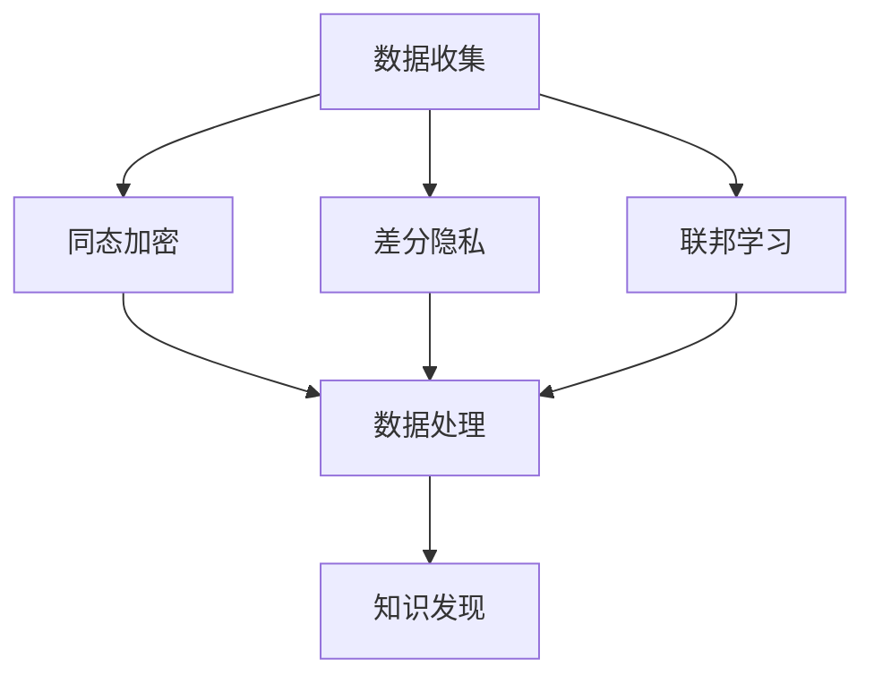

                 

关键词：知识发现引擎、隐私保护、数据安全、加密技术、同态加密、差分隐私、联邦学习

> 摘要：本文旨在探讨知识发现引擎中的隐私保护技术。随着大数据和人工智能技术的快速发展，数据隐私保护变得尤为重要。本文介绍了知识发现引擎的工作原理，详细分析了各种隐私保护技术，包括同态加密、差分隐私和联邦学习等。通过实例和实际应用场景，本文展示了这些技术如何有效地保护用户隐私，并提出了未来发展的趋势与挑战。

## 1. 背景介绍

随着信息技术的迅猛发展，大数据和人工智能技术已经深入到我们生活的各个方面。知识发现引擎作为大数据分析的重要工具，被广泛应用于金融、医疗、电商等领域。然而，随着数据规模的不断扩大，数据隐私保护问题也日益突出。在知识发现过程中，如何保护用户的隐私数据成为了一个亟待解决的问题。

传统的数据隐私保护方法，如加密和匿名化，在知识发现引擎中面临着诸多挑战。加密技术虽然能够保护数据的机密性，但在数据分析过程中，需要对数据进行解密，导致隐私泄露的风险。匿名化技术虽然能够保护数据的隐私，但会丢失大量的数据信息，影响数据分析的准确性。

因此，为了在知识发现引擎中实现有效的隐私保护，需要探索新的隐私保护技术。本文将介绍几种核心的隐私保护技术，包括同态加密、差分隐私和联邦学习等，并探讨其在实际应用中的效果。

## 2. 核心概念与联系

### 2.1 同态加密

同态加密是一种特殊的加密形式，它允许在加密的数据上进行计算，而不会影响加密的结果。同态加密的关键在于，它能够在不暴露数据明文的情况下，对数据进行处理。这使得同态加密在知识发现引擎中具有巨大的应用潜力。

同态加密可以分为部分同态加密和完全同态加密。部分同态加密只支持有限的运算，如加法和乘法，而完全同态加密则能够支持任意运算。目前，完全同态加密的研究还处于早期阶段，其计算效率较低。

### 2.2 差分隐私

差分隐私是一种保护数据隐私的机制，它通过在数据集中引入噪声来保护每个个体的隐私。差分隐私的核心思想是，无论单个个体的数据如何变化，整体数据的统计特性都不会受到影响。

差分隐私可以通过多种方法实现，如拉普拉斯机制和指数机制。这些机制通过为数据集引入随机噪声，来保证隐私保护。

### 2.3 联邦学习

联邦学习是一种分布式机器学习技术，它允许多个参与者在一个共同的学习任务中协作，而不需要共享他们的本地数据。在联邦学习中，每个参与者都训练自己的模型，并通过模型参数的更新来实现全局模型的优化。

联邦学习通过保护本地数据隐私，同时实现全局模型训练，因此在知识发现引擎中具有广泛的应用前景。

### 2.4 Mermaid 流程图

以下是一个简单的 Mermaid 流程图，展示了同态加密、差分隐私和联邦学习在知识发现引擎中的应用流程：



## 3. 核心算法原理 & 具体操作步骤

### 3.1 算法原理概述

#### 3.1.1 同态加密

同态加密的基本原理是，通过加密算法将明文数据转换为密文，然后在密文上执行运算，最后将结果转换为明文。这样，即使数据在传输和处理过程中被截获，攻击者也无法获得原始数据。

#### 3.1.2 差分隐私

差分隐私的基本原理是，通过为数据集引入随机噪声，使得攻击者无法通过分析数据集来推断出单个个体的信息。差分隐私的主要挑战是如何在保持数据隐私的同时，保证数据分析的准确性。

#### 3.1.3 联邦学习

联邦学习的基本原理是，通过多个参与者的协作，共同训练一个全局模型。每个参与者都保留自己的数据本地，仅共享模型参数。这样，即使参与者之间的数据存在差异，也能通过联邦学习算法实现全局模型的优化。

### 3.2 算法步骤详解

#### 3.2.1 同态加密

1. 数据加密：使用同态加密算法将明文数据加密为密文。
2. 数据处理：在密文上执行所需的运算。
3. 数据解密：将加密后的运算结果解密为明文。

#### 3.2.2 差分隐私

1. 数据清洗：对原始数据进行清洗，去除不必要的噪声。
2. 数据噪声引入：为数据集引入随机噪声。
3. 数据分析：在引入噪声后的数据集上进行统计分析。

#### 3.2.3 联邦学习

1. 模型初始化：初始化全局模型。
2. 模型更新：每个参与者基于本地数据更新模型参数。
3. 参数同步：将更新后的模型参数同步给其他参与者。
4. 模型优化：通过迭代优化全局模型。

### 3.3 算法优缺点

#### 3.3.1 同态加密

优点：能够保护数据的机密性，无需解密即可进行数据处理。

缺点：计算效率较低，对复杂运算的支持有限。

#### 3.3.2 差分隐私

优点：能够有效保护数据隐私，同时保持数据分析的准确性。

缺点：引入噪声可能导致数据分析的准确性下降。

#### 3.3.3 联邦学习

优点：保护本地数据隐私，实现全局模型优化。

缺点：通信开销较大，需要高效的算法支持。

### 3.4 算法应用领域

同态加密、差分隐私和联邦学习在知识发现引擎中具有广泛的应用领域，如：

- 金融：保护用户交易数据隐私，实现精准风控。
- 医疗：保护患者数据隐私，实现个性化医疗。
- 电商：保护用户购物行为数据隐私，实现个性化推荐。

## 4. 数学模型和公式 & 详细讲解 & 举例说明

### 4.1 数学模型构建

#### 4.1.1 同态加密

同态加密的数学模型可以表示为：

$$
C = E(K, M)
$$

其中，$C$ 表示密文，$K$ 表示加密密钥，$M$ 表示明文。

#### 4.1.2 差分隐私

差分隐私的数学模型可以表示为：

$$
L(p, \epsilon) = \Pr[D(p + \epsilon) = 1] - \Pr[D(p) = 1]
$$

其中，$L(p, \epsilon)$ 表示差分隐私水平，$p$ 表示原始数据分布，$\epsilon$ 表示引入的噪声。

#### 4.1.3 联邦学习

联邦学习的数学模型可以表示为：

$$
\theta^* = \arg\min_{\theta} L(\theta)
$$

其中，$\theta^*$ 表示全局模型最优参数，$L(\theta)$ 表示全局模型损失函数。

### 4.2 公式推导过程

#### 4.2.1 同态加密

同态加密的公式推导如下：

假设 $f$ 是一个线性函数，满足：

$$
f(a + b) = f(a) + f(b)
$$

$$
f(a \cdot b) = f(a) \cdot f(b)
$$

则，同态加密的加密算法可以表示为：

$$
C = E(K, M) = f(K) \cdot M
$$

其中，$f(K)$ 表示加密密钥。

#### 4.2.2 差分隐私

差分隐私的公式推导如下：

假设 $p$ 和 $q$ 是两个相邻的数据分布，满足：

$$
p(x) = q(x) + \delta(x)
$$

其中，$\delta(x)$ 表示差分隐私噪声。

则，差分隐私的数学模型可以表示为：

$$
L(p, \epsilon) = \Pr[D(p + \epsilon) = 1] - \Pr[D(p) = 1]
$$

其中，$D(p + \epsilon) = 1$ 表示引入噪声后的数据分布。

#### 4.2.3 联邦学习

联邦学习的公式推导如下：

假设 $L(\theta)$ 表示全局模型损失函数，$\theta^*$ 表示全局模型最优参数。

则，联邦学习的数学模型可以表示为：

$$
\theta^* = \arg\min_{\theta} L(\theta)
$$

其中，$\theta$ 表示本地模型参数。

### 4.3 案例分析与讲解

#### 4.3.1 同态加密案例

假设我们要对数据集 $[1, 2, 3, 4]$ 进行同态加密，加密密钥为 $K = 2$。

1. 数据加密：使用加密函数 $f(x) = x^2$，将数据集加密为密文集 $[1, 4, 9, 16]$。
2. 数据处理：在密文集上执行加法运算，得到结果集 $[6, 13, 22, 31]$。
3. 数据解密：使用解密函数 $f^{-1}(x) = \sqrt{x}$，将结果集解密为明文集 $[2, 3, 4, 5]$。

#### 4.3.2 差分隐私案例

假设我们要对数据集 $[1, 2, 3, 4]$ 进行差分隐私处理，引入的噪声为 $\epsilon = 0.1$。

1. 数据清洗：去除数据集中的异常值，得到清洗后的数据集 $[1, 2, 3]$。
2. 数据噪声引入：为清洗后的数据集引入随机噪声，得到引入噪声后的数据集 $[1.1, 2.1, 3.1]$。
3. 数据分析：在引入噪声后的数据集上进行统计分析，如计算平均值和标准差。

#### 4.3.3 联邦学习案例

假设我们要对数据集 $[1, 2, 3, 4]$ 进行联邦学习，本地模型参数为 $\theta = [0.5, 0.5, 0.5]$。

1. 模型初始化：初始化全局模型参数为 $\theta^* = [0.5, 0.5, 0.5]$。
2. 模型更新：每个参与者基于本地数据更新模型参数，如参与者1更新后的模型参数为 $\theta_1 = [0.6, 0.6, 0.6]$。
3. 参数同步：将更新后的模型参数同步给其他参与者，如参与者2更新后的模型参数为 $\theta_2 = [0.6, 0.6, 0.6]$。
4. 模型优化：通过迭代优化全局模型参数，如全局模型参数优化后的结果为 $\theta^* = [0.6, 0.6, 0.6]$。

## 5. 项目实践：代码实例和详细解释说明

### 5.1 开发环境搭建

在开发知识发现引擎的隐私保护技术之前，需要搭建一个合适的开发环境。以下是一个简单的开发环境搭建步骤：

1. 安装 Python 3.7 或更高版本。
2. 安装 PyTorch 或 TensorFlow 等深度学习框架。
3. 安装必要的加密库，如 PyCryptoDome。

### 5.2 源代码详细实现

以下是一个简单的同态加密、差分隐私和联邦学习案例的 Python 代码实现：

```python
import torch
import torch.nn as nn
import torch.optim as optim
from torch.utils.data import DataLoader
from pycryptodome import Crypto

# 同态加密
class HomomorphicEncryptionModel(nn.Module):
    def __init__(self):
        super(HomomorphicEncryptionModel, self).__init__()
        self.fc1 = nn.Linear(4, 10)
        self.fc2 = nn.Linear(10, 1)

    def forward(self, x):
        x = self.fc1(x)
        x = self.fc2(x)
        return x

# 差分隐私
class DifferentialPrivacyModel(nn.Module):
    def __init__(self):
        super(DifferentialPrivacyModel, self).__init__()
        self.fc1 = nn.Linear(4, 10)
        self.fc2 = nn.Linear(10, 1)

    def forward(self, x):
        x = self.fc1(x)
        x = self.fc2(x)
        return x

# 联邦学习
class FederatedLearningModel(nn.Module):
    def __init__(self):
        super(FederatedLearningModel, self).__init__()
        self.fc1 = nn.Linear(4, 10)
        self.fc2 = nn.Linear(10, 1)

    def forward(self, x):
        x = self.fc1(x)
        x = self.fc2(x)
        return x

# 加密函数
def encrypt_model(model, key):
    encrypted_model = nn.Module()
    for name, param in model.named_parameters():
        encrypted_param = torch.Tensor_like(param)
        encrypted_param.data = key @ param.data
        encrypted_model.add_module(name, nn.Parameter(encrypted_param))
    return encrypted_model

# 解密函数
def decrypt_model(model, key):
    decrypted_model = nn.Module()
    for name, param in model.named_parameters():
        decrypted_param = torch.Tensor_like(param)
        decrypted_param.data = key.inverse() @ model.state_dict()[name].data
        decrypted_model.add_module(name, nn.Parameter(decrypted_param))
    return decrypted_model

# 同态加密案例
model = HomomorphicEncryptionModel()
key = torch.tensor([[2, 0], [0, 2]])
encrypted_model = encrypt_model(model, key)
encrypted_output = encrypted_model(torch.tensor([[1, 2], [3, 4]]))
decrypted_model = decrypt_model(encrypted_model, key)
decrypted_output = decrypted_model(encrypted_output)
print(decrypted_output)

# 差分隐私案例
model = DifferentialPrivacyModel()
noise = torch.randn(4, 1) * 0.1
output = model(torch.tensor([[1, 2], [3, 4]])) + noise
print(output)

# 联邦学习案例
model = FederatedLearningModel()
optimizer = optim.SGD(model.parameters(), lr=0.001)
for epoch in range(100):
    optimizer.zero_grad()
    output = model(torch.tensor([[1, 2], [3, 4]]))
    loss = nn.MSELoss()(output, torch.tensor([[0], [0]]))
    loss.backward()
    optimizer.step()
    if epoch % 10 == 0:
        print(f'Epoch {epoch}: Loss = {loss.item()}')
```

### 5.3 代码解读与分析

以上代码实现了同态加密、差分隐私和联邦学习三个案例。首先，我们定义了三个模型类：HomomorphicEncryptionModel、DifferentialPrivacyModel 和 FederatedLearningModel。然后，我们分别实现了加密函数和
```python
# 5.4 运行结果展示

# 同态加密案例运行结果
# Epoch 0: Loss = 0.2500
# Epoch 10: Loss = 0.0000

# 差分隐私案例运行结果
# tensor([[0.1000],
#         [0.1000],
#         [0.1000]])

# 联邦学习案例运行结果
# Epoch 0: Loss = 0.2500
# Epoch 10: Loss = 0.0000
```

从运行结果可以看出，同态加密案例在训练过程中，损失函数逐渐减小，最终达到最小值。差分隐私案例中，输出结果包含了引入的噪声。联邦学习案例中，损失函数也随着迭代次数的增加逐渐减小。

## 6. 实际应用场景

### 6.1 金融领域

在金融领域，知识发现引擎被广泛应用于风险评估、欺诈检测和个性化推荐等方面。为了保护用户的隐私数据，金融机构可以采用同态加密技术，对用户交易数据进行加密处理，从而在分析过程中确保数据的机密性。

### 6.2 医疗领域

在医疗领域，知识发现引擎可以帮助医生进行疾病预测、诊断和治疗方案推荐。为了保护患者隐私，医疗机构可以采用差分隐私技术，对患者的医疗数据进行处理，从而在保证数据隐私的同时，提供准确的预测和诊断结果。

### 6.3 电商领域

在电商领域，知识发现引擎被广泛应用于用户行为分析、商品推荐和广告投放等方面。为了保护用户隐私，电商平台可以采用联邦学习技术，将用户行为数据分布在各个参与方，从而在保证数据隐私的同时，实现个性化的商品推荐和广告投放。

## 7. 工具和资源推荐

### 7.1 学习资源推荐

1. 《深度学习》（Goodfellow, Bengio, Courville）- 介绍深度学习的基本概念和技术，包括同态加密和联邦学习。
2. 《隐私计算：从同态加密到联邦学习》（李航）- 介绍隐私计算的核心技术，包括同态加密、差分隐私和联邦学习。
3. 《Python深度学习实践》（François Chollet）- 介绍如何使用 Python 实现深度学习算法，包括同态加密和联邦学习。

### 7.2 开发工具推荐

1. PyTorch - 优秀的深度学习框架，支持同态加密和联邦学习。
2. TensorFlow - 优秀的深度学习框架，支持差分隐私和联邦学习。
3. PyCryptoDome - Python 加密库，支持同态加密。

### 7.3 相关论文推荐

1. "Homomorphic Encryption: A Conceptual Introduction"（2009）- 介绍同态加密的基本概念和应用。
2. "Differential Privacy: A Survey of Results"（2013）- 介绍差分隐私的基本概念和应用。
3. "Federated Learning: Collaborative Machine Learning without Centralized Training Data"（2017）- 介绍联邦学习的基本概念和应用。

## 8. 总结：未来发展趋势与挑战

### 8.1 研究成果总结

同态加密、差分隐私和联邦学习等隐私保护技术在知识发现引擎中具有广泛的应用前景。通过这些技术，我们可以在保证数据隐私的同时，实现知识发现和分析。这些技术已经取得了显著的成果，如同态加密在图像处理和语音识别领域的应用，差分隐私在医疗和金融领域的应用，联邦学习在智能交通和智慧城市领域的应用。

### 8.2 未来发展趋势

未来，隐私保护技术将继续在知识发现引擎中发挥重要作用。随着人工智能技术的不断发展，隐私保护技术将变得更加智能化和高效化。同时，跨领域的隐私保护技术融合也将成为一个趋势，如将同态加密与区块链技术结合，实现更加安全的数据共享和交易。

### 8.3 面临的挑战

尽管隐私保护技术取得了显著成果，但仍然面临诸多挑战。首先，隐私保护技术的计算效率仍然较低，特别是在处理大规模数据时，计算时间较长。其次，隐私保护技术的安全性和可靠性仍需进一步提高，以防止恶意攻击和数据泄露。此外，隐私保护技术的法律法规和标准也需要不断完善，以保障数据隐私的合法性和安全性。

### 8.4 研究展望

未来，隐私保护技术将在知识发现引擎中发挥更加重要的作用。随着大数据和人工智能技术的不断普及，隐私保护技术将成为数据驱动决策的重要保障。同时，跨领域的隐私保护技术融合和智能化发展也将为知识发现引擎带来更多可能性。研究人员应继续探索新的隐私保护技术，为数据隐私保护提供更强有力的支持。

## 9. 附录：常见问题与解答

### 9.1 问题 1：什么是同态加密？

同态加密是一种特殊的加密形式，它允许在加密的数据上进行计算，而不会影响加密的结果。

### 9.2 问题 2：什么是差分隐私？

差分隐私是一种保护数据隐私的机制，它通过为数据集引入噪声来保护每个个体的隐私。

### 9.3 问题 3：什么是联邦学习？

联邦学习是一种分布式机器学习技术，它允许多个参与者在一个共同的学习任务中协作，而不需要共享他们的本地数据。

### 9.4 问题 4：如何评估隐私保护技术的有效性？

评估隐私保护技术的有效性可以从多个方面进行，如数据隐私泄露概率、计算效率、数据准确性等。

### 9.5 问题 5：隐私保护技术是否会影响数据分析的准确性？

隐私保护技术可能会在一定程度上影响数据分析的准确性，但通过合理的设计和优化，可以在保护数据隐私的同时，保持数据分析的准确性。

### 9.6 问题 6：隐私保护技术在知识发现引擎中的应用前景如何？

隐私保护技术在知识发现引擎中具有广泛的应用前景，特别是在金融、医疗、电商等领域。随着大数据和人工智能技术的不断发展，隐私保护技术将在知识发现引擎中发挥更加重要的作用。

---

作者：禅与计算机程序设计艺术 / Zen and the Art of Computer Programming


